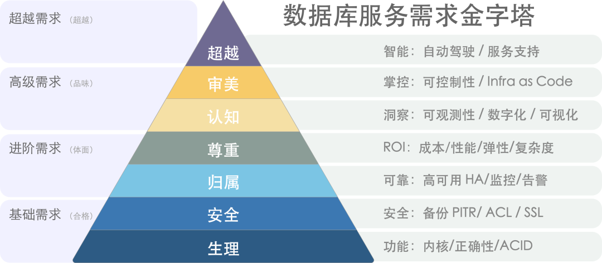
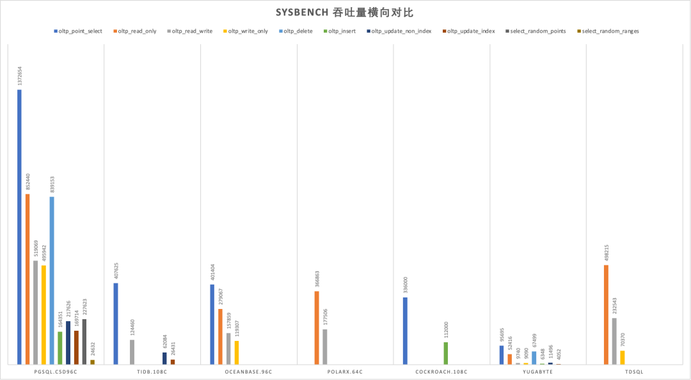
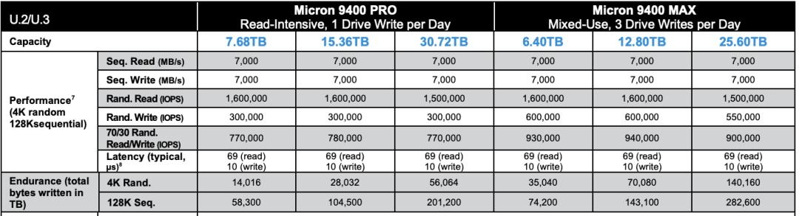

> [WeChat Column](https://mp.weixin.qq.com/s/-eaCoZR9Z5srQ-1YZm1QJA)

As hardware technology advances, the capacity and performance of standalone databases have reached unprecedented heights. In this transformative era, distributed (TP) databases appear utterly powerless, much like the "data middle platform," donning the emperor's new clothes in a state of self-deception.

- [TL; DR](#tl-dr)
- [The Pull of the Internet](#the-pull-of-the-internet)
- [The Trade-Offs of Distributive](#the-trade-offs-of-distributive)
- [The Impact of New Hardware](#the-impact-of-new-hardware)
- [The Predicament of False Needs](#the-predicament-of-false-needs)
- [The Struggles in Confusion](#the-struggles-in-confusion)
- [References](#references)

----------------

## TL; DR

The core trade-off of distributed databases is: "**quality for quantity**," sacrificing functionality, performance, complexity, and reliability for greater data capacity and throughput. However, "what divides must eventually converge," and hardware innovations have propelled centralized databases to new heights in capacity and throughput, rendering distributed (TP) databases obsolete.

Hardware, exemplified by NVMe SSDs, follows Moore's Law, evolving at an exponential pace. Over a decade, performance has increased by tens of times, and prices have dropped significantly, **improving the cost-performance ratio by three orders of magnitude**. A single card can now hold 32TB+, with 4K random read/write IOPS reaching 1600K/600K, latency at 70µs/10µs, and a cost of less than 200 ¥/TB·year. Running a centralized database on a single machine can achieve one to two million point write/point query QPS.

Scenarios truly requiring distributed databases are few and far between, with typical mid-sized internet companies/banks handling request volumes ranging from tens to hundreds of thousands of QPS, and non-repetitive TP data at the hundred TB level. **In the real world, over 99% of scenarios do not need distributed databases**, and the remaining 1% can likely be addressed through classic engineering solutions like horizontal/vertical partitioning.

Top-tier internet companies might have a few genuine use cases, yet these companies have no intention to pay. The market simply cannot sustain so many distributed database cores, and the few products that do survive don't necessarily rely on distribution as their selling point. HATP and the integration of distributed and standalone databases represent the struggles of confused distributed TP database vendors seeking transformation, but they are still far from achieving product-market fit.

----------------

## The Pull of the Internet

"Distributed database" is not a term with a strict definition. In a narrow sense, it highly overlaps with NewSQL databases such as CockroachDB, YugabyteDB, TiDB, OceanBase, and TDSQL; broadly speaking, classic databases like Oracle, PostgreSQL, MySQL, SQL Server, PolarDB, and Aurora, which span multiple physical nodes and use master-slave replication or shared storage, can also be considered distributed databases. **In the context of this article, a distributed database refers to the former, specifically focusing on transactional processing (OLTP) distributed relational databases**.

The rise of distributed databases stemmed from the rapid development of internet applications and the explosive growth of data volumes. In that era, traditional relational databases often encountered performance bottlenecks and scalability issues when dealing with massive data and high concurrency. Even using Oracle with Exadata struggled in the face of voluminous CRUD operations, not to mention the prohibitively expensive annual hardware and software costs.

Internet companies embarked on a different path, building their infrastructure with free, open-source databases like MySQL. Veteran developers/DBAs might still recall the MySQL best practice: keep single-table records below 21 million to avoid rapid performance degradation. Correspondingly, database sharding became a widely recognized practice among large companies.

The basic idea here was "three cobblers with their wits combined equal Zhuge Liang," using a bunch of inexpensive x86 servers + numerous sharded open-source database instances to create a massive CRUD simple data store. Thus, **distributed databases often originated from internet company scenarios, evolving along the manual sharding → sharding middleware → distributed database path**.

As an industry solution, distributed databases have successfully met the needs of internet companies. However, before abstracting and solidifying it into a product for external output, several questions need to be clarified:

**Do the trade-offs from ten years ago still hold up today?**

**Are the scenarios of internet companies applicable to other industries?**

**Could distribute OLTP databases be a false necessity?**

----------------

## The Trade-Offs of Distributive

"Distributed," along with buzzwords like "HTAP," "compute-storage separation," "Serverless," and "lakehouse," holds no inherent meaning for enterprise users. Practical clients focus on tangible attributes and capabilities: functionality, performance, security, reliability, return on investment, and cost-effectiveness. **What truly matters is the trade-off: compared to classic centralized databases, what do distributed databases sacrifice, and what do they gain in return?**

> [数据库需求层次金字塔](http://mp.weixin.qq.com/s?__biz=MzU5ODAyNTM5Ng==&mid=2247485399&idx=1&sn=0b7d5a7dc24295afcc56ec688b2c2d06&chksm=fe4b320cc93cbb1a369f9c9a7c50811c6a4f784fd2dd070f6ce5b16378502b8e5c7c76b716e1&scene=21#wechat_redirect)[1]

**The core trade-off of distributed databases can be summarized as "quality for quantity": sacrificing functionality, performance, complexity, and reliability to gain greater data capacity and request throughput.**

NewSQL often markets itself on the concept of "distribution," solving **scalability** issues through "distribution." Architecturally, it typically features multiple peer data nodes and a coordinator, employing distributed consensus protocols like Paxos/Raft for replication, allowing for **horizontal scaling** by adding data nodes.

**Firstly**, due to their inherent limitations, distributed databases sacrifice many **features**, offering only basic and limited CRUD query support. **Secondly**, because distributed databases require multiple network RPCs to complete requests, their **performance** typically suffers a 70% or more degradation compared to centralized databases. **Furthermore**, distributed databases, consisting of DN/CN and TSO components among others, introduce significant **complexity** in operations and management. **Lastly**, in terms of **high availability and disaster recovery**, distributed databases do not offer a qualitative improvement over the classic centralized master-slave setup; instead, they introduce numerous additional failure points due to their complex components.

> [SYSBENCH吞吐对比](https://mp.weixin.qq.com/s/651zXDKGwFy8i0Owrmm-Xg)[2]

In the past, the trade-offs of distributed databases were justified: the internet required larger data storage capacities and higher access throughputs—a must-solve problem, and these drawbacks were surmountable. But today, hardware advancements have rendered the "quantity" question obsolete, thus erasing the raison d'être of distributed databases along with the very problem they sought to solve.

> Times have changed, My lord!

----------------

## The Impact of New Hardware

Moore's Law posits that every 18 to 24 months, processor performance doubles while costs halve. This principle largely applies to storage as well. From 2013 to 2023, spanning 5 to 6 cycles, we should see performance and cost differences of **dozens of times** compared to a decade ago. Is this the case?

Let's examine the performance metrics of a typical SSD from 2013 and compare them with those of a typical PCI-e Gen4 NVMe SSD from 2022. It's evident that the SSD's 4K random read/write IOPS have jumped from **60K/40K** to **1600K/600K**, with prices plummeting from **2220$/TB** to **40$/TB**. Performance has improved by 15 to 26 times, while prices have dropped 56-fold[3,4,5], certainly validating the rule of thumb at a magnitude level.

> HDD/SSD Performance in 2013

> NVMe Gen4 SSD in 2022

A decade ago, mechanical hard drives dominated the market. A 1TB hard drive cost about seven or eight hundred yuan, and a 64GB SSD was even more expensive. Ten years later, a mainstream 3.2TB enterprise-grade NVMe SSD costs just three thousand yuan. Considering a five-year warranty, the monthly cost per TB is only **16** yuan, with an annual cost under **200** yuan. For reference, cloud providers' reputedly cost-effective S3 object storage costs **1800¥/TB·year.**

> Price per unit of SSD/HDD from 2013 to 2030 with predictions

The typical fourth-generation local NVMe disk can reach a maximum capacity of **32TB to 64TB**, offering **70µs/10µs** 4K random read/write latencies, and **1600K/600K** read/write IOPS, with the fifth generation boasting an astonishing bandwidth of **several GB/s** per card.

Equipping a classic Dell 64C / 512G server with such a card, factoring in five years of IDC depreciation, the total cost is under one hundred thousand yuan. Such a server running PostgreSQL **sysbench** can nearly reach one million QPS for single-point writes and two million QPS for point queries without issue.

What does this mean? For a typical mid-sized internet company/bank, the demand for database requests is usually in the tens of thousands to hundreds of thousands of QPS, with non-repeated TP data volumes fluctuating around hundreds of TBs. Considering hardware storage compression cards can achieve several times compression ratio, such scenarios might now be manageable by a centralized database on a single machine and card under modern hardware conditions[6].

Previously, users might have had to invest millions in high-end storage solutions like exadata, then spend a fortune on Oracle commercial database licenses and original factory services. Now, achieving similar outcomes starts with just a few thousand yuan on an enterprise-grade SSD card; open-source Oracle alternatives like PostgreSQL, capable of smoothly running the largest single tables of 32TB, no longer suffer from the limitations that once forced MySQL into partitioning. High-performance database services, once luxury items restricted to intelligence/banking sectors, have become affordable for all industries[7].

**Cost-effectiveness is the primary product strength**. The cost-effectiveness of high-performance, large-capacity storage has improved by three orders of magnitude over a decade, making the once-highlighted value of distributed databases appear weak in the face of such remarkable hardware evolution.

----------------

## The Predicament of False Needs

Nowadays, sacrificing functionality, performance, complexity for scalability is most likely to be a fake-demands in most scenarios.

With the support of modern hardware, over 99% of real-world scenarios do not exceed the capabilities of a centralized, single-machine database. The remaining scenarios can likely be addressed through classical engineering methods like horizontal or vertical splitting. This holds true even for internet companies: even among the global top firms, scenarios where a transactional (TP) single table exceeds several tens of TBs are still rare.

Google Spanner, the forefather of NewSQL, was designed to solve the problem of massive data scalability, but how many enterprises actually handle data volumes comparable to Google's? In terms of data volume, the lifetime TP data volume for the vast majority of enterprises will not exceed the bottleneck of a centralized database, which continues to grow exponentially with Moore's Law. Regarding request throughput, many enterprises have enough database performance headroom to implement all their business logic in stored procedures and run it smoothly within the database.

"*Premature optimization is the root of all evil*," designing for unneeded scale is a waste of effort. If volume is no longer an issue, then sacrificing other attributes for unneeded volume becomes meaningless.

> “Premature optimization is the root of all evil”

**In many subfields of databases, distributed technology is not a pseudo-requirement**: if you need a highly reliable, disaster-resilient, simple, low-frequency KV storage for metadata, then a distributed etcd is a suitable choice; if you require a globally distributed table for arbitrary reads and writes across different locations and are willing to endure significant performance degradation, then YugabyteDB might be a good choice. For ensuring transparency and preventing tampering and denial, blockchain is fundamentally a leaderless distributed ledger database;

For large-scale data analytics (OLAP), distributed technology is **indispensable** (though this is usually referred to as data warehousing, MPP); however, in the transaction processing (OLTP) domain, distributed technology is **largely unnecessary**: OLTP databases are like working memory, characterized by being small, fast, and feature-rich. Even in very large business systems, the active working set at any one moment is not particularly large. A basic rule of thumb for OLTP system design is: **If your problem can be solved within a single machine, don't bother with distributed databases**.

**OLTP** databases have a history spanning several decades, with existing cores developing to a mature stage. Standards in the TP domain are gradually converging towards three Wire Protocols: PostgreSQL, MySQL, and Oracle. If the discussion is about tinkering with database auto-sharding and adding global transactions as a form of "distribution," it's definitely a dead end. If a "distributed" database manages to break through, it's likely not because of the "pseudo-requirement" of "distribution," but rather due to new features, open-source ecosystems, compatibility, ease of use, domestic innovation, and self-reliance.

----------------

## The Struggles in Confusion

The greatest challenge for distributed databases stems from the market structure: **Internet companies, the most likely candidates to utilize distributed TP databases, are paradoxically the least likely to pay for them**. Internet companies can serve as high-quality users or even contributors, offering case studies, feedback, and PR, but they inherently resist the notion of financially supporting software, clashing with their **meme instincts**. Even leading distributed database vendors face the challenge of being applauded but not financially supported.

In a recent casual conversation with an engineer at a distributed database company, it was revealed that during a POC with a client, a query that Oracle completed in 10 seconds, their distributed database could only match with an order of magnitude difference, even when utilizing various resources and Dirty Hacks. Even openGauss, which forked from PostgreSQL 9.2 a decade ago, can outperform many distributed databases in certain scenarios, not to mention the advancements seen in PostgreSQL 15 and Oracle 23c ten years later. This gap is so significant that even the original manufacturers are left puzzled about the future direction of distributed databases.

Thus, some distributed databases have started pivoting towards self-rescue, with **HTAP** being a prime example: while transaction processing in a distributed setting is suboptimal, analytics can benefit greatly. So, why not combine the two? A single system capable of handling both transactions and analytics! However, engineers in the real world understand that **AP systems and TP systems each have their own patterns, and forcibly merging two diametrically opposed systems will only result in both tasks failing to succeed**. Whether it's classic ETL/CDC pushing and pulling to specialized solutions like ClickHouse/Greenplum/Doris, or logical replication to a dedicated in-memory columnar store, any of these approaches is more reliable than using a chimera HTAP database.

Another idea is **monolithic-distributed integration**: **if you can't beat them, join them** by adding a monolithic mode to avoid the high costs of network RPCs, ensuring that in 99% of scenarios where distributed capabilities are unnecessary, they aren't completely outperformed by centralized databases — **even if distributed isn't needed, it's essential to stay in the game and prevent others from taking the lead!** But the fundamental issue here is the same as with HTAP: forcing heterogeneous data systems together is pointless. If there was value in doing so, why hasn't anyone created a monolithic binary that integrates all heterogeneous databases into a do-it-all behemoth — **the Database Jack-of-all-trades?** Because it violates the KISS principle: **Keep It Simple, Stupid!**

The plight of distributed databases is similar to that of **Middle Data Platforms**: originating from internal scenarios at major internet companies and solving domain-specific problems. Once riding the wave of the internet industry, the discussion of databases was dominated by distributed technologies, enjoying a moment of pride. However, due to excessive hype and promises of unrealistic capabilities, they failed to meet user expectations, ending in disappointment and becoming akin to the emperor's new clothes.

There are still many areas within the TP database field worthy of focus: Leveraging new hardware, actively embracing changes in underlying architectures like CXL, RDMA, NVMe; or providing simple and intuitive declarative interfaces to make database usage and management more convenient; offering more intelligent automatic monitoring and control systems to minimize operational tasks; developing compatibility plugins like Babelfish for MySQL/Oracle, aiming for a unified relational database WireProtocol. Even investing in better support services would be more meaningful than chasing the false need for "distributed" features.

Time changes, and a wise man adapts. It is hoped that distributed database vendors will find their Product-Market Fit and focus on what users truly need.

----------------

## References

[1] [数据库需求层次金字塔 ](http://mp.weixin.qq.com/s?__biz=MzU5ODAyNTM5Ng==&mid=2247485399&idx=1&sn=0b7d5a7dc24295afcc56ec688b2c2d06&chksm=fe4b320cc93cbb1a369f9c9a7c50811c6a4f784fd2dd070f6ce5b16378502b8e5c7c76b716e1&scene=21#wechat_redirect): *https://mp.weixin.qq.com/s/1xR92Z67kvvj2_NpUMie1Q* 

[2] [PostgreSQL到底有多强？](http://mp.weixin.qq.com/s?__biz=MzU5ODAyNTM5Ng==&mid=2247485240&idx=1&sn=9052f03ae2ef21d9e21037fd7a1fa7fe&chksm=fe4b32e3c93cbbf522616346c1afd49e1e6edbb0898694df224fe2134a69c0c4562aab35587a&scene=21#wechat_redirect) : *https://mp.weixin.qq.com/s/651zXDKGwFy8i0Owrmm-Xg* 

[3] SSD Performence in 2013 : *https://www.snia.org/sites/default/files/SNIASSSI.SSDPerformance-APrimer2013.pdf* 

[4] 2022 Micron NVMe SSD Spec: *https://media-www.micron.com/-/media/client/global/documents/products/product-flyer/9400_nvme_ssd_product_brief.pdf*

[5] 2013-2030 SSD Pricing : *https://blocksandfiles.com/2021/01/25/wikibon-ssds-vs-hard-drives-wrights-law/*

[6] [Single Instance with 100TB](https://mp.weixin.qq.com/s?__biz=MzIxNTQ0MDQxNg==&mid=2247516311&idx=1&sn=b93dc765a952f998ccea6e85ebfb7b8d&scene=21#wechat_redirect): [*https://mp.weixin.qq.com/s/JSQPzep09rDYbM-x5ptsZA*](https://mp.weixin.qq.com/s?__biz=MzIxNTQ0MDQxNg==&mid=2247516311&idx=1&sn=b93dc765a952f998ccea6e85ebfb7b8d&scene=21#wechat_redirect)

[7] [EBS: Scam](http://mp.weixin.qq.com/s?__biz=MzU5ODAyNTM5Ng==&mid=2247485391&idx=1&sn=4cec9af2b58160eb345a6b12411f0b68&chksm=fe4b3214c93cbb023c13a89133c75bf1e88e1543de9359df7447498e4a9d5ec555313a954566&scene=21#wechat_redirect): *https://mp.weixin.qq.com/s/UxjiUBTpb1pRUfGtR9V3ag*

[8] [中台：一场彻头彻尾的自欺欺人](https://mp.weixin.qq.com/s?__biz=Mzg3NjcyNDk3MQ==&mid=2247486918&idx=1&sn=c1c0331b01e2c91e65ec6ed755093582&scene=21#wechat_redirect): *https://mp.weixin.qq.com/s/VgTU7NcOwmrX-nbrBBeH_w*