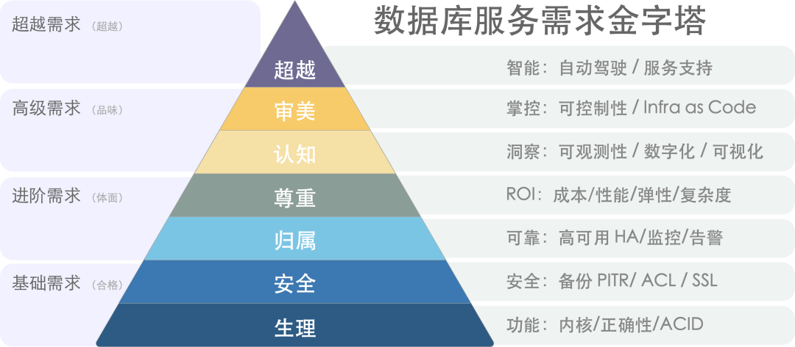
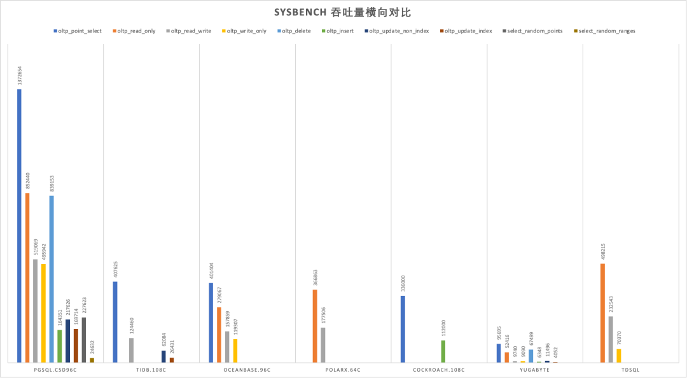
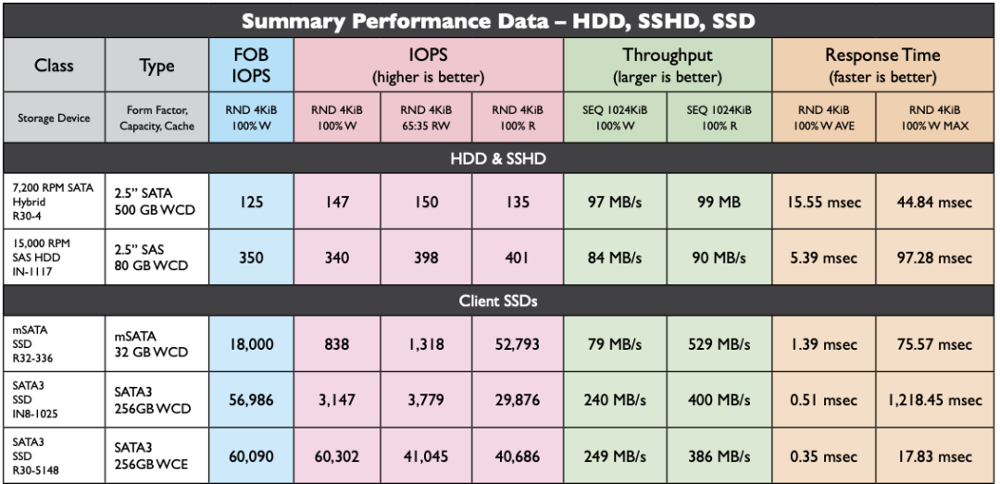
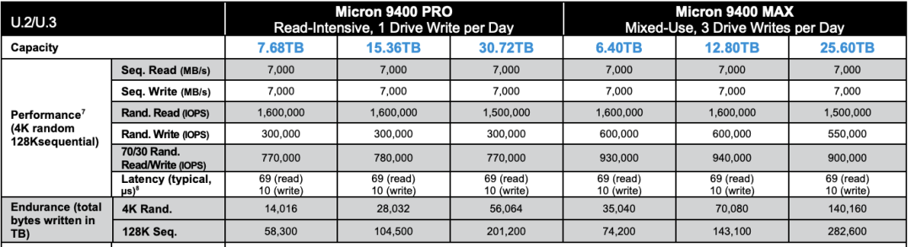
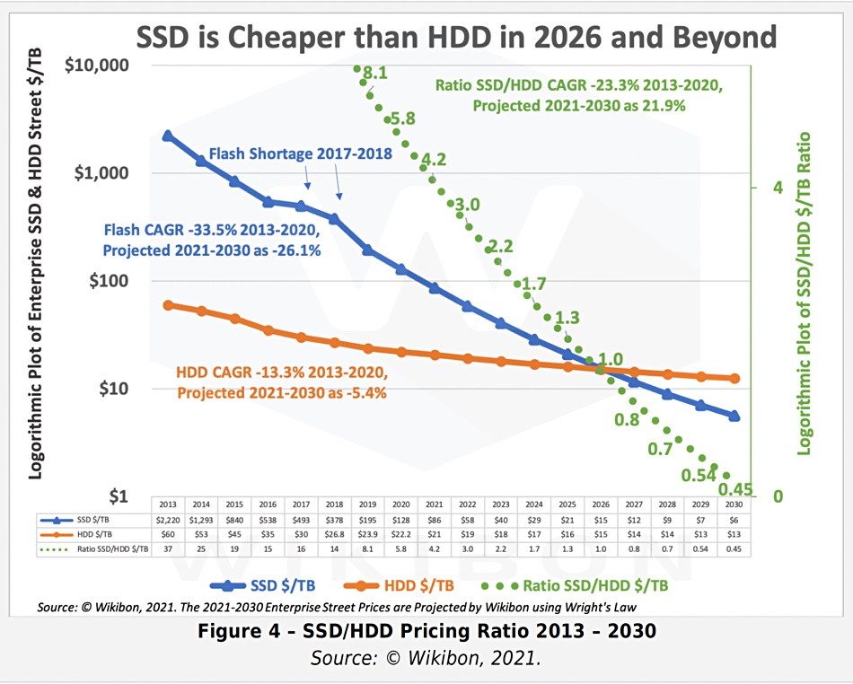

随着硬件技术的进步，单机数据库的容量和性能已达到了前所未有的高度。而分布式(TP)数据库在这种变革面前极为无力，和“数据中台”一样穿着皇帝的新衣，处于自欺欺人的状态里。

- [太长不看](#太长不看)
- [互联网的牵引](#互联网的牵引)
- [分布式的权衡](#分布式的权衡)
- [新硬件的冲击](#新硬件的冲击)
- [伪需求的困境](#伪需求的困境)
- [迷茫下的挣扎](#迷茫下的挣扎)
- [Reference](#reference)

----------------

## 太长不看

分布式数据库的核心权衡是：“**以质换量**”，牺牲功能、性能、复杂度、可靠性，换取更大的数据容量与请求吞吐量。但分久必合，硬件变革让集中式数据库的容量与吞吐达到一个全新高度，使分布式(TP)数据库失去了存在意义。

以 NVMe SSD 为代表的硬件遵循摩尔定律以指数速度演进，十年间性能翻了几十倍，价格降了几十倍，**性价比提高了三个数量级**。单卡 32TB+， 4K随机读写 IOPS 可达 1600K/600K，延时 70µs/10µs，价格不到 200 ¥/TB·年。跑集中式数据库单机能有一两百万的点写/点查 QPS。

真正需要分布式数据库的场景屈指可数，典型的中型互联网公司/银行请求数量级在几万到几十万QPS，不重复TP数据在百TB上下量级。**真实世界中 99% 以上的场景用不上分布式数据库**，剩下1%也大概率可以通过经典的水平/垂直拆分等工程手段解决。

头部互联网公司可能有极少数真正的适用场景，然而此类公司没有任何付费意愿。市场根本无法养活如此之多的分布式数据库内核，能够成活的产品靠的也不见得是分布式这个卖点。HATP 、分布式单机一体化是迷茫分布式TP数据库厂商寻求转型的挣扎，但离 PMF 仍有不小距离。

----------------

## 互联网的牵引

“分布式数据库” 并不是一个严格定义的术语。狭义上它与 NewSQL：cockroachdb / yugabytesdb / tidb / oceanbase / TDSQL 等数据库高度重合；广义上 Oracle / PostgreSQL / MySQL / SQL Server / PolarDB / Aurora 这种跨多个物理节点，使用主从复制或者共享存储的经典数据库也能归入其中。**在本文语境中，分布式数据库指前者，且只涉及核心定位为事务处理型（OLTP）的分布式关系型数据库**。

分布式数据库的兴起源于互联网应用的快速发展和数据量的爆炸式增长。在那个时代，传统的关系型数据库在面对海量数据和高并发访问时，往往会出现性能瓶颈和可伸缩性问题。即使用 Oracle 与 Exadata，在面对海量 CRUD 时也有些无力，更别提每年以百千万计的高昂软硬件费用。

互联网公司走上了另一条路，用诸如 MySQL 这样免费的开源数据库自建。老研发/DBA可能还会记得那条 MySQL 经验规约：单表记录不要超过 2100万，否则性能会迅速劣化；与之对应的是，数据库分库分表开始成为大厂显学。

这里的基本想法是“三个臭皮匠，顶个诸葛亮”，用一堆便宜的 x86 服务器 + 大量分库分表开源数据库实例弄出一个海量 CRUD 简单数据存储。故而，**分布式数据库往往诞生于互联网公司的场景，并沿着手工分库分表 → 分库分表中间件 → 分布式数据库这条路径发展进步**。

作为一个行业解决方案，分布式数据库成功满足了互联网公司的场景需求。但是如果想把它抽象沉淀成一个产品对外输出，还需要想清楚几个问题：

**十年前的利弊权衡，在今天是否依然成立？**

**互联网公司的场景，对其他行业是否适用？**

**分布式事务数据库，会不会是一个伪需求？**

----------------

## 分布式的权衡

“**分布式**” 同 “*HTAP*”、 “*存算分离*”、“*Serverless*”、“*湖仓一体*” 这样的Buzzword一样，对企业用户来说没有意义。务实的甲方关注的是实打实的属性与能力：功能性能、安全可靠、投入产出、成本效益。**真正重要的是利弊权衡：分布式数据库相比经典集中式数据库，牺牲了什么换取了什么？**

> [数据库需求层次金字塔](http://mp.weixin.qq.com/s?__biz=MzU5ODAyNTM5Ng==&mid=2247485399&idx=1&sn=0b7d5a7dc24295afcc56ec688b2c2d06&chksm=fe4b320cc93cbb1a369f9c9a7c50811c6a4f784fd2dd070f6ce5b16378502b8e5c7c76b716e1&scene=21#wechat_redirect)[1]

**分布式数据库的核心Trade Off 可以概括为：“以质换量”：牺牲功能、性能、复杂度、可靠性，换取更大的数据容量与请求吞吐量。**

NewSQL 通常主打“分布式”的概念，通过“分布式”解决**水平伸缩性**问题。在架构上通常拥有多个对等数据节点以及协调者，使用分布式共识协议 Paxos/Raft 进行复制，可以通过添加数据节点的方式进行**水平伸缩**。

**首先**，分布式数据库因其内在局限性，会牺牲许多**功能**，只能提供较为简单有限的 CRUD 查询支持。**其次**，分布式数据库因为需要通过多次网络 RPC 完成请求，所以**性能**相比集中式数据库通常有70%以上的折损。**再者**，分布式数据库通常由DN/CN以及TSO等多个组件构成，运维管理复杂，引入大量非本质**复杂度**。**最后**，分布式数据库在**高可用容灾**方面相较于经典集中式主从并没有质变，反而因为复数组件引入大量额外失效点。

> [sysbench 吞吐对比](https://mp.weixin.qq.com/s/651zXDKGwFy8i0Owrmm-Xg)[2]

在以前，分布式数据库的利弊权衡是成立的：互联网需要更大的数据存储容量与更高的访问吞吐量：这个问题是必须解决的，而这些缺点是可以克服的。但今日，硬件的发展废问了 量 的问题，那么分布式数据库的存在意义就连同着它想解决的问题本身被一并抹除了。

> 时代变了，大人

----------------

## 新硬件的冲击

摩尔定律指出，每18～24个月，处理器性能翻倍，成本减半。这个规律也基本适用于存储。从2013年开始到2023年是5～6个周期，性能和成本和10年前比应该有**几十倍**的差距，是不是这样呢？

让我们看一下 2013 年典型 SSD 的性能指标，并与 2022 年 PCI-e Gen4 NVMe SSD 的典型产品进行对比。不难发现：硬盘4K随机读写 IOPS从 **60K/40K** 到了 **1600K/600K**，价格从 **2220$/TB** 到 **40$/TB** 。性能翻了15 ～ 26倍，价格便宜了56 倍[3,4,5]，作为经验法则在数量级上肯定是成立了。

> 2013 年 HDD/SSD 性能指标

> 2022 年NVMe Gen4 SSD 性能指标

十年前，机械硬盘还是绝对主流。1TB 的硬盘价格大概七八百元，64GB 的SSD 还要再贵点。十年后，主流 3.2TB 的企业级 NVMe SSD 也不过三千块钱。按五年质保折算，1TB每月成本只要 **16**块钱，每年成本不到 **200块**。作为参考，云厂商号称物美价廉的 S3对象存储都要 **1800¥/TB·年。**

> 2013 - 2030 SSD/HDD 单位价格与预测

典型的第四代本地 NVMe 磁盘单卡最大容量可达 **32TB～ 64TB**，提供 **70µs/10µs** 4K随机读/写延迟，**1600K/600K** 的读写IOPS，第五代更是有着单卡**十几GB/s** 的惊人带宽。

这样的卡配上一台经典 Dell 64C / 512G 服务器，IDC代维5年折旧，总共十万块不到。而这样一台服务器跑 PostgreSQL **sysbench** 单机点写入可以接近百万QPS，点查询干到两百万 QPS 不成问题。

这是什么概念呢？对于一个典型的中型互联网公司/银行，数据库请求数量级通常在几万/几十万 QPS这个范围；不重复的TP数据量级在百TB上下浮动。考虑到使用硬件存储压缩卡还能有个几倍压缩比，这类场景在现代硬件条件下，有可能集中式数据库单机单卡就直接搞定了[6]。

在以前，用户可能需要先砸个几百万搞 exadata 高端存储，再花天价购买 Oracle 商业数据库授权与原厂服务。而现在做到这些，硬件上只需一块几千块的企业级 SSD 卡即可起步；像 PostgreSQL 这样的开源 Oracle 替代，最大单表32TB照样跑得飞快，不再有当年MySQL非要分表不可的桎梏。原本高性能的数据库服务从情报/银行领域的奢侈品，变成各行各业都能轻松负担得起的平价服务[7]。

**性价比是第一产品力**，高性能大容量的存储在十年间性价比提高了三个数量级，分布式数据库曾经的价值亮点，在这种大力出奇迹的硬件变革下显得软弱无力。

----------------

## 伪需求的困境

**在当下，牺牲功能性能复杂度换取伸缩性有极大概率是伪需求**。

在现代硬件的加持下，真实世界中  99%+ 的场景超不出单机集中式数据库的支持范围，剩下1%也大概率可以通过经典的水平/垂直拆分等工程手段解决。这一点对于互联网公司也能成立：即使是全球头部大厂，不可拆分的TP单表超过几十TB的场景依然罕见。

NewSQL的祖师爷 Google Spanner 是为了解决海量数据伸缩性的问题，但又有多少企业能有Google的业务数据量？从数据量上来讲，绝大多数企业终其生命周期的TP数据量，都超不过集中式数据库的单机瓶颈，而且这个瓶颈仍然在以摩尔定律的速度指数增长中。从请求吞吐量上来讲，很多企业的数据库性能余量足够让他们把业务逻辑全部用存储过程实现并丝滑地跑在数据库中。

“*过早优化是万恶之源*”，为了不需要的规模去设计是白费功夫。如果量不再成为问题，那么为了不需要的量去牺牲其他属性就成了一件毫无意义的事情。

> “过早优化是万恶之源”

**在数据库的许多细分领域中，分布式并不是伪需求**：如果你需要一个高度可靠容灾的简单低频 KV 存储元数据，那么分布式的 etcd 就是合适的选择；如果你需要一张全球地理分布的表可以在各地任意读写，并愿意承受巨大的性能衰减作为代价，那么分布式的 YugabyteDB 也许是一个不错的选择。如果你需要进行信息公示并防止篡改与抵赖，区块链在本质上也是一种 Leaderless 的分布式账本数据库；

对于大规模数据分析OLAP来说，分布式可以说是**必不可少**（不过这种一般称为数据仓库，MPP）；但是在事务处理OLTP领域，分布式可以说是**大可不必**：OTLP数据库属于工作性记忆，而**工作记忆**的特点就是小、快、功能丰富。即使是非常庞大的业务系统，同一时刻活跃的工作集也不会特别大。OLTP 系统设计的一个基本经验法则就是：**如果你的问题规模可以在单机内解决，就不要去折腾分布式数据库**。

**OLTP** 数据库已经有几十年的历史，现有内核已经发展到了相当成熟的地步。TP 领域标准正在逐渐收敛至 PostgreSQL，MySQL，Oracle 三种 Wire Protocol 。如果只是折腾数据库自动分库分表再加个全局事务这种“分布式”，那一定是没有出路的。如果真能有“分布式”数据库杀出一条血路，那大概率也不是因为“分布式”这个“伪需求”，而应当归功于新功能、开源生态、兼容性、易用性、国产信创、自主可控这些因素。

----------------

## 迷茫下的挣扎

分布式数据库最大的挑战来自于市场结构：**最有可能会使用分布式TP数据库的互联网公司，反而是最不可能为此付费的一个群体**。互联网公司可以作为很好的高质量用户甚至贡献者，提供案例、反馈与PR，但唯独在为软件掏钱买单这件事上与其**模因本能**相抵触。即使头部分布式数据库厂商，也面临着**叫好不叫座**的难题。

近日与某分布式数据库厂工程师闲聊时获悉，在客户那儿做 POC 时，Oracle 10秒跑完的查询，他们的分布式数据库用上各种资源和 Dirty Hack 都有一个数量级上的差距。即使是从10年前 PostgreSQL 9.2 分叉出来的 openGauss，都能在一些场景下干翻不少分布式数据库，更别提10年后的 PostgreSQL 15 与 Oracle 23c 了。这种差距甚至会让原厂都感到迷茫，分布式数据库的出路在哪里？

所以一些分布式数据库开始自救转型， **HTAP** 是一个典型例子：分布式搞事务鸡肋，但是做分析很好呀。那么为什么不能捏在一起凑一凑？一套系统，同时可以做事务处理与分析哟！但真实世界的工程师都明白：**AP系统和TP系统各有各的模式，强行把两个需求南辕北辙的系统硬捏合在一块，只会让两件事都难以成功**。不论是使用经典 ETL/CDC 推拉到专用 ClickHouse/Greenplum/Doris 去处理，还是逻辑复制到In-Mem列存的专用从库，哪一种都要比用一个奇美拉杂交HTAP数据库要更靠谱。

另一种思路是 **单机分布式一体化**：**打不过就加入** ：添加一个单机模式以规避代价高昂的网络RPC开销，起码在那些用不上分布式的99%场景中，不至于在硬指标上被集中式数据库碾压得一塌糊涂 —— **用不上分布式没关系，先拽上车别被其他人截胡！** 但这里的问题本质与 HTAP 是一样的：强行整合异质数据系统没有意义，如果这样做有价值，那么为什么没人去把所有异构数据库整合一个什么都能做的巨无霸二进制 —— **数据库全能王？** 因为这样违背了KISS原则：**Keep** **It** **Simple,** **Stupid！**

分布式数据库和**数据中台**的处境类似[8]：起源于互联网大厂内部的场景，也解决过领域特定的问题。曾几何时乘着互联网行业的东风，数据库言必谈分布式，火热风光好不得意。却因为过度的包装吹捧，承诺了太多不切实际的东西，又无法达到用户预期 —— 最终一地鸡毛，成为皇帝的新衣。

TP数据库领域还有很多地方值得投入精力：Leveraging new hardwares，积极拥抱 CXL，RDMA，NVMe 等底层体系结构变革；或者提供简单易用的声明式接口，让数据库的使用与管理更加便利；提供更为智能的自动驾驶监控管控，尽可能消除运维性的杂活儿；开发类似 Babelfish 的 MySQL / Oracle 兼容插件，实现关系数据库 WireProtocol 统一。哪怕砸钱堆人提供更好的支持服务，都比一个 “分布式” 的伪需求噱头要更有意义。

因时而动，君子不器。愿分布式数据库厂商们找到自己的 PMF，做一些用户真正需要的东西。

----------------

## References

[1] [数据库需求层次金字塔 ](http://mp.weixin.qq.com/s?__biz=MzU5ODAyNTM5Ng==&mid=2247485399&idx=1&sn=0b7d5a7dc24295afcc56ec688b2c2d06&chksm=fe4b320cc93cbb1a369f9c9a7c50811c6a4f784fd2dd070f6ce5b16378502b8e5c7c76b716e1&scene=21#wechat_redirect): *https://mp.weixin.qq.com/s/1xR92Z67kvvj2_NpUMie1Q* 

[2] [PostgreSQL到底有多强？](http://mp.weixin.qq.com/s?__biz=MzU5ODAyNTM5Ng==&mid=2247485240&idx=1&sn=9052f03ae2ef21d9e21037fd7a1fa7fe&chksm=fe4b32e3c93cbbf522616346c1afd49e1e6edbb0898694df224fe2134a69c0c4562aab35587a&scene=21#wechat_redirect) : *https://mp.weixin.qq.com/s/651zXDKGwFy8i0Owrmm-Xg* 

[3] 2013年SSD性能 : *https://www.snia.org/sites/default/files/SNIASSSI.SSDPerformance-APrimer2013.pdf* 

[4] 2022年镁光9400 NVMe SSD 规格说明 : *https://media-www.micron.com/-/media/client/global/documents/products/product-flyer/9400_nvme_ssd_product_brief.pdf*

[5] 2013-2030 SSD价格走势与预测 : *https://blocksandfiles.com/2021/01/25/wikibon-ssds-vs-hard-drives-wrights-law/*

[6] [单实例100TB使用压缩卡到20TB](https://mp.weixin.qq.com/s?__biz=MzIxNTQ0MDQxNg==&mid=2247516311&idx=1&sn=b93dc765a952f998ccea6e85ebfb7b8d&scene=21#wechat_redirect): [*https://mp.weixin.qq.com/s/JSQPzep09rDYbM-x5ptsZA*](https://mp.weixin.qq.com/s?__biz=MzIxNTQ0MDQxNg==&mid=2247516311&idx=1&sn=b93dc765a952f998ccea6e85ebfb7b8d&scene=21#wechat_redirect)

[7] [公有云是不是杀猪盘？](http://mp.weixin.qq.com/s?__biz=MzU5ODAyNTM5Ng==&mid=2247485391&idx=1&sn=4cec9af2b58160eb345a6b12411f0b68&chksm=fe4b3214c93cbb023c13a89133c75bf1e88e1543de9359df7447498e4a9d5ec555313a954566&scene=21#wechat_redirect): *https://mp.weixin.qq.com/s/UxjiUBTpb1pRUfGtR9V3ag*

[8] [中台：一场彻头彻尾的自欺欺人](https://mp.weixin.qq.com/s?__biz=Mzg3NjcyNDk3MQ==&mid=2247486918&idx=1&sn=c1c0331b01e2c91e65ec6ed755093582&scene=21#wechat_redirect): *https://mp.weixin.qq.com/s/VgTU7NcOwmrX-nbrBBeH_w*