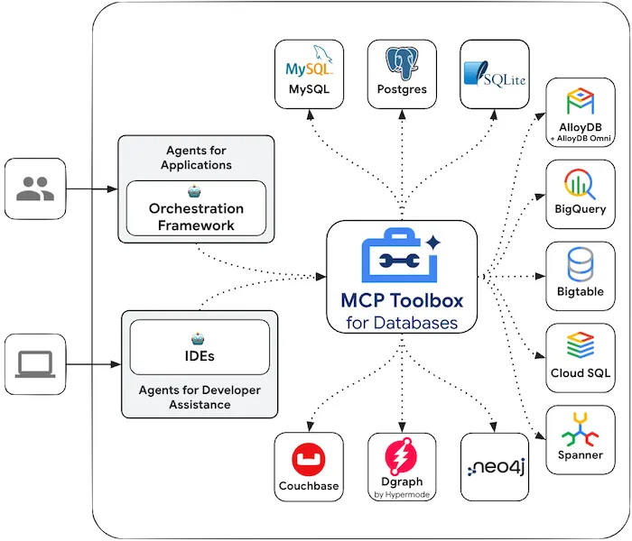
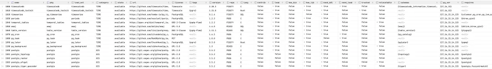
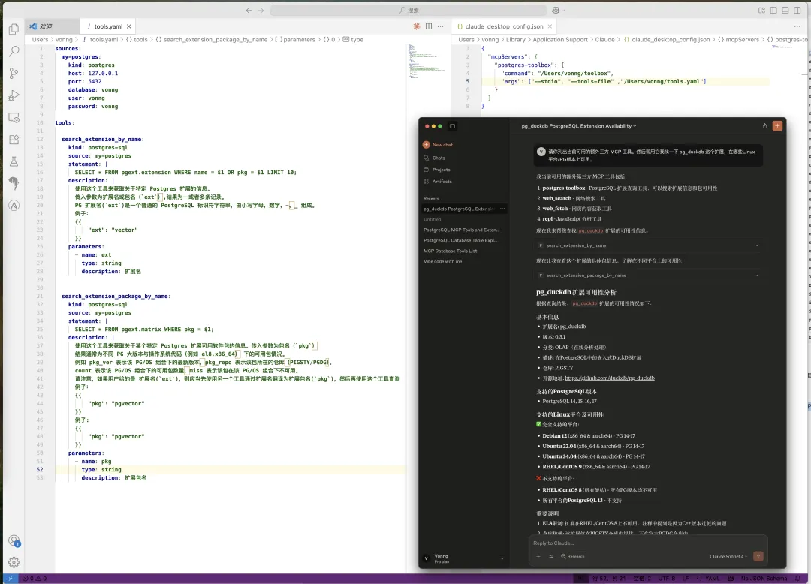
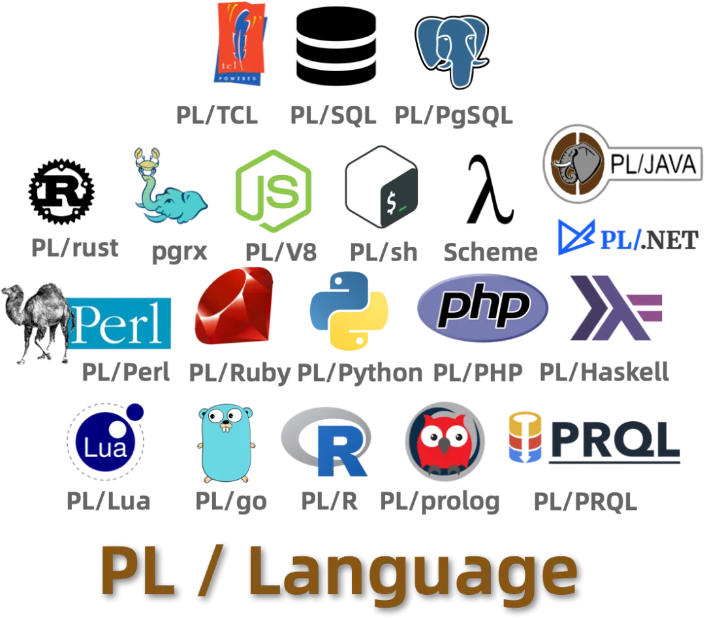

In "[SaaS is Dead? In the AI Era, Software Starts with Databases](https://mp.weixin.qq.com/s?__biz=MzU5ODAyNTM5Ng==&mid=2247489605&idx=1&sn=22aa5f6f18b871b2a216bc46dbaea42c&scene=21#wechat_redirect)", Microsoft CEO Nadella once stated that in the Agent era, **SaaS is Dead**, and the future form of software will be Agent + Database. That is, Agents directly performing CRUD operations on databases. Of course, this article was quite controversial — many seasoned developers said that having Agents directly access databases is like asking for security problems and begging for a quick death.

Honestly, the kind of "MCP" that directly opens up entire databases to the world is indeed like that — fine as a toy, but no one dares to use it in production. However, Google recently launched a database MCP toolbox (named simply and practically "GenAI Toolbox") that provides an answer to this problem.

[](https://googleapis.github.io/genai-toolbox/)

> https://googleapis.github.io/genai-toolbox/

Unlike the previous crude approach of directly exposing entire databases to Agents, this toolbox significantly improves the practicality and security of database MCP by encapsulating parameterized template SQL, making it ready for production pilots — Vonng has also packaged RPM/DEB packages for everyone to try.

> https://googleapis.github.io/genai-toolbox/getting-started/introduction/

------

## Quick Start

For example, Vonng maintains a PostgreSQL repository containing 423 extensions with some data tables. Now I want to expose extension/software package query capabilities. I just need to write a declarative `tools.yaml` configuration file. Here I connect Claude Desktop to MCP via STDIO and directly ask questions.



When maintaining extensions, Vonng usually needs to scrape various metadata from GitHub and fill it into database tables. With this toolbox, I can also define a template SQL for inserting into the extension table, clearly describe various parameter fields, and then directly let Claude do "deep research" to generate metadata and fill it into the data table, saving Vonng a lot of manual work.



Experienced developers can immediately see what this approach is — **limiting the scope of database services exposed externally through templated SQL statements**. Of course, you can still use that execute_sql catch-all interface to do work. For instance, here we let Claude Desktop examine PostgreSQL database parameters and perform configuration optimization:


The official website provides a more detailed example of hotel booking, offering "hotel booking" capabilities by directly reading and writing PostgreSQL databases.

```yaml
sources:
  my-pg-source:
    kind: postgres
    host: 127.0.0.1
    port: 5432
    database: toolbox_db
    user: toolbox_user
    password: my-password
tools:
  search-hotels-by-name:
    kind: postgres-sql
    source: my-pg-source
    description: Search for hotels based on name.
    parameters:
      - name: name
        type: string
        description: The name of the hotel.
    statement: SELECT * FROM hotels WHERE name ILIKE '%' || $1 || '%';
  search-hotels-by-location:
    kind: postgres-sql
    source: my-pg-source
    description: Search for hotels based on location.
    parameters:
      - name: location
        type: string
        description: The location of the hotel.
    statement: SELECT * FROM hotels WHERE location ILIKE '%' || $1 || '%';
  book-hotel:
    kind: postgres-sql
    source: my-pg-source
    description: >-
       Book a hotel by its ID. If the hotel is successfully booked, returns a NULL, raises an error if not.
    parameters:
      - name: hotel_id
        type: string
        description: The ID of the hotel to book.
    statement: UPDATE hotels SET booked = B'1' WHERE id = $1;
  update-hotel:
    kind: postgres-sql
    source: my-pg-source
    description: >-
      Update a hotel's check-in and check-out dates by its ID. Returns a message
      indicating  whether the hotel was successfully updated or not.
    parameters:
      - name: hotel_id
        type: string
        description: The ID of the hotel to update.
      - name: checkin_date
        type: string
        description: The new check-in date of the hotel.
      - name: checkout_date
        type: string
        description: The new check-out date of the hotel.
    statement: >-
      UPDATE hotels SET checkin_date = CAST($2 as date), checkout_date = CAST($3
      as date) WHERE id = $1;
  cancel-hotel:
    kind: postgres-sql
    source: my-pg-source
    description: Cancel a hotel by its ID.
    parameters:
      - name: hotel_id
        type: string
        description: The ID of the hotel to cancel.
    statement: UPDATE hotels SET booked = B'0' WHERE id = $1;
toolsets:
  my-toolset:
    - search-hotels-by-name
    - search-hotels-by-location
    - book-hotel
    - update-hotel
    - cancel-hotel
```

------

## Feature Overview

Of course, Google MCP Toolbox for Database supports quite a variety of database types, not just PostgreSQL (although the documentation examples are full of PG). It also supports MySQL, SQL Server, SQLite, Redis, Neo4j, AlloyDB, BigQuery, BigTable, CouchBase, Google Cloud databases, and can use generic HTTP data sources — truly a catch-all database MCP.


One toolbox handles mainstream database integration — this alone saves a lot of trouble. You no longer need to create a bunch of separate MCPs for various databases.

Of course, this toolbox isn't just for MCP clients — it can also directly provide access to Agents. Google ADK provides out-of-the-box integration, making it very simple to write an Agent that accesses databases.


------

## Vonng's Assessment

Google's database MCP toolbox solves a core problem for MCP production deployment — **permission management**. Of course, this comes with a cost: developers need to define database capabilities one by one — writing SQL templates is similar to writing CRUD before, but much simpler — you can write business logic in natural language. I believe this is an important step toward the future vision of Agent + Database in the software industry.

Vonng believes that the Agent + Database combination will inevitably lead to a "renaissance" of database stored procedures. Because if you just put simple SQL statements into MCP, it creates a huge contextual cognitive burden for Agents — Agents need to understand business logic and organize complex business logic into SQL calls. Once service calls correspond to multiple complex SQL statements, reliability drops rapidly.

But if developers sink the entire business logic into the database, implementing Service-layer API interfaces originally at the application level as stored procedures in databases like Oracle/PostgreSQL, then the intelligence/context requirements for Agents are greatly reduced — abstracting from DAO level to Service level.

Additionally, the two major drawbacks of stored procedures — **high requirements for developer/DBA skills** and **consuming database server performance** — are basically no longer problems today. [Vibe Coding solves the problem of stored procedure writing](https://mp.weixin.qq.com/s?__biz=MzU5ODAyNTM5Ng==&mid=2247489471&idx=1&sn=fb8cdcbdac233959f153a4d11eec9ffa&scene=21#wechat_redirect) and maintenance, while current [rapid hardware development](https://mp.weixin.qq.com/s?__biz=MzU5ODAyNTM5Ng==&mid=2247486489&idx=1&sn=f2be1be496de46ac5ca816ac39cfdf24&scene=21#wechat_redirect) has made TP database performance margins abundant again. The advantages of saving multiple interaction round trips, consolidating access permissions, and abstracting/encapsulating complexity become prominent.



Therefore, I believe the AI era greatly favors [multi-modal, full-featured, extensible databases like PostgreSQL](https://mp.weixin.qq.com/s?__biz=MzU5ODAyNTM5Ng==&mid=2247487513&idx=2&sn=ffb27fc934b6dce3d8571af0e228d21f&scene=21#wechat_redirect). PG supports stored procedure development in over 20 programming languages, something even Oracle can hardly match (six languages). Of course, Oracle's programmability is also excellent, but because it's not open source, it will receive much less AI dividend. Vonng predicts these two will respectively capture the largest AI dividends in open source/commercial database ecosystems.

## Download and Installation Guide

Currently, MCP Toolbox for Database provides packages for macOS and Linux/Windows x86. Vonng has packaged RPM/DEB packages for Linux x86/ARM platforms, usable on mainstream Linux systems (repository tutorial: https://pgsty.com/ext/repo/infra).

```
curl https://repo.pigsty.cc/pig | bash  # pig package manager
pig repo add infra -u                   # add infra repository
yum install genai-toolbox               # install genai toolbox
```

You can edit the `/etc/toolbox/tools.yaml` configuration file, add your data sources and tools, and use `systemctl start toolbox` to start the service. If you're using PostgreSQL, edit the environment variables in `/etc/default/toolbox`, fill in PG connection information, and you can use this MCP server out of the box. You can access port `5000` via SSE to connect to the database MCP toolbox for services.


Pigsty's Infra repository already provides the above packages and will provide database MCP toolbox deployment playbooks in the next version.

Well, that's all for today. Happy MCP-ing, everyone!
