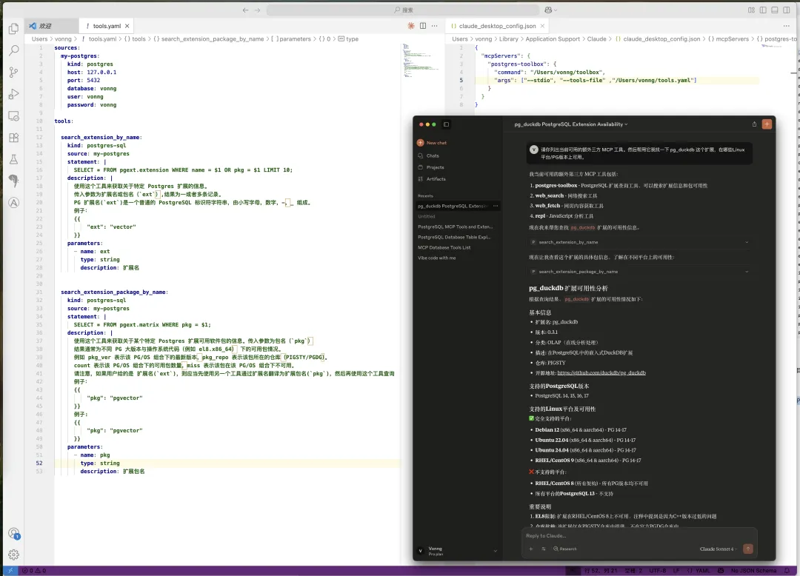
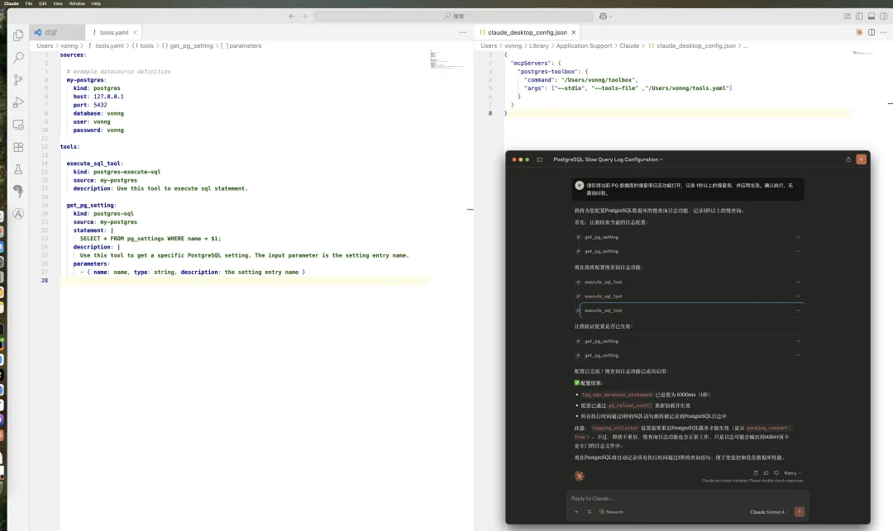
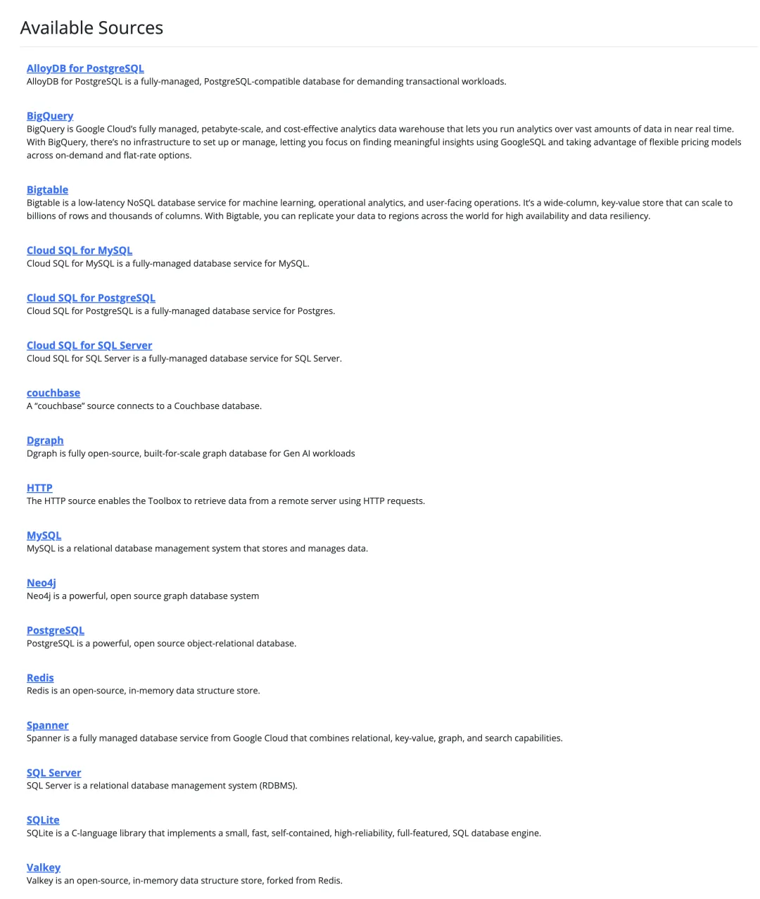
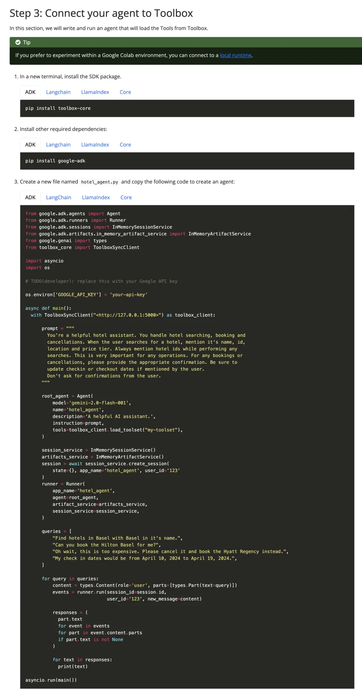
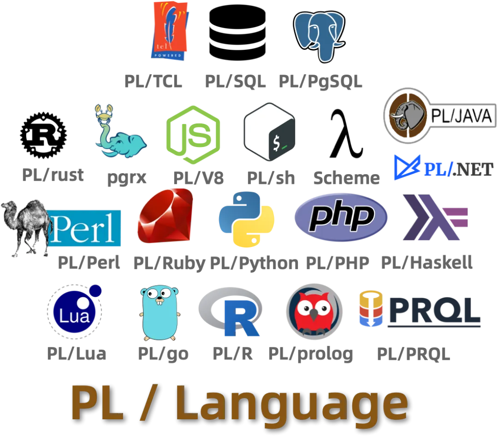
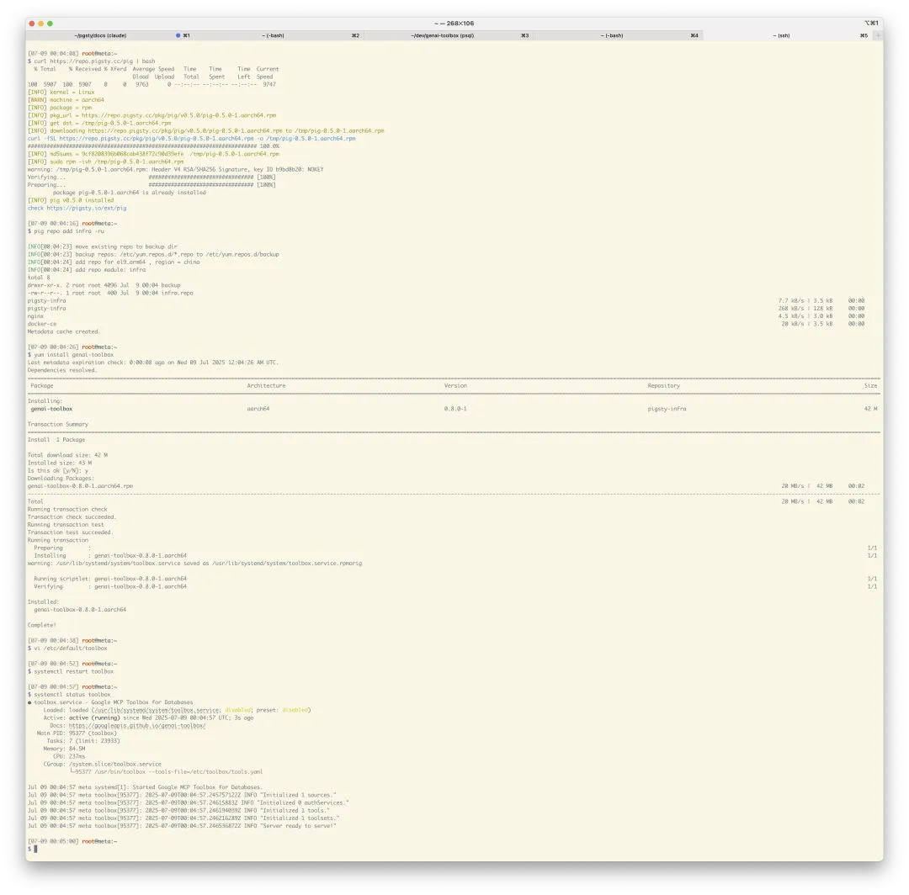

在《[SaaS已死？AI时代，软件从数据库开始](https://mp.weixin.qq.com/s?__biz=MzU5ODAyNTM5Ng==&mid=2247489605&idx=1&sn=22aa5f6f18b871b2a216bc46dbaea42c&scene=21#wechat_redirect)》中，微软 CEO 纳德拉曾经表示，在 Agent 时代，**SaaS is Dead**，而未来的软件形式将是 Agent + Database 。也就是直接由 Agent 在数据库上做 CRUD。当然这篇文章也有不小争议 —— 很多老司机表示，Agent 直通数据库，是嫌安全问题不够多，死的不够快吗？

老实说，那种直接把整个数据库开放给世界的所谓 “MCP” 确实是这样，当个玩具可以，没人敢上生产用。不过，最近 Google 推出了一个针对数据库的 MCP 工具箱（名字就叫朴实无华 GenAI Toolbox ），为这个问题提供了一个答案。

[](https://googleapis.github.io/genai-toolbox/)

> https://googleapis.github.io/genai-toolbox/

不同于以前那种直接把整个数据库对 Agent 开放的粗暴做法，这个工具箱通过封装参数模板 SQL 的方式，显著提高了数据库 MCP 的实用性与安全性，可以考虑搞起生产试点了 —— 老冯也打好了 RPM/DEB 包供大家尝鲜。

> https://googleapis.github.io/genai-toolbox/getting-started/introduction/


------


## 快速上手

举个例子，老冯维护了一个包含 423 个扩展的 PG 仓库，里面有一些数据表。现在我想要对外暴露一个扩展/软件包查询的能力，只需要编写一个声明式的 `tools.yaml` 配置文件就好了，这里我们让 Claude Desktop 用 STDIO 方式接入 MCP，然后直接向他提问题就可以了。


老冯维护扩展的时候，通常需要去 GitHub 上搜刮各种元数据，然后填入到数据库表中。有了这个工具箱，我还可以定义一条插入扩展表的模板 SQL ，描述清楚各种参数字段，然后直接让 Claude 去 “深度研究”，生成元数据填入到数据表中，省下老冯的很多手工活儿。



老司机一眼就能看出这个思路是什么，**就是通过模版化的 SQL 语句，限制数据库对外提供服务的范围**。当然，你也是可以继续使用那种 execute_sql 的万金油接口来干活的。比如这里我们让 Claude Desktop 查阅 PostgreSQL 数据库中的参数，并进行配置优化：



官网给出了一个更详细的例子，就是订酒店，通过直接读写 PostgreSQL 数据库的方式，对外提供 “定酒店” 的能力。

```yaml
sources:
  my-pg-source:
    kind: postgres
    host: 127.0.0.1
    port: 5432
    database: toolbox_db
    user: toolbox_user
    password: my-password
tools:
  search-hotels-by-name:
    kind: postgres-sql
    source: my-pg-source
    description: Search for hotels based on name.
    parameters:
      - name: name
        type: string
        description: The name of the hotel.
    statement: SELECT * FROM hotels WHERE name ILIKE '%' || $1 || '%';
  search-hotels-by-location:
    kind: postgres-sql
    source: my-pg-source
    description: Search for hotels based on location.
    parameters:
      - name: location
        type: string
        description: The location of the hotel.
    statement: SELECT * FROM hotels WHERE location ILIKE '%' || $1 || '%';
  book-hotel:
    kind: postgres-sql
    source: my-pg-source
    description: >-
       Book a hotel by its ID. If the hotel is successfully booked, returns a NULL, raises an error if not.
    parameters:
      - name: hotel_id
        type: string
        description: The ID of the hotel to book.
    statement: UPDATE hotels SET booked = B'1' WHERE id = $1;
  update-hotel:
    kind: postgres-sql
    source: my-pg-source
    description: >-
      Update a hotel's check-in and check-out dates by its ID. Returns a message
      indicating  whether the hotel was successfully updated or not.
    parameters:
      - name: hotel_id
        type: string
        description: The ID of the hotel to update.
      - name: checkin_date
        type: string
        description: The new check-in date of the hotel.
      - name: checkout_date
        type: string
        description: The new check-out date of the hotel.
    statement: >-
      UPDATE hotels SET checkin_date = CAST($2 as date), checkout_date = CAST($3
      as date) WHERE id = $1;
  cancel-hotel:
    kind: postgres-sql
    source: my-pg-source
    description: Cancel a hotel by its ID.
    parameters:
      - name: hotel_id
        type: string
        description: The ID of the hotel to cancel.
    statement: UPDATE hotels SET booked = B'0' WHERE id = $1;
toolsets:
  my-toolset:
    - search-hotels-by-name
    - search-hotels-by-location
    - book-hotel
    - update-hotel
    - cancel-hotel
```


------


## 特性说明

当然，Google MCP Toolbox for Database 支持的数据库种类其实挺多的，不仅仅是 PostgreSQL（虽然文档里的例子满篇都是 PG），还有 MySQL，SQL Server，SQLite，Redis，Neo4j，AlloyDB，BigQuery，BigTable，CouchBase，Google 云上的数据库，还可以使用通用的 HTTP 数据源，堪称万金油数据库 MCP。



一个工具箱就搞定主流数据库的接入，光这一点就省了很多事儿 —— 你再也不用搓一堆各种数据库各自的 MCP 了。

当然，这个工具箱不仅仅是给 MCP 客户端用的，它还可以直接对 Agent 提供访问。Google ADK 就提供了开箱即用的接入，写一个 Agent ，让它去访问数据库就非常简单了。




------

## 老冯评价

Google 数据库 MCP 工具箱解决了 MCP 上生产的一个核心问题 —— **权限管理**。当然这也有代价，开发者需要一个一个的去定义数据库对外提供的能力 —— 写 SQL 模板跟以前写 CRUD 差不多，但要简单很多 —— 你可以用自然语言编写业务逻辑了。我认为这是软件行业向 Agent + Database 的未来图景迈出的重要一步。

老冯认为，Agent + Database 的组合，将会不可避免的导致数据库存储过程的“文艺复兴”。因为如果你只是把简单的 SQL 语句放进 MCP 里，会给 Agent 带来巨大的上下文认知负担 —— Agent 需要理解业务逻辑并将复杂的业务逻辑组织为 SQL 调用，一旦服务调用对应着多条复杂SQL语句，可靠性就会快速下降。

但如果开发者将业务逻辑整个下沉到数据库里，将原本 Service 层面的 API 接口放在 Oracle / PostgreSQL 这样的数据库中用存储过程实现，那么对 Agent 的智力/上下文要求就会减小许多 —— 从 DAO 成抽象，到 Service 层抽象。

另外，存储过程的两大缺点 —— **对开发/DBA水平要求高**，**占用数据库服务器性能**，在当下基本上已经不再是问题了。[ Vibe Coding 解决了存储过程编写](https://mp.weixin.qq.com/s?__biz=MzU5ODAyNTM5Ng==&mid=2247489471&idx=1&sn=fb8cdcbdac233959f153a4d11eec9ffa&scene=21#wechat_redirect)与维护的问题，而当下[硬件突飞猛进的发展](https://mp.weixin.qq.com/s?__biz=MzU5ODAyNTM5Ng==&mid=2247486489&idx=1&sn=f2be1be496de46ac5ca816ac39cfdf24&scene=21#wechat_redirect)让 TP 数据库的性能余量又开始充裕丰饶起来。那么节省多次交互 RT，收拢访问权限，抽象封装复杂度这些优势就会凸显出来。



因此我认为 AI 时代是极大利好 [PostgreSQL 这样的多模态全能可扩展数据库](https://mp.weixin.qq.com/s?__biz=MzU5ODAyNTM5Ng==&mid=2247487513&idx=2&sn=ffb27fc934b6dce3d8571af0e228d21f&scene=21#wechat_redirect)的，PG 支持用 20 多种编程语言开发存储过程，即使是 Oracle 也难望其项背（六种）。当然，Oracle 的可编程性也非常好，只不过因为不开源，吃到的红利就会少很多了。老冯目测这两者会分别吃下开源/商业数据库生态的最大 AI 红利。

## 下载安装教程

目前 MCP Toolbox for Database 提供了 macOS 下的包，以及 Linux/ Windows x86 的包。老冯把 Linux x86/ARM 平台打好了 RPM / DEB 包，在主流 Linux 系统上都可以使用 （仓库教程：https://pgsty.com/ext/repo/infra）

```
curl https://repo.pigsty.cc/pig | bash  # pig 包管理器
pig repo add infra -u                   # 添加 infra 仓库
yum install genai-toolbox               # 安装 genai 工具箱
```

你可以编辑 `/etc/toolbox/tools.yaml` 配置文件，加入你的数据源与工具，并使用 `systemctl start toolbox` 启动服务。如果你使用的是 PostgreSQL，编辑 `/etc/defalt/toolbox` 里的环境变量，填入 PG 连接信息，即可开箱即用的使用这个 MCP 服务器了。你可以使用 SSE 访问 `5000` 端口，连接数据库 MCP 工具箱获取服务。



Pigsty 的 Infra 仓库已经提供了上面的软件包，并会在下个版本提供数据库 MCP 工具箱的部署剧本。

好的，今天就是这些，祝大家 MCP 愉快！
