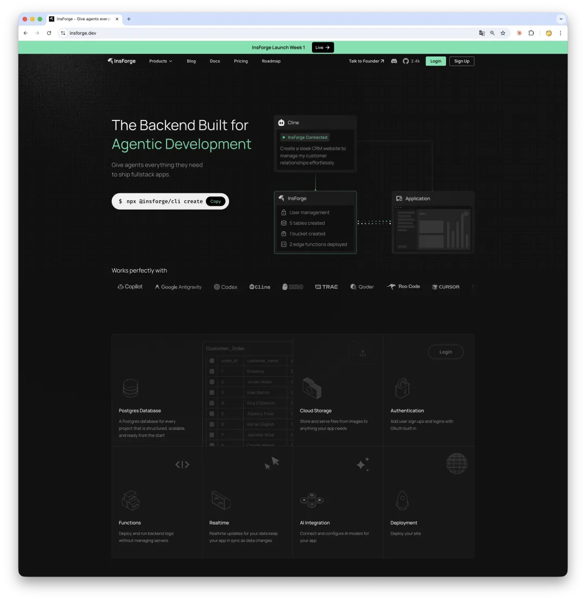
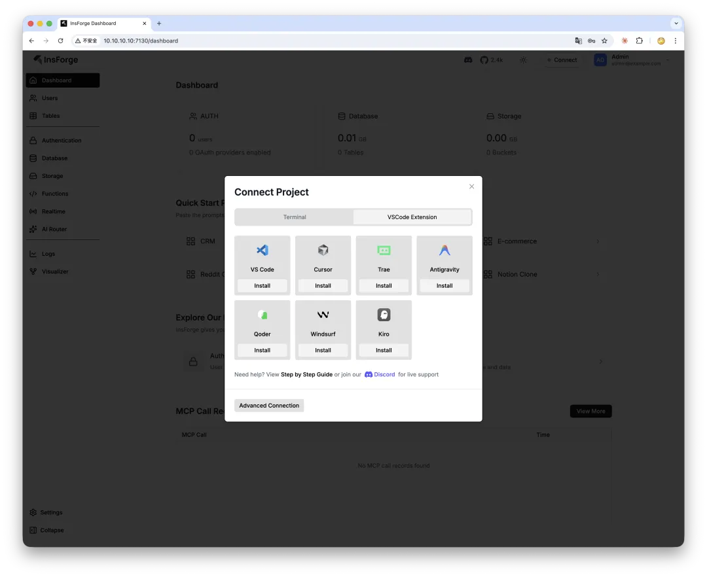
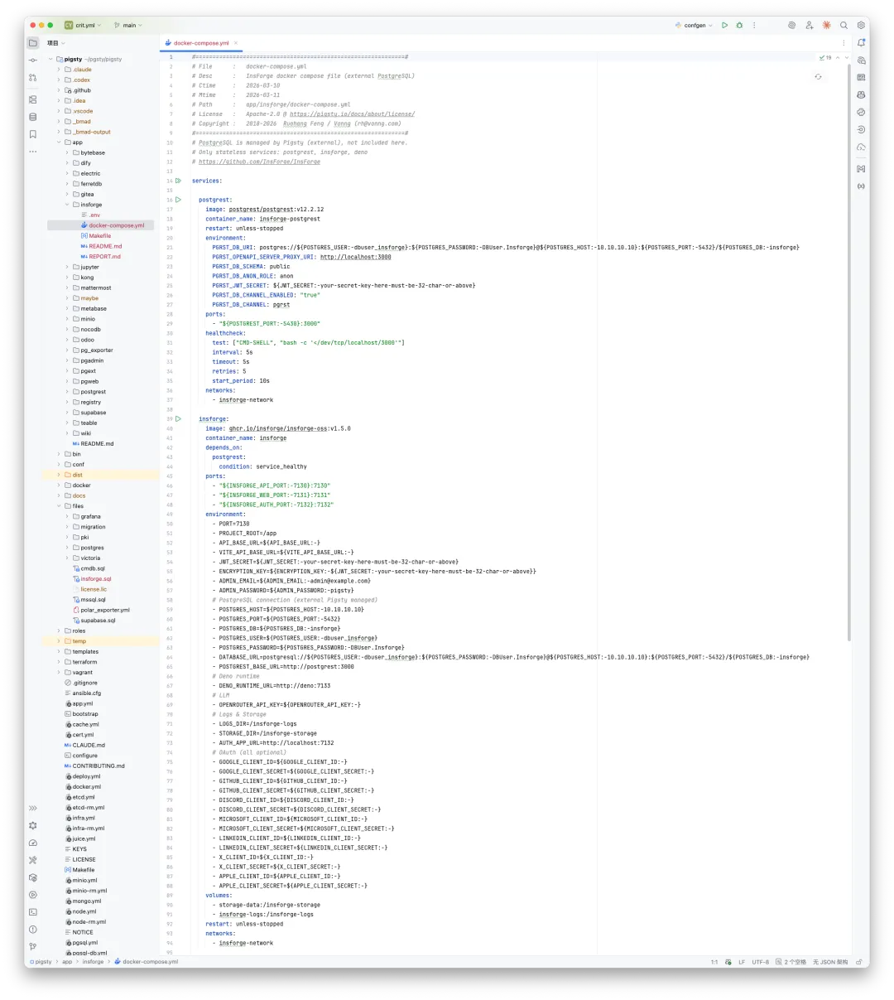

InsForge is one of the more interesting projects I have seen recently. Its pitch is simple: a Supabase-like backend stack designed specifically for AI coding agents.

Apache 2.0 licensed, roughly 2,000 GitHub stars, built around PostgreSQL + PostgREST + Deno + TypeScript, and deployable with five containers. That combination alone makes it worth paying attention to.

## The "last mile" problem in vibe coding

Since 2025, vibe coding has gone from meme to real productivity. An agent can scaffold a React frontend in minutes. The hard part comes right after that:

- Where does data live?
- How do users authenticate?
- Where do uploaded files go?

Traditional backend stacks were designed for humans clicking around dashboards, not for agents reasoning over infrastructure. InsForge tries to solve that last mile.



## What it actually is

Architecturally, InsForge offers six backend primitives:

- Database
- Authentication
- Storage
- Edge Functions
- Model Gateway
- Realtime

It has also started adding experimental site deployment and email capabilities.

At first glance, this sounds like Supabase. The difference is where the product draws the abstraction boundary.

## The key difference: a semantic layer

InsForge inserts a **semantic layer** between AI agents and those backend primitives, then exposes that layer through MCP.

That matters because it gives agents a cleaner contract. Instead of telling an agent to click through a dashboard or manipulate raw services, you let it reason over a structured application layer: discover schema, inspect auth state, create tables, wire up flows, and validate the result.

In their own words, this is **context engineering for AI agents**.

## Practical experience

The project already supports most mainstream AI editors and coding agents:



You can install it through the dashboard, or directly from the CLI:

```bash
npx @insforge/install --client cursor \
  --env API_KEY=your_key \
  --env API_BASE_URL=http://localhost:7130
```

After that, you can tell your agent something like:

> "Create a user table with email and name, then build a sign-up and login flow."

The agent can discover InsForge through MCP, create tables, wire up auth, and generate frontend code without you manually clicking through a console.

## My take

InsForge gets one important thing right: it treats **"can the agent understand the backend?"** as the first design question. Traditional BaaS products are designed for humans. Their dashboards may be beautiful, but to an agent they are effectively invisible.

That said, InsForge is still early:

- Founded in July 2025, with a five-person team.
- Still built on PG 15, while we have already moved it to PG 18 on the Pigsty side.
- Documentation is still thin, and advanced self-hosting topics like HA, backup, and hardening are barely covered.

## Architecture: basically a slim Supabase

At the core, PostgreSQL is still the real engine. Data lives in PG. APIs are generated from PG schema. Auth data is stored in PG. RLS policies are enforced by PG.

So InsForge is best understood as a thin, agent-oriented operating layer built around PostgreSQL.

## Why it fits Pigsty well

My first reaction after reading the architecture was that **InsForge's biggest weakness is exactly Pigsty's biggest strength**.

Its bundled PostgreSQL is just a single-node Docker container. No HA. No monitoring. No automated backup. Pigsty, by contrast, already brings Patroni HA, VictoriaMetrics, pgBackRest, connection pooling, and load balancing out of the box.



That is why InsForge has already been folded into the Pigsty toolbox. Pigsty handles the database layer and operations. InsForge handles the agent-facing application layer.

You can still deploy InsForge independently if you want. But if you want a sturdier foundation under it, pairing it with Pigsty makes a lot of sense.
