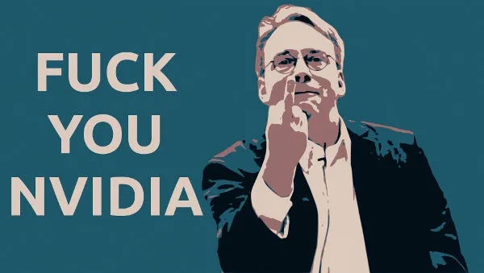
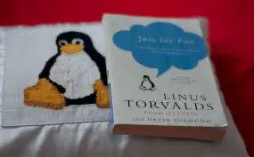
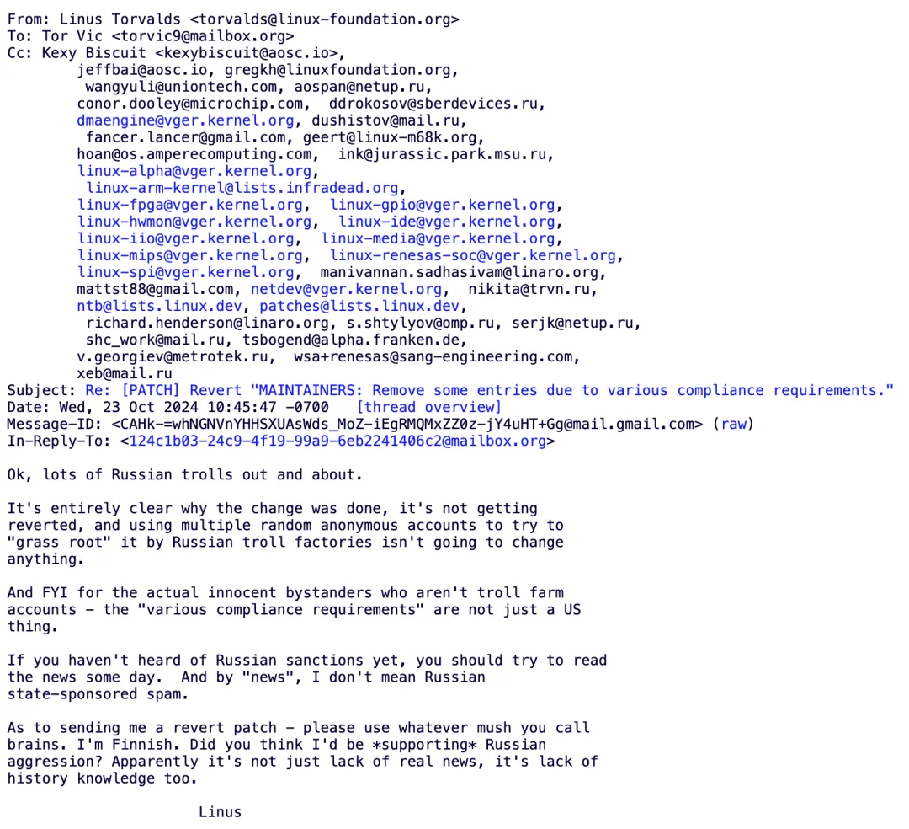

Recently, Linus [**kicked out several Russian developers**](https://lore.kernel.org/all/CAHk-=whNGNVnYHHSXUAsWds_MoZ-iEgRMQMxZZ0z-jY4uHT+Gg@mail.gmail.com/) from the project, triggering an outcry in the open source world. But many people forget that Linux is Linus's personal project — it was 30 years ago, and it still is today. Linus himself has always personally held the supreme power of the open source project — the right to release Linux. The Linux community is essentially imperial — and Linus himself is the earliest and most successful technical dictator.

> Ok, lots of Russian trolls out and about.
> 
> It's entirely clear why the change was done, it's not getting reverted, and using multiple random anonymous accounts to try to "grass root" it by Russian troll factories isn't going to change anything. And FYI for the actual innocent bystanders who aren't troll farm accounts - the "various compliance requirements" are not just a US thing.
> 
> If you haven't heard of Russian sanctions yet, you should try to read the news some day.  And by "news", I don't mean Russian state-sponsored spam.
> 
> As to sending me a revert patch - please use whatever mush you call brains. I'm Finnish. Did you think I'd be *supporting* Russian aggression? Apparently it's not just lack of real news, it's lack of history knowledge too.
> 
> Linus

In the open source/free software community, there's the concept of **BDFL** ("Benevolent Dictator for Life"). Examples include Python's father Guido van Rossum and Linux's father Linus Torvalds. Of course, in many people's eyes, Linus doesn't qualify as a "benevolent ruler" but rather a "tyrant" — for instance, Linus often uses blunt, crude language to publicly criticize, shame, and attack other technologies, participants, and vendors.

But this "tyrant" has been digging in the trenches day after day for decades, contributing his labor unreservedly to others, while countless operating system companies have made fortunes from it. As the saying goes, "A cup of rice creates gratitude, a bucket of rice creates enmity" — over time, people got used to his generosity but forgot that this project has always been, from beginning to end, Linus's personal "**interest**". This is fully reflected in the title of Linus's autobiography, "Just for Fun" — **the Linux project is just Linus's hobby**.

The only thing that can constrain Linus himself is the GPL license used by the Linux project — he neither established a company for commercialization nor prevented others from copying it. That's just how the open source community works — the Pacific Ocean doesn't have a lid, the code is all there, if you can do better, go ahead and fork it! I don't doubt for a moment that if Linus were to pass away someday, the Linux project would quickly scatter like stars across the sky, with forks everywhere.

According to open source community conventions, if anyone is dissatisfied with this, they can completely create their own fork and compete with upstream in productivity, launching a Spartacus-style rebellion. For example, GCC previously split due to ideological differences, and later the branch performed better than the mainline and was more popular with developers, so this branch (EGCS) became the new mainline. As they say: "Talk is cheap, show me the code", "You can you up, no can no BB" — not whining like a resentful housewife shouting "King Linus, you've changed" or "Linus is a big fool" and expecting justice to fall from heaven.

Of course, in my view, Linus's approach this time wasn't good — not because he kicked out the Russian developers, but because he didn't kick out the Russians in an open, legitimate, and honorable way. Instead, the second-in-command took a more concealed, ambiguous approach to do this, then Linus merged it and [**responded with bullshit-style replies**](https://mp.weixin.qq.com/s?__biz=MzU5ODAyNTM5Ng==&mid=2247488531&idx=1&sn=76cd7b9329dbaedde7b70e78cc253f5f&scene=21#wechat_redirect) afterward, leaving some stains and flaws that damage open source community conventions.

If he had openly said: "I received sanctions orders from the US, I have to deal with the Russians," or simply shrugged and said "I do whatever I want, it's none of your business" — which is fact — there might not have been so much trouble.

------

## **Vonng's Commentary**

The era of globalization is over, and the winds and rains of deglobalization have blown into the open source community. The ancient era of competing on morality is over, and today's competition is about strength. In the major trend from globalization to regionalization, what will inevitably happen is the "redrawing of community boundaries," or simply the splitting of old global large communities into several new small communities.

In this boundary-drawing process, "others" and "enemies" will inevitably emerge. Ideals with substantive content will inevitably create enemies — **no enemies means your community philosophy has no substantive content and thus no real supporters**. Ideals are the highest form of power desire, and evil is the intrinsic essence of power; ideals and evil are inseparable, just as love and jealousy are inseparable.

Linus has clearly drawn a new boundary, placing Russians outside the community boundary — a "purge" campaign. Although many consider this "evil," this is precisely the manifestation of his power will and "sovereignty." Verbal attacks and condemnation are too cheap in the face of real strength and cannot change anything.

Russians who have been excluded from community boundaries, as well as Chinese who have a high probability of following in their footsteps, should indeed seriously consider how to proceed in the future.

## **Reference Reading**

[**Are Databases Really Being Strangled?**](https://mp.weixin.qq.com/s?__biz=MzU5ODAyNTM5Ng==&mid=2247486379&idx=1&sn=b751c51a2b73e43e61487abfdc073da3&scene=21#wechat_redirect)

[**Linus's Explanation for Kicking Out Russian Maintainers**](http://mp.weixin.qq.com/s?__biz=MzU5ODAyNTM5Ng==&mid=2247488531&idx=1&sn=76cd7b9329dbaedde7b70e78cc253f5f&chksm=fe4b21c8c93ca8de98e0167656e07f25577f3d6cc4ec9456335ff290834979b26f67cd72cee2&scene=21#wechat_redirect)

[**WordPress Community Civil War: On Community Boundary Issues**](http://mp.weixin.qq.com/s?__biz=MzU5ODAyNTM5Ng==&mid=2247488488&idx=1&sn=191ee82363bf58abc33ba11ce2e1463f&chksm=fe4b2633c93caf25ca32cb29ae631a1a8af72424fb56b1fe9719912fddc7ca43ee9c9a45bf87&scene=21#wechat_redirect)

[**Second Batch of Database National Testing List: What to Do When Localization Comes?**](http://mp.weixin.qq.com/s?__biz=MzU5ODAyNTM5Ng==&mid=2247488427&idx=1&sn=2706b76f318760c5c4f09f9bc240d4a2&chksm=fe4b2670c93caf663649a450820ad137d09ce4cf71ee6b9f4f5f1d1e35adb2b3d7202f5ab9fd&scene=21#wechat_redirect)

[**Can Domestic Databases Really Compete?**](https://mp.weixin.qq.com/s?__biz=MzU5ODAyNTM5Ng==&mid=2247487513&idx=1&sn=d51ad679e75833d1d71437ed35e21693&scene=21#wechat_redirect)

[**Are Domestic Databases a Great Leap Forward?**](https://mp.weixin.qq.com/s?__biz=MzU5ODAyNTM5Ng==&mid=2247486804&idx=1&sn=069c7655d0b38b0e7421e847cc7d5576&scene=21#wechat_redirect)

[**Is China's Contribution to PostgreSQL Really Near Zero?**](https://mp.weixin.qq.com/s?__biz=MzU5ODAyNTM5Ng==&mid=2247486763&idx=1&sn=d05db7200faa6b23f61ca51328439833&scene=21#wechat_redirect)

[**Airport Taxi Vicious Cycle and Domestic Database Paradox**](https://mp.weixin.qq.com/s?__biz=MzU5ODAyNTM5Ng==&mid=2247488022&idx=1&sn=5a76f6a0200f3afb7c1a2edcbb38799e&scene=21#wechat_redirect)

[**Which EL-series OS Distribution is Best?**](https://mp.weixin.qq.com/s?__biz=MzU5ODAyNTM5Ng==&mid=2247486256&idx=1&sn=15dd3001e9890e11144b42a84636d2e9&scene=21#wechat_redirect)

[**What Kind of Self-reliance Does Infrastructure Software Really Need?**](https://mp.weixin.qq.com/s?__biz=MzU5ODAyNTM5Ng==&mid=2247486061&idx=1&sn=a1452dfa864f702d40bf612839a4e9e4&scene=21#wechat_redirect)

[**Are Distributed Databases a False Need?**](https://mp.weixin.qq.com/s?__biz=MzU5ODAyNTM5Ng==&mid=2247485549&idx=1&sn=7c34439d82431129c57aba211202b5ca&scene=21#wechat_redirect)