Several months ago, I forked MinIO for a simple reason: [Pigsty](https://pigsty.io) depended on it, and upstream had abandoned the open-source project. I said I would keep packages and security fixes flowing. Here is the recent report:

- The Docker image has been pulled more than **500,000 times**, and the repository has **2,000+ GitHub stars**.
- I have shipped **9 releases** and addressed **14 security issues**, including several high-severity flaws.
- **30+ open-source projects** have switched to the fork, some making it a default dependency.

That list includes RAGFlow's default Compose stack, Dokploy's product templates, the bundled object store in Grafana Loki's Helm chart, and Dell's Omnia HPC platform. Silo has also landed in nixpkgs and DaoCloud's public image mirror, while many smaller projects have switched over.

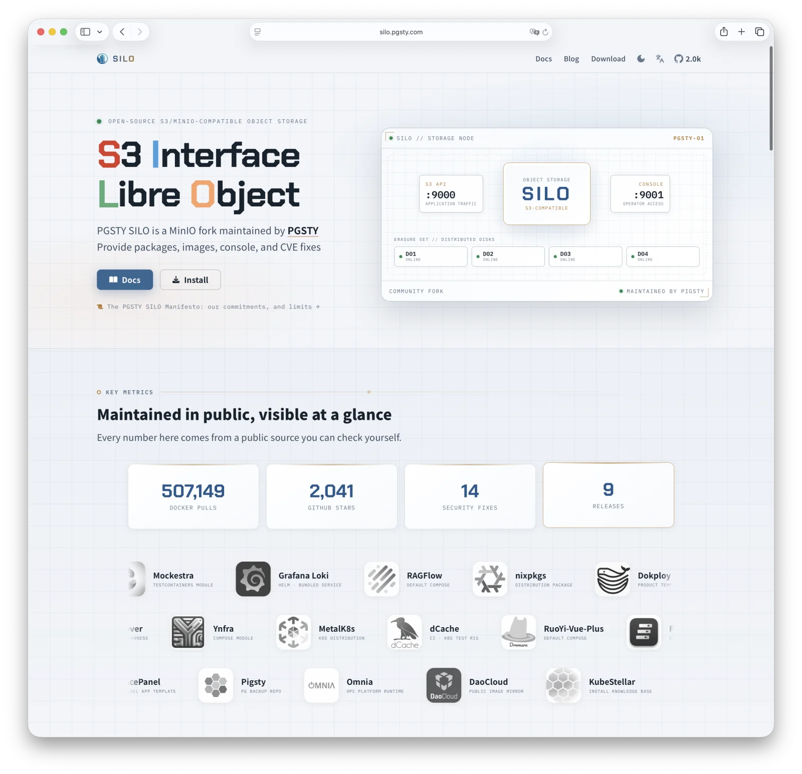

Somewhere along the way, this emergency fork became the most visible and [most active MinIO fork](https://github.com/minio/minio/forks).

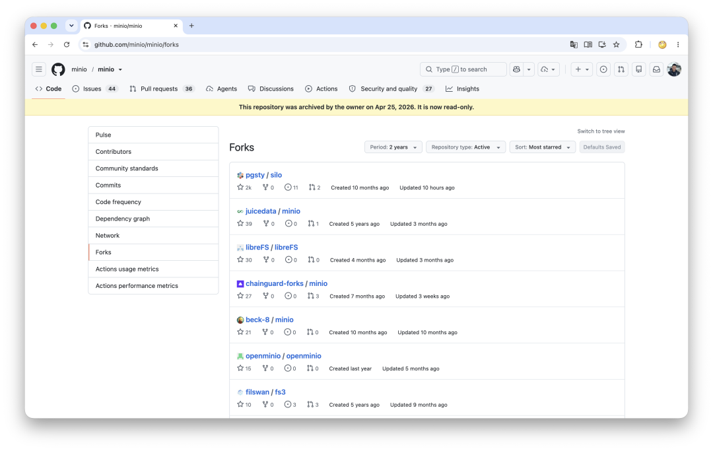

It turned out that many other people needed the same thing.

The latest release, [`RELEASE.2026-08-06T00-00-00Z`](https://github.com/pgsty/silo/releases/tag/RELEASE.2026-08-06T00-00-00Z), is a good point to take stock. It is more than a rename, so here is what changed.

---

## A Complete Rename

In February's [MinIO Is Dead, Long Live MinIO](/en/db/minio-resurrect), I wrote that the fork's largest unresolved risk was the MinIO trademark. MinIO is open source, but an open-source license does not grant trademark rights.

With Pigsty already taking most of my maintenance time, a full rename was easy to postpone. So I took the lazy route: I clicked Fork, built the packages, and left the name alone. The repository was simply [`pgsty/minio`](https://github.com/pgsty/minio).

That was tolerable when I was the only user. It is not tolerable after more than 500,000 image pulls and adoption by well-known open-source projects. Leaving it unresolved would pass a latent risk into other people's supply chains.

I made it clear throughout the repository that PGSTY SILO was an independent community fork with no connection to MinIO, Inc. Even so, MinIO, Inc. could file a trademark complaint and ask GitHub or Docker Hub to remove the repository or image. That would break the supply chain overnight.

A supply chain built on someone else's trademark, and vulnerable to being severed by a lawyer's letter, is itself a supply-chain risk. I decided to remove that risk before it became a problem. The project, repository, binary, and every other brand-facing surface have now been renamed from MinIO to PGSTY SILO, or Silo for short.

---

## Why "Silo"?

In the data world, *silo* is usually an insult. A data silo is exactly what database and data warehouse designers try to eliminate.

I seem to do well with unglamorous names. *Pigsty*, my main project, literally means both a pig pen and a filthy mess. Not the most flattering image, but the project has done all right.

But a silo is also a place to store grain, which makes it a natural name for object storage. Within the Pigsty ecosystem, it also serves as the repository for PostgreSQL backups.

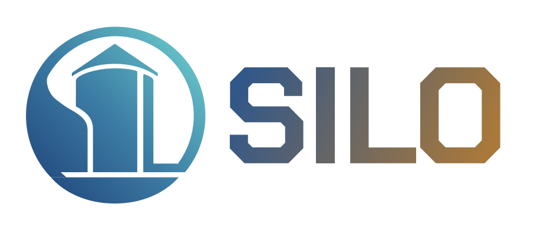

I settled on the name when I wrote the first post six months ago. This release finally makes it real. The GitHub repository, Docker repository, binary, RPM and DEB packages, and image names now all use the Silo name.

To be clear, only names tied to branding and trademarks have changed. We are not changing APIs, on-disk formats, metrics, or configuration keys. Those are not trademarks, and renaming them would create work and risk for users for no benefit.

---

## Compatibility: What Changed and What Did Not

A fair question is why a renamed project still has `MINIO_*` environment variables and `/minio/*` routes. Is the rename incomplete?

The `.minio.sys` directory belongs to the hundreds of terabytes already on your disks. `MINIO_ROOT_PASSWORD` belongs to your `docker-compose.yml`. `minio_bucket_usage_total_bytes` belongs to your Grafana dashboards and alerting rules. Changing those names might take one command on my side, but it could force you through downtime and a full export and re-import of your data. The tradeoff is obvious.

The rule is simple: **rename brands and trademarks; preserve interfaces and copyright notices.**

| Renamed (distribution surface) | Preserved (compatibility surface) |
|:-------------------------------|:----------------------------------|
| Repository `github.com/pgsty/silo` | S3 API, Admin API, and SigV4 signing behavior |
| Binary `/usr/bin/silo` | `/minio/*` routes, including health and metrics endpoints |
| Packages `silo-*.rpm` / `silo_*.deb` | `MINIO_*` environment variables and `x-minio-*` response headers |
| Image `docker.io/pgsty/silo` | `.minio.sys` on-disk format, erasure coding, and versioning |
| Service `silo.service` | Go modules and import paths under `github.com/minio/...` |
| Configuration directory `~/.silo` with fallback to `~/.minio` | The bundled `mcli` client retains the `mc` compatibility alias |

For many users, migration is a one-line image change:

```yaml
services:
  minio:                              # The service can still be named minio
-   image: minio/minio:latest
+   image: pgsty/silo:latest
    environment:                      # No MINIO_* changes required
    volumes:                          # Same volume, same data
```

If you use [RPM or DEB packages](https://silo.pgsty.com/compatibility/binary/), migration takes a few more commands because the system user, binary, and paths really have changed. If you deploy Silo through Pigsty's Ansible roles, those packaging details are already handled, so the difference for users is minimal.

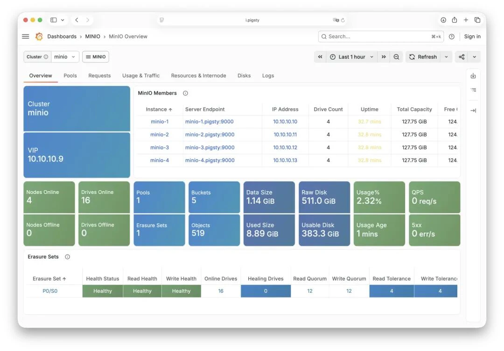

The rename is not the whole release. Four other things deserve a closer look: the console, security, the website, and a manifesto.

---

## The Console Speaks Chinese

In May 2025, upstream stripped the full administration console from the community edition and left only a bare-bones [object browser](https://silo.pgsty.com/administration/minio-console/).

I restored the console in February, but the result was rough: the interface looked dated, and its dashboards still queried metrics that no longer existed. This release fixes three things.

**First, the console now speaks Chinese.**

A substantial share of object-storage operators use Chinese as their first language, but the interface had always been English-only. The new console is bilingual across every page, help entry, and documentation link, with a language switcher in the header.

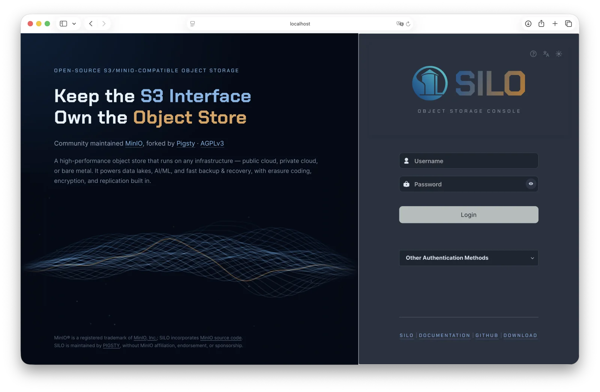

Now that the i18n path exists, adding other languages should be straightforward. Chinese is the only addition for now. While adding it, we also cleaned up the interface, converted images and icons to SVG, and pre-compressed the assets. The embedded console shrank from 10 MB to less than 3 MB.

**Second, the dashboards now read real metrics.**

The old console queried MinIO Metrics v2. Both MinIO and Silo now expose v3 metrics, so we updated the queries, fixed several broken panels, and refreshed the interface. Fable 5 handled the redesign; I think it turned out well.

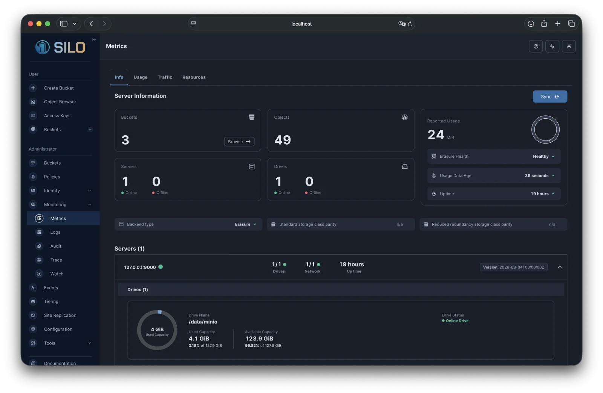

**Third, we removed the dead weight.**

We cleaned out the remaining SUBNET, license-management, and telemetry code tied to upstream's commercial edition. No analytics, no telemetry, no tracking hooks, and no external scripts or fonts.

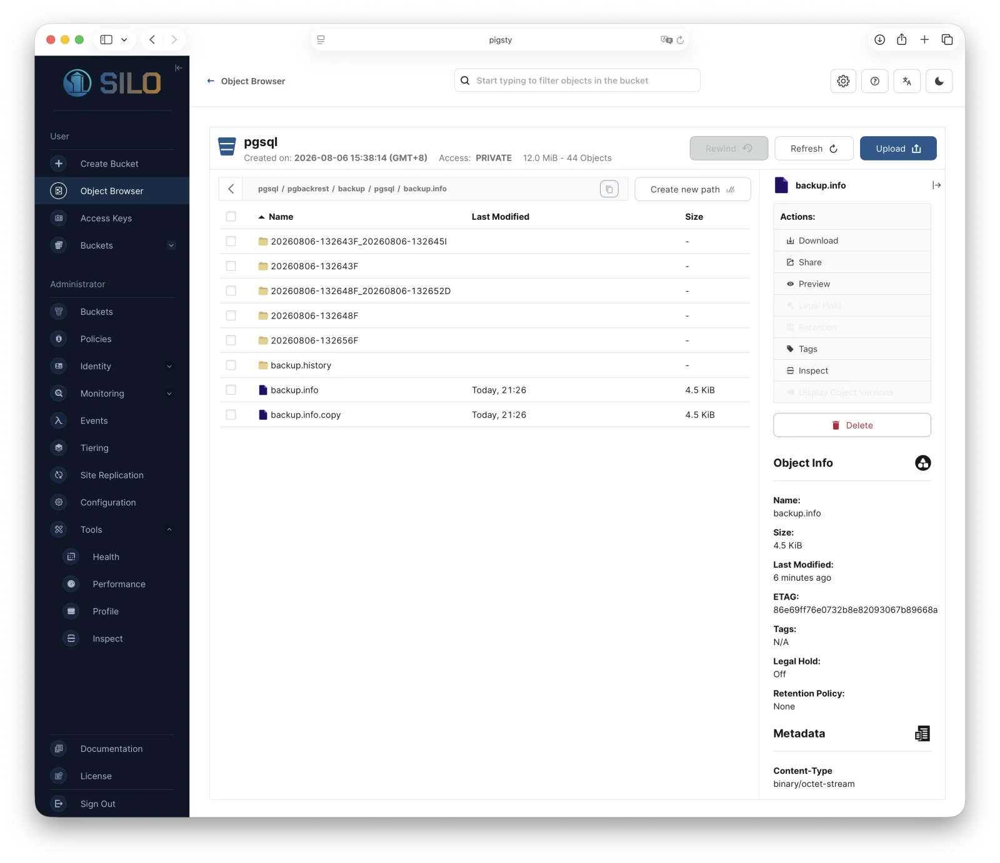

---

## Security: A 9.1 Vulnerability with No CVE

This release fixes six security issues. Each has its own entry in the [security chronicle](https://silo.pgsty.com/blog/security/); here is the one-line version:

- **Inter-node path traversal:** Several path operations in the internal protocol used by distributed clusters could escape their assigned disk directories.
- **Object-level permissions reaching bucket scope:** A trailing slash let a `bucket/*` permission intended for objects reach bucket-level operations, allowing a tenant to make its own bucket anonymously readable and writable.
- **Policy conditions shadowed by client input:** Client-supplied parameters could override authorization condition values computed by the server.
- **Duplicate part numbers:** Upload a 5 MiB part, complete the upload with `[1,1]`, and the server would return HTTP 200 with a 10 MiB object.
- **Spoofable source addresses:** A client able to connect directly to the API port could set an arbitrary value for the client IP used by `aws:SourceIp` policies and audit logs.
- **Unregistered notification configuration keys:** One broken NATS configuration could silently disable all Kafka, webhook, and MQTT notifications.

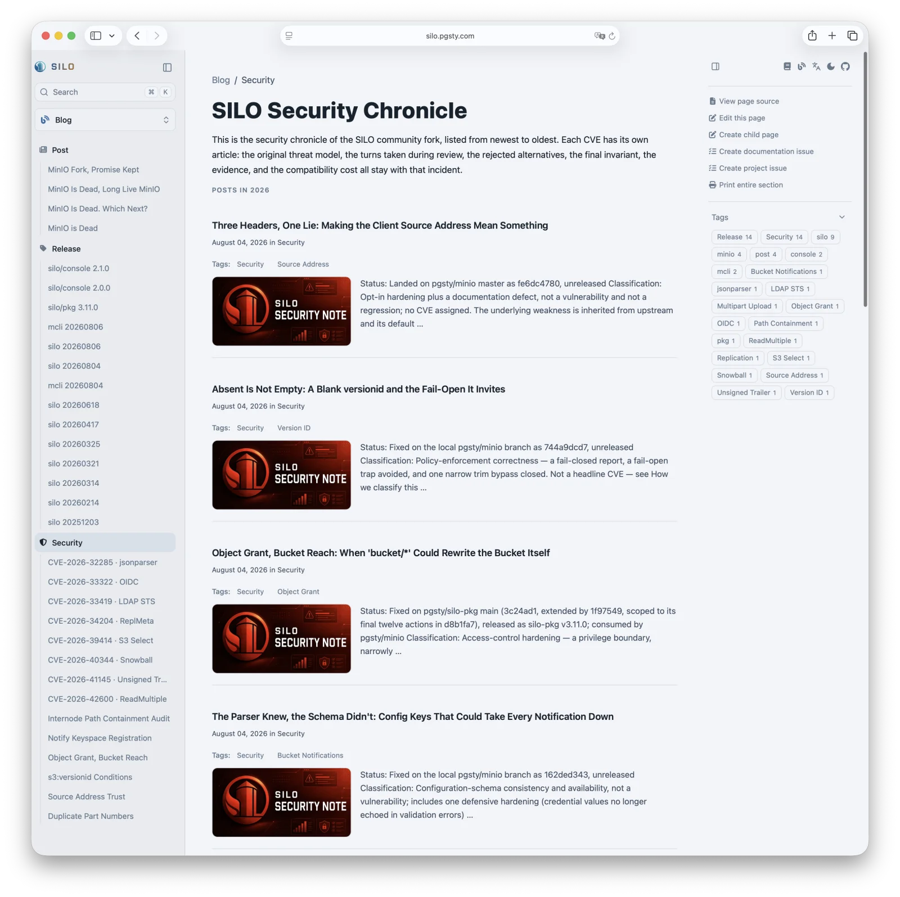

The first issue deserves a closer look.

In June, we fixed [CVE-2026-42600](https://silo.pgsty.com/blog/security/cve-2026-42600/), a path traversal flaw in an internal endpoint inherited from upstream. Its official score was 4.9. I ended that advisory with a warning: removing one endpoint proves only that the endpoint is gone, not that the entire bug class has been audited.

In early August, I finished that audit. It found twelve more defects with the same root cause across three protocol surfaces, all inherited from upstream.

- [Inter-node path-containment audit: finishing the work left by CVE-2026-42600](https://silo.pgsty.com/blog/security/internode-path-containment/)

The remaining flaws were much more severe. An attacker could write arbitrary files outside the disk directory, move the entire system volume containing IAM data and configuration into a readable bucket, recursively delete an entire directory tree, or crash the process with a single request. Under CVSS 3.1, the most severe flaw scores **9.1**, compared with 4.9 for the upstream CVE.

**But this one cannot get a CVE ID.** CVE assignment requires a maintainer of the affected product to take ownership of the issue and coordinate disclosure. The `minio/minio` repository is archived and read-only; nobody is there to do that. We can only fix the bugs, publish our own advisory, and state the facts clearly. This is the practical cost of archiving a repository: vulnerabilities do not disappear when the repository becomes read-only. They simply stop having an owner.

The scope matters. These routes are registered only in distributed erasure-coded deployments and require cluster root or inter-node credentials. Standalone deployments are not affected. But if you run distributed MinIO and cannot fully trust the inter-node network, there is only one recommendation:

**Upgrade promptly, or migrate to Silo.**

We do more than publish patches. The reasoning and decisions behind them are public. The complete threat model, reproduction vectors, remediation design, and the mistakes we made along the way are all documented in [the advisory](https://silo.pgsty.com/blog/security/internode-path-containment/).

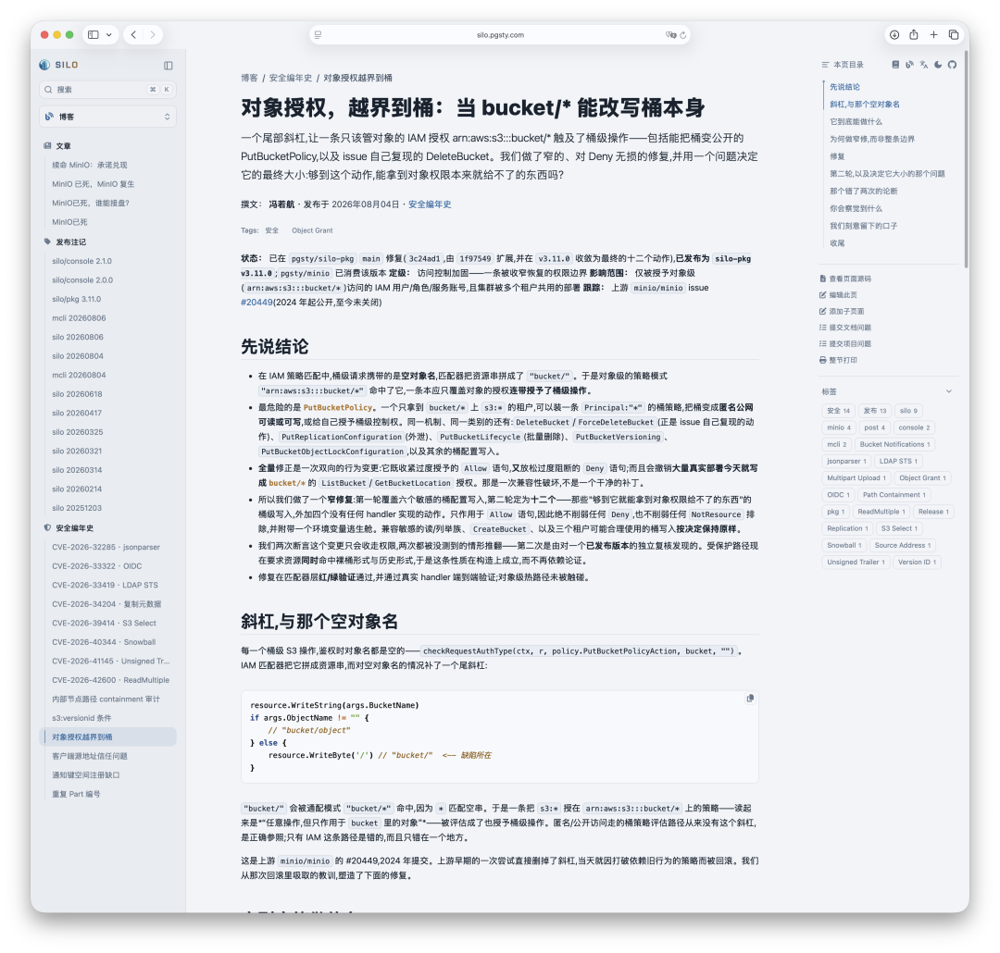

---

## The Website: silo.pgsty.com

Until now, the fork's entire homepage amounted to a few lines in its GitHub README.

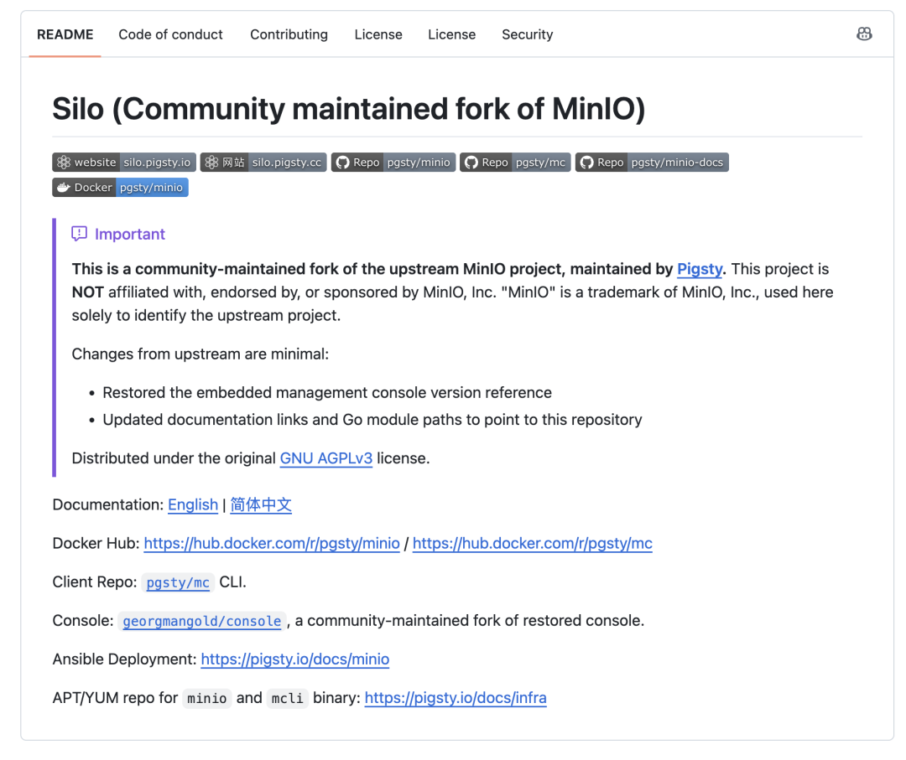

Over the past two days, I used Fable to build a proper bilingual website with documentation, a blog, and downloads. It finally looks like a real project:


> [silo.pgsty.com](https://silo.pgsty.com/)

- **Complete bilingual documentation** covering deployment, operations, monitoring, replication, encryption, IAM, and the command-line reference.
- **[Release notes](https://silo.pgsty.com/blog/release/)** for every version, recording the upstream baseline, tested rollback targets, and release-validation records.
- **A [security chronicle](https://silo.pgsty.com/blog/security/)** with one article per issue, including the initial threat model, how the review changed our understanding, rejected approaches, and design decisions.
- **A [compatibility audit](https://silo.pgsty.com/compatibility/)** documenting the differences between PGSTY SILO and upstream MinIO, along with migration guidance.
- **A [download page](https://silo.pgsty.com/download/)** with Linux, macOS, and Windows binaries; Docker images; RPM, DEB, and APK packages; source; and Ansible deployment.

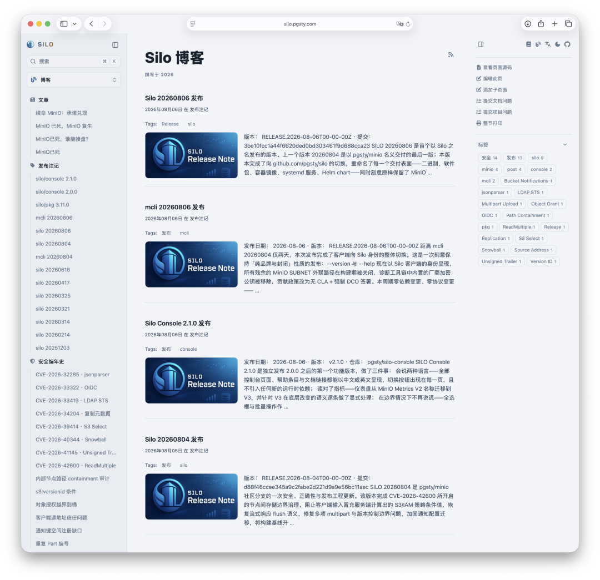

The part of the compatibility audit I care about most is *what differs*. That includes places where a security fix deliberately tightens behavior and may reject a small number of edge cases.

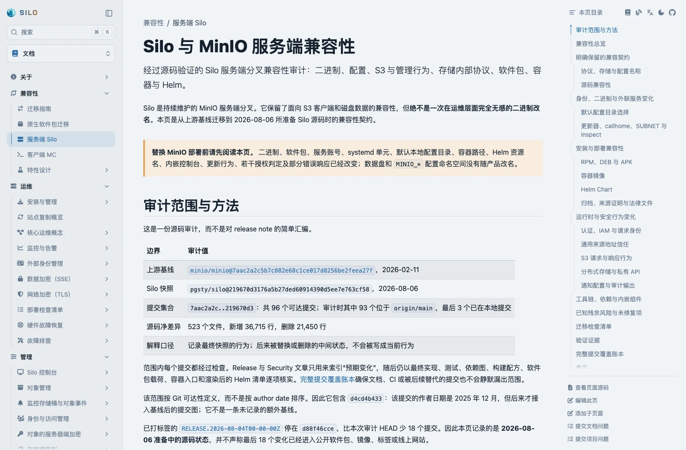

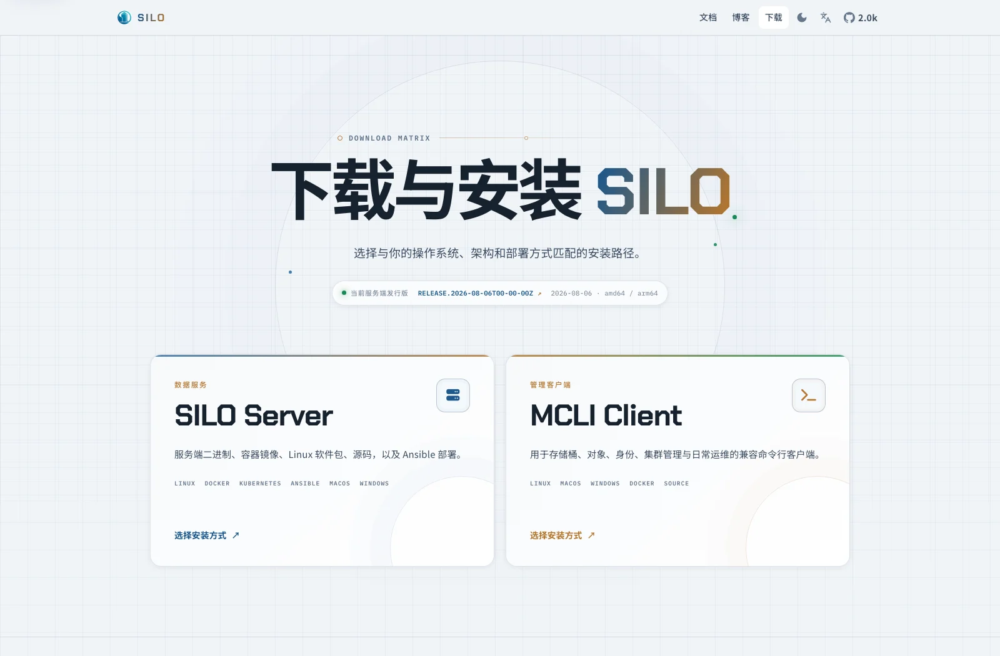

---

## The Silo Manifesto

The website also has an eleven-point [Silo Manifesto](https://silo.pgsty.com/about/manifesto/).

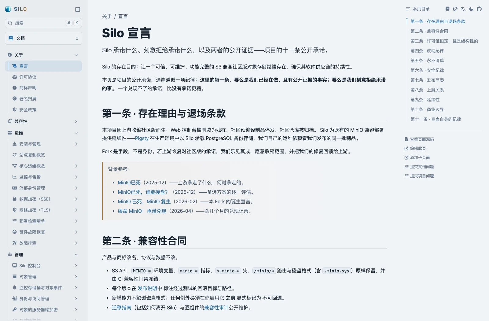

I hesitated before writing it. The word *manifesto* has a self-important ring to it, and open source has no shortage of promises, especially promises that were never kept. MinIO's own [`SECURITY.md`](https://github.com/minio/minio/blob/master/SECURITY.md) still says, "we will always provide security updates for the latest release." The repository has now been archived for six months.

So I set one rule for the page:

**Every item must be either something we already do, backed by public evidence, or something we deliberately refuse to promise.**

A promise that cannot be kept is worse than no promise. After applying that rule, the main points look like this:

**Clause 1 is an exit clause.** A fork is a means, not an identity. If upstream renews its commitment to the community edition, we will welcome that, narrow our scope, and contribute our fixes upstream.

**Clause 3 covers the license.** Silo will always be licensed under AGPLv3, with no CLA. Copyright stays with each contributor, making relicensing structurally impossible. We also state that using Silo through the S3 API does not, in our view, create a derivative work. The license will never be used as a threat or a sales tool. That is how upstream used it.

**Clause 5 is the "never" list.** No moving existing features behind a paywall. No registration wall for downloads. No telemetry—the upstream call-home paths were removed entirely, not merely disabled by default. No CLA, no license change, and no trademark enforcement against ordinary use or descriptive references. The list is append-only: items may be added, never removed.

**Clause 9 covers continuity.** This is the clause people should challenge us on. The repository belongs to the `pgsty` organization, not a personal account. The full build process is documented and includes provenance attestations, so anyone can rebuild equivalent artifacts from source without us. If active maintenance stops for more than six months, we will say so publicly and archive the project properly instead of letting it decay in place.

**Clause 11 governs the manifesto itself.** Additions and stronger commitments take effect immediately. Weakening or removing any clause requires 90 days' public notice.

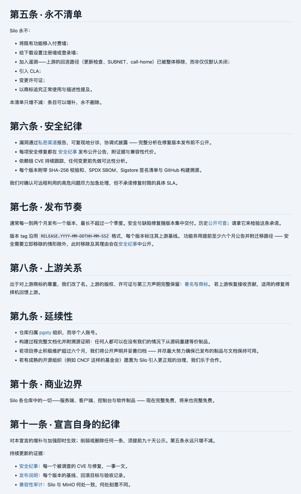

One more point appears in the homepage FAQ, and it is worth repeating here:

**Coding agents do most of this project's feature development and code review.**

I described the workflow in [Two Months into Maintaining a MinIO Fork](/en/db/minio-promise-kept): Codex writes the implementation, Claude Code reviews it from an adversarial perspective, they iterate until they converge, and I read the diff and make the final call. This release used the same process at a larger scale, across dozens of commits and a long list of fixes.

That comes with a commitment: every change must pass CI and human review, and every substantive change is merged only after a human weighs the tradeoffs. The agents' complete work logs and decision trails are archived, and the tradeoffs they considered are retained as design documentation. The security chronicle's discussions of rejected approaches and four regressions we introduced came directly from those records.

I am not going to hide the AI work and pretend this was made entirely by hand. That would not be true, and it would not make the result better. This is what one person maintaining a mid-sized infrastructure project looks like in 2026. Hiding it would be dishonest.

---

## Use It

For downloads and installation, see [PGSTY SILO Downloads](https://silo.pgsty.com/download/).

| Purpose | Location |
|:--------|:---------|
| Container image | `docker.io/pgsty/silo` (also offered as a `-distroless` variant) |
| Packages | [GitHub Releases](https://github.com/pgsty/silo/releases): RPM / DEB / APK; RPM packages are GPG-signed |
| Source | [github.com/pgsty/silo](https://github.com/pgsty/silo) |
| Documentation | [silo.pgsty.com](https://silo.pgsty.com/) (English) · [silo.pgsty.com/zh](https://silo.pgsty.com/zh/) (Chinese) |
| Migration guide | [Migrate from MinIO to Silo](https://silo.pgsty.com/compatibility/migration/) |
| Production deployment | [Pigsty MinIO module](https://pigsty.io/docs/minio/), a free, open-source, ready-to-use HA deployment |

The old `pgsty/minio` repository and images will remain available, frozen at `RELEASE.2026-08-04` as an archive. They will not be deleted, but all future updates will ship only under `pgsty/silo`.

---

## Further Reading

- [**MinIO Is Dead**](/en/db/minio-is-dead) (December 2025): what upstream removed, and when
- [**MinIO Is Dead. Who Picks Up the Pieces?**](/en/db/minio-alternative) (December 2025): an evaluation of the alternatives
- [**MinIO Is Dead, Long Live MinIO**](/en/db/minio-resurrect) (February 2026): the fork's original declaration
- [**Two Months into Maintaining a MinIO Fork**](/en/db/minio-promise-kept) (April 2026): the first few months of follow-through
- [**Silo 20260806 Release Notes**](https://silo.pgsty.com/blog/release/silo-20260806/): the complete list of changes in this release
- [**The Silo Manifesto**](https://silo.pgsty.com/about/manifesto/): what we promise, and what we deliberately do not

> Trademark notice: MinIO® is a registered trademark of MinIO, Inc. Silo is an independent AGPLv3 open-source fork maintained by the Pigsty community. It is not affiliated with, sponsored by, or endorsed by MinIO, Inc. Every use of “MinIO” in this article is descriptive.

> [**Originally published in Chinese**](/db/long-live-silo/)
