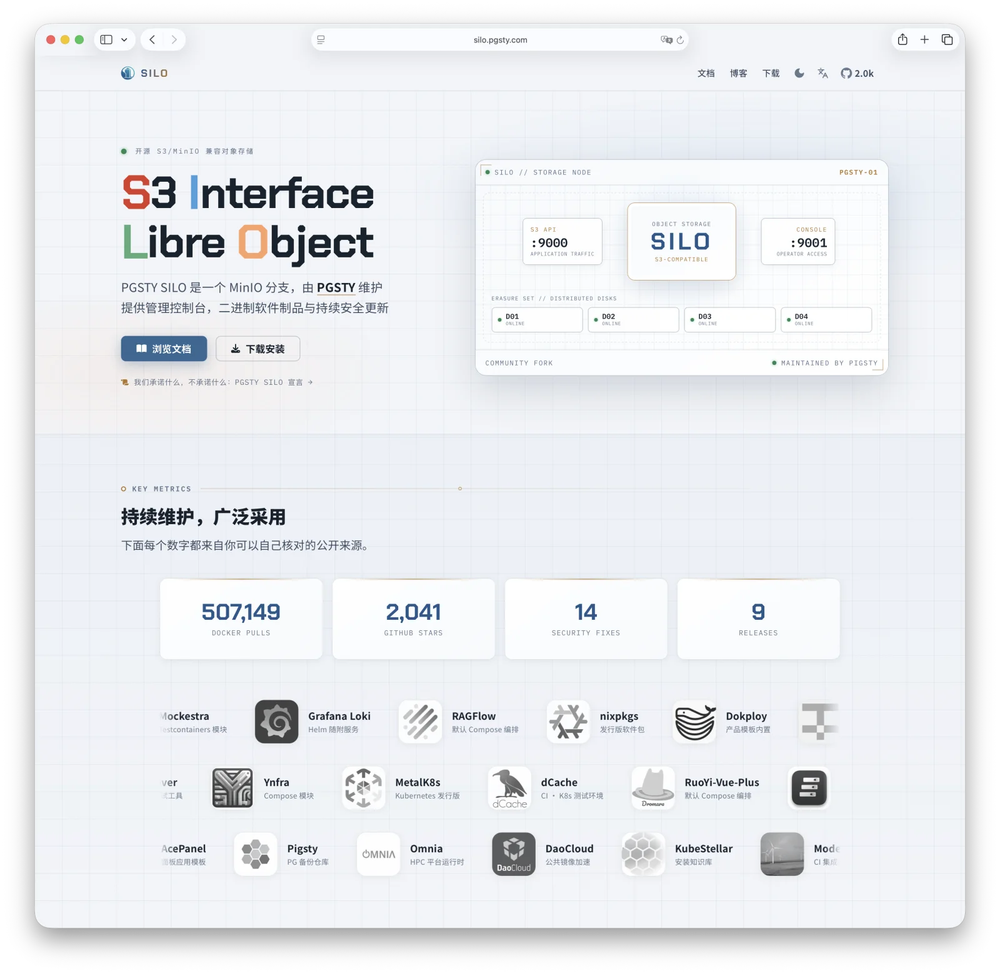
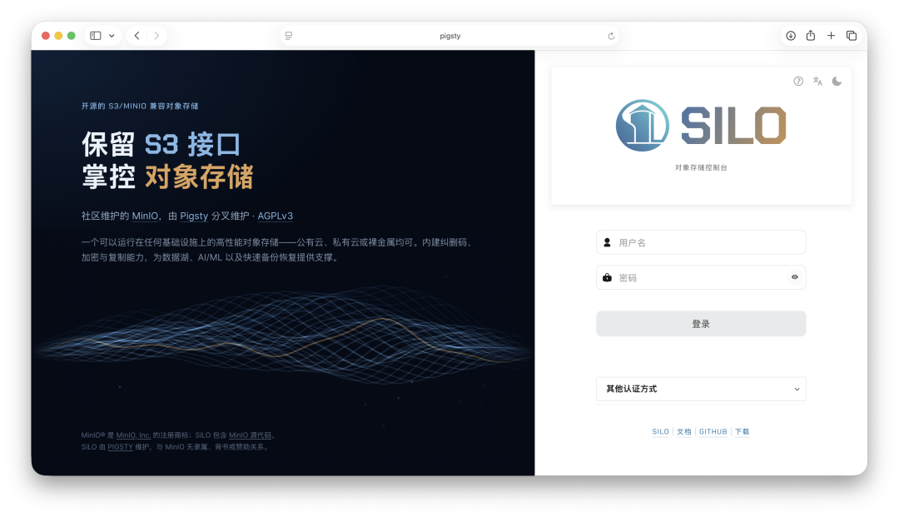
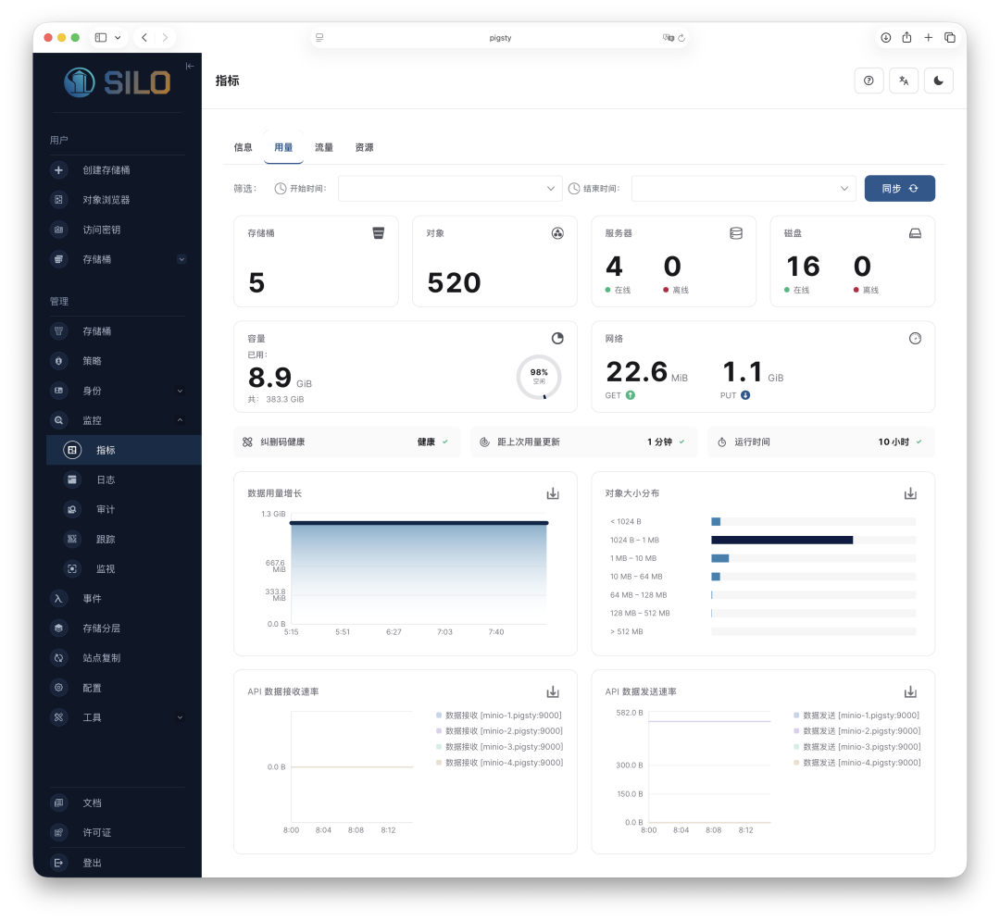
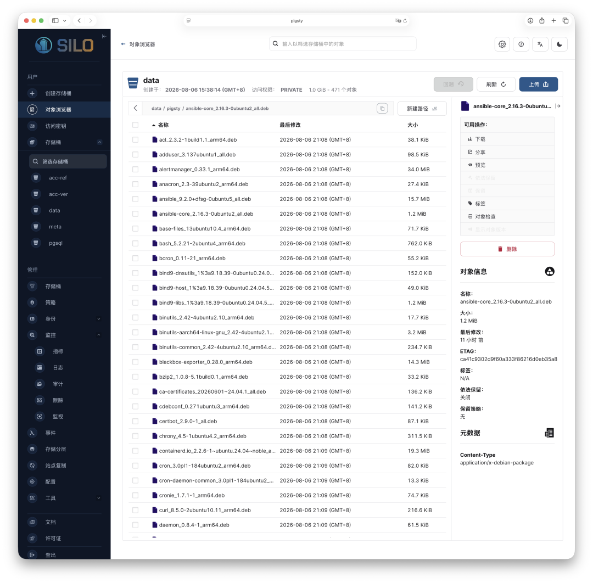
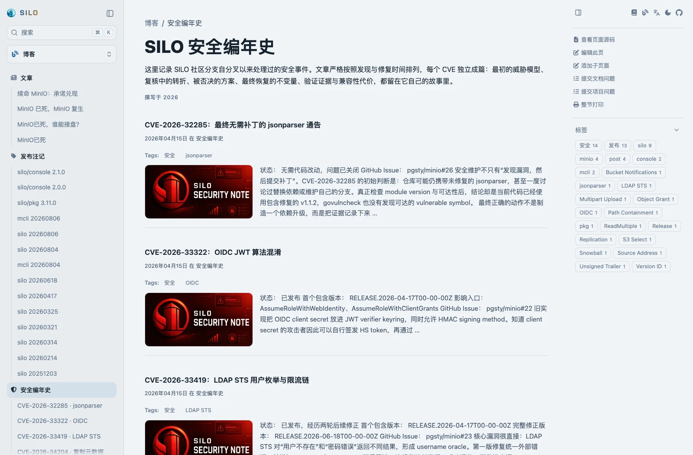

半年前，老冯写了一篇《[MinIO 已死，MinIO 复生](/db/minio-resurrect)》，讲了开源对象存储项目 MinIO 放弃维护、软件供应链断裂的故事，上了 HN 头条。
那篇文章里我立了个 flag：接盘这个烂摊子。

半年过去，可以汇报一下结果了。

- Docker 镜像累计拉取 **50 万次**，GitHub 上已有 **2000+ Star**；
- 发了 **9 个版本**，处理了 **14 项安全漏洞**，其中包括几个高危漏洞；
- 30+ 开源项目已经切换到此分支，有的直接设成了默认依赖：

RAGFlow 的默认 Compose 编排、Dokploy 的产品模板、Grafana Loki 的 Helm 随附服务、戴尔 HPC 平台 Omnia 都在用；
它还进入了 nixpkgs，被 DaoCloud 收进公共镜像加速，另有还有一堆中小项目也已经切换。



不经意间，这个 Fork 已经成了最有影响力、[最活跃的 MinIO 分支](https://github.com/minio/minio/forks)。


当初 Fork MinIO，纯粹是因为 [Pigsty](https://pigsty.io) 自己要用，得把窟窿补上。
补着补着才发现，蹲在这个坑里的人还真不少。
今天写这篇文章，也是因为刚刚发布了新版本 [`RELEASE.2026-08-06T00-00-00Z`](https://github.com/pgsty/silo/releases/tag/RELEASE.2026-08-06T00-00-00Z)。
这一版有不少重要变化，值得好好说说。

---

## 完整改名

在 [**MinIO 已死**](/db/minio-resurrect) 那篇文章里我已经提到过，这个项目最大的隐患在于商标。
MinIO 虽然是开源项目，但开源许可并不附带商标使用权。

老冯一个人还在维护 Pigsty 这种大项目，我肯定没那么多时间去搞重命名这种事。
所以 Fork 的时候就很懒，也没改名，打包一下完事，GitHub 仓库就叫 [`pgsty/minio`](https://github.com/pgsty/minio)。

要是放在以前只给自己用，其实倒也无所谓。但是现在，这个镜像已经有超过 50 万次下载，
这么多知名开源项目把它当作上游，再这么弄就不合适了。这个问题再不解决，就是在给以后埋雷。

为什么呢？虽然我在仓库的各个角落都说明 PGSTY SILO 是独立的社区分支，和 MinIO 公司没有任何关系。
但确实存在这种可能：如果 MinIO 以商标为由发起 DMCA 投诉，要求 GitHub 仓库或 Docker 镜像下架，就会直接破坏供应链的完整性。

一个建立在别人商标地基上、随时可能被一封律师函掐断的供应链，本身就是最大的供应链风险。
所以我下定决心，这次正式把项目名、仓库、二进制，以及所有涉及商标与品牌的部分，彻彻底底地重命名：
从 MinIO 改为 PGSTY SILO（以下简称 SILO）。

---

## 为什么叫 Silo

这个分支为什么叫 Silo 呢？说来挺有意思。在数据世界里，Silo 是一个贬义词，指“数据孤岛”，是数据库和数据仓库极力避免沾染的东西。

但是老冯秉持“贱名好养活”的理念 —— 就像我的主项目 Pigsty，英文含义就是“猪圈”和“脏乱差”，这个意象的联想也不怎么好，但反正最后也跑出来了。

但巧的是，Silo 还有“谷仓”“粮仓”的意思，所以拿来给对象存储命名非常贴切。在 Pigsty 宇宙里，它作为 PostgreSQL 的备份仓库，也确实很搭。


其实，这个名字半年前写那篇宣言时就已经定好了，只不过这一次，我们确确实实地把它落了地。
GitHub 仓库名、Docker 仓库名、二进制名、RPM / DEB 包名和镜像名，全都统一改成了 Silo。

需要明确说明的是，我们修改的只是品牌与商标相关的名称。API、数据存储格式、监控指标、配置参数名称这些东西，我们不会去动。
第一，它们不在商标的覆盖范围内；第二，改这些纯属给用户和自己找不自在。

---

## 兼容性：改了什么，没改什么

有人会问：既然是改名，怎么还留着 `MINIO_*` 环境变量和 `/minio/*` 路由，是不是没改干净？

`.minio.sys` 属于你磁盘上那几百 TB 数据；`MINIO_ROOT_PASSWORD` 这个名字属于你的 `docker-compose.yml`；
`minio_bucket_usage_total_bytes` 属于你的 Grafana 面板和告警规则；
改掉它们，对我来说就是一行命令，但你就得停一次机全量导出导入一遍数据，这笔账都不用算第二遍。

所以改名的原则只有一句话：**改商标与品牌，不改接口与版权。**

| 已改名（交付面）                        | 保留原样（兼容面）                               |
|:--------------------------------|:----------------------------------------|
| 仓库 `github.com/pgsty/silo`      | S3 API、管理 API、SigV4 签名行为                |
| 二进制 `/usr/bin/silo`             | `/minio/*` 路由，含健康检查与指标端点                |
| 软件包 `silo-*.rpm` / `silo_*.deb` | `MINIO_*` 环境变量、`x-minio-*` 响应头          |
| 镜像 `docker.io/pgsty/silo`       | 磁盘格式 `.minio.sys`、纠删码、版本控制              |
| 服务 `silo.service`               | Go 模块与 import 路径 `github.com/minio/...` |
| 配置目录 `~/.silo`（回退兼容 `~/.minio`） | 捆绑客户端 `mcli` 的 `mc` 兼容别名                |

所以对用户来说，迁移可能就是改一行镜像名：

```yaml
services:
  minio:                              # 服务名可以继续叫 minio
-   image: minio/minio:latest
+   image: pgsty/silo:latest
    environment:                      # MINIO_* 一个都不用改
    volumes:                          # 同一个卷，同一份数据
```

如果你使用的是 [RPM / DEB 包](https://silo.pgsty.com/zh/compatibility/binary/)，可能会多敲几条命令。
因为系统用户、二进制和路径的名字确实变了。
但如果你通过老冯的 Pigsty 用 Ansible 部署 Silo，这些部署层面的复杂度也都封装好了，对用户其实没啥区别。


除了改名，这一版还有四件事值得单独说：控制台、安全、网站，以及一份宣言。

---

## 控制台：会说中文了

2025 年 5 月，上游把完整的管理控制台从社区版里砍成了残桩，只留下一个残废的 [对象浏览器](https://silo.pgsty.com/zh/administration/minio-console/)。
今年 2 月我把它接了回来，但说实话，接回来的东西挺糙：界面陈旧，仪表盘查的还是早已不存在的指标。这次修了三样。

**第一，它会说中文了。**

对象存储的运维使用者里，相当一部分人的第一语言是中文，而这套界面从来只有英文。新版把它变成了双语，覆盖所有页面、帮助条目和文档链接，切换按钮就在每页页头。



而且，一旦这条路跑通，再加其他语言的 i18n 也很容易。目前只做了中文；
在添加中文支持的同时，我们还优化了界面，把图片和图标都换成 SVG 矢量图，并预先压缩资源。
这样一来，原本 10 MB 的嵌入式控制台被压到不到 3 MB，体积反而大幅缩小。

**第二，仪表盘读的是真指标了。**

之前的控制台仪表盘查的是 MinIO Metrics v2，现在 MinIO 和 Silo 的指标已经到了 v3，这次我们也把查询一并升级了。
几个本来就坏掉的面板也一起修掉了，整个界面顺手美化了一遍，整体设计由 Fable 5 操刀，水准很不错。



**第三，把没用的东西清掉了。**

我们顺手也把 SUBNET、License 管理和遥测等和上游商业版相关的遗留清理干净了：无分析、无遥测、无埋点、无外部脚本与字体。



---

## 安全：一个 9.1 分的漏洞，但没有 CVE

这一轮一共修了六个安全问题，每一个都在[安全编年史](https://silo.pgsty.com/zh/blog/security/)里一事一文写清楚了，这里只说一句话版本：

- **节点间路径穿越：** 分布式集群的内部通信协议中，一批可以逃出磁盘目录的路径操作；
- **对象授权越界到桶：** 一个尾斜杠，让本该只管对象的 `bucket/*` 授权够到了桶级操作，租户能把自己的桶设成匿名公网可读写；
- **策略条件被客户端遮蔽：** 客户端传上来的参数，能覆盖服务端自己算出来的鉴权条件值；
- **重复分片编号：** 上传一个 5 MiB 的分片，用 `[1,1]` 提交，服务端返回 200 和一个 10 MiB 的对象；
- **来源地址可伪造：** `aws:SourceIp` 策略和审计日志里的客户端 IP，对能直连 API 端口的人来说想写什么写什么；
- **通知配置键没注册：** 一条坏掉的 NATS 配置，能把 Kafka、Webhook、MQTT 所有通知一起无声关停。



其中第一条要单独拎出来说。

6 月我们修过上游的 [CVE-2026-42600](https://silo.pgsty.com/zh/blog/security/cve-2026-42600/)，一个内部端点的路径穿越，官方评分 4.9。修完我在公告结尾留了句话：删掉这个端点只证明这个端点没了，不等于同类问题已经查干净。
8 月初我把这笔账还了，审计下来同一个根因还剩三个协议面、十二处缺陷，全部继承自上游。

- [内部节点路径 containment 审计：补完 CVE-2026-42600 欠下的那笔账](https://silo.pgsty.com/zh/blog/security/internode-path-containment/)

严重程度完全不是一个量级。攻击者可以在磁盘目录之外任意写文件，可以把存着 IAM 与配置的系统卷整个搬进一个能读的桶里，可以递归删掉整棵目录树，也可以用一条请求把进程打崩。按 CVSS 3.1 评估，最严重那条能到 **9.1 分**，而上游那条是 4.9。

**但这次拿不到 CVE 编号。** CVE 流程需要一个受影响产品的维护方来认领、协调披露，而 `minio/minio` 已经归档只读，那边没人了。所以只能自己修、自己公告、自己把话说清楚。仓库归档最现实的代价就在这儿：漏洞不会因为仓库变成只读就消失，只是从此没有人负责了。

范围要讲明白：这些路由只在分布式纠删部署里注册，且需要 cluster root 或节点间凭据，单机部署不受影响。但如果你在跑分布式 MinIO，节点间网络又不是完全可信的，那就只有一个建议：

**请尽快升级，或者迁移到 Silo。**

我们不只修问题，也把过程中的思考与决策沉淀成公开文档。完整的威胁模型、复现向量、修复方案，以及我们自己在修复过程中踩的坑，都写在[这篇公告](https://silo.pgsty.com/zh/blog/security/internode-path-containment/)里了。


---

## 网站：silo.pgsty.com

以前这个 Fork 的主页非常简陋，只有 GitHub README 上几句话。


这两天，老冯用 Fable 搓了一个完整网站出来，文档、博客、下载一应俱全，而且中英双语，看上去一下子就挺像那么回事了：


> [silo.pgsty.com](https://silo.pgsty.com/zh/)

- **完整文档**，中英双语，覆盖部署、运维、监控、复制、加密、IAM 与命令行参考；
- **[发布说明](https://silo.pgsty.com/zh/blog/release/)**，一版一篇，写清楚上游基线、经过测试的回滚目标、验收记录；
- **[安全编年史](https://silo.pgsty.com/zh/blog/security/)**，一事一文，包括最初的威胁模型、复核中的转折、被否决的方案，与设计决策
- **[兼容性审计](https://silo.pgsty.com/zh/compatibility/)**，完整记录 PGSTY SILO 和上游 MINIO 的差异，以及迁移的方案。
- **[下载页](https://silo.pgsty.com/zh/download/)**，Linux / macOS / Windows 二进制、Docker、RPM / DEB / APK、源码、Ansible，一站配齐。


兼容性审计里我最在意的是“哪些不一样”那部分，包括那些为了修安全漏洞而故意收紧、可能会拒掉极少量边缘情况的地方。


---

## Silo 宣言

这个网站上还有一个专门的页面，叫《[Silo 宣言](https://silo.pgsty.com/zh/about/manifesto/)》，一共十一条。


我一开始挺犹豫要不要写这玩意。“宣言”两个字自带一股中二气，而且开源世界最不缺的就是承诺，尤其是那些后来一条都没兑现的承诺。
MinIO 自己的 [`SECURITY.md`](https://github.com/minio/minio/blob/master/SECURITY.md) 到今天还写着“我们总会为最新版本提供安全更新”，而仓库已经归档半年了。

所以我给这一页立了条纪律：

**这里的每一条，要么是我们已经在做、且有公开证据的事实；要么是我们刻意拒绝承诺的事。**

一个兑现不了的承诺，比没有承诺更糟。按这条纪律筛完，剩下的东西大概是这样：

**第一条是退场条款。** Fork 是手段，不是身份。若上游恢复对社区版的承诺，我们乐见其成，愿意收缩范围，并把我们的修复回馈上游。

**第三条是许可证。** 永远采用 AGPLv3，没有 CLA，版权保留在每位贡献者手里，所以重新授权在结构上就不可能。顺带表个态：我们认为通过 S3 API 使用 Silo 不构成衍生作品，许可证永远不会被拿来当威胁或者销售工具用。上游当年正是这么用它的。

**第五条是“永不清单”。** 不把既有功能移进付费墙、不给下载设注册墙、不加遥测（上游那些回连路径是被整体移除的，不是默认关闭）、不引入 CLA、不变更许可证、不以商标追究正常使用与描述性提及。这份清单只增不减，条目可以补充，永远不能删除。

**第九条是延续性。** 这也是我认为最该有人追问的一条：仓库归属 `pgsty` 组织而非个人账号；构建过程完整文档化并附溯源证明，任何人都能在没有我们的情况下从源码重建等价制品；万一项目停止积极维护超过六个月，我们会公开声明并妥善归档，而不是让它慢慢烂掉。

**第十一条管的是这页纸自己。** 增补与加强即时生效，削弱或删除任何一条，须提前九十天公示。


还有件事，首页 FAQ 里写了，这里再说一次：

**Coding Agent 是这个项目功能开发与代码 Review 的主力。**

上一篇《[续命 MinIO：承诺兑现](/db/minio-promise-kept)》里我讲过的那套打法，Codex 打铁、Claude Code 站在对抗视角挑毛病、来回收敛、我看 diff 拍板。
这一版还是这么干的，只是规模大了不少，有大几十个提交，修了不少问题。

配套的承诺是：每个变更都必须过 CI 和人工审核，所有建设性变更都要经过人类的利弊权衡才会合入；
Agent 的完整思考记录归档留存，它们做过的权衡会作为设计文档保留下来。
你在安全编年史里读到的那些“被否决的方案” / “我们自己制造的四次回归”，就是这套记录的公开产出。

我不打算把 AI 藏起来，假装这是纯手工。那既不可能，也不会更好。
这就是 2026 年一个人维护一个中型基础设施项目的真实样子，藏着才是不诚实。

---

## 拿去用

下载和安装，请看这里：[PGSTY SILO 下载](https://silo.pgsty.com/zh/download/)。

| 用途    | 地址                                                                                                       |
|:------|:---------------------------------------------------------------------------------------------------------|
| 容器镜像  | `docker.io/pgsty/silo`（另有 `-distroless` 变体）                                                              |
| 软件包   | [GitHub Releases](https://github.com/pgsty/silo/releases)，RPM / DEB / APK，RPM 带 GPG 签名                   |
| 源代码   | [github.com/pgsty/silo](https://github.com/pgsty/silo)                                                   |
| 文档站   | [silo.pgsty.com/zh](https://silo.pgsty.com/zh/)（中文） · [silo.pgsty.com](https://silo.pgsty.com/)（English） |
| 迁移指南  | [从 MinIO 迁移到 Silo](https://silo.pgsty.com/zh/compatibility/migration/)                                   |
| 生产级部署 | [Pigsty MinIO 模块](https://pigsty.cc/docs/minio/)，开源免费、开箱即用的高可用部署                                         |

旧的 `pgsty/minio` 仓库与镜像会继续保留，冻结在 `RELEASE.2026-08-04` 作为存档，不会删除。但后续所有更新只在 `pgsty/silo` 上发布。

---

## 参考阅读

- [**MinIO 已死**](/db/minio-is-dead)（2025-12），上游拿走了什么，什么时候拿走的
- [**MinIO 已死，谁能接盘？**](/db/minio-alternative)（2025-12），备选方案的逐一评估
- [**MinIO 已死，MinIO 复生**](/db/minio-resurrect)（2026-02），本 Fork 的诞生宣言
- [**续命 MinIO：承诺兑现**](/db/minio-promise-kept)（2026-04），头几个月的兑现记录
- [**Silo 20260806 发布说明**](https://silo.pgsty.com/zh/blog/release/silo-20260806/)，本次发布的完整清单
- [**Silo 宣言**](https://silo.pgsty.com/zh/about/manifesto/)，我们承诺什么，以及刻意拒绝承诺什么

> 商标声明：MinIO® 是 MinIO, Inc. 的注册商标。Silo 是由 Pigsty 社区独立维护的 AGPLv3 开源分支，与 MinIO, Inc. 无任何关联、从属或背书关系。文中对“MinIO”的使用均为描述性使用。
