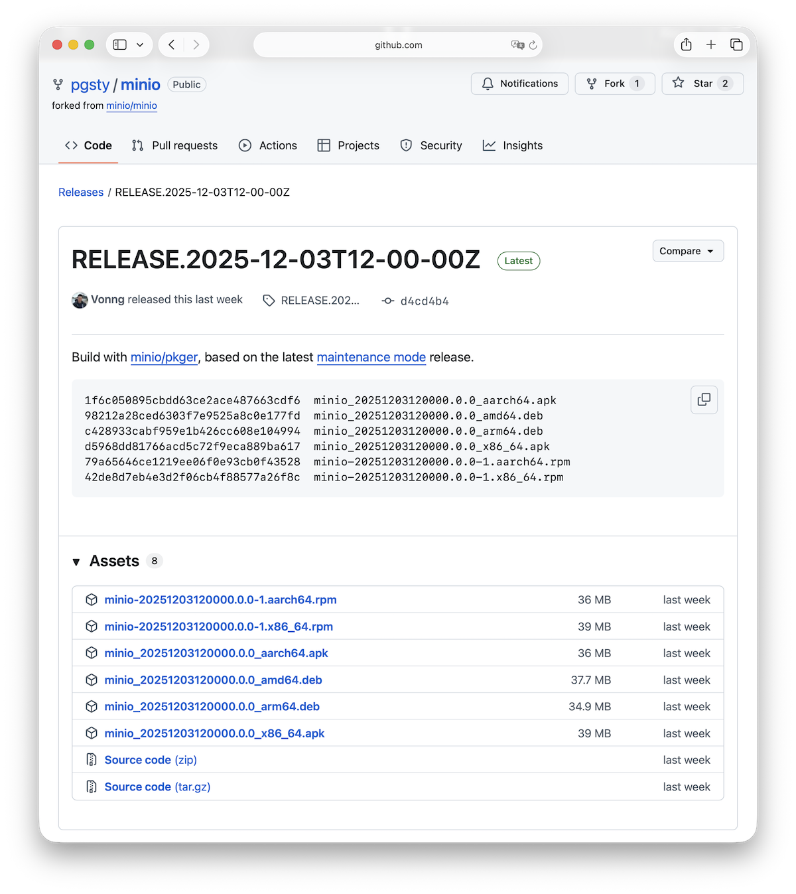

MinIO announced maintenance mode two days ago. I ranted in “[MinIO Is Dead](/en/db/minio-is-dead)” and immediately got flooded with “so what now?”

The usual suspects: Ceph, RustFS, SeaweedFS, Garage. I packaged all of them for Linux (RPM/DEB) and ran them through the grinder.

Short version: **there’s no perfect substitute.** Ceph is powerful but overkill; SeaweedFS rocks tiny files but needs an external metadata DB; Garage is cute but too barebones; RustFS targets the MinIO niche but is still alpha.

## Quick scan of the field

MinIO is the open-source S3 clone. If all you need is basic object CRUD, any S3-compatible store works. But parity with MinIO means more than APIs—it’s about reliability, operability, tooling, documentation, SOPs. Replacing it cleanly is hard.

Ignoring commercial clouds, here’s the OSS menu:

- **Ceph** – arguably the best choice for enterprises, but brutally complex. Most folks don’t need block + file + object in one, and it requires extras like Podmon. MinIO’s single binary spoiled us.
- **SeaweedFS** – optimized for oceans of small files; O(1) disk seeks make it absurdly fast there. But it relies on an external metadata store. If you want a general-purpose object store, that dependency is annoying.
- **Garage** – built by Deuxfleurs with NGI funding. Delightfully light (10 MB), great for self-hosters and edge nodes. But S3 compatibility is thin: no versioning, no cross-region replication, no IAM. Enterprises will laugh.
- **RustFS** – the only project explicitly chasing “drop-in MinIO,” but it’s still alpha.

## RustFS vs. MinIO

RustFS looked the most promising, so I wired it into Pigsty as a MinIO replacement. Most logic carried over, but a few differences popped up:

- Certificates must follow specific naming rules.
- Health checks differ from MinIO’s endpoints.
- `mc admin` doesn’t work; you can’t push fine-grained IAM policies. That’s a deal-breaker for many teams.

It ran, but I’m not shipping alpha software into production, so I shelved the branch. I’ll revisit when RustFS hits GA.

## Will RustFS repeat MinIO’s mistakes?

RustFS has potential, but I worry it’ll retrace MinIO’s path. I asked the AI big three (GPT‑5 Pro, Claude 4 Opus, Gemini 3 Pro) to audit the project. Gemini leveled some serious accusations; Claude corroborated.

The red flags match MinIO’s history: Apache 2.0 license + copyright assignment CLA + single commercial gatekeeper. With that risk profile, I’m downgrading RustFS from “optimistic” to “cautious wait-and-see.”

--------

## So what now?

Pigsty bundles MinIO as an optional module for PostgreSQL backups or as an on-prem S3 for apps like Supabase. After surveying the alternatives, I’m not eager to swap it out. I might add a pgBackRest-native backup server option, but ripping out MinIO today feels premature.

**Best plan:** stay on the latest MinIO release, lock the version, isolate it on the network, and wait a few months. Maybe the community forks it; maybe RustFS matures. Adjust when reality changes.

RustFS still has a golden window to seize MinIO’s niche with a safer, community-friendly fork. That window is measured in months, not years.

--------

## If you stick with MinIO

Use the latest build, not the April 22, 2025 edition with the GUI. There’s a serious CVE in the interim:

- **CVE-2025-62506** – privilege escalation via session-policy bypass (HIGH). Low-privilege users can mint new accounts and escalate.

In a locked-down intranet the risk is manageable, but you still want the fix, which landed in the 2025‑10‑15 release. MinIO pulled the prebuilt binaries starting with that version, offering source only. Annoying, but it’s Go—`go build` and you’re done. I forked MinIO, ran their packager, and produced RPM/DEBs for 2025‑12‑03 so I’m not deploying vulnerable bits: https://github.com/pgsty/minio

Security patches still need humans. MinIO claims they’ll fix critical issues, but if the community wants a maintained fork, now’s the moment. Start from 2025‑04‑22, cherry-pick critical bug/security fixes, and keep a community LTS alive.

MinIO is “done” software. It doesn’t need the latest S3 gimmick (Vector/Table); it needs steady bugfixes. That’s perfect for a community branch. Plenty of storage vendors rely on MinIO; maintaining a fork beats writing a new object store from scratch.
