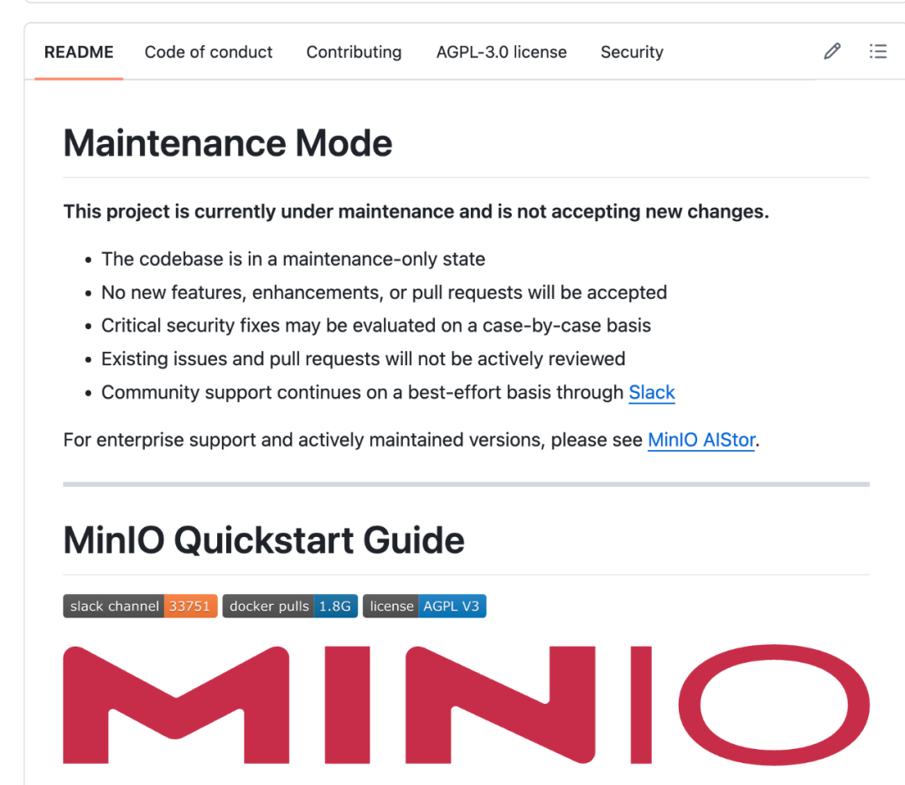
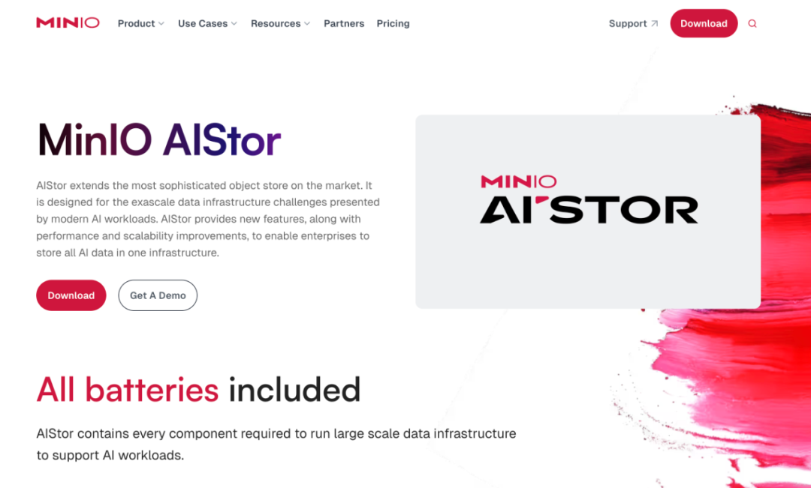
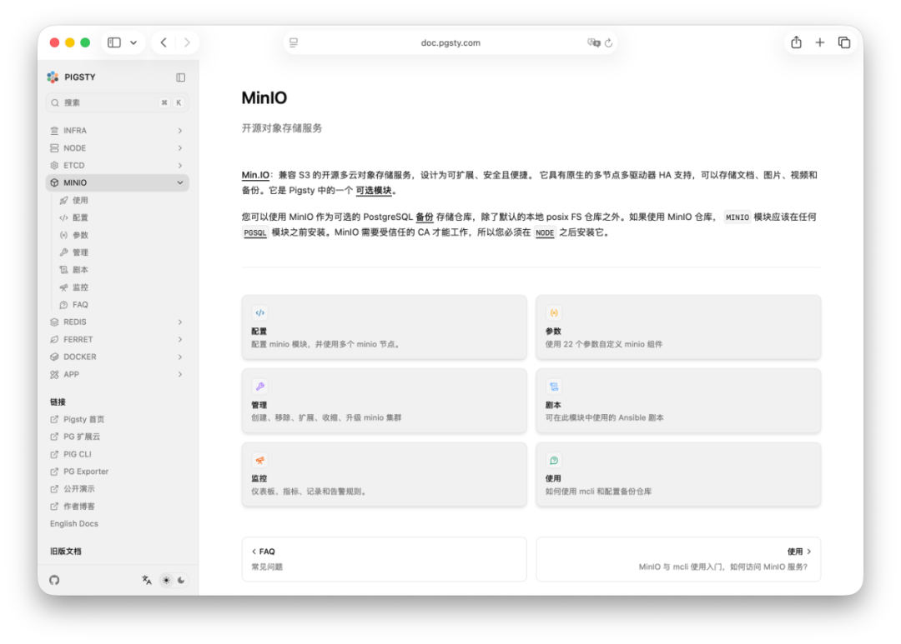

2025年12月3日，是个值得在开源软件历史上记一笔的日子。
MinIO 官方在 GitHub 上更新项目状态，宣布 MinIO 开源项目进入“**维护模式**” 。
这基本上宣告了 MinIO 作为一个开源项目的死亡。

MinIO 这家公司，终于完成了从“屠龙少年”到“恶龙”的华丽转身。

--------

## 从屠龙勇者到新的恶龙

#### 民主化时代（2014–2019）：对象存储的 Apache

MinIO 成立于2014年，其创始愿景极具理想主义色彩——做“对象存储领域的 Apache”。在那个 AWS S3 统治云存储的年代，MinIO 以其极致的轻量化（单个静态二进制文件）和对 S3 API 的 100% 兼容性，迅速赢得了开发者的青睐。

在这一阶段，MinIO 采用宽松的 Apache 2.0 许可证，鼓励开发者将其集成到各种应用中。其核心价值主张是“让任何硬件都能变成 AWS S3”。这种开放策略极其成功，MinIO 官方宣称其 Docker 镜像下载量超过10亿次，成为全球部署最广泛的对象存储服务 。此时的 MinIO 是云原生技术栈的宠儿，是 Kubernetes 环境中标配的存储后端。

#### 许可证武器化（2019-2025）：AGPL 攻防战

社区关系的第一次重大裂痕出现在2019年至2021年间。MinIO 宣布将其核心许可证从 Apache 2.0 变更为 GNU AGPLv3 。

虽然官方解释称此举是为了防止云厂商（如 AWS、Azure）“白嫖”代码并将其包装为专有服务——这是开源界常见的防御性手段。
这一时期，MinIO 从社区的守护者转变为激进的知识产权捍卫者。
2022 年， MinIO 公开指责 Nutanix Objects 产品侵犯其许可证，撤销了Nutanix 的使用授权；2023 年， MinIO 以类似理由起诉高性能文件系统厂商 Weka。
这些法律行动虽然在法理上具有争议，但释放了一个明确的信号：MinIO 不再欢迎未经付费的商业集成。这为2025年的全面封锁奠定了法律和心理基础。

#### 阉割控制平面（2025-05）

2025年5月，当时 MinIO 决定从社区版代码中移除 MinIO Console——这是一个集成了存储桶管理、身份与访问管理（IAM）、监控和日志审计的关键图形用户界面（GUI）。
此次剥离后，开源版 MinIO 仅剩下一个基础的“对象浏览器”，仅具备查看和下载文件的能力。

而身份策略管理，站点复制配置，生命周期管理等核心运维功能被完全移至商业企业版。
这一变更将社区版 MinIO 从一个功能完备的存储管理系统降级为一个单纯的数据平面组件，剥夺了其作为独立产品在生产环境中使用的控制平面能力

#### 中断二进制分发（2025-10）

2025年10月15日，当时，正值一个关键安全漏洞（CVE-2025-10-15T17-29-55Z / GHSA-jjjj-jwhf-8rgr）被披露之际，MinIO 停止了向 Docker Hub 和 Quay.io 发布更新的 Docker 镜像 。
这一时间点的选择具有极高的战略意味。在重大安全漏洞爆发期间切断二进制分发，实际上是将安全性变成了一种“勒索”筹码。

这一决策直接切断了绝大多数企业级用户的自动化部署链路，使得依赖 `docker pull minio/minio` 或 `helm install` 的标准 CI/CD 流程瞬间失效。
对于那些缺乏 Go 语言编译环境或内部容器镜像仓库维护能力的团队而言，这实际上等同于不可用。

#### 维护模式（2025-12）

2025年12月3日，MinIO, Inc. 在其官方渠道及 GitHub 仓库中正式更新了项目状态，宣布 MinIO 开源项目进入“维护模式”。
README 上写到：以后不再提供功能更新改进，不再审Issue合 PR，重大安全问题看情况。
不再提供 RPM/DEB 包与 Docker 镜像，不再加新功能，需要维护的企业用户请切换到商业版本 AIStor 上。

--------

##  技术影响：对开源生态的破坏

MinIO 进入维护模式对现有技术栈造成了即时且深远的破坏。

#### CI/CD 管道的断裂与自动化危机

成千上万的 Helm Charts、Ansible Playbooks 和 Terraform 脚本依赖于 `minio/minio` 或 `bitnami/minio` 镜像。
随着官方停止发布镜像，Bitnami 等第三方打包商也因无法获取上游稳定代码而被迫停止更新 。

- **连锁反应：** 新环境的部署将直接失败；自动扩缩容组（Auto-scaling groups）在拉取新节点时会因找不到镜像而挂起。
- **修复成本：** 企业必须重写所有的部署脚本，指向私有镜像仓库，并建立内部的构建流程来从源码编译 MinIO。

#### 安全真空：CVE 管理的私有化

停止发布二进制文件最致命的后果是安全补丁的滞后。以2025年10月的漏洞为例，MinIO 实际上扣留了二进制补丁 。

- **风险暴露：** 缺乏专门安全团队的中小企业将被迫继续运行含有高危漏洞的旧版本。
- **合规噩梦：** 对于受 PCI-DSS、HIPAA 或 SOC2 监管的企业，无法获得供应商签名的安全更新意味着合规性失效。

#### 运维复杂度的指数级上升

UI 的移除不仅是用户体验的倒退，更是运维成本的增加。
过去只需在 Console 中点击几下即可完成的存储桶策略配置、用户权限分配，现在需要运维人员熟练掌握 `mc` 命令行工具或编写复杂的 JSON 策略文件。
这无形中提高了使用门槛，使得 MinIO 不再适合作为轻量级的内部工具使用。

--------

## 背后的原因：资本与商业化的压力

MinIO 的技术决策根本动力来自于资本市场的估值逻辑。截至2025年，MinIO 已累计融资1.26亿美元。
其中最具决定性的是2022年1月完成的1.03亿美元 B 轮融资，由英特尔资本（Intel Capital）、软银愿景基金2期和 General Catalyst 领投。
这轮融资将 MinIO 推上了10亿美元估值的“独角兽”宝座。

在风投逻辑中，10亿美元的估值意味着公司必须展现出通往IPO的明确路径，通常要求年经常性收入（ARR）达到1亿美元以上，并保持高速增长。
2025年2月，MinIO 宣布其 ARR 在过去两年增长了149% 。虽然增速可观，但要支撑如此高的估值，仅靠自然转化已不足够。

**停止开源支持，是将庞大的用户基数强制转化为付费客户的最直接手段。**

2025年，MinIO 进行了全面的品牌重塑，推出了“MinIO AIStor”，将自己定位为“企业 AI 的数据基石”。
公司管理层意识到，通用对象存储（用于备份、网盘）的市场已是一片红海，且利润微薄；而生成式 AI（Generative AI）对高性能数据吞吐的需求（Exascale AI）才是下一个增长爆发点。
通过优化 AI 工作负载并专注于服务财富500强企业 ，**MinIO 实际上决定剥离低价值的开源用户群体**。
维护模式的开启，标志着 MinIO 正式从一个广泛的开源项目转型为一家服务于高端 AI 客户的垂直软件供应商

MinIO 已经不是几个极客在车库里写的玩具了，它是一家融资了 **1.26 亿美元**、估值超过 **10 亿美金** 的商业公司。
它的背后站着 **Intel Capital**，站着 **软银愿景基金**。 **当你拿了风投那么多钱，你的老板就不是用户，而是投资人**。
投资人要的是什么？是 **ARR（年度经常性收入）**，是 **增长率**，是 **IPO**。 
你跟投资人说：“我有10亿次 Docker 下载量！” 投资人会问：“这10亿次下载，给你付了一毛钱吗？”

现实就是这么残酷。那帮用免费版 MinIO 的中小企业、个人开发者，在资本眼里就是**低价值资产**。
你们提 Issue 报 Bug，群里问东问西，消耗的是昂贵的工程师工时，带宽和服务器资源，而你们 **永远不会转化为付费客户**。
MinIO 的管理层很清楚，他们的真正金主是那些搞 **AI 大模型** 的 500 强企业。
那些训练 GPT、跑自动驾驶数据的公司，需要的是 **AIStor**，是极致的性能，是 7x24 小时的 SLA 。

所以，开启“维护模式”，本质上是一次**资产剥离**。MinIO 决定切掉这块“坏肉”（免费用户），把所有资源集中到能产奶的“金牛”（企业级 AI 客户）身上。
从商业策略上讲，这叫**聚焦**。 从对投资人的交代上讲，这叫**负责**。 只是从开源上来说，这叫**缺德**。

--------

## 老冯的感想

老冯大概从 2018 年开始使用 MinIO ，当时还是 Apache 许可证，我们搞了几个几 PB 的对象存储，用来存放视频，图片，备份  —— 可能是那时候国内最大规模的部署实践。
老冯也编写了 MinIO 部署监控，扩缩容的 Playbook ，算是做过一些贡献 —— 现在还能在 Pigsty 中开源提供。

作为开源创业者，老冯不是不能理解这种改变的动机。
但是站在开源贡献者与用户的立场 —— 老冯也知道很多兄弟现在心里只有一句话：**“我从未见过如此厚颜无耻之人。”** 

开源协议虽然不是卖身契，但它是一种**社会契约**。
开发者贡献代码、用户贡献测试场景和口碑，大家一起把项目捧红。
MinIO 享受了十年的社区红利，靠着“全球下载量第一”的虚荣指标拿到了融资，
转头就对这就帮把它捧上去的用户说：“你们是搭便车的，滚蛋。”
这种行为破坏了开源社区最底层的信任。

这种“养套杀”的手段，比币圈的 Rug Pull 还要恶心。币圈割的是钱，MinIO 割的是全球数万家企业的技术栈 —— 
用户的选择其实不只是一个二进制，而是一个软件生态和设计哲学。等大家都上车了，把迁移成本堆高到无法承受，然后突然抽走梯子。
这种模式，开源专家 Tison 在《[诱导转向的伪开源战略](https://mp.weixin.qq.com/s/HsgoUoBzsyXSmDfV00DlgQ)》已经聊的很透聊。

诱导转向的核心问题在于 **欺骗**，既然 MinIO 背叛了社区，社区也会抛弃它。**Garage**、**SeaweedFS** 甚至 **RustFS**，替代品有很多。江湖路远，后会无期。
如果要说老冯的感想是什么，那么就借用《银河系漫游指南》里海豚临走时说的那句话吧： **“So long, and thanks for all the fish.” —— 再见，多谢你们的鱼了。**

