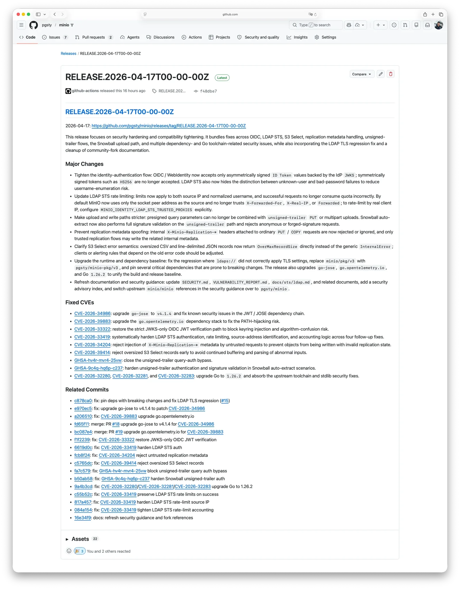
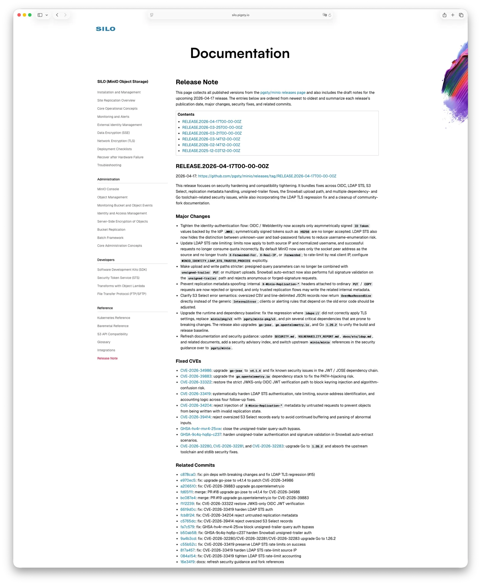

Two months ago in ["MinIO is Dead, Long Live MinIO,"](/en/db/minio-resurrect) I promised I'd keep the MinIO fork patched. 
The recurring objection on HN is fair: can one person actually maintain something like this? 
The real answer isn't clicking fork. It's what happens when CVEs start landing.

Between April 15 and 17, `pgsty/minio` shipped [RELEASE.2026-04-17](https://github.com/pgsty/minio/releases/tag/RELEASE.2026-04-17T00-00-00Z),
closing four CVEs and a handful of related vulnerabilities disclosed in the same window.

The scope I committed to originally was narrow: no new features, keep the supply chain running, 
handle reproducible bugs and security issues as they come in.
This release is what it looks like when that promise gets tested.

------

## What happened upstream

In December 2025, MinIO moved the open-source repo to [maintenance mode](https://github.com/minio/minio/commit/27742d469462e1561c776f88ca7a1f26816d69e2). The README said security fixes would be "evaluated case by case." In February 2026, the repository was archived and the landing page became "this repository is no longer maintained."

The [`SECURITY.md`](https://github.com/minio/minio/security) in that same archived repo still says: "we will always provide security updates for the latest release."

Over the past month, four high-severity and two medium-severity vulnerabilities have been disclosed against the final open-source release.

It's been **184 days** since the last upstream release. Vulnerabilities get disclosed; fixes ship only in the commercial build. The guidance for OSS users is a single line: upgrade to AIStor.

> AIStor starts around $100k/year for 400 TiB — roughly S3 pricing, for software you install and operate yourself.

It's a clean arrangement: archive the repo so there's no obligation to patch, keep publishing CVE advisories for visibility, and route everyone who reads them toward the commercial product.

Someone still has to patch the old one.

------

## What this release fixes

Full write-ups, CVSS arithmetic, and PoCs are in the [release notes](https://silo.pigsty.cc/reference/release-note). The short version:

- **CVE-2026-33322 (OIDC JWT algorithm confusion, CVSS 9.8)**: under certain IdP configurations, an attacker who knows the OIDC ClientSecret can mint a token claiming any identity — including `consoleAdmin` — and MinIO will accept it. Vulnerable window: November 2022 through March 2026. About three and a half years.
- **CVE-2026-33419 (LDAP STS enumeration and brute-force)**: the login endpoint leaks which usernames are real, and there's no rate limiting on the subsequent password guessing. End of the chain is an STS credential.
- **CVE-2026-34204 (replication-header metadata injection)**: a regular PUT or COPY with certain `X-Minio-Replication-*` headers can write an object into a permanently unreadable state. The data is still on disk; you just can't read it back out.
- **CVE-2026-39414 (S3 Select memory exhaustion)**: one request, one OOM.
- **GHSA-hv4r-mvr4-25vw / GHSA-9c4q-hq6p-c237**: two signature-verification bypasses on the unsigned-trailer path. Anonymous or forged-signature requests can successfully write objects on certain routes.

Plus the usual dependency cleanup from `go-jose`, `go.opentelemetry.io`, and the Go 1.26.2 upgrade itself — about twenty security items in total counting transitive dependencies.

------

## How it got fixed

I said in the earlier post that I'd rely on AI coding agents, and that's how this round went. My role was closer to "review and decide" than "write code."

Per-issue flow, roughly:

1. **Codex drafts first.** Given the CVE description and relevant code paths, it produces an initial patch.
2. **Claude Code reviews adversarially.** Picks holes from the attacker's side.
3. **Back to Codex.** If it agrees with Claude Code's critique, it reworks. If not, it has to write out why. No silent overrides.
4. **Another round of review by Claude Code**, with both sides' reasoning on the table. Iterate until they converge.
5. **Tests.** Codex proposes cases, Claude Code adds more, Codex runs them, Claude Code reviews the results.
6. **I decide.** Read the diff, run the tests, merge or send it back with comments.

I didn't write any of the code in this round. My job was to define the problem, set constraints, pick between approaches, read diffs, run tests, and merge. The GitHub log shows `Vonng`, `Codex`, and `Claude Code` as co-authors — that's just who did the work.

A few things I noticed about how this runs in practice.

**Two heterogeneous agents in opposition catch more than one agent alone.** A single agent patching a security bug tends toward confident-sounding fixes that quietly miss a boundary condition. Having a second agent argue against the first filters out most of those.

**It forces the tradeoffs into writing.** When two implementations diverge, someone has to say why A over B. That exchange is the thing I can actually act on as the person deciding what to merge.

**Real maintenance is patch-on-patch, not one-shot.** The LDAP STS fix is a good example. The first version landed, and then we realized: successful requests shouldn't count against the rate limit; `X-Forwarded-For` shouldn't be trusted by default; the limiter should key on source IP plus normalized username, not just one. Three follow-up commits before it settled. Iterating through that by hand would have cost a lot more time.

------

## Why this fork exists

Because I use MinIO myself.

MinIO is a production dependency for [Pigsty](https://pigsty.io/docs/minio). 
I need working binaries, a complete console, packages that keep shipping, and someone actually handling CVEs. 
That keeps the scope narrow. No new features, no turning the repo into a playground. Compatibility, supply chain, fixes when they're needed.

— Chainguard also ships MinIO container images that track upstream's post-archive commits, a useful option if you use their images. This fork
is a different shape: source tree, RPM/DEB packages, restored console, and doesn't depend on upstream continuing to push patches somewhere.

The fork is at about **1,300 stars** on GitHub and **50,000+ pulls** on Docker Hub now.
Not remarkable numbers, but enough to tell me I'm not the only one who needed this fork to keep shipping.

If you're already running OSS MinIO, migration is cheap:

- **Docker**: swap `minio/minio` for `pgsty/minio`.
- **RPM / DEB**: on [GitHub Releases](https://github.com/pgsty/minio/releases), or via `pig`.
- **Source**: [pgsty/minio](https://github.com/pgsty/minio)
- **Docs**: [silo.pigsty.io](https://silo.pigsty.io)

You don't need to replace anything around it or relearn the API. In most cases, you're just pointing a compatible binary at the same deployment. 
If you want a full HA production setup, [Pigsty](https://pigsty.io/docs/minio) ships one for free.

------

Something I use broke; I'm fixing it.

What's different in 2026 is the cost of "I'm fixing it." With two coding agents and someone to referee between them, the maintenance load of a mid-sized Go codebase is tractable for one person in a way it wasn't a year or two ago. That's about it — not a grand theory about open-source resilience, just the current operating point.

If you're running OSS MinIO, the migration is cheap and the patches are current. If another CVE drops, I'll still be here.

- [**MinIO Is Dead, Long Live MinIO**](/en/db/minio-resurrect)
- [**From AGPL to Apache: Reflections on Pigsty's License Change**](/en/pg/pigsty-relicense/)
- [**Originally published in Chinese**](https://vonng.com/db/minio-promise-kept)

