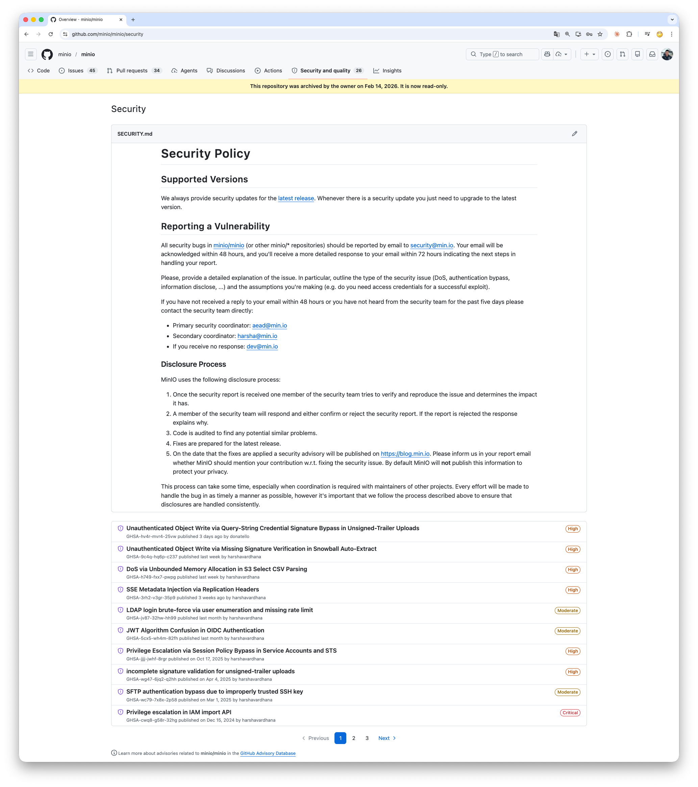
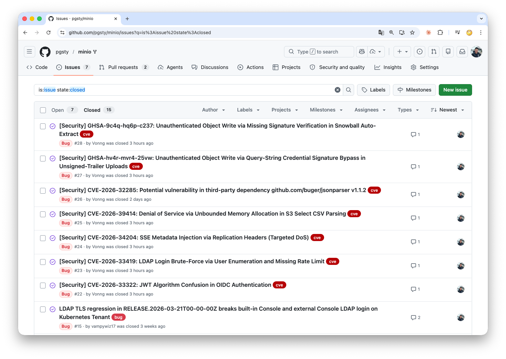
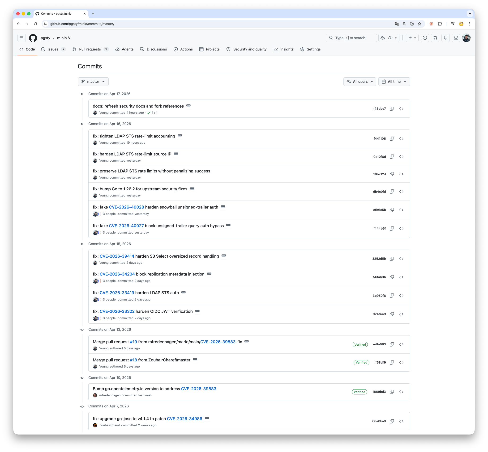
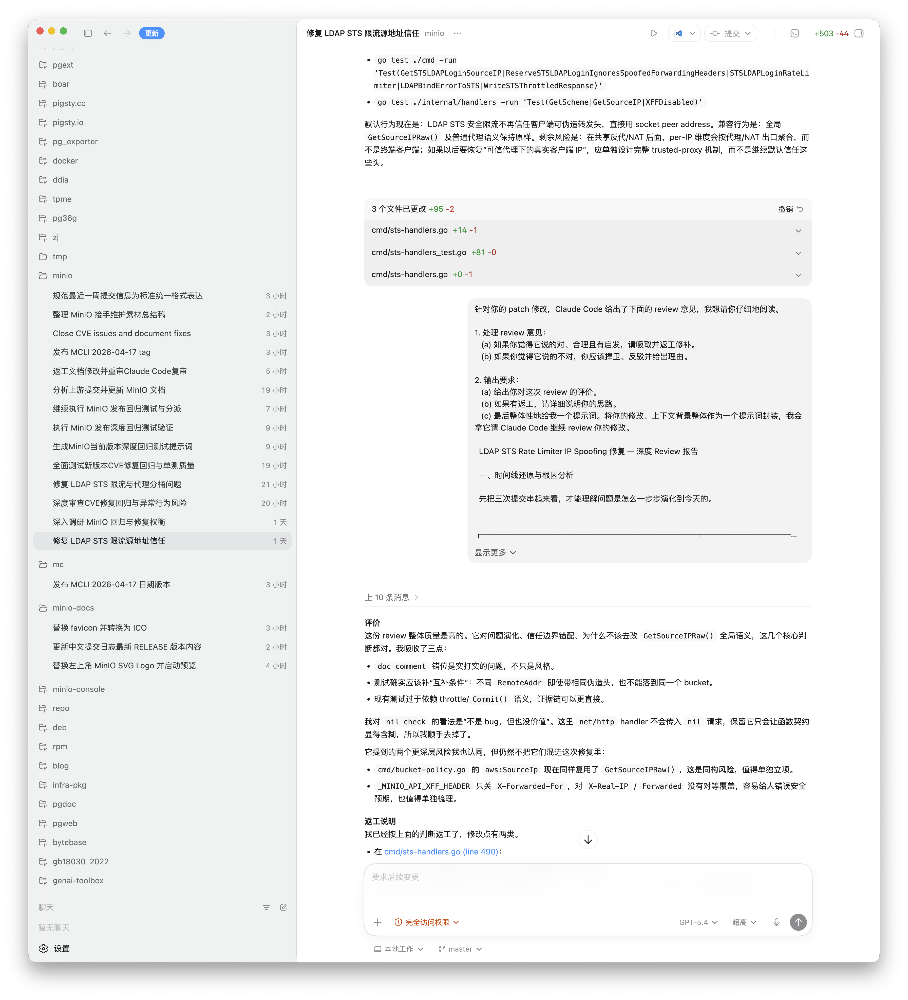
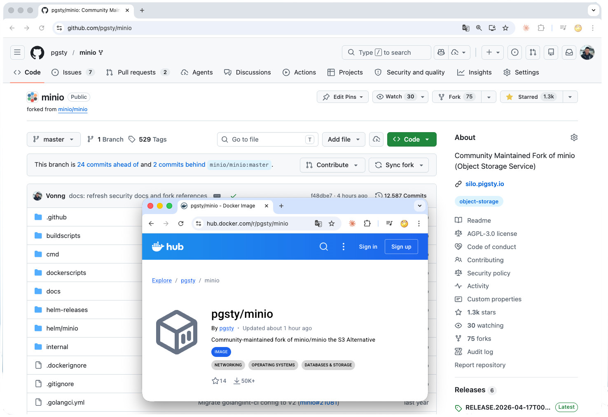
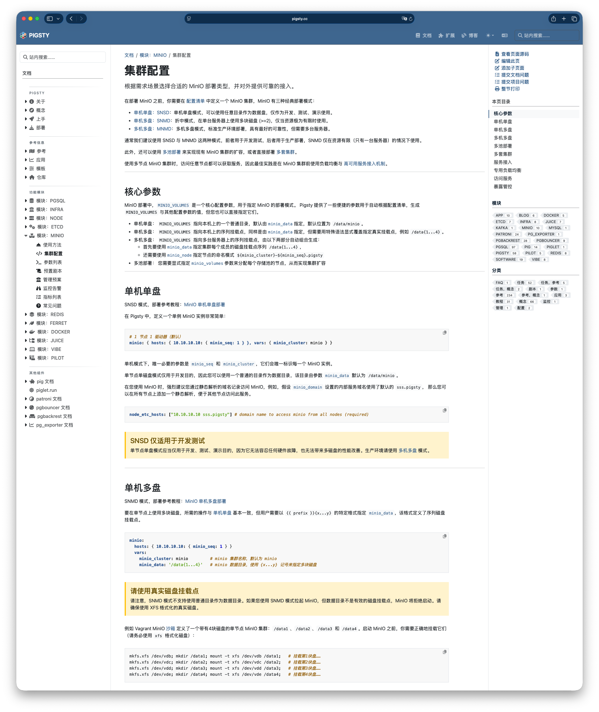
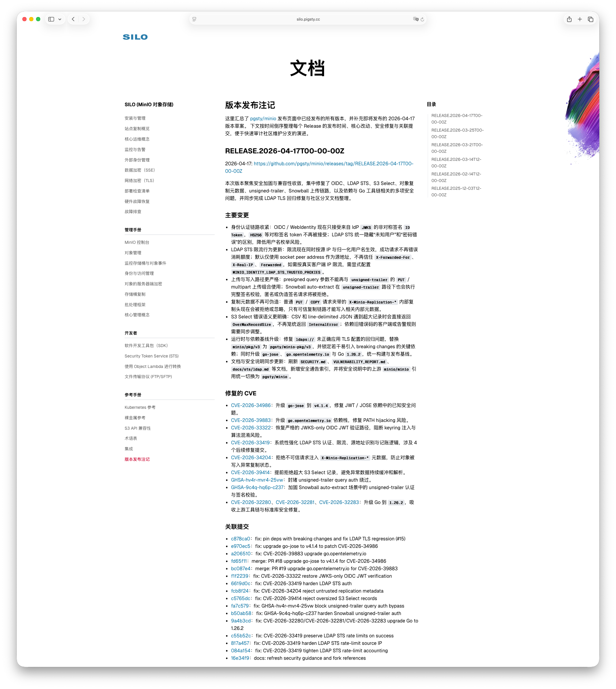

两个月前，我在《[MinIO 已死，MinIO 复生](/db/minio-resurrect)》里立了一个 flag，承接上游的烂摊子，跟 CVE、修 Bug。
那篇文章上了几个小时的 Hacker News 头条。鼓励不少，质疑也不少：一个人，真维护得了这种项目吗？

这个问题其实问得很好。因为真正见真章的时刻，不是点 fork 按钮，也不是改 README 文档，而是当安全漏洞真砸下来的时候。

现在，这件事可以交账了。

4 月 15 日到 17 日，三天时间，`pgsty/minio` 发布了 [RELEASE.2026-04-17](https://github.com/pgsty/minio/releases/tag/RELEASE.2026-04-17T00-00-00Z)，连续修掉并关闭了 4 条 CVE 加几条同期披露的安全漏洞，OIDC JWT 算法混淆（CVSS 9.8）、LDAP 登录用户名枚举与暴力破解、复制头元数据注入导致对象不可读、S3 Select 超大记录打穿内存，以及两条 unsigned-trailer 写入路径上的签名绕过。

*A promise made, a promise kept.*

当时我把话说得很清楚：不做新特性，只保障供应链；遇到可复现问题和安全漏洞，会积极跟进和修补。这件事，现在算是交账了。

------

## 上游发生了什么

2025 年 12 月，MinIO 把开源仓库改成 [**维护模式**](https://github.com/minio/minio/commit/27742d469462e1561c776f88ca7a1f26816d69e2)。README 里写着 “安全修复会逐例评估”。
到 2026 年 2 月，仓库直接归档，首页变成了 “当前仓库已经不再维护”。但同一个仓库的 [`SECURITY.md`](https://github.com/minio/minio/security) 还留着：“我们总会为最新版本提供安全更新”。

而最近一个月，MinIO 又暴漏出四个高危漏洞，两个中危，覆盖最后的开源版本。

与此同时，上游官方仓库距离最后一次发布已经过去 **184 天**。
他们披露漏洞，但只在商业版本中修复。对于开源版用户，他们给的建议就一条，“升级到商业版 AIStor”。

> 顺便一提，MinIO 入门起步价约 10 万美元/年，400 TiB，单价基本跟 AWS S3 差不多，简直离大谱，毕竟这是纯软件。

一种很精致的玩法。仓库归档了，道义责任撇清了；但 CVE 通告照发，既能刷一波 “我们很负责任” 的存在感，又恰好能把用户赶进商业版的羊圈。

挺聪明的。只是还得有人得把这坑填上。

------

## 这次修了什么

这篇文章我不想写成漏洞分析报告。具体每一条的 CVSS 分数、攻击链、PoC 代码，我在 [发布注记](https://silo.pigsty.cc/reference/release-note) 里都一一列了，感兴趣的朋友可以去看。这里只说一句话版本：

- **CVE-2026-33322（OIDC JWT 算法混淆，CVSS 9.8）**：在特定 IdP 配置下可以**伪造任意身份**，包括 `consoleAdmin`。攻击者只要知道 OIDC ClientSecret，数学上就能签出一张 “我是管理员” 的通行证，MinIO 会乖乖验证通过。影响范围从 2022 年 11 月到今年 3 月，**三年半**。
- **CVE-2026-33419（LDAP STS 登录枚举与暴力破解）**：攻击者可以先用登录接口枚举出真实用户名，再无速率限制地爆破密码，最后直接拿到 STS 凭证。整个链条从头到尾没有一道闸。
- **CVE-2026-34204（复制头元数据注入）**：普通 PUT / COPY 请求里夹一些 `X-Minio-Replication-*` 头，就能把对象写成**永久不可读**状态，数据还在，但你再也读不出来。
- **CVE-2026-39414（S3 Select 内存耗尽）**：一条恶意请求，就可以把 MinIO 进程吃到 OOM。
- **GHSA-hv4r-mvr4-25vw / GHSA-9c4q-hq6p-c237**：unsigned-trailer 路径上的两条签名校验绕过，匿名或伪造签名的请求可以在某些路径下成功写入对象。

再加上 `go-jose`、`go.opentelemetry.io` 和 Go 1.26.2 自身吸收的一连串标准库与依赖 CVE，这一版本聚合了接近二十条安全条目。

有的能伪造身份拿到高权限访问，有的能把登录入口拿去枚举和爆破，有的能把对象写成永久不可读，有的能用一条请求把服务吃到 OOM，还有的能在缺失签名校验时直接写入对象。这不是小修小补，这是实打实的维护责任。

------

## 这次是怎么修的

在之前那篇文章里，我明确说过我会用 AI Coding Agent 来维护这个项目，事实上我也是这么做的。这一轮修复里，我扮演了一个 **Blind Manager** 的角色。

简单解释一下我的工作范式。具体到每一条漏洞，流程大致是：

1. **Codex 先打铁**：根据 CVE 描述和相关代码路径，产出第一版补丁。
2. **Claude Code 做 review**：站在对抗视角挑毛病。
3. **回到 Codex**：我要求它，如果你同意 Claude Code 的意见，那就返工；如果不同意，那就反驳，把理由写清楚。
4. **把所有思路摊开**，再交给 Claude Code 做一轮 review。必要时来回再跑几轮，直到两边收敛。
5. **进行测试**：依然是类似的对抗操作，由 Codex 设计测试用例，Claude 补充。然后由 Codex 去实际执行并产出结果，再由 Claude Code review。
6. **我来定夺**：看 diff，跑测试，做最后决策与验收。

这个过程中，我自己不写一行代码。我的工作是定义问题、约束边界、挑方案、看 diff、跑验收、拍板。

公开提交页上，你能直接看到 `Vonng`、`Codex`、`Claude Code` 三个名字同时出现在几条关键安全提交的 `Co-authored-by` 里。这不是作秀。这就是 2026 年一个人维护一个中型基础设施项目的真实样子。

这种协作模式有几个实际的好处。

**第一，两个 agent 对抗能筛掉大部分“听起来都对、实际上不对”的方案。**
单独一个 agent 在修复安全漏洞时会有一种 “幻觉级自信”，写出一份解释流畅、看起来干净的补丁，但漏掉了一个边界条件。让另一个 agent 从敌对视角审视它，这种方案很难活过第一轮。

**第二，逼出显式的权衡。**
两家不同实现路径撞上了，自然就要回答 “为什么你选 A 而我选 B”。这个对话本身就是在把隐性假设显性化，而显性化的假设，才是我作为 Blind Manager 能拍板的东西。

**第三，真正的维护是“补丁打补丁”，而不是一把梭。**
拿 LDAP STS 这条洞来说，首版修复推出来以后，很快发现成功请求不该消耗限流额度、默认不该信任 `X-Forwarded-For`、限流账户要按 “源 IP + 归一化用户名” 双维度算账。
然后又连着补了三次提交才算收敛干净。这个过程如果没有 agent 的火力支持，单个 maintainer 要一边读代码一边迭代，成本是完全不一样的。

------

## 有些事还是要人来拍板

但也正因为这个模式运转得不错，**maintainer 唯一的不可替代性，就凸显在那些 AI 给不出最后答案的地方。**

最典型的就是 OIDC 那条 fix。表面上，它是一个 JWT 算法混淆漏洞；但实质上，它是一个**兼容性和安全性之间的取舍**。

简单解释一下。JWT 的签名算法分两类：**非对称**（RS256、ES256 这类，签名用私钥、验签用公钥）和**对称**（HS256 这类，签名和验签用的是同一个密钥）。OIDC 的标准姿势是 IdP 用自己的私钥签 token、MinIO 用公开的 JWKS 拿到公钥来验签。公钥是公开的，攻击者拿不到私钥，所以没法伪造。

而 HS256 这类对称算法的问题在于：**签名和验签用的是同一个密钥**。这个密钥就是 MinIO 自己也存着的 ClientSecret。于是攻击者只要拿到这个 “共享秘密”，就既能当裁判又能当运动员。自己用它签一张 token，MinIO 拿自己存的同一个密钥一验，当然通过。

这在教科书上是 JWT 的经典反模式，但历史代码就是这么走过来的。修法有几条路可选：

- **继续容忍这条历史路径，只在某些条件下收窄**：保留向后兼容，但安全边界依旧模糊。
- **严格 JWKS-only，拒绝 HS256 等对称签名 token**：一刀切、安全边界清晰，但少数本来就配得模糊的用户会感到配置失效。

两个 agent 可以给我列出每个方案的 trade-off，可以写好任何一个方案对应的补丁，但它们不会替我决定。最后我的选择是后者，恢复严格的 JWKS-only 验证路径，明确拒绝不该接受的 HS256。

这个决定也许会让少数模糊配置失效，但安全边界终于清楚了。AI 可以提三个方案，**真正承担后果的人还是 maintainer**。

这就是 Blind Manager 模式的上限，也是下限：机器负责穷尽方案，人负责选择方向。

------

## 不是情怀，是必需

我一直说，这个 fork 不是情怀，也不是 cosplay。它存在，首先是因为这是我自己要用的东西。

MinIO 是 Pigsty 的生产依赖。我需要可用的二进制、完整的控制台、持续可得的包，以及真正有人处理的 CVE 补丁。也正因为我自己在用，所以这条线没有太多空话空间：它不是拿来讲故事的，而是拿来顶生产环境的。

这也决定了我的策略很保守。不会去追求 “新特性很酷”，也不会把仓库弄成另一个方向的实验场。我的目标一直都很明确：保持兼容，守住供应链，在该修的时候把问题修掉。

到现在，这个分支在 GitHub 已经有了 **1300 star**，在 Docker Hub 也累计了 **五万+ 下载**。数字本身不算什么惊人的成就，但它至少说明了一件事：需要这条线的人，并不只有我自己。

对已经在用 MinIO 开源版的人来说，迁移到这个分支的成本其实很低：

- **Docker 镜像**：把 `minio/minio` 换成 `pgsty/minio`，一行的事。
- **RPM / DEB**：[GitHub Release](https://github.com/pgsty/minio/releases) 里都有，或者用 `pig` 一键装。
- **源代码仓库**：[pgsty/minio](https://github.com/pgsty/minio)
- **文档镜像站**：[silo.pigsty.cc](https://silo.pigsty.cc)
- **英文文档**：[silo.pigsty.io](https://silo.pigsty.io)

你不需要换掉整个系统，也不需要重新学习一套对象存储；多数情况下，只是把一个失去维护的上游，替换成一个还会继续交付补丁的分支。
如果你需要完整的生产级部署方案，Pigsty 里也提供了开源免费、开箱即用的 MinIO 生产级高可用部署支持。

------

## 承诺是什么

两个月前那篇文章发出去以后，有人私信我，说这事看着挺悲壮。其实不是。

写那篇文章的时候我没有赌气，发这个版本的时候我也没有激动。从头到尾，这就是一件普通得不能再普通的事，**用的东西坏了，自己修一下**。仅此而已。

只是到了 2026 年，“自己修一下” 这件事的门槛，被 AI Coding Agent 重新定义了。一个人，加两个 agent，加一点点判断力，足以把一个六万 star 的中型基础设施顶起来。这不是我厉害，这是**时代变了**。

以前我们谈论开源的韧性，谈的是 “社区”，几十上百个志愿者众筹时间。现在这套剧本还在，但**底下多了一层保险**：哪怕社区散了，只要有一个人还愿意按下 fork 按钮，项目就能续命。

承诺是什么？承诺不是 “我有激情”，也不是 “我有道义”。承诺是 **“下一个 CVE 出来的时候，我还在”**。

下一个 CVE 出来的时候，老冯还在。

就这样。
