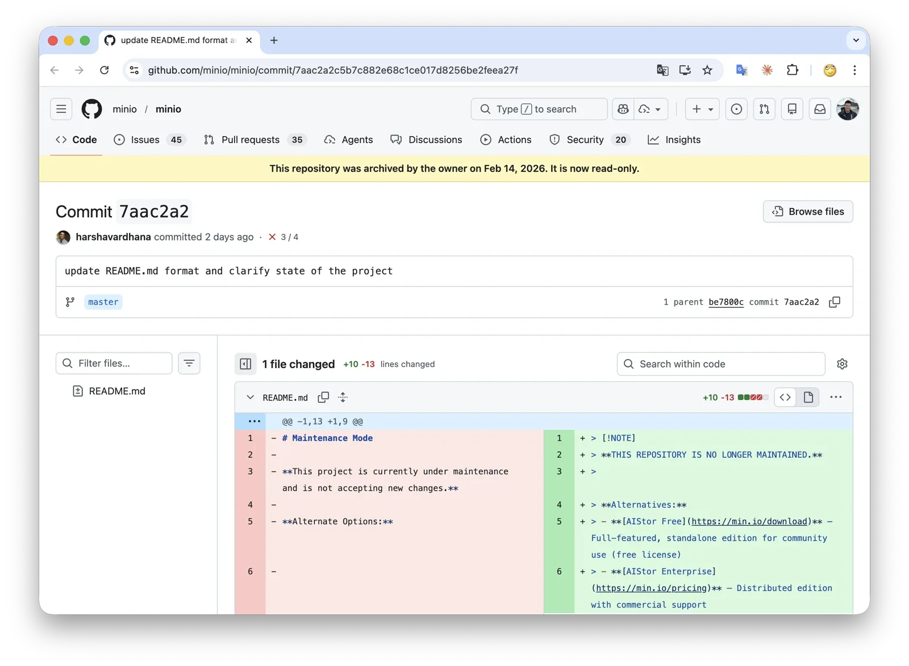
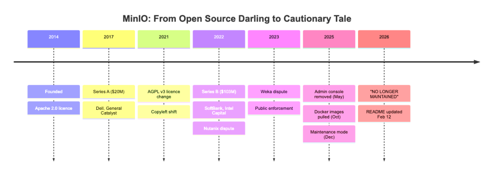
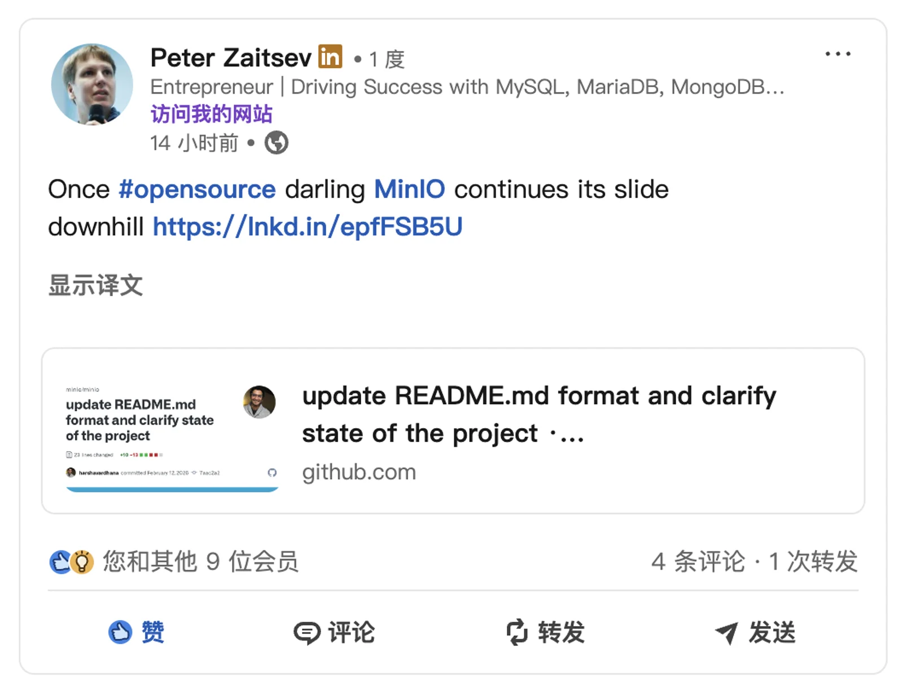
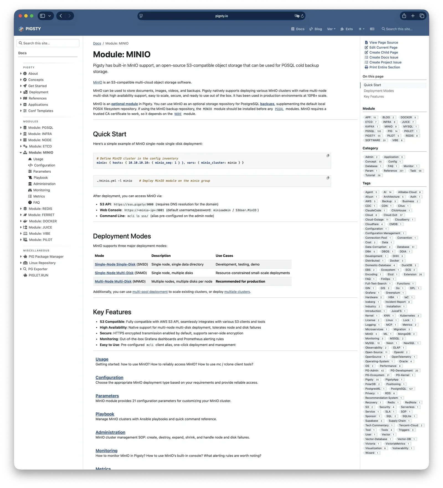
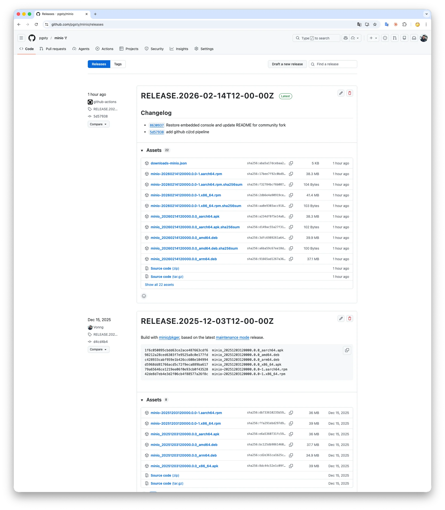
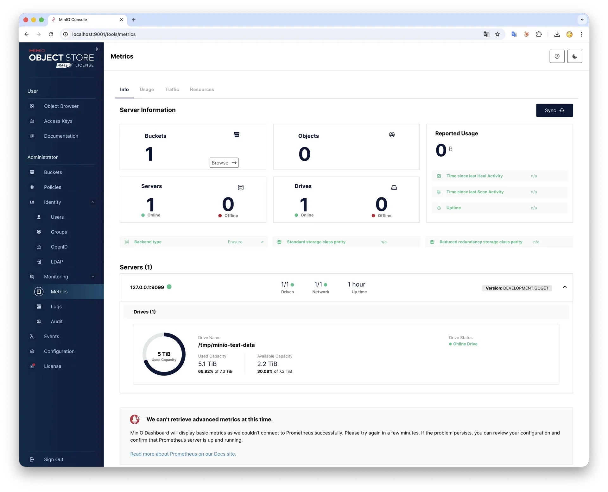
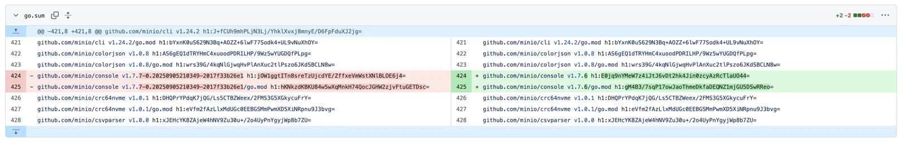
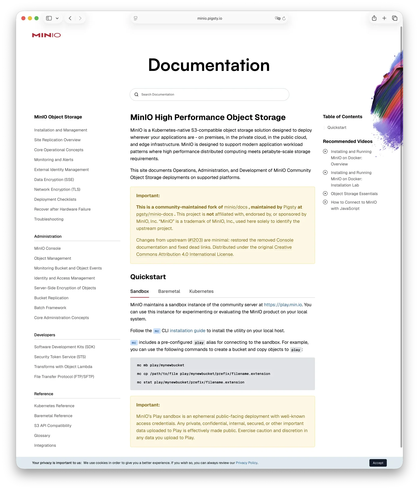

MinIO's open-source repo has been officially archived. No more maintenance. End of an era — but open source doesn't die that easily.

I forked MinIO, restored the admin console, rebuilt the binary distribution pipeline, and brought it back to life.

If you're running MinIO, swap `minio/minio` for `pgsty/minio`. Everything else stays the same.
(CVE fixed, and the console GUI is back!)

------

## The Death Certificate

On December 3, 2025, MinIO announced "maintenance mode" on GitHub. I wrote about it in [MinIO Is Dead](/db/minio-is-dead).

On February 12, 2026, MinIO updated the repo status from "maintenance mode" to **"no longer maintained"**, then officially archived the repository. 
Read-only. No PRs, no issues, no contributions accepted. A project with 60k stars and over a billion Docker pulls became a digital tombstone.



If December was the clinical death, this February commit was the death certificate.

Today (Feb 14), a widely circulated article titled [How MinIO went from open source darling to cautionary tale](https://news.reading.sh/2026/02/14/how-minio-went-from-open-source-darling-to-cautionary-tale/) laid out the full timeline. 



Percona founder Peter Zaitsev also raised concerns about open-source infrastructure sustainability on LinkedIn. 
The consensus in the international community is clear: **MinIO is done.**



Not "unmaintained" — **officially, irreversibly, done.**

Looking back at the timeline over the past 18 months, this wasn't a sudden death. It was a slow, deliberate wind-down:

| Date    | Event                               | Nature              |
|---------|-------------------------------------|---------------------|
| 2021-05 | Apache 2.0 → AGPL v3                | License change      |
| 2022-07 | Legal action against Nutanix        | License enforcement |
| 2023-03 | Legal action against Weka           | License enforcement |
| 2025-05 | Admin console removed from CE       | Feature restriction |
| 2025-10 | Binary/Docker distribution stopped  | Supply chain cut    |
| 2025-12 | Maintenance mode announced          | End-of-life signal  |
| 2026-02 | Repo archived, no longer maintained | End of project      |

A company that raised $126M at a billion-dollar valuation spent five years methodically dismantling the open-source ecosystem it built.


------

## But Open Source Endures

Normally this is where the story ends — a collective sigh, and everyone moves on.

But I want to tell a different story. **Not an obituary — a resurrection.**

MinIO Inc. can archive a repo, but they can't archive the rights that the [AGPL](https://github.com/minio/minio/blob/master/LICENSE) grants to the community.

Ironically, AGPL was MinIO's own choice. They switched from Apache 2.0 to AGPL to use it as leverage in their disputes with Nutanix and Weka 
— keeping the "open source" label while adding enforcement teeth. But open-source licenses cut both ways — the same license now guarantees the community's right to fork.

Once code is released under AGPL, the license is irrevocable. You can set a repo to read-only, but you can't claw back a granted license.

That's the beauty of open-source licensing by design: **a company can abandon a project, but it can't take the code with it.**

So — **MinIO is dead, but MinIO can live again.**

That said, forking is the easy part. Anyone can click the Fork button. 
The real question isn't "can we fork it" but **"can someone actually maintain it as a production component?"**


------

I didn't set out to take this on. But after MinIO entered maintenance mode, 
I waited a couple of weeks for someone in the community to step up. 
Nobody did. So I did it myself.

Some background: I maintain [Pigsty](https://pigsty.io) — a batteries-included PostgreSQL distribution with [451 extensions](https://pgext.cloud), 
cross-built for [14 Linux distros](https://pgext.cloud/os). I also maintain build pipelines for [270+](https://pgext.cloud/list/) PG extensions, several [PG forks](https://pigsty.io/docs/pgsql/kernel/), 
and dozens of Go projects ([VictoriaMetrics](https://pigsty.io/docs/repo/infra/list/), Prometheus, etc.) across all major platforms. Adding one more Go project to the pipeline was manageable.

I'm not new to MinIO either. Back in 2018, we ran an internal MinIO fork at Tantan (back when it was still Apache 2.0), managing ~25 PB of data — one of the earliest and largest MinIO deployments in China at the time.

More importantly, [MinIO is a real (optional) module in Pigsty](https://pigsty.cc/docs/minio). 
Many users run it as the default backup repository for PostgreSQL in production.



This wasn't optional — **it had to be done.** As early as December 2025 when MinIO announced maintenance mode, I'd already built CVE-patched binaries myself.

[](https://github.com/pgsty/minio/releases/tag/RELEASE.2025-12-03T12-00-00Z)

> [pgsty/minio RELEASE.2025-12-03T12-00-00Z](https://github.com/pgsty/minio/releases/tag/RELEASE.2025-12-03T12-00-00Z)


------

## What We've Done

As of today, three things.

### 1. Restored the Admin Console

This was the change that frustrated the community the most.

In May 2025, MinIO stripped the full admin console from the community edition, leaving behind a bare-bones object browser. 
User management, bucket policies, access control, lifecycle management — all gone overnight. Want them back? Pay for the enterprise edition. (near ~ 100,000 $)

**We brought it back.**



The ironic part: this didn't even require reverse engineering. You just revert the `minio/console` submodule to the previous version.
That's literally all MinIO did — they swapped a dependency version to replace the full console with a stripped-down one. The code was always there

[](https://github.com/pgsty/minio/commit/8630937e7d1c3426ae28508e06f7091d7bde3a49#diff-3295df7234525439d778f1b282d146a4f1ff6b415248aaac074e8042d9f42d63L424)

We put it back.


### 2. Rebuilt Binary Distribution

In October 2025, MinIO stopped distributing pre-built binaries and Docker images, leaving only source code. "Use `go install` to build it yourself" — that was their answer.

For the vast majority of users, the value of open-source software isn't just a copy of the source — **supply chain stability is what matters.** 
You need a stable artifact you can put in a Dockerfile, an Ansible playbook, or a CI/CD pipeline — not a requirement to install a Go compiler before every deployment.

**We rebuilt the distribution:**

**Docker Images**
: [`pgsty/minio`](https://hub.docker.com/r/pgsty/minio) is live on Docker Hub. `docker pull pgsty/minio` and you're good.

**RPM / DEB Packages**
: Built for major Linux distributions, matching the original package specs.

**CI/CD Pipeline**
: Fully automated build workflows on GitHub, ensuring ongoing supply chain stability.

If you're using Docker, just swap `minio/minio` for `pgsty/minio`.

For native Linux installs, grab RPM/DEB packages from the [GitHub Release](https://github.com/pgsty/minio/releases/tag/RELEASE.2026-02-14T12-00-00Z) page.
You can also use [pig](https://github.com/pgsty/pig) (the PG extension package manager) for easy installation, or configure the [**pigsty-infra**](https://pigsty.cc/docs/repo/infra) APT/DNF repo:

```bash
curl https://repo.pigsty.io/pig | bash; 
pig repo set; pig install minio
```

just work as usual.


### 3. Restored Community Edition Docs

MinIO's official documentation was also at risk — links had started redirecting to their commercial product, AIStor.

We forked `minio/docs`, fixed broken links, restored removed console documentation, and deployed it [here](https://silo.pigsty.io).

The docs use the same Creative Commons Attribution 4.0 license as the original, with all content preserved and ongoing maintenance.




------

## Our Commitments and Principles

Some things worth stating up front to set expectations.

### No New Features — Just Supply Chain Continuity

MinIO as an S3-compatible object store is already feature-complete. 
It's **finished software**. It doesn't need more bells and whistles — it needs a stable, reliable, continuously available build.

What we're doing: **making sure you can always get a working, complete MinIO binary with the admin console included and CVE fixed** RPM, DEB, Docker images — 
built automatically via CI/CD, drop-in compatible with your existing infra. No more worrying about `docker pull` returning nothing or `yum install` failing to find a package.

### This Is a build for Production, Not an Archive

You might think: "this is just another backup fork, right?" No. **MinIO is a production component in Pigsty**, and many users run it as their PostgreSQL backup repository. 
We run our own builds — if something breaks, we find out first and fix it first. We've been dogfooding these builds in production for three months now. Eating your own dog food is the best QA.

### We Fix Bugs and Track CVEs

If you run into issues, feel free to report them at [pgsty/minio](https://github.com/orgs/pgsty/discussions). 
 — but please don't treat this as a commercial SLA. We operate as an open-source community project, doing our best effort.

Given that AI coding tools have made bug fixing dramatically cheaper,
and that we're explicitly not adding any new features, I believe the maintenance workload is manageable.

### Trademark Is Tricky, But We'll Cross That Bridge When We Come to It

> Trademark Notice: MinIO® is a registered trademark of MinIO, Inc.
> This project (pgsty/minio) is an independently maintained community fork under the AGPL license.
> It has no affiliation with, endorsement by, or connection to MinIO, Inc.
> Use of "MinIO" in this post refers solely to the open-source software project itself and implies no commercial association.

AGPLv3 gives us clear rights to fork and distribute, but trademark law is a separate domain. We've marked this clearly everywhere as an independent community-maintained build. 

If MinIO Inc. raises trademark concerns, we'll cooperate and rename (probably something like `silo` or `stow`). 
Until then, we think descriptive use of the original name in an AGPL fork is reasonable — and renaming all the `minio` references doesn't serve users.


### AI Changed the Game

You might ask: can one person really maintain this?

It's 2026. Things are different now. [AI coding tools are changing the economics of open-source maintenance](/db/try-codex/).

With tools like Claude Code, the cost of locating and fixing bugs in a complex Go project has dropped by more than an order of magnitude. 
What used to require a dedicated team to maintain a complex infrastructure project can now be handled by one experienced engineer with an AI copilot.

Consider: Elon cut X/Twitter's engineering team down to ~30 people and the system still runs. 
Maintaining a MinIO fork is considerably less daunting — you mainly need the ability to test and validate.

------

## Just Fork It

MinIO Inc. can archive a GitHub repo, but they can't archive the demand behind 60k stars, or the dependency graph behind a billion Docker pulls. That demand doesn't disappear — it just finds a new home.

HashiCorp's Terraform got forked into OpenTofu, and it's doing fine. MinIO's situation is actually more favorable — 
AGPL is more permissive for forks than BSL, with no legal gray area for community forks. A company can abandon a project, but open-source licenses are specifically designed so the code can't die.

`git clone` is the most powerful spell in open source. When a company decides to shut the door, the community only needs two words:

**Fork it.**


-------

## Reference

- [**MinIO Is Dead**](/db/minio-is-dead)
- [**MinIO Is Dead, Who Picks Up the Pieces?**](/db/minio-alternative)
- [**From AGPL to Apache: Reflections on Pigsty's License Change**](/pg/pigsty-relicense/)
