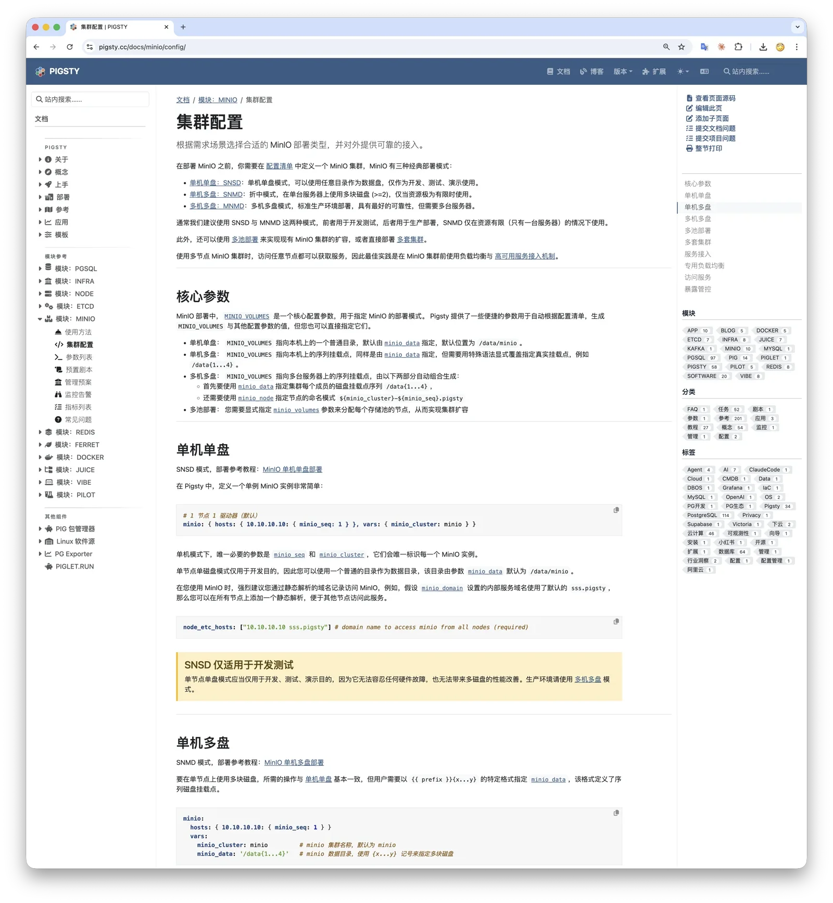

MinIO 开源仓库正式归档，不再维护。一个时代落幕，但开源的精神不死。
老冯 Fork 了 MinIO，复活了管理控制台，重建了二进制分发渠道，让 MinIO 浴火重生。

如果你正在用 MinIO，把 `minio/minio` 换成 `pgsty/minio` ，其他一切照旧。


------

## MinIO 的死亡证明

2025年12月3日，MinIO 在 GitHub 上宣布进入"维护模式"。我写了一篇《[MinIO 已死](/db/minio-is-dead)》。

2026年2月12日，MinIO 在 GitHub 首页将状态从"维护模式"更新为 **“不再维护”**，随后正式将仓库归档（Archived）。Read-only，不接受 PR Issue，不接受任何贡献。
一个拥有六万 star、超过十亿次 Docker 拉取的项目，变成了一座数字墓碑。


如果说12月是 **临床死亡**，那 2月的这个提交就是 **正式开具了死亡证明**。

今天（2月14日），一篇题为《[How MinIO went from open source darling to cautionary tale](https://news.reading.sh/2026/02/14/how-minio-went-from-open-source-darling-to-cautionary-tale/)》的长文引发了广泛传播，详细复盘了 MinIO 从开源宠儿到反面教材的完整堕落时间线。


Percona 创始人 Peter Zaitsev 也在 LinkedIn 上表达了对开源基础设施可持续性的忧虑。国际社区的共识已经形成：**MinIO 完了**。


不是 “不更新了” —— 是 **彻底的、不可逆的、官方盖棺定论的死了**。

回顾这18个月的时间线，你会发现这不是一次意外死亡，而是一场蓄意的、分阶段的自毁：


| 时间      | 事件                   | 性质     |
|---------|----------------------|--------|
| 2021-05 | Apache 2.0 → AGPL v3 | 许可证武器化 |
| 2022-07 | 公开攻击 Nutanix         | 许可证执法  |
| 2023-03 | 公开攻击 Weka            | 许可证执法  |
| 2025-05 | 阉割管理控制台              | 功能阉割   |
| 2025-10 | 停止分发二进制/Docker       | 断供     |
| 2025-12 | 宣布维护模式               | 临终关怀   |
| 2026-02 | 仓库归档，不再维护            | 死亡     |

一家融了1.26亿美元、估值十亿美金的公司，花了五年时间，亲手把自己建立的开源生态一砖一瓦地拆干净。

这比跑路还让人难受 —— 因为跑路至少是一次性的，MinIO 选择了凌迟。


------

## 但开源不死

故事到这里，按照正常剧本应该是一声叹息，然后大家各回各家。

但我想讲一个不一样的故事 —— **不是悼词，是复活**。

MinIO 公司可以归档一个仓库，但它归档不了 [AGPL](https://github.com/minio/minio/blob/master/LICENSE) 协议赋予社区的权利。

讽刺的是，AGPL 正是 MinIO 自己选的。他们当年从 Apache 2.0 换成 AGPL，是为了在保留开源名份的同时拿它当武器打 Nutanix 和 Weka。
但开源许可证 是双刃剑 —— 同一把刀，如今也 保障了社区 Fork 的完全合法性。
代码一旦以 AGPL 发布，许可就不可撤回。你可以把仓库设为只读，但你收不回已经发出的许可证。

这就是开源协议设计的深意：**公司可以抛弃项目，但不能带走代码。**

所以 —— **MinIO 已死，但 MinIO 也可以复生。**

但也先别急着热血沸腾。Fork 谁都会，点一下 Fork 按钮的事。
真正关键的问题不是 “能不能 Fork”，而是 有没有人真的能把它当成生产组件来维护。

------

我本来并不想接这个摊子 —— 但我在 MinIO 进入维护模式后等了一两周，社区里没有人站出来说 “我来”，我就只能自己上了。

简单介绍一下背景：我一个人维护着整个 Pigsty 项目 —— 一个全功能的 PostgreSQL 发行版，451 个扩展，支持 14 个 Linux 发行版的交叉构建。
我同时维护着 270+ PG 扩展、六七款 PG Fork、几十款 Go 软件（Victoria/Prometheus 等）的全平台构建工作流，还是游刃有余的。

我对 MinIO 也不陌生。2018年，我们在探探内部就维护过一个 MinIO 的内部分支（当时还是 Apache 2.0），
支撑了约 25 PB 数据，是当时国内最早、最大的 MinIO 部署之一。

更关键的是，[MinIO 在 Pigsty 中是 真实使用的组件](https://pigsty.cc/docs/minio)，
很多用户将它作为 PostgreSQL 的备份仓库默认跑在生产环境里。



这不是一个 “要不要做” 的问题，而是 **不做不行**。
早在2025年12月 MinIO 宣布维护模式时，我就已经自己动手创建了修复了 CVE 的二进制。

[](https://github.com/pgsty/minio/releases/tag/RELEASE.2025-12-03T12-00-00Z)

> [pgsty/minio RELEASE.2025-12-03T12-00-00Z](https://github.com/pgsty/minio/releases/tag/RELEASE.2025-12-03T12-00-00Z)


------

## 我们做了什么

截至今天，我们做了三件事。

### 1. 复活管理控制台

这是社区最愤怒的一刀。

2025年5月，MinIO 把完整的管理控制台（Admin Console）从社区版中移除，只留下了一个残废的对象浏览器。
用户管理、桶策略、权限配置、生命周期管理…… 一夜之间全没了。想要？掏钱买企业版。

**我们把它弄回来了。**


讽刺的是，这甚至不需要逆向工程。你只需要把 `minio/console` 子模块的版本号改回去就行了。
也就是说，MinIO 当初做的事情就是 改了一个依赖版本号，把完整控制台换成了残废版。功能都在那，代码都在那，他们只是给你关上了门。

[](https://github.com/pgsty/minio/commit/8630937e7d1c3426ae28508e06f7091d7bde3a49#diff-3295df7234525439d778f1b282d146a4f1ff6b415248aaac074e8042d9f42d63L424)

他们拆了门窗，我们给装回去了。


### 2. 重建二进制分发

2025年10月，MinIO 停止分发预编译的二进制文件和 Docker 镜像，只留源码。“请用 `go install` 自己编译” —— 这是他们给用户的交代。

对于绝大多数用户来说，开源软件的价值不只是一份源码副本 —— **供应链的稳定性才是命脉**。
你需要的是一个可以写进 Dockerfile、放进 Ansible Playbook、塞进 CI/CD Pipeline 的稳定制成品，而不是每次部署前先装个 Go 编译器。

**我们重建了完整的分发渠道：**

**Docker 镜像**
: [`pgsty/minio`](https://hub.docker.com/r/pgsty/minio) 已上线 Docker Hub，`docker pull pgsty/minio` 即可使用

**RPM / DEB 包**
: 为主流 Linux 发行版构建了与原版规格一致的安装包。

**CI/CD Pipeline**
: GitHub 上全自动化构建流程已经搭建完毕，确保供应链持续稳定。

如果你在用 Docker 镜像，把 `minio/minio` 简单换成 `pgsty/minio` 就好了

喜欢原生 Linux 安装的朋友，可以直接从 [GitHub Release](https://github.com/pgsty/minio/releases/tag/RELEASE.2026-02-14T12-00-00Z) 页面下载 RPM/DEB 包。
老冯的 pig （PG扩展包管理器）也可以简单的免翻墙安装。你也可以自己配置启用 [**pigsty-infra**](https://pigsty.cc/docs/repo/infra) APT/DNF 软件仓库来安装。

```bash
curl https://repo.pigsty.cc/pig | bash; 
pig repo set; pig install minio
```

一切照旧。


### 3. 复活社区版本文档

MinIO 的官方文档同样面临风险 —— 原本的链接已指向它们的商业产品 AIStor。

所以我们基于 `minio/docs` 进行了 Fork，修复了失效链接，恢复了被删除的控制台文档，部署在：[https://silo.pigsty.io](https://silo.pigsty.io)

文档采用与原版相同的 Creative Commons Attribution 4.0 协议，完整保留了所有内容，并持续进行必要的维护更新。


------

## 我们的承诺与原则

一些话需要提前说清楚，免得产生误解。

### 我们不做新特性，只保障供应链

MinIO 作为一个 S3 兼容的对象存储，功能已经足够完善。
它是一个**已经完成的软件**，它不需要更多花里胡哨的新特性，它需要的是一个稳定可靠、持续可用的版本。

我们做的核心事情就是：**确保你随时可以拿到一个能用的、完整的、带管理界面的 MinIO 二进制制成品**。
RPM、DEB、Docker 镜像 —— CI/CD Pipeline 自动构建，与你现有的基础设施无缝对接。
不用担心某天 `docker pull` 拉不到镜像，不用担心 `yum install` 找不到包。

> 前提是 MinIO 别用商标武器来搞我，搞我那我就只能重命名了。

### 这是真实使用的版本，不是归档备份

可能有人会想：这只是又一个 Fork 备份而已吧？不是。
**MinIO 在 Pigsty 中是真实使用的组件**，很多用户将它作为备份仓库跑在生产环境里。
我们使用的就是自己构建的版本 —— 如果出了问题，我们会第一时间发现，第一时间修复。
我们自己构建的版本，已经在自己的生产环境中用了三个月。吃自己的狗粮，是最好的质量保证。

### 我们会修 Bug 并跟进安全更新

如果你在使用中遇到问题，欢迎在 [pgsty/minio](https://github.com/orgs/pgsty/discussions) 提交反馈。
如果是我们构建的版本中可复现的问题，以及安全漏洞（CVE），我们都会积极跟进和修补
—— 但请不要将此视作商业 SLA 承诺 —— 我们尽最大努力，以开源社区的方式运作。

在 AI 编码能力突飞猛进，以及决定不做新特性的前提下，我认为只是修复 BUG/漏洞的工作量是完全可控且可以接受的。


### 商标问题很难搞，但走一步算一步

> 商标声明：MinIO® 是 MinIO, Inc. 的注册商标。
> 本项目（pgsty/minio）为社区独立维护的 AGPL 开源 Fork，
> 与 MinIO, Inc. 无任何关联、从属或背书关系。
> 本文中对 "MinIO" 的使用仅用于指代该开源软件项目本身，不暗示任何商业关联。

AGPLv3 虽然允许我们合法 Fork 和分发，但商标法是另一个领域。
虽然我们已经在所有地方明确标注了这是一个独立的社区维护版本，
但 MinIO 公司可能会以商标侵权为由对我们提出异议，要求我们停止使用 “MinIO” 这个名字。

如果 MinIO 方面对商标使用提出异议，我们会配合更名。（大概会叫 `silo`, `stow` 之类的）
但在此之前，我们认为在 AGPL Fork 中描述性使用原项目名称是合理的，
毕竟我们也不想把所有的 `minio` 给重命名了 —— 这对用户没有任何帮助。


### AI 改变了游戏规则

可能有人会问：一个人能维护得了吗？

2026 年了，情况和五年前不一样。[AI 编码工具正在改变开源维护的经济学](/db/try-codex/)。

一个复杂 Go 项目的 bug 定位和修复，在 Claude Code 的辅助下，成本已经降低了不止一个数量级。
以前维护一个复杂基础设施项目需要一个专业团队，现在一个自带 AI 助理的老司机就够了。

你想，马斯克砍到 30 人的工程团队就能维护 X/推特 这种级别的系统。
维护个 MinIO 真没什么大不了的 —— 你只需要有测试验收能力就够了。

**老冯行，老冯自己就上了。**


------

## Just Fork it!

MinIO 公司可以归档一个 GitHub 仓库，但它归档不了六万颗 Star 背后的需求，
归档不了十亿次 Docker Pull 背后的依赖。这些需求不会消失，它们只会寻找新的出口。

HashiCorp 的 Terraform 被 Fork 成了 OpenTofu，活得好好的。
MinIO 的情况其实更有利 —— AGPL 比 BSL 更友好，社区 Fork 没有任何法律风险。
公司可以抛弃项目，但开源协议的设计就不允许代码死掉。

`git clone` 是开源世界最强大的魔法。当一个公司决定关门的时候，社区只需要两个字：

**Fork it.**


-------

## 参考阅读

- [**MinIO 已死**](/db/minio-is-dead)
- [**MinIO 已死，谁来接盘**](/db/minio-alternative)
- [**从AGPL到Apache：Pigsty 协议变更的思考**](/pg/pigsty-relicense/)。

