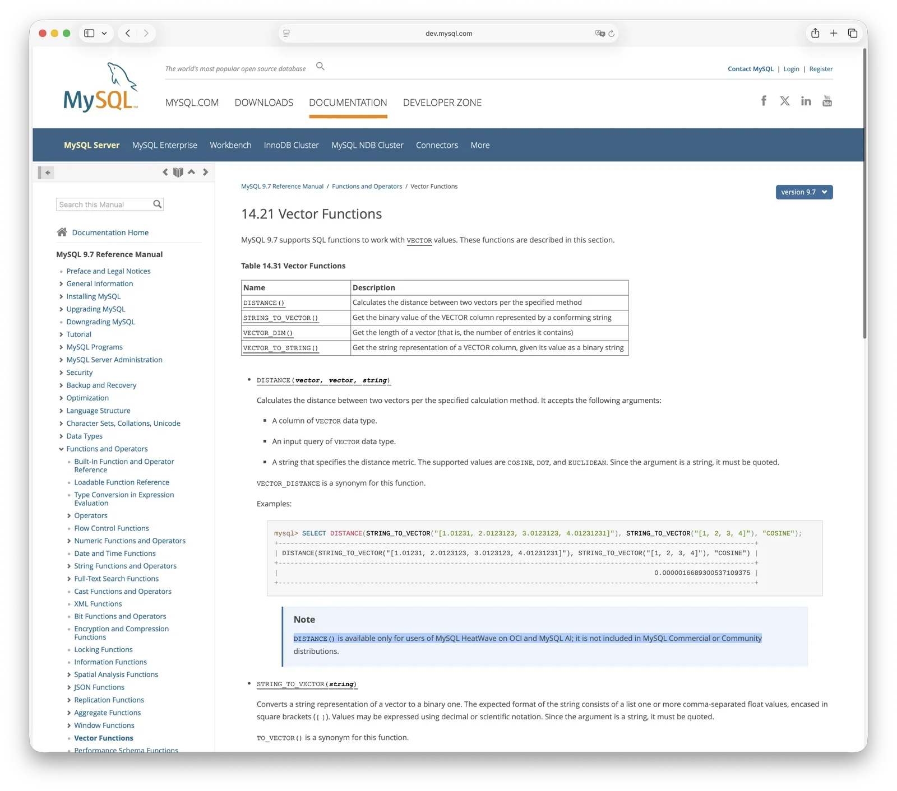

Two years ago, I wrote [**MySQL Is Dead, Long Live PostgreSQL**](/db/mysql-is-dead/). MySQL 9.0 had just shipped, and Oracle had unveiled a `VECTOR` data type with great fanfare, billing it as "MySQL for the AI era." One look was enough: **it was a `BLOB` in a cheap disguise**. No distance functions, no vector indexes—nothing beyond storing a bunch of floating-point numbers in a column.

Over the next two years, MySQL went from 9.0 to 9.6: seven quarterly Innovation Releases. Percona looked at all seven and shipped none of them. PMM telemetry showed adoption of Innovation Releases hovering around 1%, barely registering in the statistics. The world's largest third-party MySQL vendor voted with its silence.

Why talk about 9.7 now? Because it is the **first LTS release in the MySQL 9.x line**, with five years of Premier Support plus three years of Extended Support. The previous seven Innovation Releases were disposable quarterly waypoints. Percona ignored them, users stayed away, and everyone waited for this LTS. MySQL 8.0 is also due to reach EOL in April 2026. Existing users have to migrate, and 9.7 is practically the only way forward.

Some tech outlets are already beside themselves: "MySQL 9.7 Released! A Leap in Performance!" "MySQL Enters the AI Era!" Never mind that, as of April 2026, it has not even reached GA. Oracle merely published an Early Access test binary at the end of March. I pulled it down and tried it.

**It was the same old leftovers, reheated.**

------

## Vector Support Is Still All Show

In Chapter 14.21, "Vector Functions," of the MySQL 9.6 Reference Manual, the description of `DISTANCE()` says in black and white:

> *"DISTANCE() is available only for users of MySQL HeatWave on OCI and MySQL AI; it is not included in MySQL Commercial or Community distributions."*

The function that computes the distance between two vectors is absent from Community Edition and Commercial Edition alike. It exists only in Oracle's own HeatWave cloud. That sentence remained unchanged from 9.0 through 9.6, across all seven releases. **What about 9.7? I tested it: `SELECT DISTANCE(...)` still returns `FUNCTION test.DISTANCE does not exist`. Exactly the same as 9.6. Not a thing has changed.**

So what can MySQL Community Edition actually do with vectors? It can store values of type `VECTOR`, and `STRING_TO_VECTOR()` can parse strings into them. That is where the feature ends. There is no distance function, no HNSW index, no IVF index, and no way to perform nearest-neighbor search with `ORDER BY distance LIMIT N`. A vector column cannot be a primary key, foreign key, or unique key, and aggregate functions do not support it.

**It is like selling you a car with a body, seats, and a steering wheel—but no engine and no wheels. You can sit in it and rock back and forth, but you are not going anywhere.**

How did MySQL sink this low? Even its own ecosystem has had enough. MariaDB 11.7 added a native `VECTOR INDEX` with HNSW late last year. TiDB shipped vector indexes in beta. PlanetScale built its own implementation around SPANN. Google Cloud SQL for MySQL added vector indexes with ScaNN. VillageSQL forked MySQL 8.4 specifically to add vectors. Even individual developers have written third-party vector plugins. Oracle will not build it, and anyone else who wants it has to fork MySQL.

What was HeatWave's slogan again? "The only MySQL with vector." In plain English: **want vector search? Move to OCI and buy our cloud.**

------

## The Optimizer, Years Late

MySQL 9.7 does contain one substantive update: the Hypergraph Optimizer is now available in Community Edition (WL #17265).

MySQL's traditional optimizer can enumerate only left-deep `JOIN` trees. As the number of tables grows, it relies on greedy heuristic pruning and can easily choose a lousy plan. The new Hypergraph Optimizer is based on the DPhyp algorithm, supports bushy trees, and uses dynamic programming for `JOIN` ordering. In theory, it can find better execution plans.

Sounds good. Except this optimizer has existed since 2021 and spent five years locked inside Enterprise Edition and HeatWave. Now that it has finally reached the community, **it is still disabled by default**. You must explicitly run `SET optimizer_switch='hypergraph_optimizer=on'`. Once enabled, it supports no hints except `STRAIGHT_JOIN`, and it does not support the TRADITIONAL or JSON formats of `EXPLAIN`. **What happens when the optimizer goes off the rails? You have no way to steer it. You are flying blind in production.**

PostgreSQL's standard planner has long supported dynamic-programming `JOIN` enumeration and bushy plans. When the number of tables gets large, it automatically switches to the GEQO genetic algorithm. After more than two decades of production use, it is rock-solid. Congratulations to MySQL: in 2026, Community Edition users finally get access to this feature—and it is still switched off by default.

------

## The Rest, Item by Item

**Foreign keys finally moved up a layer.** MySQL had always implemented foreign keys inside the InnoDB storage engine. Foreign-key cascades could not be recorded correctly in the binlog, so primary-replica consistency was not guaranteed when they were involved. This defect survived for more than twenty years. MySQL 9.6 finally moved foreign-key handling into the SQL layer and fixed it (WL #11249). Alibaba's coding standards once said, "Do not use foreign keys." Perhaps the real reason was simply that foreign keys in MySQL had always been a joke.

**DML for JSON Duality Views is now in Community Edition** (WL #17246). The feature arrived in 9.4, but inserts, updates, and deletes previously required Enterprise Edition. Build the feature with one hand, put it behind a paywall with the other: a classic Oracle move, and hard not to laugh at. PostgreSQL had comparable functionality more than a decade ago.

**PBKDF2 authentication improvements** (WL #17160). PostgreSQL made SCRAM-SHA-256 its default authentication in 2017; MySQL is nine years late. **Five Enterprise components moved to Community Edition**—operational features such as replication monitoring and flow-control statistics that should never have been paywalled in the first place. **Date-function behavior fixes** (WL #16895)—it is 2026, and MySQL is still fixing corner cases in `TIMEDIFF` and `DAYNAME`. **The Clone Plugin can now clone across LTS releases**—with MySQL 8.0 approaching EOL, upgrades require a three-version hop: 8.0 → 8.4 → 9.7. You cannot skip a level. **OpenSSL upgraded to 3.5.0 and zlib to 1.3.2**—even dependency upgrades made the release notes.

**That is the LTS report card produced by three years and seven Innovation Releases.**

------

## Now Look at PostgreSQL

That is enough about MySQL 9.7. Turn around and look at PostgreSQL, which is charging ahead.

Last year's PostgreSQL 18 release was packed to bursting. PostgreSQL 19 has already reached feature freeze this year, with yet another dizzying list of improvements. But the extension ecosystem is even more interesting than the core. Take vectors again. MySQL has kept `DISTANCE()` locked inside HeatWave for three years without budging. PostgreSQL?

Start with **pgvector**, the de facto standard: HNSW and IVFFlat, six distance metrics, multiple vector types, and AVX-512 acceleration. PostgreSQL now even has extensions of extensions. **pgvectorscale** adds streaming optimizations to DiskANN. **VectorChord** (`vchord`) uses RaBitQ quantization and compression to drive costs through the floor. For the same vector-search problem, the PostgreSQL ecosystem is competing at a ferocious pace, pushing accuracy, performance, cost, and scale to their limits. MySQL? Oracle is still guarding `DISTANCE()` like the crown jewels.

How many extensions like these exist in the PostgreSQL ecosystem? I have cataloged more than 500 ready-to-use extensions in Pigsty and [PGEXT.CLOUD](https://pgext.cloud): PostGIS for geospatial workloads, TimescaleDB for time series, Citus for distributed databases, pg_duckdb for analytics, pg_search for full-text search, and on and on.

This is the underlying reason PostgreSQL has ridden three successive waves: extreme extensibility. In the traditional software era, PostGIS won the enterprise GIS market. In the mobile internet era, JSONB helped PostgreSQL overtake MySQL. In the AI era, pgvector wiped out an entire category of dedicated vector databases. PostgreSQL caught all three waves; MySQL missed all three. Once is chance. Twice is coincidence. Three times is a pattern.

The numbers on Docker Hub already tell the story: **PostgreSQL's official image gets exactly four times as many weekly downloads as MySQL's**. Developers are voting with their feet.

------

## How Did MySQL End Up Here?

MySQL was once the hottest thing in databases, the darling of the internet era. How did it fall this far?

Beyond the architectural gap, I think the biggest problem is this: **MySQL is not truly open source.**

Yes, the code is public under the GPL. But "open source" has two layers: public code is one; **community** is the more important one. PostgreSQL's core developers come from dozens of companies and include independent contributors. No single company can dictate the project's direction. Your investment in this ecosystem cannot be revoked by an "owner" with a press release.

MySQL is different. Oracle sets the direction. What reaches Community Edition, what stays locked in Enterprise Edition, and what works only on HeatWave—Oracle decides all of it.

Last year's "GitHub freeze" made the problem obvious. In the second half of 2025, commit volume in the `mysql/mysql-server` repository fell off a cliff, hovering near zero for months. MySQL development had not stopped. Oracle had moved it behind closed doors, leaving everyone else to stare at a black box. Want to participate? Sorry: pull requests disappear without a trace, and the public bug tracker is not even the one Oracle actually uses internally.

Meanwhile, reports in September 2025 said Oracle had made sweeping cuts to the MySQL engineering team. Percona founder Peter Zaitsev estimated that 60–70% of the engineers had left. More than 500 developers jointly urged Oracle to consider creating a vendor-neutral MySQL foundation. Oracle refused. It later said there was new engineering leadership and that 2026 would bring a fresh start. MySQL 9.7 is presumably the first report card from that "fresh start." Now we have seen it. That's it?

**Free-riding breeds hoarding, and hoarding breeds more free-riding.** Percona's CEO explained this vicious cycle clearly in [**Oracle Finally Killed MySQL**](/db/oracle-kill-mysql/). AWS built Aurora, Alibaba built PolarDB-MySQL/X, and Tencent built TDSQL-M. They all compete using the MySQL kernel, but none gives anything back upstream. Oracle responds to free-riding by locking away the good parts. Once those parts are locked away, the community has even less reason to contribute. MariaDB forked early. Percona skipped every Innovation Release. VillageSQL forked MySQL to add vectors. China's TiDB and OceanBase merely speak the protocol while taking their own slice of the MySQL market.

An ecosystem that could have flourished has had its energy drained and its possibilities locked away by its owner.

PostgreSQL is the mirror image. No owner, only a community. Nothing hoarded, everything open. No company can decide PostgreSQL's fate, so every company is willing to bet on it. More than a thousand extensions, a thriving ecosystem, and perfect positioning for three consecutive technology waves—none of this came from the foresight of a genius architect. It is the natural result of open governance and extreme extensibility.

------

## Farewell, MySQL

MySQL was born in 1995. During the golden age of LAMP, it was practically synonymous with "database." For every teenager learning PHP, every webmaster setting up WordPress, and every Ruby on Rails geek, MySQL was the default first database. It was simple, fast, and everywhere. That was an era when a good tool did not need to be complicated, and MySQL happened to be the simplest option.

But the times changed. Data types changed. Workloads changed. Developer expectations changed. GIS arrived, and MySQL could not handle it. JSON arrived, and MySQL was half a beat late. Vectors arrived, and MySQL simply locked even the functions inside its cloud. MySQL did not get worse. **The world began demanding more from a database, while Oracle sealed off MySQL's ability to evolve, one piece at a time.**

Nothing stays on top forever. Every party ends.

In February 2026, just after FOSDEM and the MySQL Community Summit, Percona co-founder Vadim Tkachenko led an open letter to Oracle. It was signed by 248 database engineers and architects from companies including Percona, MariaDB, PlanetScale, DigitalOcean, and Pinterest. In an interview, Tkachenko said:

> **"We see MySQL kind of becoming a legacy technology, and we think if we don't take some steps, it risks becoming irrelevant."**

In plain terms: MySQL is turning into a legacy technology, and without action it could slide into irrelevance.

**Legacy technology.** The phrase carries obvious weight when it comes from a co-founder of the largest independent vendor in the MySQL ecosystem. When MySQL's most loyal stewards start calling it "legacy technology," the MySQL era really is over. This is not a curse; it is a requiem. Like Delphi among programming languages, or Solaris among operating systems, technologies that once shone but failed to make the turn when the world changed are quietly left behind.

**One generation grows old; another is always coming of age.**
