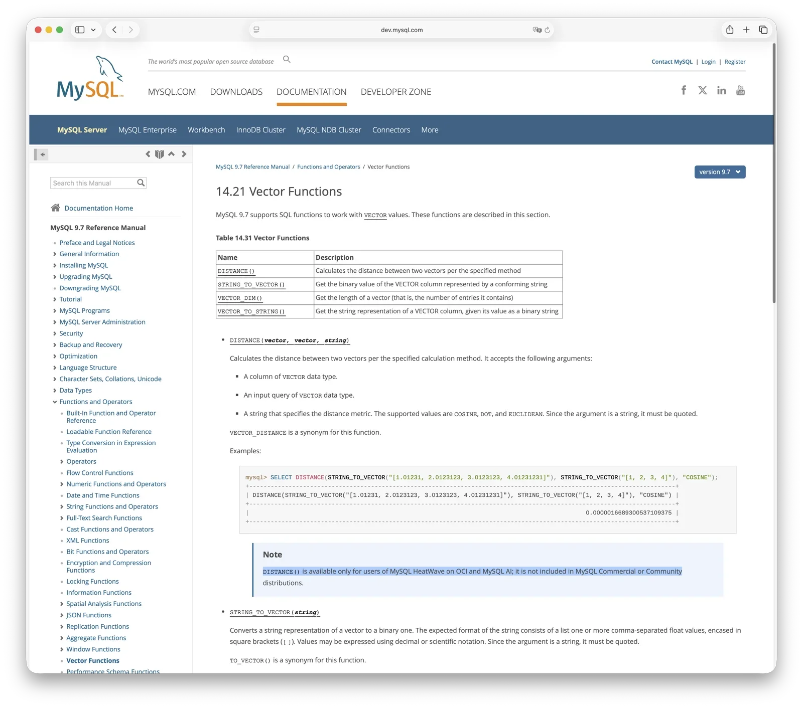

两年前我写了一篇 [《MySQL 安魂九霄，PostgreSQL 驶向云外》](/db/mysql-is-dead/)，那时候 MySQL 9.0 刚发布，Oracle 敲锣打鼓搞了个 `VECTOR` 数据类型出来，吹成“AI 时代的 MySQL”。我当时一看：**这玩意就是一个 `BLOB` 换皮**。没有距离函数，没有向量索引，除了能往列里存一堆浮点数之外，什么也干不了。

之后的两年，9.0 到 9.6，七个 Innovation Release，每季度一个。Percona 看了一眼这七个版本，一个都没跟。PMM 遥测数据显示 Innovation Release 采用率常年在 1% 附近徘徊，挤不进统计。全球最大的 MySQL 第三方生态公司，用沉默投了票。

为什么突然要聊 9.7？因为 9.7 是 MySQL 9.x 系列的**第一个 LTS 版本**：长期支持版，5 年 Premier + 3 年 Extended。之前的七个 Innovation Release 都是季抛型的过渡品，Percona 不跟，用户不碰，大家都在等这个 LTS 落地。而且 MySQL 8.0 马上就要在 2026 年 4 月 EOL 了，存量用户必须迁移，9.7 几乎是唯一的前进方向。

一些公众号主理人已经开始震惊起来了——“MySQL 9.7 发布！性能飞跃！”“让 MySQL 进入 AI 时代！”——虽然这玩意到现在（2026 年 4 月）连 GA 都还没出，只是 3 月底放了个 Early Access 的测试二进制。我反正拉下来试了试——

**锅里还是那碗冷饭。**

------

## 花架子依旧的向量能力

9.6 参考手册第 14.21 章 Vector Functions，`DISTANCE()` 函数描述下方白纸黑字：

> *"DISTANCE() is available only for users of MySQL HeatWave on OCI and MySQL AI; it is not included in MySQL Commercial or Community distributions."*

算两个向量距离的函数，社区版没有，商业版也没有，只有 Oracle 自家云 HeatWave 才能用。这行字从 9.0 到 9.6，七个版本，一字未改。**9.7 呢？我实测了一下——`SELECT DISTANCE(...)` 依然报 `FUNCTION test.DISTANCE does not exist`。和 9.6 一模一样，纹丝未动。**

MySQL 社区版在向量上到底能做什么？`VECTOR` 类型能存，`STRING_TO_VECTOR()` 能转——然后就没了。没有距离函数，没有 HNSW 索引，没有 IVF 索引，`ORDER BY distance LIMIT N` 近邻搜索做不到。向量列不能做主键、外键、唯一键，不支持聚合函数。

**这就好比卖你一辆车，有车壳，有座椅，有方向盘，没发动机，没轮子。你坐上去可以摇一摇，但你哪儿也去不了。**

MySQL 何至于此？连自家生态都看不下去了。MariaDB 11.7 去年底就上了原生 `VECTOR INDEX` + HNSW；TiDB 做了向量索引 Beta；PlanetScale 用 SPANN 算法自己造了一套；Google Cloud SQL for MySQL 用 ScaNN 搞了向量索引；VillageSQL 直接 fork 了 MySQL 8.4 专门做向量；连个人开发者都写了第三方向量插件。Oracle 自己不做，别人想做还得 fork 出去。

HeatWave 宣传语怎么说来着？“The only MySQL with vector”。翻译过来：**想玩向量？请上 OCI 买我们的云。**

------

## 迟到多年的优化器

9.7 倒是有一条实质性更新：Hypergraph Optimizer 下放社区版了（WL #17265）。

MySQL 传统优化器只能做左深树 `JOIN` 枚举，表一多就靠贪心启发式剪枝，容易选烂计划。新的 Hypergraph 优化器基于 DPhyp 算法支持 bushy tree，用动态规划做 `JOIN` 排序，理论上能找到更优的执行计划。

听起来不错。但——这东西 2021 年就有了，在 Enterprise 和 HeatWave 里捂了五年才放出来；放出来**默认还是关的**，得手动 `SET optimizer_switch='hypergraph_optimizer=on'`；开了之后不支持除 `STRAIGHT_JOIN` 之外的任何 hint，也不支持 TRADITIONAL 和 JSON 格式的 `EXPLAIN`。**优化器抽风了怎么办？没有手段干预，生产环境裸奔。**

PostgreSQL 的标准规划器很早就支持动态规划 `JOIN` 枚举 + bushy plan，表多了自动切 GEQO 遗传算法，二十多年生产锤炼下来稳如老狗。恭喜 MySQL，2026 年终于让社区用户摸到了这扇门——还默认关着。

------

## 其他更新逐条看

**外键终于搬家了。** MySQL 的外键一直在 InnoDB 引擎内部实现，级联操作不能正确记录 binlog，主从复制在外键级联场景下数据一致性不保证。这个缺陷存在了二十多年，9.6 才把外键上移到 SQL 层修掉（WL #11249）。当年阿里开发规约写“不得使用外键”，也许说到底就是因为 MySQL 的外键本来就是个笑话。

**JSON Duality Views DML 下放社区版**（WL #17246）。这功能 9.4 才有，之前增删改要买 Enterprise——左手做功能，右手收门票，Oracle 的传统才艺，颇为喜感。类似的功能 PG 十几年前就有了。

**PBKDF2 认证增强**（WL #17160）。PostgreSQL 2017 年就用 SCRAM-SHA-256 做默认认证了，晚了九年。**五个 Enterprise 组件下放社区**——复制监控、流控统计之类的运维组件，本来就不该锁在付费版里。**日期函数行为修正**（WL #16895）——2026 年了还在修 `TIMEDIFF`、`DAYNAME` 的 corner case。**Clone Plugin 跨 LTS 克隆**——8.0 EOL 在即，升级得 8.0 → 8.4 → 9.7 三级跳，不能跳级。**OpenSSL 升到 3.5.0，zlib 升到 1.3.2**——依赖库升级也写进 Release Note。

**这就是三年七个 Innovation Release 攒出来的 LTS 答卷。**

------

## 换个方向看看 PG

说完了 MySQL 9.7，换个方向看看正在高歌猛进的 PostgreSQL。

去年的 PG 18 几乎把牙膏管挤爆了，今年 PG 19 已经 feature freeze，新功能改进更是让人目不暇接。但比内核更精彩的是扩展生态。还是拿向量来说——MySQL 那边连 `DISTANCE()` 都锁在 HeatWave 里三年纹丝不动。PG 这边呢？

不仅有 **pgvector** 这个事实标准：HNSW + IVFFlat、六种距离度量、多种向量类型、AVX-512 硬件加速；甚至连扩展的扩展都出现了——**pgvectorscale** 基于 DiskANN 做流式优化，有 **VectorChord**（vchord）用 RaBitQ 量化压缩把成本打到地板。同一个向量搜索，PG 生态卷到飞起，在精度、性能、成本、规模各个维度把这件事做到了极致。MySQL 那边？Oracle 还在捂着 `DISTANCE()` 当宝贝。

而像这样的扩展，PG 生态里有多少？光我自己在 Pigsty 和 [PGEXT.CLOUD](https://pgext.cloud) 上收录的能直接用的扩展就超过 500 个：PostGIS 做地理空间、TimescaleDB 做时序、Citus 做分布式、pg_duckdb 做分析、pg_search 做全文检索，……

这正是 PG 连续吃到三代浪潮红利的底层密码：极致的可扩展性。在传统软件时代，PostGIS 吃下了企业 GIS 时代，JSONB 在移动互联网完成对 MySQL 的反超，pgvector 在 AI 时代干翻一条专用向量数据库赛道。三轮浪潮，PG 轮轮接住，MySQL 轮轮错过。一次是偶然，两次是巧合，三次就是必然了。

Docker Hub 上的数据已经很说明问题：**PostgreSQL 的官方镜像周下载量是 MySQL 的整整四倍**。开发者在用脚投票。

------

## MySQL 为什么会变成这样？

反观 MySQL，当年的当红炸子鸡、互联网时代的宠儿，怎么就沦落至此？

除了架构先进性的差距，我认为最大的问题在于：**MySQL 并不是真正意义上的开源。**

代码是 GPL 公开的没错。但“开源”这个词有两层含义：代码公开是一层，**社区**才是最重要的那一层。PG 的核心开发者来自几十家公司和独立贡献者，没有任何一家能一家独大。你在这个生态里的投入不会被某个“主人”一纸公告收回。

MySQL 呢？方向 Oracle 说了算。什么放社区版，什么锁 Enterprise，什么只在 HeatWave 上用——都是 Oracle 的决定。

去年的“GitHub 停更”事件就很说明问题。2025 年下半年，`mysql/mysql-server` 仓库的 commit 数断崖式下跌，连续几个月近乎“归零”。不是 MySQL 不开发了——是 Oracle 在搞封闭开发，外面只能看到一个黑盒子。你想参与？对不起，Pull Request 提了也石沉大海，公开的 Bug Tracker 都不是内部真正使用的那个。

与此同时，2025 年 9 月有报道称 Oracle 大规模裁撤 MySQL 工程团队，Percona 创始人 Peter Zaitsev 估计六七成的工程人员已经离开。500 多名开发者联名呼吁 Oracle 考虑建立一个厂商中立的 MySQL 基金会——Oracle 拒绝了。后来 Oracle 说“我们有新的工程领导层，2026 年会有新气象”。9.7 大概就是这个“新气象”的第一份答卷。大家也看到了——就这？

**白嫖导致敝帚自珍，敝帚自珍加剧白嫖**——这个死循环在 Percona CEO 写的[《Oracle 最终还是杀死了 MySQL》](/db/oracle-kill-mysql/)里写得很清楚了。AWS 做了 Aurora，阿里做了 PolarDB-MySQL/X，腾讯做了 TDSQL-M，大家用 MySQL 内核竞争但没人回馈上游。Oracle 被白嫖就把好东西锁起来。锁起来，社区更不愿贡献。MariaDB 早早 fork 走了，Percona 跳过所有 Innovation Release，VillageSQL fork 做向量，国内的 TiDB / OceanBase 也都只是协议兼容，来分 MySQL 的蛋糕。

一个本可以百花齐放的生态，被它的主人抽干了活力，锁住了可能性。

PostgreSQL 的故事恰好是反面。没有主人，只有社区。没有锁定，只有开放。没有一家公司能决定 PG 的命运，所以每一家公司都愿意在上面押注。上千个扩展、百花齐放的生态、连续三轮浪潮的准确卡位——这不是某个天才架构师的远见，而是**开放治理和极致可扩展性自然演化出来的结果**。

------

## 再见，MySQL

MySQL 诞生于 1995 年，在 LAMP 的黄金时代里几乎是“数据库”的代名词。那些年，每一个学 PHP 的少年、每一个搭 WordPress 的站长、每一个写 Ruby on Rails 的极客，默认的第一个数据库就是 MySQL。它简单、快速、到处都有——那是一个好东西不需要复杂的时代，MySQL 恰好是最简单的那一个。

但时代变了。数据类型变了，工作负载变了，开发者的预期变了。GIS 来了，MySQL 接不住；JSON 来了，MySQL 慢半拍；向量来了，MySQL 干脆连函数都锁在云里。不是 MySQL 变差了——**是世界对数据库的要求变高了，而 Oracle 把 MySQL 进化的可能性一点一点封死了。**

三十年河东，三十年河西。天下没有不散的宴席。

2026 年 2 月，FOSDEM 和 MySQL Community Summit 刚结束，Percona 联合创始人 Vadim Tkachenko 牵头发表了一封致 Oracle 的公开信。248 位来自 Percona、MariaDB、PlanetScale、DigitalOcean、Pinterest 等公司的数据库工程师和架构师联名签署。Tkachenko 在接受采访时说了一句话：

> **"We see MySQL kind of becoming a legacy technology, and we think if we don't take some steps, it risks becoming irrelevant."**

——我们眼看着 MySQL 正在变成一种遗留技术，如果不采取行动，它有变得无关紧要的风险。

Legacy technology。遗留技术。这个词从 MySQL 最大的第三方生态公司创始人嘴里说出来，分量不言自明。当 MySQL 最忠实的守护者们开始用“legacy technology”来称呼它的时候，属于 MySQL 的时代就真的过去了。这不是诅咒，这是安魂。就像 Delphi 之于编程语言，就像 Solaris 之于操作系统——曾经辉煌过的技术，在时代转弯的时候没有跟上，就会被无声地留在身后。

**一代人终将老去，但总有人正年轻。**
