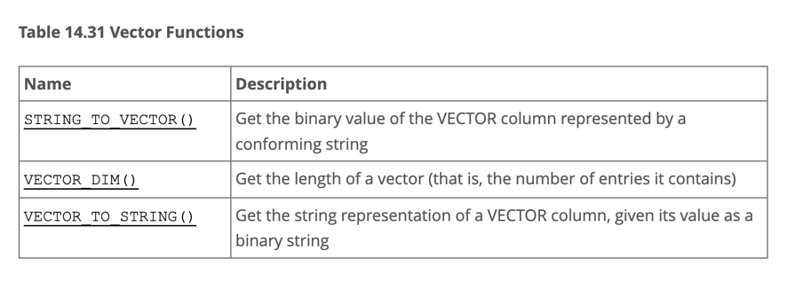
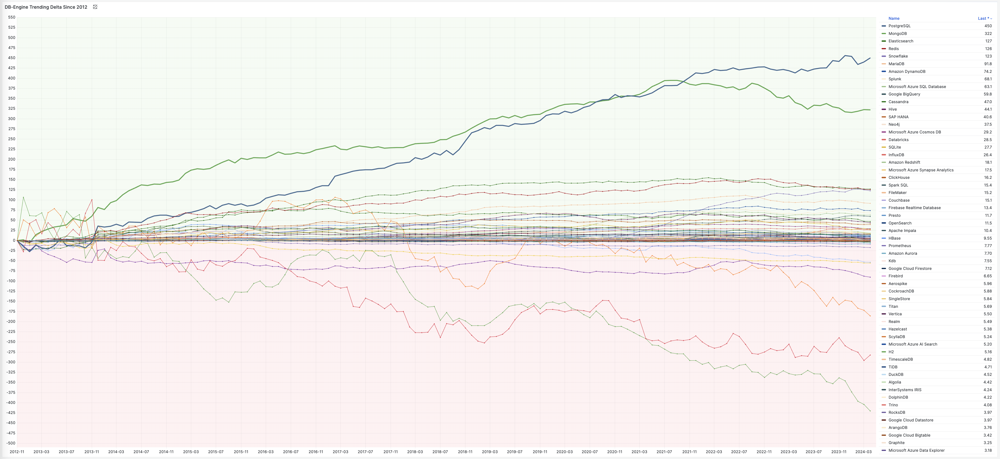
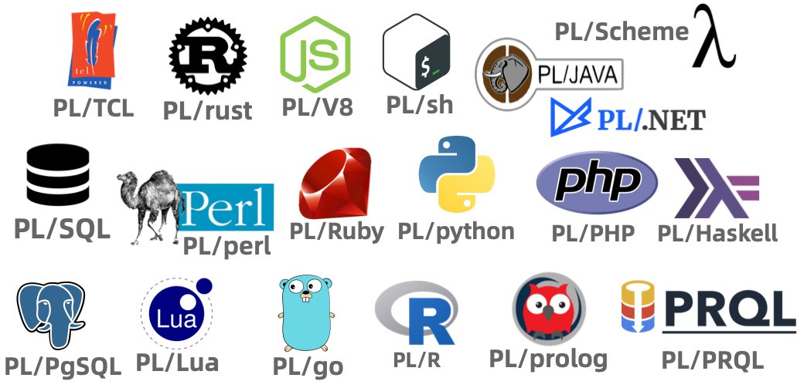
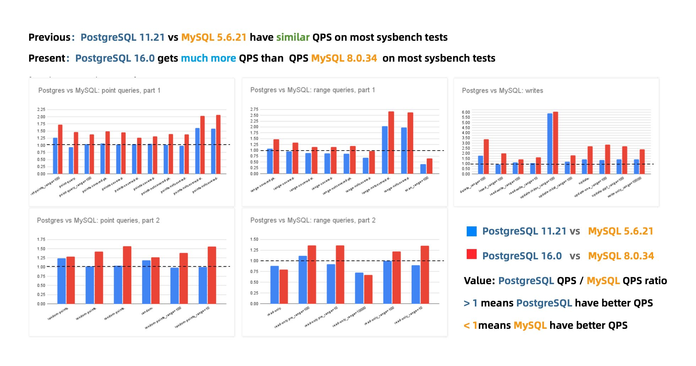
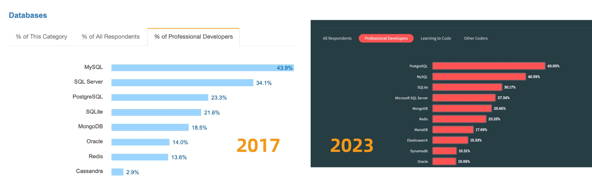
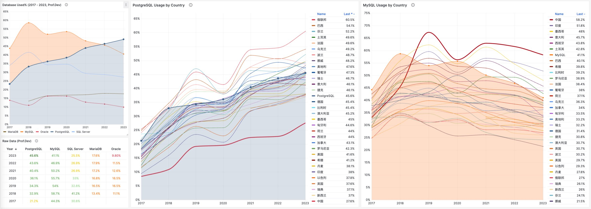
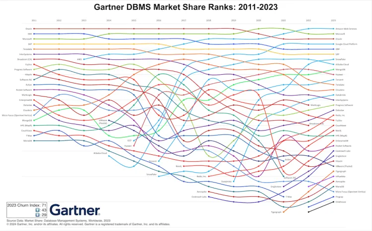

This July, MySQL 9.0 was finally released—a full eight years after its last major version, 8.0 ([@2016-09](https://dev.mysql.com/doc/relnotes/mysql/8.0/en/news-8-0-0.html)). Yet, this hollow "innovation" release feels like a bad joke, signaling that **MySQL is on its deathbed**.

While PostgreSQL continues to surge ahead, MySQL's sunset is painfully acknowledged by Percona, a major flag-bearer of the MySQL ecosystem, through a series of poignant posts:
"[Where is MySQL Heading?]()", "[Did Oracle Finally Kill MySQL?]()", and "[Can Oracle Save MySQL?]()", openly expressing disappointment and frustration with MySQL.

Peter Zaitsev, CEO of Percona, remarked:

> **Who needs MySQL when there's PostgreSQL?** But if MySQL dies, PostgreSQL might just monopolize the database world, so at least MySQL can serve as a whetstone for PostgreSQL to reach its zenith.

Some databases are [eating the DBMS world](/pg/pg-eat-db-world), while others are [fading into obscurity]().

**MySQL is dead, Long live PostgreSQL!**

- [Hollow Innovations](#hollow-innovations)
- [Sloppy Vector Types](#sloppy-vector-types)
- [Belated JavaScript Functions](#belated-javascript-functions)
- [Lagging Features](#lagging-features)
- [Degrading Performance](#degrading-performance)
- [Irredeemable Isolation Levels](#irredeemable-isolation-levels)
- [Shrinking Ecosystem](#shrinking-ecosystem)
- [Who Really Killed MySQL?](#who-really-killed-mysql)
- [PostgreSQL Ascends as MySQL Rests in Peace](#postgresql-ascends-as-mysql-rests-in-peace)

------

## Hollow Innovations

The official MySQL website's ["What's New in MySQL 9.0"](https://dev.mysql.com/doc/refman/9.0/en/mysql-nutshell.html) introduces a few new features of version 9.0, with six features.

**And that's it? That's all there is?**

This is surprisingly underwhelming because PostgreSQL’s major releases every year brim with countless new features. For instance, PostgreSQL 17, slated for release this fall, already boasts an impressive list of new features, even though it’s just in beta1:

The recent slew of PostgreSQL features could even fill a book, as seen in “[Quickly Mastering New PostgreSQL Features](https://mp.weixin.qq.com/s/2bjblo9t7KNQh1isRwbs2w)”, which covers the key enhancements from the last seven years, packing the contents to the brim:

Looking back at MySQL’s update, the last four of the six touted features are mere minor patches, barely worth mentioning. The first two—**vector data types** and **JavaScript stored procedures**—are supposed to be the highlights.

**BUT —**

MySQL 9.0’s vector data types are just an alias of `BLOB` — with a simple array length function added. This kind of feature was supported by PostgreSQL when it was born **28 years ago**.

And MySQL’s support for JavaScript stored procedures? It's an **enterprise-only feature**—not available in the open-source version, while PostgreSQL has had this capability since **13 years ago** with version 9.1.

After an eight-year wait, the "innovative update" delivers two "old features," one of which is gated behind an enterprise edition. The term "**innovation**" here seems bitterly ironic and sarcastic.

------

## Sloppy Vector Types

In the past few years, AI has exploded in popularity, boosting interest in vector databases. Nearly every mainstream DBMS now supports vector data types—**except for MySQL**.

Users might have hoped that MySQL 9.0, touted as an innovative release, would fill some gaps in this area. Instead, they were greeted with a shocking level of complacency—**how could they be so sloppy?**

According to MySQL 9.0's [official documentation](https://dev.mysql.com/doc/refman/9.0/en/vector-functions.html), there are only three functions related to vector types. Ignoring the two that deal with string conversions, the only real functional command is `VECTOR_DIM`: it returns the dimension of a vector (i.e., the length of an array)!

The bar for entry into vector databases is not high—a simple vector distance function (think dot product, a 10-line C program, a coding task suitable for elementary students) would suffice. This could enable basic vector retrieval through a full table scan with an `ORDER BY d LIMIT n` query, representing a minimally viable feature. Yet MySQL 9 didn't even bother to implement this basic vector distance function, which is not a capability issue but a clear sign that Oracle has lost interest in progressing MySQL. Any seasoned tech observer can see that this so-called "vector type" is merely a `BLOB`under a different name—it only manages your binary data input without caring how users want to search or utilize it. Of course, it’s possible Oracle has a more robust version on its MySQL Heatwave, but what’s delivered on MySQL itself is a feature you could hack together in ten minutes.

In contrast, let's look at PostgreSQL, MySQL's long-standing rival. Over the past year, the PostgreSQL ecosystem has spawned at least six vector database extensions (`pgvector`, `pgvector.rs`, `pg_embedding`, `latern`, `pase`, `pgvectorscale`) and has reached new heights in a competitive race. The frontrunner, [`pgvector`](), which emerged in 2021, quickly reached heights that many specialized vector databases couldn't, thanks to the collective efforts of developers, vendors, and users standing on PostgreSQL’s shoulders. It could even be argued that `pgvector` single-handedly ended this niche in databases—["Is the Dedicated Vector Database Era Over?"](https://www.example.com/).

Within this year, `pgvector` [improved its performance by 150 times](https://jkatz05.com/post/postgres/pgvector-performance-150x-speedup/), and its functionality has dramatically expanded. `pgvector` offers data types like float vectors, half-precision vectors, bit vectors, and sparse vectors; distance metrics like L1, L2, dot product, Hamming, and Jaccard; various vector and scalar functions and operators; supports IVFFLAT and HNSW vector indexing methods (with the `pgvectorscale` extension adding DiskANN indexing); supports parallel index building, vector quantization, sparse vector handling, sub-vector indexing, and hybrid retrieval, with potential SIMD instruction acceleration. These rich features, combined with a free open-source license and the collaborative power of the entire PostgreSQL ecosystem, have made `pgvector` a resounding success. Together with PostgreSQL, it has become the default database for countless AI projects.

Comparing `pgvector` with MySQL 9's "vector" support might seem unfair, as MySQL’s offering doesn’t even come close to PostgreSQL's "multidimensional array type" available since its inception in 1996—at least that had a robust array of functions, not just an array length calculation.

[**Vectors are the new JSON**](), but the party at the vector database table has ended, and MySQL hasn’t even managed to serve its dish. It has completely missed the growth engine of the next AI decade, just as it missed the JSON document database wave of the internet era in the previous decade.

------

## Belated JavaScript Functions

Another "blockbuster" feature of MySQL 9.0 is **JavaScript Stored Procedures**.

However, using JavaScript for stored procedures isn't a novel concept—back in 2011, PostgreSQL 9.1 could already script JavaScript stored procedures through the [`plv8`](https://github.com/plv8/plv8/tree/v0.1.0) extension, and MongoDB began supporting JavaScript around the same time.

A glance at the past twelve years of the "[Database Popularity Trend](https://demo.pigsty.cc/d/db-analysis/db-engine-analysis?orgId=1&var-year=2012)" on DB-Engine shows that only PostgreSQL and Mongo have truly led the pack. MongoDB (2009) and PostgreSQL 9.2 (2012) were quick to grasp internet developers' needs, adding [JSON feature support]() (document databases) right as the "Rise of JSON" began, thereby capturing the largest growth share in the database realm over the last decade.

Of course, Oracle, MySQL's stepfather, added JSON features and JavaScript stored procedure support by the end of 2014 in version 12.1—while MySQL itself unfortunately didn’t catch up until 2024—**but it's too late now!**

Oracle allows stored procedures to be written in C, SQL, PL/SQL, Python, Java, and JavaScript. But compared to PostgreSQL's more than twenty supported procedural languages, it's merely a drop in the bucket:

Unlike PostgreSQL and Oracle's development philosophy, MySQL's best practices generally discourage using stored procedures—making JavaScript functions a rather superfluous feature for MySQL. Even so, Oracle made JavaScript stored procedures a **MySQL Enterprise Edition exclusive**—considering most MySQL users opt for the open-source community version, this feature essentially went unnoticed.

--------

## Falling Behind: Features and Flexibility

MySQL's feature deficiencies go beyond mere programming language and stored procedure support. Across various dimensions, MySQL significantly lags behind its competitor PostgreSQL—not just in core database capabilities but also in its extensibility ecosystem.

Abigale Kim from CMU has conducted research on [scalability across mainstream databases](https://abigalekim.github.io/assets/pdf/Anarchy_in_the_Database_PGConfDev2024.pdf), highlighting PostgreSQL's superior **extensibility** among all DBMSs, boasting an unmatched number of extension plugins—**375+** listed on PGXN alone, with [actual ecosystem extensions surpassing a thousand](https://gist.github.com/joelonsql/e5aa27f8cc9bd22b8999b7de8aee9d47).

These plugins enable PostgreSQL to serve diverse functionalities—geospatial, time-series, vector search, machine learning, OLAP, full-text search, graph databases—effectively turning it into a multi-faceted, full-stack database. A single PostgreSQL instance can replace an array of specialized components: MySQL, MongoDB, Kafka, Redis, ElasticSearch, Neo4j, and even dedicated analytical data warehouses and data lakes.

While MySQL remains confined to its "relational OLTP database" niche, PostgreSQL has transcended its relational roots to become a multi-modal database and a platform for data management abstraction and development.

[PostgreSQL is devouring the database world](), internalizing the entire database realm through its plugin architecture. "[Just use Postgres]()" has moved from being a fringe exploration by elite teams to a mainstream best practice.

In contrast, MySQL shows a lackluster enthusiasm for new functionalities—a major version update that should be rife with innovative 'breaking changes' turns out to be either lackluster features or insubstantial enterprise gimmicks.

--------

## Deteriorated Performance

The lack of features might not be an insurmountable issue—if a database excels at its core functionalities, architects can cobble together the required features using various data components.

MySQL's once-celebrated core attribute was its **performance**—notably in simple OLTP CRUD operations typical of internet-scale applications. Unfortunately, this strength is now under siege. Percona's blog post "[Sakila: Where Are You Going?]()" unveils a startling revelation:

**Newer MySQL versions are performing worse than their predecessors.**

According to Percona's benchmarks using sysbench and TPC-C, the latest MySQL 8.4 shows a performance degradation of up to **20%** compared to MySQL 5.7. MySQL expert Mark Callaghan has further corroborated this trend in his [detailed performance regression tests](https://smalldatum.blogspot.com/2024/02/perf-regressions-in-mysql-from-5621-to.html):

> MySQL 8.0.36 shows a 25% – 40% drop in QPS throughput performance compared to MySQL 5.6!

While there have been some optimizer improvements in MySQL 8.x, enhancing performance in complex query scenarios, complex queries were never MySQL’s forte. Conversely, a significant drop in the fundamental OLTP CRUD performance is indefensible.

Peter Zaitsev commented in his post "[Oracle Has Finally Killed MySQL]()": "Compared to MySQL 5.6, MySQL 8.x has shown a significant performance decline in single-threaded simple workloads. One might argue that adding features inevitably impacts performance, but MariaDB shows much less performance degradation, and PostgreSQL has managed to [significantly enhance performance while adding features](https://smalldatum.blogspot.com/2024/06/postgres-17beta1-vs-sysbench-on-large.html)."

Years ago, the industry consensus was that PostgreSQL and MySQL performed comparably in simple OLTP CRUD scenarios. However, as PostgreSQL has continued to improve, it has vastly outpaced MySQL in performance. PostgreSQL now significantly exceeds MySQL in various read and write scenarios, with throughput improvements ranging from 200% to even 500% in some cases.

**The performance edge that MySQL once prided itself on no longer exists.**

------

## The Incurable Isolation Levels

While performance issues can usually be patched up, correctness issues are a different beast altogether.

An article, "[The Grave Correctness Problems with MySQL?]()", points out that MySQL falls embarrassingly short on **correctness**—a fundamental attribute expected of any respectable database product.

The renowned distributed transaction testing organization, [JEPSEN](https://jepsen.io/analyses/mysql-8.0.34), discovered that the **Repeatable Read (RR)** isolation level claimed by MySQL's documentation actually provides much weaker correctness guarantees. MySQL 8.0.34's default RR isolation level isn’t truly repeatable read, nor is it **atomic** or **monotonic**, failing even the basic threshold of **Monotonic Atomic View (MAV)**.

**MySQL’s ACID properties are flawed and do not align with their documentation**—a blind trust in these false promises can lead to severe correctness issues, such as data discrepancies and reconciliation errors, which are intolerable in scenarios where data integrity is crucial, like finance.

Moreover, the **Serializable (SR)** isolation level in MySQL, which could "avoid" these anomalies, is hard to use in production and isn't recognized as best practice by official documentation or the community. While expert developers might circumvent such issues by explicitly locking in queries, this approach severely impacts performance and is prone to deadlocks.

In contrast, PostgreSQL's introduction of Serializable Snapshot Isolation (SSI) in version 9.1 offers a complete serializable isolation level with minimal performance overhead—achieving a level of correctness even Oracle struggles to match.

Professor Li Haixiang’s paper, "[The Consistency Pantheon](https://mp.weixin.qq.com/s/_BhAjcMkmthTf8Zw3RWKDw)", systematically evaluates the correctness of isolation levels across mainstream DBMSs. The chart uses blue/green to indicate correct handling rules/rollbacks to avoid anomalies; yellow A indicates anomalies, with more implying greater correctness issues; red "D" indicates performance-impacting deadlock detection used to handle anomalies, with more Ds indicating severe performance issues.

It's clear that the best correctness implementation (no yellow A) is PostgreSQL’s SR, along with CockroachDB’s SR based on PG, followed by Oracle’s slightly flawed SR; mainly, these systems avoid concurrency anomalies through mechanisms and rules. Meanwhile, MySQL shows a broad swath of yellow As and red Ds, with a level of correctness and implementation that is crudely inadequate.

**Doing things right is critical, and correctness should not be a trade-off**. Early on, the open-source relational database giants MySQL and PostgreSQL chose divergent paths: MySQL sacrificed correctness for performance, while the academically inclined PostgreSQL opted for correctness at the expense of performance.

During the early days of the internet boom, MySQL surged ahead due to its performance advantages. However, as performance becomes less of a core concern, correctness has emerged as MySQL’s **fatal flaw**. What's more tragic is that even the performance MySQL sacrificed correctness for is no longer competitive, a fact that's disheartening.

------

## The Shrinking Ecosystem Scale

For any technology, the **scale** of its user base directly determines the vibrancy of its ecosystem. Even a dying camel is larger than a horse, and a rotting ship still holds three pounds of nails. MySQL once soared with the winds of the internet, amassing a substantial legacy, aptly captured by its slogan—**"The world's most popular open-source relational database"**.

Unfortunately, at least according to the 2023 results of one of the world’s most authoritative developer surveys, the [StackOverflow Annual Developer Survey](), MySQL has been overtaken by PostgreSQL—**the crown of the most popular database has been claimed by PostgreSQL**.

Especially notable, when examining the past seven years of survey data together, one can clearly see the trend of PostgreSQL becoming more popular as MySQL becomes less so (top left chart)—an obvious trend even under the same benchmarking standards.

This rise and fall trend is also true in China. However, claiming PostgreSQL is more popular than MySQL in China would indeed go against intuition and fact.

Breaking down StackOverflow's professional developers by country, it’s evident that in major countries (31 countries with sample sizes > 600), China has the highest usage rate of MySQL—58.2%, while the usage rate of PG is the lowest at only 27.6%, nearly double the PG user base.

In stark contrast, in the Russian Federation, which faces international sanctions, the community-driven and non-corporately controlled PostgreSQL has become a savior—its PG usage rate tops the chart at 60.5%, double its MySQL usage rate of 27%.

In China, due to similar motivations for self-reliance in technology, PostgreSQL's usage rate has also seen a significant increase—tripling over the last few years. The ratio of PG to MySQL users has rapidly evolved from 5:1 six or seven years ago to 3:1 three years ago, and now to 2:1, with expectations to soon match and surpass the global average.

After all, many national databases are built on PostgreSQL—if you’re in the government or enterprise tech industry, chances are you’re already using PostgreSQL.

## Who Really Killed MySQL?

Who killed MySQL, was it PostgreSQL? Peter Zaitsev argues in "[Did Oracle Ultimately Kill MySQL?]()" that **Oracle’s inaction and misguided directives ultimately doomed MySQL**. He further explains the real root cause in "[Can Oracle Save MySQL?](https://pigsty.io/zh/db/can-oracle-save-mysql)":

MySQL's intellectual property is owned by Oracle, and unlike PostgreSQL, which is "owned and managed by the community," it lacks the broad base of independent company contributors that PostgreSQL enjoys. Neither MySQL nor its fork, MariaDB, are truly community-driven pure open-source projects like Linux, PostgreSQL, or Kubernetes, but are dominated by a single commercial entity.

It might be wiser to leverage a competitor's code without contributing back—AWS and other cloud providers compete in the database arena using the MySQL kernel, yet offer no contributions in return. Consequently, as a competitor, Oracle also loses interest in properly managing MySQL, instead focusing solely on its MySQL HeatWave cloud version, just as AWS focuses solely on its RDS management and Aurora services. Cloud providers share the blame for the decline of the MySQL community.

What’s gone is gone, but the future awaits. PostgreSQL should learn from the demise of MySQL—although the PostgreSQL community is very careful to avoid the dominance of any single entity, the ecosystem is indeed evolving towards a few cloud giants dominating. [**The cloud is devouring open source**]()—cloud providers write the management software for open-source software, form pools of experts, and capture most of the lifecycle value of maintenance, but the largest costs—**R&D**—are borne by the entire open-source community. And [**truly valuable management/monitoring code is never given back to the open-source community**]()—this phenomenon has been observed in MongoDB, ElasticSearch, Redis, and MySQL, and the PostgreSQL community should take heed.

Fortunately, the PG ecosystem always has enough resilient people and companies willing to stand up and maintain the balance of the ecosystem, resisting the hegemony of public cloud providers. For example, my own PostgreSQL distribution, [Pigsty](https://pigsty.io/), aims to provide an out-of-the-box, local-first open-source cloud database RDS alternative, raising the baseline of community-built PostgreSQL database services to the level of cloud provider RDS PG. And my column series "[Mudslide of Cloud Computing]()" aims to expose the information asymmetry behind cloud services, helping public cloud providers to operate more honorably—achieving notable success.

Although I am a staunch supporter of PostgreSQL, I agree with Peter Zaitsev's view: *"If MySQL completely dies, open-source relational databases would essentially be monopolized by PostgreSQL, and monopoly is not good as it leads to stagnation and reduced innovation. Having MySQL as a competitor is not a bad thing for PostgreSQL to reach its full potential."*

At least, MySQL can serve as a spur to motivate the PostgreSQL community to maintain cohesion and a sense of urgency, continuously improve its technical level, and continue to promote open, transparent, and fair community governance, thus driving the advancement of database technology.

MySQL had its days of glory and was once a benchmark of "open-source software," but even the best shows must end. MySQL is dying—lagging updates, falling behind in features, degrading performance, quality issues, and a shrinking ecosystem are inevitable, beyond human control. Meanwhile, PostgreSQL, carrying the original spirit and vision of open-source software, will continue to forge ahead—it will continue on the path MySQL could not finish and write the chapters MySQL did not complete.

--------

## Reference

[Oracle还能拯救MySQL吗？](/db/can-oracle-save-mysql)

[Oracle最终还是杀死了MySQL！](/db/mysql-is-dead/)

[MySQL性能越来越差，Sakila将何去何从？](/db/sakila-where-are-you-going)

[MySQL的正确性为何如此拉垮？](/db/bad-mysql)

[PostgreSQL正在吞噬数据库世界](/pg/pg-eat-db-world)

[PostgreSQL 17 Beta1 发布！牙膏管挤爆了！](/pg/pg-17-beta1)

[为什么PostgreSQL是未来数据的基石？](/pg/pg-for-everything)

[PostgreSQL is eating the database world](/pg/pg-eat-db-world)

[技术极简主义：一切皆用Postgres](/pg/just-use-pg)

[PostgreSQL：世界上最成功的数据库](/pg/pg-is-no1)

[PostgreSQL 到底有多强？](/pg/pg-performence/)

[专用向量数据库凉了吗？](/db/svdb-is-dead)

[向量是新的JSON](/pg/vector-json-pg)

[AI大模型与PGVECTOR](/pg/llm-and-pgvector/)

[云数据库的模式与新挑战](/cloud/dba-vs-rds)

云计算泥石流

[Redis不开源是“开源”之耻，更是公有云之耻](/db/redis-oss/)

[PostgreSQL会修改开源许可证吗？](/pg/pg-license/)