> [微信公众号](https://mp.weixin.qq.com/s/JgGCn9o2-DNPNqazPZXTtA)

本月，MySQL 9.0 终于发布了（@2024-07），距离上一次大版本更新 8.0 ([@2016-09](https://dev.mysql.com/doc/relnotes/mysql/8.0/en/news-8-0-0.html)) 已经过去八年了。然而这个空洞无物的所谓“创新版本”却犹如一个恶劣的玩笑，宣告着 MySQL **正在死去**。

PostgreSQL 正在高歌猛进，而 MySQL 却日薄西山，作为 MySQL 生态主要扛旗者的 Percona 也不得不悲痛地承认这一现实，连发三篇《[MySQL将何去何从](/db/sakila-where-are-you-going)》，《[Oracle最终还是杀死了MySQL](/db/oracle-kill-mysql)》，《[Oracle还能挽救MySQL吗](/db/can-oracle-save-mysql)》，公开表达了对 MySQL 的失望与沮丧；

Percona 的 CEO Peter Zaitsev 也表示：

> **有了 PostgreSQL，谁还需要 MySQL 呢？** —— 但如果 MySQL 死了，PostgreSQL 就真的垄断数据库世界了，所以 MySQL 至少还可以作为 PostgreSQL 的磨刀石，让 PG 进入全盛状态。

有的数据库正在[吞噬数据库世界](/pg/pg-eat-db-world)，而有的数据库正在[黯然地凋零死去](/db/mysql-is-dead)。

**MySQL is dead，Long live PostgreSQL！**

- [空洞无物的创新版本](#空洞无物的创新版本)
- [糊弄了事的向量类型](#糊弄了事的向量类型)
- [姗姗来迟的JS函数](#姗姗来迟的js函数)
- [日渐落后的功能特性](#日渐落后的功能特性)
- [越新越差的性能表现](#越新越差的性能表现)
- [无可救药的质量水平](#无可救药的质量水平)
- [枯萎收缩的生态规模](#枯萎收缩的生态规模)
- [究竟是谁杀死了MySQL](#究竟是谁杀死了mysql)
- [PG驶向云外，MySQL安魂九霄](#pg驶向云外mysql安魂九霄)

---------

## 空洞无物的创新版本

MySQL 官网发布的 ["What's New in MySQL 9.0"](https://dev.mysql.com/doc/refman/9.0/en/mysql-nutshell.html) 介绍了 9.0 版本引入的几个新特性，而 [MySQL 9.0 新功能概览](https://mp.weixin.qq.com/s/puDWYINtIs-pfM_F5s3jaw) 一文对此做了扼要的总结：

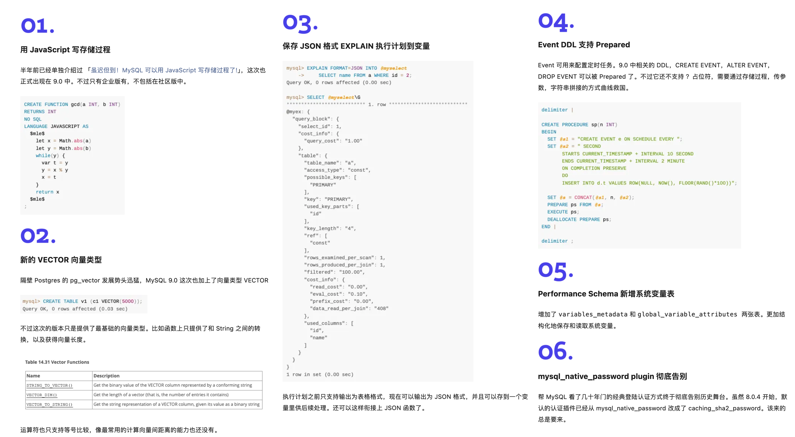

**然后呢？就这些吗？这就没了！？**

这确实是让人惊诧不已，因为 PostgreSQL 每年的大版本发布都有无数的新功能特性，例如计划今秋发布的 [PostgreSQL 17](/pg/pg-17-beta1/) 还只是 beta1，就已然有着蔚为壮观的新增特性列表：

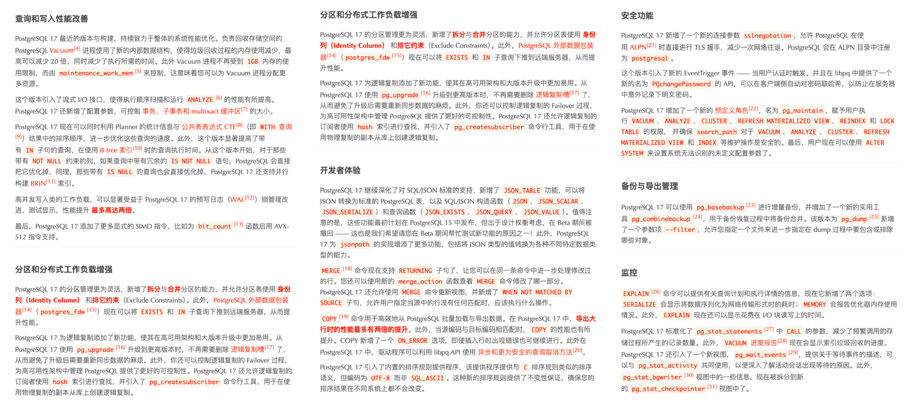

而最近几年的 PostgreSQL 新增特性甚至足够专门编成一本书了。比如《[快速掌握PostgreSQL版本新特性](https://mp.weixin.qq.com/s/2bjblo9t7KNQh1isRwbs2w)》便收录了 PostgreSQL 最近七年的重要新特性 —— 将目录塞的满满当当：

回头再来看看 MySQL 9 更新的六个特性，后四个都属于无关痛痒，一笔带过的小修补，拿出来讲都嫌丢人。而前两个 **向量数据类型** 和 **JS存储过程** 才算是重磅亮点。  

**BUT ——**

MySQL 9.0 的向量数据类型只是 `BLOB` 类型换皮 —— 只加了个数组长度函数，这种程度的功能，**28年前** PostgreSQL 诞生的时候就支持了。

而 MySQL Javascript 存储过程支持，竟然还是一个 **企业版独占特性**，开源版不提供 —— 而同样的功能，**13年前** 的 PostgreSQL 9.1 就已经有了。

时隔八年的 “创新大版本” 更新就带来了俩 “老特性”，其中一个还是企业版特供。“**创新**”这俩字，在这里显得如此辣眼与讽刺。

--------

## 糊弄了事的向量类型

这两年 AI 爆火，也带动了向量数据库赛道。当下几乎所有主流 DBMS 都已经提供向量数据类型支持 —— **MySQL 除外**。

用户可能原本期待着在 9.0 创新版，向量支持能弥补一些缺憾，结果发布后等到的只有震撼 —— **竟然还可以这么糊弄？**

在 MySQL 9.0 的 [官方文档](https://dev.mysql.com/doc/refman/9.0/en/vector-functions.html) 上，只有三个关于向量类型的函数。抛开与字符串互转的两个，真正的功能函数就一个 `VECTOR_DIM`：返回向量的维度！（计算数组长度）

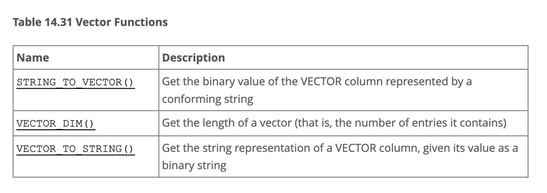

向量数据库的门槛不是一般的低 —— 有个向量距离函数就行（内积，10行C代码，小学生水平编程任务），这样至少可以通过全表扫描求距离 + `ORDER BY d LIMIT n` 实现向量检索，是个可用的状态。
但 MySQL 9 甚至连这样一个最基本的向量距离函数都懒得去实现，这绝对不是能力问题，而是 Oracle 根本就不想好好做 MySQL 了。
老司机一眼就能看出这里的所谓 “向量类型” 不过是 `BLOB` 的别名 —— 它只管你写入二进制数据，压根不管用户怎么查找使用。
当然，也不排除 Oracle 在自己的 MySQL Heatwave 上有一个不糊弄的版本。可在 MySQL 上，最后实际交付的东西，就是一个十分钟就能写完的玩意糊弄了事。  

不糊弄的例子可以参考 MySQL 的老对手 PostgreSQL。在过去一年中，PG 生态里就涌现出了至少六款向量数据库扩展（ `pgvector`，`pgvector.rs`，`pg_embedding`，`latern`，`pase`，`pgvectorscale`），并在你追我赶的赛马中卷出了新高度。
最后的胜出者是 2021 年就出来的 [`pgvector`](/pg/llm-and-pgvector/) ，它在无数开发者、厂商、用户的共同努力下，站在 PostgreSQL 的肩膀上，很快便达到了许多专业向量数据库都无法企及的高度，甚至可以说凭借一己之力，干死了这个数据库细分领域 —— 《[专用向量数据库凉了吗？](/db/svdb-is-dead)》。

在这一年内，`pgvector` [性能翻了 150 倍](https://jkatz05.com/post/postgres/pgvector-performance-150x-speedup/)，功能上更是有了翻天覆地的变化 —— `pgvector` 提供了 float向量，半精度向量，bit向量，稀疏向量几种数据类型；提供了L1距离，L2距离，内积距离，汉明距离，Jaccard距离度量函数；提供了各种向量、标量计算函数与运算符；支持 IVFFLAT，HNSW 两种专用向量索引算法（扩展的扩展 pgvectorscale 还提供了 DiskANN 索引）；支持了并行索引构建，向量量化处理，稀疏向量处理，子向量索引，混合检索，可以使用 SIMD 指令加速。这些丰富的功能，加上开源免费的协议，以及整个 PG 生态的合力与协同效应 —— 让 `pgvector` 大获成功，并与 PostgreSQL 一起，成为无数 AI 项目使用的默认（向量）数据库。

拿 `pgvector` 与来比似乎不太合适，因为 MySQL 9 所谓的“向量”，甚至都远远不如 1996 年 PG 诞生时自带的“多维数组类型” —— “至少它还有一大把数组函数，而不是只能求个数组长度”。

[**向量是新的JSON**](/pg/vector-json-pg/)，然而向量数据库的宴席都已经散场了，MySQL 都还没来得及上桌 —— 它完美错过了下一个十年 AI 时代的增长动能，正如它在上一个十年里错过互联网时代的JSON文档数据库一样。 

--------

## 姗姗来迟的JS函数

另一个 MySQL 9.0 带来的 “重磅” 特性是 —— **Javascript 存储过程**。

然而用 Javascript 写存储过程并不是什么新鲜事 —— 早在 2011 年，PostgreSQL 9.1 就已经可以通过 [`plv8`](https://github.com/plv8/plv8/tree/v0.1.0) 扩展编写 Javascript 存储过程了，MongoDB 也差不多在同一时期提供了对 Javascript 存储过程的支持。 

如果我们查看 DB-Engine 近十二年的 “[数据库热度趋势](https://demo.pigsty.cc/d/db-analysis/db-engine-analysis?orgId=1&var-year=2012&viewPanel=24)” ，不难发现只有 PostgreSQL 与 Mongo 两款 DBMS 在独领风骚 —— MongoDB (2009) 与 PostgreSQL 9.2 (2012) 都极为敏锐地把握住了互联网开发者的需求 —— 在 “JSON崛起” 的第一时间就添加 [JSON 特性支持](/pg/vector-json-pg/)（文档数据库），从而在过去十年间吃下了数据库领域最大的增长红利。

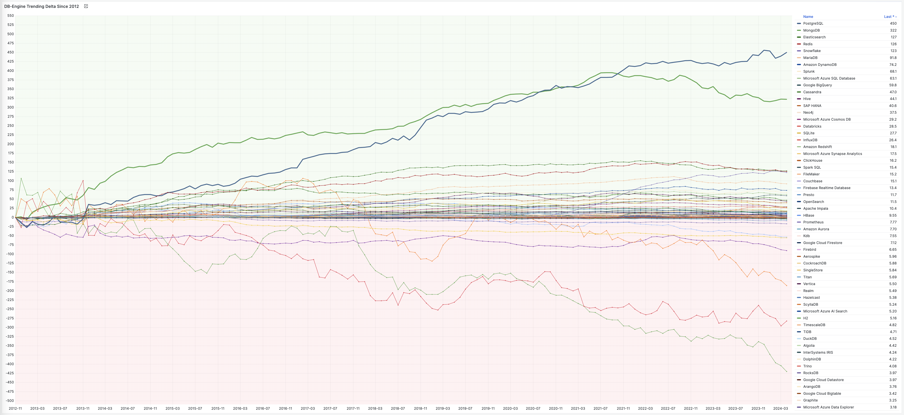

当然，MySQL 的干爹 —— Oracle 也在2014年底的12.1中添加了 JSON 特性与 Javascript 存储过程的支持 —— 而 MySQL 自己则不幸地等到了 2024 年才补上这一课 —— **但已经太迟了！** 

Oracle 支持用 C，SQL，PL/SQL，Pyhton，Java，Javascript 编写存储过程。但在 PostgreSQL 支持的二十多种存储过程语言面前，只能说也是小巫见大巫，只能甘拜下风了：

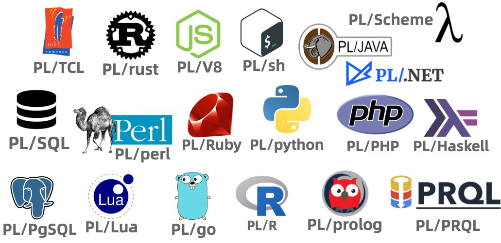

不同于 PostgreSQL 与 Oracle 的开发理念，MySQL 的各种最佳实践里都不推荐使用存储过程 —— 所以 Javascript 函数对于 MySQL 来说是个鸡肋特性。
然而即便如此，Oracle 还是把 Javascript 存储过程支持做成了一个 **MySQL企业版专属** 的特性 —— 考虑到绝大多数 MySQL 用户使用的都是开源社区版本，这个特性属实是发布了个寂寞。

--------

## 日渐落后的功能特性

MySQL 在功能上缺失的绝不仅仅是是编程语言/存储过程支持，在各个功能维度上，MySQL 都落后它的竞争对手 PostgreSQL 太多了 —— 功能落后不仅仅是在数据库内核功能上，更发生在扩展生态维度。

来自 CMU 的 Abigale Kim 对[主流数据库的可扩展性](https://abigalekim.github.io/assets/pdf/Anarchy_in_the_Database_PGConfDev2024.pdf)进行了研究：PostgreSQL 有着所有 DBMS 中最好的 **可扩展性**（Extensibility），以及其他数据库生态难望其项背的扩展插件数量 —— **375+**，这还只是 PGXN 注册在案的实用插件，[实际生态扩展总数已经破千](https://gist.github.com/joelonsql/e5aa27f8cc9bd22b8999b7de8aee9d47)。

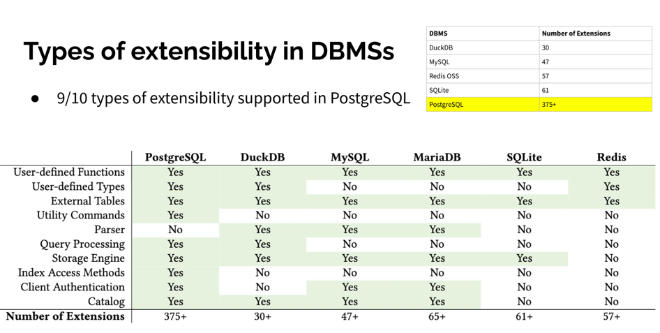

这些扩展插件为 PostgreSQL 提供了各种各样的功能 —— 地理空间，时间序列，向量检索，机器学习，OLAP分析，全文检索，图数据库，让 PostgreSQL 真正成为一专多长的全栈数据库 —— 单一数据库选型便可替代各式各样的专用组件： MySQL，MongoDB，Kafka，Redis，ElasticSearch，Neo4j，甚至是专用分析数仓与数据湖。

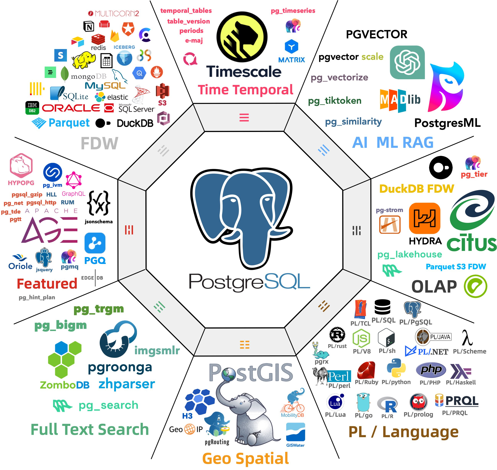

当 MySQL 还局限在 “**关系型 OLTP 数据库**” 的定位时， PostgreSQL 早已经放飞自我，从一个关系型数据库发展成了一个多模态的数据库，成为了一个数据管理的抽象框架与开发平台。

[PostgreSQL正在吞噬数据库世界](/pg/pg-eat-db-world) —— 它正在通过插件的方式，将整个数据库世界内化其中。“[一切皆用 Postgres](/pg/just-use-pg/)” 也已经不再是少数精英团队的前沿探索，而是成为了一种进入主流视野的最佳实践。

而在新功能支持上，MySQL 却显得十分消极 —— 一个应该有大量 Breaking Change 的“创新大版本更新”，不是糊弄人的摆烂特性，就是企业级的特供鸡肋，一个大版本就连鸡零狗碎的小修小补都凑不够数。

--------

## 越新越差的性能表现

缺少功能也许并不是一个无法克服的问题 —— 对于一个数据库来说，只要它能将自己的本职工作做得足够出彩，那么架构师总是可以多费些神，用各种其他的数据积木一起拼凑出所需的功能。

MySQL 曾引以为傲的核心特点便是 **性能** —— 至少对于互联网场景下的简单 OLTP CURD 来说，它的性能是非常不错的。然而不幸地是，这一点也正在遭受挑战：Percona 的博文《[Sakila：你将何去何从](/db/sakila-where-are-you-going/)》中提出了一个令人震惊的结论：

**MySQL 的版本越新，性能反而越差。**

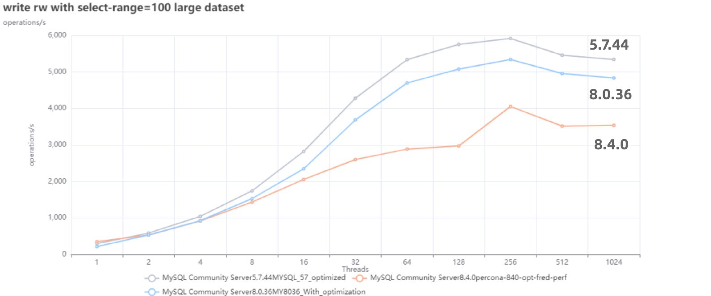

根据 Percona 的测试，在 sysbench 与 TPC-C 测试下，最新 MySQL 8.4 版本的性能相比 MySQL 5.7 出现了平均高达 **20%** 的下降。而 MySQL 专家 Mark Callaghan 进一步进行了 [详细的性能回归测试](https://smalldatum.blogspot.com/2024/02/perf-regressions-in-mysql-from-5621-to.html)，确认了这一现象：

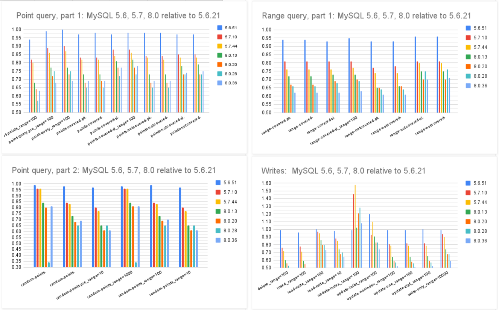

> MySQL 8.0.36 相比 5.6 ，QPS 吞吐量性能下降了 25% ～ 40% ！

尽管 MySQL 的优化器在 8.x 有一些改进，一些复杂查询场景下的性能有所改善，但分析与复杂查询本来就不是 MySQL 的长处与适用场景，只能说聊胜于无。相反，如果作为基本盘的 OLTP CRUD 性能出了这么大的折损，那确实是完全说不过去的。

[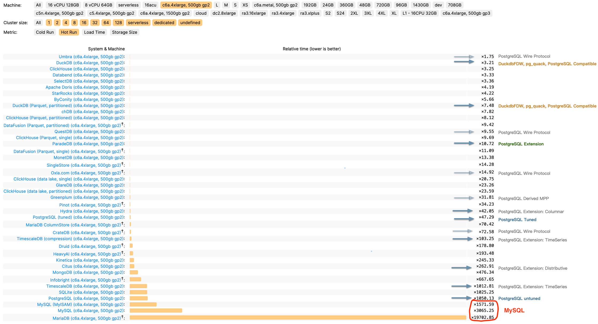](https://benchmark.clickhouse.com/)

> ClickBench：MySQL 打这个榜确实有些不明智

Peter Zaitsev 在博文《[Oracle最终还是杀死了MySQL](/db/oracle-kill-mysql)》中评论：“与 MySQL 5.6 相比，MySQL 8.x 单线程简单工作负载上的性能出现了大幅下滑。你可能会说增加功能难免会以牺牲性能为代价，但 MariaDB 的性能退化要轻微得多，而 PostgreSQL 甚至能在 [**新增功能的同时显著提升性能**](https://smalldatum.blogspot.com/2024/06/postgres-17beta1-vs-sysbench-on-large.html)”。

MySQL的性能随版本更新而逐步衰减，但在同样的性能回归测试中，PostgreSQL 性能却可以随版本更新有着稳步提升。特别是在最关键的写入吞吐性能上，最新的 PostgreSQL 17beta1 相比六年前的 PG 10 甚至有了 30% ～ 70% 的提升。

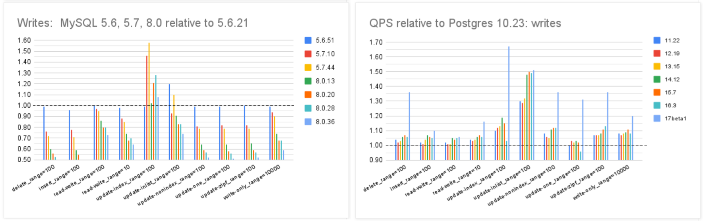

在 Mark Callaghan 的 [性能横向对比](https://smalldatum.blogspot.com/2023/10/postgres-vs-mysql-impact-of-cpu.html) （sysbench 吞吐场景） 中，我们可以看到五年前 PG 11 与 MySQL 5.6 的性能比值（蓝），与当下 PG 16 与 MySQL 8.0.34 的性能比值（红）。PostgreSQL 和 MySQL 的性能差距在这五年间拉的越来越大。

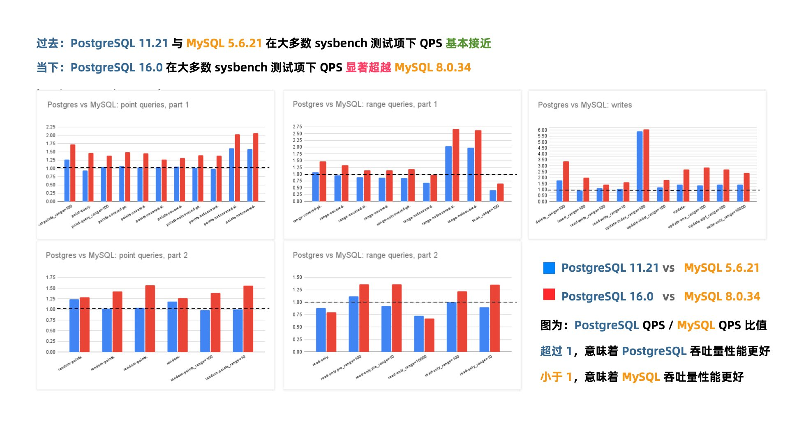

几年前的业界共识是 PostgreSQL 与 MySQL 在 **简单 OLTP CRUD 场景** 下的性能基本相同。然而此消彼长之下，现在 PostgreSQL 的性能已经远远甩开 MySQL 了。
PostgreSQL 的各种读吞吐量相比 MySQL 高 25% ～ 100% 不等，在一些写场景下的吞吐量更是达到了 200% 甚至 500% 的恐怖水平。

**MySQL 赖以安身立命的性能优势，已经不复存在了。**

--------

## 无可救药的质量水平

如果新版本只是性能不好，总归还有办法来优化修补。但如果是质量出了问题，那真就是无可救药了。

例如，Percona 最近刚刚在 MySQL 8.0.38 以上的版本（8.4.x, 9.0.0）中发现了一个 [严重Bug](https://perconadev.atlassian.net/browse/PS-9306) —— 如果数据库里表超过 1万张，那么重启的时候 MYSQL 服务器会直接崩溃！
一个数据库里有1万张表并不常见，但也并不罕见 —— 特别是当用户使用了一些分表方案，或者应用会动态创建表的时候。而直接崩溃显然是可用性故障中最严重的一类情形。

但 MySQL 的问题不仅仅是几个软件 Bug，而是根本性的问题 —— 《[MySQL正确性竟有如此大的问题？](/db/bad-mysql)》一文指出，在**正确性**这个体面数据库产品必须的基本属性上，MySQL 的表现一塌糊涂。

权威的分布式事务测试组织 [JEPSEN](https://jepsen.io/analyses/mysql-8.0.34) 研究发现，MySQL 文档声称实现的 **可重复读/RR** 隔离等级，实际提供的正确性保证要弱得多 —— MySQL 8.0.34 默认使用的 RR 隔离等级实际上并不可重复读，甚至既不**原子**也不**单调**，连 **单调原子视图/MAV** 的基本水平都不满足。

**MySQL 的 ACID 存在缺陷，且与文档承诺不符** —— 而轻信这一虚假承诺可能会导致严重的正确性问题，例如数据错漏与对账不平。对于一些数据完整性很关键的场景 —— 例如金融，这一点是无法容忍的。

此外，能“避免”这些异常的 MySQL **可串行化/SR** 隔离等级难以生产实用，也非官方文档与社区认可的最佳实践；尽管专家开发者可以通过在查询中显式加锁来规避此类问题，但这样的行为极其影响性能，而且容易出现死锁。

与此同时，PostgreSQL 在 9.1 引入的 可串行化快照隔离（SSI） 算法可以用极小的性能代价提供完整可串行化隔离等级 —— 而且 PostgreSQL 的 SR 在正确性实现上毫无瑕疵 —— 这一点即使是 Oracle 也难以企及。

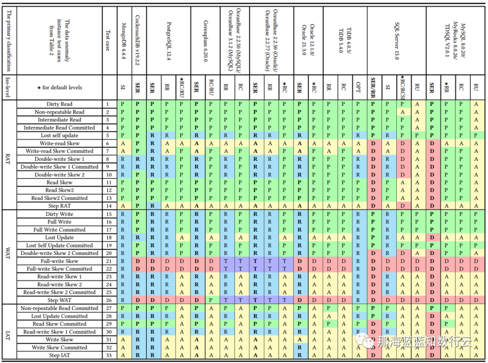

李海翔教授在《[一致性八仙图](https://mp.weixin.qq.com/s/_BhAjcMkmthTf8Zw3RWKDw)》论文中，系统性地评估了主流 DBMS 隔离等级的正确性，图中蓝/绿色代表正确用规则/回滚避免异常；黄A代表异常，越多则正确性问题就越多；红“D”指使用了影响性能的死锁检测来处理异常，红D越多性能问题就越严重；

不难看出，这里正确性最好（无黄A）的实现是 PostgreSQL SR，与基于PG的 CockroachDB SR，其次是略有缺陷 Oracle SR；主要都是通过机制与规则避免并发异常；而 MySQL 出现了大面积的黄A与红D，正确性水平与实现手法糙地不忍直视。

**做正确的事很重要，而正确性是不应该拿来做利弊权衡的**。在这一点上，开源关系型数据库两巨头 MySQL 和 PostgreSQL 在早期实现上就选择了两条截然相反的道路： MySQL 追求性能而牺牲正确性；而学院派的 PostgreSQL 追求正确性而牺牲了性能。

在互联网风口上半场中，MySQL 因为性能优势占据先机乘风而起。但当性能不再是核心考量时，正确性就成为了 MySQL 的**致命出血点**。
更为可悲的是，MySQL 连牺牲正确性换来的性能，都已经不再占优了，这着实让人唏嘘不已。

--------

## 枯萎收缩的生态规模

对一项技术而言，用户的**规模**直接决定了生态的繁荣程度。瘦死的骆驼比马大，烂船也有三斤钉。
MySQL 曾经搭乘互联网东风扶摇而起，攒下了丰厚的家底，它的 Slogan 就很能说明问题 —— “**世界上最流行的开源关系型数据库**”。

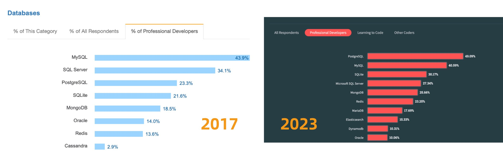

不幸地是在 2023 年，至少根据全世界最权威的开发者调研之一的 [StackOverflow Annual Developer Survey](/pg/pg-is-no1) 结果来看，MySQL 的使用率已经被 PostgreSQL 反超了 —— **最流行数据库的桂冠已经被 PostgreSQL 摘取**。

特别是，如果将过去七年的调研数据放在一起，就可以得到这幅 PostgreSQL / MySQL 在专业开发者中使用率的变化趋势图（左上） —— 在横向可比的同一标准下，PostgreSQL 流行与 MySQL 过气的趋势显得一目了然。

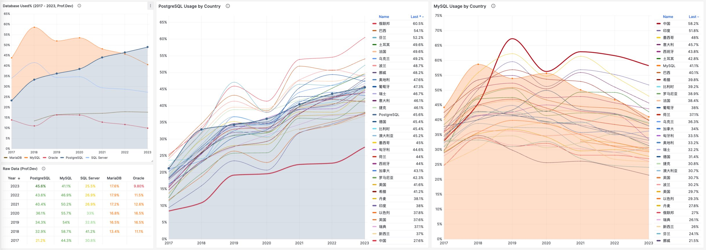

对于中国来说，此消彼长的变化趋势也同样成立。但如果对中国开发者说 PostgreSQL 比 MySQL 更流行，那确实是违反直觉与事实的。

将 StackOverflow 专业开发者按照国家细分，不难看出在主要国家中（样本数 > 600 的 31 个国家），中国的 MySQL 使用率是最高的 —— 58.2% ，而 PG 的使用率则是最低的 —— 仅为 27.6%，MySQL 用户几乎是 PG 用户的一倍。

与之恰好反过来的另一个极端是真正遭受国际制裁的俄联邦：由开源社区运营，不受单一主体公司控制的 PostgreSQL 成为了俄罗斯的数据库大救星 —— 其 PG 使用率以 60.5% 高居榜首，是其 MySQL 使用率 27% 的两倍。

中国因为同样的自主可控信创逻辑，最近几年 PostgreSQL 的使用率也出现了显著跃升 ——  PG 的使用率翻了三倍，而 PG 与 MySQL 用户比例已经从六七年前的 5:1 ，到三年前的3:1，再迅速发展到现在的 2:1，相信会在未来几年内会很快追平并反超世界平均水平。
毕竟，有这么多的国产数据库，都是基于 PostgreSQL 打造而成 —— 如果你做政企信创生意，那么大概率已经在用 PostgreSQL 了。

抛开政治因素，用户选择使用一款数据库与否，核心考量还是质量、安全、效率、成本等各个方面是否“**先进**”。先进的因会反映为流行的果，流行的东西因为落后而过气，而先进的东西会因为先进变得流行，没有“先进”打底，再“流行”也难以长久。

--------

## 究竟是谁杀死了MySQL？

究竟是谁杀死了 MySQL，难道是 PostgreSQL 吗？Peter Zaitsev 在《[Oracle最终还是杀死了MySQL](/db/sakila-where-are-you-going)》一文中控诉 —— **Oracle 的不作为与瞎指挥最终害死了 MySQL**；并在后续《[Oracle还能挽救MySQL吗](https://pigsty.io/zh/db/can-oracle-save-mysql)》一文中指出了真正的根因：

MySQL 的知识产权被 Oracle 所拥有，它不是像 PostgreSQL 那种 “由社区拥有和管理” 的数据库，也没有 PostgreSQL 那样广泛的独立公司贡献者。不论是 MySQL 还是其分叉 MariaDB，它们都不是真正意义上像 Linux，PostgreSQL，Kubernetes 这样由社区驱动的的原教旨纯血开源项目，而是由单一商业公司主导。

比起向一个商业竞争对手贡献代码，白嫖竞争对手的代码也许是更为明智的选择 —— AWS 和其他云厂商利用 MySQL 内核参与数据库领域的竞争，却不回馈任何贡献。于是作为竞争对手的 Oracle 也不愿意再去管理好 MySQL，而干脆自己也参与进来搞云 —— 仅仅只关注它自己的 MySQL heatwave 云版本，就像 AWS 仅仅专注于其 RDS 管控和 Aurora 服务一样。在 MySQL 社区凋零的问题上，云厂商也难辞其咎。

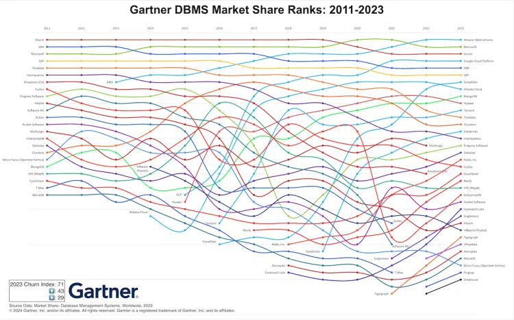

逝者不可追，来者犹可待。PostgreSQL 应该从 MySQL 的衰亡中吸取教训 —— 尽管 PostgreSQL 社区非常小心地避免出现一家独大的情况出现，但生态确实在朝着一家/几家巨头云厂商独大的不利方向在发展。[**云正在吞噬开源**](/cloud/paradigm/) —— 云厂商编写了开源软件的管控软件，组建了专家池，通过提供维护攫取了软件生命周期中的绝大部分价值，但却通过搭便车的行为将最大的成本 —— **产研**交由整个开源社区承担。而 [**真正有价值的管控/监控代码却从来不回馈开源社区**](/cloud/rds/#云数据库的模式与新挑战) —— 在数据库领域，我们已经在 MongoDB，ElasticSearch，Redis，以及 MySQL 上看到了这一现象，而 PostgreSQL 社区确实应当引以为鉴。

好在 PG 生态总是不缺足够头铁的人和公司，愿意站出来维护生态的平衡，反抗公有云厂商的霸权。例如，我自己开发的 PostgreSQL 发行版 [Pigsty](https://pigsty.io)，旨在提供一个开箱即用、本地优先的开源云数据库 RDS 替代，将社区自建 PostgreSQL 数据库服务的底线，拔高到云厂商 RDS PG 的水平线。而我的《云计算泥石流》系列专栏则旨在扒开云服务背后的信息不对称，从而帮助公有云厂商更加体面，亦称得上是成效斐然。

尽管我是 PostgreSQL 的坚定支持者，但我也赞同 Peter Zaitsev 的观点：*“如果 MySQL 彻底死掉了，开源关系型数据库实际上就被 PostgreSQL 一家垄断了，而垄断并不是一件好事，因为它会导致发展停滞与创新减缓。PostgreSQL 要想进入全盛状态，有一个 MySQL 作为竞争对手并不是坏事”*

至少，MySQL 可以作为一个鞭策激励，让 PostgreSQL 社区保持凝聚力与危机感，不断提高自身的技术水平，并继续保持开放、透明、公正的社区治理模式，从而持续推动数据库技术的发展。

MySQL 曾经也辉煌过，也曾经是“开源软件”的一杆标杆，但再精彩的演出也会落幕。MySQL 正在死去 —— 更新疲软，功能落后，性能劣化，质量出血，生态萎缩，此乃天命，实非人力所能改变。
而 PostgreSQL ，将带着开源软件的初心与愿景继续坚定前进 —— 它将继续走 MySQL 未走完的长路，写 MySQL 未写完的诗篇。

--------

## PG驶向云外，MySQL安魂九霄

我那些残梦，灵异九霄

徒忙漫奋斗，满目沧愁

在滑翔之后，完美坠落

在四维宇宙，眩目遨游

我那些烂曲，流窜九州

云游魂飞奏，音愤符吼

在宿命身后，不停挥手

视死如归仇，毫无保留

黑色的不是夜晚，是漫长的孤单

看脚下一片黑暗，望头顶星光璀璨

叹世万物皆可盼，唯真爱最短暂

失去的永不复返，世守恒而今倍还

摇旗呐喊的热情，携光阴渐远去

人世间悲喜烂剧，昼夜轮播不停

纷飞的滥情男女，情仇爱恨别离

一代人终将老去，但总有人正年轻

--------

## 参考阅读

[Oracle还能拯救MySQL吗？](/db/can-oracle-save-mysql)

[Oracle最终还是杀死了MySQL！](/db/mysql-is-dead/)

[MySQL性能越来越差，Sakila将何去何从？](/db/sakila-where-are-you-going)

[MySQL的正确性为何如此拉垮？](/db/bad-mysql)

[PostgreSQL正在吞噬数据库世界](/pg/pg-eat-db-world)

[PostgreSQL 17 Beta1 发布！牙膏管挤爆了！](/pg/pg-17-beta1)

[为什么PostgreSQL是未来数据的基石？](/pg/pg-for-everything)

[PostgreSQL is eating the database world](/pg/pg-eat-db-world)

[技术极简主义：一切皆用Postgres](/pg/just-use-pg)

[PostgreSQL：世界上最成功的数据库](/pg/pg-is-no1)

[PostgreSQL 到底有多强？](/pg/pg-performence/)

[专用向量数据库凉了吗？](/db/svdb-is-dead)

[向量是新的JSON](/pg/vector-json-pg)

[AI大模型与PGVECTOR](/pg/llm-and-pgvector/)

[云数据库的模式与新挑战](/cloud/dba-vs-rds)

云计算泥石流

[Redis不开源是“开源”之耻，更是公有云之耻](/db/redis-oss/)

[PostgreSQL会修改开源许可证吗？](/pg/pg-license/)