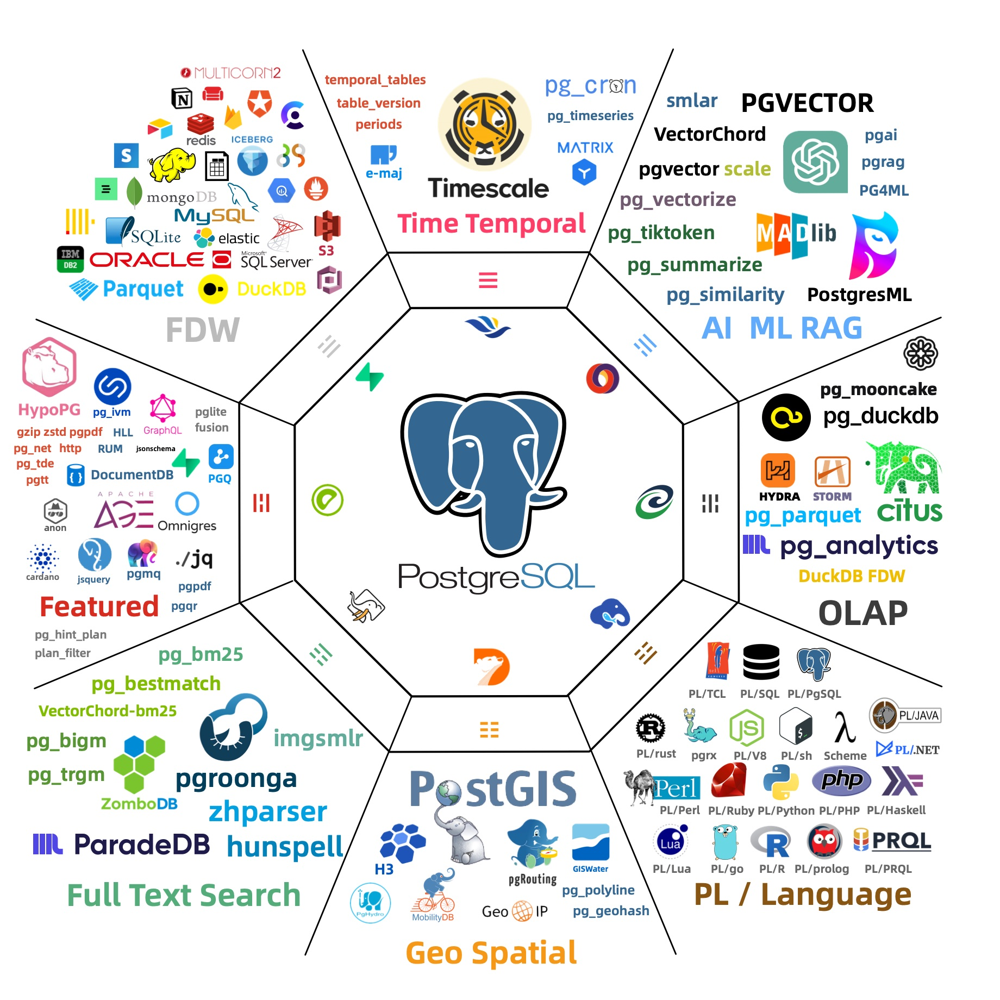
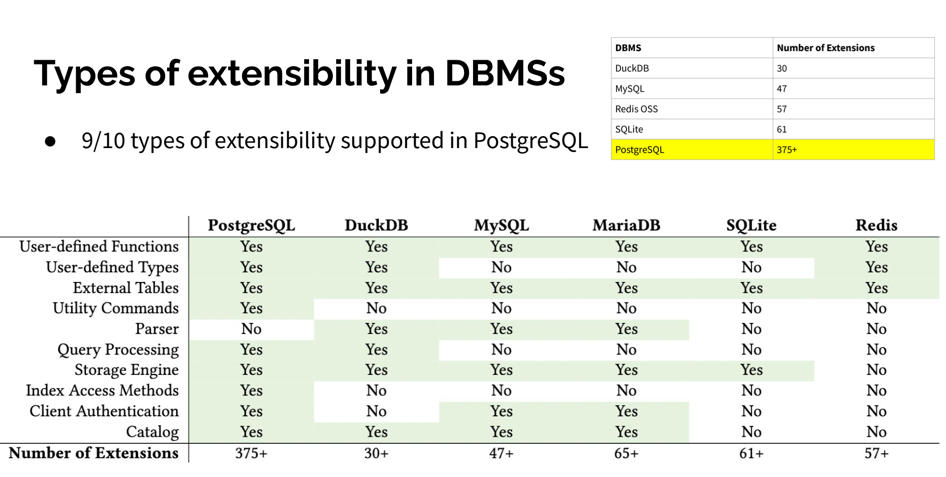
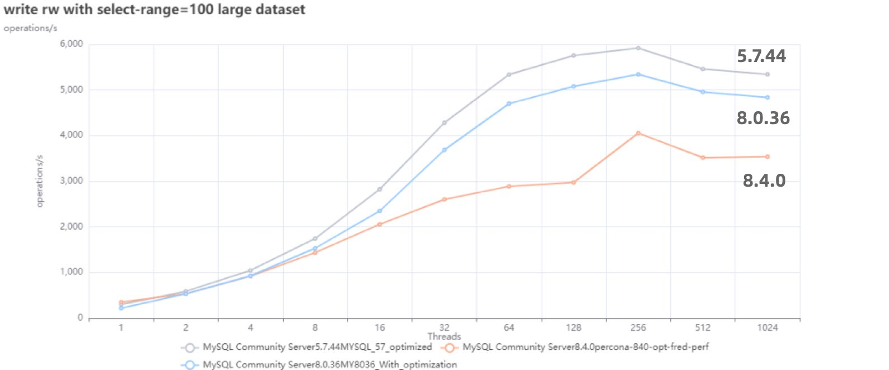
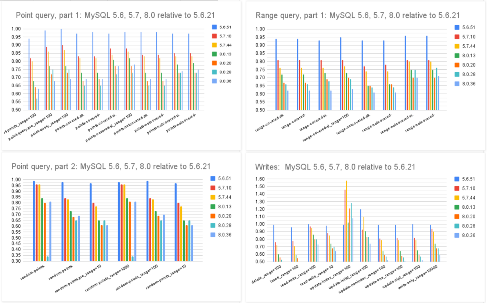
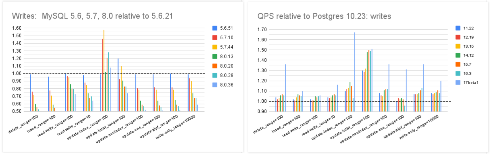
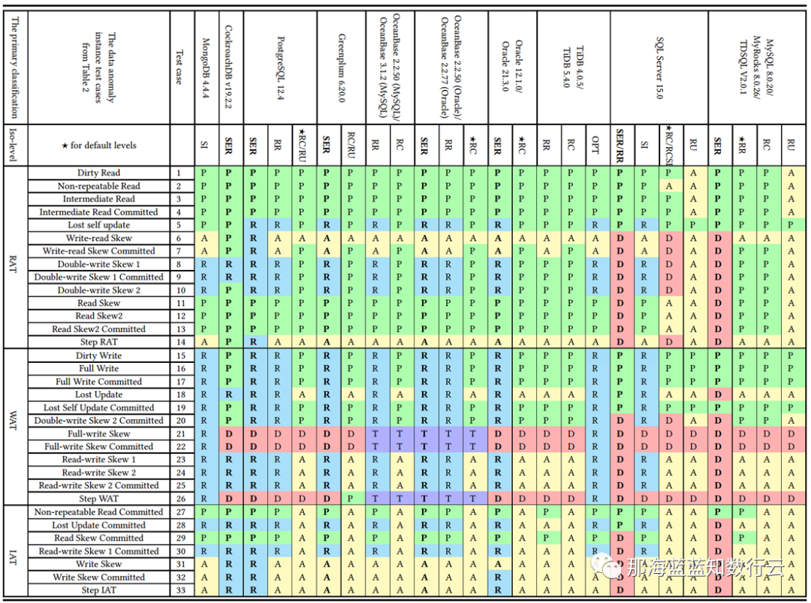
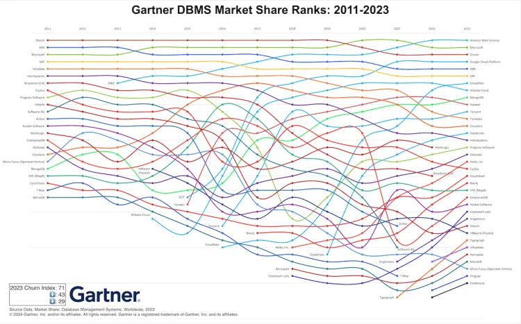
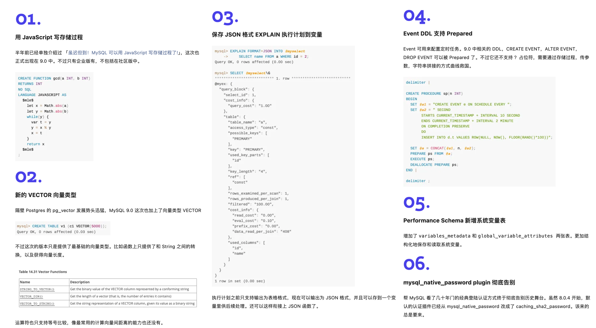

在 2025 年的当下，MySQL 无论是在功能特性集，质量正确性，性能表现，还是生态与社区上都被 PostgreSQL 拉开了差距，而且这个差距还在进一步扩大中。

今天我们就来对 MySQL 与 PostgreSQL 进行一个全方位的对比，从功能，性能，质量，生态来全方位反映这几年的生态变化。

-------

## 功能

让我们先从开发者最关注的东西 —— 功能特性开始说起。

### 新版本

昨天，MySQL 发布了 “创新版本” [9.3](https://dev.mysql.com/doc/refman/9.3/en/mysql-nutshell.html) 但是看上去和先前的 9.x 一样，都是些修修补补，看不到什么创新的东西。 搜索尚未发布的 PostgreSQL 18，你能看到无数特性预览的介绍文章；而搜索 MySQL 9.3，能看到的是社区对此的抱怨与失望。

MySQL 老司机丁奇看完 ReleaseNote 之后表示，[《MySQL创新版正在逐渐失去它的意义》](https://mp.weixin.qq.com/s/LLlOkGHIDhUCkJNLlmtXSQ)，德哥看后写了 [《MySQL将保持平庸》](https://mp.weixin.qq.com/s/QnfCqVOsSxsnjfUZv9UPsg)。 对于 MySQL 的 “创新版本”，Percona CEO， Peter Zaitsev 也发三篇《[MySQL将何去何从](/blog/db/sakila-where-are-you-going/)》，《[Oracle最终还是杀死了MySQL](/blog/db/oracle-kill-mysql/)》，《[Oracle还能挽救MySQL吗](/blog/db/can-oracle-save-mysql/)》，公开表达了对 MySQL 的失望与沮丧。

在最近几年，MySQL 在新功能上乏善可陈，与突飞猛进的 PostgreSQL 形成了鲜明的对比。

-------

### 新功能

以数据库领域最近两年最为火爆的增量场景 —— 向量数据库为例。在前两年的 向量数据库热潮中，PostgreSQL 生态里就涌现出了至少六七款向量数据库扩展（ `pgvector`，`pgvector.rs`，`pg_embedding`，`latern`，`pase`，`pgvectorscale`, `vchord`），并在你追我赶的赛马中卷出了新高度。最终在 AWS 的资源投入下，`pgvector` 在一年内实现了 150x 的性能飞跃，将整个专用向量数据库市场都给轰平了。

在当下，PostgreSQL 生态正在进行着 [如火如荼的 DuckDB 缝合大赛](https://mp.weixin.qq.com/s/zoxaJBgNLreWc-TkqOJ8BQ) ，[`pg_duckdb`](https://github.com/duckdb/pg_duckdb) 与 [`pg_mooncake`](https://pgmooncake.com/) 等扩展甚至已经进 ClickBench 分析性能榜单 T0 梯队， 也开始进入 [Thoughtworks 技术雷达评估 Radar](https://www.thoughtworks.com/content/dam/thoughtworks/documents/radar/2025/04/tr_technology_radar_vol_32_cn.pdf)，正在攻克真正的 OLTP 与 OLAP 融合问题，旨在替代 OLAP 大数据全家桶。 与此同时进行的还有用于原地替代 ElasticSearch Tantivy/BM25 缝合大赛。

而 MySQL 在这段时间里更新了什么功能呢？一个不支持计算距离与索引的[羞辱性 VECTOR 实现](https://dev.mysql.com/doc/refman/9.0/en/vector-functions.html)；还有一个企业版专属的 JS 存储过程支持（开源版没有！），而这是 PG 15 年前就可以通过 `plv8` 扩展实现的功能了。当 MySQL 还局限在 “**关系型 OLTP 数据库** ” 的定位时， PostgreSQL 早已经放飞自我，从一个关系型数据库发展成了一个多模态的数据库，成为了一个数据管理的抽象框架与开发平台。

-------

### 扩展性

来自 CMU 的 Abigale Kim 对[主流数据库的可扩展性](https://abigalekim.github.io/assets/pdf/Anarchy_in_the_Database_PGConfDev2024.pdf)进行了研究：PostgreSQL 有着所有 DBMS 中最好的 **可扩展性** （Extensibility），以及其他数据库生态难望其项背的扩展插件数量 —— **375+** ，这还只是 PGXN 注册在案的实用插件，[实际生态扩展总数已经破千](https://gist.github.com/joelonsql/e5aa27f8cc9bd22b8999b7de8aee9d47)。至少在开源的 PostgreSQL RDS 发行版 Pigsty 中，就已经开箱即用的提供 405 个扩展的 DEB/RPM 包了。

PostgreSQL 有着一个繁荣的扩展生态 —— 地理空间，时间序列，向量检索，机器学习，OLAP分析，全文检索，图数据库；这些扩展让 PostgreSQL 真正成为一专多长的全栈数据库 —— 单一数据库选型便可替代各式各样的专用组件： MySQL，MongoDB，Kafka，Redis，ElasticSearch，Neo4j，甚至是专用分析数仓与数据湖。

[PostgreSQL正在吞噬数据库世界](/blog/pg/pg-eat-db-world/) —— 它正在通过插件的方式，将整个数据库世界内化其中。“[一切皆用 Postgres](/blog/pg/just-use-pg/)” 也已经不再是少数精英团队的前沿探索，而是成为了一种进入主流视野的最佳实践。

而在新功能支持上，MySQL 却显得十分消极 —— 一个应该有大量 Breaking Change 的“创新大版本更新”，不是糊弄人的摆烂特性，就是企业级的特供鸡肋，一个大版本就连鸡零狗碎的小修小补都凑不够数。

-------

### 兼容性

除了海量扩展外，PostgreSQL 生态还有更离谱的：兼容功能：你还可以使用扩展或者分支，实现对其他数据库的兼容。

内核 | 特色 | 交付形态 | 公司  
---|---|---|---  
Citus | 分布式 HTAP / 多租户 | 扩展 | 微软  
DocumentDB | MongoDB 功能特性兼容 | 扩展 | 微软  
Babelfish | MSSQL 线缆协议兼容 | 内核分支 | AWS  
FerretDB | MongoDB 线缆协议兼容 | 中间件 | Ferret  
OrioleDB | 云原生Undo存储引擎 | 扩展+补丁内核 | Supabase  
OpenHalo | MySQL 线缆协议 兼容 | 内核分支 | 易景  
IvorySQL | Oracle 语法特性兼容 | 内核分支 | 瀚高  
PolarDB | Aurora/RAC 特性兼容 | 内核分支 | 阿里云  
PolarDB O | Oracle 语法特性兼容 | 内核分支 | 阿里云  
  
其中，openHalo 对 MySQL 生态可谓釜底抽薪 —— 在 PG 上直接兼容 MySQL 的线缆协议，这意味着 MySQL 应用可以在不改驱动/代码的情况下迁移到 PostgreSQL 上来。 另外，OrioleDB 在原生 PostgreSQL 的基础上，增加了云原生 Undo 存储引擎，支持高并发的分布式事务处理，号称实现了 4x 的吞吐量性能。

这并非纸面上的 PR 稿，这些内核/扩展都已经全部在 PostgreSQL 发行版 Pigsty 中作为开箱即用的 RDS 服务直接可用。

在这种性能怪兽面前，MySQL 将何去何从？

-------

## 性能

缺少功能也许并不是一个无法克服的问题 —— 对于一个数据库来说，只要它能将自己的本职工作做得足够出彩，那么架构师总是可以多费些神，用各种其他的数据积木一起拼凑出所需的功能。

### 性能劣化的MYSQL

MySQL 曾引以为傲的核心特点便是 **性能** —— 至少对于互联网场景下的简单 OLTP CURD 来说，它的性能是非常不错的。然而不幸地是，这一点也正在遭受挑战：Percona 的博文《[Sakila：你将何去何从](/blog/db/sakila-where-are-you-going/)》中提出了一个令人震惊的结论：

**MySQL 的版本越新，性能反而越差。**

根据 Percona 的测试，在 sysbench 与 TPC-C 测试下，最新 MySQL 8.4 版本的性能相比 MySQL 5.7 出现了平均高达 **20%** 的下降。而 MySQL 专家 Mark Callaghan 进一步进行了 [详细的性能回归测试](https://smalldatum.blogspot.com/2024/02/perf-regressions-in-mysql-from-5621-to.html)，确认了这一现象：

> MySQL 8.0.36 相比 5.6 ，QPS 吞吐量性能下降了 25% ～ 40% ！

-------

### 鸡肋的分析性能

尽管 MySQL 的优化器在 8.x 有一些改进，一些复杂查询场景下的性能有所改善，但分析与复杂查询本来就不是 MySQL 的长处与适用场景，只能说聊胜于无。相反，如果作为基本盘的 OLTP CRUD 性能出了这么大的折损，那确实是完全说不过去的。

> ClickBench：MySQL 打这个榜确实有些不明智

Peter Zaitsev 在博文《[Oracle最终还是杀死了MySQL](/blog/db/oracle-kill-mysql/)》中评论：“与 MySQL 5.6 相比，MySQL 8.x 单线程简单工作负载上的性能出现了大幅下滑。你可能会说增加功能难免会以牺牲性能为代价，但 MariaDB 的性能退化要轻微得多，而 PostgreSQL 甚至能在 [**新增功能的同时显著提升性能**](https://smalldatum.blogspot.com/2024/06/postgres-17beta1-vs-sysbench-on-large.html)”。

-------

### 稳步提升的PostgreSQL性能

MySQL的性能随版本更新而逐步衰减，但在同样的性能回归测试中，PostgreSQL 性能却可以随版本更新有着稳步提升。特别是在最关键的写入吞吐性能上，最新的 PostgreSQL 17beta1 相比六年前的 PG 10 甚至有了 30% ～ 70% 的提升。

在 Mark Callaghan 的 [性能横向对比](https://smalldatum.blogspot.com/2023/10/postgres-vs-mysql-impact-of-cpu.html) （sysbench 吞吐场景） 中，我们可以看到五年前 PG 11 与 MySQL 5.6 的性能比值（蓝），与当下 PG 16 与 MySQL 8.0.34 的性能比值（红）。PostgreSQL 和 MySQL 的性能差距在这五年间拉的越来越大。

几年前的业界共识是 PostgreSQL 与 MySQL 在 **简单 OLTP CRUD 场景** 下的性能基本相同。然而此消彼长之下，现在 PostgreSQL 的性能已经远远甩开 MySQL 了。 PostgreSQL 的各种读吞吐量相比 MySQL 高 25% ～ 100% 不等，在一些写场景下的吞吐量更是达到了 200% 甚至 500% 的恐怖水平。

-------

### 在真实场景中的对比

一个有趣的佐证是知名开源项目 [JuiceFS](https://juicefs.com/docs/zh/community/metadata_engines_benchmark/) 对不同数据库作为元数据引擎的性能测试。

在这个例子中，我们可以很清晰的看出 MySQL 和 PostgreSQL 在一个真实三方评测中的性能差距。

**MySQL 赖以安身立命的性能优势，已经不复存在了。**

关于 PostgreSQL 与 MySQL 与 PostgreSQL 的性能评测，我建议各位参考 Mark Callaghan 发表在 Small Datum 上的文章。这是前 Google / Meta 的 MySQL Tech Lead 。 尽管他的主要职业生涯在与 MySQL，Oracle，MongoDB 打交道，并非 PostgreSQL 专家，但他严谨的测试方法与结果分析为读者带来了许多数据库性能方面的洞见。

  * [Postgres 17.4 与大型服务器上的 sysbench](https://smalldatum.blogspot.com/2025/03/postgres-174-vs-sysbench-on-large-server.html)
  * <https://smalldatum.blogspot.com/2025/03/at-what-level-of-concurrency-do-mysql.html>

-------

## 质量

如果新版本只是性能不好，总归还有办法来优化修补。但如果是质量出了问题，那真就是无可救药了。

-------

### 正确性

例如，Percona 最近刚刚在 MySQL 8.0.38 以上的版本（8.4.x, 9.0.0）中发现了一个 [严重Bug](https://perconadev.atlassian.net/browse/PS-9306) —— 如果数据库里表超过 1万张，那么重启的时候 [MYSQL 服务器会直接崩溃](https://mp.weixin.qq.com/s/LTlR65SY7ZOpPFGH0kUsVg)！ 一个数据库里有1万张表并不常见，但也并不罕见 —— 特别是当用户使用了一些分表方案，或者应用会动态创建表的时候。而直接崩溃显然是可用性故障中最严重的一类情形。

但 MySQL 的问题不仅仅是几个软件 Bug，而是根本性的问题 —— 《[MySQL 糟糕的 ACID 正确性](https://mp.weixin.qq.com/s/gQZ3Q5JKV8gaBNhc1puPcA)》指出，在**正确性** 这个体面数据库产品必须的基本属性上，MySQL 的表现一塌糊涂。

权威的分布式事务测试组织 [JEPSEN](https://jepsen.io/analyses/mysql-8.0.34) 研究发现，MySQL 文档声称实现的 **可重复读/RR** 隔离等级，实际提供的正确性保证要弱得多 —— MySQL 8.0.34 默认使用的 RR 隔离等级实际上并不可重复读，甚至既不**原子** 也不**单调** ，连 **单调原子视图/MAV** 的基本水平都不满足。这意味着 MySQL 的 RR 隔离等级实际上还不如绝大多数 DBMS 的 RC 隔离等级（实际 MAV）。

**MySQL 的 ACID 存在缺陷，且与文档承诺不符** —— 而轻信这一虚假承诺可能会导致严重的正确性问题，例如数据错漏与对账不平。对于一些数据完整性很关键的场景 —— 例如金融，这一点是无法容忍的。

此外，能“避免”这些异常的 MySQL **可串行化/SR** 隔离等级难以生产实用，也非官方文档与社区认可的最佳实践；尽管专家开发者可以通过在查询中显式加锁来规避此类问题，但这样的行为极其影响性能，而且容易出现死锁。

与此同时，PostgreSQL 在 9.1 引入的 可串行化快照隔离（SSI） 算法可以用极小的性能代价提供完整可串行化隔离等级 —— 而且 PostgreSQL 的 SR 在正确性实现上毫无瑕疵 —— 这一点即使是 Oracle 也难以企及。

李海翔教授在《[一致性八仙图](https://mp.weixin.qq.com/s/_BhAjcMkmthTf8Zw3RWKDw)》论文中，系统性地评估了主流 DBMS 隔离等级的正确性，图中蓝/绿色代表正确用规则/回滚避免异常；黄A代表异常，越多则正确性问题就越多；红“D”指使用了影响性能的死锁检测来处理异常，红D越多性能问题就越严重；

不难看出，这里正确性最好（无黄A）的实现是 PostgreSQL SR，与基于PG的 CockroachDB SR，其次是略有缺陷 Oracle SR；主要都是通过机制与规则避免并发异常；而 MySQL 出现了大面积的黄A与红D，正确性水平与实现手法糙地不忍直视。

**做正确的事很重要，而正确性是不应该拿来做利弊权衡的** 。在这一点上，开源关系型数据库两巨头 MySQL 和 PostgreSQL 在早期实现上就选择了两条截然相反的道路： MySQL 追求性能而牺牲正确性；而学院派的 PostgreSQL 追求正确性而牺牲了性能。

在互联网风口上半场中，MySQL 因为性能优势占据先机乘风而起。但当性能不再是核心考量时，正确性就成为了 MySQL 的**致命出血点** 。 更为可悲的是，MySQL 连牺牲正确性换来的性能，都已经不再占优了，这着实让人唏嘘不已。

-------

### 完备性

SQL 特性与标准支持：PostgreSQL 一直以高度符合 SQL 标准著称，支持复杂查询、窗口函数、公共表表达式（CTE）、递归查询、完整的外键约束等功能，并且实现了丰富的 SQL/JSON 标准和自定义函数。 MySQL 过去在标准支持上相对落后，但自 8.0 版本起补齐了一些短板：如支持窗口函数和 CTE（包括递归 CTE）等，使其在查询特性上拉近了距离。 但是魔鬼在细节中，许多看上去 “你有我也有” 的功能，内在的实现水准是完全不一样的。

以 Ecoding 字符编码与 Collation 排序规则为例，这是很典型的企业级应用需要的多语言关键特性。PostgreSQL 在 ICU 支持下提供了 42 种字符集编码与 815 种排序规则支持，覆盖了几乎你能想象到的一切排序方法。 而 MySQL 在基本上就只有 [五种字符集和几十个基于此的排序规则](https://dev.mysql.com/doc/refman/8.4/en/charset-mysql.html)。这是一个很好的微观细节样本，体现出 PostgreSQL 与 MySQL 在细节上的用心程度与差异。

-------

## 生态

对一项技术而言，用户的**规模** 直接决定了生态的繁荣程度。瘦死的骆驼比马大，烂船也有三斤钉。 MySQL 曾经搭乘互联网东风扶摇而起，攒下了丰厚的家底，它的 Slogan 就很能说明问题 —— “**世界上最流行的开源关系型数据库** ”。

### 开发者

MySQL 的 Slogan 是 “**世界上最流行的开源关系型数据库** ”，但似乎现在并没有多少权威数据能支持这个说法。

相反的是，在 StackOverflow 过去八年的全球开发者调研中，我们可以观察到 PostgreSQL 在开发者中的使用率节节攀升，并于 2023 年第一次超过 MySQL ，成为最流行的数据库。

从各个角度上来看，MySQL “最流行” 的称号已经名不副实了。而 PostgreSQL 已经成为这几年最流行的数据库，并且不需要不需要开源/关系型等定语修饰。

在最为活跃的前端开发者生态中，PostgreSQL 已经凭借丰富的功能特性，以压倒性优势成为最受欢迎的的数据库。

在 Vercel 支持的 7 款存储服务上，四个是 Postgres 衍生（Neon,Supabase,Nile,Gel），两个 Redis 衍生，一个 DuckDB ，完全不见 MySQL 的踪影。

而根据 DBDB.io 的统计数据，派生自 PostgreSQL 的数据库项目也显著超过了 MySQL。

### 厂商

最直观的数据： AWS RDS 上 PostgreSQL 实例的数量与 MySQL 实例的数量已经达到了 6:4 ，也就是 PG 实例的数量已经比 MySQL 要多 50% 了。 [详情参考：《PostgreSQL取得对MYSQL的压倒性优势》](https://mp.weixin.qq.com/s/tuzmmkEIOsuq2-8rMbmVLw)

即使是在 MYSQL 曾经占据压倒性优势的中国大陆，来自阿里云 RDS 实例数的样本也说明 MYSQL:PG 从前几年的 10:1 快速缩小到 5:1，并且增量上 PG 也已经超过 MYSQL 了。

从商业角度看，云厂商已经将重注下在了 PostgreSQL，而非 MySQL 上。 例如 AWS RDS （MySQL+PG）产品经理是 PostgreSQL 社区核心组成员 Jonathan Katz，也是最近 pg/pgvector 在向量数据库领域崛起关键推手之一。

最近的 Aurora 新品分布式 DSQL 只有 PostgreSQL 兼容，没搞 MySQL 的，而以前这种事从来都是 MySQL 优先，这次似乎直接放弃 MYSQL 支持了。 Google 的 OLTP 数据库 AlloyDB 也选择完全兼容 PostgreSQL ，并且也在 Spanner 中提供 PostgreSQL 了。 国内云厂商例如阿里云也选择押宝 PostgreSQL 分支路线，例如获得信创资质认证的 PolarDB 2.0 （Oracle）兼容其实就是基于 PolarDB PG 二次分枝的版本。

### 资本市场

最近的 [大额融资纪录](https://mp.weixin.qq.com/s/fi_p3tTZTnwP5XDJrkVbQw)，也基本发生在 PostgreSQL 生态中。

而 MySQL 生态屈指可数，基本只有 SingleStore，TiDB ，而原本生态中全村的希望 MariaDB 则一路跌的干脆直接要退市私有化了。

### 大型用例

对于制造业，金融，非互联网场景，PostgreSQL 凭借其强大的功能特性与正确性，已经成为了许多大型企业的首选数据库。

例如在我任职 Apple 期间，我们部门使用 PostgreSQL 存储所有工厂的工业互联网数据并进行数据分析。包括我们部门在内的许多项目都在使用 PostgreSQL，甚至有一个内部的社区与兴趣小组。

大型互联网公司受制于历史路径依赖于惯性仍然保留有大量 MySQL，但在新兴创业公司中，PostgreSQL 已经取得显著优势。 例如，Cursor、 Dify、Notion 这样的 AI 新宠都默认使用 PostgreSQL 作为元数据存储。支付明星企业 Strip 也在一些系统中使用 PostgreSQL 进行分析。

Cloudflare 与 Vercel 的内部系统大量使用了 PostgreSQL， Node.js 社区项目也明显对 PostgreSQL 有偏好（例如 Prisma ORM 对PG 支持更完善）

-------

## MYSQL 到底怎么了？

究竟是谁杀死了 MySQL，难道是 PostgreSQL 吗？Peter Zaitsev 在《[Oracle最终还是杀死了MySQL](/blog/db/sakila-where-are-you-going/)》一文中控诉 —— **Oracle 的不作为与瞎指挥最终害死了 MySQL** ；并在后续《[Oracle还能挽救MySQL吗](https://pigsty.cc/blog/db/can-oracle-save-mysql)》一文中指出了真正的根因：

MySQL 的知识产权被 Oracle 所拥有，它不是像 PostgreSQL 那种 “由社区拥有和管理” 的数据库，也没有 PostgreSQL 那样广泛的独立公司贡献者。不论是 MySQL 还是其分叉 MariaDB，它们都不是真正意义上像 Linux，PostgreSQL，Kubernetes 这样由社区驱动的的原教旨纯血开源项目，而是由单一商业公司主导。

比起向一个商业竞争对手贡献代码，白嫖竞争对手的代码也许是更为明智的选择 —— AWS 和其他云厂商利用 MySQL 内核参与数据库领域的竞争，却不回馈任何贡献。于是作为竞争对手的 Oracle 也不愿意再去管理好 MySQL，而干脆自己也参与进来搞云 —— 仅仅只关注它自己的 MySQL heatwave 云版本，就像 AWS 仅仅专注于其 RDS 管控和 Aurora 服务一样。在 MySQL 社区凋零的问题上，云厂商也难辞其咎。

-------

## 总结

尽管我是 PostgreSQL 的坚定支持者，但我也赞同 Peter Zaitsev 的观点： _“如果 MySQL 彻底死掉了，开源关系型数据库实际上就被 PostgreSQL 一家垄断了，而垄断并不是一件好事，因为它会导致发展停滞与创新减缓。PostgreSQL 要想进入全盛状态，有一个 MySQL 作为竞争对手并不是坏事”_

至少，MySQL 可以作为一个鞭策激励，让 PostgreSQL 社区保持凝聚力与危机感，不断提高自身的技术水平，并继续保持开放、透明、公正的社区治理模式，从而持续推动数据库技术的发展。

MySQL 曾经也辉煌过，也曾经是“开源软件”的一杆标杆，但再精彩的演出也会落幕。MySQL 正在死去 —— 更新疲软，功能落后，性能劣化，质量出血，生态萎缩，此乃天命，实非人力所能改变。而 PostgreSQL ，将带着开源软件的初心与愿景继续坚定前进 —— 它将继续走 MySQL 未走完的长路，写 MySQL 未写完的诗篇。

-------

  * [数据库火星撞地球：当PG爱上DuckDB](https://mp.weixin.qq.com/s/zoxaJBgNLreWc-TkqOJ8BQ)

[MySQL 的创新版正在逐渐失去它的意义](https://mp.weixin.qq.com/s/LLlOkGHIDhUCkJNLlmtXSQ)，德哥看后写了 [MySQL将保持平庸](https://mp.weixin.qq.com/s/QnfCqVOsSxsnjfUZv9UPsg)。 对于 MySQL 的 “创新版本”，Percona 的老板 Peter Zaitsev 也发三篇《[MySQL将何去何从](/blog/db/sakila-where-are-you-going/)》，《[Oracle最终还是杀死了MySQL](/blog/db/oracle-kill-mysql/)》，《[Oracle还能挽救MySQL吗](/blog/db/can-oracle-save-mysql/)》，公开表达了对 MySQL 的失望与沮丧。沮丧；

与此同时，MySQL 的生态正在不断萎缩，由于 MYSQL 属于 Oracle，其他生态参与者越来越没有兴趣为 Oracle 做贡献，Oracle 也将心思放在 了 MySQL 企业版上，导致 MySQL 的开源社区越来越小，越来越没有活力。 例如，最近的 MySQL 9.x “创新版本” 被社区评价为毫无诚意的平庸之作。

例如 MySQL 开源生态的关键参与者 Percona 老板 Peter Zaitsev 也Percona 的老板 Peter Zaitsev 也发三篇《[MySQL将何去何从](/blog/db/sakila-where-are-you-going/)》，《[Oracle最终还是杀死了MySQL](/blog/db/oracle-kill-mysql/)》，《[Oracle还能挽救MySQL吗](/blog/db/can-oracle-save-mysql/)》，公开表达了对 MySQL 的失望与沮丧。沮丧；

其实从 AWS 的产品发布与技术投入路线来看，不难看出全球云计算一哥已经把重注都下在了 PostgreSQL 上，首先整个 RDS （MySQL + PGSQL）的产品经理就是 PostgreSQL 社区核心组成员 Jonathan Katz ，近两年 PG/PGVECTOR 在向量数据库领域嘎嘎乱杀，背后的主要推手和贡献者就是 AWS。

对一项技术而言，用户的**规模** 直接决定了生态的繁荣程度。瘦死的骆驼比马大，烂船也有三斤钉。 MySQL 曾经搭乘互联网东风扶摇而起，攒下了丰厚的家底，它的 Slogan 就很能说明问题 —— “**世界上最流行的开源关系型数据库** ”。

不幸地是在 2023 年，至少根据全世界最权威的开发者调研之一的 [StackOverflow Annual Developer Survey](/blog/pg/pg-is-no1/) 结果来看，MySQL 的使用率已经被 PostgreSQL 反超了 —— **最流行数据库的桂冠已经被 PostgreSQL 摘取** 。

特别是，如果将过去七年的调研数据放在一起，就可以得到这幅 PostgreSQL / MySQL 在专业开发者中使用率的变化趋势图（左上） —— 在横向可比的同一标准下，PostgreSQL 流行与 MySQL 过气的趋势显得一目了然。

对于中国来说，此消彼长的变化趋势也同样成立。但如果对中国开发者说 PostgreSQL 比 MySQL 更流行，那确实是违反直觉与事实的。

将 StackOverflow 专业开发者按照国家细分，不难看出在主要国家中（样本数 > 600 的 31 个国家），中国的 MySQL 使用率是最高的 —— 58.2% ，而 PG 的使用率则是最低的 —— 仅为 27.6%，MySQL 用户几乎是 PG 用户的一倍。

与之恰好反过来的另一个极端是真正遭受国际制裁的俄联邦：由开源社区运营，不受单一主体公司控制的 PostgreSQL 成为了俄罗斯的数据库大救星 —— 其 PG 使用率以 60.5% 高居榜首，是其 MySQL 使用率 27% 的两倍。

中国因为同样的自主可控信创逻辑，最近几年 PostgreSQL 的使用率也出现了显著跃升 —— PG 的使用率翻了三倍，而 PG 与 MySQL 用户比例已经从六七年前的 5:1 ，到三年前的3:1，再迅速发展到现在的 2:1，相信会在未来几年内会很快追平并反超世界平均水平。 毕竟，有这么多的国产数据库，都是基于 PostgreSQL 打造而成 —— 如果你做政企信创生意，那么大概率已经在用 PostgreSQL 了。

抛开政治因素，用户选择使用一款数据库与否，核心考量还是质量、安全、效率、成本等各个方面是否“**先进** ”。先进的因会反映为流行的果，流行的东西因为落后而过气，而先进的东西会因为先进变得流行，没有“先进”打底，再“流行”也难以长久。

如果你还在使用 MYSQL 准备做一些与数据库有关的新业务，是时候更新一下认知

都已经被 PostgreSQL 拉开了差距，而且这个差距还在进一步扩大中。

昨天，MySQL 发布了 “创新版本” [9.3](https://dev.mysql.com/doc/refman/9.3/en/mysql-nutshell.html) 但是看上去和先前的 9.x 一样，都是些修修补补，看不到什么创新的东西。

MySQL 老司机丁奇看完 ReleaseNote 之后表示，[MySQL 的创新版正在逐渐失去它的意义](https://mp.weixin.qq.com/s/LLlOkGHIDhUCkJNLlmtXSQ)，德哥看后写了 [MySQL将保持平庸](https://mp.weixin.qq.com/s/QnfCqVOsSxsnjfUZv9UPsg)。 对于 MySQL 的 “创新版本”，Percona 的老板 Peter Zaitsev 也发三篇《[MySQL将何去何从](/blog/db/sakila-where-are-you-going/)》，《[Oracle最终还是杀死了MySQL](/blog/db/oracle-kill-mysql/)》，《[Oracle还能挽救MySQL吗](/blog/db/can-oracle-save-mysql/)》，公开表达了对 MySQL 的失望与沮丧。沮丧；

然而和先前的几个版本一样，依然

PostgreSQL 正在高歌猛进，而 MySQL 却日薄西山，作为 MySQL 生态主要扛旗者的 Percona 也不得不悲痛地承认这一现实，连发三篇《[MySQL将何去何从](/blog/db/sakila-where-are-you-going/)》，《[Oracle最终还是杀死了MySQL](/blog/db/oracle-kill-mysql/)》，《[Oracle还能挽救MySQL吗](/blog/db/can-oracle-save-mysql/)》，公开表达了对 MySQL 的失望与沮丧；

Percona 的 CEO Peter Zaitsev 也表示：

> **有了 PostgreSQL，谁还需要 MySQL 呢？** —— 但如果 MySQL 死了，PostgreSQL 就真的垄断数据库世界了，所以 MySQL 至少还可以作为 PostgreSQL 的磨刀石，让 PG 进入全盛状态。

有的数据库正在[吞噬数据库世界](/blog/pg/pg-eat-db-world/)，而有的数据库正在[黯然地凋零死去](/blog/db/mysql-is-dead/)。

**MySQL is dead，Long live PostgreSQL！**

  * [空洞无物的创新版本](/blog/db/mysql-vs-pgsql/#空洞无物的创新版本)
  * [糊弄了事的向量类型](/blog/db/mysql-vs-pgsql/#糊弄了事的向量类型)
  * [姗姗来迟的JS函数](/blog/db/mysql-vs-pgsql/#姗姗来迟的js函数)
  * [日渐落后的功能特性](/blog/db/mysql-vs-pgsql/#日渐落后的功能特性)
  * [越新越差的性能表现](/blog/db/mysql-vs-pgsql/#越新越差的性能表现)
  * [无可救药的质量水平](/blog/db/mysql-vs-pgsql/#无可救药的质量水平)
  * [枯萎收缩的生态规模](/blog/db/mysql-vs-pgsql/#枯萎收缩的生态规模)
  * [究竟是谁杀死了MySQL](/blog/db/mysql-vs-pgsql/#究竟是谁杀死了mysql)
  * [PG驶向云外，MySQL安魂九霄](/blog/db/mysql-vs-pgsql/#pg驶向云外mysql安魂九霄)

-------

## 空洞无物的创新版本

MySQL 官网发布的 [“What’s New in MySQL 9.0”](https://dev.mysql.com/doc/refman/9.0/en/mysql-nutshell.html) 介绍了 9.0 版本引入的几个新特性，而 [MySQL 9.0 新功能概览](https://mp.weixin.qq.com/s/puDWYINtIs-pfM_F5s3jaw) 一文对此做了扼要的总结：

**然后呢？就这些吗？这就没了！？**

这确实是让人惊诧不已，因为 PostgreSQL 每年的大版本发布都有无数的新功能特性，例如计划今秋发布的 [PostgreSQL 17](/blog/pg/pg-17-beta1/) 还只是 beta1，就已然有着蔚为壮观的新增特性列表：

而最近几年的 PostgreSQL 新增特性甚至足够专门编成一本书了。比如《[快速掌握PostgreSQL版本新特性](https://mp.weixin.qq.com/s/2bjblo9t7KNQh1isRwbs2w)》便收录了 PostgreSQL 最近七年的重要新特性 —— 将目录塞的满满当当：

回头再来看看 MySQL 9 更新的六个特性，后四个都属于无关痛痒，一笔带过的小修补，拿出来讲都嫌丢人。而前两个 **向量数据类型** 和 **JS存储过程** 才算是重磅亮点。

**BUT ——**

MySQL 9.0 的向量数据类型只是 `BLOB` 类型换皮 —— 只加了个数组长度函数，这种程度的功能，**28年前** PostgreSQL 诞生的时候就支持了。

而 MySQL Javascript 存储过程支持，竟然还是一个 **企业版独占特性** ，开源版不提供 —— 而同样的功能，**13年前** 的 PostgreSQL 9.1 就已经有了。

时隔八年的 “创新大版本” 更新就带来了俩 “老特性”，其中一个还是企业版特供。“**创新** ”这俩字，在这里显得如此辣眼与讽刺。

-------

## 枯萎收缩的生态规模

对一项技术而言，用户的**规模** 直接决定了生态的繁荣程度。瘦死的骆驼比马大，烂船也有三斤钉。 MySQL 曾经搭乘互联网东风扶摇而起，攒下了丰厚的家底，它的 Slogan 就很能说明问题 —— “**世界上最流行的开源关系型数据库** ”。

不幸地是在 2023 年，至少根据全世界最权威的开发者调研之一的 [StackOverflow Annual Developer Survey](/blog/pg/pg-is-no1/) 结果来看，MySQL 的使用率已经被 PostgreSQL 反超了 —— **最流行数据库的桂冠已经被 PostgreSQL 摘取** 。

特别是，如果将过去七年的调研数据放在一起，就可以得到这幅 PostgreSQL / MySQL 在专业开发者中使用率的变化趋势图（左上） —— 在横向可比的同一标准下，PostgreSQL 流行与 MySQL 过气的趋势显得一目了然。

对于中国来说，此消彼长的变化趋势也同样成立。但如果对中国开发者说 PostgreSQL 比 MySQL 更流行，那确实是违反直觉与事实的。

将 StackOverflow 专业开发者按照国家细分，不难看出在主要国家中（样本数 > 600 的 31 个国家），中国的 MySQL 使用率是最高的 —— 58.2% ，而 PG 的使用率则是最低的 —— 仅为 27.6%，MySQL 用户几乎是 PG 用户的一倍。

与之恰好反过来的另一个极端是真正遭受国际制裁的俄联邦：由开源社区运营，不受单一主体公司控制的 PostgreSQL 成为了俄罗斯的数据库大救星 —— 其 PG 使用率以 60.5% 高居榜首，是其 MySQL 使用率 27% 的两倍。

中国因为同样的自主可控信创逻辑，最近几年 PostgreSQL 的使用率也出现了显著跃升 —— PG 的使用率翻了三倍，而 PG 与 MySQL 用户比例已经从六七年前的 5:1 ，到三年前的3:1，再迅速发展到现在的 2:1，相信会在未来几年内会很快追平并反超世界平均水平。 毕竟，有这么多的国产数据库，都是基于 PostgreSQL 打造而成 —— 如果你做政企信创生意，那么大概率已经在用 PostgreSQL 了。

抛开政治因素，用户选择使用一款数据库与否，核心考量还是质量、安全、效率、成本等各个方面是否“**先进** ”。先进的因会反映为流行的果，流行的东西因为落后而过气，而先进的东西会因为先进变得流行，没有“先进”打底，再“流行”也难以长久。

-------

## 究竟是谁杀死了MySQL？

究竟是谁杀死了 MySQL，难道是 PostgreSQL 吗？Peter Zaitsev 在《[Oracle最终还是杀死了MySQL](/blog/db/sakila-where-are-you-going/)》一文中控诉 —— **Oracle 的不作为与瞎指挥最终害死了 MySQL** ；并在后续《[Oracle还能挽救MySQL吗](https://pigsty.cc/blog/db/can-oracle-save-mysql)》一文中指出了真正的根因：

MySQL 的知识产权被 Oracle 所拥有，它不是像 PostgreSQL 那种 “由社区拥有和管理” 的数据库，也没有 PostgreSQL 那样广泛的独立公司贡献者。不论是 MySQL 还是其分叉 MariaDB，它们都不是真正意义上像 Linux，PostgreSQL，Kubernetes 这样由社区驱动的的原教旨纯血开源项目，而是由单一商业公司主导。

比起向一个商业竞争对手贡献代码，白嫖竞争对手的代码也许是更为明智的选择 —— AWS 和其他云厂商利用 MySQL 内核参与数据库领域的竞争，却不回馈任何贡献。于是作为竞争对手的 Oracle 也不愿意再去管理好 MySQL，而干脆自己也参与进来搞云 —— 仅仅只关注它自己的 MySQL heatwave 云版本，就像 AWS 仅仅专注于其 RDS 管控和 Aurora 服务一样。在 MySQL 社区凋零的问题上，云厂商也难辞其咎。

逝者不可追，来者犹可待。PostgreSQL 应该从 MySQL 的衰亡中吸取教训 —— 尽管 PostgreSQL 社区非常小心地避免出现一家独大的情况出现，但生态确实在朝着一家/几家巨头云厂商独大的不利方向在发展。[**云正在吞噬开源**](/blog/cloud/paradigm/) —— 云厂商编写了开源软件的管控软件，组建了专家池，通过提供维护攫取了软件生命周期中的绝大部分价值，但却通过搭便车的行为将最大的成本 —— **产研** 交由整个开源社区承担。而 [**真正有价值的管控/监控代码却从来不回馈开源社区**](/blog/cloud/dba-vs-rds/#云数据库的模式与新挑战) —— 在数据库领域，我们已经在 MongoDB，ElasticSearch，Redis，以及 MySQL 上看到了这一现象，而 PostgreSQL 社区确实应当引以为鉴。

好在 PG 生态总是不缺足够头铁的人和公司，愿意站出来维护生态的平衡，反抗公有云厂商的霸权。例如，我自己开发的 PostgreSQL 发行版 [Pigsty](https://pigsty.cc)，旨在提供一个开箱即用、本地优先的开源云数据库 RDS 替代，将社区自建 PostgreSQL 数据库服务的底线，拔高到云厂商 RDS PG 的水平线。而我的《[云计算泥石流](/blog/cloud/)》系列专栏则旨在扒开云服务背后的信息不对称，从而帮助公有云厂商更加体面，亦称得上是成效斐然。

尽管我是 PostgreSQL 的坚定支持者，但我也赞同 Peter Zaitsev 的观点： _“如果 MySQL 彻底死掉了，开源关系型数据库实际上就被 PostgreSQL 一家垄断了，而垄断并不是一件好事，因为它会导致发展停滞与创新减缓。PostgreSQL 要想进入全盛状态，有一个 MySQL 作为竞争对手并不是坏事”_

至少，MySQL 可以作为一个鞭策激励，让 PostgreSQL 社区保持凝聚力与危机感，不断提高自身的技术水平，并继续保持开放、透明、公正的社区治理模式，从而持续推动数据库技术的发展。

MySQL 曾经也辉煌过，也曾经是“开源软件”的一杆标杆，但再精彩的演出也会落幕。MySQL 正在死去 —— 更新疲软，功能落后，性能劣化，质量出血，生态萎缩，此乃天命，实非人力所能改变。 而 PostgreSQL ，将带着开源软件的初心与愿景继续坚定前进 —— 它将继续走 MySQL 未走完的长路，写 MySQL 未写完的诗篇。

  * [PostgreSQL取得对MySQL的压倒性优势](https://mp.weixin.qq.com/s/tuzmmkEIOsuq2-8rMbmVLw)

  * [←上一页](/blog/db/pg-kiss-duckdb/)
  * [下一页→](/blog/db/ai-agent-era/)

最后修改 2025-04-24: [update extension (c31babc)](https://github.com/pgsty/web.cc/commit/c31babce3d7718b048c5e3d5cdb93a67f63435db)