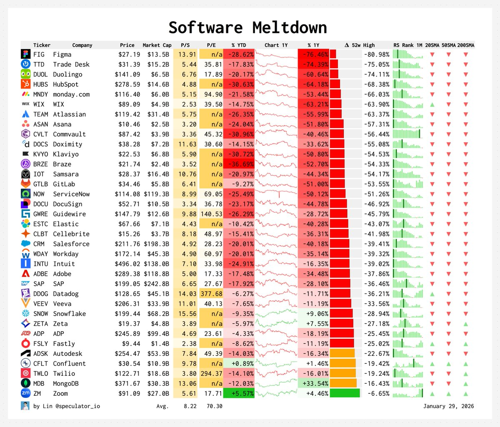
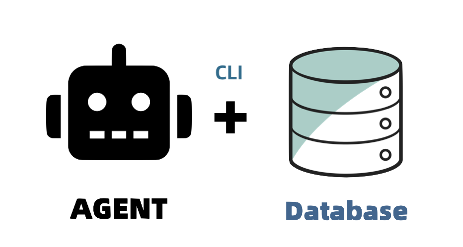

## I. The Great Software Meltdown

The software world is witnessing an epic valuation collapse.



This isn't about individual companies tanking. This is a systemic implosion of the entire SaaS sector. Wall Street is voting with real money: **these software companies' business models are getting the death sentence.**

Why?

Because the capital markets finally realized something: most SaaS products are essentially "pretty skins over databases." A CRUD backend, some business logic, wrapped in a nice UI.

And all three of those things? AI Agents can do them. Faster, cheaper, and more personalized.

In early 2025, Microsoft CEO Nadella declared: **["SaaS is Dead"](/db/ai-agent-era)**.

Many dismissed it as hyperbole. A year later, the market has spoken.

Similarly, the AI assistant Clawdbot went viral recently, giving everyone a visceral feel for what "Agent replaces App" actually looks like.
Clawdbot's creator [Peter Steinberger](https://steipete.me/) put it bluntly:

> "[Apps will melt away. The prompt is your new interface.](https://mastodon.social/@steipete/115928636716067050)"

A trillion-dollar company's CEO and an indie dev behind a viral AI assistant, pointing to the same conclusion:

**The software stack is undergoing "entropy reduction." The middle layers are getting squashed. What remains: Agent + Database.**

PostgreSQL is eating the database world. Claude Code and Clawdbot are pioneering the Agent world.

Everything in between—frontend, backend, middleware, SaaS subscriptions, workflow software—is being squeezed, devoured, dissolved. All that's left is CLI.

This isn't prophecy. This is happening now.


------

## II. The Death of the Middle Layer

Why is the middle layer getting squashed? Let's look at the traditional software stack:

| Layer      | Component       | Purpose                                             |
|------------|-----------------|-----------------------------------------------------|
| User       | Humans          | End users of the system                             |
| Frontend   | React/Vue       | Translates data into UI, actions into requests      |
| Backend    | Node/Go/Java    | Translates requests into SQL                        |
| Middleware | Redis/Kafka/... | Patches for when translation isn't efficient enough |
| Database   | PostgreSQL...   | Where data actually lives                           |

What's the essence of those middle layers? **Translation layers.**

Frontend translates data into something humans can grok. Backend translates operations into SQL the database can execute. Middleware? Performance patches and decoupling hacks for when the translation pipeline bottlenecks.

Here's the million-dollar question: **If there's a "universal translator" that converts natural language directly into database operations, do we even need these middle layers?**

This is the software stack of the Agent era:



Where's the middle layer? **Squashed.**

Users don't need to learn some App's UI paradigm. Don't need to reverse-engineer the backend API's design intent. Just say what you want in natural language, Agent translates to SQL, data goes in and out of the database directly.

That's what "**SaaS is Dead**" really means — **apps that are just "database wrappers" will vanish.**

Steinberger gave an example: fitness apps — [calorie tracking](https://www.macstories.net/stories/clawdbot-showed-me-what-the-future-of-personal-ai-assistants-looks-like/).

Traditional flow: Open MyFitnessPal → Search food → Manual entry → Calculate calories → Display results.

Agent flow: Snap a photo, say "calculate this meal's calories and update my fitness plan." Done.

**Zero "App interface" in the whole process. The Agent IS the interface.**


------

## III. The Unexpected Victory of CLI

When the software middle layer gets squashed, the next question emerges: **What interface do Agents and databases use to talk to each other?**

The answer is CLI — **command-line tools.** The death of translation layers ignites the CLI renaissance.

To understand this, we need to answer a fundamental question: **Who are interfaces designed for?**

- GUI serves humans, leveraging visual cognition to translate operations into buttons and icons;
- API serves developers, abstracting capabilities into function calls;
- CLI is text-native by design—text in, text out, pipe them together at will.

AI Agents are fundamentally **inference engines that take text as input and produce text as output.**

CLI and LLMs are a match made in heaven. When an Agent wields a self-describing, structured, composable CLI toolkit, efficiency skyrockets.

Before Clawdbot went viral, Steinberger spent tons of time building countless command-line tools. As he [explained](https://steipete.me/posts/just-talk-to-it):

> "GUIs don't scale. CLIs do."

The logic is simple: give an Agent a CLI tool, it can figure out capabilities via `--help` on its own.
Plus, CLI naturally supports chaining and reuse—exactly what Agents excel at: "tool orchestration." A single Bash session can unleash the full **composability** of these tools.

**Context window economics** plays a role too—Agent attention bandwidth is finite, every token costs money.
Rather than stuffing complete docs into context, just call CLI `--help` when needed. CLI's "fetch on demand" beats "load everything" every time.

**Unix was born in 1969. Small tools, text streams, composability—this philosophy is being vindicated by AI Agents 55 years later.**


------

## IV. Agent-Native CLI

In the Agent era, command-line tools are about to be reborn.

Take database operations: what tool should an Agent use to operate PostgreSQL? A custom MCP adapter? Nope, it'll just use `psql`.

`psql` is one of the greatest CLI tools ever built. It's helped human DBAs wrangle PostgreSQL for decades.
But it's old, and it assumes the user is human: output is human-readable tables, error messages assume readers understand line numbers and constraint names, interactive mode depends on "human types → waits for result → human decides next step."

These assumptions completely break down for Agents.

Consider this concrete comparison. Traditional human-designed CLI error output:

```bash
ERROR: duplicate key value violates unique constraint "users_pkey"
DETAIL: Key (id)=(42) already exists.
```

The Agent-native version gives machine-friendly structured output:

```json
{
  "error": "duplicate_key",
  "constraint": "users_pkey",
  "table": "users",
  "column": "id",
  "value": 42,
  "suggestion": "use ON CONFLICT clause or check existing records before insert"
}
```

Human DBAs grok the first version instantly. But Agents need to parse natural language and guess the fix. With the second version, Agents can directly read error type, locate the issue, and execute the suggested fix.

**Every existing CLI tool deserves a redo for the Agent era.**

This isn't minor parameter tweaks—it's a fundamental restructuring of the translation layer interface—three levels deep:

1. **Output format**: Default to JSON or other machine-friendly formats, not pretty tables that waste tokens
2. **Cognitive load**: Interface should self-describe commands, parameters, permissions—no need to stuff entire manuals into context
3. **Feedback loops**: Structured error codes, cause hints, fix suggestions—Agents shouldn't blindly guess from vague error messages

Such interfaces will look like CLI, but they're no longer CLI for human devs—they're a new generation interaction layer polished for Agents — **Agent Native CLI**.

> I'm also exploring what Agentic CLI for PostgreSQL management should look like: [**PIG**](https://pigsty.io/docs/pig).


------

## V. GUI Won't Die, But It Will Transform

CLI is rising. Will graphical interfaces disappear?

**No. But their role will be rewritten.**

**First, visual output is irreplaceable.** Art creation, map navigation, monitoring dashboards—these scenarios' best medium is always visual.
Compressing this information into pure text wastes human perceptual bandwidth. Ops folks would rather "glance and know" system state than listen to an Agent recite numbers.

**Second, GUI is a prompting system.** Layouts, buttons, forms, dropdowns—these visual elements tell users "you can do this."
This layer of "visual prompts" dramatically lowers the barrier to asking questions. Facing a blank dialog box, even the smartest Agent can't help you realize what you should be asking for.

In a world where Agents handle intent and CLI handles execution, GUI is no longer a pretty skin over databases—it's the **prompting canvas** and **results display layer**:
It summarizes Agent suggestions, transforms complex state into visual layers, provides structured review of conversation history. GUIs that fully leverage human visual cognition will persist.


------

## Conclusion: The Starting Point of a Paradigm Shift

What's the endgame for software form factors?

**Agent + Database.**

Database is the material foundation of information. Data has to live somewhere. Precise systems can't be replaced by fuzzy systems—that's part of software's irreducible essential complexity.

Agent is the universal translator of information. Understands intent, generates output, invokes tools. Everything in between—
Frontend, Backend, API, middleware—these are legacy translation patches. When translation capability is strong enough, patches get deleted.

CLI sits between the two, becoming the bridge between Agent and Database.

Fifty-five years ago, Unix designers couldn't have imagined their philosophy would be validated in the AI era.

Thirty years ago, database designers couldn't have imagined SQL would become the lingua franca between Agents and the data world.

**We're standing at the starting point of another paradigm shift.**

Translation layers are being squashed. Software form factors are changing.

Those who understand this trend will define the next generation of infrastructure.


## References

- [Nadella: SaaS is Dead: Software Starts from the Database](/db/ai-agent-era)
- [Peter Steinberger on Mastodon: "Apps will melt away"](https://mastodon.social/@steipete/115928636716067050)
- [MacStories: Clawdbot Showed Me What the Future of Personal AI Assistants Looks Like](https://www.macstories.net/stories/clawdbot-showed-me-what-the-future-of-personal-ai-assistants-looks-like/)
- [The Pragmatic Engineer: The creator of Clawd: "I ship code I don't read"](https://newsletter.pragmaticengineer.com/p/the-creator-of-clawd-i-ship-code)
- [Peter Steinberger: Just Talk To It - the no-bs Way of Agentic Engineering](https://steipete.me/posts/just-talk-to-it)
