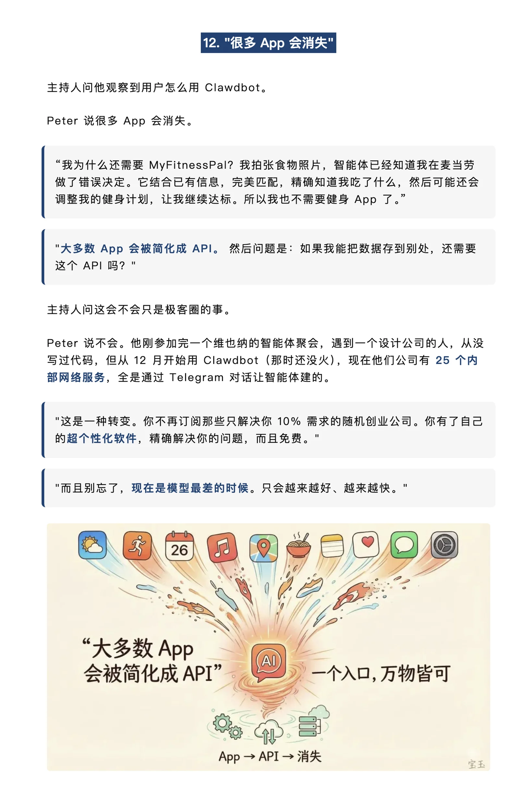
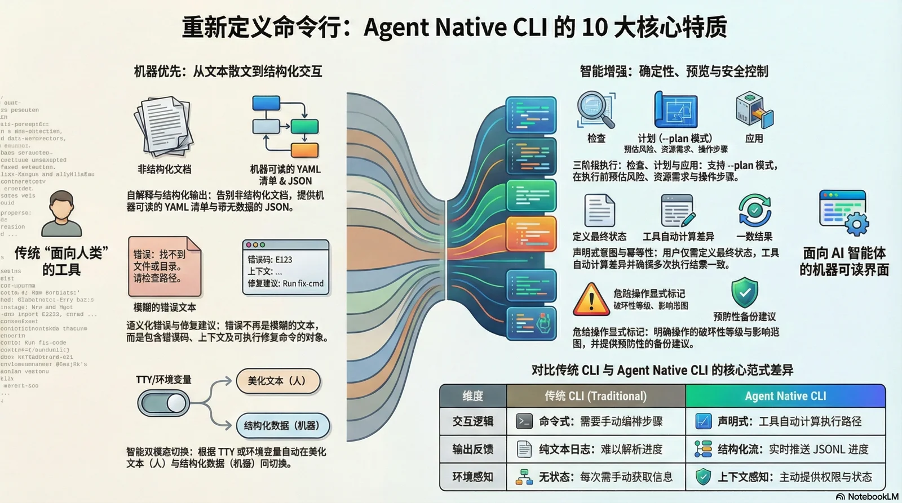

## 一、软件世界大熔断

软件世界正在经历一场史诗级的估值崩塌。


这不是个别公司的问题。这是整个 SaaS 板块的系统性崩盘。华尔街在用真金白银投票：**这些软件公司的商业模式，正在被判死刑。**

为什么？

因为资本市场终于意识到一件事：这些 SaaS 产品的本质，不过是 “数据库的漂亮皮肤” 。一个 CRUD 后台，加一套业务逻辑，再包一层好看的 UI。

而这三样东西，AI Agent 全都能做。而且做得更快、更便宜、更个性化。

2025年初，微软 CEO 纳德拉说：**[“SaaS is Dead”](/db/ai-agent-era)**。

当时很多人觉得是危言耸听。一年后，市场给出了答案。

同样，就在这两天爆火的 AI 助理 Clawdbot 让大家更为直观地感受到 Agent 代替 App 的体验到底是什么样子。
而 Clawdbot 的开发者 Steinberger 说得更直接：

> “[未来一大批应用都会消失。提示词就是新的界面](https://mp.weixin.qq.com/s/r6h6HkTLWM1GpKLXrRqnMQ)”

一个万亿市值公司的 CEO，一个爆火 AI 助理的独立开发者，指向同一个结论：

**软件栈正在经历 “熵减” 。中间层正在被压扁。最终剩下的，只有 Agent + Database。**

PostgreSQL 正在吞噬数据库世界。ClaudeCode 与 Clawdbot 正在开拓 Agent 世界。

两者之间的一切——前端、后端、中间件、SaaS 订阅、流程软件 —— 都在被挤压、被吞噬、被消解，最后只剩下 CLI。

这不是预言。这是正在发生的事。


------

## 二、中间层的消亡

为什么中间层会被压扁？先看传统软件栈的本质：

| 层次  | 组件              | 说明               |
|-----|-----------------|------------------|
| 用户  | 人类              | 使用软件系统的最终用户      |
| 前端  | React/Vue       | 把数据翻译成界面，操作翻译为请求 |
| 后端  | Node/Go/Java    | 把请求翻译成 SQL       |
| 中间件 | Redis/Kafka/... | 翻译效率不足时打的补丁      |
| 数据库 | PostgreSQL...   | 数据的最终归宿          |

中间那几层的本质是什么？**翻译层**。

Frontend 把数据翻译成人类能看懂的界面；Backend 把操作翻译成数据库能执行的 SQL；中间件是翻译效率不足时打的性能补丁和解耦补丁。

现在问题来了：**如果有个 “超级翻译器” ，能直接把自然语言翻译成数据库操作，这些中间层还有必要吗？**

这是 Agent 时代的软件栈：


中间层呢？**压扁了。**

用户不需要学某个 App 的 UI 逻辑，不需要理解后端 API 的设计意图。用自然语言说出想要什么，Agent 翻译成 SQL，直接从数据库存取数据。

这就是 “**SaaS is Dead**” 的真正含义 —— **那些只是 “数据库套壳” 的应用会消失。**

Steinberger 举了个例子：健身 App ——  [热量计算](https://mp.weixin.qq.com/s/r6h6HkTLWM1GpKLXrRqnMQ)。

传统流程：打开 MyFitnessPal → 搜索食物 → 手动输入 → 计算卡路里 → 显示结果。

Agent 流程：拍张照片，说 “算一下这顿饭的卡路里，更新我的健身计划” 。完事。

**整个过程没有任何 “App 界面” 。Agent 就是界面。**




------

## 三、CLI 的意外胜利

当软件的中间层被压扁，下一个问题就浮现了：**Agent 和数据库之间，靠什么界面交互？**

答案是 CLI —— **命令行工具**。翻译层的消亡，点燃了 CLI 的复兴。

要理解这一点，先要回答一个基础问题：**界面是为谁设计的？**

- GUI 服务于人类，利用视觉认知把操作翻译成按钮和图标；
- API 服务于程序员，把能力抽象成函数调用；
- CLI 天生面向文本处理，输入文本、输出文本，用管道自由组合。

AI Agent 本质上是**以文本为输入、以文本为输出的推理引擎**。
CLI 与 LLM 天生契合，当 Agent 握有一套自描述、结构化、可组合的命令行工具箱时，效率急剧提升。

在 Clawdbot 爆火前，Steinberger 花了大把的时间开发了无数命令行工具。他直言道：

> “GUI 扩展性差。真正具备扩展能力的是命令行。”

逻辑很朴素：给 Agent 一个 CLI 工具，它就能通过 `--help` 自行摸清能力；
而且 CLI 天然支持串联和复用，这恰好对应 Agent 擅长的 “工具编排”，一个 Bash 就能将这些工具的 **可组合性** 发挥到极致。

**上下文窗口经济学** 也在起作用 —— Agent 的注意力带宽有限，每个 Token 都要掏钱。
与其把完整文档塞进上下文，不如在需要时调用 CLI 询问参数。CLI 的 “按需获取” 远比 “全量加载” 更划算。

**Unix 诞生于 1969 年。小工具、文本流、可组合的哲学，在 55 年后被 AI Agent 再次发扬光大。


------

## 四、Agent 原生的 CLI

Agent 时代，命令行工具将迎来一场重生。

以数据库操作为例：Agent 应该用什么工具来操作 PostgreSQL？专门的 MCP 适配器？不，它会直接使用 `psql`。

`psql` 是命令行工具的巅峰作品之一，几十年来帮助人类 DBA 驾驭 PostgreSQL。
但它太老了，而且假定使用者是人类：输出是供人眼阅读的表格，错误信息默认读者理解行号和约束名，交互模式依赖"人输入 → 等结果 → 人决定下一步"。

这些假设放在 Agent 身上，统统失效。

看一个具体的对比，传统为人类设计的命令行，报错可能长这样：

```bash
ERROR: duplicate key value violates unique constraint "users_pkey"
DETAIL: Key (id)=(42) already exists.
```

而 Agent 原生的版本，会给出对机器更友好的结构化输出：

```json
{
  "error": "duplicate_key",
  "constraint": "users_pkey", 
  "table": "users",
  "column": "id",
  "value": 42,
  "suggestion": "use ON CONFLICT clause or check existing records before insert"
}
```

人类 DBA 看第一个版本，一眼就懂；但 Agent 需要解析自然语言、推测修复策略。第二个版本，Agent 可以直接读取错误类型、定位问题、执行修复建议。

**现有的命令行工具，都值得在 Agent 时代重新做一遍。**

这不是参数上的小修小补，而是翻译层形态的彻底重构 —— 三层递进的重构：

1. **输出格式**：默认返回 JSON 或其他机器友好格式，而非漂亮却浪费 Token 的表格
2. **认知负载**：接口应自我介绍命令、参数、权限，Agent 无须把整本手册塞进上下文
3. **反馈闭环**：结构化错误码、成因提示、修复建议，让 Agent 不再在模糊报错里盲猜

这样的接口会长得像命令行，但已不是服务于人类开发者的 CLI，而是为 Agent 打磨的新一代交互层 —— **Agent Native CLI**。



> 老冯也在摸索，PostgreSQL 管理的 Agentic CLI 应该是什么样子：[**PIG**](https://pigsty.cc/docs/pig)，欢迎尝试。


------

## 五、GUI 不会死，但会变

CLI 崛起了，图形界面会消失吗？

**不会。但它的角色将被改写。**

**第一，视觉输出不可替代。** 艺术创作、地图导航、监控大盘——这些场景的最佳载体始终是图像。
把这些信息压成纯文本，是对人类感知力的浪费。运维更希望 “一眼扫过” 就看懂系统状态，而不是听 Agent 念一串数字。

**第二，GUI 是提示系统。** 布局、按钮、表单、下拉菜单——这些视觉元素告诉用户 “你可以这样做”。
这层 “视觉提示词” 极大降低了提问门槛。面对空白对话框，再聪明的 Agent 也无法帮你意识到自己应该提什么需求。

在 Agent 负责理解意图、CLI 负责执行的世界里，GUI 不再是数据库的漂亮皮肤，而是 **提示画布** 和 **结果展示层**：
它总结 Agent 的建议，把复杂状态转成可视化图层，提供对话历史的结构化回顾，能够充分利用人类视觉认知优势的 GUI 会继续存在。


------

## 结语：范式跃迁的起点

软件形态的终局是什么？

**Agent + Database。**

Database 是信息的物质基础。数据总要有地方存，精确系统无法被模糊系统取代 —— 这是不可规约软件本质复杂度的一部分。

Agent 是信息的万能翻译器。理解意图，生成输出，调用工具。中间的一切 —— 
Frontend、Backend、API、中间件——都是历史遗留的翻译补丁。当翻译能力足够强，补丁就会被删除。

CLI 介于两者中间，成为 Agent 与 Database 之间的桥梁。

五十五年前，Unix 设计者不会想到，他们的哲学会在 AI 时代被证明正确。

三十年前，数据库设计者不会想到，SQL 会成为 Agent 与数据世界的通用语言。

**我们正站在又一次范式跃迁的起点。**

翻译层正在被压扁。软件形态正在改变。

理解这个趋势的人，将定义下一个时代的基础设施。


## 参考

《[纳德拉：SaaS已死：软件从数据库开始](/db/ai-agent-era)》

[《微信公众号原文：软件世界大熔断：当翻译层被压扁》](https://mp.weixin.qq.com/s/7pS1DIswWusBTxtYDl5KGQ)
