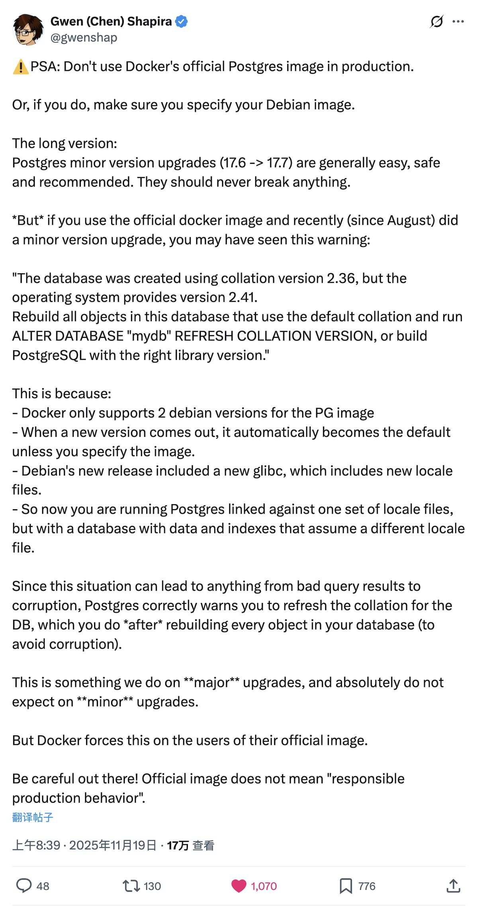
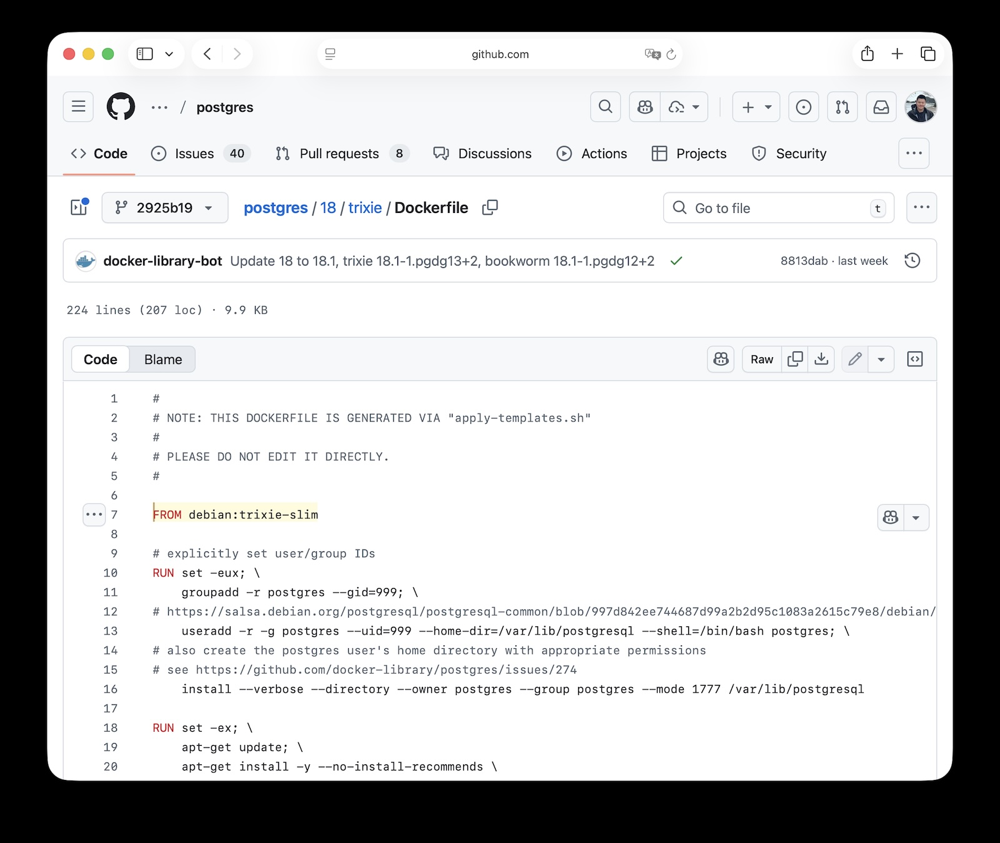
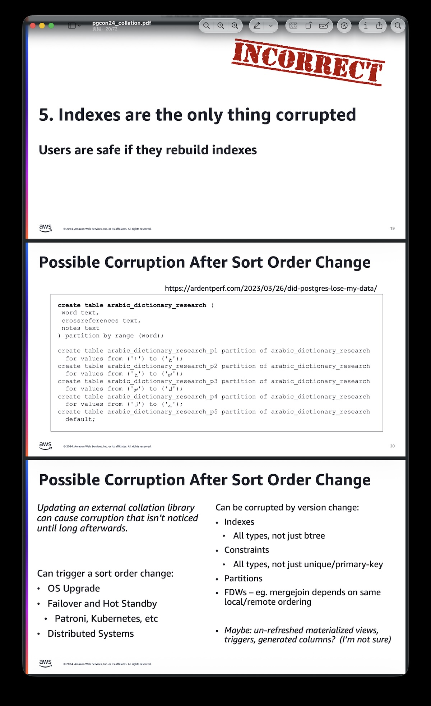
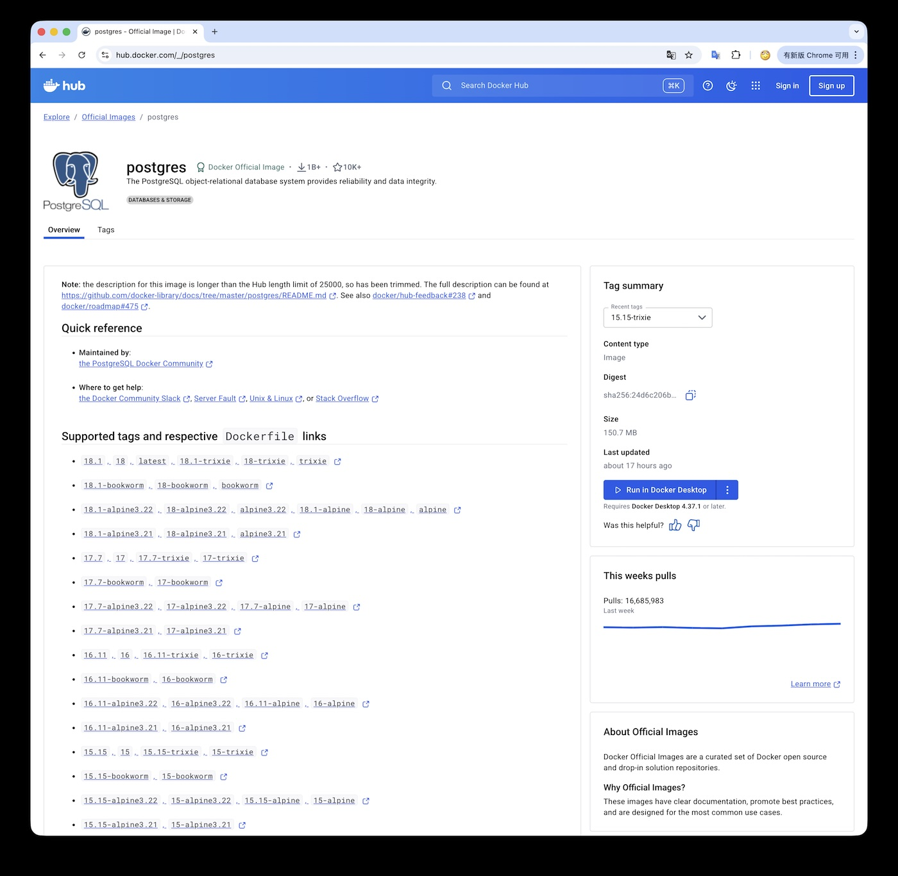
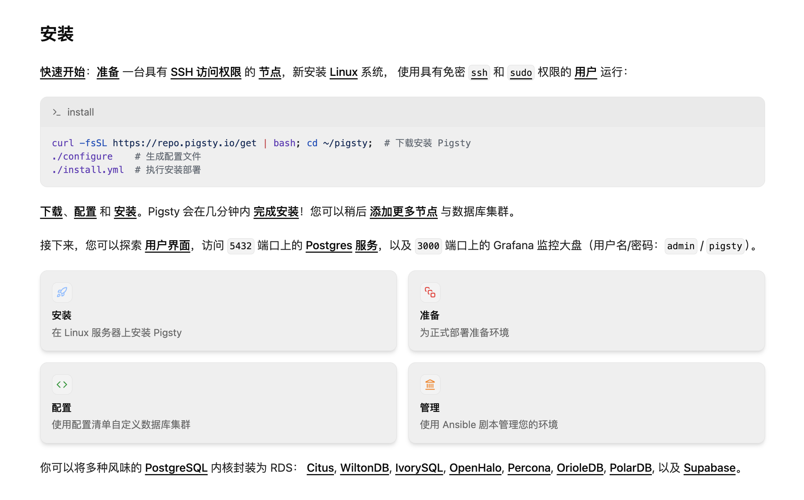
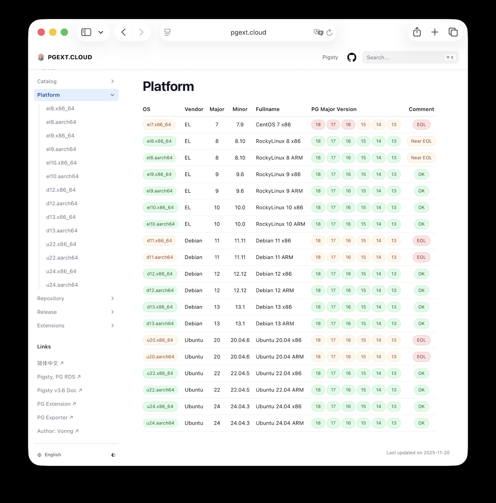

早在 2019 年，老冯就在《[把数据库放入 Docker 中是一个好主意吗？](https://mp.weixin.qq.com/s/kFftay1IokBDqyMuArqOpg)》提到过 —— 
**不要在生产环境用容器运行 PostgreSQL 数据库**，因为你有极大概率会遇上一堆在物理机/虚拟机上根本不存在的麻烦与问题。
这不，最近用 Docker “官方” 的 Postgres 镜像的用户在升级的时候就踩雷了。
昨天 PostgreSQL 社区的老法师 Gwen Shapira 在 X 发了个帖子吐槽了这个事。

> ⚠️重要提醒：不要在生产环境用 Docker 官方的 Postgres 镜像。 如果非要用，请务必显式指定 Debian 基础镜像版本。
> PostgreSQL 的小版本升级（比如 17.6 → 17.7）通常是 **安全、简单、推荐** 的，理论上 **绝不会破坏任何东西**。
>
> **但是** ，如果你使用的是 Docker 官方镜像，并在最近（8 月以来）做过小版本升级，你可能见过这样的警告：
> “数据库创建时使用的排序规则版本为 2.36，但当前操作系统提供的版本是 2.41。请重建所有使用默认排序规则的对象，并执行 `ALTER DATABASE "mydb" REFRESH COLLATION VERSION`，或使用正确版本的库重新构建 PostgreSQL。”
>
> **为什么会这样？原因其实很简单、也很离谱：**
> 1. Docker 官方 PG 镜像只支持 **两个 Debian 版本**
> 2. 当Debian发布新版本时，只要你没明确指定debian版本标签，它会 **自动变成新的默认基础镜像**
> 3. 新的 Debian 版本用了 **新版本的 glibc**
> 4. glibc 更新后，**locale（排序规则）文件发生变化**
>
> **于是你现在的状态变成：**
> * 运行的 PostgreSQL **链接的是一套 locale 文件**
> * 而数据库里的数据与索引 **是基于另一套旧的 locale 文件生成的**
>
> **PostgreSQL 很清楚这种混用会导致：**
> - 查询结果错误
> - 排序错误
> - 更严重时甚至会触发 **数据损坏**
>
> **因此它才会要求你：**
> - **重建所有受影响的对象**
> - 再执行 `ALTER DATABASE ... REFRESH COLLATION VERSION`
>
> 而这一套操作本来只有在 **大版本升级** 才需要做，谁都不会想到 **一个小版本升级** 居然要你重建整个数据库。
> 结果是：Docker 官方镜像强行把这东西甩到用户脸上：**小版本升级也可能触发 glibc/locale 变化。**
> 小心！官方镜像并不意味着 “负责任的生产环境表现”

想象一下，你用着 Docker 提供的 “官方” postgres 镜像，然后赶上这周的 PostgreSQL 最新小版本发布 —— 于是准备升级一个小版本。
PG 小版本升级难道不是很安全，很简单的吗？只要重新 pull 一下 latest 镜像（我猜相当一部分人是这么干的），
另外一部分稍微讲究一点的用户大概会使用 （17.6 -> 17.7）这样的方式来拉取最新镜像。如果是这样，那就完犊子了！

除非你使用的镜像 Tag ，严格包含了 Debian 版本号，也就是 17.6-bookworm 这样的版本号，否则在最近的小版本更新中实际 **隐含着一次 Linux 操作系统大版本升级**。
你以为自己是从 17.6 升级到 17.7 ，但实际上还一起把底下的操作系统从 Debian 12 升级到了 13！而这种计划外的原地升级会导致你的数据库索引原地报废！（或者更多！）

## 到底是怎么回事

Docker 官方提供的 PostgreSQL 镜像主要基于 Debian 系统镜像（也提供 Alpine 版本，只不过基本都用 debian 的）。
维护者指出这些镜像 **同时只支持两个 Debian 发行版**，当新的 Debian 稳定版发布时，就会**升级基础镜像到新版本并停止对最旧版本的支持**。

最近不是 Debian 13 trixie 刚发布了嘛，于是 Docker 官方把 `postgres` 这个镜像升级了一下，底层的 debian 系统镜像从 12 bookworm 升级到了 13 trixie。
结果底层 C 函数库 (glibc) 版本的出现跃迁 —— Debian 13的 glibc 版本从 12 的 2.36 升级到了 2.41，而在这两个 glibc 版本中，排序规则发生了变化，这就坏事了。

因为数据库索引的核心 —— 排序，是由排序规则定义的，而排序规则并非是一成不变的。
每当排序规则出现变化时，使用旧版本排序规则的数据库集群就需要重建 —— 至少是重建索引，否则的话就有可能出现 **数据损坏**。
生产环境的严肃数据库哪有不用索引的，结果就是至少在全库重建索引之前 —— “原地索引报废”，数据库性能雪崩。
最坏的情况下，还可能影响数据库约束，数据一致性，分区表的行为等等。

这个失误的影响范围会很大，在 DockerHub 上， postgres 镜像是下载量最大的镜像之一 —— 下载量已经超过十亿次，最近一周 pull 大约一千七百万次。
很多用户都是 `docker pull postgres` 一把梭的，就算指定了 17.6 这样的 PG 版本号， 只要没指定 Debian 版本号，也照样会翻车。

## 紧急应对措施

对于在生产环境中使用所谓 Docker 官方 "postgres" 容器的朋友，老冯的建议是，尽早把你的容器版本切换为锁定 PG + Debian 版本号的镜像（比如 17.6-bookworm）
，这件事至少要在下次小版本升级 / 或者是重新 Pull 之前完成。在进行升级的时候，也务必使用诸如 17.7-bookworm 这样的版本号。

另外，也不要妄想原地从 17.7-bookworm 直接飞升到 17.7-trixie。
任何涉及到 Glibc (Linux 发行版大版本) 的变动，标准 SOP 都是要逻辑迁移的 —— 要么通过逻辑复制蓝绿部署在线迁移，要么 pg_dump 逻辑转储。
除非你已经是聪明的 PG 老司机 —— 在初始化集群的时候就聪明的显式指定并选择了 [PG built-in locale provider with C/C-UTF8](https://www.postgresql.org/docs/current/app-initdb.html#APP-INITDB-OPTION-LOCALE-PROVIDER)。

当然从长期来看，最好还是迁移到物理机/虚拟机上的数据库部署方案更稳妥。
这一点老冯在《[数据库应该放入K8S里吗？](https://mp.weixin.qq.com/s/4a8Qy4O80xqsnytC4l9lRg)》以及
《[把数据库放入Docker是一个好主意吗？](https://mp.weixin.qq.com/s/kFftay1IokBDqyMuArqOpg)》 就已经展开过了 —— **越复杂的架构杂耍，翻车的时候摔的就越痛！**

如果你非要用容器不可的话，老冯的建议也是，找一个好点儿的三方 Docker Postgres 镜像，也比 “官方” 的这个土鳖镜像要好得多。

## 为什么排序规则很重要

那么，为什么会出现这个问题呢？老冯在《[PG中的本地化排序规则](https://vonng.com/pg/collate/)》就深入聊过这个问题。
简单的结论就是你应该始终使用 `C.UTF-8` 作为全局排序规则，同时在 PostgreSQL 17 之后的版本则应该强制使用 PG 内置的 locale provider，而不是使用操作系统 glibc 的排序规则。
真的要用到特定 Locale 规则的时候（什么汉语拼音排序之类的），直接在 DDL /  SQL 里面显式声明就可以，不影响使用的 —— 用 ICU 排序规则，不要使用操作系统的！

这里的原因是，（至少在 PG 17 之前）PostgreSQL **强依赖操作系统的本地化库** 来执行字符串比较排序，
这是 glibc 提供的一个核心功能，而 glibc 中排序规则是会变化的！
而 glibc 的版本都会在每次 Linux 发行版大版本升级的时候更新。
这就意味着对于生产环境来说，你通常不能把 A 系统上的 PG 物理文件直接拷贝到 B 系统上去运行
—— 除非你使用了 PG17 后的内置排序规则，而这并非默认设置。

> 在 `initdb` 的时候，使用 `--locale-provider=builtin` 以及 `--builtin-local=C.UTF-8` 这两个参数

在 2024 年的 PGConf.Dev 上，Jeremy Schneider 的 [Collations from A-Z](https://www.pgevents.ca/events/pgconfdev2024/sessions/session/95/slides/26/pgcon24_collation.pdf) 主题演讲就深入解释过这个问题。
PostgreSQL 开发组也意识到这确实是一个问题，所以在去年 PG 17 发布的时候，引入了一个新的特性，内置排序规则。也就是不再用操作系统 glibc 提供的排序规则了，不过只支持 C 和 C.UTF-8 这两种规则。
如果你想更深入的进一步了解这个主题，老冯非常建议你阅读这份材料。或者收看 [PGConf.Dev 2024 现场视频](https://www.youtube.com/watch?v=KTA6oau7tl8)。

> ### 排序规则的23个常见误区，以下全错！
>
> 1. 让字符排好序是一件简单的事情。
> 2. 人和电脑用的排序规则是不变的。
> 3. 改变排序规则是一件很罕见的事。
> 4. 改变排序规则总是有意进行的。
> 5. 排序规则只会搞烂索引
> 6. 搞烂的东西可以重建
> 7. 我的数据库没有用到奇怪语言中的字符，所以跟排序规则无关
> 8. 我的数据库能理解所有放在里面的字符
> 9. PG 的 “错误排序库版本” 警告总是能被某人看到
> 10. PG 总是能知道宿主系统使用的C标准库版本
> 11. 你可以把老的 glibc 代码里面的排序规则部分单拉出来，单独构建然后装到新系统上来解决问题
> 12. ICU 可以解决一切排序规则问题！
> 13. ICU 没有 glibc 2.28 fiasco 那样重大的排序规则变化
> 14. 假设 Devrim 和 Christoph 乐意替你构建老版本的 ICU
> 15. glibc 小版本/补丁版本不会修改排序规则
> 16. 库版本号不变，排序规则就不变
> 17. PG 还没有提供内置的Collation Provider，来解决上面所有的数据损坏危机
> 18. PG 的 C 和 C.UTF-8 排序规则是一回事儿
> 19. C.UTF-8 排序规则是不变的。
> 20. Collation Provider 只解决排序规则的问题。
> 21. C.UTF-8 里面的 CTYPE 是不变的
> 22. 用户想要DB级别的语言排序
> 23. PG不太可能有一个内置的排序规则来解决上面这些问题

令人欣慰的是，PostgreSQL 去年的 17 版本中引入了内置排序规则，解决了上面这些问题。
老冯的 PG 发行版 Pigsty 也相应地在 [v3.4.0](https://github.com/pgsty/pigsty/releases/tag/v3.4.0) 正式引入应用了这个特性。

—— 所有 PG 17 以上的集群都统一使用 built-in locale-provider，固定使用 C.UTF-8 排序规则。
对于 17 以下的版本，则使用操作系统的 C.UTF-8 排序规则，如果操作系统实在是搓到不支持 C.UTF-8 （真的有！），那就保底用 C 排序规则。

这样做的好处是，只要用这个内置排序规则，操作系统再怎么瞎搞，也不影响 PostgreSQL 的排序了。你即使升级了底层操作系统，也不用折腾什么索引重建，担心数据损坏了。

## 官方不等于“靠谱”

不过显然对于 PostgreSQL 专家属于 “常识性质的最佳实践”，并不是那么普及。
至少在 Docker 的 “官方 postgres 镜像” 上，就很缺少这些已知的 “最佳实践”。正如 Gwen 所说：有个 “官方” 俩字，并不代表 “**负责任的生产表现”**。

DockerHub 上的 postgres 镜像被广泛使用（据说是下载量最多的镜像），然而它的质量在 PostgreSQL 专家看来确实是相当令人堪忧的。
这个 “官方” 指的是 Docker 的 “官方”，而不是 PostgreSQL 社区。所以里面充斥的大量的反模式，使用起来非常难受。

说到底这个所谓官方镜像就是一个极其简陋的封装：用 apt 给你从 PGDG APT 仓库里安装一下，然后跑一个土法 init 脚本。
这个镜像，对于 POC，开发，测试，学习来说是基本够用了，但离生产环境的距离，可谓差着十万八千里。

## 生产数据库不宜使用容器

如果你用的是 Docker Postgres 容器，即使没有在这次的小版本升级上翻车，也有很大概率会在其他问题上翻车。
比如默认的 64 MB Shmem 共享内存段；直接写 Overlay FS；安装的扩展在从节点上消失；在一个卷上跑两个PG实例把数据烤糊；奇葩的从库搭建流程；

诸如此类在物理机/虚拟机上根本不存在的容器特有问题，老冯在《[把数据库放入Docker是一个好主意吗？](https://mp.weixin.qq.com/s/kFftay1IokBDqyMuArqOpg)》讨论过很多，
但显然社区还会不断出现新惊喜（吓），容器上运行数据库的状态，仍然没有达到裸 Linux 上运行的长期博弈均衡态。

像 Locale 配置这样的工程细节有许许多多，绝对不是 docker pull 一个所谓 “官方镜像” 能解决的。
老冯的 Pigsty 为了解决用好 PostgreSQL 的问题，光本身的纯代码就有近十万行，
这也显然不是 “官方镜像” 一个几百行 Shell/Dockerfile 脚本能 Cover 的问题。

实际上有一些第三方的 PostgreSQL over Kubernetes 供应商，他们提供的 PG 容器会比这个 “官方版” 要好得多。
但老实说，也依然会受到容器本身的掣肘 —— 一堆 K8S / Docker 大师吭哧吭哧优化半天，也很难赶上直接在 Linux 上裸奔的 PG。
对数据库老司机来说，确实有一种隔靴搔痒的感觉。

Docker 确实很方便，老冯也拿他跑无状态的服务，批量运行编译任务，有时候当廉价虚拟机测试，或者是简单测试一下数据库功能。
**但唯独在生产环境使用的时候，老冯会对用容器跑数据库坚定说 “不”** （—— 唯一的例外可能是 Redis）。

## 应该如何安装 PostgreSQL？

那么，如果不用容器，又应该如何安装部署 PostgreSQL 呢？

PostgreSQL 这样的数据库是与操作系统紧密联系的特殊软件。
最好的状态，**就是直接不带套运行在裸 Linux 上，简单，直接，稳定，可靠，没有额外的性能折损与管理负担**。

有很多人觉得这是一件很复杂的事情，好像又要折腾什么 YUM/APT 仓库，官方镜像太慢又要翻墙；
国内镜像站也全面断更《[从PG“断供”看软件供应链中的信任问题](https://mp.weixin.qq.com/s/SBVcO8fi5mK1Qnb3AWbqxQ)》，然后安装好了之后怎么配置调参优化也一筹莫展。
实际上这都已经是老黄历了。老冯的 [开源 PG 发行版 Pigsty](https://doc.pgsty.com/zh) 就是为了直接在 Linux 上运行企业级 PostgreSQL 服务而设计的。

目前，我在 Debian 12/13，Ubuntu 22/24，EL 8/9/10 ，ARM / x86 也就是 14 个主流 Linux 发行版上提供了原生的 PostgreSQL 内核（PG 13-18 六个大版本），8 款不同风味的 PG 内核分支，近百个生态工具与 430 个生态扩展。
并将其打造成一键部署安装拉起，自带监控高可用，PITR 的生产级方案。还提供了 PGDG 官方仓库的中国镜像，应该是目前国内唯一没有和 PGDG 断更的 PG 镜像站 ——  《[PG扩展云，免翻免费解锁PG完全体](https://mp.weixin.qq.com/s/oHHzhbbt5suSxnJhyxTwQQ)》

老实说，这可真是个苦力活儿。光打出来的 RPM/DEB 包就有大几万个。各种测试组合，上游变动，都需要照顾到。
老冯也想过 —— 做个 Docker 镜像呗，偷懒又省事，丢给用户，你爱在什么操作系统上跑就在什么系统上跑。
但作为一个也要给自己用的大规模生产方案，我还是决定要去做 “正确而艰难” 的事情，
—— 提供在 14 个主流 Linux 发行版上直接运行整个 PostgreSQL 生态的能力。

> 毕竟，“官方镜像” 也是用 APT 从仓库里安装的……

而且最棒的是，Pigsty 的扩展仓库和镜像仓库是独立的，如果你不喜欢用一个大而全的发行版，
你也可以直接免费使用我们的 [APT/YUM 仓库](https://pgext.cloud/zh/repo)，安装原生 PGDG 内核与上面所有这些工具与扩展。

当然， 广告就到这里。这一篇老冯聊了为什么 **不要在生产环境中用容器跑 PostgreSQL**。
下一篇，老冯会详细的介绍一下 PostgreSQL 安装实操 —— **如果不用容器，我应该怎么装 PG！**

------

## 参考阅读

**[把数据库放入 Kubernetes 是一个好主意吗？](https://mp.weixin.qq.com/s/4a8Qy4O80xqsnytC4l9lRg)**

**[把数据库放入Docker是一个好主意吗？](http://mp.weixin.qq.com/s?__biz=MzU5ODAyNTM5Ng==&mid=2247486572&idx=1&sn=274a51976bf8ae5974beb1d3173380c1&chksm=fe4b39b7c93cb0a14c4d99f8ffd1e00c36b972a8058fd99e9d06e6035c4f378b6d327892260b&scene=21#wechat_redirect)**

**[《Kubernetes创始人发声！K8s在被反噬！》](https://mp.weixin.qq.com/s/9Q9kze9D2LT0-G2lXSvADg)**

**[《Docker 的诅咒：曾以为它是终极解法，最后却是“罪大恶极”？》](https://mp.weixin.qq.com/s/EWCblHU-vDC3ebV6ITE45A)**

**[《从滴滴的故障我们能学到什么》](https://mp.weixin.qq.com/s/KFZCQFP1oB5YOrT3tHBRCQ)**

**[《PostgreSQL@K8s 性能优化记》](https://mp.weixin.qq.com/s/0kbWa6AnkCr5jkN4WIgu5Q)**

**[《Running Database on Kubernetes》](https://questdb.io/blog/databases-on-k8s/)**
