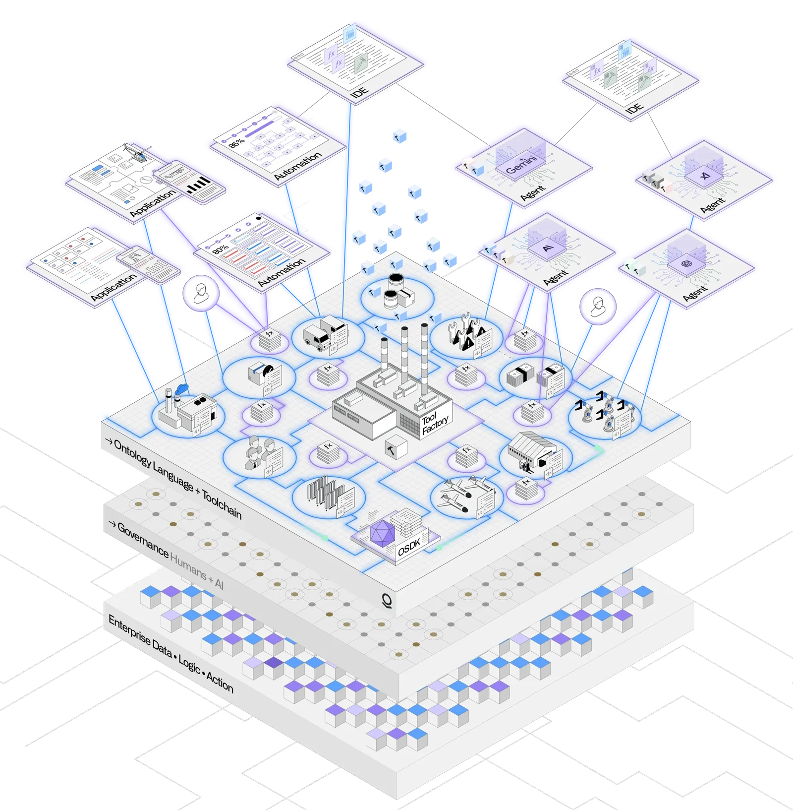
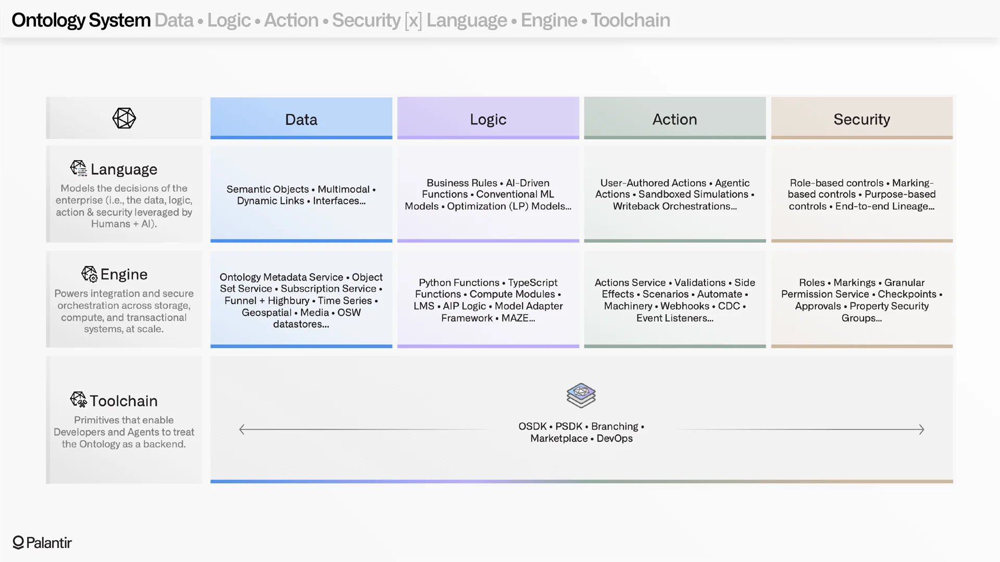
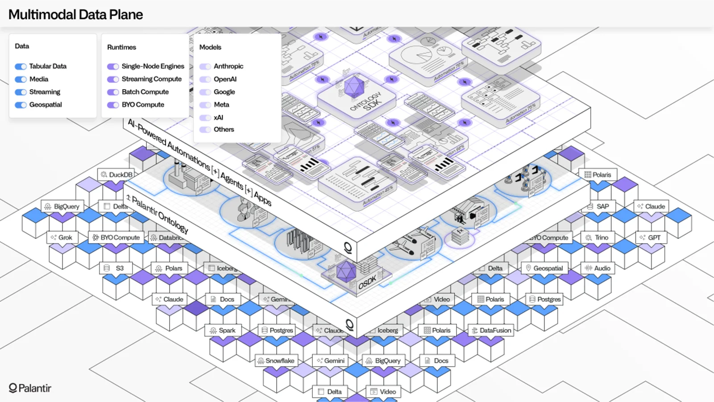

## I. Two Kinds of Faces

By late 2025, Palantir's market cap had blown past $400 billion — a 20x run in just two years.
Every roadshow, every whitepaper, every tech blog from this company hammers the same word: **Ontology**.

The word has been packaged as Palantir's core technical moat, its competitive barrier, its soul.
Investors nod reverently. Pentagon generals hear it and see the future of information warfare.
Enterprise executives hear it and feel that if they don't buy in, they'll be left behind.

> At an AI summit for enterprise CXOs, a Palantir sales VP put up a slide with "Ontology" in 72-point font.
> The executives in the audience nodded slowly — the classic "I don't quite get it but it sounds important" face.
> A few architects dragged along as technical chaperones exchanged glances. One leaned over and whispered:
>
> "Is he talking about tables and stored procedures?"
>
> His colleague studied the architecture diagram on the slide, paused for three seconds, and said: "...Yes."

This is Palantir's most elegant trick: weaponizing a term backed by 2,300 years of philosophical gravitas
to make non-technical decision-makers believe they're witnessing a breakthrough, while making the engineers
in the room unable to object — because you can't exactly tell the VP,
"Boss, they're selling us `CREATE TABLE`."

Lately I've seen too many people mystifying this concept, so today I'm going to point out
that the emperor has no clothes.

------

## II. The Rosetta Stone

Let's put the facts on the table. Palantir's Ontology has four core concepts:
**Object Type**, **Property**, **Link**, and **Action**.
Comb through every document, whitepaper, and investor deck they've ever published —
these four concepts are the foundation of everything.

Now look at this table:

| Philosophy           | Databases          | Object-Oriented     | Palantir    |
|----------------------|--------------------|---------------------|-------------|
| Category             | Table              | Class               | Object Type |
| Property             | Column             | Field               | Property    |
| Relation             | Foreign Key        | Association         | Link        |
| —                    | Stored Procedure   | Method              | Action      |
| Individual           | Row                | Object              | Object      |

Four columns. Four terminology systems. The same thing. Not "analogous." Not "similar." **Fully overlapping. Strictly isomorphic.**
Palantir's docs also define Interface (polymorphism), Function (code logic), and Virtual Table — which translate to Views, UDFs, and Materialized Views.

If you've taken a database modeling course, you already have complete mastery of Palantir's so-called "Ontology."
Nobody ever told you that what you learned in week two of your intro class could be wrapped in a philosophy term
and sold for millions per year.

Palantir's 2025 annual report discloses: the top 20 customers average **$93.9 million** each per year.
Across all 954 customers, the average is roughly **$4.7 million/year**.
That's the price tag on "tables and stored procedures."

------

## III. The Same Idea, Sold Five Times

Palantir didn't invent any of this. The same core idea has been repackaged repeatedly over 2,300 years.
Each time with a new name. Each time a new crop of people think it's a breakthrough.

**Round 1: 350 BC — Aristotle.**
In *Categories*, he proposed: the world is made of substances, substances have properties, substances have relations.
In SQL: `CREATE TABLE person (height INTEGER); teacher_id REFERENCES person(id)`.
This isn't an analogy. It's the same mental operation in a different notation.

**Round 2: 1976 — Peter Chen.**
Published the Entity-Relationship model. Entities, attributes, relationships.
Exactly what Aristotle said, except in rectangles and diamonds instead of Greek prose.
This paper spawned the entire relational database industry.
Every programmer who has ever written `CREATE TABLE` practices "Ontology" daily — nobody just told them
it had a philosophical name.

**Round 3: 1990s — The OOP Wave.**
Classes, properties, associations, methods. The same thing with a "behavior" dimension bolted on.
Databases jumped on the bandwagon too with the object-relational model.
That's why PostgreSQL's system catalog is called `pg_class` instead of `pg_table` — a fossil from that era.

**Round 4: 2001 — The Semantic Web.**
Tim Berners-Lee's vision. OWL's core concepts: classes, properties, relations, instances.
Structurally identical to the ER model. This is when "Ontology" officially entered computer science vocabulary.

**Round 5: 2016–present — Palantir Foundry.**
Object Type, Property, Link, Action.

Notice the pattern: **every "reinvention" rides a wave of market mania.**
The ER model spawned the relational database market. OOP spawned the Java frenzy.
The Semantic Web spawned an academic and startup bubble that subsequently popped.
Now Palantir's Ontology rides the AI narrative, catapulting the company from under $20B to over $400B in two years.

This isn't technological progress. It's conceptual reincarnation.
What changes each cycle isn't the idea — it's the wrapping paper, and the people willing to pay for wrapping paper.

------

## IV. The Cognitive Tax of a Philosophy Term

Let's talk about the wrapping paper itself.

"Ontology" — from Greek *on* (being) + *logos* (study) — literally "the study of being."
Aristotle explored it. Kant debated it. Heidegger wrote an entire book (*Being and Time*) to redefine it.
Just reading the Wikipedia entry takes half an hour and a strong coffee.

**This is the word's real power: it creates an information asymmetry.**

When a Palantir sales rep tells a manufacturing VP, "We use ontology to build your company's digital twin,"
the VP's inner monologue goes something like:
"Ontology? Sounds like some deep field of study. This must be cutting-edge technology I don't understand."

Now translate the same pitch into engineering language:
"We'll create your tables, define your columns, set up foreign keys, and write your stored procedures."
The VP's reaction becomes: "Isn't that what our IT department already does? Why would I pay tens of millions for that?"

**Same thing. Different name. Three orders of magnitude in price.** That's the cognitive tax of a philosophy term.

And here's the deeper irony: Palantir's use of "Ontology" is fundamentally **anti-philosophical**.
Real ontology explores open questions: "Where are the boundaries of existence?"
"Can categories ever be exhaustive?" These are fluid, uncertain inquiries.

Palantir's Ontology does the opposite. It freezes business entities into rigid Object Types,
cements relations into predefined Links, and locks operations into approval-driven Actions.
This isn't exploring the nature of being — **it's pouring concrete over reality**.

Data analyst Donald Farmer described a telling case on Substack:
in the '90s, he built a complete metadata ontology for a U.S. auto lending company.
Within months, the business team switched analytics tools and changed their credit risk models.
By the time the ontology team caught up, the business had moved again.
His conclusion: **an incomplete ontology isn't just behind — it's wrong. And a wrong ontology is more dangerous than no ontology at all.**

This is the fate of every rigid schema. But for Palantir, this isn't a problem — **it's the business model**.
Model out of date? Pay a few million to update it. Business changed? Buy another round of consulting.
The rigidity of Ontology isn't a flaw — it's a customer lock-in mechanism.

------

## V. A Few Lines of SQL vs. $30 Million

Let's drop from the conceptual level to the engineering level. Every core primitive of Palantir's Ontology
can be implemented in PostgreSQL with a handful of code.

Object Types, Properties, Links, Actions, access control, audit logging, cross-source federation (FDW) —
every capability trumpeted in Palantir's Ontology documentation is **natively supported by PostgreSQL**.
License fee: zero.

I can already hear the rebuttal: "Sure, a few lines of SQL can design a schema, but can it deliver
an end-to-end platform that a supply chain manager can actually use?"

Of course not. But that proves the point: **Palantir's value isn't in the Ontology concept — it's in everything outside of it.**
It's in building GUIs for non-technical users. In spending months on-site understanding business processes.
In navigating Pentagon procurement. None of these have anything to do with "Ontology."
They're product engineering, consulting services, and government relations.

Wrapping grunt work in a philosophy term — that's Palantir's core competency, and its most impressive illusion.

------

## VI. When the Money Flows, the Rationalizations Follow

At this point we have to address the obvious question: if the technology is this unremarkable,
how did Palantir reach a $300B+ market cap, $4.48B in annual revenue, and 56% year-over-year growth?

The answer isn't in the technology. **The answer is in Washington.**

Palantir was co-founded by Peter Thiel in 2003. Thiel isn't your average Silicon Valley investor.
He was one of Trump's earliest and most prominent tech-world backers, and a speaker at the
2016 Republican National Convention. Palantir's first outside investment came from the CIA's venture arm, In-Q-Tel.
From day one, this company's DNA has been **political relationships, not technology**.

Palantir's 2025 annual report states it plainly: **54% of revenue comes from government customers.**
The U.S. Army awarded Palantir a $458M battlefield intelligence contract.
The DoD signed a $1.3B ceiling contract for Project Maven AI.
ICE has committed over $248M in cumulative funding since 2011.
In 2025, under the Trump administration, Palantir landed a $30M contract to build ImmigrationOS for ICE —
a cross-agency database for tracking undocumented immigrants.

How were these contracts won? Through the technical superiority of "Ontology"?
Or through Peter Thiel's proximity to the White House? — Palantir spends roughly $5 million a year on political lobbying.

But Palantir won't tell investors in a roadshow: "Our core competitive advantage is Peter Thiel's political network."
Instead, they say: "Our core competitive advantage is **Ontology**."

**That's the real function of "Ontology": it's not a technical architecture — it's a narrative architecture.**
It lets a company that fundamentally wins deals through political connections and delivers through on-site manpower
look like a software platform company with an irreplaceable technical moat.
Think of it as the American version of "data middle platform" plus staff augmentation.

------

## VII. A Consulting Firm in SaaS Clothing

Palantir has a unique job title: **FDE** — Forward Deployed Engineer.
After a customer signs, Palantir dispatches an engineering team to the client's site to map business processes,
build data models, develop applications, and train users.

This is consulting. Or to put it more bluntly — "staff augmentation."
Palantir insists it's a software company, not a consulting firm.
Because software companies trade at 70x revenue, while consulting firms are lucky to get 2–3x.

Michael Burry, who shorted Palantir, zeroed in on this. He pointed out that Palantir classifies FDE labor costs
as "R&D" or "Sales & Marketing" expenses rather than cost of revenue.
If you applied Accenture's accounting standards, Palantir's famously high gross margins would shrink considerably.

A former FDE told Burry: **"Foundry isn't a perpetual license. You have to be trained to use it. Even then, you still need extensive ongoing support."**

What do those FDEs actually do on-site? Write ETL pipelines to move data from SAP to Foundry.
Debug Kafka connectors. Handle schema incompatibilities between Oracle and Snowflake.
Explain to business users why a Link definition needs to change.
**The essence of this work is data integration and glue code** — the most labor-intensive,
context-dependent drudgery in all of software engineering.

Every engineer who's done an enterprise data warehouse project knows this kind of work:
exhausting, tedious, no silver bullet. Thousands of system integrators worldwide do exactly the same thing.
Accenture does it. Deloitte does it. Infosys does it.
The difference? They don't wrap the grunt work in the word "Ontology" — so their valuation multiples
are a fraction of Palantir's.

**The conceptual complexity of Ontology serves this business model perfectly.**
If you call Object Types "tables" and Actions "stored procedures," the client's IT department will say,
"We can do this ourselves." But if you call it "Ontology," introduce a "semantic layer,"
a "kinetic layer," and a "dynamic layer," and make the modeling process require clicking through
a proprietary GUI for half an hour — then the client can never leave your FDEs behind.

**The harder the system is to use, the more dependent the customer becomes. The more arcane the concepts, the more indispensable the FDEs. This isn't a bug — it's a feature.**

Palantir's own numbers confirm this: in 2025, customer count grew 34%,
but average annual revenue from the top 20 customers grew 45%.
CEO Alex Karp said something revealing on the earnings call:
**"There will be unexplainable revenue growth in the future, but there will not be unexplainable customer count growth."**
Translation: we're not planning to win more customers — we're planning to extract more money from the ones we have.

That's a consulting firm's growth model, not a software platform's.

------

## VIII. The Ontology Buyer Profile

Who actually buys Palantir?

Look at the customer list: U.S. Army, ICE, CDC, NHS, Airbus, BP.
These organizations share a few key traits:

**First, the decision-makers don't understand technology.**
A Pentagon procurement officer doesn't know what a foreign key is.
NHS management doesn't care how your ETL pipeline works.
What they need is a concept that sounds impressive enough
to justify a multi-million-dollar purchasing decision as "strategic."
"We implemented Palantir's ontology-driven digital twin platform"
looks infinitely better on any briefing deck than
"We hired a contractor to build us some tables."

**Second, they're spending other people's money.**
Government contracts are characterized by generous budgets and minimal technical auditing.
Nobody gets fired for spending $30 million on Palantir.
But if you propose building it yourself with open-source tools and something breaks, that's on you.
This is the modern version of "nobody ever got fired for buying IBM" —
except IBM is now Palantir, and the mainframe is now "Ontology."

**Third, once path dependency sets in, it's nearly impossible to reverse.**
Once your business model is encoded in Palantir's Ontology,
once your team is trained to think in Palantir's vocabulary,
once your Object Types aren't standard SQL tables,
your Actions aren't standard REST APIs,
and your entire semantic layer is locked inside a proprietary platform —
the cost of migration becomes prohibitive.
That's the secret behind Palantir's 134% net revenue retention rate.
It's not because the product is so good that customers voluntarily buy more.
It's because **lock-in** means buying more is the only option.

------

## IX. Summary

**What is Ontology?**
A modeling method with 2,300 years of history. A formal description of things, properties, relationships, and operations.
Every one of its core concepts maps one-to-one to database primitives.
The first three chapters of any database textbook cover all of it.
Palantir invented nothing new.

**What is Palantir's actual competitive advantage?**
Not Ontology. It's Peter Thiel's political network, the labor-intensive FDE on-site delivery model,
and the ability to create path dependency in government agencies and large enterprises.
Political connections, consulting, lock-in — none of these have anything to do with "Ontology."

**What is the real function of "Ontology"?**
It's a narrative device. It lets a company that is essentially a political-connections + consulting operation
enjoy top-tier SaaS valuation multiples in the capital markets.
It makes non-technical decision-makers believe they're buying some unfathomable "core technology"
rather than signing an overpriced systems integration contract.

In plain terms, what Palantir does is this: **take the work of writing ETL, creating tables,
and configuring permissions — work that thousands of engineers do every day —
slap on an Aristotelian label, and sell it at an AI-era valuation.**

It's like a Michelin-star restaurant listing on the menu:
"Deconstructed carbohydrate lattice with organic protein emulsion."
What arrives at your table is mac and cheese.
Mac and cheese can be great. But you can't call "deconstruction" your technical moat —
especially when the dish costs $90 million a year and Peter Thiel personally carries it to your table.

Next time you see a vendor drop "Ontology" into a pitch deck, be on your guard.
Nine times out of ten, it's smoke and mirrors.

------

*Note: Financial data cited in this article comes from Palantir's 2025 10-K annual report (SEC Filing),
MacroTrends, and OpenSecrets public records.
Michael Burry's short position information comes from his November 2025 SEC disclosure and subsequent Substack posts.*
