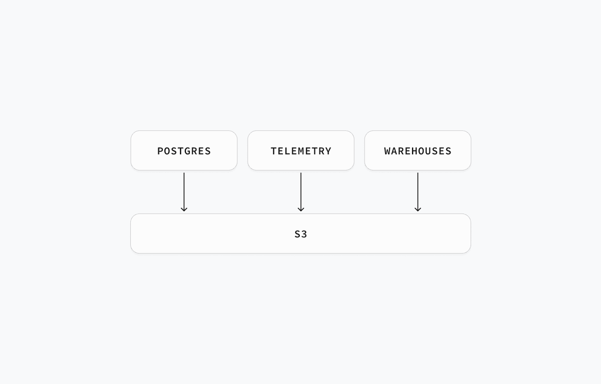
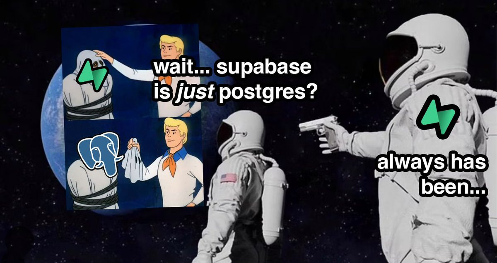

> 作者：Paul Copplestone，Supabase CEO 译者：冯若航，Pigsty Founder，数据库老司机
> 原文地址: https://supabase.com/blog/open-data-standards-postgres-otel-iceberg

数据世界正在浮出水面的三大新标准：Postgres、Open Telemetry，以及 Iceberg。

[Postgres](https://www.postgresql.org/) 基本已经是事实标准；[OTel](https://opentelemetry.io/) 和 [Iceberg](https://iceberg.apache.org/) 尚在成长， 但它们具备当年让 Postgres 走红的同样配方。常有人问我：“为什么最后是 Postgres 赢了？” 标准答案是“可扩展性” —— 对，但不完整。

除了产品本身优秀，Postgres 还踩中了开源生态爆点 —— 关键在于“开源的姿势”本身。

-------

## 开源的三个信条

我逐渐悟到，开发者判断一个项目“开源味”浓不浓，大致看三点：

  1. **许可证** ：是否为 [OSI 核准](https://opensource.org/licenses) 的开源协议。
  2. **自托管** ：能否把**完整产品** 端到端地自己部署。
  3. **商业化** ：有没有商业中立、无厂商绑架；更妙的是，有 **多家** 公司背书而非一家独大。

第三点我领悟得最慢 —— 是的，Postgres 赢在产品力，但更赢在 **“谁也控不住”** 。 治理结构与社区文化决定了它不可能被任何公司收编。它就像国际空间站，多家公司只能合作，因为谁都没本事说 “这就是我的”。

Postgres 点满了 “开源” 技能点，但它也并非在所有数据场景里都是银弹。

-------

## 三类数据角色

数据领域里主要有三种 “操盘手” 及其趁手工具：

  1. **OLTP 数据库** ：**开发者** 写应用用。
  2. **遥测 / 观测** ：**SRE** 运维基建、调优应用用。
  3. **OLAP / 数仓** ：**数据工程师 / 科学家** 挖掘洞见用。

数据生命周期通常是 `1 → 2 → 3`：先有应用，再加点基础遥测（很多时候直接塞进 OLTP 系统），等表长到塞不下，就得上数仓了。

三类角色各玩各的，但行业正整体“左移”：工具越发友好，观测与数仓也慢慢被开发者收编。SRE 和数据岗并非故意让贤，只是数据库本身越来越能打，创业团队能撑更久再招专家。

-------

## 三大开放数据标准

围绕以上三大场景，正冒出三套满足同样开源三信条的开放标准：

  1. **OLTP** ： PostgreSQL
  2. **遥测** ： Open Telemetry
  3. **OLAP** ： Iceberg

后两者更像“标准”而非“工具”，类似 HTML 与浏览器：大家约好格式，其他工具要么跟进要么淘汰。

标准往往草根起家，商业公司则陷入经典的 [颠覆式创新](https://en.wikipedia.org/wiki/Disruptive_innovation) 两难：

  * **不跟** ？潮流跑了，错过增长趋势。
  * **跟了** ？自家产品锁定度变低。

对开发者而言，这简直不能更香了 —— [我们坚信](https://supabase.com/docs/guides/getting-started/architecture#everything-is-portable)：**可迁移性会逼着厂商拼体验** 。

下面逐一展开深入探讨。

-------

### Postgres：开放式 OLTP 标准

Postgres 虽是一款数据库，却已成 **“标准接口”** 。 几乎所有新数据库都宣称“兼容 Postgres [wire 协议](https://www.postgresql.org/docs/current/protocol.html)”。 因为谁也管不了 Postgres，各大云厂商要么主动，要么被用户倒逼着上架 Postgres —— 连 Oracle Cloud 都供着。 体验差？一句 `pg_dump` 走人。Postgres 用 [PostgreSQL License](https://www.postgresql.org/about/licence/) —— 功能上和 MIT 相当。

-------

### OTel：开放式遥测标准

“open telemetry” 的名字是字面含义：开放遥测。[OTel](https://opentelemetry.io/) 仍年轻且[颇为复杂](https://news.ycombinator.com/item?id=42655102)，但契合开源三信条：Apache 2.0，厂商中立。 正如云厂商拥抱 Postgres，主流观测平台也在集体投 OTel，包括 [Datadog](https://docs.datadoghq.com/integrations/otel/)、[Honeycomb](https://docs.honeycomb.io/send-data/opentelemetry/)、[Grafana Labs](https://grafana.com/grafana/dashboards/15983-opentelemetry-collector/) 与 [Elastic](https://www.elastic.co/docs/solutions/observability/apm/use-opentelemetry-with-apm)。 想自托管？可选 [SigNoz](https://github.com/SigNoz/signoz)、[OpenObserve](https://github.com/openobserve/openobserve)，再不济用官方 [OTel 工具集](https://github.com/open-telemetry/opentelemetry-collector)。

-------

### Iceberg：开放式 OLAP 标准

[开放表格式](https://www.startdataengineering.com/post/what_why_table_format/) 算是新赛道：大家约定目录+元数据格式，任何计算引擎都能查询。 虽有 [DeltaLake](https://delta.io/)、[Hudi](https://hudi.apache.org/) 等对手，但目前 [Iceberg](https://iceberg.apache.org/) 已然领跑。

各大数仓陆续“投靠” Iceberg：包括 [Databricks](https://docs.databricks.com/aws/en/delta/uniform)、[Snowflake](https://docs.snowflake.com/en/user-guide/tables-iceberg) 和 [ClickHouse](https://clickhouse.com/docs/engines/table-engines/integrations/iceberg)。 最关键的商业推手是 AWS —— 2024 年底官宣 [S3 Tables](https://aws.amazon.com/blogs/aws/new-amazon-s3-tables-storage-optimized-for-analytics-workloads/)，在 S3 上提供开箱即用的 Iceberg。

-------

## S3：终极数据基础设施

对象存储很便宜，已成三大标准的基石。今天凡是数据工具，不是原生 S3 就是兼容 S3。

AWS S3 团队连环上新，把 “S3 当数据库” 的幻想推向现实。诸如 [Conditional Writes](https://aws.amazon.com/about-aws/whats-new/2024/08/amazon-s3-conditional-writes/) 和 [S3 Express](https://aws.amazon.com/blogs/aws/new-amazon-s3-express-one-zone-high-performance-storage-class/) —— 速度比普通 S3 快 10 倍，最近还 [逆天降价 85%](https://aws.amazon.com/blogs/aws/up-to-85-price-reductions-for-amazon-s3-express-one-zone/)。

不同场景对 S3 的姿势略有差异：

  * **OLTP** ：性能要命，S3 与 NVMe 永远隔着物理网线。因此重点是 Zero ETL & 分层存储：冷热数据自由搬迁。Postgres 现有多种读 Iceberg 的方式，如 [pg_mooncake](https://github.com/Mooncake-Labs/pg_mooncake)、[pg_duckdb](https://github.com/duckdb/pg_duckdb) 及 [Iceberg FDW](https://github.com/supabase/wrappers/pull/462)。
  * **遥测 / 数仓** ：关键字是“基数”。S3 越便宜，大家越把海量数据往里倒，催生“存算分离”的架构。于是出现一堆以计算层自居的嵌入式数据库：如 [DuckDB](https://duckdb.org/2021/10/29/duckdb-wasm.html)（OLAP）、SQLite 的[云后端存储](https://sqlite.org/cloudsqlite/doc/trunk/www/index.wiki)、[turbopuffer](https://turbopuffer.com/)（向量）、[SlateDB](https://slatedb.io/)（KV）、[Tonbo](https://tonbo.io/)（Arrow）。它们既可嵌入应用，也能单飞。

-------

## Supabase 的数据蓝图

大家知道 Supabase 是 Postgres 服务商，我们花了 5 年打造让开发者舒爽的数据库平台，这仍是主航道。

不同的是，我们不止做 Postgres（虽然[梗图](https://itsjustpostgres.com/)挺火）。我们还提供 [Supabase Storage](https://supabase.com/storage)，一套兼容 S3 的对象存储。未来，Supabase 聚焦的不是“一个数据库”，而是“所有数据”：

  * 给我们维护的所有开源工具加上 OTel。
  * 在 Supabase Storage 引入 Iceberg。
  * 在 [Supabase ETL](https://github.com/supabase/supabase_etl) 里打通 Postgres ↔ Iceberg 零 ETL。
  * 通过扩展和 FDW，让 Postgres 能读能写 Iceberg。

接下来，我们押注三大开放数据标准：**Postgres、OTel、Iceberg** 。敬请期待。

-------

## 老冯点评

Supabase 是我最欣赏的数据库创业公司，他们的创始人认知水平非常在线。 例如在三年前 OpenAI 插件带火向量数据库赛道之前，Supabase 就已经发掘出 pgvector 进行 RAG 的玩法了。

YC S20 的项目走过五年发展到今天，已经是估值 2B 的独角兽了。目前 YC 80% 的初创公司都在用 Supabase 起步。 目前有小道消息称 OpenAI 即将收购 Supabase，如果是真的，那他们也算功德圆满，实至名归。

## 关于 Postgres

老冯非常认同 Paul 的观点，Postgres 已经成为 OLTP 世界的事实标准。 但至少在当下，还有几件事是 PostgreSQL “不擅长” （不是做不到）的：

  * 遥测
  * 海量分析
  * 对象存储

所以如果你想要提供一个真正 “完全覆盖” 的数据基础设施，那么光有 PostgreSQL 是不行的。

我的意思是，你可以使用 TimescaleDB 扩展存储遥测数据，但体验与表现是比不上 Prometheus，VictoriaMetrics 的等专用 APM 组件的。 你确实可以用原生 PG，TimescaleDB，Citus，以及好几个 DuckDB 缝合扩展做数仓 —— 尽管我认为 DuckDB PG 缝合有潜力解决这个问题，但至少在当下，当数据量超过几十个 TB 时，专用数仓的性能依然还是压着 PG 打的。 有一些 “邪路” 可以将 PG 作为文件系统，例如 JuiceFS，但这仅适用于小规模的数据存储（也许几十GB？），海量 PB 级对象存储依然是原生 PG 所望尘莫及的。

至于其他的细分领域，比如向量数据库，文档数据库，地理空间数据库，时序数据库，消息队列，全文检索引擎，乃至是图数据库，PostgreSQL 都已经 “足够好” 了。 留给其他产品的只剩下一个极端场景专用组件的 Niche，不会再有其他这种体量的玩家出现了。

因此，在我做 Pigsty 的时候，也是用相同的思路构建的，以 PostgreSQL 为核心，以可观测性作为这个发行版的基石（Postgres in Grafana Style：这是最初的缩写），以同心圆的方式对外摊大饼。 用 MinIO 补足对象存储，用 DuckDB / Greenplum 补足数仓分析能力，最后用数量惊人的扩展插件来覆盖其他细分领域。

## 关于开源

Paul 说关于开源的三点精髓，第三点他领悟的是最慢的：

> 有没有商业中立、无厂商绑架；更妙的是，有 **多家** 公司背书而非一家独大。

其实我非常理解 Paul 的感受，在前两年，Supabase 的想法可能是 —— “我要占领开源道德高地，但是也要用 PG 扩展构建自己的商业壁垒。”

虽然 Supabase 提供了 Docker Compose 自建模板，但那个数据库容器镜像充其量就是个玩具，而且里面包含着隐藏的壁垒。 主要是他们自己用 Rust 写了几个扩展插件，这几个扩展插件虽然是开源的，但打包构建的知识并没有在社区普及 —— 你无法指望让用户自己去编译这些东西。

老冯就干了件 “缺德” 或者说 “有德” 的事（取决于厂家还是用户视角），把他们的扩展插件全都编译打包成了 10 大 Linux 主流系统下的 RPM/DEB 包， 这样你就可以真的在自己的 PostgreSQL 上自建 Supabase 了。我们还提供了一个模板，可以在一台裸服务器上自建 Supabase，目前是 Supabase 官方推荐的三个三方教程之一。

Supabase 还在想其他方法构建壁垒，例如他们去年收购了 OrioleDB，一个云原生，无膨胀的 PostgreSQL 存储引擎扩展（需要Patch内核）。 还没等正式 GA 上线，老冯就也已经打好了 OrioleDB 的 RPM/DEB 包，供用户自建使用了。

我估计 Paul 的心情是复杂的，一方面他想要将用户锁定在 Supabase 云服务上，看到别人真的用开源来拆台，心里肯定不爽。 但另一方面正是这些三方社区厂商的努力，反而让 Supabase 开枝散叶，不是一个 “只有我提供” 的东西，有了开源的醍醐味。 所以最后也释然了，坦然接受了这种现状。

但这件事也对老冯有所触动，我也开始思考，Pigsty 作为一个开源项目，是否也有类似的 “开源三信条”？

老实说，老冯很怀念全职创业前的那种状态，完全不考虑商业化，为了兴趣，热情，公益而开源，所以使用的是 Apache 2.0 协议。 后来因为拿投资人钱要有一个交代，所以把协议修改为更严格的 AGPLv3 ，目标是为了阻止云厂商与同行白嫖。 但既然现在我又成了数据库个体户，其实也是可以回到 Supabase 的这种状态 —— 用就用吧，反正我也不指望靠这个赚钱。

  * [←上一页](/blog/db/guru/)
  * 下一页→

最后修改 2025-05-27: [add new blog (18509bc)](https://github.com/pgsty/web.cc/commit/18509bc1c1af9bf2f3005fb5c8e1f82a4b399c25)