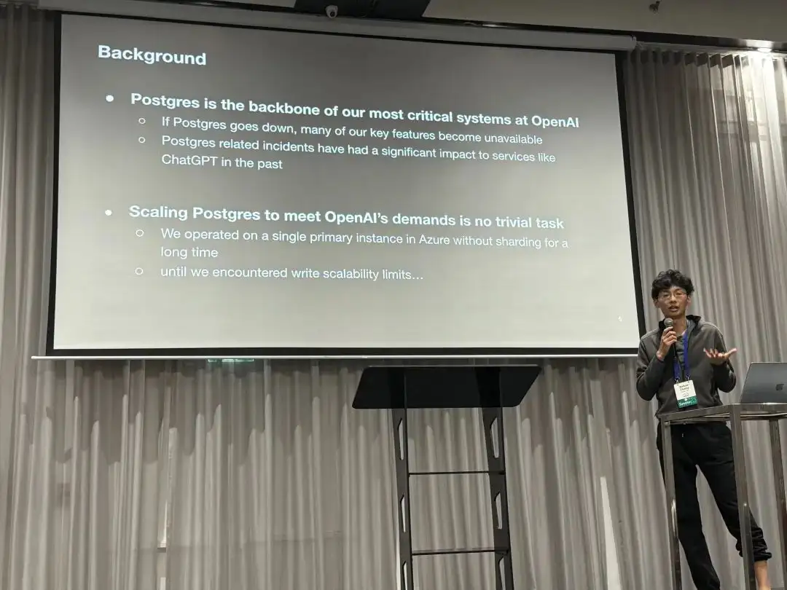
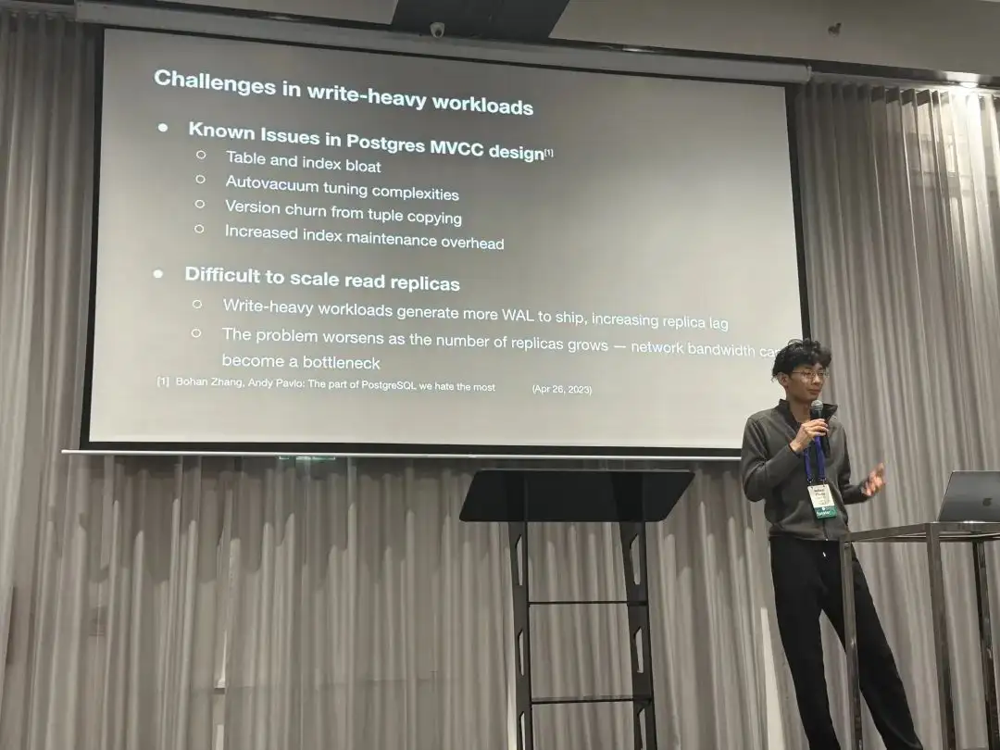
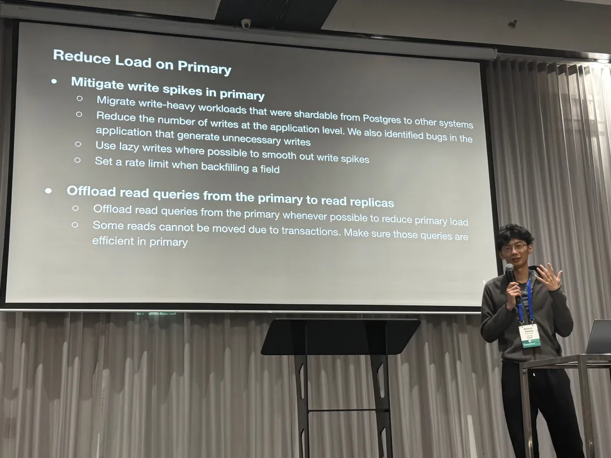
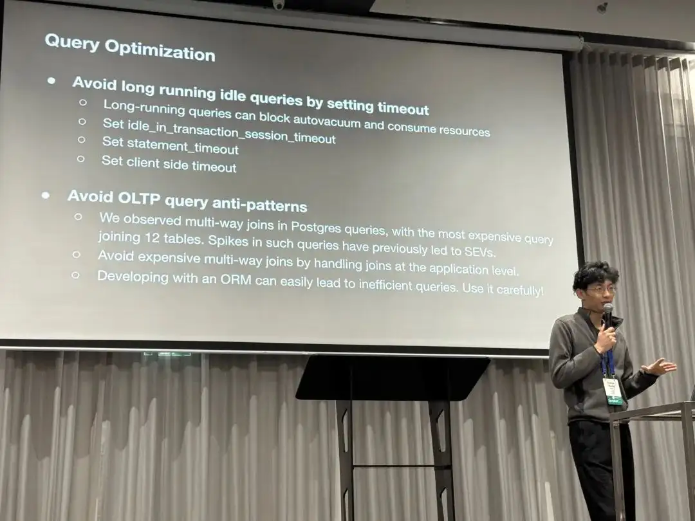
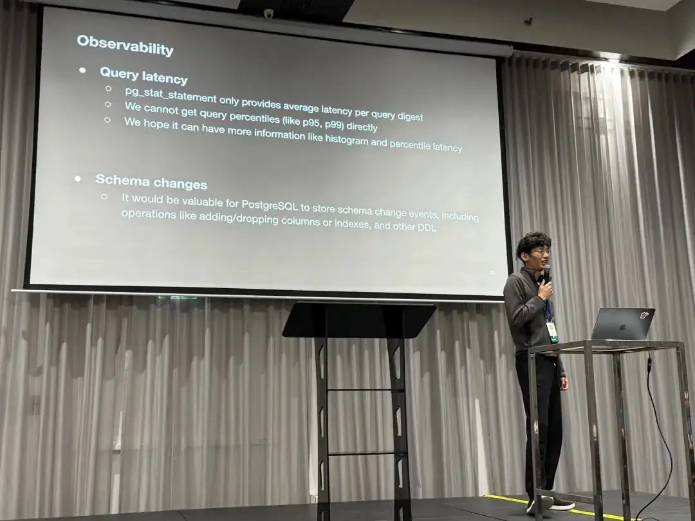
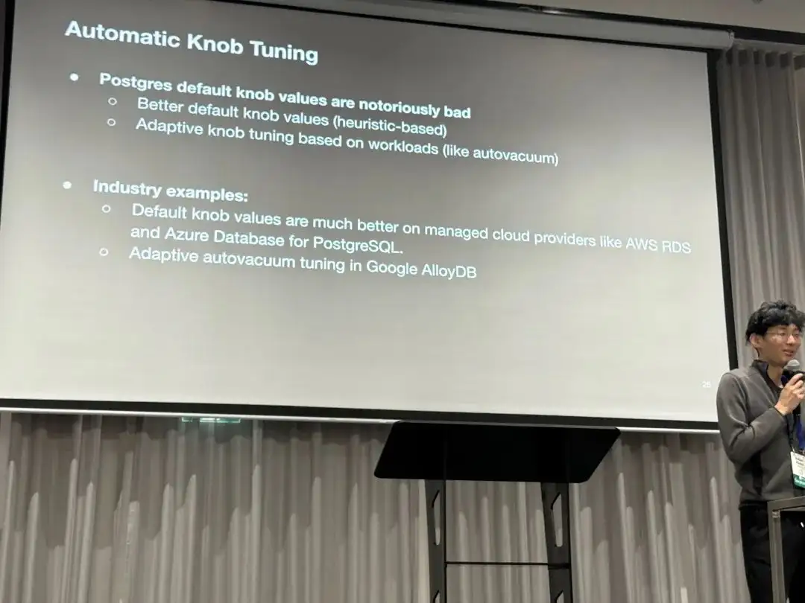
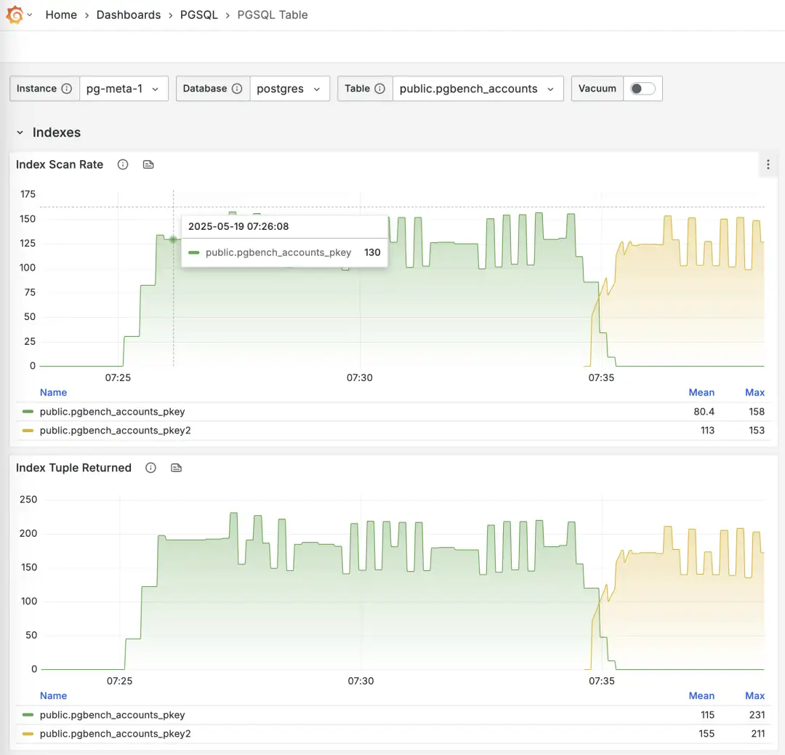

At [**PGConf.Dev 2025**](https://2025.pgconf.dev/schedule.html), [Bohan Zhang](https://www.linkedin.com/in/bohan-zhang-52b17714b) from OpenAI shared a session titled [Scaling Postgres to the next level at OpenAI](https://www.pgevents.ca/events/pgconfdev2025/schedule/session/433-scaling-postgres-to-the-next-level-at-openai/), giving us a peek into the database usage of a top-tier unicorn.

> “At OpenAl, we’ve proven that PostgreSQL can scale to support massive read-heavy workloads - even without sharding - using a single primary writer”
>
> —— Bohan Zhang from OpenAI, PGConf.Dev 2025


Bohan Zhang is a member of the OpenAI Infra team, student of [Andy Pavlo](https://www.cs.cmu.edu/~pavlo/), and co-found [OtterTune](https://github.com/OuterTune/OuterTune) with him.

> This article is based on Bohan’s presentation at the conference. with chinese translation/commentary by **Ruohang Feng** ([Vonng](https://github.com/Vonng/)): Author of [Pigsty](https://pigsty.io/). The original chinese version is available on [WeChat Column](https://mp.weixin.qq.com/s/ykrasJ2UeKZAMtHCmtG93Q) and [Pigsty CN Blog](https://pigsty.cc/db/openai-pg/).

> Hacker News Discussion: [OpenAI: Scaling Postgres to the Next Level](https://news.ycombinator.com/item?id=44071418#44072781)

------

## Background

**Postgres is the backbone of our most critical systems at OpenAl.** If Postgres goes down, many of OpenAI’s key features go down with it — and there’s plenty of precedent for this. PostgreSQL-related failures have caused several ChatGPT outages in the past.



OpenAI uses managed PostgreSQL databases on Azure, without sharding. Instead, they employ a classic primary-replica replication architecture with **one primary and over dozens of read replicas**. For a service with several hundred million active users like OpenAI, scalability is a major concern.

------

## Challenges

In OpenAI’s PostgreSQL architecture, read scalability is excellent, but “**write requests**” have become the primary bottleneck. OpenAI has already made many optimizations here, such as offloading write workloads wherever possible and avoiding placing new business logic into the main database.



PostgreSQL’s MVCC design has [some known issues](https://www.cs.cmu.edu/~pavlo/blog/2023/04/the-part-of-postgresql-we-hate-the-most.html), such as table and index bloat. Tuning autovacuum is complex, and every write generates a completely new version of a row. Index access might also require additional heap fetches for visibility checks. These design choices create challenges for scaling read replicas: for instance, more WAL typically leads to greater replication lag, and as the number of replicas grows, network bandwidth can become the new bottleneck.

------

## Measures

To tackle these issues, we’ve made efforts on multiple fronts:

### Reduce Load on Primary

The first optimization is to smooth out write spikes on the primary and minimize its load as much as possible, for example:

- Offloading all possible writes.
- Avoiding unnecessary writes at the application level.
- Using lazy writes to smooth out write bursts.
- Controlling the rate of data backfilling.

Additionally, OpenAI offloads as many read requests as possible to replicas. The few read requests that cannot be moved from the primary because they are part of read-write transactions are required to be as efficient as possible.



### Query Optimization

The second area is query-level optimization. Since long-running transactions can block garbage collection and consume resources, they use `timeout` settings to prevent long “idle in transaction” states and set session, statement, and client-level timeouts. They also optimized some multi-way JOIN queries (e.g., joining 12 tables at once). The talk specifically mentioned that using ORMs can easily lead to inefficient queries and should be used with caution.



### Mitigating Single Points of Failure

The primary is a single point of failure; if it goes down, writes are blocked. In contrast, we have many read-only replicas. If one fails, applications can still read from others. In fact, many critical requests are read-only, so even if the primary goes down, they can continue to serve reads.

Furthermore, we’ve distinguished between low-priority and high-priority requests. For high-priority requests, OpenAI allocates dedicated read-only replicas to prevent them from being impacted by low-priority ones.


### Schema Management

The fourth measure is to allow only lightweight schema changes on this cluster. This means:

- Creating new tables or adding new workloads to it is not allowed.
- Adding or removing columns is allowed (with a 5-second timeout), but any operation that requires a full table rewrite is forbidden.
- Creating or removing indexes is allowed, but must be done using `CONCURRENTLY`.

Another issue mentioned was that persistent long-running queries (>1s) would continuously block schema changes, eventually causing them to fail. The solution was to have the application optimize or move these slow queries to replicas.


------

## Results

- Scaled PostgreSQL on Azure to millions of QPS, supporting OpenAI’s critical services.
- Added dozens of replicas without increasing replication lag.
- Deployed read-only replicas to different geographical regions while maintaining low latency.
- Only one SEV0 incident related to PostgreSQL in the past nine months.
- Still have plenty of room for future growth.


> “At OpenAl, we’ve proven that PostgreSQL can scale to support massive read-heavy workloads - even without sharding - using a single primary writer”

------

## Case Studies

OpenAI also shared a few case studies of failures they’ve faced. The first was a cascading failure caused by a redis outage.


The second incident was more interesting: extremely high CPU usage triggered a bug where the WALSender process kept spin-looping instead of sending WAL to replicas, even after CPU levels returned to normal. This led to increased replication lag.


------

## Feature Suggestions

Finally, Bohan raised some questions and feature suggestions to the PostgreSQL developer community:

First, regarding **disabling indexes**. Unused indexes cause write amplification and extra maintenance overhead. They want to remove useless indexes, but to minimize risk, they wish for a feature to “disable” an index. This would allow them to monitor performance metrics to ensure everything is fine before actually dropping it.


Second is about **RT observability**. Currently, `pg_stat_statement` only provides the average response time for each query type, but doesn’t directly offer latency metrics like p95 or p99. They hope for more histogram-like and percentile latency metrics.



The third point is about **schema changes**. They want PostgreSQL to record a history of schema change events, such as adding/removing columns and other DDL operations.


The fourth case is about the **semantics of monitoring views**. They found a session with `state = 'active'` and `wait_event = 'ClientRead'` that lasted for over two hours. This means a connection remained active long after `query_start`, and such connections can’t be killed by the `idle_in_transaction_timeout`. They wanted to know if this is a bug and how to resolve it.



Finally, a suggestion for optimizing PostgreSQL’s **default parameters**. The default values are too conservative. Could better defaults be used, or perhaps a heuristic-based configuration rule?

------

## Vonng’s Commentary

Although PGConf.Dev 2025 is primarily focused on development, you often see use case presentations from users, like this one from OpenAI on their PostgreSQL scaling practices. These topics are actually quite interesting for core developers, as many of them don’t have a clear picture of how PostgreSQL is used in extreme scenarios, and these talks are very helpful.


Since late 2017, I managed dozens of PostgreSQL clusters at [Tantan](https://tantanapp.com/en), which was one of the largest and most complex PG deployments in the Chinese internet scene: dozens of PG clusters with around 2.5 million QPS. Back then, our largest core primary had a 1-primary-33-replica setup, with a single cluster handling around 400K QPS. The bottleneck was also on single-database writes, which we eventually solved with application-side sharding, similar to [Instagram’s approach](https://instagram-engineering.com/sharding-ids-at-instagram-1cf5a71e5a5c).

You could say I’ve encountered all the problems and used all the solutions OpenAI mentioned in their talk. Of course, the difference is that today’s [top-tier hardware](https://pigsty.io/cloud//bonus/) is orders of magnitude better than it was eight years ago. This allows a startup like OpenAI to serve its entire business with a single PostgreSQL cluster without sharding. This is undoubtedly another powerful piece of evidence for the argument that “[Distributed Databases Are a False Need](https://pigsty.io/db/distributive-bullshit/)”.

During the Q&A, I learned that OpenAI uses managed PostgreSQL on Azure with the highest available server hardware specs. They have dozens of replicas, including some in different geographical regions, and this behemoth cluster handles a total of about millions QPS. They use Datadog for monitoring, and the services access the RDS cluster from Kubernetes through a business-side PgBouncer connection pool.

As a strategic customer, the Azure PostgreSQL team provides them with dedicated support. But it’s clear that even with top-tier cloud database services, the customer needs to have sufficient knowledge and skill on the application and operations side. Even with the brainpower of OpenAI, they still stumble on some of the practical driving lessons of PostgreSQL.

During the social event after the conference, I had a great chat with Bohan and two other database founders until the wee hours. The off-the-record discussions were fascinating, but I can’t disclose more here, haha.


------

## Vonng’s Q&A

Regarding the questions and feature requests Bohan raised, I can offer some answers here.

Most of the features OpenAI wants already exist in the PostgreSQL ecosystem, they just might not be available in the vanilla PG kernel or in a managed cloud database environment.

------

### On Disabling Indexes

PostgreSQL actually has a “feature” to disable indexes. You just need to update the `indisvalid` field in the [`pg_index`](https://www.postgresql.org/docs/current/catalog-pg-index.html) system catalog to `false`. The planner will then stop using the index, but it will continue to be maintained during DML operations. In principle, there’s nothing wrong with this, as concurrent index creation uses these two flags (`isready`, `isvalid`). It’s not black magic.

However, I can understand why OpenAI can’t use this method: it’s an undocumented “internal detail” rather than a formal feature. But more importantly, **cloud databases usually don’t grant superuser privileges**, so you just can’t update the system catalog like this.

But back to the original need — fear of accidentally deleting an index. There’s a simpler solution: just confirm from monitoring view ([`pg_stat_all_indexes`](https://www.postgresql.org/docs/current/monitoring-stats.html#MONITORING-PG-STAT-ALL-INDEXES-VIEW)) that the index isn’t being used on either the primary or the replicas. If you know an index hasn’t been used for a long time, you can safely delete it.

> Monitoring index switch with [Pigsty](https://pigsty.io/about/observability/) [PGSQL TABLES](https://demo.pigsty.io/d/pgsql-tables?viewPanel=panel-354) Dashboard
>
> [](https://demo.pigsty.io/d/pgsql-tables?viewPanel=panel-354)

```sql
-- Create a new index
CREATE UNIQUE INDEX CONCURRENTLY pgbench_accounts_pkey2 ON pgbench_accounts USING BTREE(aid);

-- Mark the original index as invalid (not used), but still maintained. planner will not use it.
UPDATE pg_index SET indisvalid = false WHERE indexrelid = 'pgbench_accounts_pkey'::regclass;
```

------

### On Observability

Actually, [**`pg_stat_statements`**](https://pigsty.io/ext/stat/pg_stat_statements/) provides the `mean` and `stddev` metrics, which you can use with properties of the normal distribution to estimate percentile metrics. But this is only a rough estimate, and you need to reset the counters periodically, otherwise the effectiveness of the full historical statistics will degrade over time.

[](/pg/pgss/)

> RT Distribution with [PGSQL QUERY](https://demo.pigsty.io/d/pgsql-query) Dashboard from [PGSS](/pg/pgss/)

PGSS is unlikely to provide P95, P99 RT percentile metrics anytime soon, because it would increase the extension’s memory footprint by several dozen times. While that’s not a big deal for modern servers, it could be an issue in extremely conservative environments. I asked the maintainer of PGSS about this at the [Unconference](https://wiki.postgresql.org/wiki/PGConf.dev_2025_Developer_Unconference#The_Future_of_pg_stat_statements), and it’s unlikely to happen in the short term. I also asked Jelte, the maintainer of Pgbouncer, if this could be solved at the connection pool level, and a feature like that is not coming soon either.

However, there are other solutions to this problem. First, the [**`pg_stat_monitor`**](https://pigsty.io/ext/stat/pg_stat_monitor/) extension explicitly provides detailed percentile RT metrics, but you have to consider the performance impact of collecting these metrics on the cluster. A universal, non-intrusive method with no database performance overhead is to add query RT monitoring directly at the application’s Data Access Layer (DAL), but this requires cooperation and effort from the application side.

Also, using eBPF for side-channel collection of RT metrics is a great idea, but considering they’re using managed PostgreSQL on Azure, they won’t have server access, so that path is likely blocked.

------

### On Schema Change History

Actually, PostgreSQL’s logging already provides this option. You just need to set [**`log_statement`**](https://www.postgresql.org/docs/current/runtime-config-logging.html%23GUC-LOG-STATEMENT) to `ddl` (or the more advanced `mod` or `all`), and all DDL logs will be preserved. The [**`pgaudit`**](https://pigsty.io/ext/sec/pgaudit/) extension also provides similar functionality.

But I suspect what they really want isn’t DDL logs, but something like a system view that can be queried via SQL. In that case, another option is [`CREATE EVENT TRIGGER`](https://www.postgresql.org/docs/current/sql-createeventtrigger.html). You can use an event trigger to log DDL events directly into a data table. The [**`pg_ddl_historization`**](https://pigsty.io/ext/util/ddl_historization/) extension provides a more convenient way to do this, and I’ve compiled and packaged this extension as well.

Creating an event trigger also requires superuser privileges. AWS RDS has some special handling to allow this, but it seems that PostgreSQL on Azure does not support it.

------

### On Monitoring View Semantics

In OpenAI’s example, [**`pg_stat_activity.state`**](https://www.postgresql.org/docs/current/monitoring-stats.html%23MONITORING-PG-STAT-ACTIVITY-VIEW) = `active` means the backend process is still within the lifecycle of a single SQL statement. The [**`WaitEvent`**](https://www.postgresql.org/docs/current/monitoring-stats.html%23WAIT-EVENT-TABLE) = `ClientRead` means the process is on the CPU waiting for data from the client. When both appear together, a typical example is an idle `COPY FROM STDIN`, but it could also be TCP blocking or being stuck between `BIND` / `EXECUTE`. So it’s hard to say if it’s a bug without knowing what the connection is actually doing.

Some might argue that waiting for client I/O should be considered “idle” from a CPU perspective. But `state` tracks the execution state of the statement itself, not whether the CPU is busy. `state = 'active'` means the PostgreSQL backend considers “this statement is not yet finished.” Resources like row locks, buffer pins, snapshots, and file handles are considered “in use.” This doesn’t mean it’s running on the CPU. When the process is running on the CPU in a loop waiting for client data, the wait event is `ClientRead`. When it yields the CPU and “waits” in the background, the wait event is `NULL`.

But back to the problem itself, there are other solutions. For example, in Pigsty, when accessing PostgreSQL through HAProxy, we set a [connection timeout](https://github.com/pgsty/pigsty/blob/main/roles/haproxy/templates/haproxy.cfg.j2#L30) at the LB level for the primary service, defaulting to 24 hours. More stringent environments would have a shorter timeout, like 1 hour. This means any connection lasting over an hour would be terminated. Of course, this also needs to be configured with a corresponding max lifetime in the application-side connection pool, to proactively close connections rather than having them be cut off. For offline, read-only services, this parameter can be omitted to allow for ultra-long queries that might run for two or three days. This provides a safety net for these `active`-but-waiting-on-I/O situations.

But I also doubt whether Azure PostgreSQL offers this kind of control.

------

### On Default Parameters

PostgreSQL’s default parameters are quite conservative. For example, it [defaults to using 128 MB of memory](https://www.postgresql.org/docs/current/runtime-config-resource.html#GUC-SHARED-BUFFERS) (the minimum can be set to 128 KB!). On the bright side, this allows its default configuration to run in almost any environment. On the downside, I’ve actually seen a case of a production system with 1TB of physical memory running with the 128 MB default… (thanks to double buffering, it actually ran for a long time).

But overall, I think conservative defaults aren’t a bad thing. This issue can be solved in a more flexible, dynamic configuration process. RDS and Pigsty both provide pretty good [initial parameter heuristic config rules](https://github.com/pgsty/pigsty/blob/main/roles/pgsql/templates/oltp.yml#L13), which fully address this problem. But this feature could indeed be added to the PG command-line tools, for example, having [`initdb`](https://www.postgresql.org/docs/current/app-initdb.html) automatically detect CPU/memory count, disk size, and storage type and set optimized parameter values accordingly.

------

### Self-hosted PostgreSQL?

The challenges OpenAI raised are not really from PostgreSQL itself, but from the additional limitations of managed cloud services. One solution is to use the IaaS layer and self-host a PostgreSQL cluster on instances with local NVMe SSD storage to bypass these restrictions.

In fact, my project [Pigsty](https://pigsty.io/) built for ourselves to solve PostgreSQL challenges at a similar scale. It scales well, having supported Tantan’s 25K vCPU PostgreSQL cluster and 2.5M QPS. It includes solutions for all the problems mentioned above, and even for many that OpenAI hasn’t encountered yet. And in a self-hosting manner, open-source, free, and ready to use out of the box.

If OpenAI is interested, I’d certainly be happy to provide some help. But I think when you’re in a phase of hyper-growth, fiddling with database infra is probably not a high-priority item. Fortunately, they still have excellent PostgreSQL DBAs who can continue to forge these paths.

------

## References

[1] HackerNews OpenAI: Scaling Postgres to the Next Level: https://news.ycombinator.com/item?id=44071418#44072781

[2] PostgreSQL is eating the database world: https://pigsty.io/pg/pg-eat-db-world

[3] Chinese: Scaling Postgres to the Next Level at OpenAI https://pigsty.cc/db/openai-pg/

[4] The part of PostgreSQL we hate the most: https://www.cs.cmu.edu/~pavlo/blog/2023/04/the-part-of-postgresql-we-hate-the-most.html

[5] PGConf.Dev 2025: https://2025.pgconf.dev/schedule.html

[6] Schedule: Scaling Postgres to the next level at OpenAI: https://www.pgevents.ca/events/pgconfdev2025/schedule/session/433-scaling-postgres-to-the-next-level-at-openai/

[7] Bohan Zhang: https://www.linkedin.com/in/bohan-zhang-52b17714b

[8] Ruohang Feng / Vonng: https://github.com/Vonng/

[9] Pigsty: [https://pigsty.io](https://pigsty.io/)

[10] Instagram’s Sharding IDs: https://instagram-engineering.com/sharding-ids-at-instagram-1cf5a71e5a5c

[11] Reclaim hardware bouns: https://pigsty.io/cloud//bonus/

[12] Distributed Databases Are a False Need: https://pigsty.io/db/distributive-bullshit/

-
- 