在 [**PGConf.Dev 2025**](https://2025.pgconf.dev/schedule.html) 全球 PG 开发者大会上， 来自 OpenAI 的 [Bohan Zhang](https://www.linkedin.com/in/bohan-zhang-52b17714b) 分享了 [OpenAI 在 PostgreSQL 上的最佳实践](https://www.pgevents.ca/events/pgconfdev2025/schedule/session/433-scaling-postgres-to-the-next-level-at-openai/)， 让我们得以一窥最牛独角兽内部的数据库使用情况。

> “在 OpenAI，我们在使用一写多读的未分片架构，证明了 PostgreSQL 在海量读负载下也可以伸缩自如”
>
> —— PGConf.Dev 2025 Bohan Zhang from OpenAI

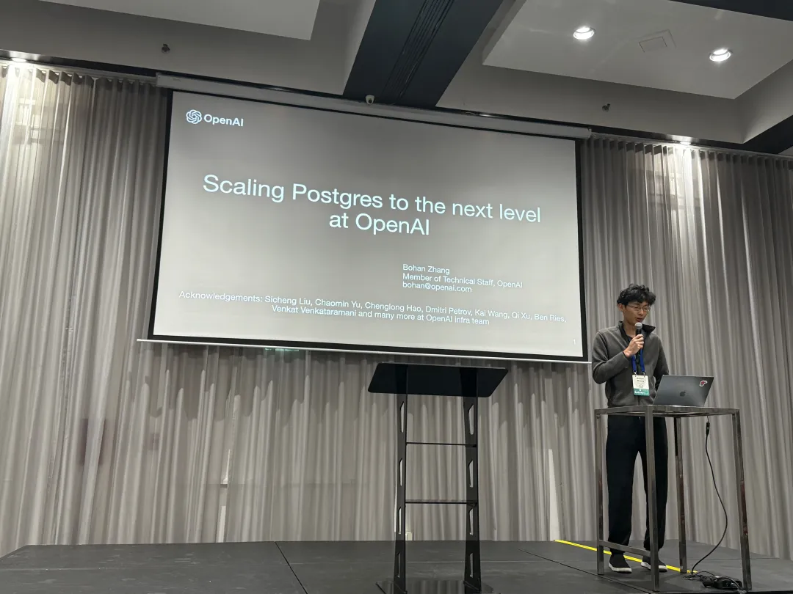

Bohan Zhang 是 OpenAI Infra 组成员，师从 CMU 网红教授 Andy Pavlo ，并与其共同创办了 OtterTune 。本文为 Bohan 在大会上的演讲。 中文翻译/点评 by [冯若航](https://vonng.com/)：[Pigsty](https://pigsty.cc/) 作者，PostgreSQL 老司机

> Hacker News Discussion: [OpenAI: Scaling Postgres to the Next Level](https://news.ycombinator.com/item?id=44071418#44072781)

------

## 背景

**PostgreSQL 是 OpenAI 绝大多数关键系统的核心支撑数据库**，如果 Postgres 挂了，OpenAI 的很多关键服务就直接宕掉了 —— 而这是有不少先例的，PostgreSQL 相关的故障曾经在过去导致多次 ChatGPT 的故障。

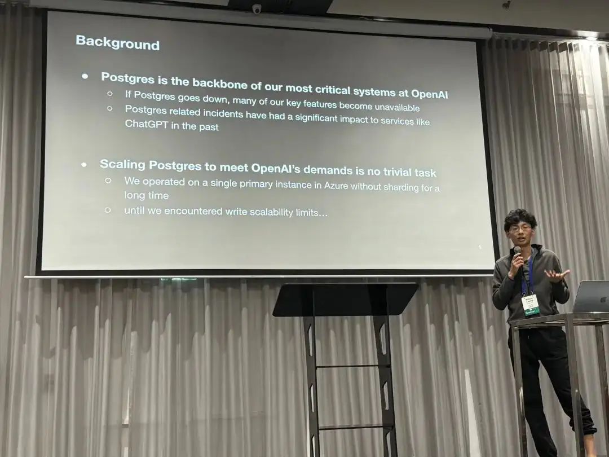

OpenAI 使用 Azure 上的托管 PostgreSQL 数据库，没有使用分片与Sharding， 而是一个主库 + 四十多个从库的经典 PostgreSQL 主从复制架构。 对于像 OpenAI 这样拥有五亿活跃用户的服务而言，可伸缩性是一个重要的问题。

------

## 挑战

在 OpenAI 一主多从的 PostgreSQL 架构中，PG 的的读伸缩性表现极好，“写请求” 成为了一个主要的瓶颈。 OpenAI 已经在这上面进行了许多优化，例如将能移走的写负载尽可能移走，避免把新业务放进主数据库中。

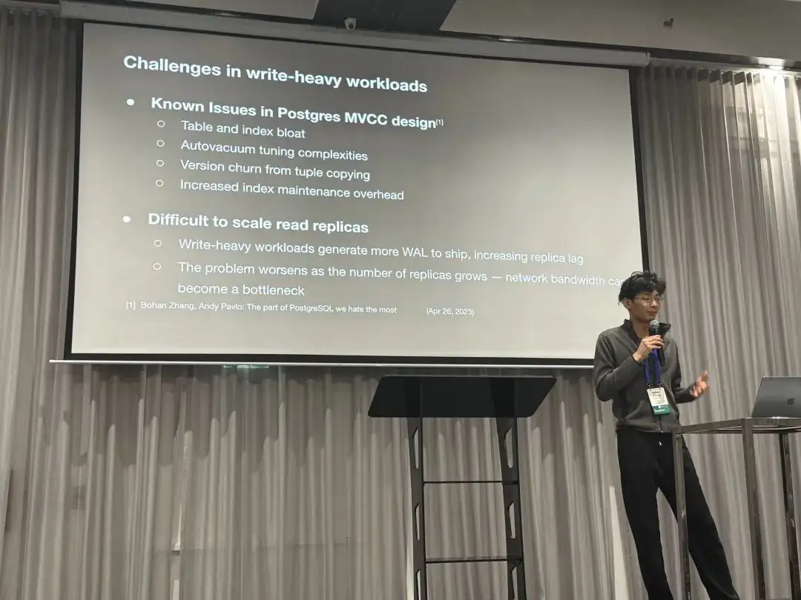

PostgreSQL 的 MVCC 设计存在一些已知的问题，例如表膨胀与索引膨胀，自动垃圾回收调优较为复杂，每次写入都会产生一个完整新版本， 索引访问也可能需要额外的回表可见性检查。这些设计会带来一些 “扩容读副本” 的挑战： 例如更多 WAL 通常会导致复制延迟变大，而且当从库数量疯狂增长时，网络带宽可能成为新的瓶颈。

------

## 措施

为了解决这些问题，我们进行了多个层面上的努力：

### 控制主库负载

第一项优化是抹平主库上的写尖峰，尽可能的减少主库上的负载，例如：

- 把能移走的写入统统移走
- 在应用层面尽可能避免不必要的写入
- 使用惰性写入来尽可能抹平写入毛刺
- 回填数据的时候控制频次

此外，OpenAI 还尽最大可能把读请求都卸载到从库上去，一些因为放在读写事务中，无法从主库上移除的读请求则要求尽可能高效。

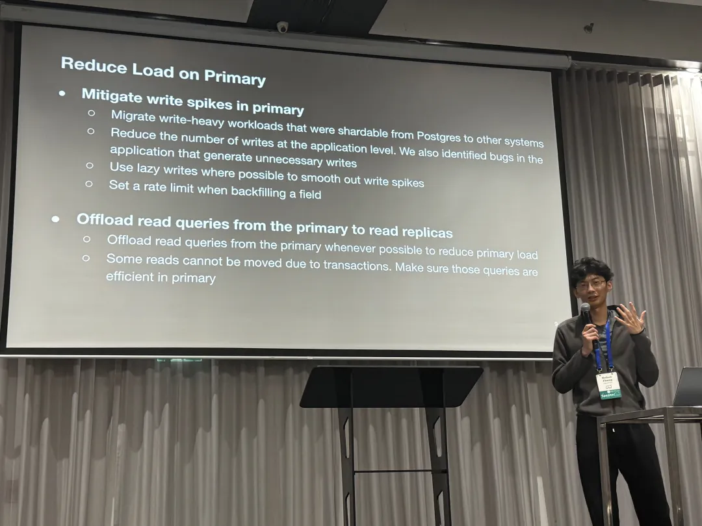

### 查询优化

第二项是在查询层面进行优化。因为长事务会阻止垃圾回收并消耗资源，因此他们使用 timeout 配置来避免 Idle in Transaction 长事务，并设置会话，语句，客户端层面的超时。 同时，还把一些多路 JOIN 的查询（比如一次 Join 12 个表）给优化掉了。分享中还特别提到使用 ORM 容易导致低效的查询，应当慎用。

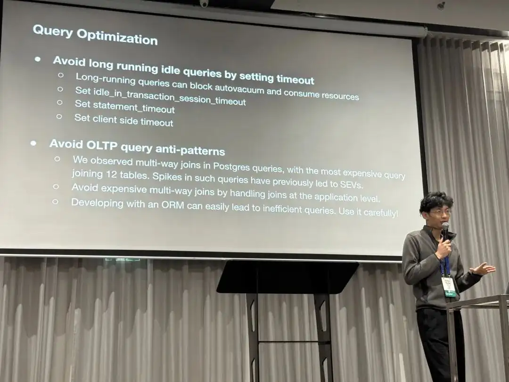

### 治理单点问题

主库是一个单点，如果挂了就没法写入了。与之对应，我们有许多只读从库，一个挂了应用还可以读其他的。 实际上许多关键请求是只读的，所以即使主库挂了，它们也可以继续从主库上读取。

此外，我们低优先级请求与高优先级请求也进行了区分，对于那些高优先级的请求，OpenAI 分配了专用的只读从库，避免它们被低优先级的请求影响

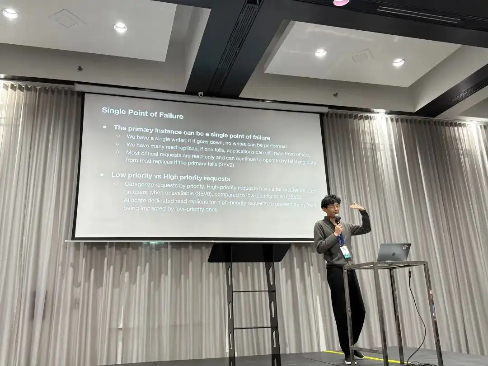

### 模式管理

第四项是只允许在此集群上进行轻量的模式变更。这意味着：

- 新建表，或者把新的负载丢上来是不允许的
- 可以新增或移除列（设置5秒超时），任何需要重写全表的操作都是不允许的。
- 可以创建/移除索引，但必须使用 `CONTURRENTLY`。

另一个提及的问题是运行中持续出现的长查询（>1s）会一直阻塞模式变更，最终导致模式变更失败。解决这个问题的措施是让应用把这些慢查询优化掉或者移到只读从库上去。

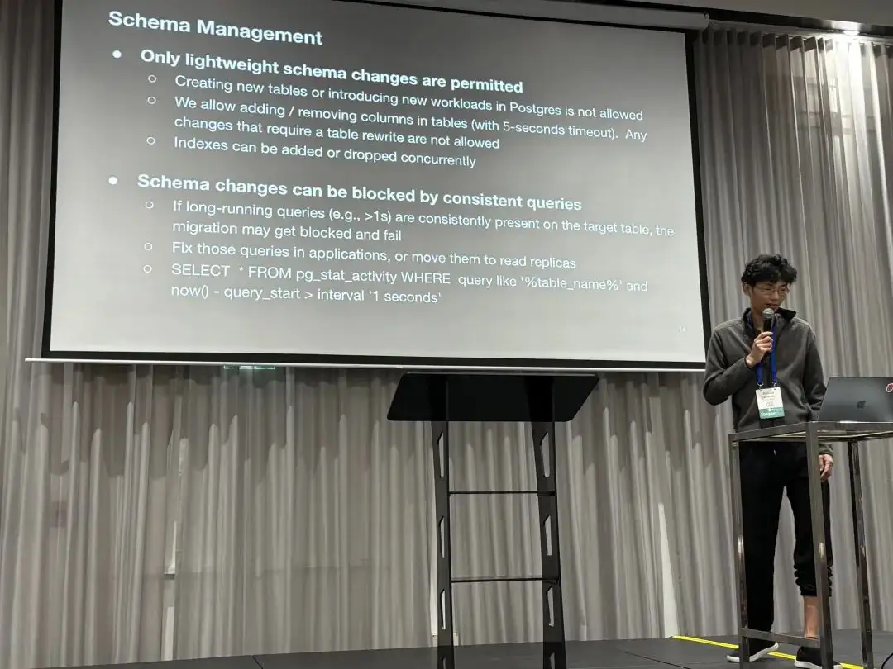

------

## 结果

- 将 Azure 上的 PostgreSQL 伸缩至百万 QPS，支撑了 OpenAI 的关键服务
- 在不增加复制延迟的前提下新增了几十个从库（不到 50）
- 将只读从库部署至不同的地理区域并保持低延迟
- 过去9个月内只有一起与 PostgreSQL 有关的零级事故•仍然为未来增长保留了足够的空间

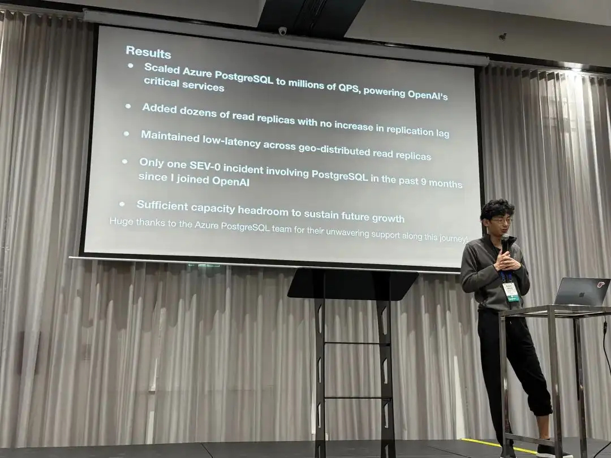

> “在 OpenAI，我们在使用一写多读的未分片架构，证明了 PostgreSQL 在海量读负载下也可以伸缩自如”

------

## 故障案例

此外，OpenAI 还分享了几个问题案例研究，第一个案例是缓存故障导致的雪崩。

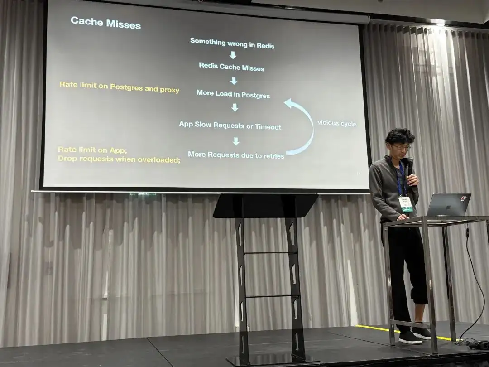

第二个故障比较有趣，是极高 CPU 使用率下触发了一个 BUG。导致即使 CPU 水位恢复，WALSender 也一直在自旋循环而不是干正事发送 WAL 日志给从库，从而导致复制延迟增大。

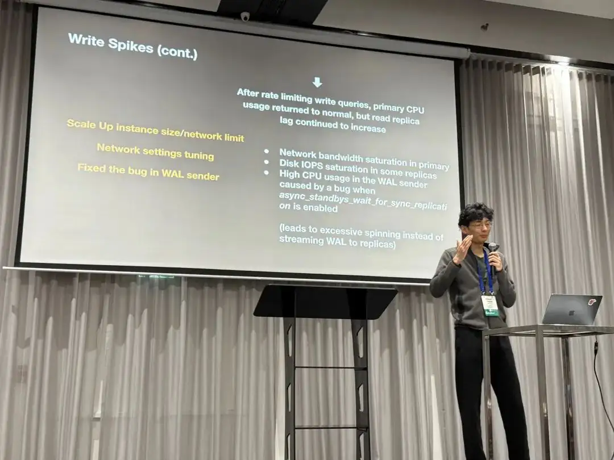

------

## 功能需求

最后，Bohan 也向 PostgreSQL 开发者社区提出了一些问题与特性建议：

第一个是关于禁用索引问题的，不用打索引会导致写放大与额外的维护开销，他们希望移除没用的索引，然而为了最小化风险， 他们希望有一个 “Disable” 索引的特性，并监控性能指标确保没问题后再真正移除索引。

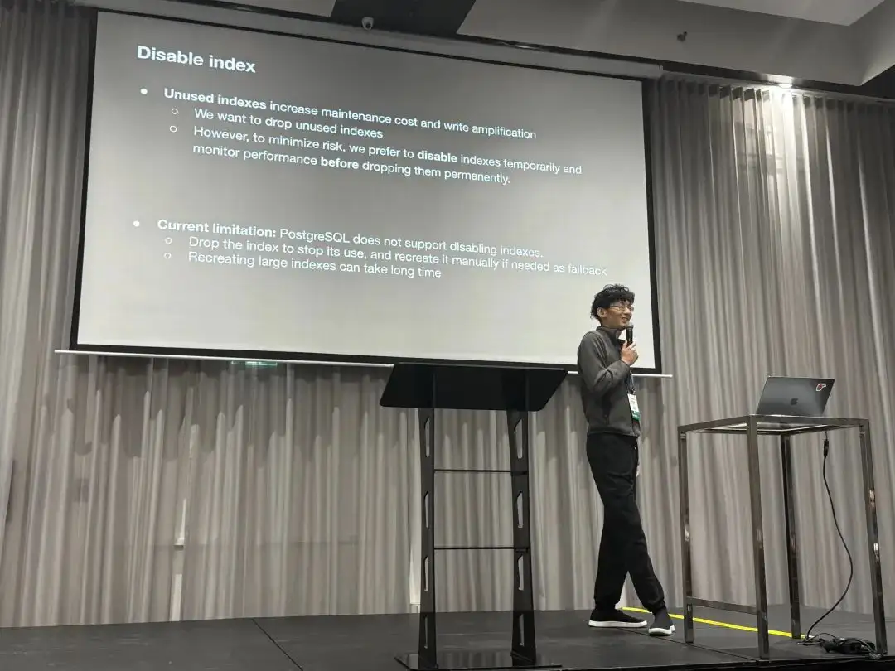

第二个是关于可观测性的，目前的 `pg_stat_statement` 只提供每类查询的平均响应时间， 而没法直接获得 （p95, p99）延迟指标。他们希望拥有更多类似 histogram 与 percentile 延迟的指标。

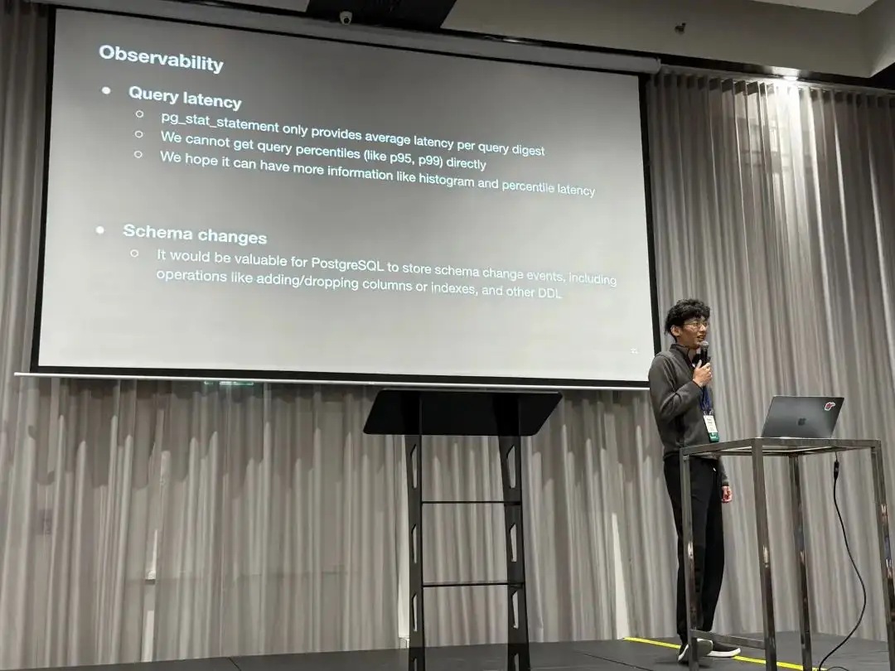

第三项是关于模式变更的，他们希望 PostgreSQL 可以记录模式变更事件的历史，例如新增/移除列，以及其他 DDL操作。

第四个 Case 是关于监控视图语义的。他们发现了一条会话 State = Active，WaitEvent = ClientRead 持续了两个多小时。 也就是有一条链接 QueryStart 之后一直 Active 了很长时间，而这样的链接就没有办法被 idle in transaction 超时给杀掉，希望了解这是一个 Bug 吗，以及如何解决。

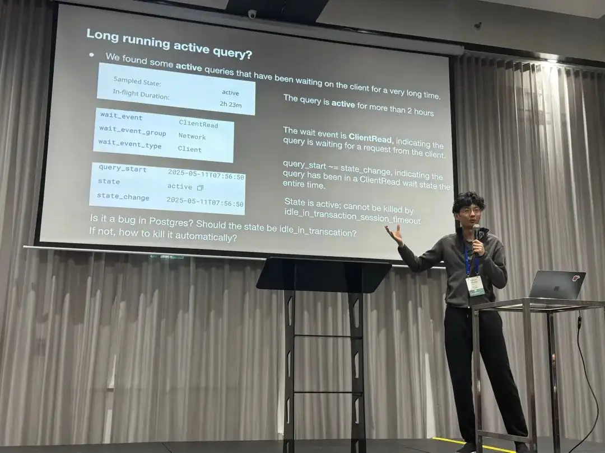

最后是关于 PostgreSQL 默认参数的优化建议，PostgreSQL 默认参数值过于保守了。 是否可以使用一些更好的默认值，或者使用启发式的设置规则？

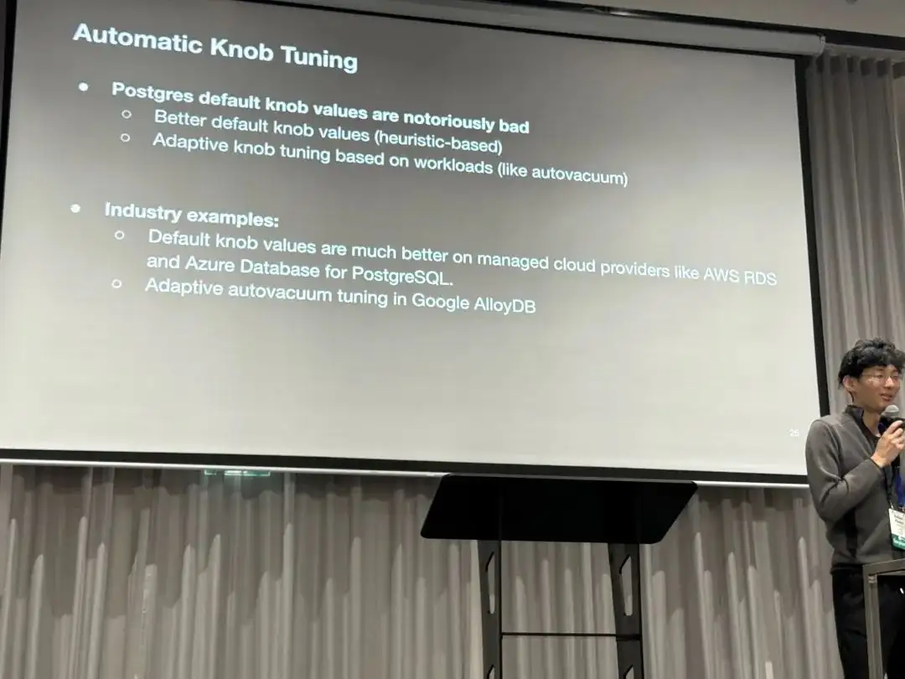

------

## 老冯评论

尽管 PGConf.Dev 2025 主要关注的是开发，但也经常可以看到一些用户侧的 Use Case 分享。 比如这次 OpenAI 的 PostgreSQL 伸缩实践。其实这类主题对于内核开发者来说还是很有趣的， 因为很多内核开发者确实对极端场景下的 PostgreSQL 用例没有概念，而这类分享会很有帮助。


老冯从 2017 年底在探探管理着几十套 PostgreSQL 集群，算是国内互联网场景下最大最复杂的部署之一： 几十套 PG，250 万左右的 QPS。那时候我们最大的核心主库一主 33 从，一套集群承载了 40万左右的 QPS。 瓶颈也卡在了单库写入上，最后进行了分库分表，使用类 Instagram 的应用侧 Sharding 解决了这个问题。

可以说，OpenAI 在这次分享中遇到的问题，以及采取的解决手段，我都曾经遇到过。 当然不同的是当下的顶级硬件可要比八年前牛逼太多了，让 OpenAI 这样的创业公司可以用一套 PostgreSQL 集群，在不分片，不Sharding 的情况下直接服务整个业务。 这无疑为《[分布式数据库是个伪需求](https://mp.weixin.qq.com/s/-eaCoZR9Z5srQ-1YZm1QJA)》提供了又一记强有力的例证。

在聊天提问的时候，老冯了解到 OpenAI 使用的是 Azure 上的托管 PostgreSQL，使用最高可用规格的服务器硬件，从库数量达到 40+，包括一些异地副本， 这套巨无霸集群总的读写 QPS 为 100 万左右。监控使用 Datadog，业务从 Kubernetes 中通过业务侧的 pgbouncer 链接池化之后访问 RDS 集群。

因为是战略级甲方，Azure PostgreSQL Team 提供贴心服务。但显然，即使是使用了顶级的云数据库服务，也需要客户在应用/运维侧有足够的认知与水平 —— 即使有 OpenAI 这样的智力储备，也依然会在 PostgreSQL 的一些实践驾驶案例中翻车。

会议结束后晚上的 Social 环节，老冯和 Bohan 还有两位数据库 Founder 一起唠嗑唠到了凌晨，相谈甚欢。非公开的讨论十分精彩，不过老冯无法就此透露更多，哈哈。


------

## 老冯答疑

关于 Bohan 提出的几个问题与特性建议，老冯倒是可以在这里做一个解答。

其实大部分 OpenAI 想要的功能特性需求 PostgreSQL 生态中已经有了，只不过不一定在原生 PG 内核与云数据库环境中可用。

------

### 关于禁用索引

PostgreSQL 其实是有禁用索引的“功能”，只需要更新 [`pg_index`](https://www.postgresql.org/docs/current/catalog-pg-index.html) 系统表中的 `indisvalid` 字段为 `false`， 这个索引就不会被 Planner 使用，但仍然会在 DML 中被继续维护。从原理上讲这没什么毛病，因为并发创建索引就是利用这两个标记位（`isready`, `isvalid`）来实现的，并不算什么黑魔法。

但 OpenAI 无法使用这种方式，我可以理解这里的原因：这是一个未被文档记录的 “内部细节” 而非正式特性，但更重要的原因是云数据库通常不提供 Superuser 权限，所以没办法这样更新系统目录。

但回到最原始的需求 —— 害怕误删索引，这个问题有更简单的解决办法，直接从监控视图中确认索引在主从上都没有访问即可。你只要知道了很长时间都没人用这个索引，就可以放心删除它。

> 使用 Pigsty 监控系统 [PGSQL TABLES](https://demo.pigsty.cc/d/pgsql-tables?viewPanel=panel-354) 查阅在线切换索引的过程
>
> 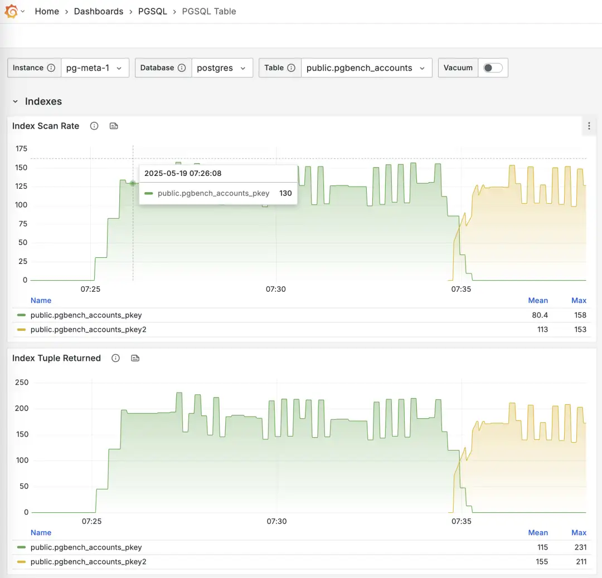

```sql
-- 创建一个新索引
CREATE UNIQUE INDEX CONCURRENTLY pgbench_accounts_pkey2 ON pgbench_accounts USING BTREE(aid);

-- 标记原索引为无效（不使用），但继续维护，Planner 将自动使用其他索引替代
UPDATE pg_index SET indisvalid = false WHERE indexrelid = 'pgbench_accounts_pkey'::regclass;
```

------

### 关于可观测性

其实 [**`pg_stat_statements`**](https://pigsty.cc/ext/stat/pg_stat_statements/) 提供了均值与标准差，可以使用正态分布的性质来估算出分位点指标。 但这只能作为模糊的参考，而且需要定时重置计数器，否则全量历史统计值的效果会越来越差。

PGSS 在短期内可能并不会提供 P95, P99 RT 这样的百分位点指标，因为这会导致这个扩展所需的内存翻个几十倍 —— 对于现代服务器来说这倒也不算什么，但对于一些极端保守的场景就会有问题。我在 [Unconference](https://wiki.postgresql.org/wiki/PGConf.dev_2025_Developer_Unconference#The_Future_of_pg_stat_statements) 上问了 PGSS 的维护者这个问题，短期内可能并不会发生。 我也问了 Pgbouncer 的维护者 Jelte 是否可能在链接池层面解决这个问题，短期内也不会有这样的特性出现。

然而这个问题其实也是有其他解法的，首先 [**`pg_stat_monitor`**](https://pigsty.cc/ext/stat/pg_stat_monitor/) 这个扩展就明确提供了详细的分位点 RT 指标，可以解决这个问题，但也要考虑分位点指标采集对集群性能造成的影响。 通用，无侵入，且无数据库性能损耗的办法，是在应用层面 DAL 直接添加查询 RT 监控，但这需要应用端的配合与努力。

此外，使用 ebpf 旁路采集 RT 指标是一个很棒的想法，不过考虑到他们用的 Azure 托管 PostgreSQL，不会给服务器权限，所以这条路可能被堵死了。

------

### 关于模式变更记录

其实 PostgreSQL 的日志已经提供这个选项了，只要把 [**`log_statement`**](https://www.postgresql.org/docs/current/runtime-config-logging.html#GUC-LOG-STATEMENT) 设置为 `ddl` （或更高级的 `mod`, `all`），所有 DDL 日志就会保留下来。扩展插件 [**`pgaudit`**](https://pigsty.cc/ext/sec/pgaudit/) 也提供了类似的功能。

但我猜他们想要的不是这种 DDL 日志，而是类似提供一个可以通过 SQL 查询的系统视图。所以另一种选项是 [`CREATE EVENT TRIGGER`](https://www.postgresql.org/docs/current/sql-createeventtrigger.html) ， 使用事件触发器直接在数据表中记录 DDL 事件即可。扩展 [**`pg_ddl_historization`**](https://pigsty.cc/ext/util/ddl_historization/) 提供了更简便的记录方式，我也编译打包了这个扩展。

创建事件触发器也需要 superuser 权限，AWS RDS 有一些特殊处理可以使用这个功能，不过 Azure 上的 PostgreSQL 似乎就不支持了。

------

### 关于监控视图语义

在 OpenAI 的这个例子中，[**`pg_stat_activity.state`**](https://www.postgresql.org/docs/current/monitoring-stats.html#MONITORING-PG-STAT-ACTIVITY-VIEW) = `Active` 意味着后端进程依然在同一条 SQL 语句的生命周期里，[**`WaitEvent`**](https://www.postgresql.org/docs/current/monitoring-stats.html#WAIT-EVENT-TABLE) = `ClientWait` 意味着进程在CPU上等客户端的数据过来。 两者同时出现，典型的例子就是 COPY FROM STDIN 空等，但也可能是 TCP 阻塞，或者卡在 BIND / EXECUTE 中间。所以也不好说就是 BUG，还是要看链接具体在做什么。

有人认为，等待 Client I/O ，这从 CPU 角度来看这不应该是 “空闲” （Idle） 状态吗？但 State 关注的是语句本身的执行状态，而不是 CPU 的忙闲与否。 State = Active 意味着 PostgreSQL 后端进程认为 “这条语句尚未结束”。行锁、buffer pin、快照、文件句柄等资源就被视为“正在使用”，这并不代表它正在 CPU 上运行， 当该进程在 CPU 上运行，在 For 循环中等待客户端数据的到来时，等待事件为 `ClientRead`，而当它让出 CPU 在后台等待时，等待事件为 `NULL`。

当然回到这个问题本身，其实是有别的解决办法的。例如在 Pigsty 中，当通过 HAProxy 访问 PostgreSQL 时， 我们会在 LB 层面为 Primary 服务设置一个 [链接超时](https://github.com/pgsty/pigsty/blob/main/roles/haproxy/templates/haproxy.cfg.j2#L30)，默认为 24h ，更高标准的环境会更短，比如 1h。 那么就意味着超过1小时的链接就会被挂断。当然，这个也需要在应用侧的链接池相应配置最大生命周期，尽可能主动挂断而不是被挂断。 对于离线只读服务则可以不设置这个参数，来允许那种跑两三天的超长查询。这样就可以为这种 Active 但等待 I/O 的情况提供兜底。

但我也怀疑在 Azure PostgreSQL 是否提供了这种控制的可能性。

------

### 关于默认参数

PostgreSQL 的默认参数相当保守，例如 [默认使用 128 MB 内存](https://www.postgresql.org/docs/current/runtime-config-resource.html#GUC-SHARED-BUFFERS)（最小可以设置 128 KB ！） 从好的方面讲这让他的默认配置能在几乎所有环境中都能跑起来。从坏的方面讲我真的见过 1TB 物理内存使用 128 MB 默认配置运行的案例……（因为双缓冲，竟然还真跑了很久生产业务）。

但总体来说，我觉得默认参数保守点不是坏事，这个问题可以在更灵活的动态配置过程中解决。 RDS 和 Pigsty 都提供了足够好的 [初始参数启发式配置规则](https://github.com/pgsty/pigsty/blob/main/roles/pgsql/templates/oltp.yml#L13)，充分解决这个问题了。 但这个特性确实可以加入到 PG 命令行工具中，比如在 [`initdb`](https://www.postgresql.org/docs/current/app-initdb.html) 时自动检测 CPU/内存数量，磁盘大小与介质并相应设置优化的参数值。

------

### 自建 PostgreSQL ？

OpenAI 提出的几个问题，挑战其实并不是来自 PostgreSQL 本身，而是来自托管云服务的额外限制。 一种解决办法就是利用 Azure 或其他资源云的 IaaS 层，使用本地 NVMe SSD 实例存储自建 PostgreSQL 集群以绕开限制。

实际上，老冯的 [Pigsty](https://pgsty.com/) 就是为了解决类似规模下 PostgreSQL 挑战而给自己做的云数据库解决方案。 It scales well ，支撑起了探探 25K vCPU 的 PostgreSQL 集群与 2.5 M QPS。 包括上面这些问题，甚至是许多 OpenAI 还没有遇到的问题也都有了解决方案，并做到了 Pigsty 中，并开源免费，开箱即用。

如果 OpenAI 感兴趣，我当然乐意提供一些支持，不过我觉得狂飙增长的时候，折腾数据库 Infra 可能并非高优先级的事项。 好在，他们还是有着非常优秀的 PostgreSQL DBA，能够继续探索出这些道路来。

-