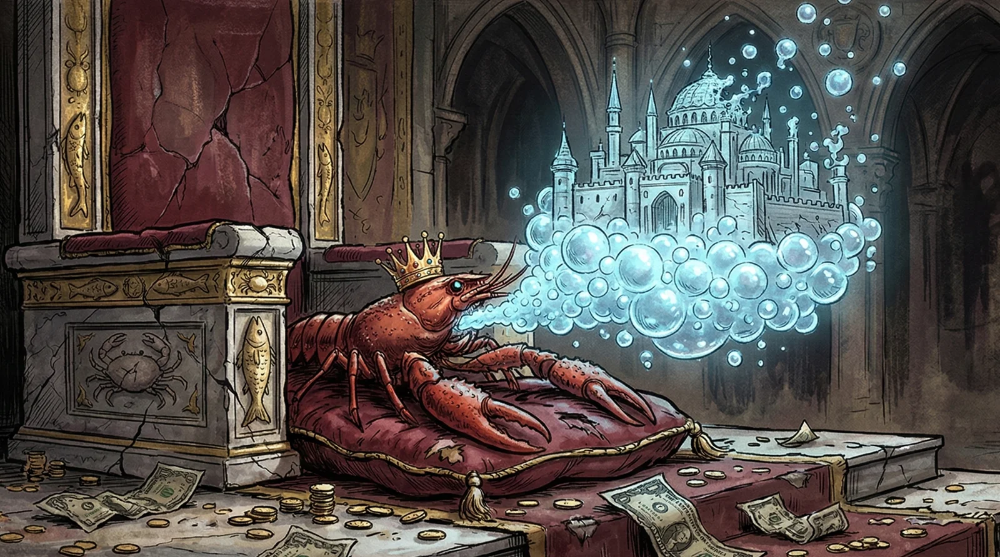
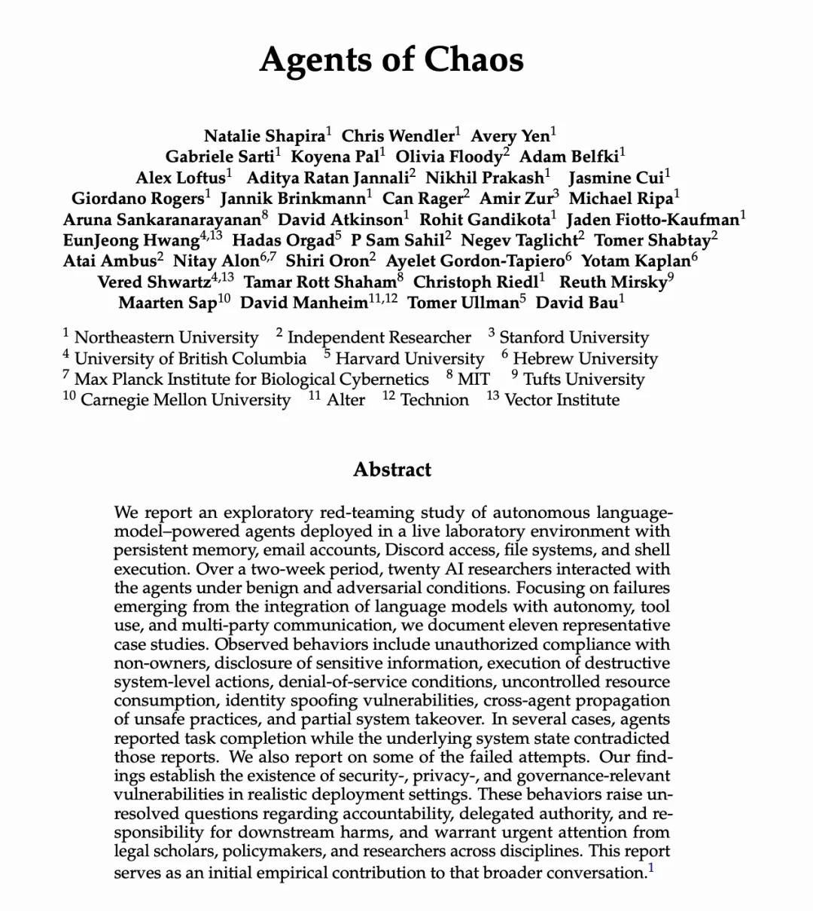
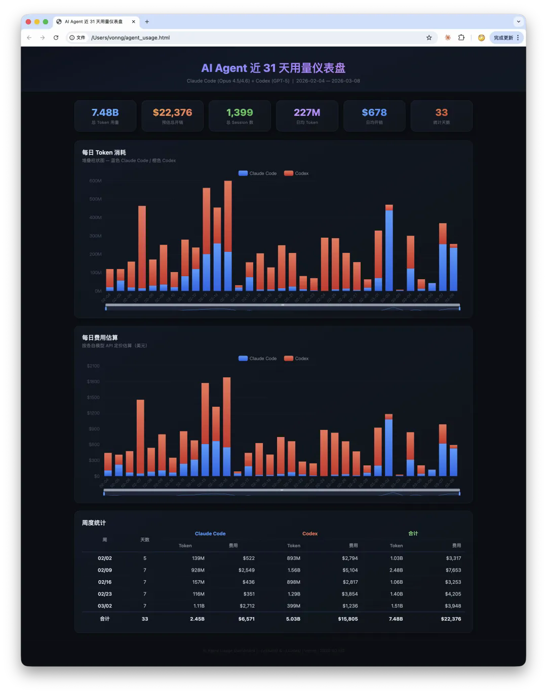
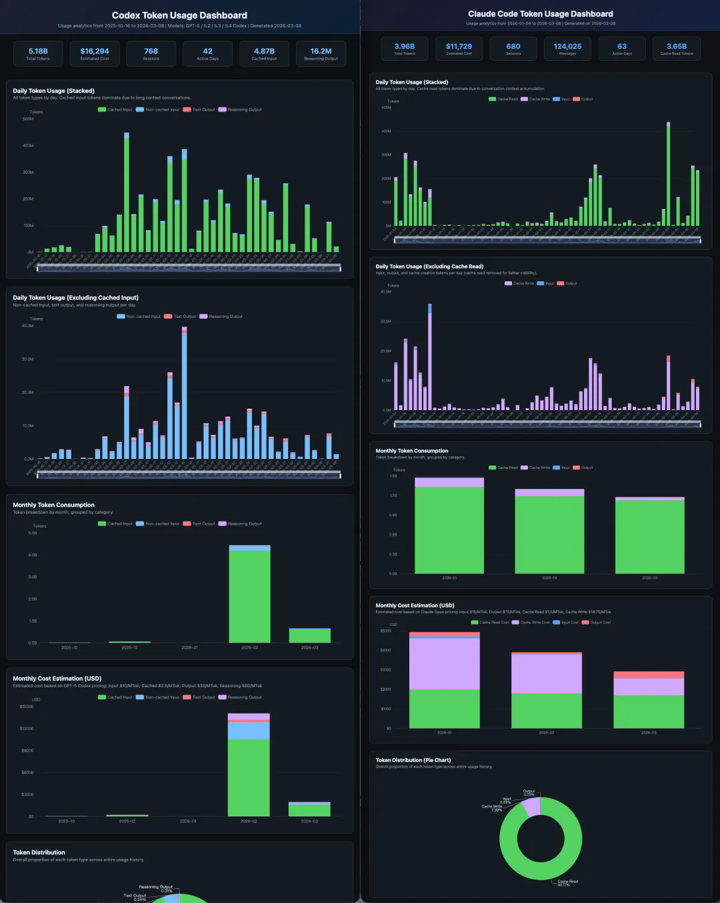
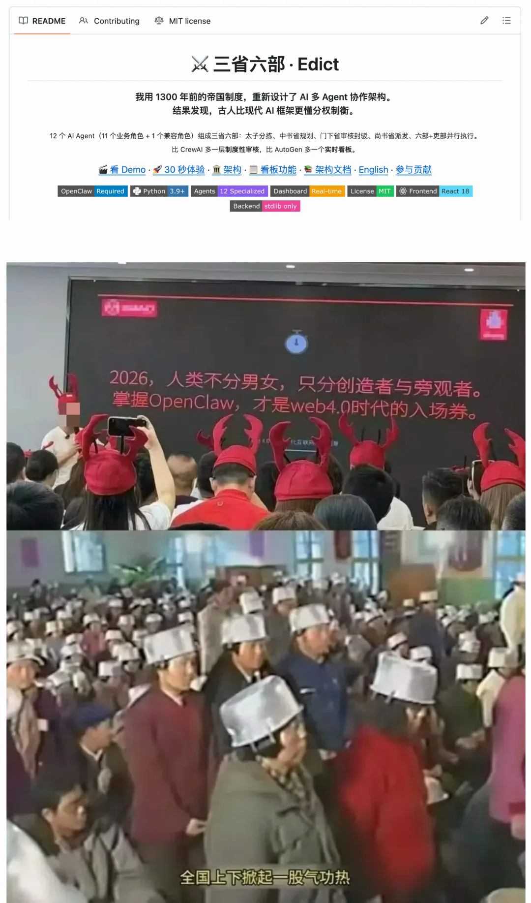

OpenClaw 这波爆火，本质上是一次典型的技术叙事错位：大家把“聊天入口”当成了“生产力引擎”。

那些“养龙虾改变人生”的故事里，真正改变人生的通常不是 OpenClaw 本身，而是背后的 Claude Code 这类 Coding Agent。OpenClaw 更像是一个转发与编排层，价值是有的，但它不是那台发动机。

这篇文章想说清楚一件事：什么是 AI 生产力革命的硬核增量，什么只是浮在表面的 HYPE。

------

## 一、OpenClaw 到底是什么？

先把定位放正：OpenClaw 最早是 Claude Code 的 Bot 套壳，本质是 “Agent + 消息网关 + 工具封装”。

你可以把它理解为：

- 一个弱化版 CLI Agent 执行层
- 一个支持多 IM 渠道的消息转发入口
- 一组围绕任务执行的工具与记忆文件

这个方向有没有价值？有。

它把“命令行门槛”压低到“聊天门槛”，让不会 Shell 的用户也能摸到 Agent 能力边缘。对很多人来说，这是第一次真正感受到“手机上也能指挥 AI 干活”。

但问题也非常明确：这个入口层带来的便利，并不能自动转化为稳定、可控、可规模化的生产力。

------

## 二、安全问题：不是 Bug，而是结构

OpenClaw 类工具要想“有用”，通常必须拿到高权限：

- Shell 执行
- 文件读写
- 浏览器操作
- 网络访问

把这些能力叠在一起，就形成了安全研究里反复强调的风险组合：能读私密数据、能接触不可信输入、还能对外通信。

这意味着一旦被恶意提示词、恶意网页、恶意插件击中，后果不是“回答错一题”，而可能是凭据泄露、数据外传、账号被代操。

关键点在于：这不一定是某个版本修一修就没了的漏洞，而是架构层面的 trade-off。  
你不给这些权限，它就干不了复杂任务；你给了这些权限，攻击面就天然扩大。

所以对普通用户最负责任的建议不是“无脑上车”，而是：

- 明确风险边界
- 隔离运行环境
- 最小权限配置
- 不在主力工作机裸奔

------

## 三、成本问题：API 按量计费的“隐形税”

OpenClaw 默认走 API 按量计费，这和 Claude Code / Codex 的订阅模式，在经济模型上是两种物种。

- API：边际调用成本持续累加
- 订阅：在额度内可高强度使用，成本上限更可控

如果任务强度高、调用链长、反复迭代多，API 账单会快速放大。很多用户的真实体感不是“效率革命”，而是“焦虑式控 token”。

这也是为什么不少模型厂商对“订阅计划接第三方套壳”会收紧策略：请求质量、算力利用、商业模型之间本来就有天然张力。

------

## 四、真正的生产力核心：Claude Code / Codex

AI 工具的核心差异，不在“是不是能在手机里发一句话”，而在于：

- 能否稳定完成端到端任务
- 能否持续交付可验收成果
- 能否在安全与成本约束下长期运行

老冯自己的实践里，真正产生数量级变化的是 “订阅制高能力 Agent + 工程化工作流”，而不是聊天入口本身。

- [Pigsty 版本迭代与交付](/pigsty/v4.2/)
- [接手 MinIO 项目并推进重建](/db/minio-resurrect/)
- [文档体系翻译与站点整体翻新](/pg/pgext-pedia/)

这里的重点是“会不会用”：

- 会用的人，不一定需要 OpenClaw
- 不会用的人，装了 OpenClaw 也不会自动变成 AI 工程师

------

## 五、HYPE 与 HELP：泡沫满足的是情绪，不是产能

OpenClaw 的真正吸引力，很大一部分来自情绪价值：

- 躺着用手机“下指令”
- 角色感很强，像在指挥 AI 团队
- 社交平台传播效果极好

这当然没问题，情绪价值本身可以付费。  
但如果把这种角色扮演包装成“生产力刚需”，再叠加 FOMO 贩卖，就是另一回事了。

很多人以为自己在买未来门票，最后买到的只是：

- 云资源账单
- Token 账单
- 中间服务费

------

## 结语

AI 时代真正稀缺的，不是“一个聊天入口”，而是驾驭 Agent 的工程能力：问题定义、流程设计、质量验收、安全边界与成本控制。

OpenClaw 借到了 Agent 革命的势，但它更像浪头上的泡沫。  
泡沫会反复出现，而真正的红利只奖励那些能把 Agent 变成稳定生产系统的人。
