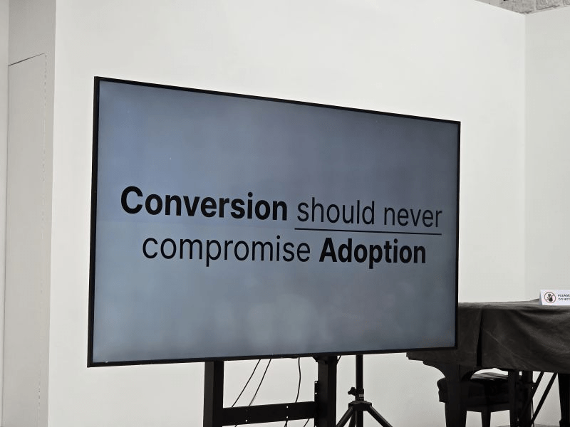
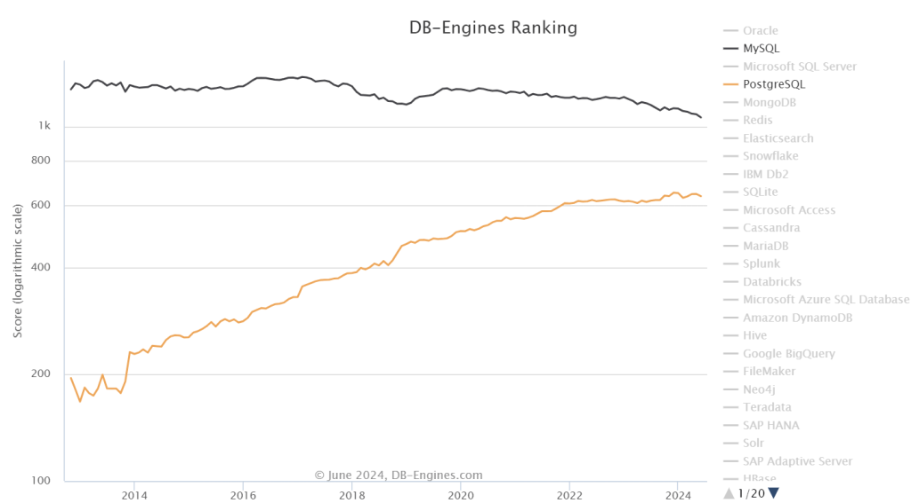

> [Peter Zaitsev](https://www.percona.com/blog/author/pz/) | Translated by: [Feng Ruohang](https://vonng.com) ([@Vonng](https://vonng.com/en/)) | [WeChat Original](https://mp.weixin.qq.com/s/1zlDPie_bVvP7eO6_uTkSw) | [Percona's Blog](https://www.percona.com/blog/is-oracle-finally-killing-mysql/)

About 15 years ago, [Oracle acquired Sun Microsystems](https://www.oracle.com/corporate/pressrelease/oracle-buys-sun-042009.html), thereby also acquiring MySQL. Discussions about when Oracle would "kill MySQL" have been [ongoing](https://www.quora.com/Did-Oracle-buy-MySQL-in-order-to-kill-it) on the internet ever since. Various theories circulated at the time: from completely killing MySQL to reduce competition with Oracle's proprietary database, to eliminating the MySQL open source project and leaving only "MySQL Enterprise Edition" as the sole option. These rumors spread widely, which was good business for MariaDB, PostgreSQL, and other niche competitors.

> Author: Percona Blog, Marco Tusa, an important contributor to the MySQL ecosystem who developed the well-known PT series tools, MySQL backup tools, monitoring tools, and distributions.
>
> Translator: Feng Ruohang, known as Vonng, author of Pigsty, PostgreSQL expert and evangelist. Cloud-exit advocate and database cloud-exit practitioner.

However, Oracle actually managed MySQL quite well. The MySQL team was largely retained, led by MySQL veteran Tomas Ulin. MySQL became more stable and secure. Much technical debt was resolved, and many features modern developers wanted were added, such as JSON support and advanced SQL standard features.

While there is indeed something called ["MySQL Enterprise Edition"](https://www.mysql.com/products/enterprise/), it actually focuses on enterprise needs that developers don't care much about: pluggable authentication, auditing, firewalls, etc. Although there are proprietary GUI interfaces, monitoring, and backup tools (such as MySQL Enterprise Monitor), there are many open source and commercial competitors in the industry, so vendor lock-in isn't particularly severe.

During this period, I often defended Oracle because many people felt MySQL would be mistreated, given Oracle's rather poor reputation.

However, during that time, I believed Oracle indeed followed the well-known golden rule of open source success: "**Conversion should never compromise Adoption**"

> Note: "Conversion should never compromise Adoption" means that in developing or improving open source software, any changes during conversion or upgrade processes should not interfere with existing users' habits or new users' adoption.

However, things began to change in recent years as Oracle launched "MySQL HeatWave" (a MySQL cloud database service).

MySQL HeatWave introduced many features not available in MySQL Community or Enterprise editions, such as accelerated analytical queries and machine learning.

For **analytical queries**, MySQL has serious problems - it still doesn't even support **parallel queries**. CPUs in the market now have hundreds of cores, but single-core performance hasn't significantly improved. The lack of parallel support severely constrains MySQL's analytical performance improvements - affecting not only analytical applications but also simple `GROUP BY` queries in everyday transactional applications. (Note: MySQL 8 has some [parallel support](https://dev.mysql.com/blog-archive/mysql80-innodb-parallel-threads-ddl/) for DDL, but not for queries)

The reason for this approach - is it to give users more reasons to buy MySQL HeatWave? But alternatively, people could directly choose PostgreSQL and ClickHouse, which have stronger analytical capabilities.

Another area where open source MySQL is extremely lacking is **vector search**. Other mainstream open source databases have already added vector search functionality, and MariaDB is working hard to implement this feature. But currently, only the cloud-exclusive [MySQL HeatWave](https://blogs.oracle.com/mysql/post/introducing-vector-store-and-generative-ai-in-mysql-heatwave) has this functionality in the MySQL ecosystem, which is regrettable.

Then there's the strangest decision - JavaScript functionality is only provided in the Enterprise edition. I think MySQL should try to win JavaScript developers' hearts as much as possible, but now many JS developers already prefer the simpler MongoDB.

I believe these decisions violate the aforementioned golden rule of open source - they clearly limit MySQL's adoption and spread - whether through these "XX-exclusive" specific features or concerns about MySQL's future policy changes.

But that's not all. MySQL's performance has also seriously declined, perhaps due to [ignoring the performance engineering department for years](https://smalldatum.blogspot.com/2024/04/sysbench-on-small-server-mariadb-and.html). Compared to MySQL 5.6, MySQL 8.x shows significant performance degradation on single-threaded simple workloads. You might say adding features inevitably comes at the cost of performance, but MariaDB's performance degradation is much less severe, and PostgreSQL can even [**significantly improve performance while adding new features**](https://smalldatum.blogspot.com/2023/10/postgres-vs-mysql-impact-of-cpu.html).

Obviously, I don't know what Oracle's management team is thinking, and I can't say whether this is stupidity or malice. But these product decisions in recent years clearly don't favor MySQL's adoption, especially at a time when PostgreSQL is making great strides in leading user mindshare. According to DB-Engines popularity rankings, it has significantly narrowed the gap with MySQL; and according to the [StackOverflow Developer Survey](https://survey.stackoverflow.co/2023/#technology-most-popular-technologies), it has even surpassed MySQL to become the most popular database.

In any case, unless Oracle shifts its focus and considers modern developers' needs for relational databases, MySQL is doomed sooner or later - whether killed by Oracle's actions or by Oracle's inactions.

--------

## Related Reading

[MySQL Performance Getting Worse - Where is Sakila Going?](/db/sakila-where-are-you-going/)

[Why is MySQL's Correctness So Terrible?](/db/bad-mysql/)

[Is Oracle Finally Killing MySQL?](https://www.percona.com/blog/is-oracle-finally-killing-mysql/)

[Can Oracle Save MySQL?](https://www.percona.com/blog/can-oracle-save-mysql/)

[Sakila, Where Are You Going?](https://www.percona.com/blog/sakila-where-are-you-going/)

[Postgres vs MySQL: the impact of CPU overhead on performance](https://smalldatum.blogspot.com/2023/10/postgres-vs-mysql-impact-of-cpu.html)

[Perf regressions in MySQL from 5.6.21 to 8.0.36 using sysbench and a small server](https://smalldatum.blogspot.com/2024/02/perf-regressions-in-mysql-from-5621-to.html)