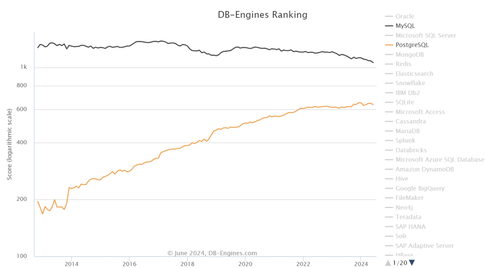

> [Peter Zaitsev](https://www.percona.com/blog/author/pz/) | 译：[冯若航](https://vonng.com)（[@Vonng](https://vonng.com/en/)） | [微信原文](https://mp.weixin.qq.com/s/1zlDPie_bVvP7eO6_uTkSw) | [Percona's Blog](https://www.percona.com/blog/is-oracle-finally-killing-mysql/)

大约15年前，[Oracle收购了Sun公司](https://www.oracle.com/corporate/pressrelease/oracle-buys-sun-042009.html)，从而也拥有了MySQL，互联网上关于Oracle何时会“扼杀MySQL”的[讨论](https://www.quora.com/Did-Oracle-buy-MySQL-in-order-to-kill-it)此起彼伏。当时流传有各种理论：从彻底扼杀 MySQL 以减少对 Oracle 专有数据库的竞争，到干掉 MySQL 开源项目，只留下 “MySQL企业版” 作为唯一选择。这些谣言的传播对 MariaDB，PostgreSQL 以及其他小众竞争者来说都是好生意，因此在当时传播得非常广泛。

> 作者：Percona Blog，Marco Tusa，MySQL 生态的重要贡献者，开发了知名的PT系列工具，MySQL备份工具，监控工具与发行版。
>
> 译者：冯若航，网名 Vonng，Pigsty 作者，PostgreSQL 专家与布道师。下云倡导者，数据库下云实践者。

然而实际上，Oracle 最终把 MySQL 管理得还不错。MySQL 团队基本都保留下来了，由 MySQL 老司机 Tomas Ulin 掌舵。MySQL 也变得更稳定、更安全。许多技术债务也解决了，许多现代开发者想要的功能也有了，例如 JSON支持和高级 SQL 标准功能的支持。

虽然确实有 [“MySQL企业版”](https://www.mysql.com/products/enterprise/) 这么个东西，但它实际上关注的是开发者不太在乎的企业需求：可插拔认证、审计、防火墙等等。虽然也有专有的 GUI 图形界面、监控与备份工具（例如 MySQL 企业监控），但业内同样有许多开源和商业软件竞争者，因此也说不上有特别大的供应商锁定。

在此期间我也常为 Oracle 辩护，因为许多人都觉得 MySQL 会遭受虐待，毕竟 —— Oracle 的名声确实比较糟糕。

不过在那段期间，我认为 Oracle 确实遵守了这条众所周知的开源成功黄金定律：“**转换永远不应该妨碍采用**”

> 注：“Conversion should never compromise Adoption” 这句话指在开发或改进开源软件时，转换或升级过程中的任何变动都不应妨碍现有用户的使用习惯或新用户的加入。

然而随着近些年来 Oracle 推出了 “MySQL Heatwave”（一种 MySQL 云数据库服务），事情开始起变化了。

MySQL Heatwave 引入了许多 MySQL 社区版或企业版中没有的功能，如 加速分析查询 与 机器学习。

在“**分析查询**”上，MySQL 的问题相当严重，到现在甚至都还不支持 **并行查询**。市场上新出现的 CPU 核数越来越多，都到几百个了，但单核性能并没有显著增长，而不支持并行严重制约了 MySQL 的分析性能提升 —— 不仅仅影响分析应用的查询，日常事务性应用里面简单的 `GROUP BY` 查询也会受影响。（备注：MySQL 8 对 DDL 有一些 [并行支持](https://dev.mysql.com/blog-archive/mysql80-innodb-parallel-threads-ddl/)，但查询没有这种支持）

这么搞的原因，是不是希望用户能够有更多理由去买 MySQL Heatwave？但或者，人们其实也可以直接选择用分析能力更强的 PostgreSQL 和 ClickHouse。

另一个开源 MySQL 极为拉垮的领域是 **向量检索**。其他主流开源数据库都已经添加了向量检索功能，MariaDB 也正在努力实现这个功能，但就目前而言，MySQL 生态里只有云上限定的  [MySQL Heatwave](https://blogs.oracle.com/mysql/post/introducing-vector-store-and-generative-ai-in-mysql-heatwave) 才有这个功能，这实在是令人遗憾。

然后就是最奇怪的决策了 —— Javascript 功能只在企业版中提供，我认为 MySQL 应该尽可能去赢得 Javascript 开发者的心，而现在很多 JS 开发者都已经更倾向于更简单的 MongoDB 了。

我认为这些决策都违背了前面提到的开源黄金法则 —— 它们显然限制了 MySQL 的采用与普及 —— 不论是这些“XX限定”的特定功能，还是对 MySQL 未来政策变化的担忧。

这还没完，MySQL 的性能也出现了严重下降，也许是因为 [多年来无视性能工程部门](https://smalldatum.blogspot.com/2024/04/sysbench-on-small-server-mariadb-and.html)。与MySQL 5.6 相比，MySQL 8.x 单线程简单工作负载上的性能出现了大幅下滑。你可能会说增加功能难免会以牺牲性能为代价，但 MariaDB 的性能退化要轻微得多，而 PostgreSQL 甚至能在 [**新增功能的同时 显著提升性能**](https://smalldatum.blogspot.com/2023/10/postgres-vs-mysql-impact-of-cpu.html)。

显然，我不知道 Oracle 管理团队是怎么想的，也不能说这到底是蠢还是坏，但过去几年的这些产品决策，显然不利于 MySQL 的普及，特别是在同一时间，PostgreSQL 在引领用户心智上高歌猛进，根据 DB-Engines 热度排名，大幅缩小了与 MySQL 的差距；而根据 [StackOverflow开发者调查](https://survey.stackoverflow.co/2023/#technology-most-popular-technologies) ，甚至已经超过 MySQL 成为最流行的数据库了。

无论如何，除非甲骨文转变其关注点，顾及现代开发者对关系数据库的需求，否则 MySQL 迟早要完 —— 无论是被 Oracle 的行为杀死，还是被 Oracle 的不作为杀死。

--------

## 参考阅读

[MySQL性能越来越差，Sakila将何去何从？](/db/sakila-where-are-you-going/)

[MySQL 的正确性为何如此垃圾？](/db/bad-mysql/)

[Is Oracle Finally Killing MySQL?](https://www.percona.com/blog/is-oracle-finally-killing-mysql/)

[Can Oracle Save MySQL?](https://www.percona.com/blog/can-oracle-save-mysql/)

[Sakila, Where Are You Going?](https://www.percona.com/blog/sakila-where-are-you-going/)

[Postgres vs MySQL: the impact of CPU overhead on performance](https://smalldatum.blogspot.com/2023/10/postgres-vs-mysql-impact-of-cpu.html)

[Perf regressions in MySQL from 5.6.21 to 8.0.36 using sysbench and a small server](https://smalldatum.blogspot.com/2024/02/perf-regressions-in-mysql-from-5621-to.html)

