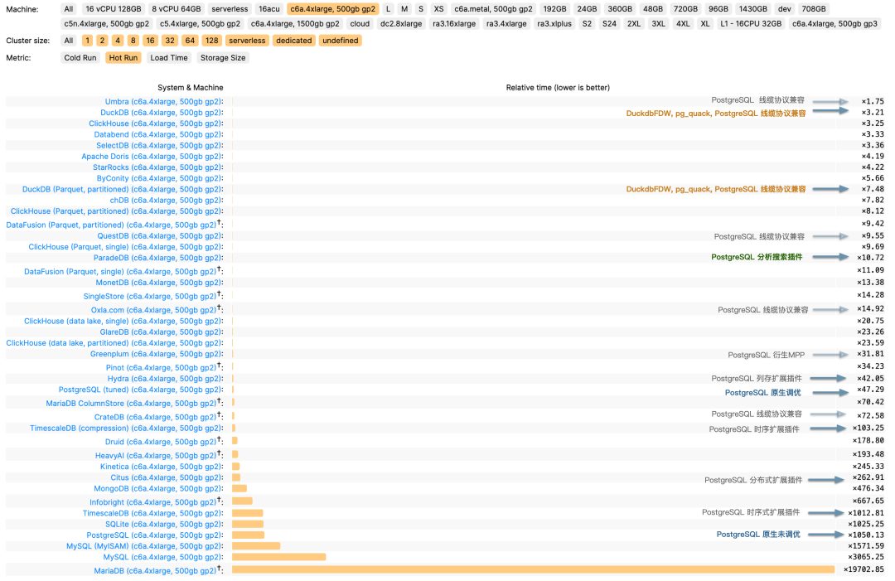
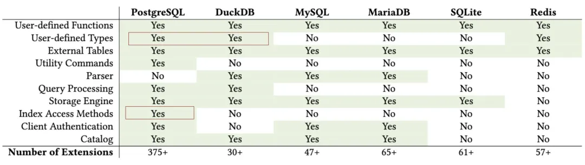

When I published “[*PostgreSQL Is Eating the Database World*](https://pigsty.io/blog/pg/pg-eat-db-world/)” last year, I tossed out this wild idea: *Could Postgres really unify OLTP and OLAP?* I had no clue we’d see fireworks so quickly.

The PG community’s now in an all-out frenzy to stitch DuckDB into the Postgres bloodstream — big enough for Andy Pavlo to give it [prime-time coverage in his 2024 database retrospective](https://www.cs.cmu.edu/~pavlo/blog/2025/01/2024-databases-retrospective.html). If you ask me, we’re on the brink of a cosmic collision in database-land, and Postgres + DuckDB is the meteor we should all be watching.

------

## DuckDB as an OLAP Challenger

**DuckDB** came to life at CWI, the Netherlands’ National Research Institute for Mathematics and Computer Science, founded by Mark Raasveldt and Hannes Mühleisen. CWI might look like a quiet research outfit, but it’s actually the secret sauce behind numerous analytic databases—pioneering columnar storage and vectorized queries that power systems like ClickHouse, Snowflake, and Databricks.

After helping guide these heavy hitters, the same minds built **DuckDB**—an embedded OLAP database for a new generation. Their timing and niche were spot on.

Why DuckDB? The creators noticed data scientists often prefer Python and Pandas, and they’d rather avoid wrestling with heavyweight RDBMS overhead, user authentication, data import/export tangles, etc. DuckDB’s solution? An embedded, SQLite-like analyzer that’s as simple as it gets.

It compiles down to a single binary from just a C++ file and a header. The database itself is just a file on disk. Its SQL syntax and parser come straight from Postgres, creating practically zero friction. Despite its minimalist packaging, **DuckDB** is a performance beast—besting ClickHouse in some [ClickBench](https://benchmark.clickhouse.com/) tests on ClickHouse’s own turf.

And since DuckDB lands under the MIT license, you get **blazing-fast analytics, super-simple onboarding, open source freedom, and any-wrap-you-want packaging.** Hard to imagine it *not* going viral.

------

## The Golden Combo: Strengths and Weaknesses

For all its top-notch OLAP chops, DuckDB’s Achilles’ heel is data management—users, permissions, concurrency, backups, HA…basically all the stuff data scientists love to skip. Ironically, that’s the sweet spot of traditional databases, and it’s also the most painful piece for enterprises.

Hence, DuckDB feels more like an “OLAP operator” or a storage engine, akin to RocksDB, and less like a fully operational “big data platform.”

Meanwhile, **PostgreSQL** has spent decades polishing data management—rock-solid transactions, access control, backups, HA, a healthy extension ecosystem, and so on. As an OLTP juggernaut, [Postgres is a performence beast](https://pigsty.io/blog/pg/pg-performence/).. The only lingering complaint is that while Postgres handles standard analytics adequately, it still lags behind specialized OLAP systems when data volumes balloon.

But what if we combine **PostgreSQL** for data management with **DuckDB** for high-speed analytics? If these two join forces deeply, we could see a brand-new hybrid in the DB universe.

DuckDB patches Postgres’s bulk-analytics limitations—plus, it can read and write external columnar formats like Parquet in object stores, unleashing a near-infinite data lake. Conversely, DuckDB’s weaker management features get covered by the veteran Postgres ecosystem. Instead of rolling out a brand-new “big data platform” or forging a separate “analytic engine” for Postgres, hooking them together is arguably the simplest and most valuable route.

And guess what—[it’s already happening](https://www.cs.cmu.edu/~pavlo/blog/2025/01/2024-databases-retrospective.html#duckdb). Multiple teams and vendors are weaving DuckDB into Postgres, racing to open up a massive untapped market.

------

## The Race to Stitch Them Together

Take a quick peek and you’ll see [competition is fierce](https://pigsty.io/blog/pg/pg-duckdb/)

- A lone-wolf developer in China, [Steven Lee](https://x.com/AliTrack), kicked things off with [`duckdb_fdw`](https://github.com/duckdb/duckdb_fdw). It flew under the radar for a while, but definitely laid groundwork.
- After the post [“PostgreSQL Is Eating the Database World”](https://mp.weixin.qq.com/s/8_uhRH93oAoHZqoC90DA6g) used vector databases as a hint toward future OLAP, the PG crowd got charged up about grafting DuckDB onto Postgres.

- By March 2024, ParadeDB retooled [`pg_analytics`](https://github.com/paradedb/pg_analytics) to stitch in DuckDB.
- Hydra, in the PG ecosystem, and DuckDB’s parent MotherDuck launched [`pg_duckdb`](https://github.com/duckdb/pg_duckdb). DuckDB officially jumped into Postgres integration — ironically pausing their own direct approach `hydra` for a long time.
- Neon, always quick to ride the wave, sponsored [`pg_mooncake`](https://github.com/Mooncake-Labs/pg_mooncake), built on `pg_duckdb`. It aims to embed DuckDB’s compute engine in PG while also fusing Parquet-based lakehouse storage.
- Even big clouds like [Alibaba Cloud RDS](https://help.aliyun.com/zh/rds/apsaradb-rds-for-postgresql/use-the-rds-duckdb-extension/) are experimenting with DuckDB add-ons (`rds_duckdb`). That’s a sure sign the giants have caught on.

It’s eerily reminiscent of the vector-database frenzy. Once AI and semantic search took off, vendors piled on. In Postgres alone, at least six vector DB extensions sprang up: `pgvector`, `pgvector.rs`, `pg_embedding`, `latern`, `pase`, `pgvectorscale`. It was a good ol’ Wild West. Ultimately, `pgvector`—fueled by AWS—triumphed, overshadowing latecomers from Oracle/MySQL/MariaDB. Now OLAP might be next in line.

------

## Why DuckDB + Postgres?

Some folks might ask: If we want DuckDB’s power, why not fuse it with MySQL, Oracle, SQL Server, or even MongoDB? Don’t they all crave sharper OLAP?

But Postgres and DuckDB fit like a glove. The synergy boils down to three points:

1. **Syntax Compatibility**. DuckDB practically clones Postgres syntax and parser, meaning near-zero friction.

2. **Extensibility**. Both Postgres and DuckDB are known for “extensibility mania.” FDWs, storage engines, custom data types—any piece can snap in as an extension. No need to hack deep into either codebase when you can build a bridging extension.

   

   > [Survey and Evaluation of Database Management System Extensibility](https://abigalekim.github.io/assets/pdf/Anarchy_in_the_Database_PGConfDev2024.pdf)

3. **Massive Market**. Postgres is already [the world’s most popular database](https://pigsty.io/blog/pg/pg-is-no1-again/) and the only major RDBMS still growing fast. Integrating with PG brings way more mileage than targeting smaller players.

Hence, hooking **Postgres + DuckDB** is like a “path of least resistance for maximum impact.” Nature abhors a vacuum, so everyone’s rushing in.

------

## The Dream: One System for OLTP and OLAP

OLTP vs. OLAP has historically been a massive fault line in databases. We’ve spent decades patching it up with data warehouses, separate RDBMS solutions, ETL pipelines, and more. But if **Postgres** can maintain its OLTP might *while* leveraging **DuckDB** for analytics, do we really need an extra analytics DB?

That scenario suggests huge **cost savings** and simpler engineering. No more data migration migraines or maintaining two different data stacks. Anyone who nails that seamless integration might detonate a deep-sea bomb in the big-data market.

People call Postgres the “Linux kernel of databases” — open source, infinitely extensible, morphable into anything: even mimic [MySQL](https://pigsty.io/docs/kernel/openhalo/), [Oracle](https://pigsty.io/docs/kernel/ivorysql/), [MsSQL](https://pigsty.io/docs/kernel/babelfish/) and [Mongo](https://pigsty.io/blog/pg/ferretdb/). We’ve already watched PG conquer geospatial, time series, NoSQL, and vector search through its extension hooks. **OLAP** might just be its biggest conquest yet.

A polished “plug-and-play” DuckDB integration could flip big data analytics on its head. Will specialized OLAP services withstand a nuclear-level blow? Could they end up like “specialized vector DBs” overshadowed by `pgvector`? We don’t know, but we’ll definitely have opinions once the dust settles.

------

## Paving the Way for PG + DuckDB

Right now, Postgres OLAP extensions feel like the early vector DB days—small community, big excitement. The beauty of fresh tech is that if you spot the potential, you can jump in early and catch the wave.

When [`pgvector`](https://github.com/pgvector/pgvector) was just getting started, Pigsty was among the [**first adopters**](https://github.com/pgvector/pgvector/issues/54#issuecomment-1491421246), right behind Supabase & Neon. I even [**suggested**](https://github.com/pgvector/pgvector/issues/76) it be added to PGDG’s yum repos. Now, with the DuckDB stitching craze, you can bet I’ll do better.

As a seasoned data hand, I’m bundling all the PG+DuckDB integration [**extensions**](https://pigsty.io/ext/olap/) into simple RPMs/DEBs for [**major Linux distros**](https://pigsty.io/ext/pig/distro/)., fully compatible with official PGDG binaries. Anyone can install them and start playing with “DuckDB+PG” [in minutes](https://pigsty.io/ext/pig/) — call it a battleground where the new contenders can test their mettle on equal footing.

> The missing package manager for PostgreSQL: [`pig`](https://ext.pgsty.com/pig/)

| Name (Detail)                                                    |  Repo   | Description                                                    |
|------------------------------------------------------------------|:-------:|----------------------------------------------------------------|
| [**citus**](https://pigsty.io/ext/olap/citus/)                   | PIGSTY  | Distributed PostgreSQL as an extension                         |
| [**citus_columnar**](https://pigsty.io/ext/olap/citus_columnar/) | PIGSTY  | Citus columnar storage engine                                  |
| [**hydra**](https://pigsty.io/ext/olap/columnar/)                | PIGSTY  | Hydra Columnar extension                                       |
| [**pg_analytics**](https://pigsty.io/ext/olap/pg_analytics/)     | PIGSTY  | Postgres for analytics, powered by DuckDB                      |
| [**pg_duckdb**](https://pigsty.io/ext/olap/pg_duckdb/)           | PIGSTY  | DuckDB Embedded in Postgres                                    |
| [**pg_mooncake**](https://pigsty.io/ext/olap/pg_mooncake/)       | PIGSTY  | Columnstore Table in Postgres                                  |
| [**duckdb_fdw**](https://pigsty.io/ext/olap/duckdb_fdw/)         | PIGSTY  | DuckDB Foreign Data Wrapper                                    |
| [**pg_parquet**](https://pigsty.io/ext/olap/pg_parquet/)         | PIGSTY  | copy data between Postgres and Parquet                         |
| [**pg_fkpart**](https://pigsty.io/ext/olap/pg_fkpart/)           |  *IXED  | Table partitioning by foreign key utility                      |
| [**pg_partman**](https://pigsty.io/ext/olap/pg_partman/)         |  PGDG   | Extension to manage partitioned tables by time or ID           |
| [**plproxy**](https://pigsty.io/ext/olap/plproxy/)               |  PGDG   | Database partitioning implemented as procedural language       |
| [**pg_strom**](https://pigsty.io/ext/olap/pg_strom/)             |  PGDG   | PG-Strom - big-data processing acceleration using GPU and NVME |
| [**tablefunc**](https://pigsty.io/ext/olap/tablefunc/)           | CONTRIB | functions that manipulate whole tables, including crosstab     |

Sure, a lot of these plugins are alpha/beta: concurrency quirks, partial feature sets, performance oddities. But fortune favors the bold. I’m convinced this “PG + DuckDB” show is about to take center stage.

------

## The Real Explosion Is Coming

In enterprise circles, **OLAP** dwarfs most hype markets by sheer scale and practicality. Meanwhile, **Postgres + DuckDB** looks set to disrupt this space further, possibly demolishing the old “RDBMS + big data” two-stack architecture.

In months—or a year or two—we might see a new wave of “chimera” systems spring from these extension projects and claim the database spotlight. Whichever team nails usability, integration, and performance first will seize a formidable edge.

For database vendors, this is an epic collision; for businesses, it’s a chance to **do more with less**. Let’s see how the dust settles—and how it reshapes the future of data analytics and management.

------

## **Further Reading**

- [PostgreSQL Is Eating the Database World](https://pigsty.io/blog/pg/pg-eat-db-world/)
- [Whoever Masters DuckDB Integration Wins the OLAP Database World](https://pigsty.io/blog/pg/pg-duckdb/)
- [Alibaba Cloud rds_duckdb: Homage or Ripoff?](https://mp.weixin.qq.com/s/3M6qQCsNUETEWcMwI3eFIQ)
- [Is Distributed Databases a Mythical Need?](https://mp.weixin.qq.com/s/-eaCoZR9Z5srQ-1YZm1QJA)
- [Andy Pavlo’s 2024 Database Recap](https://mp.weixin.qq.com/s/jgYDHdCqWDRDfoFkfs7W8Q)