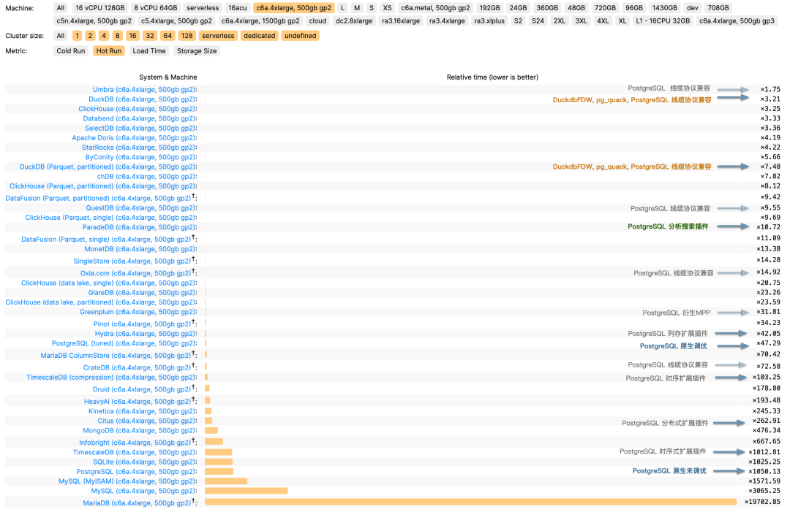
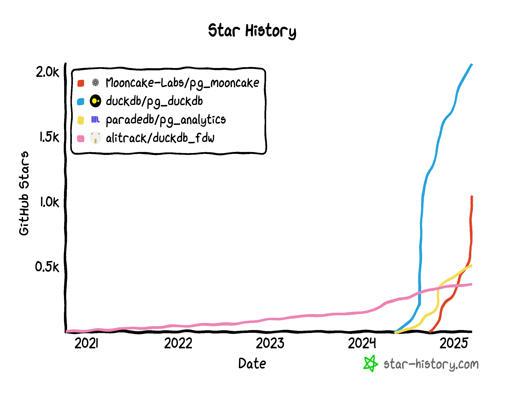
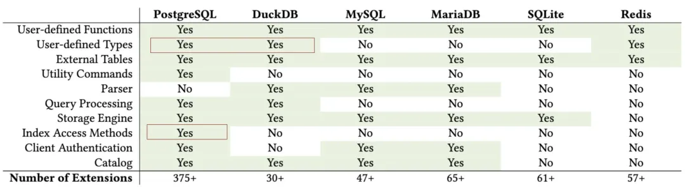

## 蹭热点引出的好话题

昨晚在直播间，我与几位国内 DuckDB 先锋进行了一场对谈。 话题跨度很大，从 DeepSeek 团队在开源周推出的分布式 DuckDB 分析框架 “Smallpond”，聊到 PostgreSQL 与 DuckDB 的深度融合，相当热闹。

DeepSeek 的开源的 “小池塘”用把 DuckDB 改为分布式的用法，从营销上给 DuckDB 打了很好的广告。 但从实用角度和影响力来说，我个人对分布式 DuckDB 的价值保持保留态度（那个3FS实际上更有用）。 因为这与 DuckDB 本身的核心价值主张（[大数据已死](https://mp.weixin.qq.com/s/gk3BOirM6uCTQ1HFTQz3ew)）完全背道而驰。

那么如果不去折腾 “分布式”，DuckDB 未来更有前景的方向是什么？ 相比之下，我更加看好 **“ DuckDB + PostgreSQL深度融合”** 这路径。 我甚至认为，它可能会引爆数据库世界下一场“火星撞地球”式的变革。

------

## DuckDB：OLAP挑战者

**DuckDB** 由 Mark Raasveldt 和 Hannes Mühleisen 在荷兰的 CWI （国家数学与计算机科学研究所）开发 —— 而 CWI 不仅仅是一个研究机构，可以说是分析型数据库领域发展背后的幕后推手与功臣，是列式存储引擎与向量化查询执行的先驱。

现在你能看到的各种分析数据库产品 ClickHouse，Snowflake，Databricks 背后都有它的影子。 而现在这些分析领域的先锋们自己亲自下场来做分析数据库，他们选择了一个非常好的时机与生态位切入，搞出了一个嵌入式的 OLAP 分析数据库 —— **DuckDB** 。

DuckDB 的起源来自作者们对数据库用户痛点的观察：数据科学家主要使用像 Python 与 Pandas 这样的工具，不怎么熟悉经典的数据库。 经常被如何连接，身份认证，数据导入导出这些工作搞的一头雾水。那么有没有办法做一个简单易用的嵌入式分析数据库给他们用呢？—— 就像 SQLite 一样。

DuckDB 整个数据库软件源代码就是一个头文件一个c++文件，编译出来就是一个独立二进制，数据库本身也就一个简单的文件。 使用兼容 PostgreSQL 的解析器与语法，简单到几乎没有任何上手门槛。尽管 DuckDB 看上去非常简单，但它最了不起的一点在于 —— **简约而不简单，分析性能也是绝冠群雄**。例如，在 ClickHouse 自己的主场 ClickBench 上，有着能够吊打东道主 ClickHouse 的表现。

同时，DuckDB 使用极为友善的 MIT 许可证开源：**一个有着顶尖性能表现，而使用门槛低到地板，还开源免费，允许随意包装套壳的数据库，想不火都难**。

------

## 取长补短的黄金组合

尽管 DuckDB 有着顶级的分析性能，但它也有自己的短处 —— 薄弱的数据管理能力， 也就是数据科学家们不喜欢的那些东西 —— 认证/权限，访问控制，高并发，备份恢复，高可用，导入导出，等等等， 而这恰好是经典数据库的长处，也是企业级分析系统的核心痛点。

从这个角度来说，duckdb 更像是 RocksDB 这样的底层 “存储引擎”，一个 OLAP 算子。 本身距离一个真正的 “数据库” / “大数据分析平台” 还有很多工作要做。

PostgreSQL 则在数据管理领域深耕多年，拥有完善的事务机制、权限控制、备份恢复和扩展机制。 传统的 OLTP 场景下 PostgreSQL 更是 [“老牌猛将”](https://mp.weixin.qq.com/s/651zXDKGwFy8i0Owrmm-Xg) 。 但 PostgreSQL 的一个主要遗憾就是：尽管PostgreSQL 本身提供了很强大的分析功能集，应付常规的分析任务绰绰有余。 但在较大数据量下全量分析的**性能**，相比专用的实时数仓仍然有些不够看。

那么人们自然而然会想到，如果我们可以结合两者的能力，**PostgreSQL** 提供全面的管理功能与生态支持，以及顶级的 OLTP 性能。 DuckDB 提供顶尖的分析算子和 OLAP 性能；二者深度融合，就能把各自优势叠加，取长补短，在数据库领域中产生一个“新物种”。

DuckDB 能很好的解决 PostgreSQL 的分析短板，甚至还可以通过读写远程对象存储上的 Parquet 等列存文件格式，实现无限存储的数据湖仓的效果；而 DuckDB 孱弱的管理能力也通过融合成熟的 PostgreSQL 生态得到完美解决。 比起给 DuckDB 套壳，搞一套什么新的 “大数据平台/数据管理系统”，或者给 PostgreSQL 发明一个新的分析引擎，两者融合起来，取长补短，是一条阻力最小，而价值最大的道路。

实际上，[这正是数据库世界中正在发生的事情](https://mp.weixin.qq.com/s/jgYDHdCqWDRDfoFkfs7W8Q)，许多团队和厂商已经投入到 DuckDB + PostgreSQL 的缝合当中，试图率先抢得这个潜力巨大的新市场。

------

## 群雄逐鹿的缝合赛道

当我们把目光投向业界，不难发现 [已经有诸多玩家入局了](https://mp.weixin.qq.com/s/TJk9TUW7xsEglhEK_qYi-w)：

最早进入这条赛道的是国内个人开发者李红艳开发的 [`duckdb_fdw`](https://pigsty.cc/ext/olap/duckdb_fdw/)，一直算是不温不火的状态。 然而在 《[PostgreSQL正在吞噬数据库世界](https://mp.weixin.qq.com/s/8_uhRH93oAoHZqoC90DA6g)》以向量数据库的例子预言了 OLAP 赛道的机会之后， PG 社区对征服 OLAP 缝合 DuckDB 的热情被彻底点燃。

就在 2024 年 3 月的时间点上，一切骤然加速。ParadeDB 的 [`pg_analytics`](https://pigsty.cc/ext/olap/pg_analytics/) 插件立即切换了技术路线，改为缝合 DuckDB。

PG 生态发起 `pg_quack` 项目的 HYDRA 与 DuckDB 母公司 MotherDuck 开始合作，发起了 [`pg_duckdb`](https://pigsty.cc/ext/olap/pg_duckdb/)。 官方开始下场， “不误正业” 地不去折腾 DuckDB，反而搞起了 PostgreSQL 插件。

接下来，在数据库热点上一向嗅觉敏锐的 Neon 赞助了 [`pg_mooncake`](https://pigsty.cc/ext/olap/pg_mooncake/) 项目，这个新玩家选择站在 pg_duckdb 的肩膀上， 不仅要把 DuckDB 的计算能力给缝合入 PG，还要将 DuckDB / Parquet 开放分析存储格式原生融合到 PG 的表访问接口中，把存储和计算能力一起缝合到 PG 中。

一些头部云厂商，比如 [阿里云rds](https://mp.weixin.qq.com/s/3M6qQCsNUETEWcMwI3eFIQ) 也在尝试缝合包装 DuckDB，标志着已经有大玩家开始忍不住准备下场了。

这种场面很容易让人联想到早两年的“向量数据库热”。当 AI 检索和语义搜索成为热点，不少厂商都“闻风而动”，基于 PostgreSQL 开发向量数据库插件， AI爆火之后，PG 生态里就涌现出了至少六款向量数据库扩展（ `pgvector`，`pgvector.rs`，`pg_embedding`，`latern`，`pase`，`pgvectorscale`）， 并在你追我赶的赛马中卷出了新高度。

最后 `pgvector` 在以 AWS 为代表的厂商大力投入加注之下，在其他数据库比如 Oracle / MySQL / MariaDB 的糊弄版本姗姗来迟之前， 就已经把整个专用向量数据库细分领域给荡平了，吃下了 RAG / 向量数据库带来巨大增量里的最大蛋糕。而现在，似乎是这种赛事在 OLAP 领域的又一次预演。

------

## 为什么是DuckDB+PG？

比较有趣的一点是，这样的奇景同样只出现在 PostgreSQL 生态中，而在其他数据库社区中依然一片寂静。 甚至 DuckDB 官方也在参加 PostgreSQL 缝合大赛，而不是其他什么 DB 的缝合大赛。

所以有人会问：既然要跟 DuckDB 融合，为什么不选 MySQL、Oracle、SQL Server 甚至 MongoDB？ 难道这些数据库就没有管理能力，不需要取长补短，不能跟 DuckDB 融合，获取顶级 OLAP 能力吗？

PostgreSQL 与 DuckDB 是一对完美的组合，体现在三点上：功能互补，语法兼容，可扩展性：

首先，DuckDB 使用的是 PostgreSQL 语法，甚至语法解析器都是直接照搬 PG 的， 这意味着两者关键接口的差异性非常小，天然具有亲和力，也就是不怎么需要折腾。

第二，PostgreSQL 和 DuckDB 这两个数据库均是公认的“可扩展性怪物”。无论是 FDW、插件，还是新存储引擎、新类型，都能以扩展的形式接入。 比起魔改 PG + DuckDB 的内核源码，写一个粘合两边现有接口的扩展插件显然要简单太多了，

这种天生的技术血缘亲和力，让 “PG + DuckDB” 的融合成本显著低于所有其他组合，低到李老师这样的独立个人开发者都可以参赛（顺势而为是好事，无任何贬义）。

与此同时 PostgreSQL 是世界上最流行的数据库，也是主要数据库中唯一有增长而且是高速增长的玩家，缝合 PostgreSQL 带来的收益也要比其他数据库大得多。

这意味着，**“PG + DuckDB”** 的融合，是一条“阻力最小、价值最大”的康庄大道，大自然厌恶真空，因此自然会有许多玩家下场来填补这里的空白生态位。

------

## 统一 OLTP 与 OLAP 的梦想

在数据库领域，OLTP 与 OLAP 的分裂由来已久。所有的“数据仓库 + 关系型数据库”架构、ETL 和 CDC 流程，都是在修修补补这道裂痕。 如果 **PostgreSQL** 在保留其 OLTP 优势的同时，能嫁接上 **DuckDB** 的 OLAP 性能，企业还有必要再维护一套专门的分析数据库吗？

这不仅意味着**“降本增效”**，更可能带来工程层面的简化：无需再为数据迁移和多数据库同步烦恼，也无需支付昂贵的双套维护成本。 一旦有人把这件事做得足够好，就会像“一颗深水炸弹”般冲击现在大数据分析的市场格局。

PostgreSQL 被视为“数据库界的 Linux 内核” —— 它的开源精神和极强的可扩展性允许无限可能。 而我们目睹着 PostgreSQL 使用这种方式，依次占领了地理信息，时序数据，NoSQL文档，向量嵌入等领域。 而现在，它正准备向最后也是最大的生态位 —— OLAP 分析领域发起冲击。

只要一个优秀的集成方案出现，能让 DuckDB 提供的高性能分析与 PostgreSQL 的生态完美融合，整个大数据分析领域或许会因此大变天。 那些专门的 OLAP 产品，能否顶住这场“核爆级”冲击？是否会像那些 “专用向量数据库” 一样凋零， 现在没人愿意给出答案，但我相信到时候大家都会有自己的判断。

------

## 为PG与DuckDB缝合铺好路

PostgreSQL OLAP 生态的现状，正如同两年前的向量数据库插件一样，还处于早期阶段。 但这已经足够令人兴奋：新技术的魅力就在于，你能预见它的潜力，就能率先拥抱它的爆发。

两年前 PGVECTOR 爆火前夜，Pigsty 是第一波将其整合的 PostgreSQL 发行版，也是我将它提入 PGDG 官方扩展仓库的。 而这场 DuckDB 缝合大赛，[干脆就是我点的火](https://mp.weixin.qq.com/s/jgYDHdCqWDRDfoFkfs7W8Q)。能点燃这样的赛事，我自然也会在这场新的赛事中，提前为 PG 与 DuckDB 的融合铺好路。

作为一名深耕数据库领域的从业者，我正在把当前各家与 DuckDB 融合的 PostgreSQL 插件 全部打包成可直接安装使用的 RPM 或 DEB 包，并在主流的十个 Linux 发行版上提供， 与 PGDG 官方内核完全兼容，开箱即用，让普通用户也能轻松体验“DuckDB + PG”融合的威力。 最重要的是，提供一个缝合大赛的“竞技舞台”，让所有玩家都平等参与进来。

诚然，现在不少插件仍处于早期阶段，稳定性和功能尚未达到“企业级”的标准。也有很多细节待完善，比如并发访问控制、数据类型兼容、算子优化等。 机会总是属于勇于拥抱新技术的人，而我相信，这场“PG + DuckDB”融合的大戏，将会是数据库领域的下一个风口。

------

## 真正的爆炸即将开始

比起当下 AI 大模型落地在企业应用中仍显“虚浮”的热潮，**OLAP 大数据分析** 是一块更为庞大、也更现实的市场蛋糕。 而 **PostgreSQL 与 DuckDB 的融合** 则有望成为冲击这个市场的板块运动，引发行业格局的深度变革，甚至彻底打破“大数据系统 + 关系型数据库”两套架构并行的局面。

或许再过几个月到一两年的时间，我们就能看到一个或多个“融合怪物”从这些实验性项目中脱颖而出，成为数据库的新主角。 谁能先解决好扩展的易用性、集成度和性能优化，谁就能在这场新竞争中夺得先机。

对于数据库行业而言，这将是一次“火星撞地球”般的深度震荡；对于广大企业用户而言，或许会迎来一场“降本增效”的巨大机遇。 让我们拭目以待这场新趋势如何加速成长，并为数据分析与管理带来新的可能。

- [PostgreSQL正在吞噬数据库世界](https://mp.weixin.qq.com/s/8_uhRH93oAoHZqoC90DA6g)
- [谁整合好DuckDB，谁赢得OLAP数据库世界](https://mp.weixin.qq.com/s/TJk9TUW7xsEglhEK_qYi-w)
- [阿里云rds_duckdb：致敬还是抄袭？](https://mp.weixin.qq.com/s/3M6qQCsNUETEWcMwI3eFIQ)
- [分布式数据库是伪需求吗？](https://mp.weixin.qq.com/s/-eaCoZR9Z5srQ-1YZm1QJA)
- [Andy Pavlo: 2024年度数据库回顾](https://mp.weixin.qq.com/s/jgYDHdCqWDRDfoFkfs7W8Q)

-
- 