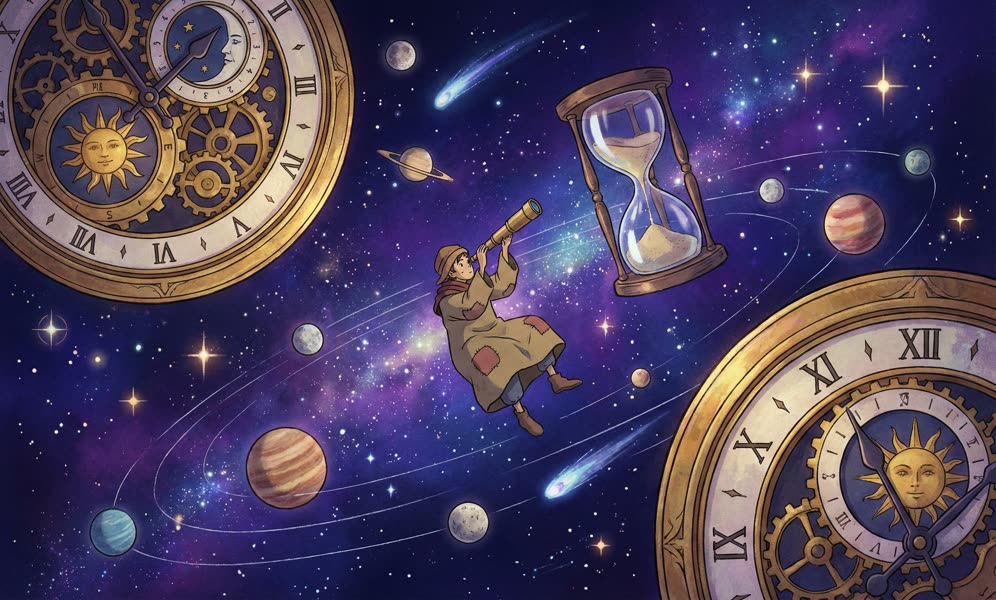

A few days ago, we encountered the quadrennial leap year February 29th. Every time this day comes around, some poorly written software experiences major failures. If you're unlucky, this type of problem might take four years to surface.
For example, today's fresh cases: Hesai Technology's lidar and New Zealand gas stations both became unusable due to leap year bugs.

Let's discuss the principles of leap years, leap seconds, time and time zones, as well as considerations in databases and programming languages.

[](https://mp.weixin.qq.com/s/JNLMAzpLnk6y9lCSpClPlQ)


--------------

## 0x01 Seconds and Timekeeping

The unit of time is the second, but the definition of a second has not remained constant. It has both an astronomical definition and a physical definition.


### Universal Time (UT1)

Initially, **the definition of a second was derived from the day**. A second was defined as 1/86400 of a mean solar day. A solar day is defined by astronomical phenomena: the **interval** between two consecutive **noon** times is defined as a **solar day**; a day has 86400 seconds, so one second equals 1/86400 of a day. Perfect! The time standard formed by this standard is called **Universal Time (UT1)**, or less precisely, **Greenwich Mean Time (GMT)**. Let's use GMT to refer to it below.

This definition is intuitive, but has a problem: it's based on astronomical phenomena - the periodic motion of Earth relative to the Sun. Whether using Earth's revolution or rotation to define the second, there's an awkward issue: although the speed changes of Earth's rotation and revolution are very slow, they're not constant. For example, Earth's rotation is gradually slowing down, and the Earth-Moon position also causes each day's length to vary slightly. This means that the second, as a fundamental physical unit, actually varies in length. This becomes awkward when measuring **time durations** - a second from decades ago might already be different from today's second.


### Atomic Time (TAI)

To solve this problem, after 1967, the definition of a second became: **the duration of 9,192,631,770 periods of radiation corresponding to the transition between two hyperfine levels of the ground state of the cesium-133 atom**. The definition of a second was upgraded from an astronomical definition to a physical definition, described by more stable fundamental physical facts of the universe rather than relatively variable astronomical phenomena. Now we have truly **precise** seconds: the deviation wouldn't exceed one second even over 100 million years.

Of course, such precise seconds can be used not only to measure time intervals but also for timekeeping. Starting from `1958-01-01 00:00:00` as a common time origin, the **International Atomic Clock** began counting. Every 9,192,631,770 atomic energy level transition cycles adds +1s. This clock runs very accurately, with each second being uniform. Time using this definition is called **International Atomic Time (TAI)**, abbreviated as TAI below.

### Conflict

Initially, these two types of seconds were equivalent: one day equals 86400 astronomical seconds, which also equals 86400 physical seconds, since the physical definition was specifically designed to match the astronomical definition. Correspondingly, **GMT** and International Atomic Time **TAI** were also synchronized. However, as mentioned earlier, astronomical phenomena have too many influencing factors and aren't truly "constant in celestial motion." As Earth's rotation and revolution speeds change, astronomically defined seconds become slightly longer than physically defined seconds, meaning GMT lags slightly behind TAI.

So which definition takes precedence - Universal Time or Atomic Time? When theory conflicts with practical experience, most people won't choose counter-intuitive solutions. Imagine an extreme scenario where the difference between the two clocks accumulates to several minutes or even hours: clearly it should be noon at `12:00:00` according to GMT, but GMT has slowed down and TAI shows 6 PM - this violates intuition. For **representing moments in time**, astronomical definition takes precedence, i.e., GMT is the standard.

Of course, even if astronomical definition takes precedence, we must respect physical laws - atomic clocks are so accurate! Actually, the difference between Universal Time and Atomic Time is only on the order of a few seconds. So we naturally think: use International Atomic Time TAI as the base, but add some **leap seconds** to correct to GMT, wouldn't that work? This would have both high precision and conform to common sense. Thus came the new **Coordinated Universal Time (UTC)**.

### Coordinated Universal Time (UTC)

**UTC is a product reconciling GMT and TAI:**

* UTC uses precise International Atomic Time TAI as the timekeeping foundation
* UTC uses International Time GMT as the correction target
* UTC uses leap seconds as the correction method

What we commonly call time usually refers to **Coordinated Universal Time UTC**. Its difference from Universal Time GMT is within 0.9 seconds. In less strict practice, UTC time and GMT time can be considered identical, and many people confuse them.

But problems immediately arise. Traditionally, one day has 24 hours, one hour has 60 minutes, one minute has 60 seconds, with a conversion ratio of 86400 between days and seconds. Previously, days were used to define seconds; now seconds have become the fundamental unit for defining days. But now one day doesn't equal 86400 seconds. No matter which end defines which, there will be conflicts. The only solution is to break tradition: one minute doesn't necessarily have only 60 seconds - it can have 61 seconds when needed!

This is the **leap second** mechanism. UTC is based on TAI, so it also runs faster than GMT. Assuming the difference between UTC and GMT keeps growing, when it's about to exceed one second, a certain minute in UTC becomes 61 seconds. This extra second is like UTC waiting for GMT, and then the error is caught up. Each time a second is added, UTC falls behind TAI by one more second. As of now, UTC is more than thirty seconds behind TAI. The most recent leap second adjustment was during the 2016 New Year transition:

> International standard time UTC will implement a positive leap second on atomic clocks after Greenwich time December 31, 2016, 23:59:59 (Beijing time January 1, 2017, 7:59:59), i.e., adding 1 second before entering the new year.

So GMT and UTC are different - you can see `2016-12-31 23:59:60` in UTC time, but not in GMT.


--------------

## 0x02 Local Time and Time Zones

The times discussed so far assume a premise: time at the prime meridian (0° longitude). We also need to consider other places on Earth: after all, when it's broad daylight in America, it's still midnight in China.

Local time, as the name suggests, is time calculated based on the local sun: noon is 12:00. The sun rises in the east and sets in the west, so local time at 120° east longitude is `120° / (360°/24) = 8` hours ahead of the prime meridian. This means when it's 12:00 noon Beijing local time, UTC time is actually `12-8=4`, 4:00 AM.

Would it be fine if everyone used UTC time? Of course it would - after all, China spans three time zones but uses only Beijing time. As long as everyone gets used to it, it works. But everyone is already accustomed to local noon being 12 o'clock. Forcing the world's people to use unified time actually goes against historical habits. Time zone settings allow long-distance travelers to easily know local people's schedules: roughly everyone works 9-to-5. This reduces communication costs. Hence the concept of time zones. Of course, like Xinjiang stubbornly using Beijing time, the result is that tourists might be confused when they first see locals going to work at 11 or 12 o'clock.


But within a unified country, using unified time also helps reduce communication costs. If a Xinjiang person and a Heilongjiang person make a phone call, one using Urumqi time and the other using Beijing time, they'd talk past each other. Both agree on 12 o'clock, but there's actually a two-hour difference. Time zone selection isn't entirely based on geographical longitude - there are many other considerations (such as administrative divisions).

This introduces the concept of time zones: **a time zone is a region on Earth that uses the same local time definition**. **Time zones can actually be viewed as a function from geographical regions to time offsets**.

Actually, whether there's a geographical region doesn't matter - the key is the concept of **time offset**. UTC/GMT time itself has an offset of 0, and time zone offsets are all relative to UTC time. Here, the relationship between local time, UTC time, and time zones is:

> Local Time = UTC Time + Local Time Zone Offset

For example, UTC and GMT time zones are both `+0`, meaning no offset. China's East 8th zone has an offset of `+8`, meaning when calculating local time, 8 hours must be added to UTC time.

**Daylight Saving Time (DST)** can be viewed as a special time zone offset correction. It refers to moving clocks forward by one hour (not necessarily one hour) during summer when daylight comes earlier, thereby saving energy (lighting). China briefly used daylight saving time between 1986 and 1992. The EU has used daylight saving time since 1996, though recent EU polls show 84% of citizens want to abolish daylight saving time. For programmers, daylight saving time is also an additional hassle - hopefully it can be swept into the dustbin of history soon.


--------------

## 0x03 Time Representation

So how is time represented? Using TAI seconds to represent time certainly wouldn't be ambiguous, but it's inconvenient to use. Conventionally, we divide time into three parts: date, time, and time zone, each with multiple representation methods. For time representation, people from different countries have different habits. For example, for January 2, 2006, Americans might prefer formats like `January 2, 1999` or `1/2/1999`, while Chinese people might use "2006年1月2日" or "2006/01/02". In email headers, time uses the format `Sat, 24 Nov 2035 11:45:15 −0500` specified in RFC2822. Additionally, there are various RFCs and standards specifying date and time representation formats.

```bash
ANSIC       = "Mon Jan _2 15:04:05 2006"
UnixDate    = "Mon Jan _2 15:04:05 MST 2006"
RubyDate    = "Mon Jan 02 15:04:05 -0700 2006"
RFC822      = "02 Jan 06 15:04 MST"
RFC822Z     = "02 Jan 06 15:04 -0700" // RFC822 with numeric zone
RFC850      = "Monday, 02-Jan-06 15:04:05 MST"
RFC1123     = "Mon, 02 Jan 2006 15:04:05 MST"
RFC1123Z    = "Mon, 02 Jan 2006 15:04:05 -0700" // RFC1123 with numeric zone
RFC3339     = "2006-01-02T15:04:05Z07:00"
RFC3339Nano = "2006-01-02T15:04:05.999999999Z07:00"
```

However, here we only focus on date representation and storage methods in computers. In computers, the most classic time representation is the Unix timestamp.

### Unix Timestamp

Compared to UTC/GMT, programmers might be more familiar with another type of time: Unix timestamp. The UNIX timestamp is the number of seconds that have elapsed since January 1, 1970 (UTC/GMT midnight, before 1972 there were no leap seconds). Note that the seconds here are actually GMT seconds, i.e., **not counting leap seconds**, since one day equals 86400 seconds has been hardcoded into countless program logic and cannot be changed.

The advantage of using GMT seconds is that you don't need to consider leap seconds when calculating dates. After all, leap years are annoying enough - adding irregular leap seconds would definitely drive programmers crazy. Of course, this doesn't mean leap seconds don't need to be considered at all. Services like ntp still need to consider leap seconds, and applications might be affected: for example, encountering 'time reversal' by getting two `59` seconds, or obtaining time values with `60` seconds, which might crash some poorly implemented programs. Of course, there's also a smooth method of distributing leap seconds across an entire day.

The idea behind Unix timestamps is simple: establish a timeline, use a specific **epoch point** as the origin, and represent time as the **number of seconds** from that origin. The Unix timestamp epoch is `1970-01-01 00:00:00` GMT time, and on 32-bit systems, timestamps are actually signed 4-byte integers in seconds. This means the time range it can represent is: `2^32 / 86400 / 365 = 68` years, roughly from 1901 to 2038.

Of course, timestamps aren't limited to this representation method, but this is usually the most traditional, stable, and reliable approach. After all, not all programmers can handle the subtle errors related to time zones and leap seconds properly. The advantage of using Unix timestamps is that the time zone is fixed as GMT, and storage space and certain computational processing (like sorting) are relatively easy.

In *nix command line, use `date +%s` to get the Unix timestamp. `date -r @1500000000` can reversely convert Unix timestamps to other time formats, for example, to convert to `2017-07-14 10:40:00` use:

```bash
date -d @1500000000 '+%Y-%m-%d %H:%M:%S'	# Linux
date -r 1500000000 '+%Y-%m-%d %H:%M:%S'		# MacOS, BSD
```

Long ago, when the battery on the motherboard died, the system clock would automatically reset to 0. Many software bugs also caused timestamps to be 0, i.e., `1970-01-01`. This epoch time became known to many non-programmers.

Of course, the 4-byte Unix timestamp limit of 2038 is no longer distant from today (2024), and software that hasn't been updated to use 8-byte timestamps will face a much more severe Y2K problem than leap day gas station outages - they'll simply stop working, like the idiot MySQL that still hasn't been updated.


--------------

## PostgreSQL Time Storage

Usually, Unix timestamps are the **best way to transmit/store** time. They typically exist in computers as integers, containing the number of seconds from a specific epoch. They are extremely simple, unambiguous, more compact in storage, convenient for comparison, and have widespread consensus among programmers. However, Epoch+integer offset is suitable for storage and exchange on machines, but it's not a human-readable format (though some programmers might be able to read it).

PostgreSQL provides rich date and time data types and related functions. It can automatically adapt to various time input and output formats with high flexibility while storing and computing internally using efficient integer representations. In PostgreSQL, the variable `CURRENT_TIMESTAMP` or function `now()` returns the local timestamp when the current transaction began, returning type `TIMESTAMP WITH TIME ZONE`, a PostgreSQL extension that carries additional time zone information on timestamps. The SQL standard specifies type `TIMESTAMP`, implemented in PostgreSQL using 8-byte long integers. You can use SQL syntax `AT TIME ZONE zone` or built-in function `timezone(zone,ts)` to convert `TIMESTAMP` with time zones to the standard version without time zones.

Usually, the best practice is: as long as the application has any scale or involves any internationalization features, either follow PostgreSQL Wiki's [recommended best practices](https://wiki.postgresql.org/wiki/Don%27t_Do_This#When_should_you.3F_8) to use PostgreSQL's own `TimestampTZ` extension type, or use `TIMESTAMP` type and consistently store GMT/UTC time.

PostgreSQL's timestamp implementation uses 8 bytes, representing a time range from 4713 BC to 290,000 years in the future, with microsecond precision, completely eliminating concerns about the 2038 Y2K problem.

```sql
-- Get local transaction start timestamp
vonng=# SELECT now(), CURRENT_TIMESTAMP;
              now              |       current_timestamp
-------------------------------+-------------------------------
 2018-12-11 21:50:15.317141+08 | 2018-12-11 21:50:15.317141+08

-- now()/CURRENT_TIMESTAMP returns timestamps with time zone information
 vonng=# SELECT pg_typeof(now()),pg_typeof(CURRENT_TIMESTAMP);
        pg_typeof         |        pg_typeof
--------------------------+--------------------------
 timestamp with time zone | timestamp with time zone
 

-- Convert local time zone +8 time to UTC time, conversion yields TIMESTAMP
-- Note: don't use TIMESTAMPTZ to TIMESTAMP cast, which directly truncates time zone info.
 vonng=# SELECT now() AT TIME ZONE 'UTC';
          timezone
----------------------------
 2018-12-11 13:50:25.790108

-- Convert UTC time to Pacific time again
vonng=# SELECT (now() AT TIME ZONE 'UTC') AT TIME ZONE 'PST';
           timezone
-------------------------------
 2018-12-12 05:50:37.770066+08
 
 -- View PG's built-in time zone data table
 vonng=# TABLE pg_timezone_names LIMIT 4;
       name       | abbrev | utc_offset | is_dst
------------------+--------+------------+--------
 Indian/Mauritius | +04    | 04:00:00   | f
 Indian/Chagos    | +06    | 06:00:00   | f
 Indian/Mayotte   | EAT    | 03:00:00   | f
 Indian/Christmas | +07    | 07:00:00   | f
...

-- View PG's built-in time zone abbreviations
vonng=# TABLE pg_timezone_abbrevs  LIMIT 4;
 abbrev | utc_offset | is_dst
--------+------------+--------
 ACDT   | 10:30:00   | t
 ACSST  | 10:30:00   | t
 ACST   | 09:30:00   | f
 ACT    | -05:00:00  | f
 ...
```

### Common Confusion: Leap Days

PostgreSQL handles leap days well, but special attention is needed for leap year time range arithmetic rules.
For example, if you subtract "one year" from '2024-02-29', the result is "2023-02-28", but if you subtract 365 days, it's "2023-03-01".
Conversely, if you add one year, 12 months, or 365 days, the result is next year's February 28th.
This handling is definitely more reliable than some idiot software that simply adds +1 to the year.

```sql
postgres=# SELECT '2023-02-29'::DATE;  --# 2023 is not a leap year
ERROR:  date/time field value out of range: "2023-02-29"
LINE 1: SELECT '2023-02-29'::DATE;
               ^
postgres=# SELECT '2024-02-29'::DATE;
    today
------------
 2024-02-29

postgres=# SELECT '2024-02-29'::DATE + '1year'::INTERVAL;
    next_year
---------------------
 2025-02-28 00:00:00

postgres=# SELECT '2024-02-29'::DATE + '365day'::INTERVAL;
next_365d
---------------------
 2025-02-28 00:00:00
    
postgres=# SELECT '2024-02-29'::DATE - '1year'::INTERVAL;
     prev_year
---------------------
 2023-02-28 00:00:00

     
postgres=# SELECT '2024-02-29'::DATE - '365day'::INTERVAL;
      prev_365d
---------------------
 2023-03-01 00:00:00
```


### Common Confusion: Timestamp Conversion

A frequently confusing issue in PostgreSQL is the mutual conversion between `TIMESTAMP` and `TIMESTAMPTZ`.

```sql
-- Using `::TIMESTAMP` to cast `TIMESTAMPTZ` to `TIMESTAMP` directly truncates the time zone part
-- The remaining "content" of the time stays unchanged
vonng=# SELECT now(), now()::TIMESTAMP;
             now               |           now
-------------------------------+--------------------------
 2018-12-12 05:50:37.770066+08 |  2018-12-12 05:50:37.770066+08

-- Using AT TIME ZONE syntax on TIMESTAMPTZ with time zones
-- converts it to TIMESTAMP without time zones, returning time in the given time zone
vonng=# SELECT now(), now() AT TIME ZONE 'UTC';
              now              |          timezone
-------------------------------+----------------------------
 2019-05-23 16:58:47.071135+08 | 2019-05-23 08:58:47.071135
 
 
-- Using AT TIME ZONE syntax on TIMESTAMP without time zones
-- converts it to TIMESTAMPTZ with time zones, i.e., interpreting that timezone-free timestamp in the given time zone.
vonng=# SELECT now()::TIMESTAMP, now()::TIMESTAMP AT TIME ZONE 'UTC';
            now             |           timezone
----------------------------+-------------------------------
 2019-05-23 17:03:00.872533 | 2019-05-24 01:03:00.872533+08
 
-- This means UTC time 2019-05-23 17:03:00
```


### Common Confusion: Time Zone Offsets

Of course, PostgreSQL timestamps have a somewhat counter-intuitive design related to time zones: when using `AT TIME ZONE`, you should avoid using numerical time zones like `+8`, `-6` and instead use time zone names.

This is because when you use numerical values in the time zone part, PostgreSQL treats them as Interval types, interpreted as "Fixed" Offsets from UTC, which is uncommon and not recommended in documentation.

For example, East 8th zone noon today (SELECT '2024-01-15 12:00:00+08'::TIMESTAMPTZ) converted to UTC timestamp is '2024-01-15 04:00:00' (East 8th zone 12 o'clock = UTC zone 0 4 o'clock), which is fine:

```sql> SELECT '2024-01-15 12:00:00+08'::TIMESTAMPTZ AT TIME ZONE '+0';
2024-01-15 04:00:00

```

Now, using '+1' as zone, the intuitive idea should be that +1 represents East 1st zone current time, which should be "2024-01-15 05:00:00+1", but the result is surprising: it's actually one hour earlier:

```sql
> SELECT '2024-01-15 12:00:00+08'::TIMESTAMPTZ AT TIME ZONE '+1';
2024-01-15 03:00:00
```

And if we naively use `-1` as West 1st zone time zone name, the result is also wrong:

```sql
> SELECT '2024-01-15 04:00:00+00'::TIMESTAMPTZ AT TIME ZONE '-1';
timezone
---------------------
2024-01-15 05:00:00
```


The reason is that using Interval instead of time zone names has different processing logic:

First, East 8th zone `TIMESTAMPTZ '2024-01-15 12:00:00+08'` is converted to UTC time `TIMESTAMPTZ '2024-01-15 04:00:00+00'`.
Then, UTC time `TIMESTAMPTZ '2024-01-15 04:00:00+00'` has its time zone part truncated to `'2024-01-15 04:00:00'` and the new time zone `+1` appended
to become a new `TIMESTAMPTZ '2024-01-15 04:00:00+1'`, then this new timestamp is converted back to timezone-free UTC time `'2024-01-15 03:00:00'`