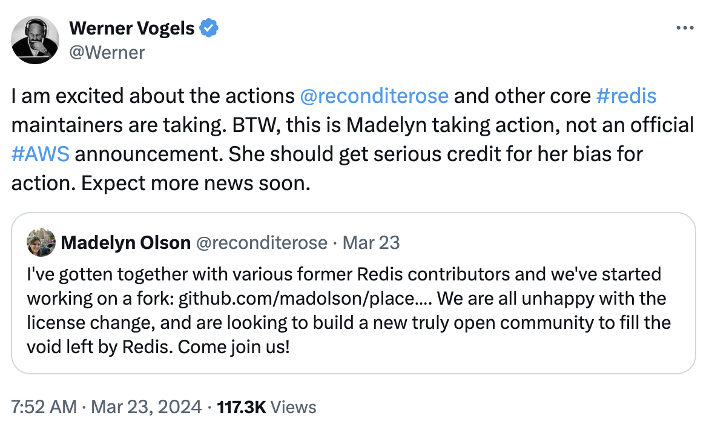
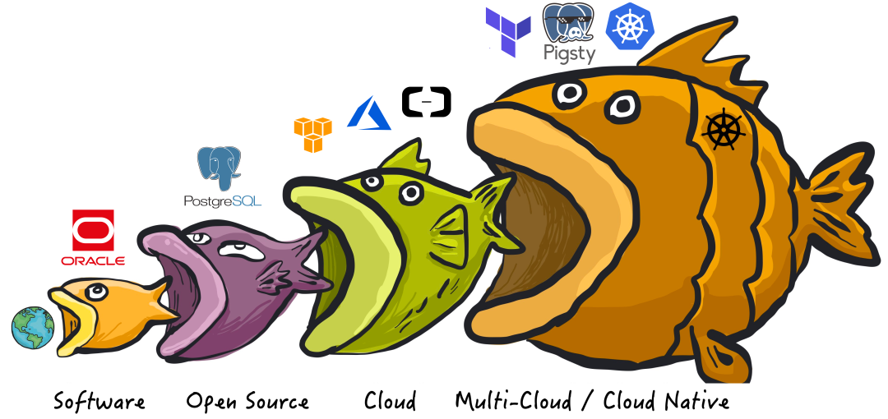

Recently, Redis changed its license, causing controversy: starting from version 7.4, it uses RSALv2 and SSPLv1, no longer meeting OSI's definition of "open source software." But don't get it wrong: **Redis "going non-open source" is not a disgrace to Redis, but a disgrace to "open source/OSI"** — it reflects the obsolescence of open source [**organizations**](https://opensource.org/) and ideologies.

**The number one enemy of software freedom today is public cloud services**. "**Open source**" versus "**closed source**" is no longer the core contradiction in the software industry; the focus of struggle has shifted to "**cloud services**" versus "**local-first**." Public cloud vendors have been freeloading on open source software and parasitically benefiting from community achievements, which is destined to provoke strong community backlash.

In practice to resist cloud vendor freeloading, changing licenses is the most common approach: but AGPLv3 is too strict and can harm both enemies and allies, while SSPL is not considered open source because it explicitly expresses this enemy-ally discrimination. The industry needs a new discriminatory software license that can legitimately distinguish between friend and foe.

What truly matters has always been software freedom, while "open source" is just one means to achieve software freedom. If the "open source" ideology cannot adapt to the needs of the new stage of contradiction and struggle, and even hinders software freedom, it will also become obsolete and no longer important, eventually being replaced by new ideologies and practices.

------

## Open-Source Software Changing Licenses

> "**I want to be frank: for years, we've been like fools while they made a fortune from what we developed**."
>
> Redis Labs CEO Ofer Bengal

Redis has been developers' favorite database system for years (until [being surpassed by PostgreSQL](/pg/pg-is-no1) last year), using the very friendly BSD-3 Clause license and being widely deployed everywhere. However, you can find cloud Redis database services on almost all public clouds, with cloud vendors making huge profits while Redis Inc. and open source community contributors who pay the R&D costs are left aside. This unfair production relationship is destined to provoke fierce backlash.

The core reason Redis switched to the more restrictive SSPL license, in the words of Redis Labs CEO, is: "**For years, we've been like fools while they made a fortune from what we developed**." Who are "they"? — **Public cloud providers**. The purpose of switching to SSPL is to try to use legal tools to prevent these cloud vendors from freeloading on open source, to become respectable community participants by open sourcing management, monitoring, hosting and other code back to the community.

Unfortunately, you can force a company to provide source code for their GPL/SSPL derivative software projects, but you can't force them to become good citizens of the open source community. Public cloud providers usually scoff at such licenses — most cloud vendors simply refuse to use AGPL-licensed software: either using an alternative implementation with a more permissive license, reimplementing necessary functionality themselves, or directly purchasing a commercial license without copyright restrictions.

When Redis announced the license change, AWS employees immediately jumped out to fork Redis — "Redis is no longer open source, our fork is truly open source!" Then the AWS CTO came out to [applaud](https://twitter.com/Werner/status/1771324218506108995), hypocritically saying: this is our employee's personal action — it's literally a real-life example of murder and character assassination.

> Image: AWS CTO [retweet](https://twitter.com/Werner/status/1771324218506108995) of employee forking Redis

Redis isn't the only one treated this way. MongoDB, which invented SSPL, faced the same thing — when MongoDB switched to SSPL in 2018, AWS created a so-called "API-compatible" [DocumentDB](https://docs.aws.amazon.com/govcloud-us/latest/UserGuide/govcloud-dcdb.html) to spite them. After ElasticSearch changed licenses, AWS launched [OpenSearch](https://opensearch.org/) as an alternative. Leading NoSQL databases have all switched to SSPL, and AWS has created corresponding "open source alternatives" for all of them.

Because of introducing additional restrictions and so-called "discriminatory" clauses, OSI hasn't recognized SSPL as an open source license. Therefore, using SSPL is interpreted as — "Redis is no longer open source," while cloud vendors' various forks are "open source." From a legal tool perspective, this is valid. But from a naive moral sentiment perspective, such statements are extremely unfair defamation and humiliation of Redis.

-------------------

As Teacher Luo Xiang said: legal tool judgments can never override community members' naive moral sentiments. If Xiehe and Huaxi aren't Grade A tertiary hospitals, then it's not these hospitals that should be ashamed, but the Grade A tertiary standard. If Game of the Year isn't The Witcher 3, Breath of the Wild, or Baldur's Gate, then it's not these developers that should be ashamed, but the rating agencies. If Redis is no longer considered "open source," it's OSI and the open source concept that should truly feel ashamed.

More and more well-known open source software are switching to licenses that are hostile to cloud vendor freeloading. Not just Redis, MongoDB, and ElasticSearch. MinIO and Grafana switched from Apache v2 license to AGPLv3 license in 2020 and 2021 respectively. HashiCorp's various components, MariaDB MaxScale, and Percona MongoDB all use similar BSL licenses.

Some veteran open source projects like PostgreSQL, as PG core member Jonathan said, have thirty years of reputation and history that make it practically [impossible to change open source licenses](/pg/pg-license). But we can see that many powerful new PostgreSQL [extensions](/zh/docs/about/license#协议清单) are starting to use AGPLv3 as their default open source license, rather than the previously default BSD-like/PostgreSQL friendly licenses. For example, distributed extension Citus, columnar extension Hydra, ES full-text search alternative extension BM25, OLAP acceleration component PG Analytics... and so on.

Including our own PostgreSQL distribution Pigsty, which switched from Apache license to [AGPLv3 license](/zh/docs/about/license) when version 2.0 was released. The motivation behind this is similar — to fight back against the biggest enemy of software freedom — cloud vendors. We can't change existing stock, but for incremental functionality, effective counterattack and change are possible.

In practice to resist cloud vendor freeloading, changing licenses is the most common approach: AGPLv3 is a relatively mainstream practice, while the more radical SSPL is not considered open source because it explicitly expresses this enemy-ally discrimination. Using dual licensing for clear boundary distinction is also becoming a mainstream open source commercialization practice. But importantly: **the industry needs a new discriminatory software license that can legitimately distinguish friend from foe and treat them differently — to solve the biggest challenge software freedom faces today — cloud services.**

-------------------

## Paradigm Shift in the Software Industry

> Software eats the world, open source eats software, cloud eats open source.

Today, the number one enemy of software freedom is cloud computing rental services. **"Open source" versus "closed source" is no longer the core contradiction in the software industry; the focus of struggle has shifted to "cloud services" versus "local-first."** To understand this, we need to review several major paradigm shifts in the software industry, using databases as an example:

**Initially, software ate the world**, with commercial databases represented by Oracle using software to replace manual bookkeeping for data analysis and transaction processing, greatly improving efficiency. However, commercial databases like Oracle are very expensive — software licensing fees alone can cost tens of thousands per vCPU per month, often only affordable by financial industries and large institutions. Even internet giants like Taobao had to "de-Oracle" when volumes increased.

**Then, open source ate software**, with "**open source**" free databases like PostgreSQL and MySQL emerging. Open source software itself is free, costing only dozens of yuan per core per month in hardware costs. In most scenarios, if you can find one or two database experts to help enterprises use open source databases well, it's much more cost-effective than foolishly paying Oracle.

**Then, cloud ate open source**. Public cloud software is the result of internet giants productizing their ability to use open source software for external output. Public cloud vendors wrap open source database kernels with shells, package them with management software running on managed hardware, and build shared open source expert pools to provide consulting and support, creating **cloud database services** (RDS). Hardware resources costing 20¥/core·month are packaged and become sky-high RDS services costing 300-1300¥/core·month.

Once, **the biggest enemy of software freedom was commercial closed source software**, represented by Microsoft and Oracle — many developers still have deep impressions of Microsoft's reputation before embracing open source. In fact, the entire free software movement originated from anti-Microsoft sentiment in the 1990s. But the concepts of free software and open source software have completely changed the software world: commercial software companies spent massive amounts of money fighting this idea for decades. Eventually, they still couldn't resist the rise of open source software — open source broke commercial software monopolies, making software, a core IT production material, publicly owned by developers worldwide and distributed according to need. Developers contribute according to their ability, everyone for me and me for everyone, directly catalyzing the golden age of internet prosperity.

**Open source is not a business model; it even strongly violates commercialization logic**. However, any sustainable model needs to acquire resources to pay costs, and open source is no exception. Open source's real model is — creating high-paying technical expert positions through free software. Open source experts distributed across different enterprises and organizations, prosumers, are the core force of (pure-blood) open source software communities — **free open source software attracts users, user demand creates open source expert positions, open source experts collaboratively create better open source software**. Open source experts, as organizational agents, draw strength from open source communities and collective wisdom achievements. Organizations enjoy the benefits of open source software (software freedom, no commercial software licensing fees), while distributed employers can easily cover these experts' salary costs.

However, public cloud, especially cloud software, has destroyed this ecological cycle — a few cloud giants attempt to monopolize open source expert supply, trying to achieve the monopoly that commercial software failed to achieve in the dimension of **using open source software well** (services). Cloud vendors write management software for open source software, form expert pools, capture most of the value in the software lifecycle through providing maintenance, and through freeloading behavior, make the entire open source community bear the biggest cost — **R&D**. More damagingly, [**truly valuable management/monitoring code is never contributed back to open source communities**](/cloud/rds/#云数据库的模式与新挑战). The greater harm is — public cloud, like top livestream hosts eliminating many local convenience stores, destroys many open source job opportunities, cutting off talent flow and supply to open source communities.

-------------------

## The Number One Enemy of Computing Freedom

> **In 2024, the real enemy of software freedom is cloud service software!**

Open source software brought huge industry transformation. It can be said that **the history of the internet is the history of open source software**. Internet companies flourished relying on open source software, and public cloud was incubated from leading internet companies. The history of public cloud is a story of dragon slayers becoming new dragons.

When cloud first appeared, it was once a hero wielding clubs to smash the traditional IT market dragons, challenging with open source support. They focused on hardware/**IaaS** layers: storage, bandwidth, computing power, servers. Cloud vendors' origin story was: making computing and storage resources like water and electricity, playing the role of infrastructure providers. This was an attractive vision: public cloud vendors could reduce hardware costs through economies of scale and amortize human costs; ideally, while keeping enough profit for themselves, they could provide storage and computing resources to the public that were more cost-effective and elastic than IDCs ([**actually not cheap either**!](/cloud/ecs)).

However, as time passed, this former dragon-slaying hero gradually became the dragon he once swore to defeat — a new "slaughter plate," collecting high expert taxes and "protection fees" from users. This corresponds to cloud software (PaaS/SaaS), which has completely different business logic from **cloud hardware**: cloud hardware relies on economies of scale, optimizing overall efficiency to earn money from resource pooling and overselling, which is efficiency progress. **Cloud software** relies on sharing experts, providing operations outsourcing to collect service fees. A large amount of **software** on public cloud is essentially parasitic freeloading on open source communities, stealing jobs from open source engineers distributed across enterprises, relying on information asymmetry, expert monopoly, and user lock-in to collect sky-high service fees — a value capture and transfer, destroying existing ecological models.

Unfortunately, for confusion purposes, both cloud software and cloud hardware use the name "cloud." Therefore, the cloud story mixes idealistic glory of bringing computing power to thousands of households with greed for achieving monopoly and extracting unjust profits.

{}
{}

Cloud software — software that runs primarily on vendors' servers, where all your data is also stored on these servers. PaaS represented by cloud databases, and various SaaS that can only provide services through rental all belong to this category. These "cloud software" may have a client component (mobile apps, web consoles, JavaScript running in your browser), but they can only work with the vendor's server-side.

Cloud software has many problems:

- If cloud software vendors go bankrupt or discontinue products, your cloud software stops working, and documents and data you created with this software get locked up. For example, many startup SaaS services get acquired by large companies, and large companies have no interest in continuing to maintain these products.
- Cloud services may suddenly suspend your service without any warning or recourse (like Parler). You might be completely innocent but get automatically flagged by systems for violating terms of service: others might hack your account and use it to send malware or phishing emails without your knowledge, triggering service terms violations. Therefore, you might suddenly find all documents created with various cloud docs or other apps permanently locked and inaccessible.
- Software running on your own computer, even if the software vendor goes bankrupt, can continue running as long as you want. In contrast, if cloud software is shut down, you have no ability to save it, because you never had a copy of the server-side software, whether source code or compiled form.
- Cloud software greatly increases difficulty of software customization and extension. Closed source software running on your own computer can at least be reverse-engineered for data formats, giving you at least a Plan B for using alternative software. But cloud software data is stored only in the cloud, not locally, so users can't even do this.

If all software were free and open source, these problems would be automatically solved. However, **open source and free are not necessary conditions for solving cloud software problems; even paid or closed source software can avoid the above problems**: as long as it runs on your own computers, servers, or data centers rather than on vendor cloud servers. Having source code makes things easier, but it's not critical — **the most important thing is having a local copy of the software**.

Today, **cloud software, not closed source or commercial software, has become the number one threat to software freedom**. Cloud software vendors can access your data under conditions you cannot audit, cannot investigate, cannot pursue, or suddenly lock all your data on a whim. The potential harm of this possibility is much greater than being unable to view and modify software source code. Meanwhile, some public cloud vendors infiltrate open source communities, viewing "open source" as customer acquisition marketing packaging or a means to form monopoly standards, as bait to attract users rather than truly pursuing "software freedom" goals.

**"Open source" versus "closed source" is no longer the core contradiction in the software industry; the focus of struggle has shifted to "cloud" versus "local-first."**

-------------------

## How Does the Free World Respond to Challenges?

{}
{}

Where there's force, there's reaction force. The rise of cloud software will trigger new balancing forces. Facing cloud service challenges, many software organizations/companies have already responded, including but not limited to: using discriminatory open source licenses, legal tools and collective action, seizing cloud computing definition rights.

-------------------

### Modifying Open-Source Licenses

The most common reaction by software communities to cloud service challenges is modifying licenses, like Grafana, MinIO, Pigsty changing to AGPLv3, or like Redis, MongoDB, ElasticSearch changing to SSPL, or using dual licensing/BSL approaches. The general direction is consistent — **redefining community boundaries, directly excluding competitors and enemies from the community.**

The friendly, free internet/software world is increasingly distant from us — while unconditional love, treating everyone equally, and always selflessly dedicating like Mother Teresa is admirable, what can actually survive on its own strength are those who love and hate clearly, repay kindness with kindness, and respond to grievances directly like warriors. The core issue here is **"discrimination"** / differential treatment — treating comrades warmly like spring, treating enemies coldly like harsh winter.

The industry needs practices to achieve this. Licenses like AGPL, SSPL, BSL are attempts — these licenses usually don't affect end users using this software; don't affect ordinary service providers providing support and consulting services while complying with open source obligations; but are specifically designed against public cloud vendors — [**management software**](/cloud/rds/#dba的工作与自动化管控) as public cloud vendors' money trees is practically difficult to choose open source, so public cloud vendors are discriminatorily squeezed out of software communities.

Using Copyleft license families can exclude public cloud vendors from communities, thereby protecting software freedom. However, these licenses can easily cause harm to enemies while also damaging ourselves. Under stricter licensing requirements, some software freedom also suffers unnecessary collateral damage. For example: Copyleft license families are also incompatible with other widely used licenses, making it more difficult to use certain library combinations in the same project. Therefore, the industry needs better practices to truly implement this well.

For example, our free PostgreSQL distribution Pigsty uses AGPLv3 license, but we added [supplementary exemption clauses](/zh/docs/about/license#补充条款) for ordinary users — we only reserve the right to pursue violations against public cloud providers and copycat peers, while for ordinary end users it actually executes Apache 2.0 equivalent clauses — customers purchasing our service subscriptions can also get written commitments: no pursuit for violating AGPLv3 license — in a sense, this is also a "dual licensing" practice.

-------------------

### Legal Tools and Collective Action

Copyleft software licenses are legal tools attempting to force more software vendors to open their source code. But for promoting software freedom, [Martin Keppmann believes more promising legal tools are government regulations](/db/goodbye-gpl/#促进软件自由的法律工具). For example, GDPR proposes [data portability rights](https://ico.org.uk/for-organisations/guide-to-data-protection/guide-to-the-general-data-protection-regulation-gdpr/individual-rights/right-to-data-portability/), meaning users must be able to transfer their data from one service to others. Another hopeful path is promoting [public sector procurement preferences for open source, local-first software](https://joinup.ec.europa.eu/sites/default/files/document/2011-12/OSS-procurement-guideline-final.pdf) rather than closed source cloud software. This creates positive incentives for enterprises to develop and maintain high-quality open source software, which copyright clauses don't do.

I believe effective change comes from collective action on big problems, not just from some open source projects choosing one license over another. The public cloud rebel alliance should unite all forces that can be united — open source alternative software communities, developers and users; server and hardware vendors, IaaS-holding resource clouds, operator clouds, IDCs and IDC 2.0, even IaaS departments of public cloud vendors. Take all actions allowed within legal frameworks to advance this.

One effective countermeasure is providing open source alternatives for the entire cloud computing technology stack. For example, as mentioned in "[Cloud Computing Rebels](https://mp.weixin.qq.com/s/Fit7MtSDQdp9IcedmWdYQg)" — the cloud computing world needs an alternative solution representing open source values. Open source software communities can compete with cloud vendors on productivity — forming a rebel alliance for collective action. **Developing open source alternatives one by one for management software essential for public cloud vendor services**.

Before open source/local-first alternatives appear for cloud software, public cloud vendors can harvest wildly, extracting monopoly profits. But once better, easier, much lower-cost open source alternatives appear, the good days will end. For example, Kubernetes/SealOS/OpenStack/KVM/Proxmox can be understood as open source alternatives to cloud vendor EC2/ECS/VPS management software; MinIO/Ceph aim to be open source alternatives to cloud vendor S3/OSS management software; while **Pigsty**/various database Operators are open source alternatives to RDS cloud database management software. These open source alternatives will directly shatter public cloud computing's core technical barriers — management software, democratizing cloud capabilities directly to every user.

-------------------

### Seizing Cloud Computing Definition Rights

If public cloud can infiltrate open source communities to stir up trouble, then open source communities can also reverse infiltrate and seize cloud computing definition rights. For example, different interpretations of Cloud Native vividly demonstrate this. Cloud vendors interpret **Native** as "native": "software natively born in public cloud environments" to confuse matters; but in terms of purpose and effect, **Native**'s real meaning should be "local", corresponding to **Cloud** as "**Local**" — local cloud/private cloud/dedicated cloud/native cloud/sovereign cloud, whatever it's called doesn't matter. What matters is it runs wherever users want to run it (including cloud servers), not just rented from public cloud!

This concept can be summarized with a single term: "local-first", which directly opposes cloud services. "**Local-first**" versus "**cloud**" opposition manifests in various forms: sometimes "**Native Cloud**" vs "**Cloud Native**", sometimes "private cloud" vs "public cloud", mostly overlapping with "open source" vs "closed source", and in some sense involving "autonomous and controllable" vs "dependent on others".

Local-first software runs on your own hardware using local data storage but doesn't exclude running on cloud IaaS, while retaining cloud software advantages like real-time collaboration, simplified operations, cross-device synchronization, resource scheduling, flexible scaling, etc. Open source local-first software is certainly very good, but this isn't necessary — 90% of local-first software's advantages also apply to closed source software. Similarly, free software is certainly good, but local-first software doesn't exclude commercialization and paid services.

-------------------

### Legitimately Fighting for Resources

Finally, we must mention open source commercialization and charging. Open source software communities should legitimately make money and raise funds — **freedom is not free!** "Freedom is not free" has long been common knowledge. However, quite a few open source contributors and users have unrealistic expectations and illusions about open source software.

Some users mistakenly think their relationship with maintainers is commercial, therefore expecting commercial vendor customer service standards; while some open source contributors also expect open source users to provide reciprocal contributions in money, reputation, and scenarios. One side thinks they deserve more than the other side thinks, and this unclear result leads to resentment.

**Open source doesn't equal free**, although most open source software provides conditions for users to use freely, free open source software is an unconditional **gift**. As recipients, users only have the right to choose to accept or not; as gift-givers, expecting specific returns is foolish. As open source contributors, please put on your own oxygen mask before helping others. If an open source enterprise can't even support itself, then choosing to generate electricity with love and generously give gifts everywhere is unwise.

Therefore, full-time open source software developers and companies must carefully consider their business models — to keep projects and organizations sustainable, resources are indispensable. Whether creating dedicated enterprise versions, providing service support and subscriptions, setting dual licenses, seeking sponsorships and selling merchandise, or simply using so-called "non-open source" licenses like Redis, **this is all understandable and should be legitimate and confident**. Actually, because open source software provides users with additional "**software freedom**" — therefore charging higher fees than cloud rental software under the same quality is completely moral and reasonable!

-------------------

## Where Will the Game Equilibrium Go?

The cloud computing story is identical to the electricity promotion process. Let's look back to the early last century, drawing historical experience from electricity promotion, popularization, monopolization, and regulation — **power supply may become monopolized, centralized, nationalized, but you can't control appliances**. If cloud hardware (computing power) is like electricity, then cloud software is like appliances. Living in modern times, we can hardly imagine: washing machines, refrigerators, water heaters, computers actually having to run in machine rooms next to power stations, and we can hardly imagine residents having to generate their own electricity with generators rather than public power plants.

Therefore, in the long term, public cloud vendors will probably have such a day: in cloud hardware through monopolization mergers and acquisitions similar to the electricity industry forming "economies of scale", using "peak and valley electricity", "elastic pricing" and various methods to optimize overall resource utilization, competing with each other in beast-like competition to continuously push computing costs to new bottom lines, achieving "electricity for every household". Of course, finally government regulation intervention, public-private cooperation and nationalization are inevitable, becoming similar to State Grid and telecom operators, ultimately achieving IaaS layer storage bandwidth computing monopoly.

Correspondingly, functions for manufacturing light bulbs, air conditioners, washing machines and other appliances will be separated from power companies, flourishing diversely. Cloud vendors' PaaS/SaaS will gradually shrink under impact from better, higher quality, cheaper open source alternatives, or return to sufficiently low price levels.

Just like Microsoft, once the arch-enemy of the open source movement, now chooses to embrace open source. Public cloud vendors will certainly have this day too, reaching reconciliation with the free software world, peacefully accepting the role positioning of infrastructure suppliers, providing water and electricity-like storage and computing resources for everyone. **Cloud software will eventually** return to normal profit margins, **and hopefully people will remember that this isn't because cloud vendors showed great mercy, but because someone brought open source alternatives.**