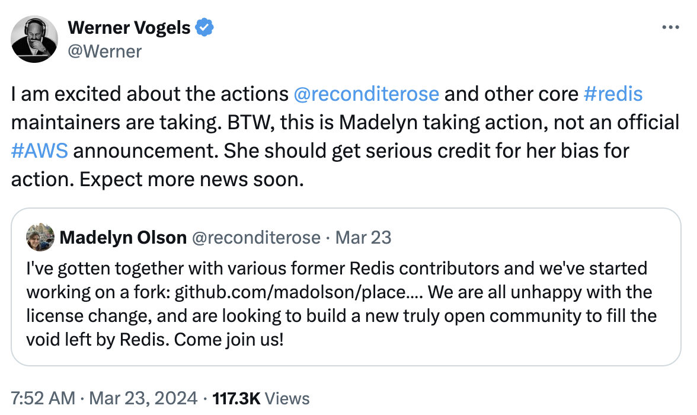
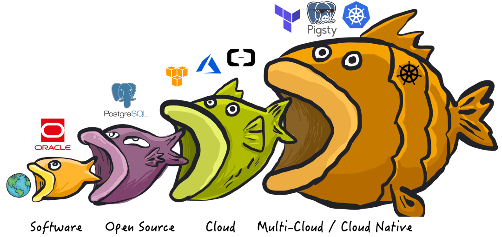

最近 Redis 修改其协议引发了争议：它从 7.4 起使用 RSALv2 与 SSPLv1，不再满足 OSI 关于 “开源软件” 的定义。但不要搞错：**Redis “不开源” 不是 Redis 的耻辱，而是“开源/OSI”的耻辱** —— 它反映出开源[**组织**](https://opensource.org/)/理念的过气。

**当下软件自由的头号敌人是公有云服务**。“**开源**” 与 “**闭源**” 也不再是软件行业的核心矛盾，斗争的焦点变为 “**云上服务**” 与 “**本地优先**”。公有云厂商搭着开源软件的便车白嫖社区的成果，这注定会引发社区的强烈反弹。

在抵御云厂商白嫖的实践中，修改协议是最常见的做法：但AGPLv3 过于严格容易敌我皆伤，SSPL 因为明确表达这种敌我歧视，不被算作开源。业界需要一种新的歧视性软件许可证协议，来达到名正言顺区分敌我的效果。

真正重要的事情一直都是软件自由，而“开源”只是实现软件自由的一种手段。而如果“开源”的理念无法适应新阶段矛盾斗争的需求，甚至会妨碍软件自由，它一样会过气，并不再重要，并最终被新的理念与实践所替代。

------

## 修改协议的开源软件

> “**我想直率地说：多年来，我们就像个傻子一样，他们拿着我们开发的东西大赚了一笔**”。
>
> Redis Labs 首席执行官 Ofer Bengal

Redis 在过去几年中一直都是开发者最喜爱的数据库系统（[在去年被 PostgreSQL 超过](/zh/blog/pg/pg-is-no1)），采用了非常友善的 BSD-3 Clause 协议，并被广泛应用在许多地方。然而，几乎所有的公有云上都可以看到云 Redis 数据库服务，云厂商靠它赚的钵满盆翻，而支付研发成本的 Redis 公司和开源社区贡献者被搁在一边。这种不公平的生产关系，注定会招致猛烈的反弹。

Redis 切换为更为严格的 SSPL 协议的核心原因，用 Redis Labs CEO 的话讲就是：“**多年来，我们就像个傻子一样，他们拿着我们开发的东西大赚了一笔**”。“他们”是谁？ —— **公有云**。切换 SSPL 的目的是，试图通过法律工具阻止这些云厂商白嫖吸血开源，成为体面的社区参与者，将软件的管理、监控、托管等方面的代码开源回馈社区。

不幸的是，你可以强迫一家公司提供他们的 GPL/SSPL 衍生软件项目的源码，但你不能强迫他们成为开源社区的好公民。公有云对于这样的协议往往也嗤之以鼻，大多数云厂商只是简单拒绝使用AGPL许可的软件：要么使用一个采用更宽松许可的替代实现版本，要么自己重新实现必要的功能，或者直接购买一个没有版权限制的商业许可。

当 Redis 宣布更改协议后，马上就有 AWS 员工跳出来 Fork Redis —— “Redis 不开源了，我们的分叉才是真开源！” 然后 AWS CTO 出来[叫好](https://twitter.com/Werner/status/1771324218506108995)，并假惺惺的说：这是我们员工的个人行为 —— 堪称是现实版杀人诛心。

> 图：AWS CTO [转评](https://twitter.com/Werner/status/1771324218506108995)员工 Fork Redis

被这样搞过的并非只有 Redis 一家。发明 SSPL 的 MongoDB 也是这个样子 —— 当 2018 年 MongoDB 切换至 SSPL 时，AWS 就搞了一个所谓 “API兼容“ 的 [DocumentDB](https://docs.aws.amazon.com/govcloud-us/latest/UserGuide/govcloud-dcdb.html) 来恶心它。ElasticSearch 修改协议后，AWS 就推出了 [OpenSearch](https://opensearch.org/) 作为替代。头部 NoSQL 数据库都已经切换到了 SSPL，而 AWS 也都搞出了相应的“开源替代”。

因为引入了额外的限制与所谓的“歧视”条款，OSI 并没有将 SSPL 认定为开源协议。因此使用 SSPL 的举措被解读为 —— “Redis 不再开源”，而云厂商的各种 Fork 是“开源”的。从法律工具的角度来说，这是成立的。但从朴素道德情感出发，这样的说法对于 Redis 来说是极其不公正地抹黑与羞辱。

-------------------

正如罗翔老师所说：法律工具的判断永远不能超越社区成员朴素的道德情感。如果协和与华西不是三甲，那么丢脸的不是这些医院，而是三甲这个标准。如果年度游戏不是巫师3，荒野之息，博德之门，那么丢脸的不是这些厂商，而是评级机构。如果 Redis 不再算“开源”，真正应该感到耻辱的是OSI，与开源这个理念。

越来越多的知名开源软件，都开始切换到敌视针对云厂商白嫖的许可证协议上来。不仅仅是 Redis，MongoDB，与 ElasticSearch 。MinIO 与 Grafana 分别在 2020，2021年从 Apache v2 协议切换到了 AGPLv3 协议。HashipCrop 的各种组件，MariaDB MaxScale， Percona MongoDB 也都使用了风格类似的 BSL 协议。

一些老牌的开源项目例如 PostgreSQL ，正如PG核心组成员 Jonathan 所说，三十年的声誉历史沉淀让它们已经[在事实上无法变更开源协议](/zh/blog/pg/pg-license) 了。但我们可以看到，许多新强力的 PostgreSQL [扩展插件](/zh/docs/about/license#协议清单)开始使用 AGPLv3 作为默认的开源协议，而不是以前默认使用的 BSD-like / PostgreSQL 友善协议。例如分布式扩展 Citus，列存扩展 Hydra，ES全文检索替代扩展 BM25，OLAP 加速组件 PG Analytics …… 等等等等。

包括我们自己的 PostgreSQL 发行版 Pigsty，也在 2.0 的时候由 Apache 协议切换到了 [AGPLv3 协议](/zh/docs/about/license)，背后的动机都是相似的 —— 针对软件自由的最大敌人 —— 云厂商进行反击。我们改变不了存量，但对于增量功能，是可以做出有效的回击与改变的。

在抵御云厂商白嫖的实践中，修改协议是最常见的做法：AGPLv3 是一种比较主流的实践，更激进的 SSPL 因为明确表达这种敌我歧视，不被算作开源。使用双协议进行明确的边界区分，也开始成为一种主流的开源商业化实践。但重要的是：**业界需要一种新的歧视性软件许可证协议，达到名正言顺辨识敌我，区别对待的效果 —— 来解决软件自由在当下面临的最大挑战 —— 云服务。**

-------------------

## 软件行业的范式转移

> 软件吞噬世界，开源吞噬软件，云吞噬开源。

在当下，软件自由的头号敌人是云计算租赁服务。**“开源” 与 “闭源” 也不再是软件行业的核心矛盾，斗争的焦点变为 “云上服务” 与 “本地优先”**。要理解这一点，我们要回顾一下软件行业的几次主要范式转移，以数据库为例：

**最初，软件吞噬世界**，以 Oracle 为代表的商业数据库，用软件取代了人工簿记，用于数据分析与事务处理，极大地提高了效率。不过 Oracle 这样的商业数据库非常昂贵，vCPU·月光是软件授权费用就能破万，往往只有金融行业，大型机构才用得起，即使像如淘宝这样的互联网巨头，上了量后也不得不”去O“。

**接着，开源吞噬软件**，像 PostgreSQL 和 MySQL 这样”**开源**免费“的数据库应运而生。软件开源本身是免费的，每核每月只需要几十块钱的硬件成本。大多数场景下，如果能找到一两个数据库专家帮企业用好开源数据库，那可是要比傻乎乎地给 Oracle 送钱要实惠太多了。

**然后，云吞噬开源**。公有云软件，是互联网大厂将自己使用开源软件的能力产品化对外输出的结果。公有云厂商把开源数据库内核套上壳，包上管控软件跑在托管硬件上，并建设共享开源专家池提供咨询与支持，便成了**云数据库服务** （RDS）。20 ¥/核·月的硬件资源通过包装，变为了 300 ～ 1300 ¥/核·月的天价 RDS 服务。 

曾经，**软件自由的最大敌人是商业闭源软件**，以微软，甲骨文为代表 —— 许多开发者依然对拥抱开源之前的微软名声有着深刻印象，甚至可以说整个自由软件运动正是源于 1990 年代的反微软情绪。但是，自由软件与开源软件的概念已经彻底改变了软件世界：商业软件公司耗费了海量资金与这个想法斗争了几十年。最终还是难以抵挡开源软件的崛起 —— 开源软件打破了商业软件的垄断，让软件这种IT业的核心生产资料变为全世界开发者公有，按需分配。开发者各尽所能，人人为我，我为人人，这直接催生了互联网的黄金繁荣时代。

**开源并不是一种商业模式，甚至是一种强烈违反商业化逻辑的模式**。然而，任何可持续发展的模式都需要获取资源以支付成本，开源也不例外。开源真正的模式是 —— 通过免费的软件创造高薪技术专家岗位。分散在不同企业组织中的开源专家，产消合一者 (Pro-sumer)，是（纯血）开源软件社区的核心力量 —— **免费的开源软件吸引用户，用户需求产生开源专家岗位，开源专家共创出更好的开源软件**。开源专家作为组织的代理人，从开源社区，集体智慧成果中汲取力量。组织享受到了开源软件的好处（软件自由，无商业软件授权费），而分散的雇主可以轻松兜住住这些专家的薪资成本。

然而公有云，特别是云软件的出现破坏了这种生态循环 —— 几个云巨头尝试垄断开源专家供给，重新尝试在 **用好开源软件**（服务）这个维度上，实现商业软件没能实现的垄断。 云厂商编写了开源软件的管控软件，组建了专家池，通过提供维护攫取了软件生命周期中的绝大部分价值，并通过搭便车的行为将最大的成本 —— **产研**交由整个开源社区承担。而 [**真正有价值的管控/监控代码却从来不回馈开源社区**](/zh/blog/cloud/dba-vs-rds#云数据库的模式与新挑战)。而更大的伤害在于 —— 公有云就像头部带货主播消灭大量本地便利店一样，摧毁了大量的开源就业岗位，掐断了开源社区的人才流动与供给。

-------------------

## 计算自由的头号敌人

> **在 2024 年，软件自由的真正敌人，是云服务软件！**

开源软件带来了巨大的行业变革，可以说，**互联网的历史就是开源软件的历史**。互联网公司是依托开源软件繁荣起来的，而公有云是从头部互联网公司孵化出来的。公有云的历史，就是一部屠龙勇者变为新恶龙的故事。

云刚出现的时候，它也曾经是一位依托开源 挑战传统 IT 市场恶龙的勇者，挥舞着大棒砸烂“企业级”杀猪盘。他们关注的是硬件 / **IaaS**层 ：存储、带宽、算力、服务器。云厂商的初心故事是：让计算和存储资源像水电一样，自己扮演基础设施的提供者的角色。这是一个很有吸引力的愿景：公有云厂商可以通过规模效应，压低硬件成本并均摊人力成本；理想情况下，在给自己留下足够利润的前提下，还可以向公众提供比 IDC 价格更有优势，更有弹性的存储算力（[**实际上也并不便宜**！](/zh/blog/cloud/ecs)）。

然而随着时间的推移，这位曾经的屠龙英雄逐渐变成了他曾经发誓打败的恶龙 —— 一个新的“杀猪盘”，对用户征收高昂无专家税与“保护费”。这对应着云软件（ PaaS / SaaS ），它与**云硬件**有着迥然不同的商业逻辑：云硬件靠的是规模效应，优化整体效率赚取资源池化超卖的钱，算是一种效率进步。而**云软件**则是靠共享专家，提供运维外包来收取服务费。公有云上大量的**软件**，本质是吸血白嫖开源社区搭便车，抢了分散在各个企业中开源工程师的饭碗，依靠的是信息不对称、专家垄断、用户锁定收取天价服务费，是一种价值的攫取转移，对原有的生态模式的破坏。

不幸的是，出于混淆视线的目的，云软件与云硬件都使用了“云”这个名字。因而在云的故事中，同时混掺着将算力普及到千家万户的理想主义光辉，与达成垄断攫取不义利润的贪婪。

{}
{}

云软件，即主要在供应商的服务器上运行的软件，而你的所有数据也存储在这些服务器上。以云数据库为代表的 PaaS ，以及各类只能通过租赁提供服务的 SaaS 都属于此类。这些“云软件”也许有一个客户端组件（手机App，网页控制台，跑在你浏览器中的 JavaScript），但它们只能与供应商的服务端共同工作。而云软件存在很多问题：

- 如果云软件供应商倒闭或停产，您的云软件就歇菜了，而你用这些软件创造的文档与数据就被锁死了。例如，很多初创公司的 SaaS 服务会被大公司收购，而大公司没有兴趣继续维护这些产品。
- 云服务可能在没有任何警告和追索手段的情况下突然暂停您的服务（例如 Parler ）。您可能在完全无辜的情况下，被自动化系统判定为违反服务条款：其他人可能入侵了你的账户，并在你不知情的情况下使用它来发送恶意软件或钓鱼邮件，触发违背服务条款。因而，你可能会突然发现自己用各种云文档或其它App创建的文档全部都被永久锁死无法访问。
- 运行在你自己的电脑上的软件，即使软件供应商破产倒闭，它也可以继续跑着，想跑多久跑多久。相比之下，如果云软件被关闭，你根本没有保存的能力，因为你从来就没有服务端软件的副本，无论是源代码还是编译后的形式。
- 云软件极大加剧了软件的定制与扩展难度，在你自己的电脑上运行的闭源软件，至少有人可以对它的数据格式进行逆向工程，这样你至少有个使用其他替代软件的PlanB。而云软件的数据只存储在云端而不是本地，用户甚至连这一点都做不到了。

如果所有软件都是免费和开源的，这些问题就都自动解决了。然而，**开源和免费实际上并不是解决云软件问题的必要条件；即使是收钱的或者闭源的软件，也可以避免上述问题**：只要它运行在你自己的电脑、服务器、机房上，而不是供应商的云服务器上就可以。拥有源代码会让事情更容易，但这并不是不关键，**最重要的还是要有一份软件的本地副本**。

在当今，**云软件，而不是闭源软件或商业软件，成为了软件自由的头号威胁**。云软件供应商可以在您无法审计，无法取证，无法追索的情况下访问您的数据，或突然心血来潮随心所欲地锁定你的所有数据，这种可能性的潜在危害，要比无法查看和修改软件源码的危害大得多。与此同时，也有不少公有云厂商渗透进入开源社区，并将“开源”视作一种获客营销包装、或形成垄断标准的手段，作为吸引用户的钓饵，而不是真正追求“软件自由”的目的。

**”开源“ 与 ”闭源“ 已经不再是软件行业中最核心的矛盾，斗争的焦点变为 “云” 与 “本地优先”。**

-------------------

## 自由世界如何应对挑战？

{}
{}

有力，就会有反作用力，云软件的崛起会引发新的制衡力量。面对云服务的挑战，已经有许多软件组织/公司做出了反应，包括但不限于：使用歧视性开源协议，法律工具与集体行动，抢夺云计算的定义权。

-------------------

### 修改开源许可证

软件社区应对云服务挑战的最常见反应是修改许可证，如 Grafana，MinIO，Pigsty 那样修改为 AGPLv3，或者像 Redis，MongoDB，ElasticSearch 那样修改为 SSPL，或者使用双协议 / BSL 的方式。大的方向是一致的 —— **重新划定社区共同体边界，将竞争者、与敌人直接排除在社区之外。**

友善、自由的互联网/软件世界离我们越来越远 —— 大爱无疆，一视同仁，始终无私奉献的圣母精神固然值得敬佩，但真正能靠自己力量活下来的，是爱憎分明，以德报德，以直报怨的勇者。这里的核心问题在于 **“歧视”** / 区别对待 —— 对待同志要像春天般的温暖，对待敌人要像严冬一样残酷。

业界需要一种实践来做到这一点。AGPL，SSPL，BSL 这样的协议就是一种尝试 —— 这些协议通常并不影响终端用户使用这些软件；也不影响普通的服务提供商在遵循开源义务的前提下提供支持与咨询服务；而是专门针对公有云厂商设计的 —— [**管控软件**](/zh/blog/cloud/dba-vs-rds#dba的工作与自动化管控) 作为公有云厂商摇钱树，在事实上是难以选择开源的，因此公有云厂商被歧视性地排挤出软件社区之外。

使用 Copyleft 协议族可以将公有云厂商排除在社区之外，从而保护软件自由。然而这些协议也容易出现伤敌一千，自损一百的情况。 在更为严格的许可要求下，一部分软件自由也受到了不必要的连带损失，例如：Copyleft 协议族也与其他广泛使用的许可证不兼容，这使得在同一个项目中使用某些库的组合变得更为困难。因此业界需要更好的实践来真正落实好这一点。

例如，我们的自由 PostgreSQL 发行版 Pigsty 使用了 AGPLv3 协议，但我们添加了对普通用户的 [补充豁免条款](/zh/docs/about/license#补充条款) —— 我们只保留对公有云供应商，与换皮套壳魔改同行进行违规追索的权利，对于普通终端用户来说实际执行的是 Apache 2.0 等效条款 —— 采购我们服务订阅的客户也可以得到书面承诺：不就违反 AGPLv3 的协议进行任何追索 —— 从某种意义上来说，这也是一种 “双协议” 实践。

-------------------

### 法律工具与集体行动

Copyleft软件许可证是一种法律工具，它试图迫使更多的软件供应商公开其源码。但是对于促进软件自由而言，[Martin Keppmann 相信更有前景的法律工具是政府监管](/zh/blog/db/goodbye-gpl#促进软件自由的法律工具)。例如，GDPR提出了[数据可移植权](https://ico.org.uk/for-organisations/guide-to-data-protection/guide-to-the-general-data-protection-regulation-gdpr/individual-rights/right-to-data-portability/)，这意味着用户必须可以能将他们的数据从一个服务转移到其它的服务中。另一条有希望的途径是，推动 [公共部门的采购倾向于开源、本地优先的软件](https://joinup.ec.europa.eu/sites/default/files/document/2011-12/OSS-procurement-guideline-final.pdf)，而不是闭源的云软件。这为企业开发和维护高质量的开源软件创造了积极的激励机制，而版权条款却没有这样做。

我认为，有效的改变来自于对大问题的集体行动，而不仅仅来自于一些开源项目选择一种许可证而不是另一种。公有云反叛军联盟应该团结一切可以团结的有生力量 —— 开源平替软件社群，开发者与用户；服务器与硬件厂商，坚守 IaaS 阵地的资源云，运营商云，IDC 与 IDC 2.0，甚至是公有云厂商的 IaaS 部门。采取一切法律框架内允许的行动去推进这一点。

一种有效的对抗措施是为整个云计算技术栈提供开源替代品，例如在《[云计算反叛军](https://mp.weixin.qq.com/s/Fit7MtSDQdp9IcedmWdYQg)》中就提到 —— 云计算世界需要一个能代表开源价值观的替代解决方案。开源软件社区可以与云厂商比拼生产力 —— 组建一个反叛军同盟采取集体行动。**针对公有云厂商提供服务所必不可少的管控软件，逐一研发开源替代**。

在云软件没有出现开源/本地优先的替代品前，公有云厂商可以大肆收割，攫取垄断利润。而一旦更好用，更简易，成本低得多的开源替代品出现，好日子便将到达终点。例如，Kubernetes /  SealOS / OpenStack / KVM / Proxmox，可以理解为云厂商 EC2 / ECS / VPS 管控软件的开源替代；MinIO / Ceph 旨在作为为云厂商 S3 / OSS 管控软件的开源替代；而 **Pigsty** / 各种数据库 Operator 就是 RDS 云数据库管控软件的开源替代。这些开源替代品将直接击碎公有云计算的核心技术壁垒 —— 管控软件，让云的能力民主化，直接普及到每一个用户手中。

-------------------

### 抢夺云计算的定义权

公有云可以渗透到开源社区中兴风作浪，那么开源社区也可以反向渗透，抢夺云计算的定义权。例如，对于 Cloud Native 的不同解释就生动地体现了这一点。云厂商将 **Native** 解释 “原生”：“原生诞生在公有云环境里的软件” 以混淆视听；但究其目的与效果而言，**Native** 真正的含义应为 “本地”，即与 **Cloud** 相对应的 “**Local**” —— 本地云 / 私有云 / 专有云 / 原生云 / 主权云，叫什么不重要，重要的是它运行在用户想运行的任何地方（包括云服务器），而不是仅仅是只能从公有云租赁！

这一理念，用一个单独的术语，可以概括为 “本地优先”，它与云服务针锋相对。“**本地优先**” 与 “**云**” 的对立体现为多种不同的形式：有时候是 “**Native Cloud**” vs “**Cloud Native**”，有时候叫体现为 “私有云” vs “公有云”，大部分时候与 ”开源“ vs “闭源”重叠，某种意义上也牵扯着 “自主可控” vs “仰人鼻息”。

本地优先的软件在您自己的硬件上运行，并使用本地数据存储，但也不排斥运行在云 IaaS 上，同时也保留云软件的优点，比如实时协作，简化运维，跨设备同步，资源调度，灵活伸缩等等。开源的本地优先的软件当然非常好，但这并不是必须的，本地优先软件90%的优点同样适用于闭源的软件。同理，免费的软件当然好，但本地优先的软件也不排斥商业化与收费服务。

-------------------

### 理直气壮地争取资源

最后，不得不说的一点，就是开源商业化，收钱的问题。开源软件社区应该理直气壮地赚钱与筹款 —— **自由不是免费的！**  Freedom is not free 早已经是老生常谈。然而，相当一部分开源贡献者与开源用户都对开源软件有着不切实际的期待与错觉。

一些用户误以为他们与维护者的关系是商业关系，因此期望获得商业供应商的客户服务标准；而一些开源贡献者也期待开源用户给予金钱、声望、场景上的互惠与回馈贡献。一方认为他们应得的比另一方认为的要多，这种不明确的结果就会走向怨恨。

**开源不等于免费**，尽管大部分开源软件都提供了让用户免费使用的条件，但免费的开源软件是一种没有条件的**礼物**。作为收礼人，用户只有选择收或不收的权利；作为送礼人，期待得到特定回报是愚蠢的。作为开源贡献者，给别人戴上氧气面罩前，请务必先戴好自己的氧气面罩。如果某个开源企业自己都无法养活自己，那么选择用爱发电，四处慷慨送礼就是不明智的。

因此，全职的开源软件的开发者与公司，必须审慎思考自己的商业模式 —— 想让项目与组织持续发展，资源是必不可少的。无论是做专门的企业版，提供服务支持与订阅，设置双协议，去拉赞助化缘卖周边，或者干脆像 Redis 一样使用所谓 “不开源” 的协议，**这都无可厚非，应当是光明正大，且理直气壮的**。实际上，因为开源软件为用户提供了额外的“**软件自由**” —— 因此在质量相同的前提下，收取比云租赁软件更高的费用也是完全合乎道德情理的！

-------------------

## 博弈均衡会走向哪里

云计算的故事与电力的推广过程如出一辙，让我们把目光回退至上个世纪初，从电力的推广普及垄断监管中汲取历史经验 —— **供电也许会走向垄断、集中、国有化，但你管不住电器**。如果云硬件（算力）类似于电力，那么云软件便是电器。生活在现代的我们难以想象：洗衣机，冰箱，热水器，电脑，竟然还要跑到电站边的机房去用，我们也很难想象，居民要由自己的发电机而不是公共发电厂来供电。

因此从长期来看，公有云厂商大概也会有这么一天：在云硬件上通过类似于电力行业，通过垄断并购与兼并形成“规模效应”，利用“峰谷电”，“弹性定价”等各种方式优化整体资源利用率，在相互斗兽竞争中将算力成本不断压低至新的底线，实现“家家有电用”。当然，最后也少不了政府监管介入，公私合营收归国有，成为如同国家电网与电信运营商类似的存在，最终实现 IaaS 层的存储带宽算力的垄断。

而与之对应，制造灯泡、空调、洗衣机这类电器的职能会从电力公司中剥离，百花齐放。云厂商的 PaaS / SaaS 在被更好，更优质，更便宜的开源替代冲击下逐渐萎缩，或回归到足够低廉的价格水平。

正如当年开源运动的死对头微软，现在也选择拥抱开源。公有云厂商肯定也会有这一天，与自由软件世界达成和解，心平气和地接受基础设施供应商的角色定位，为大家提供水与电一般的存算资源。而**云软件终将**会回归正常毛利，**希望那一天人们能记得，这不是因为云厂商大发慈悲，而是有人带来过开源平替。**

