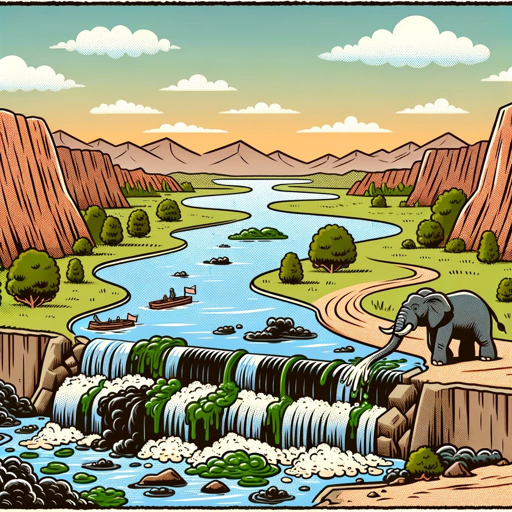

Recently, there have been some hotly debated topics in the tech community: [Are cloud databases an IQ tax?](/cloud/rds/) [Is public cloud a pig-killing scam](/cloud/ebs/)? [Are distributed databases a false need](/db/distributive-bullshit/)? [Are microservices a stupid idea](/db/microservice-bad-idea/)? [Do you still need ops and DBAs](https://mp.weixin.qq.com/s/Gk9bG_EOIv0IAkim41XRHg)? [Is the middle platform just self-deception](https://mp.weixin.qq.com/s/VgTU7NcOwmrX-nbrBBeH_w)? There are also extensive discussions and debates about these topics on Twitter and HackerNews.

Behind these issues is a fundamental shift in the environment: **cost reduction and efficiency improvement have overwhelmed everything else, becoming the absolute main theme**. Developer experience, architectural evolvability, and R&D efficiency remain important, but they all must yield to **ROI** — **changes in social trends and fundamental values trigger a revaluation of all technologies.**

Some say that internet companies could cut half their workforce and still operate normally, but bosses don't know which half. Now Elon Musk, who acquired Twitter, has set a new record: as of May 2023, Twitter has laid off **90%** of its workforce from 8,000 to less than 1,000, yet it continues to run smoothly. **This result completely exposes the cover-up of big company bloat and redundancy problems. Other big tech companies will inevitably follow suit, triggering a new round of massive layoffs.**

During economic prosperity, companies can afford idle employees for free exploration and can engage in boastful speculation and wasteful hype. But during economic downturns, all pragmatic enterprises and organizations will begin to re-examine past trade-offs. The same thing happens not only to people but also to technology — this is how crises in the physical world transmit to the tech world: **bubbles always need to be cleared at some point, and this is happening now.**

Public cloud, Kubernetes, microservices, cloud databases, distributed databases, big data stacks, serverless, HTAP, microservices, etc. — all these technologies and concepts will face scrutiny: **Some things appear weightless until put on a scale, but even a thousand pounds can't hold them down once weighed**. This process inevitably involves doubt, pain, harm, and destruction, but also breeds hope, joy, development, and rebirth. Flashy and impractical things will disappear into the river of history, and only truly good technologies can survive the tide.

In this storm in the tech world, someone needs to see through phenomena to essence, and explain clearly the pros and cons of various technologies, their applicable scenarios, and trade-offs in a down-to-earth manner. I am willing to participate as an experiencer, witness, narrator, and participant. Here is a proposed topic list called "**Back to Basics: Tech Reflection Chronicles**", which will discuss and comment on hot topics and technologies that the industry cares about:

- [Are Domestic Databases a Great Leap Forward?](https://mp.weixin.qq.com/s/aLXC7f2iYUfATNWsnyotkA)
- [Does China Contribute Nothing to PostgreSQL?](https://mp.weixin.qq.com/s/79_PnX-a5iSfDMgz_VUx5A)
- [Why Is MySQL's Correctness So Poor?](https://mp.weixin.qq.com/s/gQZ3Q5JKV8gaBNhc1puPcA)
- [Yes, Databases Should Go Into K8s!](https://mp.weixin.qq.com/s/rpyNczx0AD_iseMMLioVjw) (Repost from SealOS)
- [Should Databases Go Into K8S?](https://mp.weixin.qq.com/s/4a8Qy4O80xqsnytC4l9lRg)
- [Is Putting Databases in Docker a Good Idea?](https://mp.weixin.qq.com/s/kFftay1IokBDqyMuArqOpg)
- [Are Vector Databases Dead?](https://mp.weixin.qq.com/s/0eBZ4zyX6XjBQO0GqlANnw)
- [Harvest Alibaba Cloud Wool While You Can: $5K Cloud Servers for $300](https://mp.weixin.qq.com/s/Nh28VahZkQMdR8fDoi0_rQ)
- [Are Databases Really Being Strangled?](https://mp.weixin.qq.com/s/vh1JE_BdaLetWtt5vvPDDw)
- [Which EL-Series OS Distribution Is Best?](https://mp.weixin.qq.com/s/xHG8OURTYlmnQTorFkzioA)
- [What Kind of Self-Reliance Do Infrastructure Software Need?](https://mp.weixin.qq.com/s/hWbcc9cMM9qTjPJ0m6G0Kg)
- [How to View the MySQL vs PGSQL Live Drama](https://mp.weixin.qq.com/s/tRNedHlXmp7YfCqd21e5PA)
- [Refuting "MySQL: The Most Successful Database on Earth"](https://mp.weixin.qq.com/s/7UvQulQGt9SIhUQasxuEZw)
- [Vectors Are the New JSON](https://mp.weixin.qq.com/s/BJkbtwl_SPx99GBOzPsJiA) [Translation & Commentary]
- [[Translation] Are Microservices a Stupid Idea?](https://mp.weixin.qq.com/s/mEmz8pviahEAWy1-SA8vcg)
- [Are Distributed Databases a False Need?](https://mp.weixin.qq.com/s/-eaCoZR9Z5srQ-1YZm1QJA)
- [Database Demand Hierarchy Pyramid](https://mp.weixin.qq.com/s/1xR92Z67kvvj2_NpUMie1Q)
- [StackOverflow 2022 Database Annual Survey](https://mp.weixin.qq.com/s/xcORYy2suzOw50SOaOCodw)
- [Is DBA Still a Good Job?](https://mp.weixin.qq.com/s/Py3o31w3db5E9FsviAZeCA)
- [Will PostgreSQL Change Its Open Source License?](https://mp.weixin.qq.com/s/qNcqGHL-wVTSB7Kxko2eNw)
- [Redis Going Non-Open Source Is a Disgrace to "Open Source" and Public Cloud](https://mp.weixin.qq.com/s/W5kOLxeJCIHjnWbIHc1Pzw)
- [PostgreSQL Is Eating the Database World](https://mp.weixin.qq.com/s/8_uhRH93oAoHZqoC90DA6g)
- [RDS Has Castrated PostgreSQL's Soul](https://mp.weixin.qq.com/s/EH7RPB6ImfMHXhOMU7P5Qg)
- [Tech Minimalism: Use Postgres for Everything](https://mp.weixin.qq.com/s/yI06zdqnW5uWnqvKmgM-9g)

----------------

## Writing Plan

"[Are Cloud Databases an IQ Tax](https://mp.weixin.qq.com/s/LefEAXTcBH-KBJNhXNoc7A)"

"[Is Cloud Storage a Pig-Killing Scam?](http://mp.weixin.qq.com/s?__biz=MzU5ODAyNTM5Ng==&mid=2247485391&idx=1&sn=4cec9af2b58160eb345a6b12411f0b68&chksm=fe4b3214c93cbb023c13a89133c75bf1e88e1543de9359df7447498e4a9d5ec555313a954566&scene=21#wechat_redirect)"

"[Are Distributed Databases a False Need](http://mp.weixin.qq.com/s?__biz=MzU5ODAyNTM5Ng==&mid=2247485549&idx=1&sn=7c34439d82431129c57aba211202b5ca&chksm=fe4b3db6c93cb4a0423daf3a226e04867821e34ba3c6b5a8145bd5319c728fb08d63b2544a43&scene=21#wechat_redirect)?"

"Are Domestic Databases a Great Leap Forward?"

"Is TPC-C Benchmarking Just Setting Off Satellites?"

"Are信创 Databases Just Making Easy Money?"

"Who's Strangling China's Database Neck?"

"[Are Microservices a Stupid Idea](http://mp.weixin.qq.com/s?__biz=MzU5ODAyNTM5Ng==&mid=2247485566&idx=1&sn=640f4441fddbfe889d98d715af0a1cad&chksm=fe4b3da5c93cb4b30839bc2e65f40983c7e881768c908a4a38ffe3565543b56090244d38f63e&scene=21#wechat_redirect)?"

"Is Serverless Just a Money-Sucking Scheme?"

"Is RCU/WCU Billing an Open Conspiracy to Slaughter Pigs?"

"Should Databases Go Into K8S?"

"Is HTAP Just Paper Talk?"

"Is Single-Machine-Distributed Integration Just Taking Off Pants to Fart?"

"Do You Really Need a Dedicated Vector Database?"

"Do You Really Need a Dedicated Time-Series Database?"

"Do You Really Need a Dedicated Geographic Database?"

"APM Time-Series Database Selection Guide"

"202x Database Selection Guide White Paper"

"Open Source Rising: How Far Can Commercial Databases Go?"

"[Paradigm Shift: Can Cloud Native Overthrow Public Cloud?](http://mp.weixin.qq.com/s?__biz=MzU5ODAyNTM5Ng==&mid=2247485301&idx=1&sn=2fb038f8b9f26c095d97eb0d87e8b262&chksm=fe4b32aec93cbbb81fbb1d7dfadba404ff7015d2b83f590bbe46a7372b55ac0aac076a71a76b&scene=21#wechat_redirect)"

"[Local First: Do You Really Need XaaS?](http://mp.weixin.qq.com/s?__biz=MzU5ODAyNTM5Ng==&mid=2247484735&idx=1&sn=4bd01a8268411de05fdea1d68c429f43&chksm=fe4b30e4c93cb9f27fe36ce24040df71bbe0f1035c4a1db6676cae6e10274c7daf4cdc899072&scene=21#wechat_redirect)"

"Are Cloud Vendor SLAs Really Reliable?"

"Are Big Tech Management Ideas Really Advanced?"

"Is There Still a Future in Database Kernel Development?"

"What Kind of Databases Do Users Really Need?"

"Is There Still a Future in MySQL Development?"

"[Bombarding RDS — My Big Character Poster](http://mp.weixin.qq.com/s?__biz=MzU5ODAyNTM5Ng==&mid=2247485349&idx=1&sn=96fde26dd9efd399ef7ae11e52e05843&chksm=fe4b327ec93cbb688e2708ff4e709a7ba32eee2be9d8637e9b941f47e6600dc7fcd2710a42c4&scene=21#wechat_redirect)"

"[Why Is PostgreSQL the Most Successful Database?](http://mp.weixin.qq.com/s?__biz=MzU5ODAyNTM5Ng==&mid=2247485216&idx=1&sn=1b59c7dda5f347145c2f39d2679a274d&chksm=fe4b32fbc93cbbed574358a3bcf127dd2e4f458638b46efaee1a885a5702a66a5d9ca18e3f90&scene=21#wechat_redirect)"

If you have any topics you think are worth discussing, please feel free to leave comments, and I will consider adding them to the list.