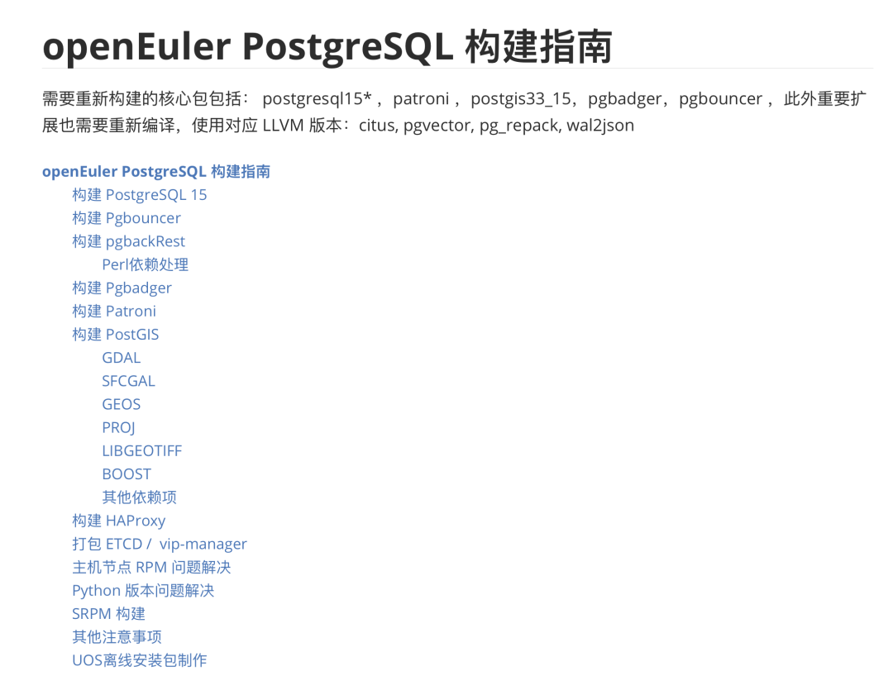

Many users have asked me what operating system is best for running databases. Especially considering that CentOS 7.9 will reach EOL next year, many users should need to upgrade their OS, so today I'm sharing some experience.

[](https://mp.weixin.qq.com/s/xHG8OURTYlmnQTorFkzioA)


------

## TL;DR

In short, if you're using EL-series OS distributions now, especially for running PostgreSQL-related services, I strongly recommend **RockyLinux**. For "domestic" requirements, you can also choose Anolis **OpenAnolis**. AlmaLinux and OracleLinux have compatibility issues and are not recommended. Euler belongs in its own tier of IT cafeteria pre-made meals - you can skip it entirely if you have EL compatibility requirements.

Compatibility level: RHEL = Rocky ≈ Anolis > Alma > Oracle >> Euler.

For EL major versions, EL7 is currently the most stable but will EOL soon, and many software versions are too old, so it's not recommended for new projects. EL9 is the latest but occasionally has software package dependency errors after repository updates, and some software hasn't caught up with EL9 packages yet, like Citus/RedisStack/Greenplum.

Currently, EL8 is the mainstream choice: software versions are new enough and stable enough. For specific versions, I recommend RockyLinux 8.9 (Green Obsidian) or OpenAnolis 8.8 (rhck kernel). Aggressive users can try 9.3, conservative users can stick with CentOS 7.9.


------

## Testing Methodology

We build the out-of-the-box PostgreSQL database distribution [Pigsty](https://pigsty.io/zh/), without using containers/orchestration solutions, so we inevitably deal with various operating systems. We've basically tested all EL-series OS distributions and recently completed adaptation for Anolis/Euler as well as Ubuntu/Debian. We have some experience with OS EL compatibility.

Pigsty's scenario is very representative — running [the world's most advanced and popular open-source relational database PostgreSQL](/pg/pg-is-no1) on bare operating systems, along with complete software components needed for enterprise-grade database services. This includes 5 major versions of PostgreSQL (12-16) and over a hundred extension plugins. There are also dozens of commonly used host node packages, the complete Prometheus/Grafana observability stack, and auxiliary components like ETCD/MinIO/Redis.


The testing method is simple: can these EL-native RPM packages run on these other "compatible" systems — at least installation and operation shouldn't fail? During each CI run, we spin up thirty virtual machines with different operating systems for complete installation. The involved software packages are shown below:

```yaml
repo_packages:
  - ansible python3 python3-pip python36-virtualenv python36-requests python36-idna yum-utils createrepo_c sshpass                                                  # Distro & Boot
  - nginx dnsmasq etcd haproxy vip-manager pg_exporter pgbackrest_exporter                                                                                          # Pigsty Addons
  - grafana loki logcli promtail prometheus2 alertmanager pushgateway node_exporter blackbox_exporter nginx_exporter keepalived_exporter                            # Infra Packages
  - lz4 unzip bzip2 zlib yum pv jq git ncdu make patch bash lsof wget uuid tuned nvme-cli numactl grubby sysstat iotop htop rsync tcpdump perf flamegraph           # Node Packages 1
  - netcat socat ftp lrzsz net-tools ipvsadm bind-utils telnet audit ca-certificates openssl openssh-clients readline vim-minimal keepalived chrony                 # Node Packages 2
  - patroni patroni-etcd pgbouncer pgbadger pgbackrest pgloader pg_activity pg_filedump timescaledb-tools scws pgxnclient pgFormatter                               # PG Common Tools
  - postgresql15* pg_repack_15* wal2json_15* passwordcheck_cracklib_15* pglogical_15* pg_cron_15* postgis33_15* timescaledb-2-postgresql-15* pgvector_15* citus_15* # PGDG 15 Packages
  - imgsmlr_15* pg_bigm_15* pg_similarity_15* pgsql-http_15* pgsql-gzip_15* vault_15 pgjwt_15 pg_tle_15* pg_roaringbitmap_15* pointcloud_15* zhparser_15* apache-age_15* hydra_15* pg_sparse_15*
  - orafce_15* mysqlcompat_15 mongo_fdw_15* tds_fdw_15* mysql_fdw_15 hdfs_fdw_15 sqlite_fdw_15 pgbouncer_fdw_15 multicorn2_15* powa_15* pg_stat_kcache_15* pg_stat_monitor_15* pg_qualstats_15 pg_track_settings_15 pg_wait_sampling_15 system_stats_15
  - plprofiler_15* plproxy_15 plsh_15* pldebugger_15 plpgsql_check_15* pgtt_15 pgq_15* hypopg_15* timestamp9_15* semver_15* prefix_15* periods_15* ip4r_15* tdigest_15* hll_15* pgmp_15 topn_15* geoip_15 extra_window_functions_15 pgsql_tweaks_15 count_distinct_15
  - pg_background_15 e-maj_15 pg_catcheck_15 pg_prioritize_15 pgcopydb_15 pgcryptokey_15 logerrors_15 pg_top_15 pg_comparator_15 pg_ivm_15* pgsodium_15* pgfincore_15* ddlx_15 credcheck_15 safeupdate_15 pg_squeeze_15* pg_fkpart_15 pg_jobmon_15 rum_15
  - pg_partman_15 pg_permissions_15 pgexportdoc_15 pgimportdoc_15 pg_statement_rollback_15* pg_auth_mon_15 pg_checksums_15 pg_failover_slots_15 pg_readonly_15* postgresql-unit_15* pg_store_plans_15* pg_uuidv7_15* set_user_15* pgaudit17_15
  - redis_exporter mysqld_exporter mongodb_exporter docker-ce docker-compose-plugin redis minio mcli ferretdb duckdb sealos  # Miscellaneous Packages
```

Test results can basically be divided into three categories: 100% compatible, minor errors, major troubles.

* 100% compatible: RockyLinux, OpenAnolis

* Minor errors: AlmaLinux, OracleLinux, CentOS Stream

* Major troubles: OpenEuler

RockyLinux is 100% compatible, with very smooth software package installation and no issues encountered. OpenAnolis has a user experience basically identical to Rocky. AlmaLinux, OracleLinux, and CentOS Stream have some missing software packages that can be fixed and supplemented. Overall, they have minor errors but can be overcome. Euler belongs in its own tier of major troubles - encountering massive version dependency error crashes, with almost all packages requiring targeted compilation. Some packages are even difficult to compile due to system dependency version conflicts. The adaptation cost as an EL OS distribution is even higher than Ubuntu/Debian.


------------------

## User Experience

RockyLinux has the best user experience. Its founder is the original founder of CentOS who started a new fork after CentOS was acquired by Red Hat. It has basically occupied CentOS's original ecological niche.

Most importantly, besides RHEL, RockyLinux is the EL-series OS that PostgreSQL official sources explicitly support. PGDG build environments use Rocky 8.8 and 9.2 (6/7 used CentOS). It can be said to be the OS distribution with the best PG support. The actual user experience is also excellent - if you don't have special requirements, it should be the default choice for EL-series OS.


> RockyLinux: 100% Bug-Level Compatibility

Anolis/OpenAnolis is Alibaba Cloud's domestic OS, claiming 100% EL compatibility. I didn't have high expectations initially - I just supported it because users wanted it, but the actual results exceeded expectations: all EL8 RPM packages passed on the first try. Adaptation required no additional work besides handling /etc/os-release. Adapting one Anolis equals adapting over ten "domestic OS" distributions: Alibaba Cloud, Tongxin Software, China Mobile, Kylin Software, CS2C, Linx Software, Inspur, NFSC, Xinyidian, Softpower, Boyant Technology. Very cost-effective.


> Commercial OS distributions based on OpenAnolis

If you have "domestic" OS requirements, choosing OpenAnolis or derivative commercial distributions is a good choice.

Oracle Linux/AlmaLinux/CentOS Stream have worse compatibility compared to Rocky/Anolis - not all EL RPM packages can be installed successfully, often encountering dependency errors. Most packages can be found and supplemented from their own repositories - there are compatibility issues, but they're basically solvable minor troubles. The overall experience with these OS is mediocre. Considering Rocky/Anolis are already good enough, I don't see any reason to use these distributions without special requirements.

OpenEuler belongs in the worst tier, claiming EL compatibility but being completely different in practice. For example, in PostgreSQL kernel and core extensions, postgresql15*, patroni, postgis33_15, pgbadger, pgbouncer all need recompilation. And because different LLVM versions are used, all plugin LLVMJIT must be recompiled to work, requiring tremendous effort to complete support. We had to castrate some features, making the overall experience terrible.



> A pile of extra work during adaptation

We have a major client who had to use this OS, so we had to do compatibility adaptation. Adapting this OS is a nightmare - the workload is greater than supporting Debian/Ubuntu series OS. It truly achieves **world-leading** excellence in tormenting users.

BTW, there's an article on Zhihu that also introduces the pitfalls and comparisons of these OS distributions - worth reading:


------------------

## Some Thoughts

I previously wrote "[What Kind of Self-Reliance Do Infrastructure Software Need](/db/sovereign-dbos/)" discussing the current situation of domestic OS/databases. The core point is: **the nation's core need for infrastructure software self-reliance is whether existing systems can continue running under sanctions and blockades - operational self-reliance, not R&D self-reliance**.

Here I tested and adapted two mainstream domestic OS distributions, representing two different approaches: **OpenAnolis** is fully compatible with EL, standing on giants' shoulders to provide services and support for users who need it (operational self-reliance), truly meeting user needs — **don't create trouble, let existing software/systems run stably**. When CentOS stopped service, having domestic companies/communities step up to take responsibility for maintenance work has real value for users, existing systems, and services.

Looking at another OS distro, it chose wholesale modifications, doing some useless even negative-optimization garbage forks for flashy "self-research" vanity, causing massive existing software to require re-adaptation, adjustment, or abandonment, adding unnecessary burden to users. It achieved world-leading excellence in tormenting users, comparable to cafeteria pre-made meals entering schools in the IT field, polluting and fragmenting the software ecosystem, cutting itself off from the global software supply chain.

OpenEuler and OpenGauss are similar: you ask if they work? They're not unusable — they just feel like eating shit. But the problem is there's already self-reliant and free food available, so why eat shit? If leadership insists on force-feeding shit, or the money is just too good, there's no choice. But if you eat shit and taste meat flavor while feeling world-leading, that's somewhat ridiculous.

I've mocked Alibaba Cloud's services before (especially EBS and RDS), but in open source OS and DB, it's clear who's doing real work versus who's bullshitting. At least I think OpenAnolis and PolarDB have some substance, more deserving of "giving the world another choice" compared to Euler and Gauss - these useless modified forks. High-quality, maintained, service-providing open source main branch reskinned distributions are far better than brain-dead modified forks.

Both being "self-reliant" EL-series domestic OS, Pigsty provides support for both OpenAnolis and OpenEuler. The former's support is open source and free because there's no adaptation cost. For the latter, we provide support for clients who need it based on customer-first principles: although we've completed adaptation, we'll never open source it for free - we must charge high customization service fees as compensation for mental distress. Similarly, we open sourced [PolarDB monitoring](https://mp.weixin.qq.com/s/DExvaEk2Yoq37W8V6wvaKg) support, but OpenGauss - sorry, go play by yourself.

Technology development must ultimately adapt to advanced productive forces. Backward things will eventually be eliminated by the times. Users should bravely voice their opinions and vote with their feet, letting products and companies doing real work get rewards and encouragement, letting those bullshitting things get eliminated sooner. Don't wait until there's only shit left to eat before regretting it.