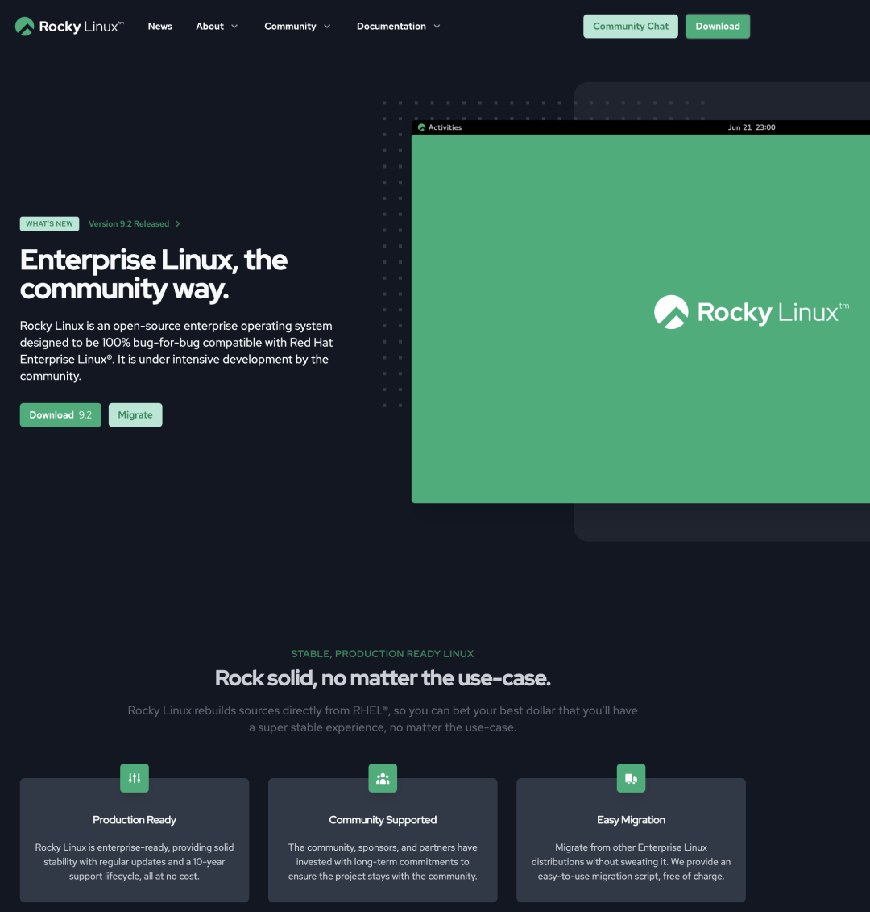

有很多用户都问过我，跑数据库用什么操作系统比较好。特别是考虑到 CentOS 7.9 明年就 EOL了，应该有不少用户需要升级OS了，所以今天分享一些经验之谈。

[](https://mp.weixin.qq.com/s/xHG8OURTYlmnQTorFkzioA)


------

## 太长不看

长话短说，在现在这个时间点如果用 EL 系列操作系统发行版，特别是如果要跑 PostgreSQL 相关的服务，我强烈推荐 **RockyLinux**，有“国产化”要求的也可以选龙蜥 **OpenAnolis**。AlmaLinux 和 OracleLinux 兼容性有点问题，不建议使用。Euler 属于独一档的 IT 领域预制菜进校园，有 EL 兼容要求的可以直接略过了

兼容水平：RHEL = Rocky ≈ Anolis > Alma > Oracle >> Euler 。

在EL大版本上，EL7目前的状态最稳定，但马上 EOL 了，而且很多软件版本都太老了，所以新上的项目不建议使用了；EL 9最新，但偶尔会在仓库源更新后出现软件包依赖错误的问题。，少软件也还没有跟进 EL9 的包，比如 Citus / RedisStack / Greenplum等。

目前综合来看，EL8 是主流的选择：软件版本足够新，也足够稳定。具体的版本上建议使用 RockyLinux 8.9（Green Obsidian） 或 OpenAnolis 8.8 (rhck内核)。 激进的用户可以试试 9.3 ，保守稳妥的用户可以使用 CentOS 7.9 。


------

## 测试方法论

我们做开箱即用 PostgreSQL 数据库发行版 [Pigsty](https://pigsty.io/zh/)，不使用容器/编排方案，因此免不了与各种操作系统打交道，基本上 EL 系的 OS 发行版我们都测试过一遍，最近刚刚把 Anolis / Euler  以及 Ubuntu / Debian 的适配做完。关于 OS EL兼容性还是有一些经验心得的。

Pigsty 的场景非常具有代表性 —— 在裸操作系统上[运行世界上最先进且最流行的开源关系型数据库 PostgreSQL](/zh/blog/pg/pg-is-no1)，以及企业级数据库服务所需要的完整软件组件。包括了 PostgreSQL 生命周期中的5个大版本（12 - 16）以及一百多个扩展插件。还有几十个常用的主机节点软件包，Prometheus / Grafana 可观测性全家桶，以及 ETCD / MinIO / Redis 等辅助组件。


测试方法很简单，这些 EL原生的RPM包，能不能在其他这些“兼容”系统上跑起来 —— 至少安装运行不能出错吧？每次 CI 的时候，我们会拉起三十台安装有不同操作系统的虚拟机进行完整安装，涉及到的软件包如下所示：

```yaml
repo_packages:
  - ansible python3 python3-pip python36-virtualenv python36-requests python36-idna yum-utils createrepo_c sshpass                                                  # Distro & Boot
  - nginx dnsmasq etcd haproxy vip-manager pg_exporter pgbackrest_exporter                                                                                          # Pigsty Addons
  - grafana loki logcli promtail prometheus2 alertmanager pushgateway node_exporter blackbox_exporter nginx_exporter keepalived_exporter                            # Infra Packages
  - lz4 unzip bzip2 zlib yum pv jq git ncdu make patch bash lsof wget uuid tuned nvme-cli numactl grubby sysstat iotop htop rsync tcpdump perf flamegraph           # Node Packages 1
  - netcat socat ftp lrzsz net-tools ipvsadm bind-utils telnet audit ca-certificates openssl openssh-clients readline vim-minimal keepalived chrony                 # Node Packages 2
  - patroni patroni-etcd pgbouncer pgbadger pgbackrest pgloader pg_activity pg_filedump timescaledb-tools scws pgxnclient pgFormatter                               # PG Common Tools
  - postgresql15* pg_repack_15* wal2json_15* passwordcheck_cracklib_15* pglogical_15* pg_cron_15* postgis33_15* timescaledb-2-postgresql-15* pgvector_15* citus_15* # PGDG 15 Packages
  - imgsmlr_15* pg_bigm_15* pg_similarity_15* pgsql-http_15* pgsql-gzip_15* vault_15 pgjwt_15 pg_tle_15* pg_roaringbitmap_15* pointcloud_15* zhparser_15* apache-age_15* hydra_15* pg_sparse_15*
  - orafce_15* mysqlcompat_15 mongo_fdw_15* tds_fdw_15* mysql_fdw_15 hdfs_fdw_15 sqlite_fdw_15 pgbouncer_fdw_15 multicorn2_15* powa_15* pg_stat_kcache_15* pg_stat_monitor_15* pg_qualstats_15 pg_track_settings_15 pg_wait_sampling_15 system_stats_15
  - plprofiler_15* plproxy_15 plsh_15* pldebugger_15 plpgsql_check_15* pgtt_15 pgq_15* hypopg_15* timestamp9_15* semver_15* prefix_15* periods_15* ip4r_15* tdigest_15* hll_15* pgmp_15 topn_15* geoip_15 extra_window_functions_15 pgsql_tweaks_15 count_distinct_15
  - pg_background_15 e-maj_15 pg_catcheck_15 pg_prioritize_15 pgcopydb_15 pgcryptokey_15 logerrors_15 pg_top_15 pg_comparator_15 pg_ivm_15* pgsodium_15* pgfincore_15* ddlx_15 credcheck_15 safeupdate_15 pg_squeeze_15* pg_fkpart_15 pg_jobmon_15 rum_15
  - pg_partman_15 pg_permissions_15 pgexportdoc_15 pgimportdoc_15 pg_statement_rollback_15* pg_auth_mon_15 pg_checksums_15 pg_failover_slots_15 pg_readonly_15* postgresql-unit_15* pg_store_plans_15* pg_uuidv7_15* set_user_15* pgaudit17_15
  - redis_exporter mysqld_exporter mongodb_exporter docker-ce docker-compose-plugin redis minio mcli ferretdb duckdb sealos  # Miscellaneous Packages
```

测试结果基本可以分为三种情况：100% 兼容，小错误，大麻烦。

* 100% 兼容：RockyLinux，OpenAnolis

* 小错误：AlmaLinux，OracleLinux，CentOS Stream

* 大麻烦：OpenEuler

RockyLinux 属于 100% 兼容，各种软件包安装非常流畅，没有遇到任何问题，OpenAnolis 的使用体验与 Rocky 基本一致。AlmaLinux 和 OracleLinux，以及 CentOS Stream 有少量软件包缺失，有办法补上修复，总的来说有些小错误，但可以克服。Euler 属于独一档的大麻烦，软件包遇到了大量版本依赖错误崩溃，几乎所有包都需要针对性编译，有的包因为系统依赖版本冲突问题连编译都困难了，作为EL系OS发行版的适配成本甚至比 Ubuntu/Debian 还高。


------------------

## 使用体验

RockyLinux 的使用体验最好，它的创始人就是原来 CentOS 的创始人，CentOS 被红帽收购后又另起炉灶搞的新 Fork。目前基本已经占据了原本 CentOS 的生态位。

最重要的是，PostgreSQL 官方源明确声明支持的 EL 系 OS 除了 RHEL 之外就是 RockyLinux 了。PGDG 构建环境就是 Rocky 8.8 与 9.2（6/7用的是CentOS）。可以说是对 PG 支持最好的 OS 发行版了。实际使用体验也非常不错，如果您没有特殊的需求，它应该是 EL 系 OS 的默认选择。



> RockyLinux：100% BUG级兼容

龙蜥 / OpenAnolis 是阿里云牵头的国产化操作系统，号称100%兼容EL。本来我并没抱太大期望：只是有用户想用，我就支持一下，但实际效果超出了预期：EL8 的所有 RPM 包都一遍过，适配除了处理下 /etc/os-release 之外没有任何额外工作。适配了 Anolis 一个，就等于适配了十几种 “国产操作系统系统”发行版：阿里云、统信软件、中国移动、麒麟软件、中标软件、凝思软件、浪潮信息、中科方德、新支点、软通动力、博彦科技，可以说是很划算了。


> 基于 OpenAnolis 的商业操作系统发行版

如果您有“国产化”操作系统方面的需求，选择 OpenAnolis 或衍生的商业发行版，是一个不错的选择。

Oracle Linux / AlmaLinux / CentOS Stream 的兼容性相比 Rocky / Anolis 要拉跨一些，不是所有的 EL RPM 包都能直接安装成功：经常性出现依赖错漏问题。大部分包可以从它们自己的源里面找到补上 —— 有些兼容性问题，但基本上属于可以解决的小麻烦。这几个 OS 整体体验很一般，考虑到 Rocky / Anolis 已经足够好了，如果没有特殊理由我觉得没有必要使用这几种发行版。

OpenEuler 属于最拉跨的独一档，号称 EL兼容，但用起来完全不是这么回事。例如：在 PostgreSQL 内核与核心扩展中， postgresql15* ，patroni ，postgis33_15，pgbadger，pgbouncer 全部都需要重新编译。而且因为使用了不同版本的 LLVM，所有插件的 LLVMJIT 也都必须重新编译才能使用，费了非常多的功夫才完成支持，还不得不阉割掉一些功能，总的来说使用体验非常糟糕。


> 适配时的一堆额外工作

我们有个大客户不得不用这个 OS，所以我们也不得不去做兼容性适配。适配这种操作系统简直是一种梦魇：工作量比支持 Debian / Ubuntu 系列操作系统还要大，在折腾用户这件事上确实做到了**遥遥领先**。

BTW，知乎上有篇文章也介绍了这几个OS发行版的坑与对比，可以看看：


------------------

## 一些感想

之前我写过一篇《[基础软件到底需要怎样的自主可控](/zh/blog//db/sovereign-dbos/)》，聊了聊关于国产操作系统/数据库的一些现状。核心的观点是：**国家对于基础软件自主可控的核心需求是现有系统在制裁封锁的情况下能否继续运行，即运维自主可控，而不是研发自主可控**。

这里我测试适配了两种主流的国产化操作系统发行版，它们体现了两种不同的思路：**OpenAnolis** 与 EL 完全兼容，站在巨人的肩膀上，为有需要的用户提供服务与支持（运维自主可控），真正满足了用户需求 —— **不要折腾，让现有的软件/系统稳定运行**。CentOS 停服，能有国内公司/社区站出来承担责任接手维护工作，这对于广大用户、现有系统与服务来说有着实打实的价值。

反观另外一个 OS Distro，选择了通篇魔改，**为华而不实的**“自研”虚荣面子去做一些没有使用价值甚至是负优化的垃圾分叉，却导致大量现有的软件不得不重新适配调整甚至弃用，给用户平白添加了不必要的负担，在折腾用户上做到了遥遥领先，堪称是 IT 领域的预制菜进校园，更是污染分裂了软件生态，自绝于全球软件产业链。

OpenEuler  和 OpenGauss 差不多：你说它能不能用？也不是不能用 —— 就是用着感觉跟吃屎一样。但问题是已经有自主可控也免费的饭吃了，那为什么还要吃屎呢？如果说领导就是要按头吃屎，或者给的钱实在太多了，那也没有办法。但如果把屎吃出了肉香味，还自觉遥遥领先，那就有些滑稽了。

我以前也没少[嘲讽过阿里云的云服务](/zh/blog//cloud/cloud-exit/)（特别是EBS和RDS），但是在开源 OS 和 DB 上，谁是做实事谁是吹牛逼还是门清的。至少我认为 OpenAnolis 和 PolarDB 确实是有一些东西，比起 Euler 和 Gauss 这种没有使用价值的魔改分叉来说更配得上给世界另一个选择的说法。高质量有人维护提供服务的开源主干换皮发行版，要远远好于拍脑袋瞎魔改分叉出来的玩意儿。

同样是“自主可控”的EL系国产操作系统，Pigsty 对 OpenAnolis 和 OpenEuler  都提供了支持。前者的支持是开源免费的，因为没有任何适配成本。后者我们会本着客户至上的原则为有需要的客户提供支持：虽然我们已经适配完了，但永远也不会开源免费：必须收取高额的定制服务费用作为精神损失费才行。同理，我们也开源了对 [PolarDB 的监控](https://mp.weixin.qq.com/s/DExvaEk2Yoq37W8V6wvaKg)支持，但 OpenGauss 就不好意思了，还是自个儿玩去吧。

技术发展终究要适应先进生产力的发展要求，落后的东西最终总是会被时代所淘汰。用户也应该勇于发出自己的声音，并积极用脚投票，让那些做实事的产品与公司得到奖赏鼓励，让那些吹牛逼的东西早点儿淘汰滚蛋。不要到最后只剩翔吃了才追悔莫及。
