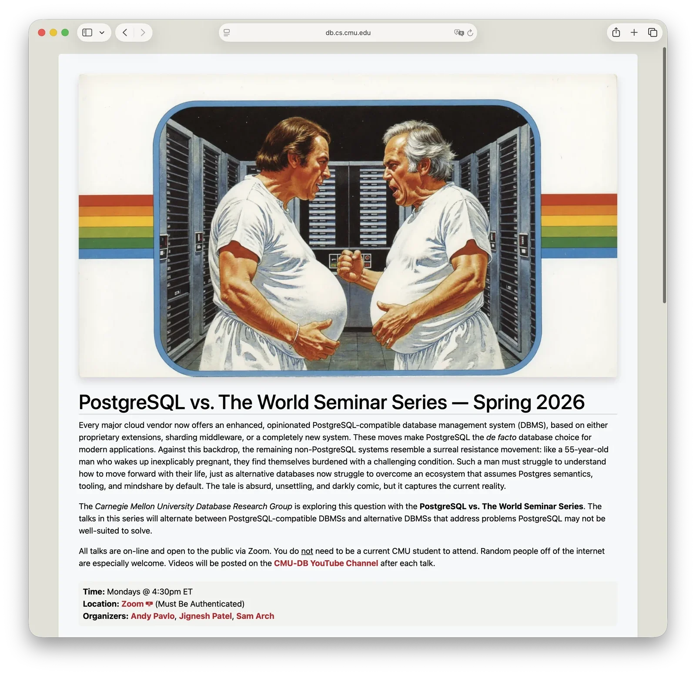

AI stripped away software's skin, exposing the database skeleton underneath. The market isn't panic-selling — it's repricing.

------

## I. The Bloodbath

Software stocks are experiencing a historic meltdown.

In January 2026, the iShares Software ETF (IGV) dropped 15% in a single month — the worst monthly performance since the Lehman Brothers collapse in 2008. On February 3rd alone, it fell 5%. This kind of price action isn't "slightly missed earnings." It's a valuation anchor snapping: the market is questioning whether the pricing logic that powered the software industry for the past decade still holds.

Look at these former high-flyers, all cut in half. Jefferies analysts wrote: "Software sentiment has never been this bleak." Bloomberg Intelligence went further, describing software stocks as "radioactive" — untouchable.

Investors are panic-selling. The logic is simple: **AI can write code now. Software companies have lost their moat.**

One narrative is that Anthropic's Claude Code/Cowork "triggered the mass sell-off." When agents can work across tools and systems autonomously, investors realized for the first time: a lot of SaaS is really just selling "a way to operate a database," not "something irreplaceable."

But here's what's really interesting: amid this meltdown, data-layer infrastructure (databases, data warehouses, streaming platforms) held up noticeably better. This doesn't look like blanket panic — it looks like a cold, surgical unbundling: **the market is pricing software's skin and bones separately.**

To understand how this scalpel works, we need to go back to an earlier verdict.

------

## II. You Were Warned

This crash didn't come out of nowhere. Back in December 2024, Microsoft CEO Satya Nadella said something on the BG2 podcast that essentially called out SaaS's structural risk. Many dismissed it as hyperbole. In hindsight, every word reads like a sentencing:

> This is a key question. From Microsoft's perspective, here's how we think about it: I believe **"SaaS business software" as a category will probably collapse in the agent era.** Think about it — these are essentially business logic layered on top of CRUD databases. That business logic will all migrate to agents. These agents will do cross-database CRUD — they won't care what the backend is. They'll update multiple databases simultaneously, and all logic will run at the AI layer. Once the AI layer becomes the home for all logic, people will start replacing backends.

**Most SaaS = database CRUD + business logic. When the business logic migrates to the agent layer, SaaS becomes an empty shell.**

A year ago, I cited this in [Software Starts from the Database in the AI Era](/db/ai-agent-era/). Some called it fear-mongering. Now look at how software companies' pricing models are cracking — especially per-seat pricing. When the "user" shifts from humans to agents, seats as a billing unit simply don't work.

The question is: if SaaS's intermediary value gets compressed, where does the remaining value collapse to?

The answer lies in the software stack's structure.

------

## III. The Translation Layer Gets Compressed

There's a joke: enterprise operations is really just maintaining spreadsheets. Crude, but not far off.

Who's the customer, what's the order, how much inventory is left, who approved the payment, which account changed permissions — these are all **state**. State must be recorded somewhere: it used to be Excel, then databases. No matter how fancy the UI, the core is always a few tables.

What most SaaS does is put a pretty "skin" on a database: CRM, project management, HR, expense reports, ticketing, dashboards... They look wildly different on the surface, but underneath it's similar patterns: database CRUD + workflow + permissions + audit.

**Most SaaS products are essentially "pretty skins on a database"** — business logic layered on CRUD.

This was a great business for the past decade because building "skins" was expensive: frontend engineering, backend engineering, product design, UX polish, integration, deployment... all labor-intensive.

**But now, AI is compressing the "translation cost" to near zero.**

Architecturally, most layers in the traditional software stack are doing the same thing — **translation**: the frontend translates data into UI; the backend translates operations into SQL; middleware is a patch for when translation isn't efficient enough; the database is where state ultimately lives.

When a "super-translator" can turn natural language directly into reliable database operations and explain results back to humans — many intermediate layers lose their reason to exist. You don't need to open some system, click some report, wait for some page to load. You just say what you want, and the agent handles it.

**When translation capability is strong enough, the translation layer gets deleted.**

The software stack is collapsing toward a simpler structure: [**Agent + Database**](/db/ai-agent-era/).

But "collapse" doesn't mean "software is dead." Because agents have two hard limitations, and these limitations determine how the market reprices.

------

## IV. AI's Two Achilles' Heels

Agent capabilities are improving fast. But two weaknesses remain hard to dodge:

**First: taste.**

AI can write code that runs, but "runs" isn't "survives a decade." The real cost isn't shipping features — it's choosing, from a pile of seemingly workable solutions, the one that's simplest, most maintainable, most change-resistant, most time-proof. That's taste.

Building a CRUD app or a frontend page? AI crushes it. But building a storage engine, designing a consensus protocol, crafting a core abstraction that won't rot in ten years — that's not "writing code," that's "making choices." Bad choices don't throw errors immediately; they manifest as disasters two or three years later. Agents still can't do this.

**Second: verification.**

AI can write tests, run tests, even generate massive test suites. But infrastructure trustworthiness isn't earned by one green CI run. It's forged through years of production: edge cases, resource jitter, hardware failures, version upgrades, bizarre real-world workloads... These determine whether a system is actually reliable.

**Code can be generated. Trustworthy systems can only be hammered out by time and production.**

So the split emerges: the closer to "generation and display," the easier AI compresses the price; the closer to "requires taste + requires verification + can't afford to be wrong," the harder to replace — even subject to repricing upward.

These two points explain why the market is "pricing separately."

## V. The Logic of Differential Pricing

This crash is fundamentally re-answering one question: **When AI shifts from "generator" to "executor," what in the software stack is still worth paying for?**

Jensen Huang defended the software industry with an analogy: if you were the ultimate AI, you wouldn't reinvent the screwdriver — you'd **just use the screwdriver**. AI's breakthrough isn't "eliminating tools" but "wielding tools better."

But software "tools" aren't like screwdrivers — they're split into two halves: **the bit** and **the handle**.

**The reality interface is the bit.** Operating systems, network protocols, databases, storage, permissions and audit trails... These are what actually "bite into the screw" — the only channel through which the digital world changes state. Writing an order, flipping a permission bit, recording a transaction — it all has to land through them. No matter how smart AI gets, it can't bypass these — it'll just call them **more frequently, more automatically, more directly**.

**SaaS is the handle.** UIs, forms, buttons, reports, low-code drag-and-drop, wizard flows... Their value comes from "letting people who can't turn screws turn them anyway." Handles used to be expensive: product, UX, frontend, backend, implementation, integration — all labor-intensive. That's why this layer printed money. Now the game has changed:

**The agent itself is the power drill.**

A power drill doesn't need you to design a prettier handle. It needs a box of standardized bits. Agents naturally take the shortest path to reality interfaces.

So the "differential pricing" framework becomes clear: software value will be re-ranked along a ladder — not all SaaS will be replaced, but the closer to "generatable," the easier to compress; the closer to "auditable state," the harder to replace, and potentially repriced higher.

There's an even deeper reason the rightmost end is nearly immune to generative AI disruption: **factual state cannot be generated.**

AI can generate copy, code, and reports — but it can't generate your company's transaction records from the past decade. It can't "guess" balances, reconciliation discrepancies, audit trails, or permission change history. Those answers can only be **recorded** by systems, not **hallucinated** by models. So the database moat is double: on one side, the taste-and-verification barrier of infrastructure; on the other, the more physical fact — **state must be remembered somewhere.**

When the translation layer gets squeezed thin by agents, what remains isn't "prettier software" — it's: **Agent + Database**. The market isn't doing a blanket panic sell — it's pricing "handle" and "bit," "skin" and "bone," separately.

------

## VI. Where Value Collapse Ends

Once you accept that "AI takes the shortest path to reality," a lot of seemingly emotional capital market moves suddenly look rational: money isn't fleeing software — it's fleeing "human handles" and flooding into "digital reality interfaces."

You'll notice that activity around databases — especially the PostgreSQL ecosystem — keeps intensifying, like a collective vote:

Some are betting on "serverless + branching/forking" developer workflows. Others on "enterprise PG" in the data cloud narrative. Others on "open-source PG + developer experience" for continued expansion. Different starting points, but the same destination: **everyone is converging on PostgreSQL's semantics and ecosystem.**

The market is voting with real money. In 2025, Databricks acquired Neon, Snowflake acquired Crunchy Data, and Supabase raised a Series E at a $5B valuation. Amazon's Aurora DSQL, Microsoft's HorizonDB, Google's AlloyDB — every major cloud vendor plus data warehouse giants are betting on PostgreSQL.

Academic and industry consensus is converging too: more and more heavyweight voices are treating PostgreSQL as "the default semantics, the default toolchain, the default mindshare." CMU's database seminar straight-up named a session "PostgreSQL vs. World," quipping:

> Every major cloud vendor now ships an opinionated PostgreSQL-compatible DBMS; meanwhile, the non-PG holdouts are like a 55-year-old man who wakes up one morning to find himself mysteriously pregnant — struggling to figure out how to live the rest of his life in a world that assumes Postgres semantics, toolchains, and mindshare.

If two years ago my [PostgreSQL Is Eating the Database World](/pg/pg-eat-db-world) was in the present tense, it's now approaching past perfect. The database landscape is clear: **PostgreSQL** is the Linux kernel of databases, unifying the database world. In other words, the endpoint of value collapse isn't the generic "databases" — it's increasingly: **PostgreSQL as the default digital reality interface.**

## VII. The Ultimate Runtime

Since PostgreSQL conquering the database world is now a foregone conclusion, the next question is: **What kind of PostgreSQL represents the future?**

Reviewing the logic behind Databricks' acquisition of Neon, there's a key insight: **database requirements in the agent era are fundamentally different from the human-driven era.**

Agents run at machine speed. They need to create database branches in milliseconds, get real-time schema information, and receive structured error feedback for self-correction. Traditional databases were designed for humans — docs for humans to read, APIs for humans to call, error messages for humans to parse. But if 80% of future database operations are agent-initiated, the database "interface" needs a redesign: highly deterministic context, declarative, manageable; databases that can "explain themselves"; agents that can instantly branch, test decisions, and rollback errors.

Databases are evolving from "warehouses that store data" to **"programmable reality."** The traditional PaaS stack has three layers: OS, Middleware (database), Runtime. These three may fuse into a new species: database at the core, absorbing Runtime upward, encapsulating OS downward, forming a new **AI Infrastructure** paradigm.

> This is also what I've been exploring with Pigsty: [**Agentic PostgreSQL Runtime**](https://pigsty.cc/docs/piglet). Making PostgreSQL not just a database, but a database runtime for the agent era.

------

## VIII. Who Owns the Bones?

Software stocks are crashing. Who survives? Who rises?

The answer isn't in "embrace AI" slogans — it's in what you actually own:

Many SaaS vendors are holding handles: UIs, workflows, reports, dashboards, wizards, permission toggles arranged just so — this layer's value will keep getting cheaper as agents crush translation costs and turn "handles" into optional accessories.

Cloud vendors' IaaS holds the electricity — compute, storage, networking, GPUs. Important, sure, but the more commodity it gets, the more price wars become structurally inevitable.

Databases hold the bits — state, ledgers, audit trails, permissions, history, auditable facts. These are invariants. They can't be replaced by generative models. They are ontological reality.

So the market isn't mis-pricing software. It's redistributing the "irreplaceability premium": shallow layers get compressed, deep layers get repriced.

AI ripped the skin off SaaS, exposing the infrastructure skeleton underneath.

The future software world will increasingly look like two things: agents that talk and work, and PostgreSQL that remembers everything and can be audited. The translation skin in between will thin out — or vanish entirely.

Once you see this, panic becomes a roadmap: stop betting on 2015-era software form factors for 2030-era value. The real bet is on projects that hold invariants.

"When agents learn to turn screws themselves, you'd better be holding not the handle, but the screw itself — the facts that can't be generated, only recorded."
