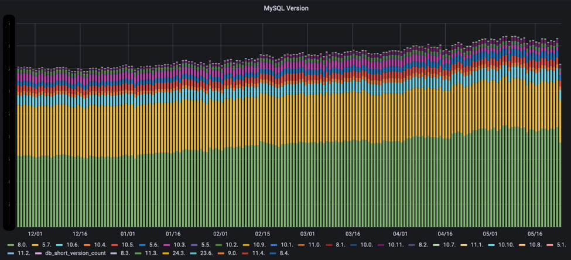
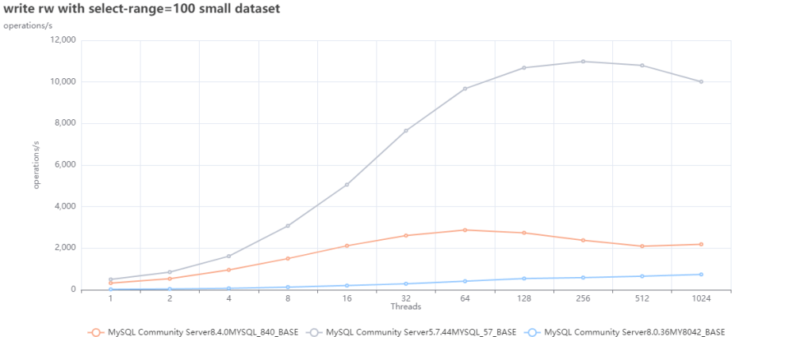
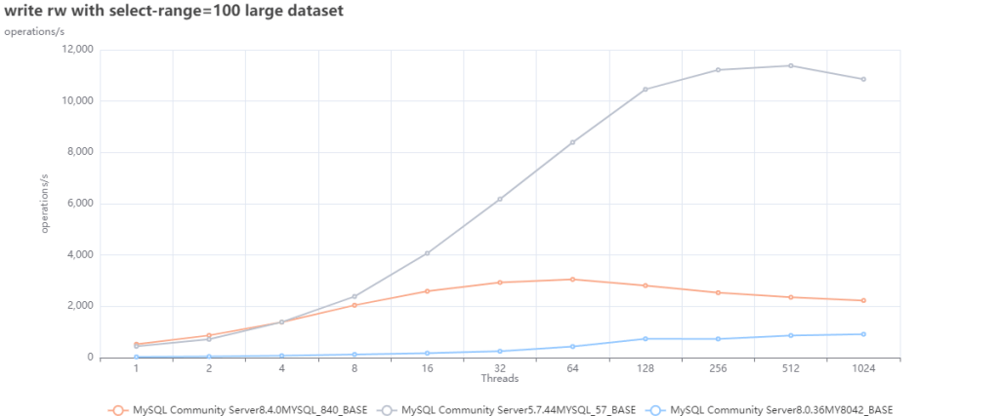
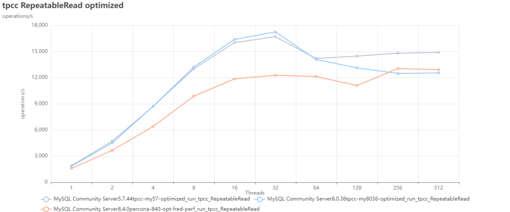
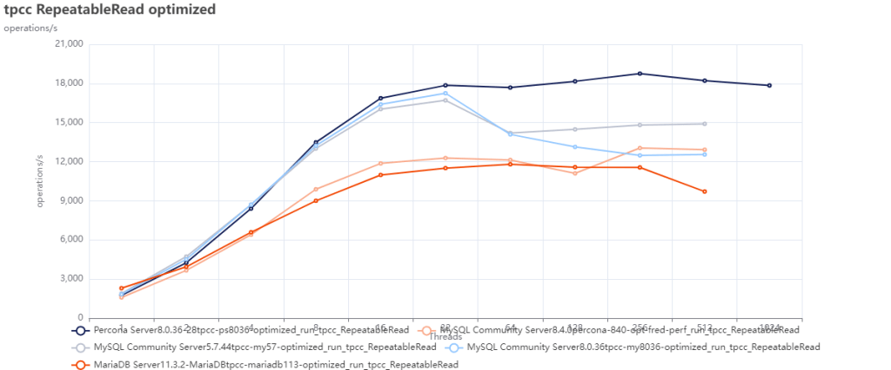
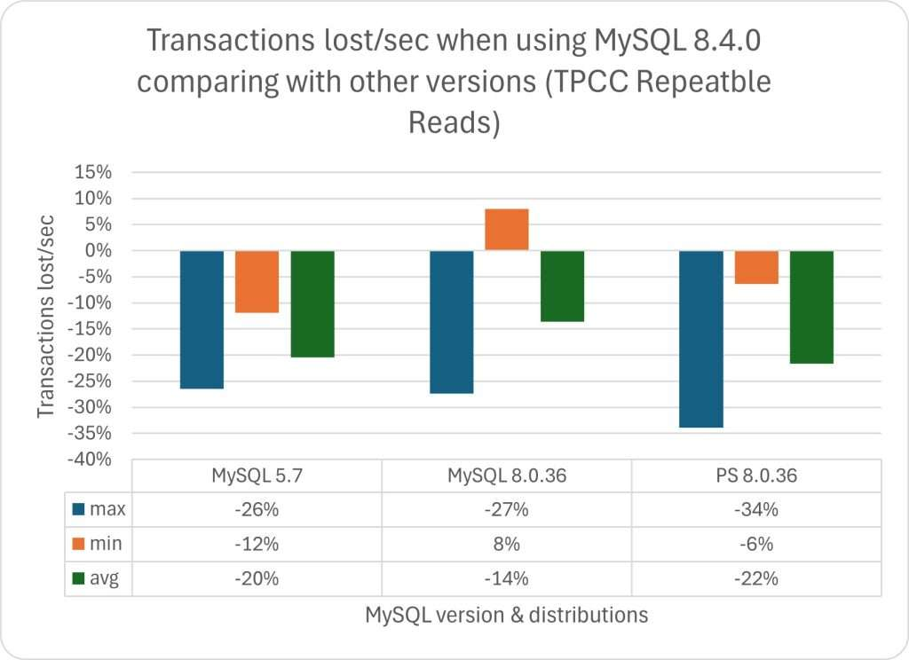
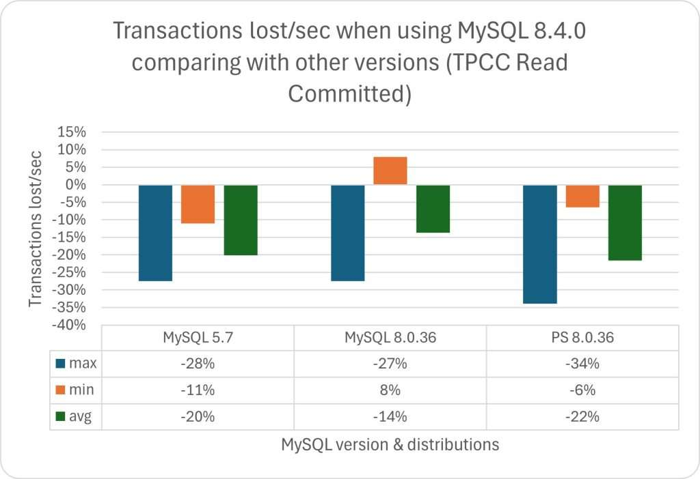
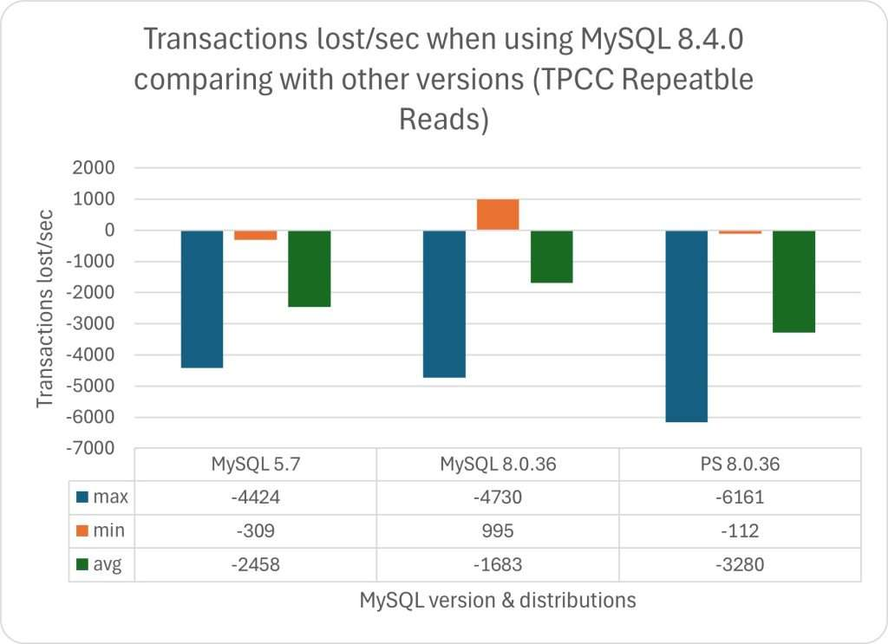
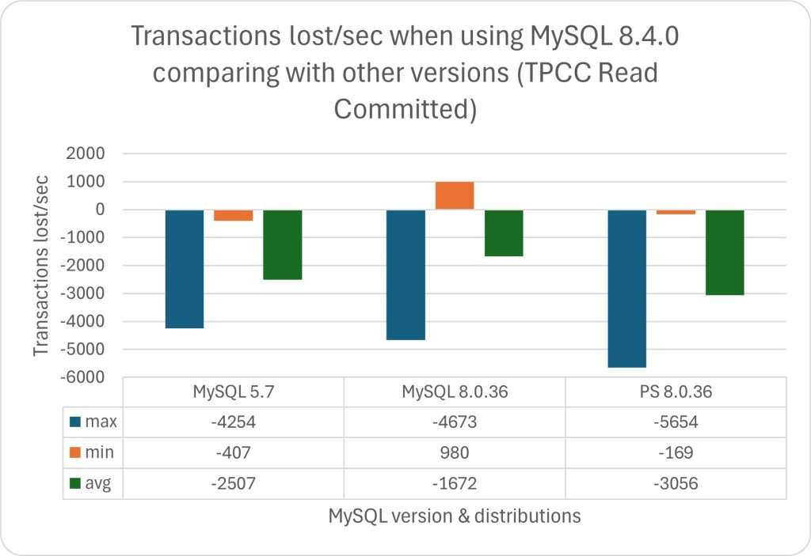

> Author: [Marco Tusa](https://www.percona.com/blog/author/tusa) | Translator: [Vonng](https://vonng.com) ([@Vonng](https://vonng.com/en/)) | [WeChat Original](https://mp.weixin.qq.com/s/nKD00j84R-EcOU1VPL1ibA) | [Percona's Blog](https://www.percona.com/blog/sakila-where-are-you-going/)

At Percona, we constantly monitor our users' needs and strive to meet them. We particularly tracked MySQL version distribution and usage patterns, discovering a striking trend: the migration pace from version 5.7 to 8.x is noticeably slow. More precisely, many users still need to stick with version 5.7.

Based on this finding, we took several measures. First, we talked with some users still using MySQL 5.7 to explore why they don't want to migrate to 8.x. To this end, we developed an EOL plan providing [extended lifecycle support](https://www.percona.com/post-mysql-5-7-eol-support) for version 5.7, ensuring users who need to rely on old versions, binaries, and code fixes can get professional support.

Meanwhile, we conducted extensive testing on different MySQL versions to assess any performance degradation. While testing isn't complete, we've collected enough data to start drawing relevant charts. This article is a preliminary interpretation of our test results.

> **Spoiler alert: For those who love Sakila like me, these findings might not be pleasant.**
>
> Translator's note: Sakila is MySQL's dolphin mascot

> Author: Percona Blog, Marco Tusa, important contributor to the MySQL ecosystem, developer of famous PT series tools, MySQL backup tools, monitoring tools, and distributions.
>
> Translator: Vonng, author of Pigsty, PostgreSQL expert and evangelist. Cloud exit advocate and database cloud exit practitioner.

-----

## Testing

### Assumptions

Testing methods vary widely, and we certainly understand that test results may vary due to various factors (e.g., runtime environment, MySQL server configuration). But if we compare multiple versions of the same product on the same platform, we can reasonably assume that without changing MySQL server configuration, variables affecting results can be controlled to the maximum extent.

Therefore, I first ran performance tests based on **MySQL default configuration**. The working assumption here is clear: the default values you use when releasing a product are usually the safest configuration and have been thoroughly tested.

Of course, I also made some [**configuration optimizations**](https://github.com/Tusamarco/blogs/blob/master/sakila_where_are_you_going/config_changes.txt) and evaluated how optimized parameter configurations would affect performance.

### What Tests Did We Run?

We ran both [sysbench](https://github.com/akopytov/sysbench) and [TPC-C Like](https://www.tpc.org/tpcc/) benchmarks.
Complete [test methodology and details](https://github.com/Tusamarco/benchmarktools/blob/main/docs/plan.md) can be found here, with actual executed commands available here:

- [sysbench](https://github.com/Tusamarco/benchmarktools/blob/main/software/fill_sysbench_map.sh)
- [TPC-C](https://github.com/Tusamarco/benchmarktools/blob/main/software/fill_tpcc_map.sh) 

------

## Results

We ran the complete test suite, and [all results can be found here](https://github.com/Tusamarco/blogs/tree/master/sakila_where_are_you_going).

But to keep the article concise and high-quality, I'll only analyze and present sysbench read-write tests and TPC-C results here. I chose these two tests because they directly and comprehensively reflect MySQL server performance, and they're also the most common application scenarios. Other tests are more suitable for in-depth analysis of specific issues.

In this report's sysbench read-write tests, write operations account for about 36%, read operations about 64%, with reads consisting of point queries and range queries. In TPC-C tests, read-write operation ratios are both 50/50%.

### Sysbench Read-Write Tests 

First, we tested different MySQL versions with default configuration.

**Small dataset, default configuration:**

**Small dataset, optimized results:**

**Large dataset, default configuration:**

**Large dataset, optimized configuration:**

The first two charts are interesting but clearly show one point: we can't use **default configuration** for performance testing. We can use them as a baseline to find better default values.

Oracle's recent decision to modify many parameter defaults in 8.4 confirms this point ([see article](https://lefred.be/content/mysql-8-4-lts-new-production-ready-defaults-for-innodb/)).

Given this, I'll focus on performance evaluation results after optimizing parameter configuration.

Looking at the charts above, we can see:

1. MySQL 5.7 with default values performs better in both scenarios (small and large datasets).
2. MySQL 8.0.36's poor default configuration parameters make it perform poorly in the first scenario (small dataset). But with some optimization adjustments, its performance can surpass 8.4 and get closer to 5.7.

------

### TPC-C Tests

As mentioned above, TPC-C tests should be write-intensive, using transactions and executing complex queries with JOINs, GROUPs, and sorting.

We ran TPC-C tests using the two most commonly used [**isolation levels**](/db/bad-mysql): Repeatable Read and Read Committed.

Although we encountered some issues during repeated testing, they were all random problems caused by lock timeouts. Therefore, despite some gaps in the charts, these don't affect the overall trend - just maxed-out stress performance.

**TPC-C, optimized configuration, RR isolation level:** 

**TPC-C, optimized configuration, RC isolation level:**

In these tests, we can observe that MySQL 5.7 performs better than other MySQL versions.

### How About Percona's MySQL and MariaDB?

For brevity, I'll only present optimized parameter configuration tests here, as mentioned above - default parameters are useless.

**Sysbench read-write, small dataset test results:**

**Sysbench read-write, large dataset test results:**

When comparing MySQL versions with Percona Server MySQL 8.0.36 and MariaDB 11.3, we can see MySQL 8.4 only performs better when compared with MariaDB, but still lags behind MySQL 8.0.36.

#### TPC-C

**TPC-C, RR isolation level test results:**

**TPC-C, RC isolation level test results:**

As expected, MySQL 8.4 doesn't perform well here either, with only MariaDB performing worse as a bottom reference.
Incidentally, Percona Server for MySQL 8.0.36 is the only MySQL that handles increased concurrent contention well.

------

## What Do These Tests Tell Us?

Frankly, the results we've tested here are also what most of our users experience firsthand — **MySQL performance degrades with version increases**.

Of course, MySQL 8.x has some interesting new features, but if you consider performance as the primary and most important factor, MySQL 8.x isn't better.

That said, we must admit — most people still using MySQL 5.7 might be right (there are thousands of them). Why risk a major migration only to discover you've lost a considerable portion of performance?

This can be illustrated with TPC-C test results. We can convert the data to transactions per second throughput and compare how much performance was lost:

**TPC-C, RR isolation level, MySQL 8.4 performance loss:**

**TPC-C, RC isolation level, MySQL 8.4 performance loss:**

We can see that in both tests, MySQL 8.x performance degradation is very obvious, while the benefits it brings (if any) are not significant.

Using absolute values:

**TPC-C, RR isolation level, MySQL 8.4 performance loss:**

**TPC-C, RC isolation level, MySQL 8.4 performance loss:**

In this situation, we need to ask ourselves: can my business handle such performance degradation?

------

## Some Thoughts

When MySQL was sold to SUN Microsystems, I was working at MySQL AB, and I was very unhappy with this acquisition.
When Oracle took over SUN, I was very worried that Oracle might decide to kill MySQL, so I decided to join another company to continue working on it.

In the following years, I changed my mind and began supporting and promoting Oracle's work on MySQL. In many ways, I'm still supporting and promoting it.

They did well in standardizing development processes, and code cleanup work was also effective. However, there wasn't much progress in other code areas, and the performance degradation we see is the price of this lack of progress; see Peter's article "[Will Oracle Finally Kill MySQL?](/db/oracle-kill-mysql)".

On the other hand, we must acknowledge that Oracle has indeed invested heavily in performance and features for OCI/MySQL/Heatwave products — it's just that these improvements aren't reflected in MySQL code, whether community or enterprise edition.

**Again, I think this is very sad, but I can understand why**.

When cloud vendors like AWS and Google use MySQL code, optimize it for their own use, make billions of dollars, and aren't even willing to contribute code back, why should Oracle continue to optimize MySQL code for free?

We know this situation has been going on for many years, and we know it has caused extremely negative impacts on the open source ecosystem.

MySQL is just one Lego brick in a larger scenario where **cloud computing companies are devouring other companies' work and getting rich from it**.

What can we do? I can only hope we'll soon see something different: open code, invest in projects, help communities like MySQL regain lost ground.

Meanwhile, we must acknowledge that many customers and users have very good reasons to use MySQL 5.7.
Until we can solve this problem, they might never decide to migrate, or if they must migrate, migrate to other alternatives like PostgreSQL.

Then, Sakila will slowly and painfully die from human greed as usual, which isn't new in some sense, but it's bad.

Wish everyone happy MySQL usage.

------

## References

[Sakila, Where Are You Going?](https://www.percona.com/blog/sakila-where-are-you-going/)

[Perf regressions in MySQL from 5.6.21 to 8.0.36 using sysbench and a small server](https://smalldatum.blogspot.com/2024/02/perf-regressions-in-mysql-from-5621-to.html)