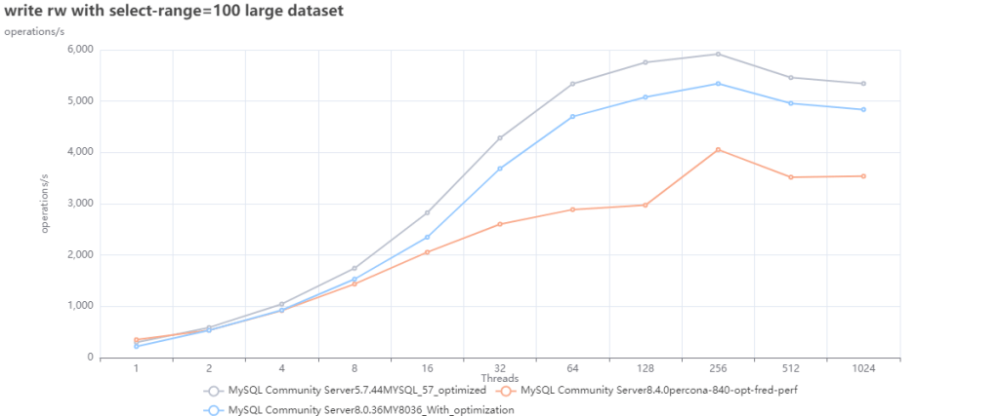

> 作者： [Marco Tusa](https://www.percona.com/blog/author/tusa) | 译：[冯若航](https://vonng.com)（[@Vonng](https://vonng.com/en/)） | [微信原文](https://mp.weixin.qq.com/s/nKD00j84R-EcOU1VPL1ibA) | [Percona's Blog](https://www.percona.com/blog/sakila-where-are-you-going/)

在 Percona，我们时刻关注用户的需求，并尽力满足他们。我们特别监控了 MySQL 版本的分布和使用情况，发现了一个引人注目的趋势：从版本 5.7 迁移到 8.x 的步伐明显缓慢。更准确地说，许多用户仍需坚持使用 5.7 版本。

基于这一发现，我们采取了几项措施。首先，我们与一些仍在使用 MySQL 5.7 的用户聊了聊，探究他们不想迁移到 8.x 的原因。为此，我们制定了 EOL 计划，为 5.7 版本提供[延长的生命周期支持](https://www.percona.com/post-mysql-5-7-eol-support)，确保需要依赖旧版本、二进制文件及代码修复的用户能够得到专业支持。

同时，我们对不同版本的 MySQL 进行了广泛测试，以评估是否有任何性能下降。虽然测试尚未结束，但我们已经收集了足够的数据，开始绘制相关图表。本文是对我们测试结果的初步解读。

> **剧透警告：对于像我这样热爱 Sakila 的人来说，这些发现可能并不令人高兴。**
>
> 译者注：Sakila 是 MySQL 的吉祥物海豚

> 作者：Percona Blog，Marco Tusa，MySQL 生态的重要贡献者，开发了知名的PT系列工具，MySQL备份工具，监控工具与发行版。
>
> 译者：Vonng，Pigsty 作者，PostgreSQL 专家与布道师。下云倡导者，数据库下云实践者。

-----

## 测试

### 假设

测试的方法五花八门，我们当然明白，测试结果可能因各种要素而异，（例如：运行环境， MySQL 服务器配置）。但如果我们在同样的平台上，比较同一个产品的多个版本，那么可以合理假设，在不改变 MySQL 服务器配置的前提下，影响结果的变量可以最大程度得到控制。

因此，我首先根据 **MySQL 默认配置** 运行性能测试，这里的工作假设很明确，你发布产品时使用的默认值，通常来说是最安全的配置，也经过了充分的测试。

当然，我还做了一些 [**配置优化**](https://github.com/Tusamarco/blogs/blob/master/sakila_where_are_you_going/config_changes.txt) ，并评估优化后的参数配置会如何影响性能。

### 我们进行哪些测试？

我们跑了 [sysbench](https://github.com/akopytov/sysbench) 与 [TPC-C Like](https://www.tpc.org/tpcc/) 两种 Benchmark。
可以在这里找到完整的[测试方法与细节](https://github.com/Tusamarco/benchmarktools/blob/main/docs/plan.md)，实际执行的命令则可以在这里找到：

- [sysbench](https://github.com/Tusamarco/benchmarktools/blob/main/software/fill_sysbench_map.sh)
- [TPC-C](https://github.com/Tusamarco/benchmarktools/blob/main/software/fill_tpcc_map.sh) 

------

## 结果

我们跑完了上面一整套测试，[所有的结果都可以在这里找到](https://github.com/Tusamarco/blogs/tree/master/sakila_where_are_you_going)。

但为了保持文章的简洁和高质量，我在这里只对 Sysbench 读写测试和 TPC-C 的结果进行分析与介绍。 之所以选择这两项测试，是因为它们直接且全面地反映了 MySQL 服务器的表现，同时也是最常见的应用场景。其他测试更适合用来深入分析特定的问题。

在此报告中，下面进行的 sysbench 读写测试中，写操作比例约为 36%，读操作比例约为 64%，读操作由点查询和范围查询组成。而在 TPC-C 测试中，读写操作的比例则均为 50/50 %。

### sysbench 读写测试 

首先我们用默认配置来测试不同版本的 MySQL。 

**小数据集，默认配置：**

**小数据集，优化后的结果：**

**大数据集，默认配置：**

**大数据集，优化配置：**

前两幅图表很有趣，但很显然说明了一点，我们不能拿**默认配置**来测性能，我们可以用它们作为基础，从中找出更好的默认值。

Oracle 最近决定在 8.4 中修改许多参数的默认值，也证实了这一点（[参见文章](https://lefred.be/content/mysql-8-4-lts-new-production-ready-defaults-for-innodb/)）。 

有鉴于此，我将重点关注通过优化参数配置后进行的性能评测结果。

看看上面的图表，我们不难看出：

1. 使用默认值的 MySQL 5.7 ，在两种情况（大小数据集）下的表现都更好。
2. MySQL 8.0.36 因为默认配置参数不佳，使其在第一种（小数据集）的情况表现拉垮。但只要进行一些优化调整，就能让它的性能表现超过 8.4，并更接近 5.7。

------

### TPC-C 测试

如上所述，TPC-C 测试应为写入密集型，会使用事务，执行带有 JOIN，GROUP，以及排序的复杂查询。

我们使用最常用的两种 [**隔离等级**](/db/bad-mysql)，可重复读（Repeatable Read），以及读已提交（Read Committed），来运行 TPC-C 测试。

尽管我们在多次重复测试中遇到了一些问题，但都是因为一些锁超时导致的随机问题。因此尽管图中有一些空白，但都不影响大趋势，只是压力打满的表现。

**TPC-C，优化配置，RR隔离等级：** 

**TPC-C，优化配置，RC隔离等级：**

在本次测试中，我们可以观察到，MySQL 5.7 的性能比其他 MySQL 版本要更好。 

### 与 Percona 的 MySQL 和 MariaDB 比会怎样？

为了简洁起见，我将仅在这里介绍优化参数配置的测试，原因上面说过了，默认参数没毛用没有。 

**sysbench读写，小数据集的测试结果：**

**sysbench读写，大数据集的测试结果：**

当我们将 MySQL 的各个版本与 Percona Server MySQL 8.0.36 以及 MariaDB 11.3 进行对比时，
可以看到 MySQL 8.4 只有和 MariaDB 比时表现才更好，与 MySQL 8.0.36 比较时仍然表现落后。

#### TPC-C

**TPC-C，RR隔离等级的测试结果：**

**TPC-C，RC隔离等级的测试结果：**

正如预期的那样，MySQL 8.4 在这里的表现也不佳，只有 MariaDB 表现更差来垫底。
顺便一提，Percona Server for MySQL 8.0.36 是唯一能处理好并发争用增加的 MySQL。 

------

## 这些测试说明了什么？

坦白说，我们在这里测出来的结果，也是我们大多数用户的亲身经历 —— **MySQL 的性能随着版本增加而下降**。 

当然，MySQL 8.x 有一些有趣的新增功能，但如果你将性能视为首要且最重要的主题，那么 MySQL 8.x 并没有更好。 

话虽如此，我们必须承认 —— 大多数仍在使用 MySQL 5.7 的人可能是对的（有成千上万的人）。为什么要冒着极大的风险进行迁移，结果发现却损失了相当大一部分的性能呢？ 

关于这一点，可以用 TPC-C 测试结果来说明，我们可以把数据转换为每秒事务数吞吐量，然后比较性能损失了多少：

**TPC-C，RR隔离等级，MySQL 8.4 的性能折损：**

**TPC-C，RC隔离等级，MySQL 8.4 的性能折损：**

我们可以看到，在两项测试中，MySQL 8.x 的性能劣化都非常明显，而其带来的好处（如果有的话）却并不显著。 

使用数据的绝对值：

**TPC-C，RR隔离等级，MySQL 8.4 的性能折损：**

**TPC-C，RC隔离等级，MySQL 8.4 的性能折损：**

在这种情况下，我们需要问一下自己：我的业务可以应对这样的性能劣化吗？

------

## 一些思考

当年 MySQL 被卖给 SUN Microsystems 时，我就在 MySQL AB 工作，我对这笔收购非常不高兴。
当 Oracle 接管 SUN 时，我非常担心 Oracle 可能会决定干掉 MySQL，我决定加入另一家公司继续搞这个。

此后几年里，我改了主意，开始支持和推广 Oracle 在 MySQL 上的工作。从各种方面来看，我现在依然还在支持和推广它。 

他们在规范开发流程方面做得很好，代码清理工作也卓有成效。但是，其他代码上却没啥进展，我们看到的性能下降，就是这种缺乏进展的代价；请参阅 Peter 的文章《[Oracle 最终会杀死 MySQL 吗？》。](/db/oracle-kill-mysql) 

另一方面，我们不得不承认 Oracle 确实在 OCI/MySQL/Heatwave 这些产品的性能和功能上投资了很多 —— 只不过这些改进没有体现在 MySQL 的代码中，无论是社区版还是企业版。 

**再次强调，我认为这一点非常可悲，但我也能理解为什么**。 

当 AWS 和 Google 等云厂商使用 MySQL 代码、对其进行优化以供自己使用、赚取数十亿美元，甚至不愿意将代码回馈时，凭什么 Oracle 就要继续免费优化 MySQL 的代码？ 

我们知道这种情况已经持续了很多年了，我们也知道这对开源生态造成了极大的负面影响。 

MySQL 只不过是更大场景中的一块乐高积木而已，在这个场景中，**云计算公司正在吞噬其他公司的工作成果，自己用来发大财**。 

我们又能做什么？我只能希望我们能很快看到不一样的东西：开放代码，投资项目，帮助像 MySQL 这样的社区收复失地。 

与此同时，我们必须承认，许多客户与用户使用 MySQL 5.7 是有非常充分的理由的。
在我们能解决这个问题之前，他们可能永远也不会决定迁移，或者，如果必须迁移的话，迁移到其他替代上，比如 PostgreSQL。 

然后，Sakila 将像往常一样，因为人类的贪婪而缓慢而痛苦地死去，从某种意义上说，这种事儿并不新鲜，但很糟糕。

祝大家使用 MySQL 快乐。

------

## 参考阅读

[Sakila, Where Are You Going?](https://www.percona.com/blog/sakila-where-are-you-going/)

[Perf regressions in MySQL from 5.6.21 to 8.0.36 using sysbench and a small server](https://smalldatum.blogspot.com/2024/02/perf-regressions-in-mysql-from-5621-to.html)