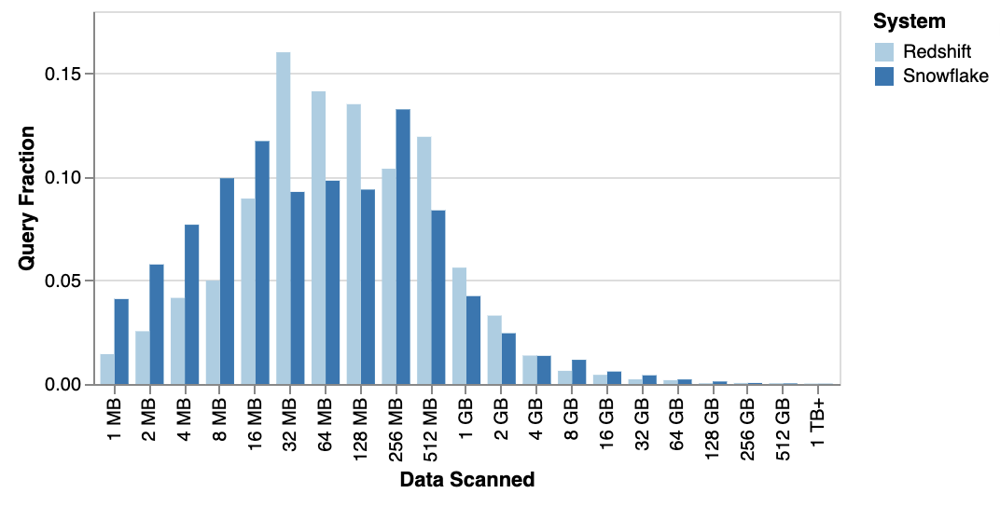
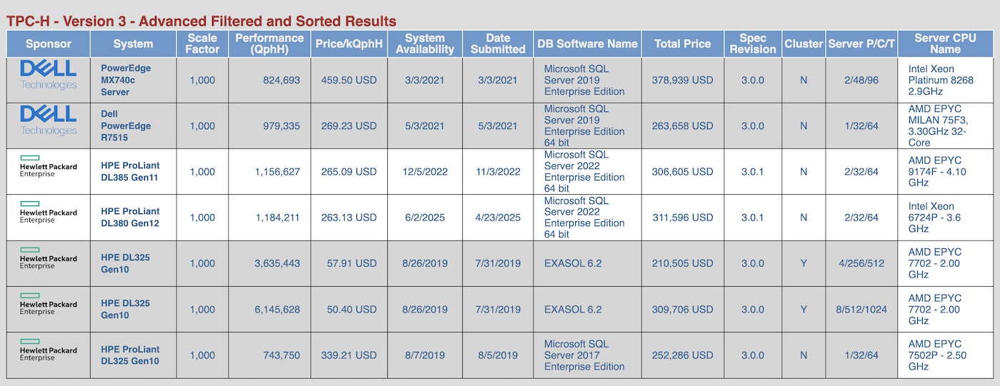

> [英文原文](https://duckdb.org/2025/05/19/the-lost-decade-of-small-data.html) | [微信原文](https://mp.weixin.qq.com/s/rfv_oSRD4LS-W9xFd_WB9g)** | 2025年05月23日

如果 2012 年 DuckDB 问世，也许那场数据分析向分布式架构的大迁移根本就不会发生。通过在2012年的Macbook笔记本上运行 TPC-H 评测，我们发现数据分析确实在分布式架构上走了十年弯路。

> 作者： Hannes Mühleisen，发布于 2025 年 5 月 19 日，[英文](https://duckdb.org/2025/05/19/the-lost-decade-of-small-data.html)
> 
> 译评：冯若航，数据库老司机，云数据库泥石流

太长不看：我们在一台 2012 年款 MacBook Pro 上对 DuckDB 进行了基准测试，想要弄清楚在过去十年里，我们是否在追逐分布式数据分析架构的过程中迷失了方向？

包括我们自己在内，很多人都反复提到过这一点：[数据其实没那么大](https://www.youtube.com/watch?si=npV0awLO3nQZvrlS&t=2637&v=-wCzn9gKoUk&feature=youtu.be) 。 而且硬件进步的速度已经超越了有用数据集规模的增长速度。我们甚至预测预测过 [在不久的将来会出现“数据奇点”](https://www.youtube.com/watch?v=GELhdezYmP0&t=2494s) ——届时 99% 的有用数据集都能在单节点上轻松查询。[最近的研究数据显示](https://www.fivetran.com/blog/how-do-people-use-snowflake-and-redshift) ， Amazon Redshift 和 Snowflake 上的查询中位扫描数据量仅约 100 MB，而 99.9 百分位点也不到 300 GB。由此看来，“奇点”也许比我们想象的更近。

但是我们开始好奇，这一趋势究竟是从什么时候开始的？像随处可见、通常只用来跑 Chrome 浏览器的 MacBook Pro 这样的个人电脑，是什么时候摇身一变成为了如今的数据处理大师？

让我们把目光投向 2012 年的 [Retina MacBook Pro](https://en.wikipedia.org/wiki/MacBook_Pro#Retina_\(2012%E2%80%932016\))。许多人（包括我自己）当年购买这款电脑是为了它那块华丽的 “Retina”（视网膜） 显示屏 —— 销量以百万计。我当时虽没工作，但还是咬牙加钱把内存升级到了 16 GB。不过，这台机器上还有一个常被遗忘的革命性变化：它是第一款内置固态硬盘（SSD）并配备性能强劲的 [4核 2.6 GHz Core i7 CPU](https://everymac.com/systems/apple/macbook_pro/specs/macbook-pro-core-i7-2.6-15-mid-2012-retina-display-specs.html) 的 MacBook。重看一遍当年的 [发布会视频](https://www.youtube.com/watch?v=QNcbZDQKwSQ) 仍然颇为有趣 —— 他们 **确实** 也强调了这种 “全闪存架构” 的性能优势。

题外话：实际上早在 2008 年 MacBook Air 就已经是第一款可选配内置 SSD 的 MacBook，只可惜它没有 Pro 版那样强劲的 CPU 火力。

巧的是，我现在手头仍有这样一台笔记本放在 [DuckDB Labs](https://duckdblabs.com/) 办公室，我的孩子们平时来玩时，会用它来刷 Youtube 看动画片。那么，这台老古董还跑得动现代版本的 DuckDB 吗？它的性能和现代的 MacBook 相比如何？ 我们可以在 2012 年就迎来当今的数据革命吗？让我们一探究竟！

* * *

## 软件

首先来说说操作系统。为了让这次跨年代的对比更公平，我们特地把 Retina 本的系统 **降级** 到 OS X 10.8.5 “Mountain Lion”——这正是该笔记本上市几周后的 2012 年 7 月发布的操作系统版本。虽然这台 Retina 笔记本实际上可以运行 10.15 (Catalina)，但我们觉得要做真正的 2012 年对比，就该使用那个年代的操作系统。下面这张截图展示了当年的系统界面，我们这些上了年纪的人看了不禁有点感慨。

再来说 DuckDB 本身。在 DuckDB 团队，我们对可移植性和依赖有着近乎宗教般的坚持（更准确的说是 “**零依赖** ”）。正因如此，要让 DuckDB 在古老的 Mountain Lion 上跑起来几乎不费吹灰之力：DuckDB 的预编译二进制默认兼容到 OS X 11.0 (Big Sur)，我们只需调整一个编译标志重新编译，就使 DuckDB 1.2.2 顺利运行在了 Mountain Lion 上。我们本想尝试用 2012 年的老旧编译器来构建 DuckDB，无奈 C++11 在当年还太新，编译器对它的支持根本跟不上。话虽如此，生成的二进制运行良好——实际上，只要费些功夫绕过编译器的几个 bug，当年也是可以把它编译出来的。或者，我们大可以像 [**其他人那样**](https://www.youtube.com/watch?v=zsvafrKvTTY&t=54s) 干脆直接手写汇编。

* * *

## 基准测试

但我们感兴趣的可不是什么 CPU 综合跑分，我们关注的是 [SQL综合跑分](https://hannes.muehleisen.org/publications/DBTEST2018-performance-testing.pdf)！为了检验这台老机器在严肃的数据处理任务下的表现，我们使用了如今已经有些老掉牙但依然常用的 TPC-H 基准测试，规模因子设为 **1000** 。这意味着其中两张主要表 `lineitem` 和 `orders` 分别包含约 60 亿和 15 亿行数据。将数据生成 DuckDB 数据库文件后，大约有 265 GB 大小。

根据 [TPC 官网的审计结果](https://www.tpc.org/tpch/results/tpch_advanced_sort_V35.asp?PRINTVER=false&VERSION=3&FLTCOL1=h_sf&FLTCOLOPR1=%3D&FLTCHO1=1000&ADDFILTERROW=&filterRowCount=1&SRTCOL1=h_sponsor&SRTDIR1=ASC&ADDSORTROW=&sortRowCount=1&DISPRES=100++++PERCENT&include_withdrawn_results=none&include_historic_results=yes&include_specification_revision=ON&include_server_cpu=ON&include_total_system_price=ON&include_cluster_info=ON) ，可以看出在单机上跑如此规模的基准测试，似乎需要价值数十万美元的硬件设备。

我们将 22 个基准查询各跑了五遍，取中位数运行时间来降噪。（由于内存只有 16 GB，而数据库大小达到 256 GB，缓冲区几乎无法缓存多少输入数据，因此这些严格来说都算不上大家口中的 “热运行“。）

下面列出了每个查询的耗时（单位：秒）：

查询 | 耗时  
---|---  
1 | 142.2  
2 | 23.2  
3 | 262.7  
4 | 167.5  
5 | 185.9  
6 | 127.7  
7 | 278.3  
8 | 248.4  
9 | 675.0  
10 | 1266.1  
11 | 33.4  
12 | 161.7  
13 | 384.7  
14 | 215.9  
15 | 197.6  
16 | 100.7  
17 | 243.7  
18 | 2076.1  
19 | 283.9  
20 | 200.1  
21 | 1011.9  
22 | 57.7  
  
但是，这些冰冷的数字实际上意味着什么呢？令人窃喜的是，这台老电脑居然真的用 DuckDB 跑完了所有基准查询！如果仔细看看那些耗时，每个查询大致在几分钟到半小时之间。这种数据量下跑分析型查询，这样的等待时间一点也不离谱。老天，要是在 2012 年，你光等 Hadoop YARN 去调度你的作业就得更久，最后很可能它只会朝你吐出一堆错误堆栈。

* * *

## 2023 年的改进

那么这些结果与一台当代 MacBook 比又如何呢？作为比较，我们使用了一台现代 ARM 架构 [M3 Max MacBook Pro](https://everymac.com/systems/apple/macbook_pro/specs/macbook-pro-m3-max-16-core-cpu-40-core-gpu-14-late-2023-specs.html)（碰巧就在同一张桌子上）。这两台 MacBook 之间代表了超过十年的硬件发展差距。

从 [GeekBench 5 基准测试分数](https://everymac.com/ultimate-mac-comparison-chart/?compare=all-macs&highlight=0&prod1=MacBookPro159&prod2=MacBookPro063&prod3=) 来看，全核性能提升了约 7 倍，单核性能提升约 3 倍。当然，RAM 和 SSD 速度的差距也非常明显。有趣的是，屏幕尺寸和分辨率几乎没有变化。

下面将两台机器的结果并排列出：

查询 | 旧耗时 | 新耗时 | 加速比  
---|---|---|---  
1 | 142.2 | 19.6 | 7.26  
2 | 23.2 | 2.0 | 11.60  
3 | 262.7 | 21.8 | 12.05  
4 | 167.5 | 11.1 | 15.09  
5 | 185.9 | 15.5 | 11.99  
6 | 127.7 | 6.6 | 19.35  
7 | 278.3 | 14.9 | 18.68  
8 | 248.4 | 14.5 | 17.13  
9 | 675.0 | 33.3 | 20.27  
10 | 1266.1 | 23.6 | 53.65  
11 | 33.4 | 2.2 | 15.18  
12 | 161.7 | 10.1 | 16.01  
13 | 384.7 | 24.4 | 15.77  
14 | 215.9 | 9.2 | 23.47  
15 | 197.6 | 8.2 | 24.10  
16 | 100.7 | 4.1 | 24.56  
17 | 243.7 | 15.3 | 15.93  
18 | 2076.1 | 47.6 | 43.62  
19 | 283.9 | 23.1 | 12.29  
20 | 200.1 | 10.9 | 18.36  
21 | 1011.9 | 47.8 | 21.17  
22 | 57.7 | 4.3 | 13.42  
  
显而易见，我们获得了可观的加速效果，最低约 7 倍，最高超过 50 倍。运行时间的[几何平均数](https://en.wikipedia.org/wiki/Geometric_mean) 从 218 秒降低到了 12 秒，整体提升了约 20 倍。

* * *

## 可复现性

所有二进制文件、脚本、查询和结果都已发布在 [GitHub](https://github.com/hannes/old-macbook-tpch) 上供大家查阅。我们还提供了 [TPC-H SF1000 数据库文件](https://github.com/hannes/old-macbook-tpch) 下载，这样你就不用自己生成。不过请注意，文件非常大。

* * *

## 讨论

我们看到，这台已有十年历史的 Retina MacBook Pro 成功完成了复杂的分析型基准测试，而更新的笔记本则显著缩短了运行时间。但对于用户而言，那些绝对的加速倍数其实意义不大—— 这里的差别纯粹是 **量变** 而非什么 **质变** 。

从用户的角度来看，更重要的是这些查询能够在相当合理的时间内完成，而不是纠结于到底用了 10 秒还是 100 秒。用这两台笔记本，我们几乎可以解决同样规模的数据问题，只不过旧机器需要我们多等待一会儿而已。尤其是 DuckDB 能够[处理超出内存大小的数据集](https://duckdb.org/docs/stable/guides/performance/how_to_tune_workloads.html)——必要时可以将查询中间结果溢出到磁盘，这让单机处理大数据成为可能。

更有意思的是，早在 2012 年，像 DuckDB 这样单机 SQL 引擎完全有能力在可接受的时间内跑完对一个包含 60 亿行数据的数据库的复杂分析查询——而这一次我们甚至**不需要** [把机器泡在干冰](https://www.youtube.com/watch?v=H1N2Jr34jwU&t=1763s)里。

历史不乏各种 **“假如当初……” **的假设。如果 2012 年就出现了 DuckDB，会发生什么呢？主要的条件那时其实都已具备—— [矢量化查询处理技术早在2005年就已经问世](https://www.cidrdb.org/cidr2005/papers/P19.pdf)。如今回头再看那场数据分析向分布式架构的大迁移显得有些傻气，如果那时候就有 DuckDB，也许那场运动根本不会发生。

我们这次使用的基准数据集规模，非常接近 2024 年分析查询输入数据量的 99.9 百分位点。而 Retina MacBook Pro 虽然在 2012 年属于高端机型，但到了 2014 年，许多厂商提供的笔记本电脑也都配备了内置 SSD，且更大容量的内存逐渐变得司空见惯。

**所以，没错，我们的确整整浪费了十年。**

## 老冯评论

老冯一直认为在当代硬件条件下，分布式数据库是一个伪需求。在《[分布式数据库是伪需求吗？](https://mp.weixin.qq.com/s/FNhTCZk-SBVQkYhQ3zi_-g)》那篇文章中，我比较保守的将 “OLAP 分析” 从中排除 —— 因为我确实在阿里处理过单机没法搞的数据量级 —— 每天 70 TB 的全网 PV 日志。

但我必须承认，那种情况真的属于极端特例，实际上绝大多数的分析场景并不会有那么多的数据。毕竟根据各种数据泄漏案例来看，全国人口数据，GA 全量结构数据，也就两百多个 GB 而已。许多所谓的“大数据场景” 其实并没有那么多数据，每次查询的时候实际读取处理的数据就更少了。（请看《DuckDB宣言：大数据已死》）

DuckDB 的这篇文章无疑撕开了整个数据分析，分布式数据库与大数据行业的遮羞布。是的，早在十年前，像几百 GB 的全量分析，就已经可以在一台 Macbook 笔记本上进行了！我们确实整整浪费了十年的时间，在错误的道路上蹉跎了岁月。

我的意思是，TPC-H 1000 仓的分析，可以在一台普通笔记本上用 6 分钟（370s）跑完，在十年前的笔记本上用 6 小时（8344s）跑出来，这是一个惊人的成绩。如果我们把现在的各路分布式数据库，OLAP，HTAP，MPP 各种 P 拉出来对比一下的话，就不难发现这是多么惊人的一个成绩了。

例如国产数据库标杆 TiDB 主打 HTAP 概念，并提供了 TiFlash 用于分析加速。然而其官网公布的 TPC-H 评测结果，用 92C 478G 处理 50 仓的数据，耗时几乎和一台 10C64GB 笔记本处理 300 仓的接近，在相同的时间里用十倍的资源却只处理了 1/6 的数据。这不禁让人怀疑，在这里用分布式真的有意义吗？

有人说 OLTP 也许会有超出单机吞吐的情况必须要用到分布式数据库，可是拥有五亿活跃用户的 OpenAI 竟然只用了一套 1主40从的 PostgreSQL 集群，在未分片的情况下直接支撑起了整个业务（《[OpenAI：将PostgreSQL伸缩至新阶段](https://mp.weixin.qq.com/s/ykrasJ2UeKZAMtHCmtG93Q)》）。如果 OpenAI 能用集中式架构做到这一点，我相信你的业务也一定可以。

DuckDB 的例子进一步证明了在当代，分布式数据库已经成为了伪需求 —— 不仅仅是 OLTP，甚至是 OLAP。实际上如果我们关注 DB-Engine 上的热度就不难发现，分布式数据库作为一个 Niche（NewSQL），甚至都还没有像产生像 NoSQL 这样的影响力，就已经过气了。而我相信，重新融合 OLTP 和 OLAP 的新物种，将由 PostgreSQL 和 DuckDB 杂交而出。

  * [←上一页](/blog/db/openai-pg/)
  * [下一页→](/blog/db/guru/)

最后修改 2025-05-24: [add smalldata (6760279)](https://github.com/pgsty/web.cc/commit/6760279cb9f6c860db678883e1835cec56198fff)