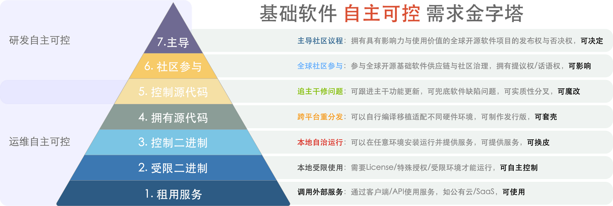

> [WeChat](https://mp.weixin.qq.com/s/hWbcc9cMM9qTjPJ0m6G0Kg) | [Zhihu Original](https://zhuanlan.zhihu.com/p/653583260)

**When we talk about self-reliance and control, what are we really talking about?**

For infrastructure software (operating systems/databases), does self-reliance and control mean: developed, distributed, and controlled by Chinese companies/Chinese people? Or can it run on "domestic operating systems"/domestic chips? Proper names lead to smooth words, and smooth words lead to successful actions. The current chaos in "self-reliance and control" is closely related to unclear definitions and ambiguous standards. But this doesn't prevent us from exploring what the goal of "信创安可 self-reliance and control" is **trying to achieve**.

The nation's need is simple: **can existing systems continue running after war and sanctions**.

Software self-reliance and control has two parts: **operational self-reliance** and **R&D self-reliance**. What nations/users truly need is the **former**. If we express infrastructure software "self-reliance and control" needs in a pyramid hierarchy, then in this demand pyramid, the nation's requirement can be described as: **for infrastructure software with practical value: secure level 3, strive for level 5**. At minimum, achieve "**local autonomous operation**", ideally reach "**source code control**".

> Infrastructure Software Self-Reliance and Control Demand Pyramid

Pursuing **R&D self-reliance** must consider the **vitality** problem. When mature open source kernels already exist in infrastructure software fields (operating systems/databases), pursuing so-called **self-research** has almost no practical value for nations and users: **only when a team's functional R&D/problem-solving speed exceeds the global open source community does kernel self-research become a meaningful choice**. Most infrastructure software vendors claiming "self-research" are essentially shell-wrapping, reskinning, or modifying open source kernels, with self-reliance and control levels of 2-3 or even lower. Low-quality software forks not only lack practical value but also waste scarce software talent and market opportunities, ultimately leading to Chinese software industry disconnection from global supply chains, creating huge negative externalities.

When migrating from Oracle/other foreign commercial databases to alternatives, please note: **has your self-reliance and control level substantially improved**? We need to be particularly careful and vigilant about infrastructure software products flying the flag of domestic self-research monopolizing under protection, driving out truly vital open source infrastructure software from ecological niches - this would cause real harm to the self-reliance and control cause — so-called: **shooting yourself in the foot, strangling your own neck**.

For example, a so-called "self-research" database that needs license files or immediately dies on you (nominally L7, actually L2) has far less operational self-reliance than mature open source databases (L4/L5). If this domestic database company becomes incapacitated for any reason (reorganization, bankruptcy, or getting bombed), it will cause a series of systems using this product to lose long-term continuous stable operation capability.

Open source is a global collaborative software **R&D** model with overwhelming dominance in infrastructure software kernels (operating systems/databases). The open source model has already solved infrastructure software **R&D** problems well but hasn't solved software **operations** problems well - and this is exactly what truly meaningful self-reliance should solve. Software's ultimate value is realized in its **usage process**, not **development process**. Truly meaningful self-reliance is helping nations/users make good use of existing mature open source OS/database kernels — **providing distributions and professional technical services based on open source kernels**. While maintaining stable operation of existing/incremental systems, respond to the "community of shared future for mankind" initiative, actively participate in global open source software supply chain governance, and expand domestic suppliers' international influence.

In summary, we believe **operational self-reliance** focuses on: replacing uncontrollable third-party services and restricted commercial software, encouraging domestic suppliers to provide technical services and distributions based on popular open source infrastructure software. For open source infrastructure software with significant practical value, encourage learning, exploration, research, and contribution. Incubate and cultivate domestic open source communities, maintain fair competitive environments and healthy commercial ecosystems. **R&D self-reliance** focuses on: actively participating in global open source software supply chain governance, improving domestic software companies' and teams' voice in global top infrastructure software open source projects, cultivating technical teams with global vision and advanced R&D capabilities. Should stop low-level repetitive "domestic OS/database kernel forks" and focus on building internationally influential services and software distributions.

----------

## Appendix: Different Levels of Self-Reliance and Control

For infrastructure software, control levels from high to low can be subdivided into nine levels:

9: Own software release rights (release rights, 67%) 

8: Hold majority voting rights (dominance, 51%) 

7: Hold minority veto rights (veto power, 34%) 

6: Have proposal voice (voice, 10%) 

**5: Control source code (follow mainline, fix bugs)** 

**4: Obtain source code (cross-platform redistribution)** 

**3: Control binaries (local autonomous operation)** 

2: Restricted binaries (local restricted use) 

1: Rent services (call remote services) 

Among these, levels 1-5 are **operational self-reliance**, and levels 5-9 are **R&D self-reliance**. Simplifying the R&D self-reliance levels gives us this self-reliance and control demand pyramid:

Level 1 self-reliance, **renting services**, has the worst control: hardware and data are stored on suppliers' servers. If the service provider goes bankrupt, stops production, or disappears, the software won't work, and documents and data created with this software get locked in. For example, OpenAI's ChatGPT belongs to this category.

Level 2 self-reliance, **restricted binaries**, means software can run on your own hardware but contains additional restrictions: like needing regularly updated license files or requiring online authentication to run. Problems with this type of software are similar to the previous level: if the software provider goes bankrupt or stops production, applications using such software will die within a limited time. Some commercial operating systems/commercial databases requiring license files belong to this category.

Level 3 self-reliance, **controlling binaries**, means software can run without restrictions on any mainstream hardware. Users can deploy software without internet access and use its complete functionality indefinitely. Having unrestricted binaries also means domestic suppliers can provide their own services based on the software, essentially **reskinning**. **Most scenarios requiring self-reliance fall into this level**. 

Level 4 self-reliance, **having source code**, means software can be recompiled and redistributed. This level of self-reliance means that even if hardware is sanctioned, existing open source software systems can still run on domestic operating systems/hardware. It also means domestic suppliers can provide their own distributions, services, **shell-wrapping**, and redistribution. **Open source infrastructure software sits at this level by default**. Most domestic operating systems/databases claiming "self-research" actually belong to this category.

Level 5 self-reliance, **controlling source code**, means having the ability to follow and backstop open source software. This means that even in the most extreme situation where global open source software communities decouple from China, domestic suppliers can fork independently, follow mainline functional features, and fix defects, ensuring long-term software vitality and security. Controlling source code means substantial **modification** capability and begins transitioning from operational to R&D self-reliance. Very few domestic vendors have this capability, and it's the reasonable upper limit for national expectations of self-reliance.

Levels 6-9 enter the realm of "**R&D self-reliance**". Based on domestic suppliers' voice ratios, they can be divided into four levels (proposal rights/veto rights/dominance/release rights). This involves participation and governance in infrastructure software open source kernels. This means domestic suppliers can participate in global open source infrastructure software supply chains, voice their opinions and influence, participate in community governance, and even lead project directions.

For globally valuable open source infrastructure software, China's meaningful self-reliance strategy is: **eliminate level 2, secure level 3, strive for level 5**. Higher levels 6-9 representing "**R&D self-reliance**" are nice to have: certainly good, should strive for when possible, but absence doesn't affect existing/incremental system self-reliance. Avoid doing useless or even negatively optimizing garbage forks for flashy "self-research" vanity while abandoning functional vitality substance, cutting ourselves off from global software supply chains.