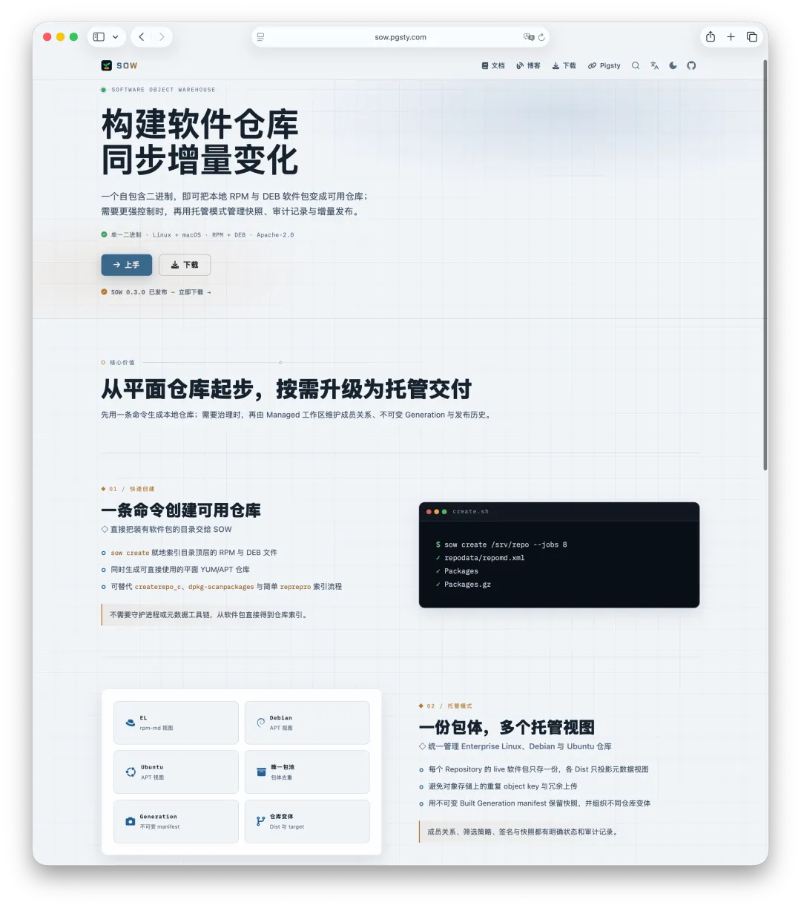
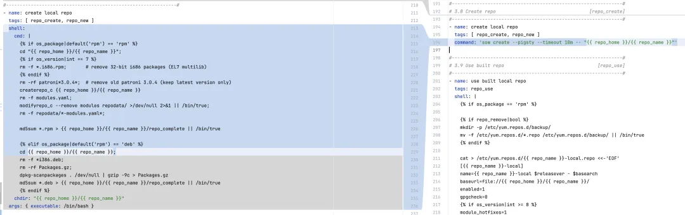
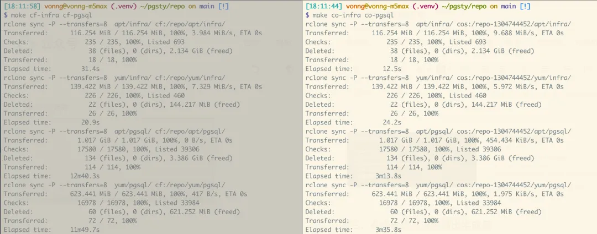
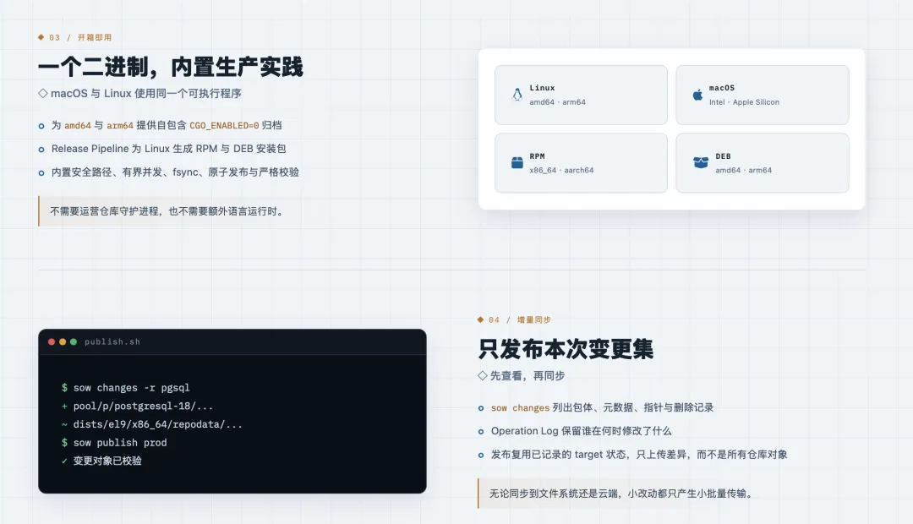
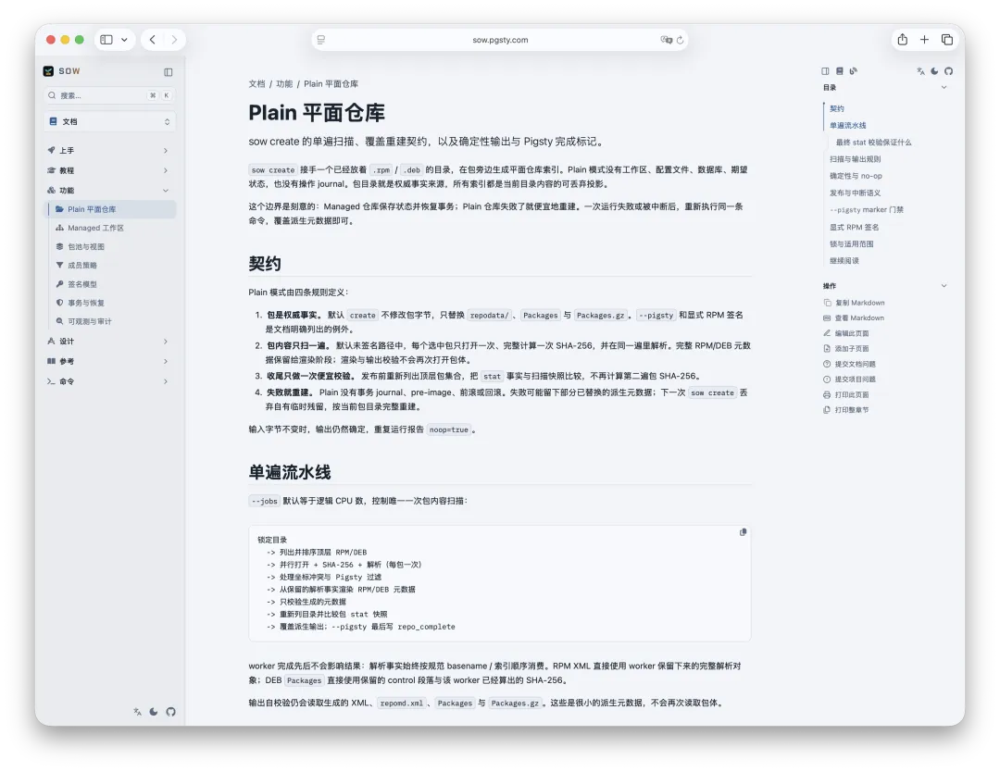
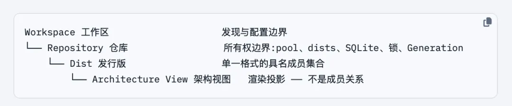
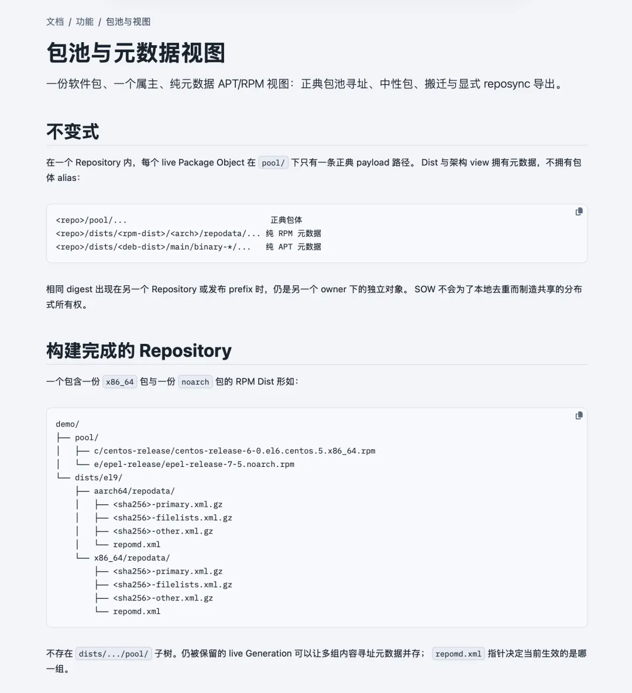
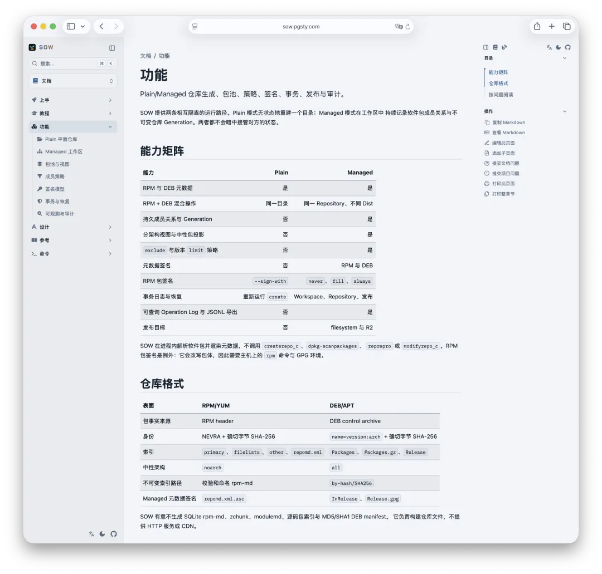
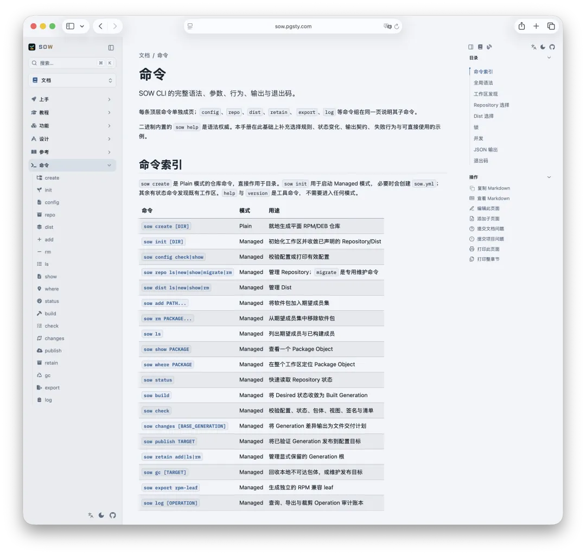

Today, let's talk about *Postpartum Care for Sows*—a Chinese meme for the sort of absurdly specialized practical topic nobody expects to discuss. This time, the sow in question is my new open-source project, SOW.

When you maintain a PostgreSQL distribution, compiling the software is rarely the most painful part. The real pain is dealing with everything the build produces.

Pigsty maintains hundreds of components across multiple Linux distributions, CPU architectures, and major PostgreSQL versions. Multiply those combinations out, and the repository ends up with more than 100,000 artifacts: RPMs, DEBs, indexes, signatures, checksums, snapshots, and piles of metadata that exist only to keep package managers happy.

Users see `apt install` or `dnf install`. Maintainers see something else entirely. You update one package and must guarantee that the other 99,999 objects were not accidentally deleted. You change one index and must ensure that users around the world never catch the repository halfway through the cutover, with half the old state and half the new. At small scale, these look like scripting problems. At 100,000 artifacts, they abruptly become database, distributed systems, and software supply-chain problems.

That is why I built [SOW](https://sow.pgsty.com/), a self-contained APT/YUM repository manager written in Go.



If all you need is to turn a directory of RPMs and DEBs into a usable repository, one command is enough:

```bash
sow create /www/pigsty
```

For a repository you intend to maintain over time, SOW also provides Managed mode. It projects one package payload into multiple distribution views, records desired and built state, creates immutable snapshots, computes exact changesets, and publishes incremental updates to a filesystem or object store.

In one sentence: **SOW puts the small job of “generating repository indexes” and the much larger job of “governing a long-lived software repository” into one self-contained binary.**

**I built this tool entirely to solve my own problems. But if you also maintain a large software repository spanning multiple Linux distributions, it should help you too—though admittedly, there probably aren't many of us.**

---

## Why SOW?

The name deserves an explanation. We previously built a companion project, [**Pig—PostgreSQL Install Genius**](/en/pg/pig/), the package manager for the PostgreSQL ecosystem. If a little Pig installs the packages, then the tool that produces, stores, organizes, and distributes those artifacts naturally has to be its mother: SOW.


It also expands neatly to **Software Object Warehouse**, a name that fits naturally into the software supply chain. Better yet, the pig metaphor has roots in industrial history. In traditional pig-iron casting, molten iron flowed down a central channel and branched into rows of smaller molds. The cooled ingots were called **pigs**, while the main runner that fed them was the **sow**. Seen from above, one large channel feeding rows of ingots looked like a sow nursing her piglets.


---

## Why Build Another Repository Tool?

The immediate trigger was Pigsty's offline installation. Pigsty first downloads the required RPMs and DEBs, then turns them into a local offline repository. Historically, RPM systems relied on `createrepo_c`, while Debian and Ubuntu relied on `dpkg-dev`. The output is only a few XML files, `Packages` indexes, and compressed metadata, yet preparing the toolchain pulls in hundreds of megabytes of dependencies.

That is cumbersome enough on Linux and even uglier on macOS. You have to start different Linux containers, mount the same directory into each one, run the RPM and DEB tools separately, then copy the results back. Bringing in hundreds of megabytes of tooling and a fleet of containers to generate a few megabytes of metadata is hardly elegant.



In [Pigsty 4.5](/pigsty/v4.5/), I removed that clutter. SOW is a self-contained binary only a few megabytes in size. It runs directly on Linux and macOS, understands both RPM and DEB package formats, and implements the APT and DNF repository specifications. It has no daemon and requires no separate language runtime.

But installing fewer tools was only the surface problem. Four deeper problems convinced me to keep building SOW as the repository grew.

### First, Hard Links Don't Help in Object Storage

The same `noarch` RPM may appear in repositories for several architectures, and the same package may belong to beta, latest, and stable views. On a local disk, hard links let many paths share one inode. Upload them to Cloudflare R2, Alibaba Cloud OSS, or another object store, and every `object key` incurs real storage and upload costs. Identical content does not make the cloud treat those keys as one object.

### Second, 100,000 Files Make Even a Comparison Expensive

A repository update may change only a few dozen packages, yet traditional synchronization tools often have to walk, compare, and verify more than 100,000 files to prove it. A full comparison can easily take more than ten minutes. The actual transfer may take seconds; almost all the time goes into proving that nothing changed.



### Third, a Live Repository Must Never Expose a Half-Built State

An RPM repository is more than a directory of `.rpm` files. Clients read `repomd.xml` first, then follow it to `primary`, `filelists`, and the package payloads. APT has the same constraint: `Release`, `InRelease`, `Packages`, and `by-hash` files form a strict graph of references.

If you publish them in the wrong order, a client may see a new pointer before the object it references exists. To the maintainer, that is only a few seconds during an upload. To a user who happens to arrive during that window, it is an irreproducible 404, checksum failure, or aborted installation.



### Fourth, Directories Have No Versions, but Distributions Need Them

The deeper problem surfaced when I wanted to add repository channels. How do you maintain beta, latest, and stable at the same time? Keep a monthly snapshot? Answer “which packages were added last Wednesday?” Roll back safely? Determine which old objects are no longer referenced by any snapshot and may be deleted?

You can script each requirement in isolation. Put them together, however, and those scripts metastasize into a shadow database with no transactions, schema, or audit trail. There are already tools such as `createrepo_c`, `dpkg-scanpackages`, `reprepro`, and `aptly`, along with general-purpose synchronization and object-storage tools. But I could not find a lightweight open-source tool that brought RPM and DEB support, a single package pool, immutable snapshots, atomic publishing, and incremental delivery into one clear model.

Fortunately, building your own tools has never been cheaper.

---

## Two Levels of Complexity, Two Modes

SOW does not assume that every repository needs the same degree of governance. It splits the problem into Plain and Managed modes: small problems stay small, while large ones get the full state machine.

### Plain: The Package Directory Is the Truth

Plain mode has one central command:

```bash
sow create /srv/repo

# Pigsty offline-repository compatibility mode
sow create /srv/repo --pigsty
```

The RPMs and DEBs in the directory are the sole source of truth. `repodata/`, `Packages`, and `Packages.gz` are projections that can be discarded and rebuilt at any time. SOW scans top-level packages concurrently. By default, it opens each package only once, computing its SHA-256, parsing it, and extracting every fact needed for rendering in the same pass before generating metadata for both repository formats.

The output first goes into a private staging area on the same filesystem. SOW validates it with its own parsers before replacing the public files. Finally, it compares the file set and `stat` snapshots again to confirm that no package was added, removed, or replaced during the build. It does not rehash every large package merely for extra reassurance.



Plain mode does not maintain an operation log or attempt heavyweight transaction recovery. If the process is interrupted, run the same `sow create` command again. The package directory is intact, the indexes are derived state, and rebuilding is cheaper than recovery.

With `--pigsty`, SOW also writes a `repo_complete` completion marker at the very end. Until that marker exists, consumers know the repository is not ready. It is a tiny but extremely useful commit protocol.

This mode solves Pigsty's original problem: replace two toolchains and several containers with one small binary, then quickly produce a repository that real APT, DNF, and YUM clients can consume.

### Managed: The Repository Is a State Machine, Not a Directory

A long-lived repository cannot look only at “what is in the directory now.” It must also know what you **want**, what it published successfully last time, and why the two differ.

SOW's Managed model has four layers:



A Workspace is the configuration and discovery boundary. A Repository is the ownership boundary. A Dist is a named set of RPM or DEB members. An Architecture View is only a rendered result and does not own package payloads. The most important invariant is this: **within one Repository, every package has exactly one canonical payload and no duplicates.**

```text
repo/pool/...                              canonical package payload
repo/dists/el9/x86_64/repodata/...         RPM metadata view
repo/dists/trixie/main/binary-amd64/...    APT metadata view
```

A `noarch` RPM or `all` DEB can appear in several architecture indexes without copying its payload. Beta and stable can reference the same package object without creating a second cloud `object key`. APT and DNF repositories can also live under the same directory hierarchy.



The boundary of “store only one copy” must be stated precisely: it is one Repository or one publication prefix, not an entire Workspace, `bucket`, or the whole world. SOW does not deduplicate implicitly across Repositories, because deduplication must not destroy ownership boundaries. Deleting one repository must never remove a shared object that another repository still needs.

---

## Desired, Built, and Generation

Managed mode divides repository state into three concepts:

| State | Meaning |
|:---|:---|
| Desired | The membership set requested by configuration and add/remove operations |
| Built | The last public view that was fully rendered, validated, and committed successfully |
| Generation | An immutable manifest of a particular Built state |

This distinction may sound academic. In practice, it exists specifically to handle failure.

Suppose you add 5,000 packages in one operation. Desired has changed, but the build is killed halfway through with `SIGKILL`. Without this separation, the system is left staring at a directory tree with no idea how far the update got. With it, SOW can state the truth: the intent has changed, the previous Built Generation remains intact and continues to serve users, and the new operation is awaiting recovery.

A Generation does not copy the entire repository. It stores an immutable manifest, metadata, and a set of package-payload references; many snapshots can reference the same Pool objects. The exact difference between two Generations is a Changeset: which payloads to add, which metadata to replace, which pointers to switch, and which old objects may be deleted after their retention period.

```bash
sow status  -r pigsty
sow changes -r pigsty
sow log     -r pigsty
```

Incremental synchronization therefore no longer begins with “scan 100,000 files again.” It begins with “compare two known Generations.”



---

## The Secret to Atomic Cutovers: Move the Pointer Last

A software repository has no global transaction spanning multiple files or objects. SOW does not pretend otherwise. Instead, it turns publication order into a protocol whose safety can be reasoned about:

```text
payload  →  metadata  →  pointer  →  delete
 objects      indexes      entry points   retired objects
```

First, place immutable package payloads. Next, write checksum-addressed metadata and `by-hash` indexes. Only after everything is in place does SOW switch the client entry points: `repomd.xml`, `Release`, and `InRelease`. Old objects may be deleted only after the old pointers no longer reference them and both retention and evidence gates have passed.

As a result, whenever a client follows an active pointer, the content it references already exists. Within one protocol view, readers see either the complete old Generation or the complete new one, never a torn tree.

On a local POSIX filesystem, this protocol relies on same-filesystem `staging`, `fsync`, atomic `rename`, stable-path locks, and a durable operation log. Before any Managed write command begins its own work, it checks for any unfinished prior operation and recovers it. Recovery decides whether to roll back or roll forward solely from evidence already persisted on disk. If the evidence conflicts, SOW stops and fails closed rather than offering a `repair --force` command that might guess wrong.

Object stores do not support atomic commits across several keys. SOW therefore persists a `commit intent` first, advances the protocol pointers in deterministic order, and records an `Applied Checkpoint` for each `target`. A filesystem target and an R2 target each have their own evidence; success on the former is never mistaken for success on the latter. If R2 lacks sufficient proof for a safe conditional delete, garbage collection reports candidates but does not risk deleting remote objects.

This is the essential difference between SOW and a single `rclone sync` command. Moving files is easy. The hard parts are knowing **what to transfer, when the operation counts as committed, which direction recovery should take after failure, and what is truly safe to delete**.

---

## At 100,000 Objects, Performance Needs Proof

Most of the work in SOW 0.3 was not adding more features. It was making an already sound model work at real repository scale.

The Plain path now reads, hashes, and parses each package in a single pass, using bounded concurrency through `--jobs`. Identical input produces byte-for-byte identical metadata. When nothing needs updating, SOW returns `no-op` and does not replace a public inode merely to bump its timestamp.

The Managed path caches parsed “package facts” in SQLite, keyed by their immutable SHA-256 digest. A new package is fully authenticated and parsed once on ingestion. Later builds load facts in batches and compute the membership projection in memory. A warm build still walks the public namespace, but for unchanged Pool files it checks only the `device`, `inode`, `size`, `mtime`, and `ctime` fingerprint instead of reading every payload again. If the fingerprint drifts, SOW falls back to one authoritative SHA-256 pass and repairs the cache automatically. When you need a full cryptographic audit, run `sow check` explicitly.

Optimizations like these matter only when they show up in the numbers.

In the project benchmark, membership expansion for a Dist with 5,000 objects fell from about **4.1 seconds to 33 milliseconds**. At 50,000 objects, the old implementation still had not finished after ten minutes; the new one takes about **300 milliseconds**. Payload promotion now uses bounded, single-writer group commits, capped at 512 objects or 1 GiB per batch. This both reduces `fsync` storms and prevents file-descriptor use and recovery state from growing without bound as the repository expands.

These numbers are not there to decorate a benchmark slide. They simply demonstrate that once a repository truly holds 100,000 artifacts, “the state model is correct” is only the passing grade. Whether routine small changes remain cheap enough determines whether the tool stays viable over time.

---

## Tearing Down V1 and Rebuilding from a Minimal End-to-End Core

SOW took a while to build. Midway through, I tore it down almost completely and started over.

That original implementation remains archived as **v0.1.0**. It was ambitious: Git refs managed repository views, a SHA-256 CAS stored artifacts, and the same system handled upstream synchronization, multi-target cloud publishing, verification, repair, garbage collection, a Cloudflare Worker, CDN purges, edge validation, and production migration.

Many of those features worked, and some paths passed acceptance tests against real APT and DNF clients and a non-production R2 environment. But the flaw was equally clear: the repository model, cloud provider, CDN, edge runtime, and migration workflow were too tightly coupled. Proving one feature correct required half of the rest of the system; every small change dragged a long acceptance matrix behind it.

In the end, I shelved it.

I did not abandon the goal, only the route to it. The worst fate for an infrastructure tool is to have a little of everything without any layer that can be explained and verified on its own. So the second version rebuilt the smallest self-contained slices first:

- **P0 / Plain Create:** one directory in, one working repository out;
- **P1 / Managed Control Plane:** Workspace, Repository, Dist, Membership, Build, Generation, Check, Changes, and Operation Log;
- More complex synchronization, remote publishing, CDN, and provider control planes went back into separate acceptance queues, one capability at a time.

**v0.2.0** established today's Plain + Managed foundation: a single package pool, metadata views, deterministic builds, locks, logs, crash recovery, Generations, and publication to filesystems and R2.

**v0.3.0** introduced no new conceptual layer. Instead, it removed the old V1 runtime, tightened the cloud-transfer boundary, and fixed repeated reads, per-object queries, payload commits, and observability at large scale in both Plain and Managed modes. The current release binary depends only on the new V2 core. The old implementation remains in Git history and the `v0.1.0` / `v0.2.0` tags as a record of what we learned, not as a second source of truth.

This path looks slower than building everything for one grand reveal, but it is faster. Every layer has an independent contract, explicit failure semantics, and acceptance tests against real clients. The next layer rests on solid ground, not on an increasingly unreadable wish list.



---

## Where SOW Goes Next

SOW 0.3 can create repositories, manage membership and snapshots, calculate changesets, and publish to filesystems and R2. It is still some distance from the complete software-artifact control plane I have in mind.

The roadmap has four main tracks:

1. **Upstream repository synchronization.** Consume upstream APT/YUM indexes directly, verify signatures and digests, fetch only missing artifacts, and bring mirror results into the same Package Object, Membership, and Generation model.
2. **More complete incremental delivery.** Today, `changes` and target checkpoints already make changesets explicit and reusable, so SOW can publish only the delta. Next comes support for more object stores and synchronization providers, with large remote inventories, resumable transfers, conditional writes, and safe-deletion evidence forming a reliable end-to-end system.
3. **CDN and cache control.** A CDN purge is not merely “call an API.” It must be bound to an exact Generation, cache TTL, receipt, and failure-recovery protocol. V1 proved this path can work, but it will return as an independent, testable module rather than being welded back onto the repository core.
4. **Version and retention policies.** Dist, Generation, `retain`, and target can already express beta, latest, stable, and monthly snapshots. Higher-level policy orchestration will eventually make common release cadences possible without hand-wiring them through external scripts.

Most of these capabilities existed in some form in the first version. I will not port the old code wholesale. As with 0.2 and 0.3, I will bring back one sharply bounded, independently testable capability at a time.

No more disappearing to build the grand design in one shot. Ship small, complete systems continuously.

---

## The Pig Family Keeps Growing

SOW is part of Pigsty's increasingly elaborate porcine universe. The naming scheme keeps getting more ridiculous—and more complete:

- [**Pigsty**](https://pigsty.io): the sty, responsible for installing and managing the PostgreSQL ecosystem;
- **SOW**: the mother pig, responsible for organizing, building, and publishing software repositories;
- **Boar**: the male pig, a graphical control plane for Pigsty now under development;
- [**Silo**](/en/db/long-live-silo/): the grain bin, responsible for S3-compatible object storage;
- [**Oink**](/en/db/oink-release/): the sound pigs make, powering the documentation and website framework;
- **Snort**: the pig rooting around, collecting logs and monitoring metrics.

The names are jokes first, of course. But behind them, a complete chain is taking shape: SOW organizes the artifacts; Silo stores them; Pigsty installs them into running systems; Snort watches those systems; and Oink explains everything. SOW fills the part of that chain that was easiest to overlook.

A software repository looks like a directory that Nginx can serve. But once it carries 100,000 objects across multiple operating systems and architectures for countless users, it is really a headless database. It has objects, relationships, versions, transactions, logs, garbage collection, and commit pointers that absolutely must be correct.

SOW makes those hidden rules explicit. It replaces the hopeful assumption that “the legacy scripts are probably fine” with an engineering contract backed by checks, recovery, and auditability. If all you want is an offline repository, start with one command:

```bash
sow create /srv/repo
```

If you also maintain a long-lived software distribution, visit the [SOW project site](https://sow.pgsty.com/) or go straight to the [documentation](https://sow.pgsty.com/docs/) to see what lies beneath.

SOW is licensed under the [Apache-2.0 license](https://github.com/pgsty/sow/blob/main/LICENSE). The current [v0.3.0](https://github.com/pgsty/sow/releases/tag/v0.3.0) provides amd64 and arm64 archives for Linux and macOS, plus RPM and DEB packages for Linux. Get it from the [download page](https://sow.pgsty.com/download/), or browse the [source code](https://github.com/pgsty/sow).

A hundred thousand packages aren't frightening. Treating them as nothing more than a hundred thousand files is.
