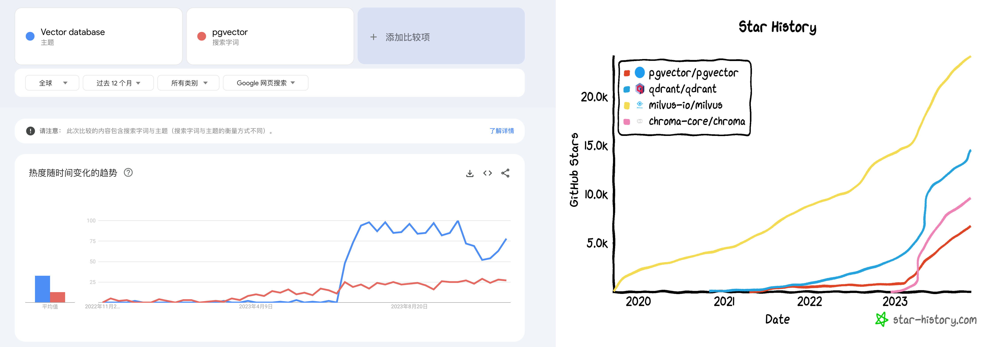
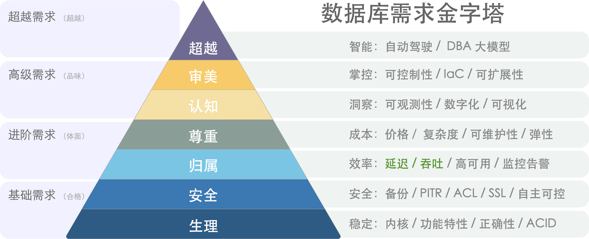
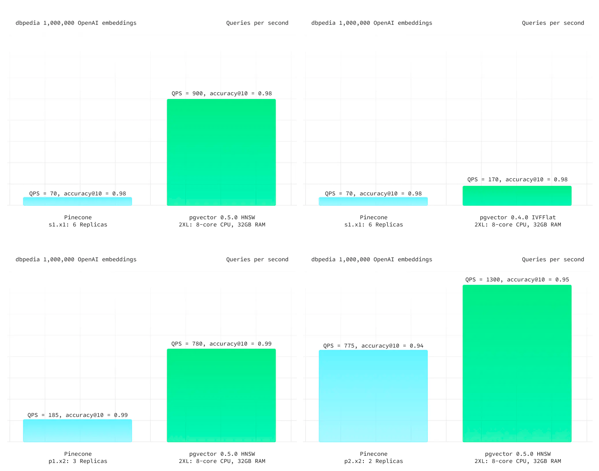

Vector storage and retrieval is a real need, but specialized vector databases are already dead. The ecological niche left for specialized vector databases might support one company's survival, but trying to build an industry around AI stories is impossible.

------

## How Did Vector Databases Get Hot?

Specialized vector databases appeared years ago, like Milvus, mainly targeting unstructured multimodal data retrieval. For example, image-to-image search (photo shopping), audio-to-audio search (Shazam), video-to-video search needs. PostgreSQL ecosystem plugins like pgvector and pase can also handle these tasks. Overall, it was a niche need that remained lukewarm.

But OpenAI/ChatGPT changed everything: large models can understand various forms of text/images/audio-video and uniformly encode them into same-dimensional vectors, and vector databases can store and retrieve these AI large model outputs — **Embeddings** "[Large Models and Vector Databases](https://mp.weixin.qq.com/s/R4jp1uTCiLOLGsiADZ9jxQ)".

More specifically, the key moment vector databases exploded was March 23 this year, when OpenAI recommended using a vector database in their released [chatgpt-retrieval-plugin](https://github.com/openai/chatgpt-retrieval-plugin) project for adding "long-term memory" capability when writing ChatGPT plugins. Then we can see that whether in Google Trends searches or GitHub Stars, all vector database projects' attention took off from that time point.

> Google Trends and GitHub Stars

Meanwhile, after being quiet for a while, the database field welcomed a small spring in the investment arena — "specialized vector databases" like Pinecone, Qdrant, Weaviate popped up, raising hundreds of millions, afraid of missing the AI era infrastructure express train.

> Vector Database Ecosystem Landscape

But these violent celebrations will eventually end in violent collapse. This cooldown came faster than expected — in less than half a year, the situation turned upside down. Now except for some second-tier cloud vendors catching the late train still pushing soft articles, nobody talks about specialized vector databases anymore.

> How far is the specialized vector database myth from collapse?

------

## Are Vector Databases a False Need?

We can't help but ask: are vector databases a false need? The answer is: vector storage and retrieval is a real need that will rise with AI development and has a bright future. But this has nothing to do with specialized vector databases — classic databases with vector extensions will become the absolute mainstream, and **specialized vector databases are a false need**.

Specialized vector databases like Pinecone, Weaviate, Qdrant, Chroma initially appeared as workarounds to solve ChatGPT's insufficient memory capability — the initially released ChatGPT 3.5 had only a 4K token context window, less than two thousand Chinese characters. However, current GPT 4's context window has grown to 128K, expanded 32 times, enough to fit an entire novel — and will grow even larger in the future. At this point, the stopgap solution — vector database SaaS — is in an awkward position.

More deadly is the new feature OpenAI released at their first developer conference in November — GPTs. For typical small-to-medium knowledge base scenarios, OpenAI has already packaged "memory" and "knowledge base" functionality for you. You don't need to mess with vector databases — just upload knowledge files, write prompts to tell GPT how to use them, and you can develop an Agent. Although current knowledge base size is limited to tens of MB, this is sufficient for many scenarios, and the upper limit still has huge room for improvement.

> GPTs bring AI usability to a whole new level

Open source large models like Llama and private deployment scored one back for vector databases — however, this demand was captured by classic databases with vector functionality — led by PostgreSQL's PGVector extension, with other databases like Redis, ElasticSearch, ClickHouse, Cassandra following close behind. Ultimately, vectors and vector retrieval are a new data type and query processing method, not a completely new fundamental data processing approach. Adding a new data type and index isn't complex for well-designed existing database systems.

> Local private deployment RAG architecture

The bigger problem is that while databases are high-threshold work, the "vector" part has essentially no technical barriers. Mature open source libraries like FAISS and SCANN already solve this problem perfectly. For large companies with sufficiently large and complex scenarios, their engineers can effortlessly implement such needs using open source libraries — even less reason to use a specialized vector database.

Therefore, specialized vector databases are trapped in a dead end: small needs are solved by OpenAI directly, standard needs are captured by existing mature databases with vector extensions, and supporting ultra-large needs has almost no barriers, more likely requiring model fine-tuning. The ecological niche left for specialized vector databases might support one specialized vector database kernel vendor's survival, but building an industry is impossible.

------

## General Databases vs Specialized Databases

**A qualified vector database must first be a qualified database**. But databases are quite a high-threshold field, and achieving this from scratch isn't easy. After reading documentation for all specialized vector databases on the market, only Milvus barely qualifies as a "database" — at least its documentation includes sections on backup/recovery/high availability. Other specialized vector databases' designs, judging from documentation, can basically be viewed as insults to the professional field of "databases".

The essential complexity difference between "vectors" and "databases" is night and day. Taking the world's most popular PostgreSQL database kernel as an example, it's written in millions of lines of C code, solving the "database" problem. However, the PostgreSQL-based vector database extension `pgvector` uses less than two thousand lines of C code to solve vector storage and retrieval problems. This roughly quantifies the complexity threshold of "vectors" relative to "databases": **one ten-thousandth**.

> Including ecosystem extensions makes the comparison even more stunning

This also illustrates vector databases' problem from another angle — the "vector" part's threshold is too low. Array data structures, sorting algorithms, and dot product calculation between two vectors are general knowledge taught in freshman year. Any moderately clever undergraduate has sufficient knowledge to implement such a so-called "specialized vector database" — hard to say this programming homework, LeetCode easy-level stuff has any technical barriers.

Relational databases have developed to be quite mature today — supporting various data types: integers, floats, strings, etc. If someone says they want to reinvent a new specialized database, with the selling point of supporting a "new" data type — **float arrays** — core functionality being calculating distances between two arrays and finding the minimum from the library, while the cost is that almost no other database work can be done, then any experienced user or engineer would think — is this person mentally ill?

> Database Demand Pyramid: Performance is just one selection consideration

In most cases, specialized vector databases' disadvantages far outweigh advantages: data redundancy, massive unnecessary data movement work, lack of consistency between distributed components, additional professional skill complexity costs, learning costs and labor costs, additional software licensing fees, extremely limited query language capabilities, programmability, extensibility, limited toolchains, and worse data integrity and availability compared to real databases. The only benefit users can usually expect is **performance** — response time or throughput, but this sole "advantage" quickly becomes invalid...

------

## Case PvP: pgvector vs pinecone

Abstract theoretical analysis isn't as convincing as actual cases, so let's look at a specific comparison: pgvector vs pinecone. The former is a PostgreSQL-based vector extension aggressively capturing territory in the vector database ecological niche; the latter is a specialized vector database SaaS, listed first in OpenAI's initial specialized vector database recommendations — both can be said to be the most typical representatives of general databases vs specialized databases.

On Pinecone's official website, Pinecone's main highlighted features are: "high performance, easier to use". First, let's look at the **high performance** that specialized vector databases pride themselves on. Supabase provided a latest [test case](https://supabase.com/blog/pgvector-vs-pinecone) using DBPedia from ANN Benchmark as the benchmark — a dataset of one million OpenAI 1536-dimensional vectors. At the same recall rate, PGVector had better latency performance and overall throughput, and much cheaper costs. Even the old IVFFLAT index performed better than Pinecone.

> Results from Supabase - DBPedia tests

Although specialized vector database Pinecone performs worse, honestly: **vector database performance doesn't really matter** — to the extent that 100% accurate brute force full-table scan KNN is sometimes a viable option in production. Moreover, vector databases need to work with models, and when large model API response times are in hundreds of milliseconds to seconds, optimizing vector retrieval time from 10ms to 1ms brings no user experience benefits. With universal HNSW indexing, scalability is unlikely to be a problem — semantic search belongs to read-heavy scenarios. If you need higher QPS throughput, adding more machines/replicas works. As for saving several times resources, given common business scales and current resource costs, compared to model inference costs, it's not even pocket change.

In terms of usability, whether specialized Python APIs or general SQL interfaces are more usable is subjective — the real fatal problem is that many semantic retrieval scenarios need additional fields and computation logic to further filter and process vector retrieval recall results — hybrid retrieval. This metadata is often stored in a relational database as the Source of Truth. Pinecone does allow you to attach up to 40KB metadata per vector, but users must maintain this themselves. API-based design turns specialized vector databases into scalability and maintainability hell — if you need additional queries to the main data source to complete this, why not directly implement it in the main relational database with unified SQL in one step?

As a database, Pinecone also lacks various basic capabilities databases should have, like: backup/recovery/high availability, batch update/query operations, transactions/ACID. Besides basic API calls, there are no more reliable data synchronization mechanisms with upstream data sources. Cannot real-time trade off between recall and response speed through parameters — besides changing Pod types to choose among three accuracy tiers, there's no other option — you can't even achieve 100% accuracy through brute force full search because Pinecone doesn't provide exact KNN option!

It's not just Pinecone — other specialized vector databases except Milvus are basically similar. Of course, some users argue that comparing SaaS with database software isn't fair. This isn't a problem — major cloud vendors' RDS for PostgreSQL already provide PGVector extensions, and there are SaaS/Serverless services like Neon/Supabase and self-built distributions like [Pigsty](https://pigsty.cc). If you can use a more functional, better performing, more stable and secure general vector database at much lower cost, why spend big money and time struggling with a "specialized vector database" with no advantages? Users who figured this out have already migrated from pinecone to pgvector — "[Why We Replaced Pinecone with PGVector](https://medium.com/@jeffreyip54/why-we-replaced-pinecone-with-pgvector-2f679d253eba)"

------

## Summary

Vector storage and retrieval is a real need that will rise with AI development and has a bright future — [vectors will become AI era's JSON](https://mp.weixin.qq.com/s/BJkbtwl_SPx99GBOzPsJiA). But there's not much room left for specialized vector databases — leading databases like PostgreSQL effortlessly added vector functionality and steamrolled specialized vector databases with overwhelming advantages. The ecological niche left for specialized vector databases might support one company's survival, but trying to build an industry around AI stories is impossible.

Specialized vector databases are indeed dead. I hope readers don't take detours struggling with these things with no future.