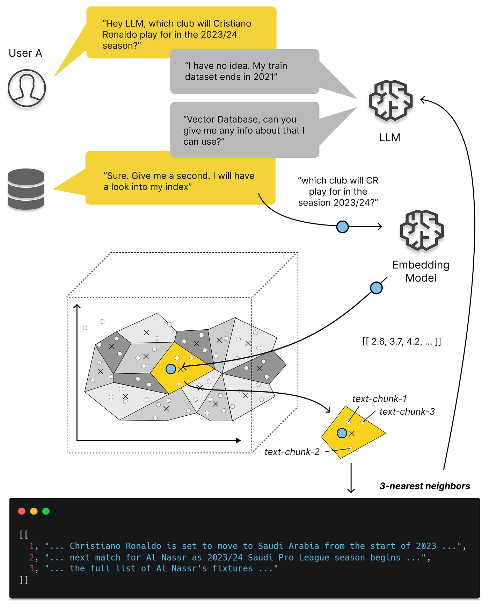
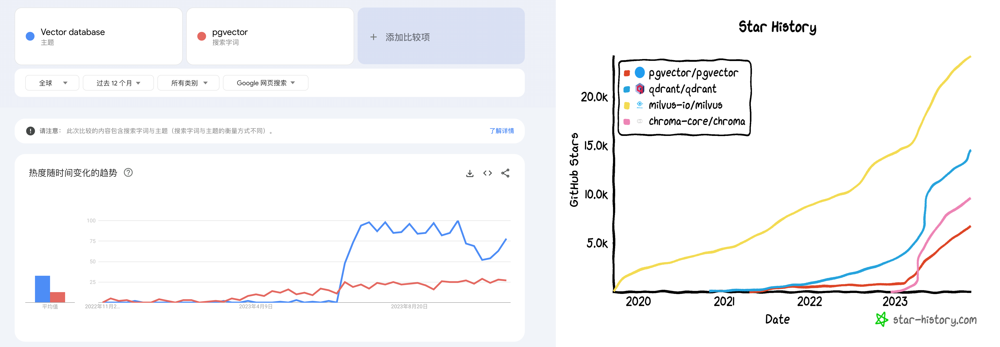
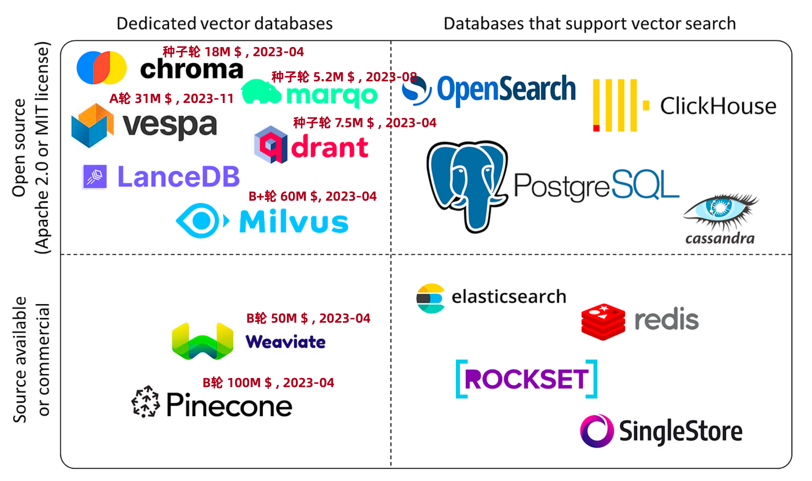
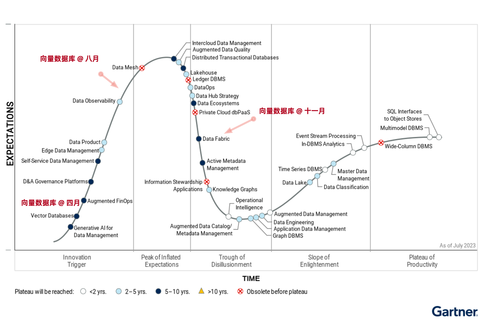
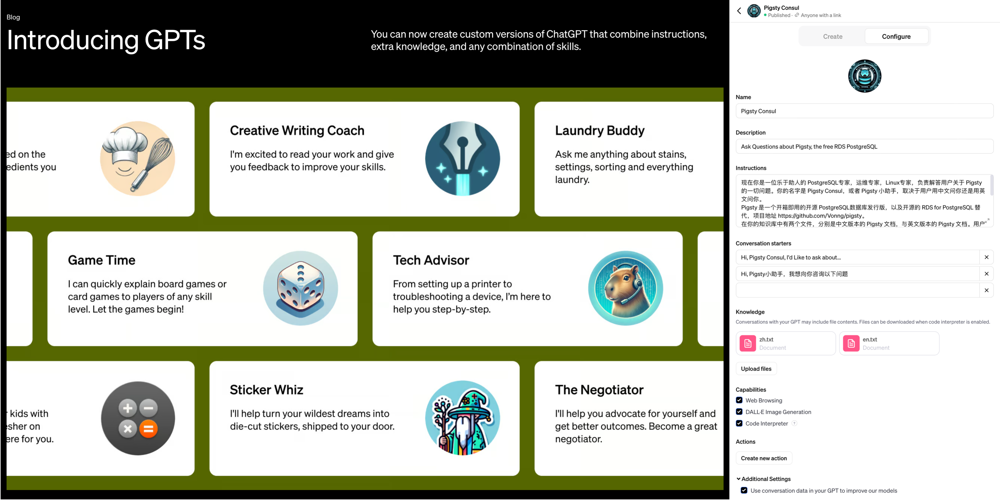
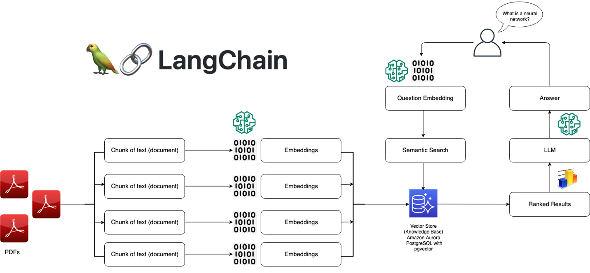
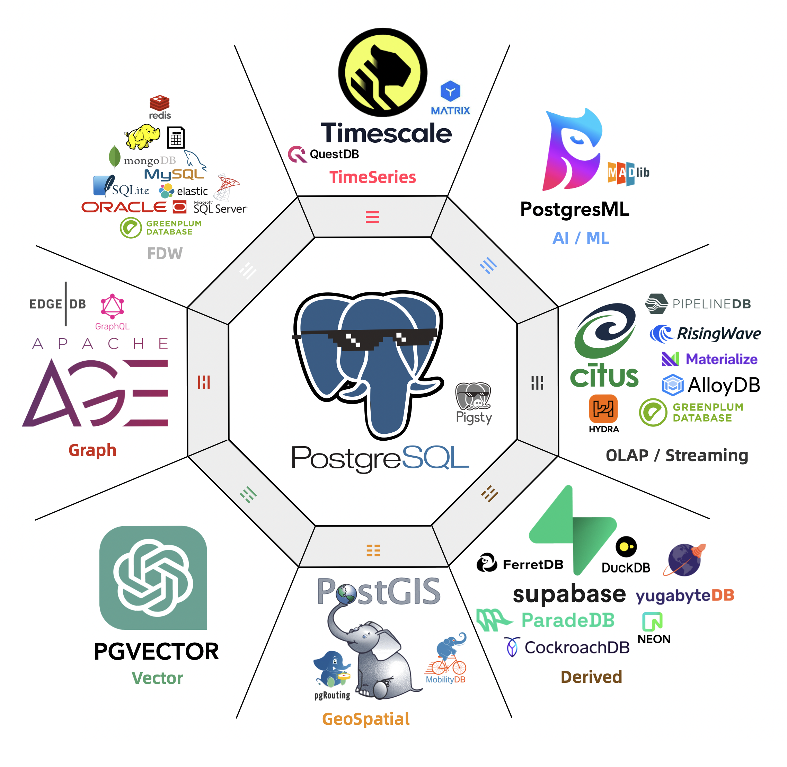
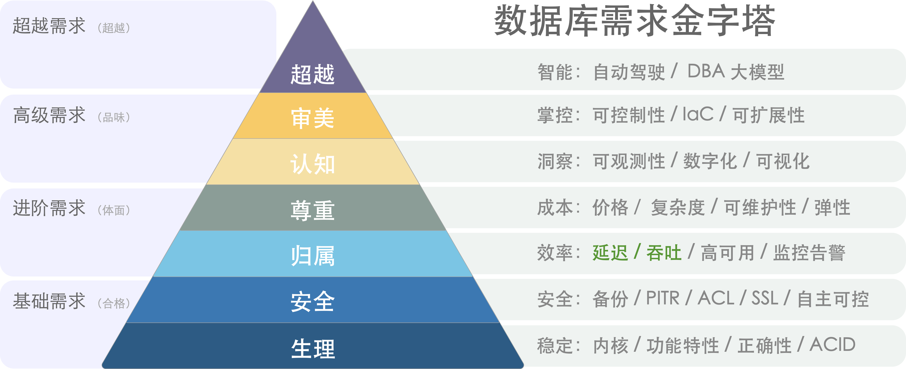
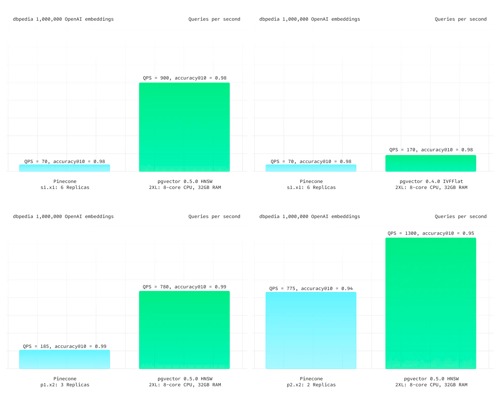
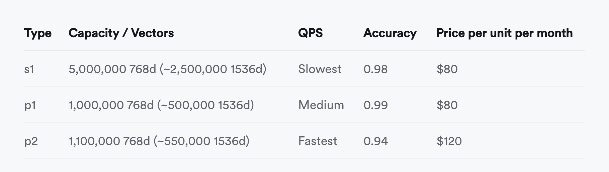

向量存储检索是个真需求，然而专用向量数据库已经凉了。留给专用向量数据库的生态位也许能支持一家专用向量数据库存活，但想靠讲AI故事来整活，做成一个产业已经是不可能了。

------

## 向量数据库是怎么火起来的？

专用向量数据库早在几年前就出现了，比如 Milvus，主要针对的是非结构化多模态数据的检索。例如以图搜图（拍立淘），以音搜音（Shazam），用视频搜视频这类需求；PostgreSQL 生态的 pgvector，pase 等插件也可以干这些事。总的来说，算是个小众需求，一直不温不火。

但 OpenAI / ChatGPT 的出现改变了这一切：大模型可以理解各种形式的文本/图片/音视频，并统一编码为同一维度的向量，而向量数据库便可以用来存储与检索这些AI大模型的输出 —— **Embedding**《[大模型与向量数据库](https://mp.weixin.qq.com/s/R4jp1uTCiLOLGsiADZ9jxQ)》。

更具体讲，向量数据库爆火的关键节点是今年3月23日，OpenAI 在其发布的 [chatgpt-retrieval-plugin](https://github.com/openai/chatgpt-retrieval-plugin) 项目中推荐使用一个向量数据库，在写 ChatGPT 插件时为其添加“长期记忆”能力。然后我们可以看到，无论是 Google Trends 热搜，还是 Github Star 上，所有向量数据库项目的关注度都从那个时间节点开始起飞了。

> Google Trends 与 GitHub Star

与此同时，数据库领域在投资领域沉寂了一段时间后，又迎来了一波小阳春 —— Pinecone，Qdrant，Weaviate 诸如此类的“专用向量数据库” 冒了出来，几亿几亿的融钱，生怕错过了这趟 AI 时代的基础设施快车。

> 向量数据库生态全景图

但是，这些暴烈地狂欢也终将以暴烈的崩塌收场。这一次茶凉的比较快，半年不到的时间，形势就翻天覆地了 —— 现在除了某些二流云厂商赶了个晚集还在发软文叫卖，已经听不到谁还在炒专用向量数据库这个冷饭了。

> 专用向量数据库神话的破灭还有多远？

------

## 向量数据库是一个伪需求吗？

我们不禁要问，向量数据库是一个伪需求吗？答案是：向量的存储与检索是真实需求，而且会随着AI发展水涨船高，前途光明。但这和专用的向量数据库并没有关系 —— 加装向量扩展的经典数据库会成为绝对主流，而**专用的向量数据库是一个伪需求**。

类似 Pinecone，Weaviate，Qdrant，Chroma 这样的专用向量数据库最初是为了解决 ChatGPT 的记忆能力不足而出现的 Workaround —— 最发布的 ChatGPT 3.5 的上下文窗口只有 4K Token，也就是不到两千个汉字。然而当下 GPT 4 的上下文窗口已经发展到了 128K，扩大了32倍，足够塞进一整篇小说了 —— 而且未来还会更大。这时候，用作临时周转的垫脚石 —— 向量数据库 SaaS 就处在一个尴尬的位置上了。

更致命的是 OpenAI 在今年11月首次开发者大会上发布的新功能 —— GPTs，对于典型的中小知识库场景，OpenAI 已经替你封装好了 “记忆” 与 “知识库” 的功能。你不需要折腾什么向量数据库，只要把知识文件上传上去写好提示词告诉 GPT 怎么用，你就可以开发出一个 Agent 来。尽管目前知识库的大小仅限于几十MB，但这对于很多场景都绰绰有余，而且上限仍有巨大提升空间。

> GPTs 将 AI 的易用性提高到一个全新的层次

像 Llama 这样的开源大模型与私有化部署为向量数据库扳回一局 —— 然而，这一部分需求却被加装了向量功能的经典数据库占领了 —— 以 PostgreSQL 上的 PGVector 扩展为先锋代表，其他数据库如 Redis，ElasticSearch， ClickHouse， Cassandra 也紧随其后不甘示弱。说到底，向量与向量检索是一种新的数据类型和查询处理方法，而不是一种全新的基础性数据处理方式。加装一种新的数据类型与索引，对设计良好的现有数据库系统来说并不是什么复杂的事情。

> 本地私有化部署的 RAG 架构

更大的问题在于，尽管数据库是一件门槛很高的事，但“向量”部分可以说没有任何技术门槛，而且诸如 FAISS 和 SCANN 这样的成熟开源库已经足够完美地解决这个问题了。对于有足够大规模足够复杂的场景的大厂来说，自家工程师可以不费吹灰之力地使用开源库实现这类需求，更犯不上用一个专用向量数据库了。

因此，专用向量数据库陷入了一个死局之中：小需求 OpenAI 亲自下场解决了，标准需求被加装向量扩展的现有成熟数据库抢占，支持超大型需求也几乎没什么门槛，更多可能还要靠模型微调。留给专用向量数据库的生态位也许能足以支持一家专用向量数据库内核厂商活下来，但想做成一个产业是不可能了。

------

## 通用数据库 vs 专用数据库

**一个合格的向量数据库，首先得是一个合格的数据库**。但是数据库是一个相当有门槛的领域，从零开始做到这一点并不容易。我通读了市面上专用向量数据库的文档，能勉强配得上“数据库”称呼的只有一个 Milvus —— 至少它的文档里还有关于备份 / 恢复 / 高可用的部分。其他专用向量数据库的设计，从文档上看基本可以视作对“数据库”这个专业领域的侮辱。

“向量”与“数据库”这两个问题的本质复杂度有着天差地别的区别，以世界上最流行的 PostgreSQL 数据库内核为例，它由上百万行C语言代码编写而成，解决“数据库”这个问题；然而基于 PostgreSQL 的向量数据库扩展 `pgvector` 只用了不到两千行不到的 C 代码，就解决了“向量”存储与检索的问题。这是对“向量”相对于与“数据库”这件事复杂度门槛的一个粗略量化：**万分之一**。

> 如果算上生态扩展，对比就更惊人了。

这也从另一个角度说明了向量数据库的问题 —— “向量”部分的门槛太低。数组数据结构，排序算法，以及两个向量求点积这三个知识点是大一就会讲的通识，稍微机灵点的本科生就拥有足够的知识来实现这样一个所谓的“专用向量数据库”，很难说这种编程大作业，LeetCode 简单题级别的东西有什么技术门槛 。

关系型数据库发展到今天已经相当完善了 —— 它支持各种各样的数据类型，整型，浮点数，字符串，等等等等。如果有人说要重新发明一种新的专用数据库来用，其卖点是支持一种“新的”数据类型 —— **浮点数组**，核心功能是计算两个数组的距离并从库中找出最小者，而代价是其他的数据库活计几乎都没法整了，那么稍有经验的用户和工程师都会觉得 —— 这人莫不是得了失心疯？

> 数据库需求金字塔：性能只是选型考量之一。

在绝大多数情况下，使用专用向量数据库的弊都要远远大于利：数据冗余、 大量不必要的数据搬运工作、分布式组件之间缺乏一致性、额外的专业技能带来的复杂度成本、学习成本、以及人力成本、 额外的软件许可费用、极其有限的查询语言能力、可编程性、可扩展性、有限的工具链、以及与真正数据库相比更差的数据完整性和可用性。用户唯一能够期待的收益通常是**性能** —— 响应时间或吞吐量，然而这个仅存的“优点”很快也不再成立了…

------

## 案例PvP：pgvector vs pinecone

抽象的理论分析不如实际的案例更有说服力，因此让我们来看一对具体的对比：pgvector 与 pinecone。前者是基于 PostgreSQL 的向量扩展，正在向量数据库生态位中疯狂攻城略地；后者是专用向量数据库 SaaS，列于 OpenAI 首批专用向量库推荐列表首位 —— 两者可以说是通用数据库与专用数据库中最典型的代表。

在 Pinecone 的官方网站上，Pinecone 提出的主要亮点特性是：“高性能，更易用”。首先来看专用向量数据库引以为豪的**高性能**。Supabase 给出了一个最新的[测试案例](https://supabase.com/blog/pgvector-vs-pinecone)，以 ANN Benchmark 中的 DBPedia 作为基准，这是由一百万个 OpenAI 1536 维向量组成的数据集。在相同的召回率下，PGVector 都有着更佳的延迟表现与总体吞吐，而且成本上要便宜得多。即使是老版本的 IVFFLAT 索引，都比 Pinecone 表现更好。

> 来自 Supabase - DBPedia 的测试结果

尽管专用向量数据库 Pinecone 的性能更烂，但说实话：**向量数据库的性能其实根本就不重要** —— 以致于生产上 100% 精确的全表暴力扫描 KNN 有时候都是一种切实可行的选项。更何况向量数据库需要与模型搭配使用，当大模型 API 的响应时间在百毫秒 ～ 秒级时，把向量检索的时间从 10ms 优化到 1ms 并不能带来任何用户体验上的收益。在全员HNSW索引的情况下，可伸缩性也几乎不可能成为问题 —— 语义搜索属于读远多于写的场景，如果你需要更高的 QPS 吞吐量，增配/拖从库就可以了。至于节省几倍资源这种事，以常见业务的规模与当下的资源成本来看，相比模型推理的开销只能说连三瓜两枣都算不上了。

在易用性上，专用的 Python API 还是通用的 SQL Interface 更易用，这种事见仁见智 —— 真正的致命问题在于，许多语义检索场景都需要使用一些额外的字段与计算逻辑，来对向量检索召回的结果进行进一步的筛选与处理，即 —— 混合检索。而这些元数据往往保存在一个关系数据库里作为 Source of Truth。Pinecone 确实允许你为每个向量附加不超过 40KB 的元数据，但这件事需要用户自己来维护，基于API的设计会将专用向量数据库变成可扩展性与可维护性的地狱 —— 如果你需要对主数据源进行额外的查询来完成这一点，那为啥不在主关系库上直接以统一的 SQL 一步到位直接实现呢？

作为一个数据库，Pinecone 还缺乏各种数据库应该具备的基础性能力，例如：备份/恢复/高可用、批量更新/查询操作，事务/ACID；此外，除了俭朴的 API Call 之外没有与上游数据源更可靠的数据同步机制。无法实时在召回率与响应速度之间通过参数来进行利弊权衡 —— 除了更改 Pod 类型在三档准确性中选择之外别无他法 —— 你甚至不能通过暴力全表搜索达到 100% 精确度 ，因为 Pinecone 不提供精确 KNN 这个选项！

并不只有 Pinecone 是这样，除了 Milvus 之外的其他几个专用向量数据库也基本类似。当然也有用户会抗辩说一个 SaaS 如何与数据库软件做对比，这并不是一个问题，各家云厂商的 RDS for PostgreSQL 都已经提供了 PGVector 扩展，也有诸如 Neon / Supabase 这样的 Serverless / SaaS 和 [Pigsty](https://pigsty.cc) 这样的自建发行版。如果你可以用低的多的成本，拥有功能更强，性能更好，稳定性安全性更扎实的通用向量数据库，那么又为什么要花大价钱与大把时间去折腾一个没有任何优势的 “专用向量数据库”？想明白这一点的用户已经从 pinecone 向 pgvector 迁移了 —— 《[为什么我们用 PGVector 替换了 Pinecone](https://medium.com/@jeffreyip54/why-we-replaced-pinecone-with-pgvector-2f679d253eba)》

------

## 小结

向量的存储与检索是一个真实需求，而且会随着AI发展水涨船高，前途光明 —— [向量将成为AI时代的JSON](https://mp.weixin.qq.com/s/BJkbtwl_SPx99GBOzPsJiA)；但这里并没有多少位置留给专用的向量数据库 —— 诸如 PostgreSQL 这样的头部数据库毫不费力的加装了向量功能，并以压倒性的优势从专用向量数据库身上碾过。留给专用向量数据库的生态位也许能支持一家专用向量数据库存活，但想靠讲AI故事来整活，做成一个产业已经是不可能了。

专用向量数据库确实已经凉掉了，希望读者也不要再走弯路，折腾这些没有前途的东西了。
