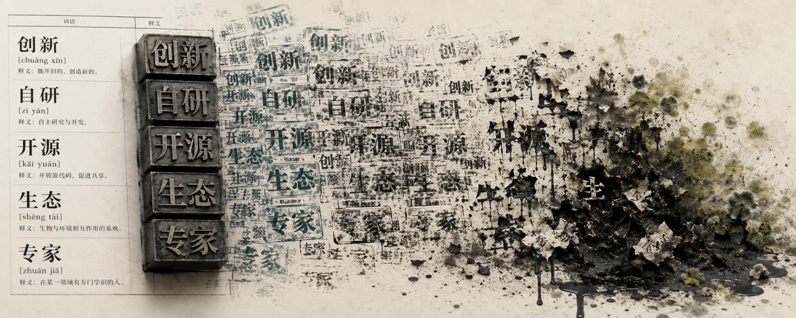

> A brief history of credibility inflation in China's tech industry

---

## Introduction

The phrase “far, far ahead” can no longer be used with a straight face.

Put it in a technical document or a serious review, and readers will laugh. The phrase was used, overused, and finally inverted into its own antonym. Today, when people hear it, their first thought is: this thing probably isn't very good.

Turning praise into a universally understood taunt is a rare achievement. The last time the Chinese language pulled off the same trick may have been with the word “expert.”

But if you think this was an isolated linguistic accident, you underestimate the scale of the damage.

“Homegrown” is dead. “Innovation” is dead. “Domestic” is on life support. “Open source” means something different here than it does almost anywhere else. “Ecosystem” has become a euphemism for lock-in. Even “engineer” is starting to sound shopworn.

This was no accident. It was systemic credibility inflation.

Every bout of inflation has an issuance sequence and a division of blame: a first mover and a final escalator. This essay tries to sort out that order. Lumping them together as “all the same” would be the last—and most avoidable—loss in this bankruptcy.

---

## I. Inventing the Grammar

First, credit where it is due.

More than a decade ago, the first company really did [remove the minicomputers, databases, and storage arrays of three foreign vendors from its data centers](https://www.alibabacloud.com/help/en/polardb/polardb-for-xscale/polardb-x-history), replacing them with piles of cheap x86 machines and an in-house scheduler. It worked. The internal fights, the wave of resignations, the technical lead branded a fraud, and the battle to build a single 5,000-machine cluster were all real. China's first generation of cloud engineers largely came out of that effort.

But notice another choice the company made.

Technically, this was an architectural transition: from scale-up to scale-out, from buying expensive integrated machines to using software that tolerated failures in commodity hardware. The same shift was happening worldwide. Several Silicon Valley companies took the same path; they simply did not give it a slogan.

The first company wrapped it in a nationalist story instead.

It was not “we adopted a cheaper architecture.” It was “we drove out the foreigners.”

Why that framing? Because it sold better—to customers, officials, the press, and employees. Recast a dull architecture migration as a war of liberation, and overtime gains meaning, budgets gain justification, and promotion reviews gain grandeur.

That was where the grammar of the Chinese IT industry's “[homegrown technology narrative](/en/db/sovereign-dbos/)” was written. From then on, a technical choice first had to be translated into a question of political allegiance before it deserved the stage.

Interestingly, the first company still drew a line inside the grammar it had invented.

The name of one database product openly identified its open-source kernel. Its [documentation and source repository](https://github.com/polardb/PolarDB-for-PostgreSQL), along with its papers, generally stated its starting point, its changes, and the upstream version with which it remained compatible. Anyone in the industry could determine [which open-source project its analytical product had forked](https://www.alibabacloud.com/en/notice/rds0422); the company did not deny the debt.

One fact deserves unqualified recognition: it also spent a decade building a [distributed database](https://www.oceanbase.com/product/oceanbase-database) from scratch, with no ancestry in an open-source kernel. That achievement is real. China has produced few genuinely original database systems in recent years; this is one of them.

Its posture at the time was roughly: I may boast, but I will not deny whose shoulders I stand on.

That is not a high bar. Only later did the company discover that, in this market, even that bar was a fatal competitive liability.

---

## II. Removing the Floor

The real turning point was not that the first company went bad. It was that someone showed the entire industry the floor could be removed.

In the same market, the second company's flagship database had a [publicly traceable lineage to a three-decade-old open-source project](https://opengauss.org/zh/blogs/July/openGauss%E6%95%B0%E6%8D%AE%E4%B8%8EPostgreSQL%E7%9A%84%E5%B7%AE%E5%BC%82%E5%AF%B9%E6%AF%94.html), specifically a branch from more than a decade ago. That is entirely legal. The project's [license](https://www.postgresql.org/about/licence/) is extremely permissive: anyone may turn the code into a proprietary commercial product. Companies around the world do it. There is no shame in that.

The problem was the next step: erasing the lineage, then calling the result “purebred.”

### On the Word “Purebred”

Calling a software product “purebred” is an unusually bad idea, even by the standards of human language.

Blood purity is a doctrine for policing people, not describing code. Since the first day of software engineering, progress has depended on using other people's work, standing on their shoulders, and refusing to rebuild everything from zero. An engineer boasting of pure lineage is like a chef bragging that he has never read anyone else's recipe.

Calling a product derived from a decade-old open-source release “purebred” is no longer marketing. It is performance art.

One point must be absolutely clear, because it is the foundation of this critique: using open-source code was never the problem. Open source exists to be used. Every major technology company in the world uses it, and none should be embarrassed.

The disgrace lies elsewhere. Normally, you acknowledge the debt, contribute your changes upstream, and state your starting point on the first page of the documentation. This company erased the source, then took the scrubbed product to apply for state programs, collect subsidies, win awards, and hold a lavishly staged launch event telling 1.4 billion people, “We broke the blockade.”

It did not steal the code; the code was free to take. It stole the credibility of the word “independent.”

That credibility belonged to the entire industry. Once one company maxed out the shared line of credit, nobody believed the people who were actually tackling hard problems and doing original work.

### Adjective Inflation

Once the floor was gone, all that remained was to print money.

The first time someone says “world's best,” people believe it. The second time, they hesitate. By the fiftieth repetition—every generation of phone is the world's best, every car is the best car, every feature has an insurmountable lead, every launch is the strongest in history—the phrase is worthless.

[“The best SUV under RMB 5 million.”](https://weibo.com/ttarticle/p/show?id=2309404918270099850156) Later it became “the best SUV under RMB 10 million.”

What makes this construction so ingenious is that it cannot be falsified. It never defines “best,” names a dimension of comparison, supplies a verifiable number, or specifies a reproducible test. It is not a proposition but an incantation. You cannot refute an incantation; you can only chant it or refuse.

At least a central bank knows when it is printing money and who will bear the consequences. Here, no such awareness exists. The issuer does not pay for the inflation. Everyone who still wants to speak precisely does.

### When the Comedy Became Something Else

The standard defense is ready-made: he is an entrepreneur, and he has products to sell. Who doesn't exaggerate a little?

If the exaggeration concerns a phone benchmark, fair enough. Buyers take their chances and, at worst, curse the purchase when they get home.

The problem is that he later moved exactly the same verbal machinery into a system carrying an entire family down the highway at 120 km/h.

Those cases are separated by an entire moral category, not merely an industry. Cross the line between marketing copy and specifications for a phone, and it is hype. Cross it for a driver-assistance system, and someone may actually take their hands off the wheel. Yet he described both with the same sentence structure, the same tone, and the same phrase.

A phone vendor repeating “far, far ahead” is comedy. A car vendor doing it belongs to another genre.

### He Knows Better, Which Makes It Worse

The most painful part is that he is not a sales director who never understood technology.

He built real things. He worked on wireless systems and base stations. That work was a genuine, original engineering contribution, tested in hard-fought competition in Europe. From that position, he must know what real data looks like. He knows how a metric must be defined, what test conditions are, what a confidence interval means, and what the qualifier “under specific conditions” is for.

That is why every claim of being “far, far ahead” is a knowing choice.

When someone with no engineering training talks this way, it may be forgivable ignorance. When someone who has written test reports does it, he is cashing in the engineering credibility he spent half a lifetime accumulating—and spending it all at once, while maxing out the entire industry's line of credit.

Ignorance is a defect. Knowing better and doing it anyway is a choice.

### The Most Ruthless Move: Welding Shut Every Path to Falsification

Had the story ended there, it would merely be about someone who boasted more aggressively than his peers. The real dividing line came next.

He encased the rhetoric in a shell that could not be pried off.

Challenge a claimed metric, and patriots—not product managers—appear. Ask for the test conditions, and commenters ask who paid you. Run a [clean comparative test](/en/db/car-autopilot-test/), and the next day someone starts investigating your finances.

The technical checks that should have come from reviewers, users, and peers were shut down wholesale.

He did not merely lie. He welded shut every channel that could disprove his claims.

That is what made the tactic so potent. An ordinary braggart fears exposure; he made the act of exposing a claim politically suspect. Before challenging him, you must prepare to have your loyalties put on trial.

A technical purchasing decision thus became a loyalty test. In a normal market, buyers ask: How fast is it? How reliable? Who is accountable when it fails? Can I migrate away in five years? In this arena, ask any of those questions and someone immediately answers for you: Why don't you support domestic technology?

The ugliest part of this move is that it permanently disabled the industry's most valuable capability: the ability to tell the truth.

### One Small Detail

One detail best shows that this is no longer strategy, but instinct.

The boss personally signed a directive saying the company would not build cars. It was there in black and white, with a five-year validity period. Yet its logo crept onto the cars inch by inch, and the marketing language gradually turned them into “our cars”—until someone stopped it, the wording changed, and the cycle began again.

Boasting to outsiders is unremarkable; the job may demand it. Trying the same trick on a document signed by your own boss is something else.

---

## III. The Prisoner's Dilemma

Now the third company enters the story.

A popular account says this company began innocent, was forced by a dirty rival to fight dirty, and eventually became dirty itself: it stared into the abyss, and the abyss stared back. It sounds beautifully tragic.

The only problem is that just one-third of it is true.

Strip away the nostalgia and look at the company's best years. What was its real weapon? Not chips, camera algorithms, or an operating system. It was the ability to turn a specification sheet into a story—and blanket every county in China with that story at vanishingly low cost.

Slide after slide of comparisons, benchmark scores, teardown photos, BOM cost breakdowns, and “honest pricing”: the third company brought that grammar to China's consumer electronics industry. Before then, the industry was still filming long-haired women running along beaches.

What mattered was that the blade struck the right targets in those years: knockoff phones, inflated price premiums, and three layers of channel markup. The same craft therefore looked virtuous. Transparent specifications were good. Published costs were good. Selling an RMB 800 product for RMB 800 was good.

The craft did not change. The target simply shifted from excess profit to consumer expectations.

What does someone with 15 years of marketing experience do when entering a high-end market without a generational technical lead? He uses his greatest strength. No abyss is required; it is instinct.

And who popularized the launches people now despise—screens full of specifications, endless rival comparisons, “world's best” and “industry firsts” on every page, benchmark screenshots presented as evidence? It was not the opponent. It was the third company. The second company later upgraded the grammar with unfalsifiable modifiers and a political shell that made questions unacceptable, but the launch grammar itself came from the third.

So this is not a good person corrupted by a bad one. It is the inventor of the gun discovering that someone else has a bigger gun.

The earliest criticism of the third company was not something it learned, either. It announced a dream price, then kept the product unavailable. Scalpers charged premiums; F-codes, the company's purchase invitations, proliferated. The defense was that production needed time to ramp up. Fine. If you cannot buy a phone, wait three months or buy something else.

Now translate the same behavior to cars: tens of thousands of firm orders in three minutes; numbers so photogenic they seem to be the product; deposits that become nonrefundable after a short window; configurations frozen once the order is locked; delivery dates a year away; order slots resold at premiums.

The tactic is identical, but the purchase has gone from RMB 2,000 to RMB 200,000. The moral weight is completely different. Scarcity marketing for a phone is a game; play at your own risk. Scarcity marketing for a car locks up real money and turns an irrevocable commitment into the thrill of “winning” the chance to buy.

So what was truly contaminated?

Something was, and it was fatal: not the products or the pricing, but the nature of the user base.

The company's most valuable asset was never that people loved it. It was that they criticized it to its face. The operating system shipped weekly updates. Forums filled with thousands of complaints. People who filed bugs were invited into beta testing, and product managers replied to posts one by one. That was genuinely remarkable: the company turned its most demanding critics into scouts for its own R&D. In its old slogan “made for enthusiasts,” *enthusiast* meant knowledgeable, exacting, and hard to please.

What about today? The same users now spend their time fighting the rival camp in comment sections, explaining away negative reviews, and running every discussion of a product defect through a loyalty check.

Co-creators became bodyguards. That part was learned, and learned quickly.

Here I accept the “abyss” explanation. When a rival arms its users as an online militia, refusing to do the same means absorbing attacks unilaterally. This is a prisoner's dilemma, not entirely moral decay.

But only here. The third company walked into another trap by itself: once its founder became the most important SKU in the product line, any candid admission ceased to be merely an admission of a product defect. Each admission cut into a carefully maintained persona. The psychological cost of correcting an error rose sharply, and problems that belonged at the engineering layer were elevated into the narrative layer.

One final detail says more than all the flame wars. A company that built its reputation on publishing BOM costs—on saying “look at the parts yourself”—eventually sold an [option costing more than RMB 40,000](https://weibo.com/ttarticle/p/show?id=2309405163795516358742). Its marketing implied a function; the part itself was almost entirely cosmetic.

When this came to light, the company apologized and offered compensation. Its response was fast by the standards of the domestic auto industry, and that deserves acknowledgment.

But look at the path itself. A company that conquered the market through transparent specifications was tripped by specification theater. Nobody else corrupted it. This is what happens when the same talent is pushed too far. If a company's greatest skill is making a number sound impressive, someone in a meeting will eventually calculate that the number will sell even without the substance behind it.

---

## IV. The Bill

What price did the industry pay for the combined efforts of three generations?

### 1. Honesty Became a Competitive Disadvantage

Imagine a bid evaluation.

One vendor says: our product is based on a mature open-source kernel. We have done substantial original work on disaggregated compute and storage, shared storage, and transaction optimization. Here are the papers and the source repository; inspect them yourself.

Another says: 100% independently developed. Purebred domestic technology. Foundational technology.

Which statement do you think the evaluators understand?

The first is a technical claim and requires judgment. The second is a political promise and requires only allegiance. In a market trained to hear only the second, the first no longer sounds honest. It sounds guilty: Why did you mention a foreign project? Are you not independent enough?

The company that invented the grammar was defeated by its own invention.

Its position today is absurd. It wants to say, “We have done a great deal of real work, and we never hid our sources.” Every word is true, but the line no longer sells—because that company taught the market not to listen to truth in the first place.

Nobody is easier prey for a bigger liar than a liar, because he cannot expose the bigger lie without bringing down his own.

### 2. Telling the Truth Became Too Expensive for Most

No company was forced to lie.

What happened was more subtle. You honestly announce “8% more range in this generation.” The next day's trending topic is your rival's “insurmountable lead.” Your PR director comes to you: Boss, our wording makes us sound weak. At the next launch, you too claim a “world first.”

Technology launches in China have become unwatchable. Every event unveils the strongest product ever; every event rewrites history.

Users have evolved a complete immune system. They skip “world first,” mentally knock 30% off anything described as an “insurmountable lead,” and close the page at “far, far ahead.”

That immune system was not free. The industry paid for it with its credibility.

### 3. Treating People as Consumables Became the Price of Entry

Wolf culture. “Striver” agreements. Voluntarily waiving paid vacation. Mattresses under desks. The age-35 cutoff. You have heard these phrases so often that they no longer sound wrong.

But the real damage is not that one company treated people as consumables. It made treating people as people a competitive disadvantage.

A neighboring employer might want to keep weekends free. Then he does the math: the competitor works six days, his own costs are 20% higher, and he will lose the bid. The weekends disappear. He might not want forced ranking, but the competitor cuts more ruthlessly, reports higher output per employee, and investors ask why he cannot. Forced ranking arrives.

One bad company is one company's problem. A bad company that wins becomes everyone's problem.

Remember the employee who only wanted his severance payment? He spent 251 days in detention. Once the matter could no longer be contained, the [official response](https://www.jiemian.com/article/3739520.html) was: “We support his right to take up the weapon of law and sue us.”

Read that sentence twice. That calm. That composure. That air of “our procedures are flawless.” This was not a company apologizing. It was a magistrate's office accepting a petition.

### 4. The Corruption of Software Engineering

Decades of software-engineering knowledge can be compressed into one idea: find ways for fewer people to accomplish more. Abstraction, reuse, automation, and standardization all serve that goal.

This industry demonstrated another path, and somehow made it work: pile on people.

Requirements unfinished? Add 20 people. The customer wants customization? Create a dedicated team, put it on site, and fork the code. Delivery slipping? Work weekends, New Year's Day, and the Spring Festival. One product eventually becomes 100 incompatible branches, each tethered to 30 people who can no longer afford to resign.

That is not software. It is labor outsourcing wearing a product costume. The euphemisms sound lovely: “customer-centricity,” “high-touch service,” “capability building.”

So the entire domestic software industry learned: don't build products; run projects. A product takes three years to earn money. A project can be invoiced this year. Product companies starve while project shops race from contract to contract. Ask a domestic software company with more than a decade of experience why it cannot sell a product to the world, and there is your answer.

Piling on people and racing deadlines inevitably produce their own values: ship first, make it run, fix the details later.

That may pay off when meeting one delivery milestone. If something goes wrong, fix it; the price is one all-nighter. But once that culture enters foundational components, the bill is deferred. A [core library used across the industry for more than a decade](/en/cloud/fastjson-boom/) turns up another critical vulnerability every few years, and the entire country stays up all night patching it.

The time saved by “ship first” was never saved. It was borrowed from every downstream user's security budget, with interest.

### 5. The Local Death of “Open Source”

[Open source began as a model of collaboration](/en/cloud/paradigm/): I give to you, you give to me, and together we cultivate a larger commons. Here it became a one-way valve. Upstream code flows in without limit; not a drop flows back out.

The “community” board consists of company executives. Contributors are employees. Pull requests go from one coworker to another. The roadmap is copied directly from internal OKRs. An outsider files an issue and gets no answer for three months. Submit a pull request and the reply is, “Thanks for the contribution; we already have similar plans internally.” Periodically, a lump of code is dumped from the internal repository, the version number jumps, a launch event is held, and the ecosystem is declared vibrant.

That is not open source. It is using “open source” as a marketing adjective.

The real harm comes later. Once everyone learns the trick, “open source” becomes meaningless here. Tell a customer your product is open source and the first response is no longer “then I can modify it myself,” but “so how much does the commercial edition cost?”

### 6. Postmortems Went from Public Goods to PR Crises

Failures are forgivable. Anyone who has built systems knows that anything sufficiently complex will eventually fail. The failure itself is no disgrace.

The disgrace is what follows: delete posts, throttle their reach, then issue a beautifully worded statement containing no information—no concrete timeline, no named component, no specific cause.

An incident report should be a public good for the entire industry. Engineers around the world publish detailed [postmortems](https://sre.google/sre-book/postmortem-culture/) and earn more respect for greater candor because they are giving peers lessons purchased with real money. Here, the same knowledge must be buried.

So everyone learns: never write a postmortem. A postmortem is evidence.

### 7. The Immune System Left, and the Dashboard Never Noticed

This last item is the quietest and the most lethal.

The early cloud users were developers who built systems themselves. Technical communities then contained real knowledge: failure stories, parameter tuning, and architectural rationale. Those users were demanding, difficult, and quick to complain in public—but they were the immune system. They called out problems before failures became disasters.

Today's main customer is the procurement process. Decisions run through bid documents, scoring sheets, and approved-vendor lists. The product therefore optimizes for a different target: not “pleasant for developers to use,” but “more boxes checked in the bid.” Feature lists grow while usable features shrink. Documentation reads more like a brochure and less like a manual. Every button exists in the console; half of them merely open a support ticket.

Where did the most demanding users go?

[They self-host](/en/cloud/paradigm/). They pull down open-source software, run it themselves, write their own monitoring, build their own high-availability setup, and own their failures. They did the math. The managed-service premium was supposed to buy “someone will handle incidents,” but during an incident that “someone” responded more slowly than they did.

The most dangerous moment for an infrastructure company is not when people criticize it. It is when the people who understand it best leave without a word. They may contribute little revenue, but they contribute judgment.

---

## V. The Differences Matter

The easiest conclusion at this point is: “They are all the same. They are all rotten.”

That conclusion is the final loss in this bankruptcy. “They are all the same” is always a pardon issued to the worst actor.

These three companies do not have the same disease.

The first disease is vanity: early boasts, constant boasts, sprawling product lines, jargon, victory bulletins, KPI-driven launches, technical roadmaps that read like promotion pitches, and a language that can package an ordinary task as grand strategy. It is an irritating disease, but it has one decisive characteristic: criticize the company and it listens. Publish an article about a product's design flaw, and an engineer will probably message you to say you are right and people inside are raising the same issue. Publicize a bad default, and sooner or later the documentation may actually change. PR will be unhappy, but the engineers are still there, and they still have professional pride.

The second disease is the prisoner's dilemma. In an already distorted market, refusing to boast means absorbing attacks alone. People inside know what they are doing. Employees privately admit the launch rhetoric is ugly; product managers confess over drinks that they have no choice—if rivals say these things and they do not, nobody pays attention. Those who can acknowledge what they are doing may still turn back.

The third disease is structural. Publish a reasoned critique and engineers do not arrive; attackers do. You discuss technology, and they answer with your motives. You present data, and they answer with your loyalties. The subject changes with the first reply.

Why does the distinction matter? Because it determines whether an industry can still recover.

Markets can gradually educate a vain company. Users can leave. Peers can expose it with comparative tests. Feedback channels remain open, and the system can heal. But when a company turns “you may not inspect this” into legitimate procedure, it destroys more than its own credibility. It destroys the possibility of verification for everyone.

The former is a sick company. The latter is a sick immune system.

Here is a simple field test. Publish a careful, evidence-based critique and see who shows up.

If engineers arrive, there is still hope for the company.

If attacks arrive, it is no longer a technology company.

---

## VI. Credit Where It Is Due

This essay has been an extended indictment, but omitting a few facts would turn it into factional cheerleading.

The first company really did pioneer China's first wave of cloud infrastructure and train much of the industry's initial cohort. Its disaggregated compute-and-storage architecture produced a [real paper](https://www.vldb.org/pvldb/vol11/p1849-cao.pdf) and real contributions. It [donated a project to an international foundation](https://news.apache.org/foundation/entry/the-apache-software-foundation-announces18) without stripping out features for commercial reasons. The distributed database it built from scratch is one of China's few genuinely original, substantial database achievements in recent years.

The third company's [public hardware net-margin pledge](https://s1.mi.com/m/shopnews/?nid=100601) still stands. Its ecosystem of partner companies materially raised the quality floor of Chinese consumer goods and eliminated a great deal of shoddy production. Its [first car](https://www.xiaomiev.com/su7) is widely recognized within the industry as a well-executed piece of vehicle engineering. Going from zero to deliveries in three years cannot be conjured by marketing.

All of that is true.

But good deeds are not licenses for bad ones. Quite the opposite: precisely because these companies can build real things, none of this was necessary.

---

## VII. This Country Has Judged People Like This Before

Chinese historical writing has a well-developed way of judging conduct like this, with remarkably clear logic: crimes against institutional credibility often draw the harshest punishments.

### Calling a Deer a Horse

The idiom is overused, but few people examine how it worked.

The key is that [nobody at court actually believed the deer was a horse](https://zh.wikisource.org/zh-hans/%E7%A7%A6%E5%A7%8B%E7%9A%87%E6%9C%AC%E7%BA%AA). Zhao Gao was never trying to deceive anyone; distinguishing a deer from a horse requires no expertise. It was a public loyalty test. Anyone who said “that is a deer” was purged afterward.

The damage came not from making people believe a lie, but from making truth-telling itself dangerous. Afterward, no information within the Qin court could be trusted. Everyone learned to check the political wind before speaking. The Second Emperor became the last person in the empire to know the truth.

Twenty-two centuries later, loyalty checks at a product launch use exactly the same mechanism. The dispute is never really about a metric. It is about whether you dare to speak.

### Portent Inflation

[Wang Mang's usurpation of the Han](https://zh.wikisource.org/zh-hans/%E6%BC%A2%E6%9B%B8/%E5%8D%B7099%E4%B8%AD) relied on an elaborate rhetoric of heavenly portents: a white pheasant, a text written in cinnabar, and an edict in a golden casket.

Then came textbook inflation. People across the country rushed to submit portents, each claiming Heaven had selected them for noble rank. Eventually even Wang Mang had enough and began executing people who presented them. He had debased his own language into worthlessness.

The longer-term consequence was the collapse of credibility in the entire system of heavenly mandates, auspicious signs, and apocryphal prophecy. In the Eastern Han, Huan Tan openly opposed such prophecy. Emperor Guangwu denounced him for rejecting the sages and the law, and nearly executed him on the spot. Zhang Heng petitioned for a ban, arguing that the texts merely deceived society. Intellectuals had begun to reject the system wholesale.

Adjective inflation and monetary inflation, incidentally, are the same machine. Wang Mang also [changed the currency system four times](https://zh.wikisource.org/zh-hans/%E6%BC%A2%E6%9B%B8/%E5%8D%B7099%E4%B8%AD). His “Great Coin Fifty” weighed 12 *zhu* but was decreed to be worth 50 standard coins. People refused it, and private minting flourished. The end of that road was clearest centuries later under the Ming: the government kept issuing paper notes without ever taking them back. They fell to a few percent of face value until even the court would not accept them. Silver displaced them of its own accord.

When official credibility collapses, the market does not wait for repairs. It routes around the system and builds another. Today's demanding developers who turn to self-hosting are doing the same thing.

### Heavenly Texts and the Fengshan Sacrifice

This case most closely resembles the subject of this essay.

[After the Chanyuan Treaty](https://zh.wikisource.org/zh-hans/%E5%AE%8B%E5%8F%B2/%E5%8D%B7008), Emperor Zhenzong of Song felt that the settlement had cost him face. Someone advised him to perform the *fengshan* sacrifice. He staged the descent of heavenly texts, manufactured auspicious omens, offered the eastern sacrifice at Mount Tai and the western rites at Fenyin, and spent more than a decade emptying the dynasty's treasury.

The consequence? No Chinese emperor ever again performed the *fengshan* sacrifice at Mount Tai.

For a millennium—from the First Emperor of Qin and Emperor Wu of Han to Emperors Gaozong and Xuanzong of Tang—*fengshan* had been the highest state ritual, the greatest honor a dynasty could confer upon itself. Zhenzong used one forged heavenly text to soil it permanently. Later emperors may have wanted the rite, but none dared: performing it would invite comparison with him.

The *History of Song* needed only one sentence in its judgment: the sovereign and ministers of the entire realm seemed gripped by madness.

### Steal Consensus, and the Crime Is Greater

This best illustrates the logic of traditional Chinese law.

In the [1657 Jiangnan examination scandal](https://museum.sinica.edu.tw/exhibition/132/item/1167/), chief examiners Fang You and Qian Kaizong were beheaded, their property confiscated, and their wives and children exiled to Ningguta. Of 18 assistant examiners, one had died and the other 17 were strangled. In the [1858 examination scandal](https://www.gzszx.gov.cn/wstd/wsmb/33767.shtml), Grand Secretary Bai Jun was executed immediately because a member of his household had agreed to intercede and arrange for a single paper to be swapped into the passing pile.

A grand secretary died over one examination paper.

Why? Corruption steals money. Examination fraud steals the shared belief that the system is fair. The former can be repaid; the latter cannot.

The institutional response was to keep adding locks: anonymized papers, official transcription, sequestered examiners, audits, searches, and retesting. Every lock made society pay a permanent transaction cost for the conduct of a few people.

That is what this industry lacks today. Everyone prices the conduct as mere boasting—“boasting isn't illegal.” Nobody has priced the theft of consensus.

Nor were the ancients helpless about commercial trust. Under the [Tang Code](https://zh.wikisource.org/zh-hans/%E5%94%90%E5%BE%8B%E7%96%8F%E8%AD%B0/%E5%8D%B7%E7%AC%AC%E4%BA%8C%E5%8D%81%E5%85%AD), making a nonstandard measuring instrument for market use carried a penalty of 50 strokes; using it to take more or give less was treated as theft. Ming and Qing trade guilds often [carved permanent prohibitions in stone](https://economy.guoxue.com/?p=4929&page=2), making the cost of violations permanent and public. Their severest internal punishment was expulsion from the guild—effectively the loss of one's livelihood.

The counterexample is also instructive. Shanxi draft banks once moved money across the empire with a single paper draft. During the [wave of failures after the 1911 Revolution](https://jsyjy.sxufe.edu.cn/info/1005/1137_3.htm), deposit runs and uncollectible loans brought many of them down. Generations accumulate trust one tael of silver at a time. One person can destroy it with one sentence.

### The One Irreversible Law

Read through these cases and a pattern emerges. Most of these people suffered no consequences during their lifetimes. Some rose to the highest offices. Judgment came late, often alongside the collapse of the system itself.

But one punishment took effect immediately and could never be reversed: words they had soiled could never be made clean again.

After Wang Mang, the Chinese term for voluntary abdication, *shanrang*, became an ironic label. Bai Juyi's line—“The Duke of Zhou feared slander; Wang Mang was humble before he usurped”—became the word's epitaph. After Emperor Zhenzong, no one dared perform *fengshan* again. After Zhao Gao, “calling a deer a horse” became the name of an offense.

Their real legacy was not their official accomplishments, but a handful of Chinese words that could never again be used normally.

---

## Epilogue: Paraquat

Paraquat's cruelty has never been that it kills a particular weed.

It is nonselective. It does not distinguish crops from weeds; one pass leaves nothing alive. Then someone erects a monument in the middle of the scorched ground: I cultivated this land.

If one company rots, let it rot. The market will deal with it.

The terrifying part is that it did not rot. It won—and won so completely that everyone had to study it, imitate it, and put it in training materials.

The playbook was therefore validated. Erasing lineage works: a company that did it became a colossus. Turning technical questions into political questions works: it captured the largest market. Treating people as consumables works: it survived. The one-way open-source valve works: it really did build an “ecosystem.”

Look at companies founded three years ago. They open with “full-stack, developed in-house.” Every meeting invokes wolf culture. Every bid promises domestic substitution. Every incident is met with “no comment.”

They were not born this way. They learned it.

That is the real toxicity of a nonselective herbicide. It does not kill one plant; it kills the fertility of the soil.

And when you finally sit down to condemn it, you discover that no clean word remains.

“Independent” has been used up. “Innovation” has been used up. “Open source” has been used up. “Domestic” has been used up. “Striving” has been used up. Even “engineer” is worn thin.

They left this industry nothing. They simply took every valuable word, one by one, used it, soiled it, and threw it back.

If anything good grows from this ground years from now, they will not have planted it.

It will only mean the paraquat has finally worn off.

> **Disclaimer:** This essay is personal commentary. Its factual claims are drawn from public reporting, public documentation, and publicly verifiable open-source code lineage; the evaluations and judgments are the author's own. Conduct permitted by an open-source license is entirely legal. This essay criticizes what is legal but disreputable; it does not dispute the legality.
