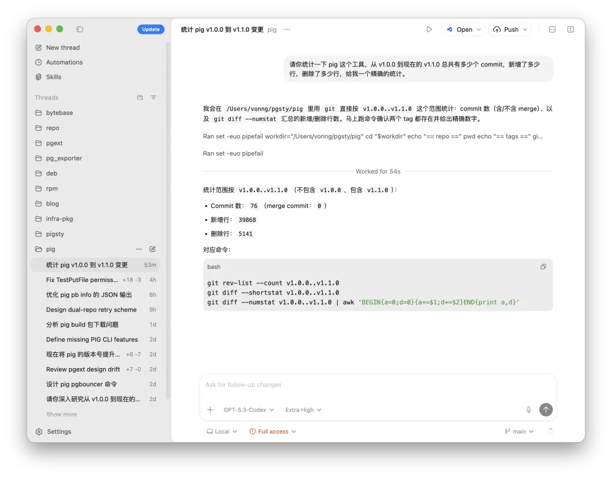

I did not publish much last week because I was busy stress-testing OpenAI Codex 3 xHigh.
With temporary double quota, I burned almost the full $200 budget running parallel sessions across more than ten Pigsty subprojects: core repo, CN/EN docs, blog, package manager, extension catalog, infra packages, RPM/DEB specs, and `pg_exporter` collectors.

Codex is now my primary tool. Claude Code is backup. GLM is fallback after hard quota caps.
I had some time today, so here is a direct field report.

------

## Codex 5.3: Does It Actually Deliver?

Short answer: **yes**.

My old issue with Codex was latency. Even small tasks felt slow.
In 5.3, whether due to inference stack changes or something else, responsiveness is materially better.
I now run 8 to 10 sessions in parallel, paired with [**Typelesss voice input**](https://mp.weixin.qq.com/s?__biz=MzU5ODAyNTM5Ng==&mid=2247490982&idx=1&sn=789e9d1fdb438574b5014b6187b8a087&scene=21#wechat_redirect), and it feels like command-and-control instead of chat.

Speed is nice, but the key improvement is reliability.
With decent prompts and constraints, Codex can play a solid mid-level engineer.
For code review, my rough estimate is about 95% precision: around 1 correction needed per 20 issues found.

I do not care much about benchmark leaderboards. I trust in-situ results.
My evaluation method is simple: **cross-scanning**.

Before [**Pigsty 4.0 release**](https://mp.weixin.qq.com/s?__biz=MzU5ODAyNTM5Ng==&mid=2247491076&idx=1&sn=812a90effed5dcc46c9930c953478fad&scene=21#wechat_redirect), I used Claude Code to scan and fix the codebase intensively for 2 to 3 weeks until no new issues surfaced.
After Opus 4.5 and Codex 5.3 launched, I had both re-scan the same repository.

Result: **Codex 5.3 xHigh** still found 20 to 30 additional issues.
**Claude Opus 4.6** did not uncover much new.
That is a practical capability gap.

Claude still has strengths: faster code generation and straightforward communication.
But on code quality, especially code review, Codex 5.3 xHigh currently has the edge.

------

## What I Use Codex and Claude For

Some people flex daily token burn numbers.
I do not care.
I reliably hit weekly limits on both Claude Code and Codex, mostly on Pigsty work.
If you want one metric: average daily output is roughly 4,000 LOC, with a subjective throughput gain around 20x.

My current focus is the `pig` CLI.
I am building it as an agent-native command surface over PostgreSQL, Patroni, PgBouncer, and pgBackRest, exposing context and capability maps in YAML/JSON for agents.
In about five days, this added roughly 40,000 lines of Go.

Pigsty is the most representative case, but not the only one.

My human role was limited: initial brainstorming, high-level direction, then acceptance.
After four days of autonomous loops, I ran smoke tests, extracted capabilities, iterated a few rounds, and shipped.

The operating loop was mostly mechanical:
CreateStory -> DevStory -> CodeReview -> FixThis.

I did not write a single line of implementation code in that cycle.

------

## If Coding Is Cheap, What Is Expensive?

Most vibe coding demos optimize for "looks like it works".
Shipping something **reliable** is much harder.

When code production is no longer scarce, two things remain scarce:

1. **Taste in design.**
2. **Reliability in acceptance.**

These are the two methods I use.

### Design: The Central Dogma for Software

I borrow the biology metaphor: **DNA -> RNA -> Protein**.
Software equivalent:

My workflow is BMAD, simplified in practice to BMA:

1. **Brainstorm**: define intent.
2. **Map**: convert intent into PRD, then EPICs and Stories.
3. **Act**: execute Stories iteratively.

The core rule: **do not code by impulse**.
No random local patching.
Start with top-level intent (DNA), produce specs (RNA), then generate code (protein).

That creates traceability and verifiability:
Every line maps to a Story, every Story maps to PRD, and PRD maps back to original intent.
Without that chain, you are doing craft, not engineering.
Craft works at low complexity. It collapses at scale.

### Acceptance: Agent-vs-Agent Adversarial Review

One agent doing both implementation and review is not enough.
Best practice is role separation with mutual checks.

My setup:
Claude Code handles prototyping and implementation.
Codex 5.3 handles review on uncommitted diffs and raises P0/P1/P2 findings.
Human judgment decides what is real and what is false positive.

- **Real issue**: confirm bug, fix immediately.
- **False positive**: if it is a feature or intent mismatch, force explicit comments/doc updates so the same confusion does not repeat.

After Codex review, I let Claude review Codex's proposed fixes.
Then iterate until convergence.
If they deadlock, I arbitrate.

This is plain checks-and-balances.
Two models with different architectures and training data are less likely to make the same mistake than one model alone.
No magic. Just cross-validation.

In practice, one Story usually runs through 3 to 8 review/fix rounds.
Final acceptance is still human.

You can predefine tests and boundaries.
Or, if you are lazy, have agents spin up Docker test environments, generate test cases, and rerun from different angles repeatedly.
Repeated probing surfaces edge-case failures surprisingly well.

I still run final smoke tests myself for Pigsty.
But most defects are already burned down in earlier loops.

Also, the basics still matter: pay down technical debt, refactor regularly, reduce complexity aggressively, remove dead code, and keep cascading docs/comments tight enough to prevent context drift.

------

## Where This Goes

Both methods point to the same shift:
**quality control has moved from coding to design plus acceptance**.
If agents can mass-produce code, the labor market follows.

My call: large-scale replacement of mid-level programmers is no longer speculative.
It is happening.

[**Where do new programmers go in the AI era?**](https://mp.weixin.qq.com/s?__biz=MzU5ODAyNTM5Ng==&mid=2247491053&idx=1&sn=e2be2db6fd4045201565d5acb0567b3a&scene=21#wechat_redirect)

Six months ago, junior replacement was obvious.
In early 2026, with this quality level from Codex, mid-level replacement is operational reality.
Senior replacement is likely a matter of time.

The role "programmer" may fade.
"Software engineer" remains.
Difference is simple:
Programmers write code.
Software engineers solve what to build, why to build it, and how to verify it.

Software may stop behaving like a "high-tech exception" industry and revert toward normal industrial dynamics.
A significant share of software jobs may disappear, while displaced talent diffuses into other industries.
That increases competitive pressure everywhere.

[AI ripped the software facade off](https://mp.weixin.qq.com/s?__biz=MzU5ODAyNTM5Ng==&mid=2247491134&idx=1&sn=abc9089d16faae9215d653aa3633e0d9&scene=21#wechat_redirect)

[Software meltdown: the middle layer gets flattened](https://mp.weixin.qq.com/s?__biz=MzU5ODAyNTM5Ng==&mid=2247491044&idx=1&sn=731cb7681895f7572b2ed1a0a6a1c161&scene=21#wechat_redirect)

### Who Wins, Who Gets Hit

The old software labor shape was spindle-like: few top experts, many mid-level engineers, many juniors.
AI pressure is concentrated in the middle.
In big tech terms, people around 3 to 5 years in are most exposed.

Senior experts, however, are entering a strong leverage window.
I expect this window to last at least about two years.

Counterintuitively, strong new grads may do well: lower cost, faster learning, less tooling lock-in.
My expectation for near-term software best practice is sub-10-person teams:
1 to 3 core experts, 6 to 7 interns/juniors, each augmented by 2 to 3 agents.

At the extreme, a top expert can orchestrate a swarm of agents and ship outsized projects solo.
"One Person Company" will become common.
Pigsty at this scale would have been impossible for me without AI.

------

I do not have much interest in evangelizing vibe coding.
Quiet compounding works better.

But the shift is real.
Plan accordingly.
