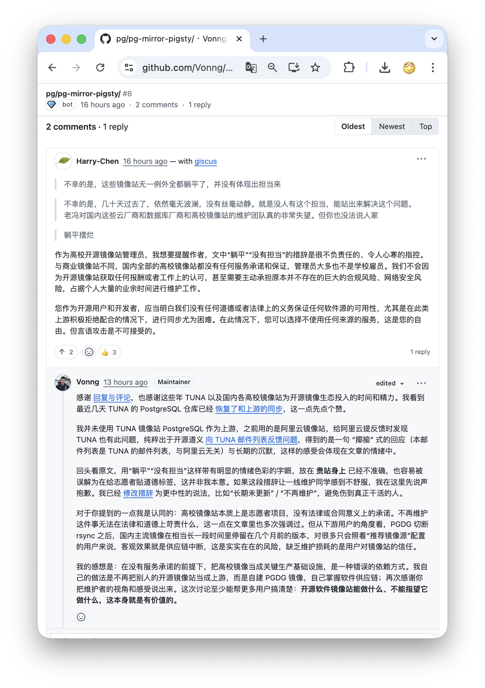
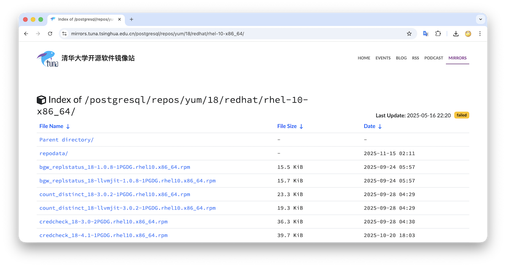
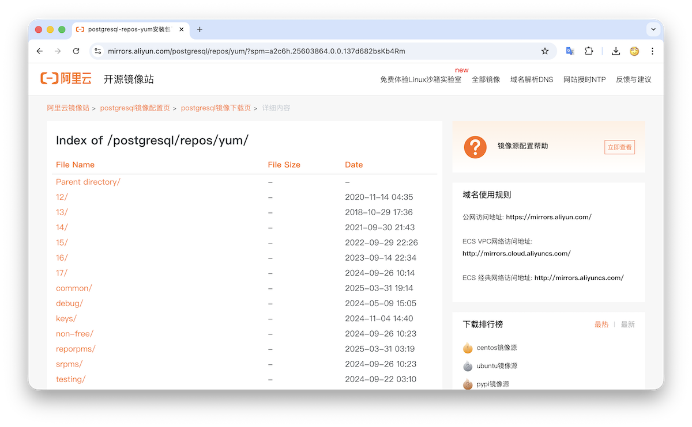
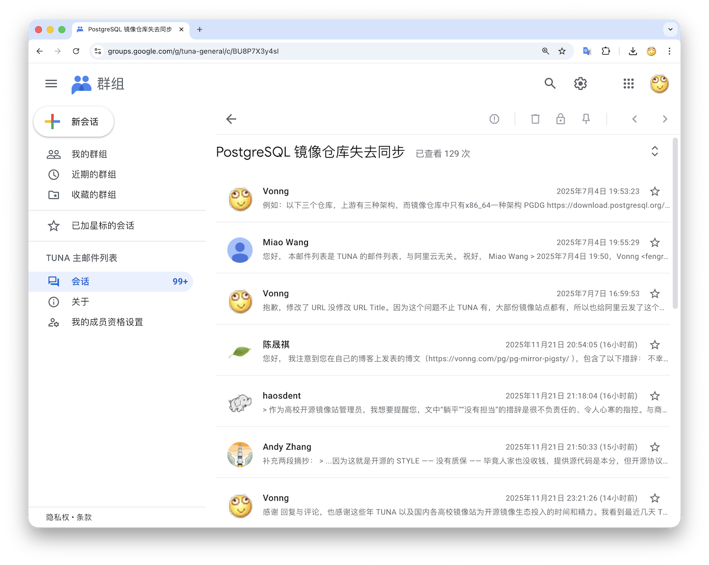
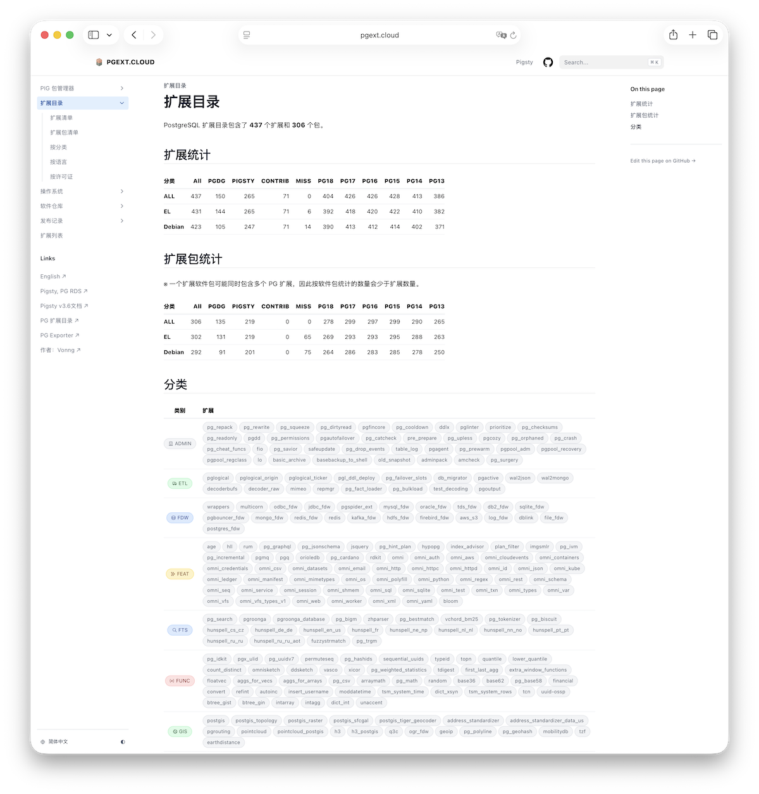

昨天，老冯的一篇文章《[从PG“断供”看软件供应链中的信任问题](/pg/pg-mirror-pigsty/)》收到一条评论，
评论者称是高校开源镜像站的管理员（清华 TUNA），向老冯提出批评抗议，内容如下：

> 作为高校开源镜像站管理员，我想要提醒作者，文中“躺平”“没有担当”的措辞是很不负责任的、令人心寒的指控。

老冯看到评论之后也做了回复：

> 感谢 [回复与评论](https://vonng.com/pg/pg-mirror-pigsty/)，也感谢这些年 TUNA 以及国内各高校镜像站为开源镜像生态投入的时间和精力。我看到最近几天 TUNA 的 PostgreSQL 仓库已经 [恢复了和上游的同步](https://mirrors.tuna.tsinghua.edu.cn/postgresql/repos/yum/18/)，这一点先点个赞。
> 
> 最初发现问题时，我用的是阿里云的 PostgreSQL 镜像。后来注意到 TUNA 上也存在同样的情况，就纯粹出于开源道义在 [向 TUNA 邮件列表反馈问题](https://groups.google.com/g/tuna-general/c/BU8P7X3y4sI)，得到的是一句（本邮件列表是 TUNA 的邮件列表，与阿里云无关）与长期的沉默，这样的感受会体现在文章的情绪中。
> 
> 回头看原文，用“躺平”“没有担当”这样带有明显的情绪色彩的字眼，放在 **贵站身上** 已经不准确，也容易被误解为在给志愿者贴道德标签，这并非我本意。如果这段措辞让一线维护同学感到不舒服，我在这里先说声抱歉。我已经 [修改措辞](https://github.com/Vonng/blog/commit/916697a88f143679d658dc52338827ce603444fd) 为更中性的说法，比如“长期未更新” / “不再维护”，避免伤到真正干活的人。
> 
> 对于你提到的一点我是认同的：高校镜像站本质上是志愿者项目，没有法律或合同意义上的承诺。不再维护这件事无法在法律和道德上苛责什么，这一点在文章里也多次强调过。但从下游用户的角度看，PGDG 切断 rsync 之后，国内主流镜像在相当长一段时间里停留在几个月前的版本，对很多只会照着“推荐镜像源”配置的用户来说，客观效果就是供应链中断，这是实实在在的风险，缺乏维护损耗的是用户对镜像站的信任。
> 
> 我的感想是：在没有服务承诺的前提下，把高校镜像当成关键生产基础设施，是一种错误的依赖方式。我自己的做法是不再把别人的开源镜像站当成上游，而是自建 PGDG 镜像，自己掌握软件供应链；再次感谢你把维护者的视角和感受说出来。这次讨论至少能帮更多用户搞清楚：**开源软件镜像站能做什么、不能指望它做什么，这本身就是有价值的。**

## 老冯的感想

收到消息后呢，我去清华 TUNA 源上看了一眼，PostgreSQL 仓库里已经有最新的 PG 18 的包了，不过 “Last Update” 时间戳还是 2025-05-16，应该是手工同步的。
总的来说是件大好事，除了老冯的 [PIGSTY 仓库](https://pgext.cloud) 之外，国内总算又多了一个能提供相对及时 PGDG 镜像的节点，这一点我要为 TUNA 点个赞。

其实在老冯的 PG 发行版 Pigsty 里，原来使用的是阿里云的 PostgreSQL 镜像站，并没有直接从 TUNA 拉 PG 包。
“躺平”“没有担当”这些情绪上的评价，最初更多是冲着阿里云这种有资源的大厂去的 —— [云计算泥石流](https://vonng.com/cloud) 的保留节目。
毕竟阿里云作为互联网大厂和本土云计算一哥，从开源攫取了巨大价值，搞个开源镜像站却长期不维护 PG 仓库，实属拉垮。
结果在这次风波里，反而是清华 TUNA 的同学先站出来表达了不同看法，这一点我也理解。

这里说一句公道话：不管是阿里云镜像站还是 TUNA 镜像站，我在原文里多次强调过 —— 作为免费的服务提供方，在法律和道德上确实没有义务去做这件“慈善”。
但这并不妨碍每个人对现实结果有自己的看法和评价。“躺平”“没有担当”是我当时的主观感受，现在回头看，用在高校志愿者身上，确实容易误伤人。
所以我已经把措辞调整为“停止维护”“长期未更新”这类事实性的表述，把情绪收回来，避免误伤一线维护的同学。

为什么老冯会有这种感觉呢？我在发现 [全球镜像站出现同步问题](/pg/pg-mirror-break) 之后，第一时间就 [给阿里云发邮件反馈了这个问题](/pg/pg-mirror-pigsty)（当然阿里云现在还没修）。
同时，我也顺手看了一圈国内其他镜像站，发现清华 TUNA 镜像站也有这个问题，就在他们的邮件列表里发了一封提醒。
结果有同学回复说：“*你发的这个是阿里云的问题，跟本站无关*”。我解释这是所有镜像站共有的问题，然后就再没有任何回应。

大概又等了一个月左右，老冯实在是不想等了，就自己搭建了 PGDG 中国区域的镜像仓库，放在腾讯云上，和 Pigsty 自己的仓库放一起。
移除了对阿里云 PostgreSQL 镜像站的上游依赖，至少在 PostgreSQL 制成品分发上，实现了完整的自主可控供应链。
老实说，如果不是因为国内镜像站在这件事上的整体表现，老冯可能也不会这么快去做这件事。

老冯嘴臭惯了，对云厂商说话一向不太客气，但这不意味着我不理解志愿者的难处 —— 
尤其是对于高校开源志愿者，整体上我觉得应该多一点呵护，少一点道德化的指责，这也是我后来主动调整措辞的原因。

## 开源与信任

实际上老冯自己也刚刚经历过类似的事情。我也维护了几个开源项目，还有不少 PostgreSQL 生态里的工具。
比如说 [pg_exporter](https://github.com/pgsty/pg_exporter) —— PG 的 Prometheus 指标导出器，有一些 PG 厂商也在用。
前天我才注意到，9月份有人在上面提了一个 [Issue](https://github.com/pgsty/pg_exporter/issues/79) 写到：

> 你好，虽然我知道这是一个开源项目，但我一个月前提交的两个问题至今仍未得到任何回应，这实在令人失望。  
> 我对 pg_exporter 1.0 版本以及 PG 邮件列表上的公告都充满期待，甚至考虑过贡献代码。  
> 但我不愿把希望寄托在一个维护者缺席的项目上。希望这只是暂时的，也希望他一切安好。  
> 我没有任何怨言，衷心祝愿这个项目和维护者一切顺利。

老冯九月份在新疆自驾了一个月，没怎么用电脑，Issue 点开看过但后面就忘掉了。
“缺乏维护” 导致这位用户对老冯的开源项目失去了信任，而他本来也许可以成为项目的贡献者。辜负了他的信任与期待，确实让老冯感到非常遗憾与愧疚。
所以我就放下手头的事儿，把他提的问题修了一遍，然后发布了一个新版本 [1.0.3](https://github.com/pgsty/pg_exporter/releases/tag/v1.0.3)。

将心比心，当我发现我所依赖的上游镜像站出现问题，而你反馈了也没人理、没人修时，我自己也会有这位用户一样的感受：

> “**我不愿把希望和信任寄托在一个维护者缺席的项目上**”。

## 软件供应链

在那篇《[从PG“断供”看软件供应链中的信任问题](/pg/pg-mirror-pigsty/)》中，老冯提出过一个观点：

> “开源” 确实并不要求你向用户提供可靠稳定的二进制制成品，**但真正重要的不是开源，而是信任**。  
> **开源只是构建信任的一种形式**，持续的投入，交付的承诺，专注的热情，面对问题的担当。  
> 想要成为值得信赖，受人尊敬的社区参与者，有许多东西比丢一份源代码到仓库要重要得多。

把开源镜像站办起来，说好听一点，也是某种公共慈善。这位管理员同学的委屈我是能理解的：
“我们又没拿报酬，还要扛合规和安全风险，牺牲个人时间来维护。你不说谢谢就算了，怎么反过来用‘躺平’‘没有担当’这样的词来说我们？”

这里有一个现实却不太好听的点：对维护者而言：“我没收钱，所以我没有义务”，在内心是一个很自然的防线；
但对用户而言：只要你把服务挂在公开的地址上，大家自然就会把它当成“某种可以依赖的基础设施”。**这种期待不甚合理，但是真实存在**。

镜像站与普通开源项目有一个重要区别：它处在软件供应链的中间 —— 是从上游到下游的通路，直接影响生产环境，
而不像单纯开源项目那样 “我写个工具，你爱用不用”。

而供应链天然就会出现分层：

- 有可靠的，有不可靠的；
- 有愿意给出承诺、出 SLA 的，也有只愿意尽力而为的；
- 有愿意把“这事算我头上”的，也有明确表示 “别指望我” 的。

做到好、长期维护、有清晰的预期管理，就会积累声望、信任、影响力，成为别人可以安心依赖的关键节点；
做不好，交付过时或不可靠的结果，自然也要面对用户信任的流失。

当这位同学写下：“***与商业镜像站不同，国内全部的高校镜像站都没有任何服务承诺和保证***” 这句话本身从维护者视角看，非常诚实。
但换一个视角 —— 生产运维负责人听到这句，大概会在脑子里立刻画一个叉：“没有任何服务承诺和保证，那就没法出现在生产供应链上游。”

所以，这篇文章不是要去指责镜像站 “没有担当”，而是要提醒下游用户 —— **在严肃的生产环境里，你不能依赖一个明确说“我不提供任何保证”的上游。**

## 质量与承诺

清华 TUNA 提供的很多镜像服务是有价值的。比如 pypi 和 homebrew 镜像，我个人电脑上就一直在用，它们完全胜任“加速访问”的角色。
在 Pigsty 的早期版本里，我也用过部分 TUNA 的 PostgreSQL 镜像。后来遇到过几次莫名其妙的 403 封禁，这对自动化部署来说不太友好，于是就全部改成阿里云的镜像了。

整体上看，阿里云镜像站过去的表现是比较稳定可靠的，直到这次 PGDG 切断 rsync 之后，PG 仓库一直停在几个月前的版本，至今还没有修复。
这件事客观上削弱了我对它的信任，所以我选择自己托管 PGDG 镜像，把这部分供应链从它身上剥离出去。
操作系统层面的镜像，我目前仍然在用阿里云。如果哪一天阿里云在 Linux 系统镜像上的表现也开始频繁翻车，那我也很可能会考虑自建 Rocky / Ubuntu / Debian 的镜像源。

在这件事情上：

- 清华 TUNA 管理员很坦率地表示：高校镜像站不提供服务承诺。这个立场本身没有问题，但下游看到这句话，自然会据此调整对你的使用边界；
- 阿里云没有明确说，但从过往表现来看，我们可以暂时把它当成“部分负责的大厂”：如果继续出问题，那老冯回去催它/批评它，或者在自己的体系里换掉它；
- 老冯的 Pigsty / PGDG APT / DNF 仓库，会明确给出承诺：如果仓库出问题，我会去修；如果修不好，那我自己信誉扫地，对付费客户来说，这也意味着 SLA 违约责任。

镜像站、仓库、发行版，这些都是“基础设施中的基础设施”。是否愿意为自己的服务说一句“出了问题算我头上”，决定了你在这个生态里的角色 —— 只是好心的志愿者，还是真正能被依赖的关键节点。

当高校镜像站把丑话说在前面，下游又应当如何自处？当别人告诉你“别指望我”，最稳妥的回应永远是“那我自己来”。

--------

## 广告时间

写文章不打广告约等于没写，也许老冯提供的服务正好能帮到你。以下三个国内镜像仓库，免费对公众提供服务：
这些仓库提供 Cloudflare 全球版本与国内云墙内版本，可以方便的使用 pig / apt / dnf 启用。
更详细的介绍请参考 https://pgext.cloud/repo .

### PGDG镜像

定期同步全球 PostgreSQL 开发组官方软件仓库（el 7-10, debian 11-13, ubuntu 20-24）
最近同步于今天，每周更新，中国大陆区域镜像地址： https://repo.pigsty.cc/apt/pgdg / https://repo.pigsty.cc/yum/pgdg

### PIGSTY PGSQL

PIGSTY PGSQL 仓库：提供 [几款不同风味的 PG 内核分支](https://doc.pgsty.com/pgsql/kernel) (PolarDB, IvorySQL, Babelfish, OrioleDB, OpenHaloDB, Percona TDE, Supabase,... )
，与 PGDG 官方仓库配合使用，提供多达 [437 个 PG 扩展插件](https://pgext.cloud/list) 与生态常用工具。支持 [14 个 Linux 发行版大版本](https://pgext.cloud/os)。

镜像地址： https://repo.pigsty.cc/apt/pgsql / https://repo.pigsty.cc/yum/pgsql

### PIGSTY INFRA

提供各类数据库相关工具，Grafana，Prometheus，以及 Exporter 可观测性全家桶

镜像地址： https://repo.pigsty.cc/apt/infra / https://repo.pigsty.cc/yum/infra

|                             **DBMS**                              |                |                               **Prometheus**                                |         |                                          **Grafana**                                           |        |
|:-----------------------------------------------------------------:|:--------------:|:---------------------------------------------------------------------------:|:-------:|:----------------------------------------------------------------------------------------------:|:------:|
|         [IvorySQL](https://github.com/IvorySQL/IvorySQL)          |      4.6       |           [prometheus](https://github.com/prometheus/prometheus)            |  3.7.3  |                         [grafana](https://github.com/grafana/grafana/)                         | 12.3.0 |
|              [etcd](https://github.com/etcd-io/etcd)              |     3.6.6      |          [pushgateway](https://github.com/prometheus/pushgateway)           | 1.11.2  |                            [loki](https://github.com/grafana/loki)                             | 3.1.1  |
|              [minio](https://github.com/minio/minio)              | 20250907161309 |         [alertmanager](https://github.com/prometheus/alertmanager)          | 0.29.0  |                [promtail](https://github.com/grafana/loki/releases/tag/v3.0.0)                 | 3.0.0  |
|                [mcli](https://github.com/minio/mc)                | 20250813083541 |    [blackbox_exporter](https://github.com/prometheus/blackbox_exporter)     | 0.27.0  |                   [vector](https://github.com/vectordotdev/vector/releases)                    | 0.51.1 |
|            [kafka](https://kafka.apache.org/downloads)            |     4.0.0      |    [VictoriaMetrics](https://github.com/VictoriaMetrics/VictoriaMetrics)    | 1.129.1 |         [grafana-infinity-ds](https://github.com/grafana/grafana-infinity-datasource/)         | 3.6.0  |
|            [duckdb](https://github.com/duckdb/duckdb)             |     1.4.2      | [VictoriaLogs](https://github.com/VictoriaMetrics/VictoriaMetrics/releases) | 1.37.2  |   [grafana-vmlogs-ds](https://github.com/VictoriaMetrics/victorialogs-datasource/releases/)    | 0.21.4 |
|         [ferretdb](https://github.com/FerretDB/FerretDB)          |     2.7.0      |             [pg_exporter](https://github.com/Vonng/pg_exporter)             |  1.0.3  | [grafana-vmetrics-ds](https://github.com/VictoriaMetrics/victoriametrics-datasource/releases/) | 0.19.6 |
|     [tigerbeetle](https://github.com/tigerbeetle/tigerbeetle)     |    0.16.60     |     [pgbackrest_ex...](https://github.com/woblerr/pgbackrest_exporter)      | 0.21.0  |     [grafana-plugins](https://github.com/pgsty/infra-pkg/tree/main/noarch/grafana-plugins)     | 12.0.0 |
|          [juicefs](https://github.com/juicedata/juicefs)          |     1.3.0      |        [node_exporter](https://github.com/prometheus/node_exporter)         | 1.10.2  |                                                                                                |        |
|           [dblab](https://github.com/danvergara/dblab)            |     0.34.2     |      [keepalived_exp...](https://github.com/mehdy/keepalived-exporter)      |  1.7.0  |                                              **UTILS**                                         |        |                            
|            [vray](https://github.com/v2fly/v2ray-core)            |     5.28.0     |   [nginx_exporter](https://github.com/nginxinc/nginx-prometheus-exporter)   |  1.5.1  |                          [sealos](https://github.com/labring/sealos)                           | 5.1.1  |
|                [pig](https://github.com/pgsty/pig)                |     0.7.2      |    [zfs_exporter](https://github.com/waitingsong/zfs_exporter/releases/)    |  3.8.1  |                      [rclone](https://github.com/rclone/rclone/releases/)                      | 1.71.2 |
| [vip-manager](https://github.com/cybertec-postgresql/vip-manager) |     4.0.0      |      [mysqld_exporter](https://github.com/prometheus/mysqld_exporter)       | 0.18.0  |                           [restic](https://github.com/restic/restic)                           | 0.18.1 |
| [pev2](https://github.com/pgsty/infra-pkg/tree/main/noarch/pev2)  |     1.17.0     |        [redis_exporter](https://github.com/oliver006/redis_exporter)        | 1.80.0  |                            [mtail](https://github.com/google/mtail)                            | 3.0.8  |  
|    [promscale](https://github.com/timescale/promscale)            |     0.17.0     |            [kafka_exporter](https://github.com/danielqsj/kafka_exporter)    |  1.9.0  |                  [genai-toolbox](https://github.com/googleapis/genai-toolbox)                  | 0.18.0 |
|         [pgschema](https://github.com/pgschema/pgschema)          |   1.4.2        |       [mongodb_exporter](https://github.com/percona/mongodb_exporter)       | 0.47.1  |                        [sqlcmd](https://github.com/microsoft/go-sqlcmd)                        | 1.8.0  |
|         

