最近几周老冯都在忙一件事，准备 Pigsty v4.0 —— 最主要的工作就是将 Prometheus 和 Loki 换为 Victoria 全家桶。**Victoria 是朴实无华的强悍** ——效果非常炸裂。这一部分已经完工，发布一个 Beta 版本让有需要的朋友先耍一耍。

## VictoriaMetrics 初体验

你可能没听说过 VictoriaMetrics，但肯定听说过 Prometheus —— 监控领域的事实标准。VictoriaMetrics 就是 Prometheus 的上位替代品。由白俄罗斯大神程序员 Aliaksandr Valialkin 单枪匹马搞出来，吊打业界的神器。

老冯还记得五年前在探探的时候，那时候我们的监控系统里有五千万左右的时间序列，用了十二台物理机（64C 256G）跑 Prometheus 集群。后来我把 Prometheus 换成了三节点的分布式 VictoriaMetrics，结果轻松扛下来了。后来我还试过，**一台顶配物理机也能扛住，这实在是太惊人了！**那时候我测试下来，VM 的内存/磁盘使用量是 Prometheus 的 1/4 ，查询性能则是 4x 左右，着实让我印象深刻。

业界有很多性能对比（Benchmark），VM 基本都吊打 InfluxDB 、Prometheus、TimescaleDB 的。不管是写入吞吐量还是高基数查询（High Cardinality），VM 都是碾压级的存在。

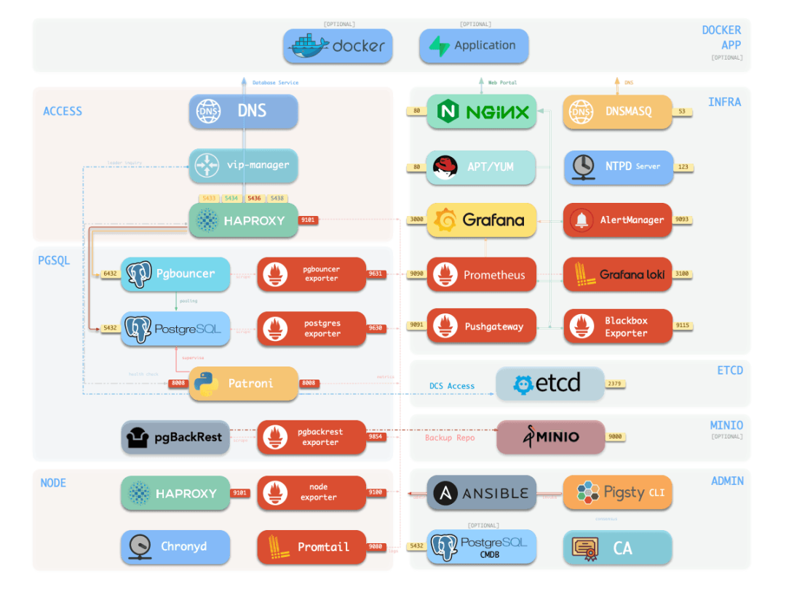

在 Pigsty 里面，我之前一直用 **Prometheus**，而 VM 作为专业版可选模块。不过最近有个契机，让我感觉有必要给 Pigsty 的监控基建也翻新一下了 —— 第一是原本使用的日志方案 Grafana Loki 和 Promtail 要淘汰了，想来想去还是得上 VictoriaLogs。第二是正好有个客户 —— **影视飓风** 要部署生产级别的 VictoriaMetrics，我就干脆一起搞了。

VictoriaMetrics 其实是一个全家桶，不仅仅可以替代 Prometheus，而且还有 VictoriaLogs 用于存储日志，VictoriaTraces 存储链路追踪，我想着干脆都一起上了吧。于是就在 Pigsty v4 中对 Infra 模块整个进行重写。

## 为什么要 Vicotira 全家桶？

在聊性能之前，老冯想先聊聊 VictoriaMetrics 背后的男人 —— Aliaksandr Valialkin（@valyala）。这哥们是白俄罗斯人，在搞 VictoriaMetrics 之前，他是一家广告技术公司 VertaMedia 的 CTO。

在 Go 语言社区里，他早就是个传奇人物了。他写的 **fasthttp** 库有 2.3 万 Star，性能是标准库 net/http 的 **10 倍**， 150 万并发连接，每秒 20 万请求。他的 **quicktemplate** 模板引擎比 html/template 快 **20 倍**，**fastjson** 解析器比 encoding/json 快 **15 倍**。

这些库有个共同的特点：**热路径零内存分配**。这也是 VictoriaMetrics 为什么这么猛的核心秘密 —— 同样的设计哲学贯穿始终。valyala 的代码风格就是两个字：**硬核**。不依赖第三方库，极致的内存管理，不仅算法牛逼，工程实现更是变态。所以 VM 继承了 ClickHouse 的衣钵：**快，省，稳**。它就像是数据库界的 AK-47，结构简单，皮实耐造，但火力极其凶猛。

valyala 这哥们还贼有个性，一个人单枪匹马搞出来的东西吊打业界，放群嘲 AOE ，关键他还是太有实力，直接贴脸用 Benchmark 噎的别人说不出话来。用实力说话就是这么带劲。老冯感觉和他很对脾气，惺惺相惜，经常在 X 上互赞

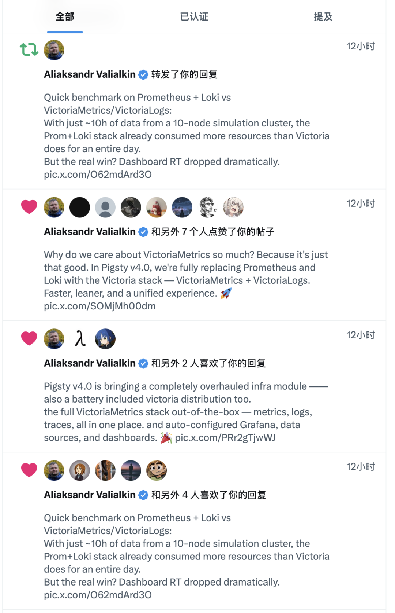

## Victoria 有多强

言归正传，简单来说，这次我弄了 10 个节点作为测试环境，收集所有的指标和日志。Pigsty v4.0 使用 VictoriaMetrics + VictoriaLogs，一天的数据量，12 万个时间序列用了 600 兆内存，11 亿个数据点占了 440MB 存储；50 万行日志占了 6MB 不到的存储。

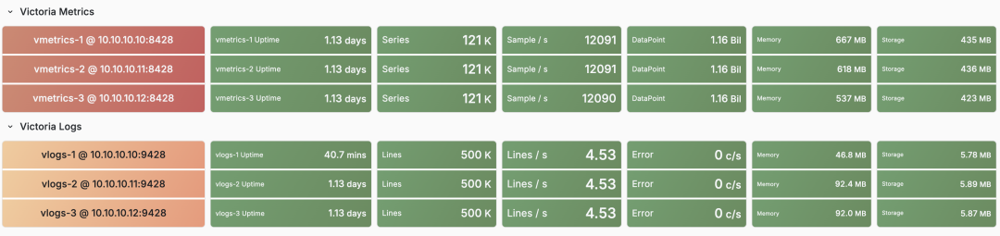

也就是说，整个监控基础设施，在充分监控十台物理机和数据库应用的情况下，（还要加上 Grafana，Alertmanager 这些）大概使用了 0.2 个 vCPU / 1GB 的资源。可谓是非常经济实惠了！

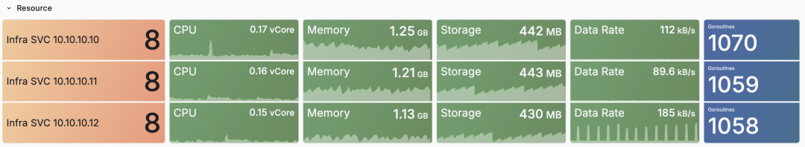

作为对比，我又运行 Pigsty v3.7 10 节点环境，使用原本的 Prometheus + Loki ，跑了才 10 个小时。资源使用情况如下。基本上已经接近/超过 VictoriaMetrics 全家桶了，主要是数据量太小，弄几百个节点这个差距会更明显。

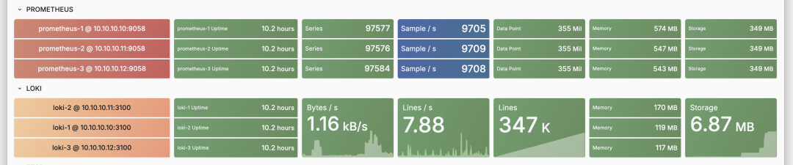

当然，要是说只是省点内存磁盘 CPU 啥的，我倒也没那么大兴趣去换。主要是查询响应时间也快了很多，这就不一样了，特别是 VictoriaLogs 相比 Loki，简直就是碾压式的降维打击。面板加载的速度肉眼可见的快了许多，那种上百个 Panel 的 Dashboard 也是瞬间全出，这个感觉实在是太爽了！


老冯自己的测试毕竟规模有限，业界三方数据更有说服力。下面是 Claude 汇总的一些测试用例。不是百分之几十几十的提升，都是几倍几倍的提升，朴实无华的强力。

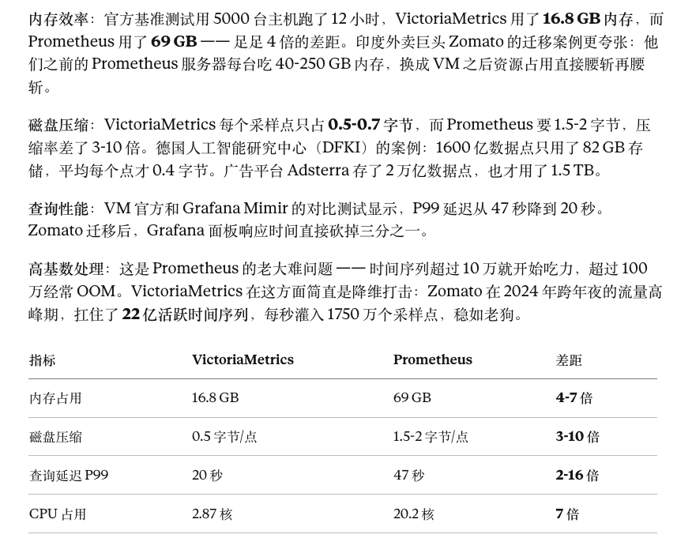


## Victoria 如何替代 Prometheus

有很多人问，VictoriaMetrics 运维复杂不复杂，从 Prometheus 迁移麻烦吗？老冯可以说，基本上是 "原位替代" —— 就是说，你把 VM 的二进制改个名字顶替掉 prometheus，它也能跑起来。

当然这么说其实是有点夸张了，毕竟还是有一点点小小的区别 —— 比如告警规则（Alert Rules）和预计算规则（Record Rules）其实是由一个单独的组件 VMAlert 来负责的，除此之外，它基本和 Prometheus 一模一样。你可以用一样的配置文件，用同样的 PromQL 查询 —— 当然有个别参数其实也有细微的区别，但都很简单。就一个二进制走天下，但也有分布式的集群版本。

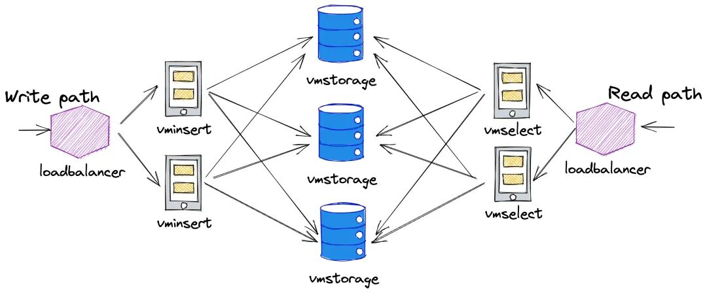

有人说，啊这个分布式集群的架构看上去好复杂。相信我，第一，其实也没啥复杂的，第二，你的量绝对用不上分布式 —— 如果你真有那个量，你现在应该已经早就在用 VictoriaMetrics 了。我们 5000 万时间序列单机搞定，你也没必要去折腾分布式的版本，想要冗余，简单的跑两个独立副本去抓就够了。

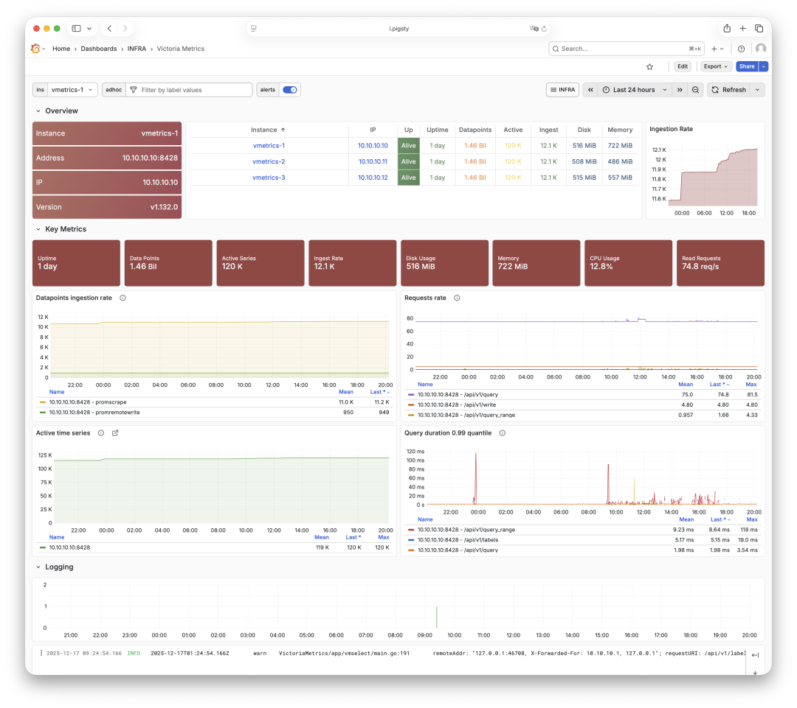

当然，VictoriaMetrics 有自己的查询语言 MetricsQL，但也兼容 PromQL。这个老冯就真的懒得改了 —— 那么多个 Dashboard 里面的查询语句，我可没兴趣改写。但好处就是，VictoriaMetrics 可以完美扮演一个 Prometheus，你的 Grafana 只需要简单改一个端口，就可以切换到 VictoriaMetrics。

### VictoriaLogs：从拖拉机到法拉利

如果说 VictoriaMetrics 替换 Prometheus 是 “很不错”，那么 VictoriaLogs 替换 Loki 就属于 —— **从拖拉机到法拉利**。我唯一后悔的是为啥没早点把 Loki 给下掉。当然，和 Loki 一起下掉的还有 Loki 配套的日志 Agent Promtail，这个日志收集组件烂尾了，2026 年弃用，这也是老冯这次升级的主要原因 —— 然后用 vector 给替换掉了。

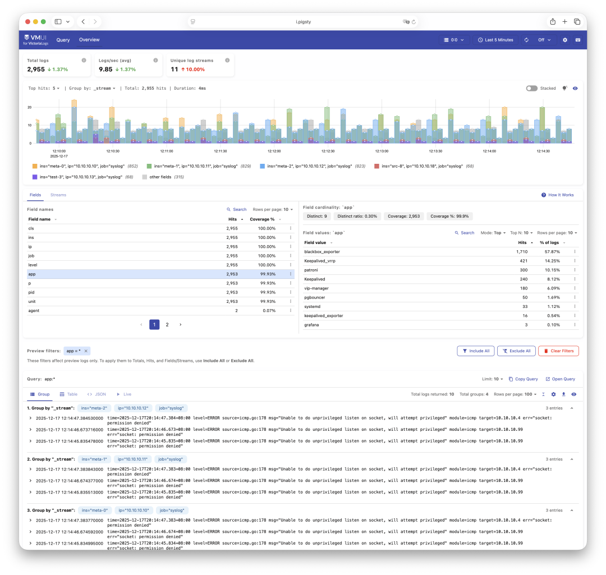

**为什么我看这 Loki 不爽很久了？**

Loki 的设计哲学是“不索引全文，只索引标签”。听起来很美好，但在大规模日志检索时，它本质上就是个**分布式的 Grep**。你要查几个关键字，它得把原本的数据块拉出来暴力扫描。数据量一上来，查询慢得让人怀疑人生，动不动就超时或者 OOM（内存溢出）。有时候日志面板时间范围拉大一点，就直接报错了。

而 VictoriaLogs 采用了类似 ClickHouse 的列存和 Bloom Filter 技术。它虽然也不搞全文索引（那样太费空间），但在过滤和定位数据块上做得极极极其高效。不仅快的一批，而且稳如老狗。10x 的性能力大砖飞，大力出奇迹。


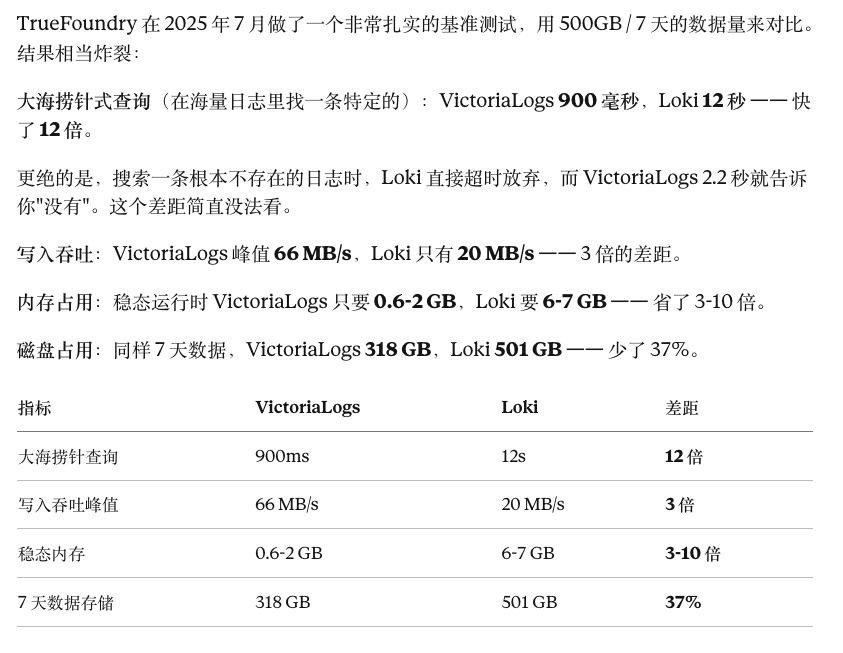


虽然 VLogs 不兼容 LogQL，使用的是自己的 **LogsQL**，但这一次，我把 Loki 的查询语句 **LogQL** 全部丢进了垃圾桶。LogsQL 明显要优雅，简洁的多：

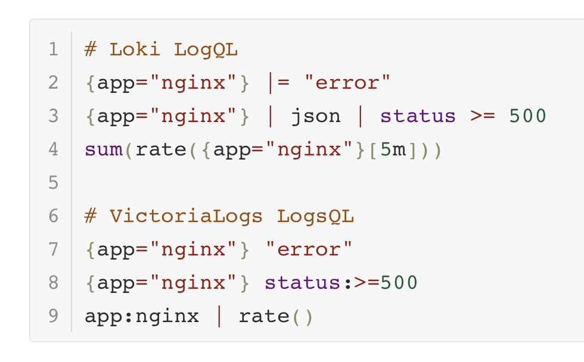

最爽的是，LogsQL 里 Stream Selector 是**可选的**。你可以直接写 `"error" "timeout"` 来全局搜索，不用像 LogQL 那样必须先指定标签。这在排查问题的时候太实用了 —— 很多时候你根本不知道错误会出现在哪个服务里。

如果你还在用 ELK 或者 Loki 这类古早日志方案，真的不如试一试力大砖飞的 VictoriaLogs。说不定连  ClickHouse 的活儿都能干掉一部分了。


### VictoriaTraces

可观测性三剑客，除了指标与日志，还有一个链路追踪（Traces）。老实说，老冯在基础设施和数据库监控里面基本上用不到 Traces。但反正就是加双筷子的事情， 也就顺手弄进来了。你就把他当成一个 Jaeger 用就好了。但这个项目是刚刚从 VictoriaLogs 里分支出来的，成熟度还有待观察，老冯自己也没场景验证。

除此之外，还有一些周边的工具，比如专门用来计算告警的 vmalert，可以独立使用的抓取组件 vmagent，日志收集组件 vlagent，还有备份恢复，auth，之类的各种工具，做的非常的细。企业版里还有降采样，异常检测之类的功能。不过企业版老冯就没啥兴趣折腾了，想要用，自己去下载买 license 吧，反正我觉得开源版够够的了。

## 我应该如何上手？

为了帮助用户上手 Victoria 全家桶，老冯还是为用户准备了不少好东西，第一个好东西是 APT / DNF 仓库，里面提供了 Victoria 全家桶的 RPM/DEB 包。单机版，集群版，工具包，Agent，Grafana 数据源，全都打包好了。免去你自己去 GitHub 上扒拉 Tarball，可以直接 yum / dnf install 完成安装。

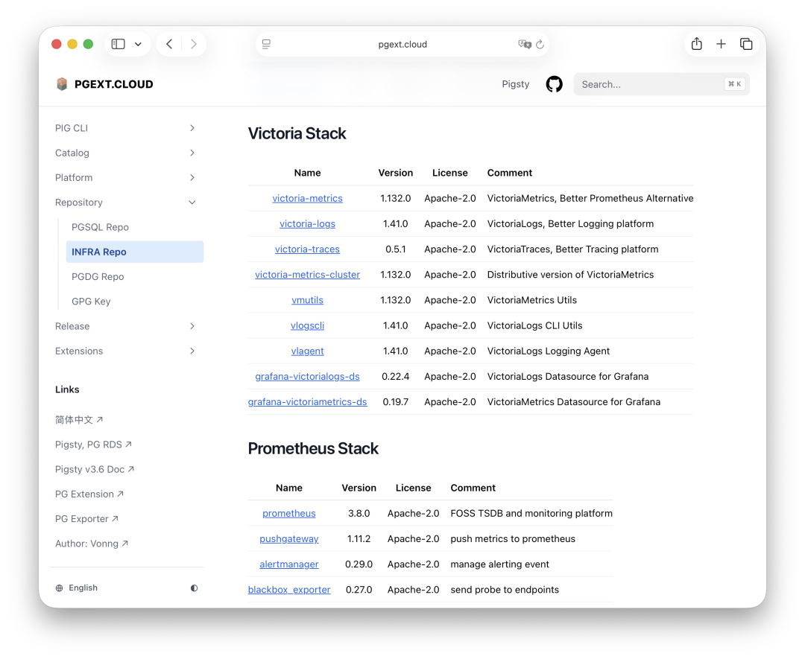

虽然 Pigsty v4 才正式切换到 Victoria 全家桶，但是 Pigsty Infra 仓库里面维护这些RPM/DEB 包已经很长时间了，久经生产考验。当然也顺便一提，这里面还有其他好东西，比如 Grafana / Prometheus / 对象存储全家桶。（[包括 MinIO 不再发布二进制后](https://mp.weixin.qq.com/s?__biz=MzU5ODAyNTM5Ng==&mid=2247490694&idx=1&sn=d79444d4b55d6d42133f88db84fa5e18&scene=21#wechat_redirect)，老冯还打了 2025-12 修完 CVE 的 RPM/DEB 包）


当然，即使是打好了包，从零开始部署 VM 全家桶还是需要不少工作的，设计目录，参考文档进行配置，接入 Grafana ，开发 Dashboard，Nginx 对接，证书申请，有很多很多脏活累活 —— 就算你用容器也一样省不了。所以老冯的 Pigsty 还有一个妙用，就是一键在 Linux 裸机上帮你拉起这套全家桶。


如你所见，所有服务都被 nginx 封装好了 （又省掉了一个 VMAuth 组件哈哈），统一通过 80/443 端口的 i.pigsty 服务对外暴露。 Nginx + Grafana + VMetrics + VLogs + Vtraces + VMALERT + Alertmanager —— 可观测性七件套，As your service! 整整齐齐一家人！

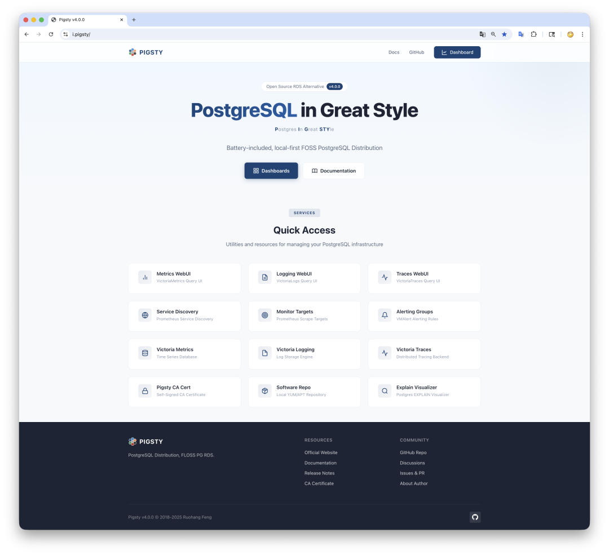

包括这些组件的自监控，也都配置好了。主机监控，Redis，PostgreSQL 这些也都带在里面了。你要把自己的 App 纳入监控，也完全可以很轻松的用添加配置文件的方式，将其加入进来。

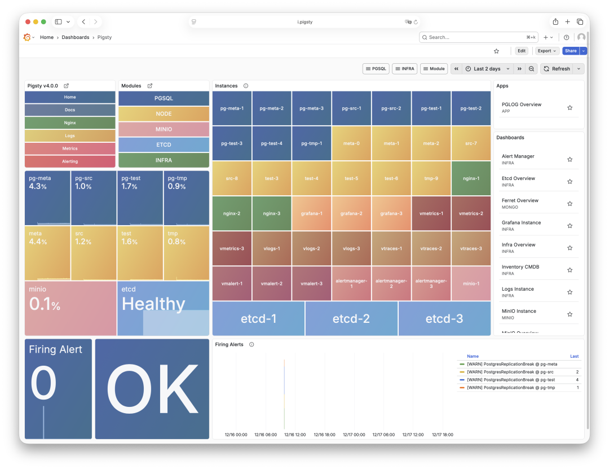

从某种意义上来说，现在的 Pigsty 不仅仅是一个 PostgreSQL 数据库发行版了，**还是一个 Observability 可观测性发行版！**


--------

## 快速上手

Pigsty v4 新增了一个配置文件，infra.yml ，这个模板里只会安装纯粹的 Victoria 全家桶，没有 PostgreSQL / ETCD 这些东西。如果你只是需要一个纯粹的 Vicotira 全家桶，只需要一键就可以在主流 Linux 上交付：

```bash
curl https://repo.pigsty.cc/beta | bash
./configure -c infra
./infra.yml
```

使用的配置文件如下，你可以加更多节点，部署更多副本。

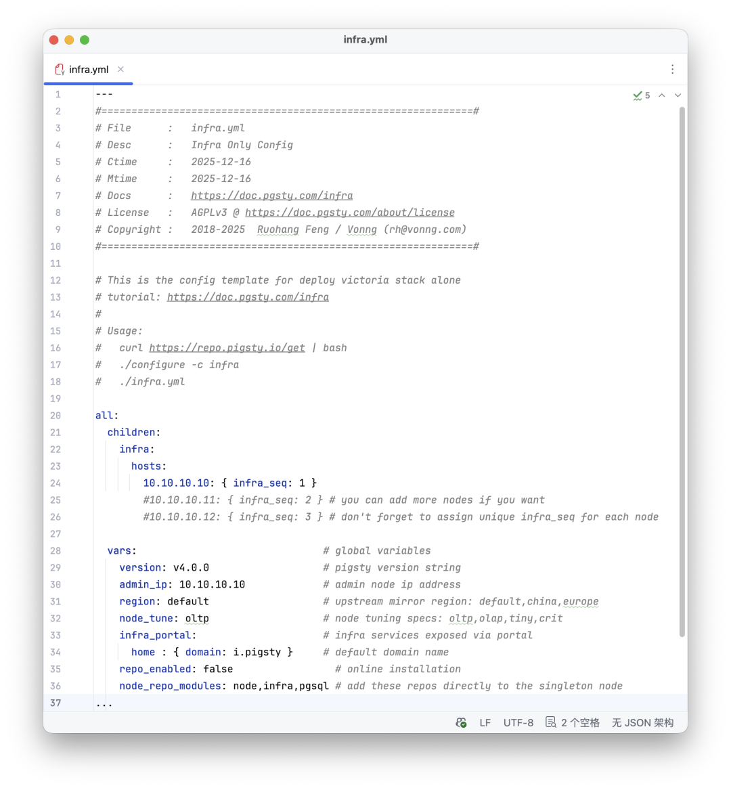

然后所有的东西都会自动为你设置好：

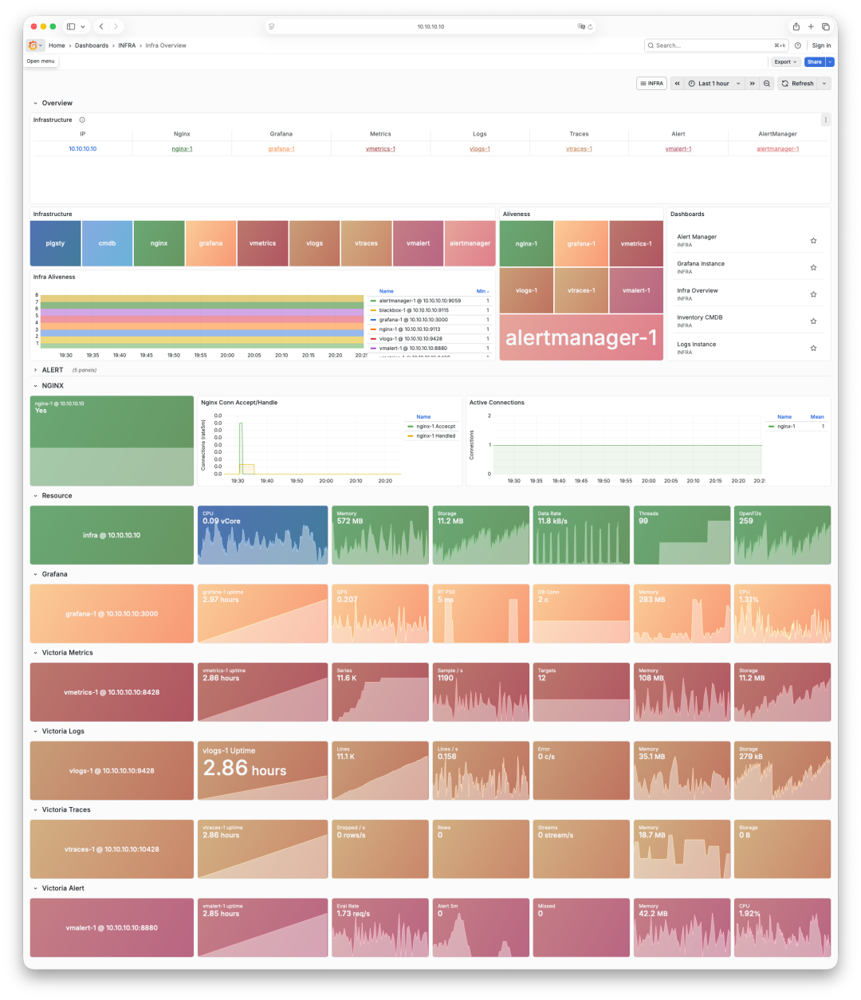

比如三个节点就是这个样子，三个都是独立副本可以独立使用。

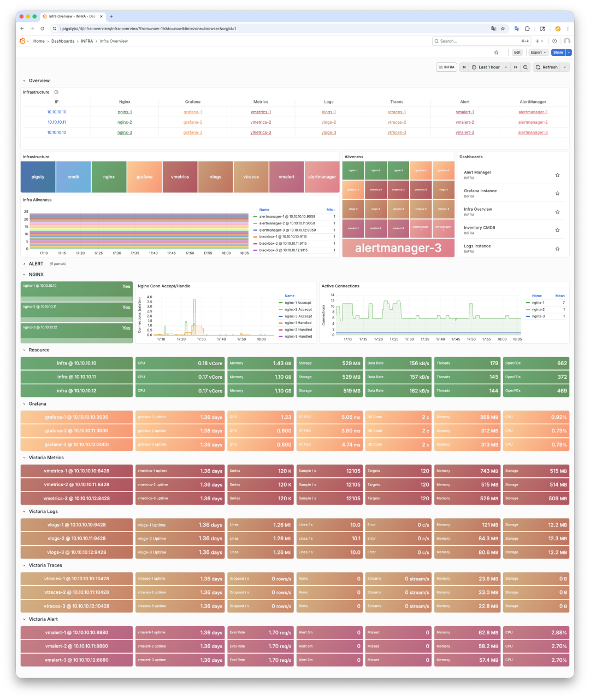

Pigsty v4 目前还在 Beta 阶段，但 Victoria 这一部分已经非常稳了，剩下的主要是 Dashboard 优化和文档编写。如果你想要尝鲜 Victoria 全家桶，这也许是最简单的方式。

Pigsty v4.0 正式版预计在 2026 年1月发布，届时会有更完整的文档和更多新特性介绍。有兴趣尝鲜的朋友可以先玩玩，有问题欢迎反馈。后续的版本中，也会添加 Victoria 原生分布式的支持。

## 写在最后

这次升级到 Victoria 全家桶，老冯自己也是受益者。每次打开 Grafana 看监控，那种丝滑的感觉，真的会让人心情愉悦。以前那种点一下要等好几秒的日志查询体验，现在回想起来简直是折磨。

VictoriaMetrics 这个项目，代表了开源软件一种很纯粹的形态 —— 一个技术大神凭借极致的工程能力，做出了吊打行业巨头的产品，然后用最宽松的许可证分享给全世界。没有风投压力，不玩 License 变脸，就是踏踏实实做产品，用实力吊打所有友商。这种项目，值得被更多人知道和使用。