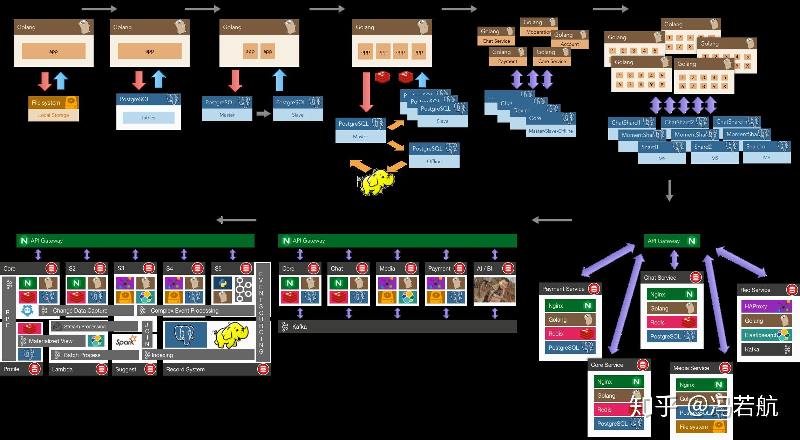
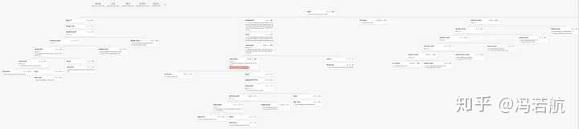
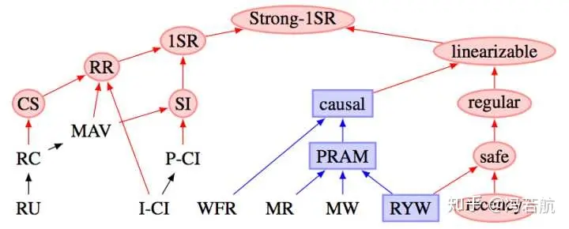

> Our school offers a database systems principles course. But I'm still confused. From the first few classes, the teacher started with a bunch of mind-numbing terms and concepts. I thought knowing "how to design and build tables" and "how to perform CRUD operations in MySQL" would be enough... So why do we need to understand relational schema representation, computation, normalization... conceptual models... mutual conversions between various models, and why do we need to know about relational algebra, Cartesian products... these theoretical knowledge? I'm very confused. What exactly is the purpose of this course or this textbook trying to teach students through these theoretical concepts?

Those who only know how to code are just programmers; **learn databases well, and you can at least make a living**; if you also master **operating systems and computer networks** on top of that, you can become a decent programmer. If you can further master discrete mathematics, digital circuits, computer architecture, data structures/algorithms, and compiler principles, plus rich practical experience and domain-specific knowledge, you can be considered an excellent engineer. (Don't argue about frontend being IO-intensive applications)

**Computers** are essentially three components: storage/IO/CPU; and **computing**, when you break it down, is just two things: **data and algorithms (state and transition functions)**. Among common software applications, except for various simulations, model training, and video games that belong to **compute-intensive applications**, the vast majority are **data-intensive applications**. In the most abstract sense, what these applications do is bring data in, store it in databases, and retrieve it when needed.

Abstraction is the most powerful weapon against complexity. Operating systems provide basic abstractions for storage: memory address space and disk logical block numbers. File systems provide a key-value storage abstraction that maps file names to address spaces. Databases, built on top of this foundation, provide **high-level abstractions for common storage needs in applications**.

In the real world, unless you're planning to build basic components from scratch, there aren't many opportunities to tinker with fancy data structures and algorithms (for data-intensive applications). Even coding skills might not be that important: there might only be one or two ad-hoc algorithms that need to be implemented at the application layer. Most requirements have ready-made solutions available, and the main creative work is often in **data model design**. In actual production, **database tables are data structures, and indexes and queries are algorithms.** Application code often plays the role of **glue**, handling IO and business logic, while most other work is **moving data between data systems**.

In the broadest sense, **wherever there is state, there are databases**. They are everywhere: behind websites, inside applications, in standalone software, in blockchains, and even in web browsers - the furthest from databases - we gradually see their embryonic forms: various state management frameworks and local storage. A "database" can be as simple as a hash table in memory or a log on disk, or as complex as an integration of multiple data systems. **Relational databases are just the tip of the iceberg** (or the peak of the iceberg) of data systems. In reality, there are various data system components:

- **Databases**: Store data so that you or other applications can find it again later (PostgreSQL, MySQL, Oracle)
- **Caches**: Remember results of expensive operations to speed up reads (Redis, Memcached)
- **Search indexes**: Allow users to search data by keywords or filter data in various ways (ElasticSearch)
- **Stream processing**: Send messages to other processes for asynchronous processing (Kafka, Flink)
- **Batch processing**: Periodically process large volumes of accumulated data (Hadoop)

One of the most important abilities of an architect is understanding the performance characteristics and application scenarios of these components, being able to flexibly weigh trade-offs and integrate these data systems. Most engineers won't build storage engines from scratch because when developing applications, databases are already perfect tools. Relational databases are the most widely used components among all data systems - they're the programmer's main breadwinner, and their importance is self-evident.

**Understanding the WHY is more important than understanding the HOW**. But a regrettable reality is that for most students, and even a considerable portion of companies, the real problems they encounter could probably be handled by a few files or even in-memory storage (requirements are simple enough that low-level abstractions can handle them). **Without opportunities to encounter the problems databases really solve, it's hard to have genuine motivation to use and learn databases, let alone database principles**. Only when hardware and software failures turn data into a mess (reliability); when single tables exceed memory size and concurrent users increase (scalability); when code complexity explodes and development gets bogged down (maintainability) - only then do people truly realize the importance of databases. So I understand the predicament of current cramming education: after starting work, it's hard to have such large chunks of complete time to learn principles, so teachers have to force-feed first, at least giving students some impression of this knowledge. When students encounter these problems after joining the workforce, they might remember learning something called **databases** in college, and this knowledge will start to ruminate.

----------------

Databases, especially relational databases, are very important. So why study their principles?

For **excellent** engineers, merely **using** databases is far from enough. Learning principles doesn't provide much benefit for being a CRUD developer, but when **general-purpose components really can't solve the problem** and you need to roll up your sleeves and build something yourself, how do you farm without fertilizer? When designing systems, **understanding principles allows you to write more reliable and efficient code with minimal complexity cost; when encountering difficult problems that need troubleshooting, understanding principles brings precise intuition and deep insights.**

Databases are a vast and profound field encompassing storage, I/O, and computation. Their main principles can be roughly divided into several parts: data model design principles (application), storage engine principles (foundation), index and query optimizer principles (performance), transaction and concurrency control principles (correctness), and fault recovery and replication system principles (reliability). All principles exist for a reason: to solve real problems.

For example, **normalization theory** in **data model design** was proposed to solve the problem of **data redundancy** - **it's about doing things elegantly (maintainability)**. It's an important design trade-off in model design: generally speaking, **less redundancy means lower complexity/stronger maintainability, while more redundancy means better performance**. For instance, if you use redundant fields, what originally required one SQL statement for updates now requires two SQL statements to update two places, requiring consideration of multi-object transactions and possible race conditions during concurrent execution. This requires careful weighing of pros and cons to choose the appropriate normalization level. **Data model design is data structure design in production.** **Without understanding these principles, it's difficult to extract good abstractions, and other work becomes impossible.**

The principles of relational algebra and indexes play important roles in query optimization - **they're about doing things fast (performance, scalability)**. When data volumes grow larger and SQL becomes more complex, their significance becomes apparent: **how to write equivalent but more efficient queries?** When query optimizers aren't that intelligent, humans need to do this work. **Such optimizations often have extremely low cost but huge benefits**. For example, a KNN query that takes several seconds can be optimized to within 1 millisecond by rewriting the query and creating a GIST index if you understand R-tree index principles - a thousand-fold performance improvement. **Without understanding index and query design principles, it's difficult to fully utilize database performance.**

**Transaction and concurrency control principles are about doing things correctly (reliability)**. Transactions are one of the greatest abstractions in data processing. They provide many useful guarantees (ACID), **but what do these guarantees actually mean?** Transaction **atomicity** allows you to abort transactions and discard all writes at any time before committing. Correspondingly, transaction **durability** promises that once a transaction is successfully committed, any written data won't be lost even if hardware failures or database crashes occur. This makes error handling incredibly simple: either succeed completely or fail and retry. With this "undo pill," programmers no longer have to worry about crashes halfway through leaving behind horrific accident scenes.

On the other hand, transaction **isolation** ensures that concurrently executing transactions cannot affect each other (Serializable). Databases provide different isolation levels for programmers to **trade off between performance and correctness**. Writing concurrent programs isn't easy. Under loads of tens of thousands of TPS, all kinds of extremely low-probability, mind-boggling problems appear: transactions stepping on each other, lost updates, phantom reads and write skew, slow queries dragging down fast queries causing connection pile-ups, single-table database performance deteriorating rapidly with increased concurrency, and even mysterious hiccups when both fast and slow queries decrease but their proportions change. These problems lurk under low loads and suddenly jump out as scale increases, giving you big surprises. The [various anomalies](https://github.com/ept/hermitage) that can actually occur in reality are far more complex than the few simple exceptions in SQL standards. **Not understanding transaction principles means application correctness and data integrity may suffer unnecessary losses.**

Fault recovery and replication principles might not be as important for programmers, but architects and DBAs must understand them clearly. High availability is a goal many applications pursue, but what is high availability, and how is it guaranteed? Read-write separation? Fast-slow separation? Multi-region active-active? Multi-site multi-center? The core technology underneath is actually **replication** (plus **automatic failover**). There are endless pitfalls here: various mysterious phenomena caused by replication lag, network partitions and split-brain, transactions in doubt, blah blah. **Without understanding replication principles, high availability is out of the question.**

For some programmers, databases might just be "CRUD," wrapped in interfaces, and principles seem like "dragon-slaying skills." If you stop here, then principles indeed aren't worth learning, but those with ambition should have the spirit of getting to the bottom of things. I personally believe that knowing only your own domain isn't enough - only by thoroughly understanding the upper-level domains your current field relies on can you be called an expert. In front of databases, backend is also frontend; for the programmer's knowledge **stack**, databases are an appropriate bottom layer.

------------------

Above we talked about **WHY**, now let's discuss **HOW**

A contradiction in database education is: **If you can't even use databases, what's the point of learning database principles?**

The principle for learning databases is **learning for practical use**. **Only practice can bring deep understanding of problems; only by knowing what before knowing why.** You can skim through textbooks first, then go directly to database documentation, get hands-on experience using databases, and build something. Through practice, master database usage, then learning principles will be twice as effective (and full of motivation). For learning, internships are of course best if you have the opportunity, but without such conditions, the best approach is to **create scenarios yourself and discover requirements yourself.**

For example, start by solving personal needs: managing personal passwords, weight tracking, bookkeeping, making a small website, an online chat mini-program. When it evolves to become more and more complex, with multiple users and various annoying problems, you'll start to realize the significance of **transactions**.

Another example: combine with web scraping, grab some housing prices, stock prices, geographical, social network data and store it in databases for mining and **analysis**. When you accumulate more and more data and analysis queries become more complex; when SQL becomes unreadable and runs pig-slow, relational algebra theory can guide you to further optimize.

When you realize these designs are meant to solve real production problems and have personally encountered these problems, then studying principles can provide mutual verification and understanding of the why. When you find query time grows exponentially with data growth; when you encounter thousands of users reading and writing simultaneously and are overwhelmed by concurrency control; when you encounter hardware and software failures that turn data into mush; when you discover data redundancy causes code complexity to explode rapidly - you'll discover the significance of these designs.

Textbooks, books, documentation, videos, mailing lists, and blogs are all great learning resources. For textbooks, the black-cover series from Huazhang are quite good, "Database System Concepts" is excellent. But I recommend first reading this book: [**Designing Data-Intensive Applications**](https://github.com/Vonng/ddia), which is excellently written - I thought it was so good that I voluntarily translated it. "What you get on paper is shallow, and you must practice to truly understand." Practice yields true knowledge. For newcomers, which database to choose? I personally recommend PostgreSQL, the world's most advanced open-source relational database - elegant design and powerful functionality. For evangelism, please welcome Brother De: https://github.com/digoal/blog. If you have time, you can also look at Redis - simple and readable source code, very commonly used in practice, and you should learn more about non-relational databases too.

Finally, although relational databases are powerful, they're not the end of data processing - try as many different types of databases as possible.

> Original Zhihu question: [Why do computer science students need to learn database principles and design?](https://www.zhihu.com/question/273489729/answer/377084748)